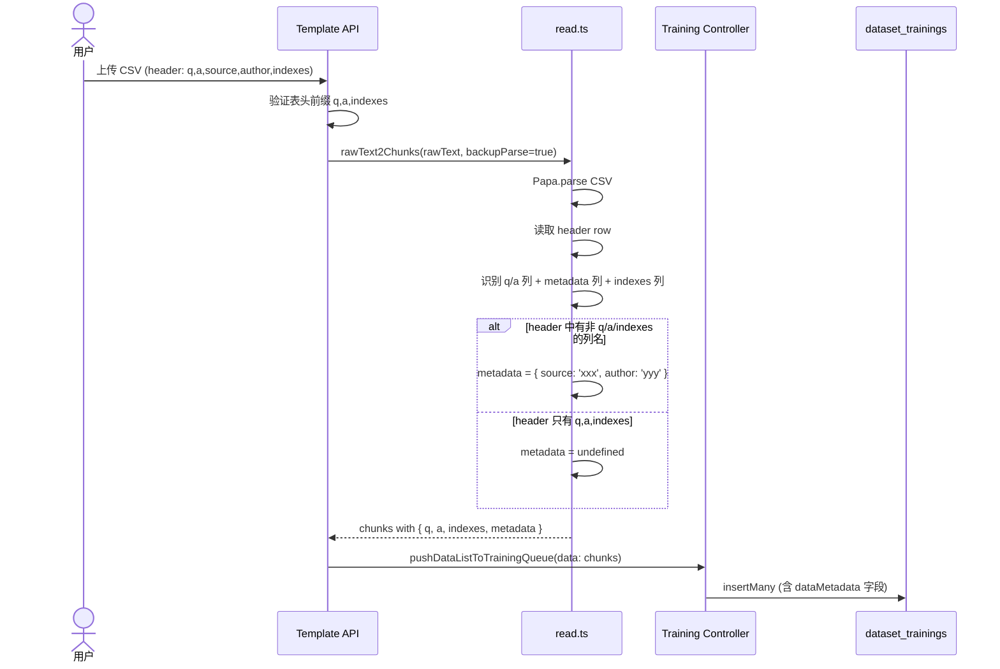
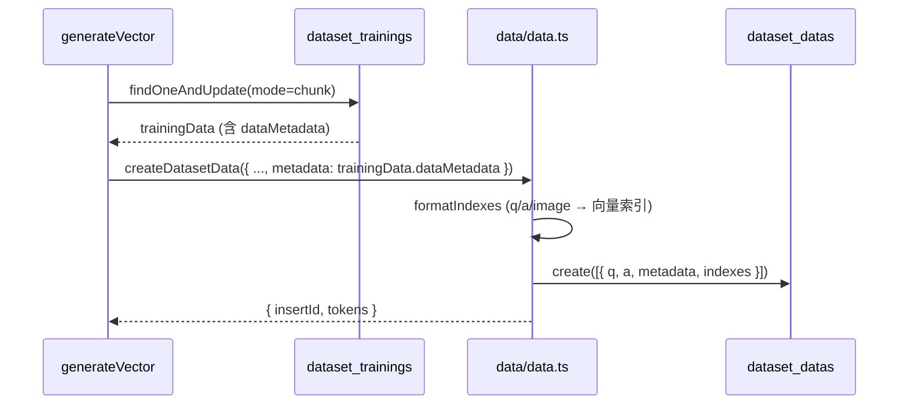

# FastGPT dataset_data 增加 metadata 字段 微型设计说明书

> **[AI读取引导]** 本文档描述 `dataset_data` 集合新增 `metadata` 字段（object 类型，可为空）的设计方案。AI 读取本文档可获取：改动目的与方案、修改位置与方法、接口/数据结构变更、异常处理策略、关联影响分析、关键测试用例。

---

## 高密度摘要

> **[抗上下文衰减]** 本节是全文关键信息的前置索引。

**改动类型：** ☑ 功能型（小功能新增）

**改动一句话描述：** `dataset_data` 集合新增 `metadata` 字段（`z.record(z.string(), z.any()).optional()`），支持从模板 CSV 导入时自动解析元数据列，在训练流程中持久化存储，并在知识库检索输出、pushData、get API 中透出。

**涉及模块/文件：**

| 层级 | 文件 | 改动概要 |
|------|------|----------|
| Zod 类型定义 | `packages/global/core/dataset/type.ts` | `DatasetDataSchema`、`DatasetDataItemSchema`、`CreateDatasetDataPropsSchema`、`UpdateDatasetDataPropsSchema` 新增 `metadata` |
| pushData Schema | `packages/global/openapi/core/dataset/data/api.ts` | `PushDataChunkSchema`、`GetDataListItemSchema` 新增 `metadata` |
| MongoDB Schema | `packages/service/core/dataset/data/schema.ts` | 新增 `metadata: { type: Object }` |
| Training MongoDB | `packages/service/core/dataset/training/schema.ts` | 新增 `dataMetadata: { type: Object }`（与 data 层的 metadata 区分命名） |
| CSV 模板解析 | `packages/service/core/dataset/read.ts` | `parseDatasetBackup2Chunks` 解析非 q/a/indexes 列为 metadata |
| 训练入队 | `packages/service/core/dataset/training/controller.ts` | 传递 metadata |
| 向量生成 | `projects/app/src/service/core/dataset/queues/generateVector.ts` | `insertData`/`rebuildData` 传递 metadata |
| 数据操作 | `projects/app/src/service/core/dataset/data/data.ts` | `createDatasetData` 接受并存储 metadata |
| 检索输出 | `packages/service/core/dataset/search/defaultRecall/result.ts` | `buildSearchResultItem` 透出 metadata |
| 模板导出 | `projects/app/src/pageComponents/dataset/detail/CollectionCard/TemplateImportModal.tsx` | 模板表头更新 |

**全局强约束（必须遵守）：**
- **必须**：所有章节不得为空；如不涉及须说明原因
- **必须**：§4 关联分析不得省略，即使认为"无影响"也须显式说明分析过程
- **必须**：验证点/验证案例须客观可执行（可用 ✅/❌ 判定）
- **禁止**：用本文档替代需要做概要设计的较大功能改动

---

# 1. 介绍

## 1.1 目的

为 `dataset_data` 增加 `metadata` 字段，允许用户在导入数据时附带自定义元数据（如来源、作者、标签、时间戳等），并在检索结果中透出这些元数据，便于下游节点（如 LLM 节点、HTTP 节点）引用。

## 1.2 定义和缩写

| 缩写/术语 | 定义 | 备注 |
|---|---|---|
| metadata | 附加元数据，`Record<string, any>` 类型，可为空 | 不参与向量索引，仅为透传字段 |
| template CSV | 用户通过模板导入的 CSV 文件 | 表头格式：`q,a,[metadata 列名...],indexes` |
| PushData | 通过 API 推送数据到训练队列 | POST `/api/core/dataset/data/pushData` |

## 1.3 参考和引用

1. 需求口头描述：dataset_data 增加 metadata 字段
2. `packages/global/core/dataset/type.ts` — 现有 Zod 类型定义
3. `packages/service/core/dataset/read.ts` — `parseDatasetBackup2Chunks` 现有 CSV 解析逻辑

---

# 2. 模块方案概述

## 2.1 改动背景与目标

**问题描述：** 当前 `dataset_data` 仅有 `q`（主文本）、`a`（补充文本）、`imageId`（图片）和 `indexes`（索引），无法携带自定义元数据。在知识库检索节点输出中，下游节点只能拿到 q/a 内容，缺乏结构化的元信息。

**改动目标：**

| 目标项 | 描述 |
|---|---|
| 功能目标 | `dataset_data` 新增 `metadata` 字段，全链路支持（导入、训练存储、检索输出、pushData、get API） |
| 兼容性目标 | 完全向后兼容，metadata 为 optional 字段，旧数据自动兼容 |
| 质量目标 | 不破坏现有模板导入逻辑（旧 CSV `q,a,indexes` 仍可正常导入） |

## 2.2 方案设计

**方案描述：**

1. **字段定义**：`metadata` 类型为 `Record<string, any>`，在 MongoDB 中以 `Object` 存储，默认值为 `undefined`/不存储（节省空间）
2. **模板导入**：CSV 解析时读取表头，`q`、`a` 列保持不变，`indexes` 列继续作为索引文本，其余列名作为 metadata key，对应行的值作为 metadata value
3. **全链路透传**：模板 → 训练队列 → 向量生成 → `dataset_data` 写入 → 检索输出 → API 返回，每一环都透传 metadata
4. **不参与索引**：metadata 不参与向量索引和全文检索，仅作为数据的附属信息

**方案选型：**

| 方案 | 优点 | 风险和缺点 | 最终选择 |
|---|---|---|---|
| A: metadata 挂在 DatasetDataSchema/DatasetDataItemSchema 上，不入 DatasetDataFieldSchema | 不被版本历史继承，语义准确，改动最小 | 需在两处各加一次字段 | ☑ |
| B: metadata 放入 DatasetDataFieldSchema | 一处定义，所有子类型自动继承 | 版本历史(DatasetDataHistorySchema)也会带上 metadata，语义不准确且浪费存储 | ☐ |

## 2.3 方案对现有设计的影响概述

- 纯增量字段，对现有功能零破坏
- 旧 CSV `q,a,indexes` 格式完全兼容（无额外列名 → metadata 为空）
- `SearchDataResponseItemSchema` 通过继承 `DatasetDataItemSchema` 自动获得 metadata
- `DatasetCiteItemSchema`（引用数据格式）需单独评估是否加 metadata

---

# 3. 模块详细设计

## 3.1 补丁/移植型修改明细

不涉及（功能型改动）。

---

## 3.2 功能型改动设计

### 3.2.1 接口变更

**变更接口（仅说明变更内容）：**

| 接口名称 | 变更类型 | 变更内容 | 向后兼容性 |
|---|---|---|---|
| GET `/api/core/dataset/data/detail` | 新增字段 | Response 新增 `metadata` 字段 | 完全兼容（新增可选字段） |
| POST `/api/core/dataset/data/pushData` | 新增字段 | Request `data[].metadata` 新增 | 完全兼容（可选字段） |
| 知识库检索节点输出 `quoteQA` | 新增字段 | 每条结果新增 `metadata` | 完全兼容 |

**消息接口变更：** 不涉及。

### 3.2.2 内部流程设计

#### 3.2.2.1 模板 CSV 导入流程

**流程描述：** 用户上传 CSV 模板文件，系统解析表头，将非 `q`/`a`/`indexes` 的列名和对应值提取为 metadata，随数据进入训练队列。

**流程图：**



**详细步骤说明：**

| 步骤 | 类型 | 处理内容 | 涉及模块/函数 | 异常处理 |
|---|---|---|---|---|
| 1 | [内部] | 接收 CSV 文件，Papa.parse 解析 | `read.ts : rawText2Chunks` | 解析失败返回错误 |
| 2 | [内部] | 读取 header row（第一行） | `read.ts : parseDatasetBackup2Chunks` | header 为空 → 当作无 metadata 处理 |
| 3 | [内部] | 遍历 header，标记各列类型（q/a/indexes/metadata） | `read.ts : parseDatasetBackup2Chunks` | 列名去空白后匹配 |
| 4 | [内部] | 遍历数据行，构建 metadata object，仅保留非空值的列。所有 metadata 列均为空时 metadata 为 undefined（不存储） | `read.ts : parseDatasetBackup2Chunks` | 空值列跳过 |
| 5 | [内部] | 传递到训练队列 | `training/controller.ts : pushDataListToTrainingQueue` | 正常透传 |

#### 3.2.2.2 训练写入 dataset_data 流程

**流程描述：** 向量生成队列从 `dataset_trainings` 消费任务，创建或重建 `dataset_data` 时写入 metadata。



**详细步骤说明：**

| 步骤 | 类型 | 处理内容 | 涉及模块/函数 | 异常处理 |
|---|---|---|---|---|
| 1 | [内部] | 从训练队列获取任务 | `generateVector.ts` | 无任务时退出循环 |
| 2 | [内部] | 将 trainingData.metadata 透传给 createDatasetData | `generateVector.ts : insertData` | metadata 为 undefined 时正常跳过 |
| 3 | [内部] | MongoDatasetData.create 写入 metadata | `data/data.ts : create` | MongoDB 写入失败回滚事务 |

---

### 3.2.3 数据结构变更

#### 3.2.3.1 数据库 Schema 变更

**MongoDB collection: `dataset_datas`**

```javascript
// 变更类型：新增字段
// 变更说明：为 dataset_data 新增 metadata 对象字段，用于存储自定义元数据
// 所属仓库：FastGPT

// ========== 变更脚本 ==========
// Mongoose Schema 新增（packages/service/core/dataset/data/schema.ts）：
// metadata: { type: Object }

// ========== 回滚脚本 ==========
// 删除 metadata 字段：db.dataset_datas.updateMany({}, { $unset: { metadata: "" } })
```

**MongoDB collection: `dataset_trainings`**

```javascript
// 变更类型：新增字段
// 变更说明：训练队列需暂存 dataMetadata，供向量生成阶段写入 dataset_datas.metadata

// ========== 变更脚本 ==========
// Mongoose Schema 新增（packages/service/core/dataset/training/schema.ts）：
// dataMetadata: { type: Object }

// ========== 回滚脚本 ==========
// db.dataset_trainings.updateMany({}, { $unset: { dataMetadata: "" } })
```

#### 3.2.3.2 配置文件变更

不涉及。

#### 3.2.3.3 内存数据结构变更

不涉及。

#### 3.2.3.4 Zod Schema 变更详情

**`DatasetDataSchema`（packages/global/core/dataset/type.ts）：**
```typescript
// 新增字段（在 indexes 之后）
export const DatasetDataSchema = DatasetDataFieldSchema.extend({
  // ... 现有字段 ...
  metadata: z.record(z.string(), z.any()).optional().meta({ description: '自定义元数据' })
});
```

**`DatasetDataItemSchema`（packages/global/core/dataset/type.ts）：**
```typescript
// 新增字段
export const DatasetDataItemSchema = DatasetDataFieldSchema.extend({
  // ... 现有字段 ...
  metadata: z.record(z.string(), z.any()).optional().meta({ description: '自定义元数据' })
});
```

**`CreateDatasetDataPropsSchema`：**
```typescript
metadata: z.record(z.string(), z.any()).optional().meta({ description: '自定义元数据' })
```

**`UpdateDatasetDataPropsSchema`：**
```typescript
metadata: z.record(z.string(), z.any()).optional().meta({ description: '自定义元数据' })
```

**`PushDataChunkSchema`（packages/global/openapi/core/dataset/data/api.ts）：**
```typescript
metadata: z.record(z.string(), z.any()).optional().meta({ description: '自定义元数据' })
```

**`GetDataListItemSchema`（packages/global/openapi/core/dataset/data/api.ts）：**
```typescript
metadata: z.record(z.string(), z.any()).optional().meta({ description: '自定义元数据' })
```

---

### 3.2.4 异常处理设计

| 异常场景 | 触发条件 | 影响范围 | 处理策略 | 错误码 | 恢复方式 |
|---|---|---|---|---|---|
| CSV header 解析失败 | Papa.parse 返回空数组 | 单次导入 | metadata 设为 undefined，正常继续 | — | 无需恢复 |
| metadata 值类型异常 | metadata value 为非 JSON 可序列化类型 | 单条数据 | MongoDB/Object 类型自动转换，字符串/数字均正常存储 | — | 无需恢复 |
| metadata 过大 | metadata object 层级过深或过大 | 单条数据 | MongoDB 单文档 16MB 限制，由框架兜底 | MongoDB err | 减小 metadata 大小后重试 |

**降级策略：** 不涉及。metadata 为 optional 字段，任何异常均不影响核心训练和检索功能。

---

# 4. 关联分析

## 4.1 功能影响分析

| 影响类型 | 受影响模块/功能 | 影响描述 | 处理方式 | 是否需要回归测试 |
|---|---|---|---|---|
| Schema 变更 | 所有读写 `dataset_datas` 的代码 | 新增 metadata 字段被 Mongoose 自动返回 | 纯增量字段，旧代码忽略新字段即可 | 否 |
| 模板导入变更 | 模板 CSV 导入 | CSV 表头解析逻辑变化 | 旧 `q,a,indexes` 格式完全兼容 | 是（TC-001, TC-002） |
| 训练流程变更 | 训练队列 → dataset_data | 新增字段透传 | metadata=undefined 时行为不变 | 是（TC-003） |
| 检索输出变更 | 知识库检索节点 | 检索结果新增 metadata 字段 | `SearchDataResponseItemSchema` 继承 `DatasetDataItemSchema`，自动获得 | 是（TC-004） |
| pushData API | API 调用方 | Request body 支持 metadata | 可选字段，不影响既有调用方 | 是（TC-005） |
| get/list API | 前端页面 | Response 新增 metadata | 前端不解析不影响，按需展示 | 否 |
| 数据更新 | update API | 支持更新 metadata | 可选字段 | 否 |
| 引用数据 | `DatasetCiteItemSchema` | 引用格式是否需要 metadata？ | **不需要修改**（用户确认） | 否 |

## 4.2 DFX 影响评估

| DFX 维度 | 是否受影响 | 影响说明 | 处理方式 |
|---|---|---|---|
| 安全性 | ☑ 否 | metadata 不涉及鉴权和权限变更 | — |
| 可靠性 | ☑ 否 | metadata 为 optional，处理失败不影响核心功能 | — |
| 性能 | ☑ 否 | 不建索引，仅作为数据字段透传，查询性能无影响 | MongoDB Object 字段轻量 |
| 可运维性 | ☑ 否 | 无需新增配置项或监控告警 | — |
| 可测试性 | ☑ 否 | 改动可被单元测试和集成测试覆盖 | 见 §5 |
| 兼容性 | ☑ 否 | 全链路向后兼容（optional 字段） | — |
| 隐私/数据安全 | ☑ 否 | 不涉及用户隐私数据采集 | — |

---

# 5. 关键测试用例

## 5.1 功能测试用例

| 用例编号 | 用例名称 | 类型 | 前置条件/测试数据 | 操作步骤/输入 | 预期结果/断言 | 自动化方式 | 关联改动 |
|---|---|---|---|---|---|---|
| TC-001 | CSV 模板导入含 metadata 列 | 正常 | CSV: `q,a,source,author,indexes` 含 3 行数据 | 1. 上传 CSV<br>2. 等待训练完成<br>3. 查询 dataset_data | 每条 data 的 metadata 为 `{source: "xxx", author: "yyy"}` | API 测试 | §3.2.2.1 |
| TC-002 | CSV 模板导入仅 q,a,indexes（无 metadata 列） | 正常 | CSV: `q,a,indexes` 含数据 | 1. 上传 CSV<br>2. 等待训练完成<br>3. 查询 dataset_data | 每条 data 无 metadata 字段（或为 undefined） | API 测试 | §3.2.2.1 |
| TC-003 | pushData 含 metadata | 正常 | collection 已创建 | 1. POST pushData `{data: [{q: "test", metadata: {key: "val"}}]}`<br>2. 等待训练完成<br>3. 查询 data | dataset_data 含 `metadata: {key: "val"}` | API 测试 | §3.2.2.2 |
| TC-004 | 知识库检索输出含 metadata | 正常 | 已有含 metadata 的 dataset_data | 1. 执行知识库检索<br>2. 查看输出 `quoteQA` | 每条结果含 `metadata` 字段 | API/集成测试 | §3.2.1 |
| TC-005 | pushData 不含 metadata（兼容性） | 正常 | collection 已创建 | 1. POST pushData `{data: [{q: "test"}]}` | 正常训练完成，data 无 metadata | API 测试 | §3.2.1 |
| TC-006 | get detail API 返回 metadata | 正常 | 已有含 metadata 的 data | 1. GET `/api/core/dataset/data/detail?id=xxx` | Response 含 `metadata` 字段 | API 测试 | §3.2.1 |
| TC-007 | indexes 列可以有多个（CSV 多列同名 indexes） | 正常 | CSV: `q,a,source,indexes,indexes` | 1. 上传 CSV<br>2. 查询 dataset_data | indexes 数组包含两列的内容（去空），metadata 含 source | API 测试 | §3.2.2.1 |

## 5.2 回归测试用例

| 用例编号 | 回归场景 | 前置条件/测试数据 | 操作步骤 | 通过标准/断言 | 自动化方式 | 关联影响项 |
|---|---|---|---|---|---|---|
| RT-001 | 旧格式 CSV 模板导入正常 | 旧 CSV `q,a,indexes` | 1. 上传 CSV<br>2. 等待训练 | 训练成功，检索正常 | API 测试 | §4.1 模板导入 |
| RT-002 | 文本文件导入正常 | .txt/.md 文件 | 1. 上传文件<br>2. 等待训练 | 训练成功（不涉及 metadata） | API 测试 | §4.1 |
| RT-003 | 知识库检索结果格式不变 | 无 metadata 的旧数据 | 1. 执行检索 | `quoteQA` 字段完整（含新增 metadata=undefined） | API 测试 | §4.1 检索输出 |

## 5.3 异常/边界测试用例

| 用例编号 | 类型 | 异常/边界场景 | 前置条件/输入 | 操作步骤 | 预期结果/断言 | 自动化方式 |
|---|---|---|---|---|---|---|
| ET-001 | 边界 | CSV 仅有 q,a,indexes 表头，无其他列 | CSV: header=`q,a,indexes` | 1. 上传 CSV | metadata 为 undefined/不存在 | API 测试 |
| ET-002 | 边界 | metadata 列为空值 | CSV: `q,a,metadata_col,indexes`，metadata_col 行为空 | 1. 上传 CSV | 该行 data 不包含 metadata 字段（undefined 而非 `{}`） | API 测试 |
| ET-003 | 边界 | metadata value 包含特殊字符（JSON、换行） | CSV cell 含有 `{"nested": true}` | 1. 上传 CSV<br>2. 查询 data | metadata value 正确存储为字符串 | API 测试 |
| ET-004 | 异常 | pushData metadata 为非 object 类型 | `metadata: "not an object"` | 1. POST pushData | Zod 校验失败，返回 400 | API 测试 |

---

# 6. 变更控制

## 6.1 变更列表

| 变更章节 | 变更内容 | 变更原因 | 对旧功能/原有设计的影响 | 确认人/日期 |
|---|---|---|---|---|
| | | | | |

---

## 附录：文档完成自检清单

### 内容完整性
- [x] ⭐ 所有章节已填写，或已注明"不涉及"及原因
- [x] ⭐ §高密度摘要：改动类型已选择（功能型）
- [x] ⭐ §4.1 关联分析：已逐项分析影响
- [x] ⭐ §4.2 DFX 影响：已逐项评估
- [x] ⭐ §5 所有测试用例可执行

### 功能型改动
- [x] §3.2.1 接口变更：向后兼容性已明确
- [x] §3.2.2 流程图：包含正常流程和关键异常分支
- [x] §3.2.2 步骤说明表：内部调用已标注
- [x] §3.2.3 数据库变更：提供回滚脚本
- [x] §3.2.3 配置变更：注明不涉及
- [x] §3.2.4 新增异常处理：包含错误码

### 评审准备
- [ ] §4.1 受影响团队：无跨团队影响
- [ ] §6 变更控制：编码完成后更新
