# 账号身份验证组件技术设计

状态：设计稿（统一身份验证接入并保持旧 SSO 兼容）<br>
日期：2026-07-17<br>
Mermaid 兼容基线：8.8.3
关联需求：[requirements.md](./requirements.md)

## 1. 结论

本方案不建立新的认证协议，而是把现有的短期验证材料收拢为统一组件：

```text
create：创建验证材料
consume：校验并消费验证材料，返回可信身份
```

验证组件到“可信身份”为止。创建 FastGPT 用户、加载团队、创建 Session、写 Cookie、埋点、审计以及注册/改密/绑定/注销等业务仍在组件之外。

本设计采用以下默认决策：

1. OAuth state 改由服务端生成并传给所有 Provider，仍复用 `auth_codes` 集合；直连 Provider 和返回 state 的 SSO 完整校验并一次性消费，只有旧 SSO 回调完全不返回 state 时允许 code-only 兼容。
2. 材料消费必须显式检查过期时间并使用原子删除；TTL 只负责异步清理。
3. `{ key, type }` 最终升级为唯一索引，保证同一验证场景只保留最新材料。
4. 微信扫码、OAuth Provider 交换和验证码发送逻辑从 API 路由下沉到验证服务。
5. `usernameLogin` 保留业务能力，但迁入专用登录应用服务，并只接收可信外部身份。
6. 快速登录不实现验证类，按独立废弃计划移除。
7. 前端展示与后端 create 分派共同使用 `resolveAccountVerificationByUsername`；后端在 create 时以持久化 username 和真实配置为最终依据，consume 沿用材料绑定。
8. 本期范围是接入统一身份验证并保持旧 SSO 兼容，不修改 `pro/sso`，不引入兼容开关，也不解决旧 SSO 缺少 state 的登录 CSRF 和协议降级风险。
9. 短信/邮件验证码的每次 `consume` 都在材料查询前按 Redis `account + scene` 累加固定窗口频控；同一键 1 分钟最多提交 10 次，第 11 次起返回“验证过于频繁，请稍后再试”。

## 2. 设计原则与边界

### 2.1 依赖方向

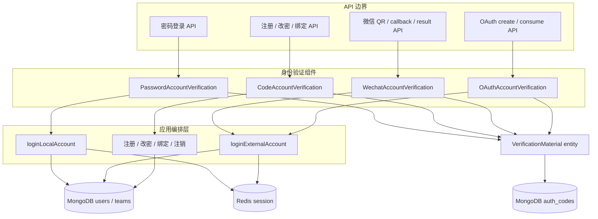

依赖必须单向：

- API 可以依赖验证组件和应用服务。
- 应用服务可以依赖用户、团队、Session 服务，但不能反向被验证组件依赖。
- 验证组件可以依赖短期材料实体和 Provider SDK/HTTP，不依赖 Cookie、埋点或具体账号业务。
- `packages/global` 中的 username resolver 只依赖共享 schema、常量和纯函数，前端与服务端都可安全导入。
- `packages/service` 不得导入 `pro/admin`；商业实现只能向下依赖共享抽象。

### 2.2 与相邻概念的区别

| 概念 | 本方案中的位置 |
| --- | --- |
| Account verification | 校验密码、验证码、微信扫码或 OAuth code，产出可信身份 |
| User provisioning | 根据可信外部身份查找或创建 FastGPT 用户，由登录应用服务负责 |
| Session authentication | 使用 Redis Session 校验后续请求，继续由 `authUserSession` / `parseHeaderCert` 负责 |
| Authorization | 团队、资源、API key 权限，不属于本组件 |
| Token login | 读取已有 Session，不是新的验证方式 |
| Fast login | 外部自定义快速登录协议，明确不纳入组件 |

## 3. 核心契约

### 3.1 通用抽象

```ts
/**
 * 统一账号验证方式的材料创建与消费模型。
 * 泛型允许不同方式保留自己的协议，不要求返回相同材料或身份结构。
 */
export abstract class AccountVerification<
  TCreateParams,
  TCreateResult,
  TConsumeParams,
  TConsumeResult
> {
  abstract create(params: TCreateParams): Promise<TCreateResult>;
  abstract consume(params: TConsumeParams): Promise<TConsumeResult>;
}
```

不增加统一 `verify()`、`login()` 或 Provider 大枚举分支。`create` / `consume` 是唯一公共模型，Provider 特有的回调写入可以作为实现类的附加方法。

### 3.2 可信身份

验证结果使用带判别字段的服务端内部类型，不直接返回 Mongoose Document：

```ts
type LocalAccountIdentity = {
  kind: 'local';
  userId: string;
  username: string;
  lastLoginTmbId?: string;
  isRoot: boolean;
};

type VerifiedContactIdentity = {
  kind: 'contact';
  account: string;
  scene: 'register' | 'findPassword' | 'bindNotification';
};

type ExternalAccountIdentity = {
  kind: 'external';
  provider: 'github' | 'google' | 'microsoft' | 'wecom' | 'sso' | 'wechat';
  subject: string;
  username: string;
  avatar?: string;
  notificationAccount?: string;
  phonePrefix?: number;
  teamName?: string;
  memberName?: string;
  organizationId?: string;
};
```

约束：

- `subject` 是 Provider 返回的稳定账号 ID；SSO 没有独立 subject 时退化为已验证 username。
- `username` 映射必须保持当前兼容值：`git-*`、`google-*`、`microsoft-*`、`wecom-*`、`wechat-*`；SSO 继续使用其返回值。
- 受“不新增身份绑定表”约束，实际用户查找仍使用兼容 username；`subject` 用于响应校验和后续演进，不能宣称已解决 Provider 账号改名问题。
- `organizationId` 只描述已验证的外部组织，不在验证组件内查询 FastGPT 团队或创建用户。
- 类型只在服务端使用，不放入前端 API schema。

### 3.3 实例与工厂

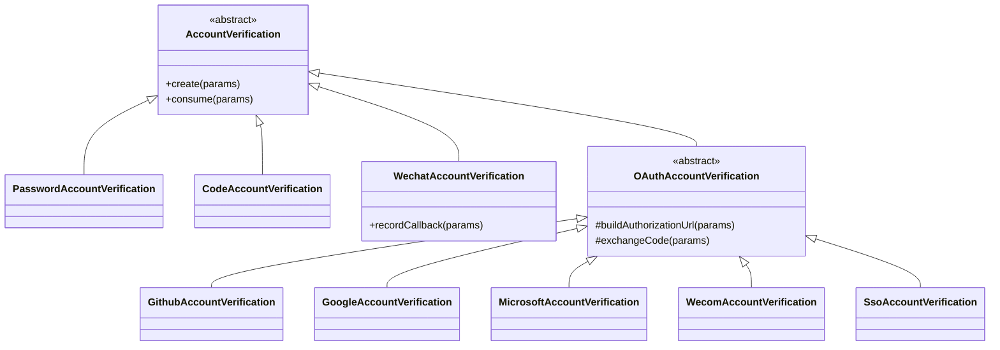

OAuth 路由通过 `getOAuthAccountVerification(provider)` 取得实例。工厂必须穷举支持的五个 Provider；`wechat` 虽仍存在于当前 `OAuthEnum`，但只能走微信扫码实现，不能进入 OAuth 工厂。

### 3.4 根据用户名推导验证方式

#### 3.4.1 设计目标

新增前后端共享纯函数：

```ts
resolveAccountVerificationByUsername(params): AccountVerificationResolution
```

它只负责把 username 分类，并结合部署能力自动选中唯一验证方式。只有没有可展示的验证码或 Provider 方式时才返回旧密码。它不读取数据库、全局配置或浏览器状态，也不创建验证材料。这样前端和后端使用的是同一套分支逻辑，但后端仍以自己的输入为准。

共享数据结构使用 Zod schema 推导类型。验证方式采用图中约定的稳定字符串，避免对象比较、前后端序列化差异以及额外的 `isSameMethod`：

```ts
export const AccountVerificationMethodSchema = z.enum([
  'code',
  'oldPassword',
  'wechat',
  'oauth/github',
  'oauth/google',
  'oauth/microsoft',
  'oauth/wecom',
  'oauth/sso'
]);
export type AccountVerificationMethod = z.infer<typeof AccountVerificationMethodSchema>;

export const AccountEmailUsernameSchema = z.email().max(254);
export const AccountPhoneUsernameSchema = z.string().regex(/^1[3456789]\d{9}$/);

export const AccountVerificationCapabilitiesSchema = z.object({
  emailCode: z.boolean(),
  phoneCode: z.boolean(),
  wechat: z.boolean(),
  oauth: z.object({
    github: z.boolean(),
    google: z.boolean(),
    microsoft: z.boolean(),
    wecom: z.boolean(),
    sso: z.boolean()
  })
});
export type AccountVerificationCapabilities = z.infer<
  typeof AccountVerificationCapabilitiesSchema
>;

export const RecognizedAccountKindSchema = z.enum([
  'email',
  'phone',
  'local',
  'wechat',
  'github',
  'google',
  'microsoft',
  'wecom',
  'sso'
]);
export const AccountKindSchema = z.union([RecognizedAccountKindSchema, z.literal('invalid')]);

export const AccountVerificationUnsupportedReasonSchema = z.literal('empty_username');

export const AccountVerificationResolutionSchema = z.discriminatedUnion('status', [
  z.object({
    status: z.literal('supported'),
    accountKind: RecognizedAccountKindSchema,
    method: AccountVerificationMethodSchema,
    unsupportedReason: z.undefined().optional()
  }),
  z.object({
    status: z.literal('unsupported'),
    accountKind: z.literal('invalid'),
    method: z.undefined().optional(),
    unsupportedReason: AccountVerificationUnsupportedReasonSchema
  })
]);
export type AccountVerificationResolution = z.infer<
  typeof AccountVerificationResolutionSchema
>;
```

`capabilities` 只描述部署实际具备哪些验证码或 Provider 能力，不能藏在 resolver 内读取全局变量。旧密码不是可关闭的业务策略：`users.password` 在当前模型中必填，因此没有其它可展示方式的非空 username 最终都能得到 `oldPassword`。

返回值由 resolver 保证三条契约：非空 username 一定为 `status=supported`；支持结果只有一个 `method`；`oldPassword` 不会与验证码或 Provider 方式一起返回。只有空 username 返回 `unsupported/empty_username`。

#### 3.4.2 推导函数

```ts
/**
 * 根据 username 和部署能力推导唯一验证方式。
 * 前端只能展示该方式；后端必须重新调用，不能信任前端结果。
 */
export const resolveAccountVerificationByUsername = ({
  username,
  capabilities
}: {
  username: string;
  capabilities: AccountVerificationCapabilities;
}): AccountVerificationResolution => {
  const normalizedUsername = username.trim();
  if (!normalizedUsername) {
    return {
      status: 'unsupported',
      accountKind: 'invalid',
      unsupportedReason: 'empty_username'
    };
  }

  /** 前缀必须完整匹配 `${prefix}-`，并且分隔符后至少有一个字符。 */
  const hasPrefix = (prefix: string) =>
    normalizedUsername.startsWith(`${prefix}-`) &&
    normalizedUsername.length > prefix.length + 1;

  // 客户 SSO 前缀不做枚举：第一个分隔符前后均非空即可。
  const firstSeparatorIndex = normalizedUsername.indexOf('-');
  const hasSsoPrefix =
    firstSeparatorIndex > 0 && firstSeparatorIndex < normalizedUsername.length - 1;

  // 邮箱/手机号优先，避免 user-name@example.com 被通用连字符规则识别为 SSO。
  const accountKind = (() => {
    if (AccountEmailUsernameSchema.safeParse(normalizedUsername).success) return 'email';
    if (AccountPhoneUsernameSchema.safeParse(normalizedUsername).success) return 'phone';
    if (hasPrefix('wechat')) return 'wechat';
    if (hasPrefix('git')) return 'github';
    if (hasPrefix('google')) return 'google';
    if (hasPrefix('microsoft')) return 'microsoft';
    if (hasPrefix('wecom')) return 'wecom';
    if (capabilities.oauth.sso && hasSsoPrefix) return 'sso';
    return 'local';
  })() satisfies z.infer<typeof RecognizedAccountKindSchema>;

  type ConfiguredAccountVerificationMethod = Exclude<
    AccountVerificationMethod,
    'oldPassword'
  >;

  // 候选顺序只供 resolver 内部自动降级，不能作为可选列表返回给客户端。
  const candidateMethods: readonly ConfiguredAccountVerificationMethod[] = (() => {
    switch (accountKind) {
      case 'email':
      case 'phone':
        return ['code'] as const;
      case 'local':
        return [];
      case 'wechat':
        return ['wechat'] as const;
      case 'github':
        return ['oauth/github'] as const;
      case 'google':
        return ['oauth/google'] as const;
      case 'microsoft':
        return ['oauth/microsoft'] as const;
      case 'sso':
        return ['oauth/sso'] as const;
      case 'wecom':
        return ['oauth/sso', 'oauth/wecom'] as const;
      default: {
        const exhaustiveAccountKind: never = accountKind;
        return exhaustiveAccountKind;
      }
    }
  })();

  const isMethodAvailable = (method: ConfiguredAccountVerificationMethod) => {
    switch (method) {
      case 'code':
        return accountKind === 'email' ? capabilities.emailCode : capabilities.phoneCode;
      case 'wechat':
        return capabilities.wechat;
      case 'oauth/github':
        return capabilities.oauth.github;
      case 'oauth/google':
        return capabilities.oauth.google;
      case 'oauth/microsoft':
        return capabilities.oauth.microsoft;
      case 'oauth/wecom':
        return capabilities.oauth.wecom;
      case 'oauth/sso':
        return capabilities.oauth.sso;
      default: {
        const exhaustiveMethod: never = method;
        return exhaustiveMethod;
      }
    }
  };

  const method = candidateMethods.find(isMethodAvailable) ?? 'oldPassword';
  return {
    status: 'supported',
    accountKind,
    method
  };
};
```

`AccountEmailUsernameSchema` 与 `AccountPhoneUsernameSchema` 同样放在 `type.ts`。邮箱统一使用本地 Zod 4 的 `z.email()` 并限制总长度，不再沿用服务端 `includes('@')` 或两个前端表单中重复的窄正则。邮箱 local-part 和域名标签都允许出现在合法位置的 `-`，例如 `user-name@example-domain.com`，因此邮箱判定必须先于通用 SSO 连字符判定。确切语法只由共享 schema 和 fixture 决定，resolver 不再解释邮箱字符规则。

手机号沿用注册/找回密码表单当前的 `^1[3456789]\d{9}$` 规则；实现时同样把散落正则迁到共享 schema。resolver 只在去除首尾空白的副本上分类，不改写大小写，也不修改用于数据库查询、发送验证码或身份归属比较的原始 username。

明确的直连 Provider 前缀必须按大小写精确匹配 `${prefix}-` 且后缀非空。其余账号只判断第一个 `-` 前后是否均非空，不枚举 SSO 客户前缀：

| Username | `accountKind` | resolver 唯一返回结果 |
| --- | --- | --- |
| 邮箱 | `email` | 邮件能力可用时为 `code`，否则为 `oldPassword` |
| 手机号 | `phone` | 短信能力可用时为 `code`，否则为 `oldPassword` |
| 普通账号，或 SSO 未配置时的未知连字符账号 | `local` | `oldPassword` |
| `wechat-*` | `wechat` | 微信能力可用时为 `wechat`，否则为 `oldPassword` |
| `git-*` | `github` | GitHub 能力可用时为 `oauth/github`，否则为 `oldPassword` |
| `google-*` | `google` | Google 能力可用时为 `oauth/google`，否则为 `oldPassword` |
| `microsoft-*` | `microsoft` | Microsoft 能力可用时为 `oauth/microsoft`，否则为 `oldPassword` |
| `wecom-*` | `wecom` | SSO 可用时为 `oauth/sso`，否则内部 Wecom 可用时为 `oauth/wecom`，再否则为 `oldPassword` |
| 其它 `prefix-suffix` 且 SSO 已配置 | `sso` | `oauth/sso` |

`accountKind=sso` 只表示“交给统一 SSO 中转”，不表示 Feishu、DingTalk 或任何具体 Provider。`RecognizedAccountKindSchema` 枚举的是 resolver 的有限输出类型，不是客户 SSO prefix 枚举。

除 Wecom 外，明确的直连 Provider 绝不降级为 SSO。例如 `git-*` 在 GitHub OAuth 未配置时唯一得到 `method=oldPassword`，不能改走 SSO。Wecom 是唯一跨两条企业身份链路的特例，由 resolver 固定按 SSO、内部 Wecom、旧密码顺序自动选中第一个可用方式。只有“不属于明确直连 Provider”的连字符账号受 SSO capability 控制：SSO 可用时唯一返回 `oauth/sso`，不可用时按本地账号返回 `oldPassword`。

启用 SSO 会占用所有未知 `prefix-suffix` 命名空间。上线前必须扫描已有本地连字符账号并迁移冲突；不通过 Admin 前缀白名单制造另一套长期规则。

#### 3.4.3 能力输入

resolver 不直接理解 `feConfigs` 或 `global.systemConfig`。前后端分别用适配函数生成同一个 `AccountVerificationCapabilities`，避免把环境读取混入纯函数：

| 能力 | 前端公开配置来源 | 后端权威判断 |
| --- | --- | --- |
| `emailCode` / `phoneCode` | 当前业务 scene 对应的公开 method 列表 | 邮件/SMS 发送配置、scene 模板和业务开关均可用 |
| `wechat` | `feConfigs.oauth.wechat` | 微信 `appID`、`appSecret` 等必填配置完整 |
| `oauth.github` / `google` / `microsoft` | 对应 `feConfigs.oauth` 客户端配置存在 | 对应 client id 与 secret 等服务端配置完整 |
| `oauth.wecom` | 服务端下发的可用布尔值，不由浏览器只看按钮配置推断 | 企业微信内部应用/套件配置完整；与 SSO 同时启用时还需确认 `wecom-*` 身份命名空间兼容 |
| `oauth.sso` | `feConfigs.sso.url` | SSO URL、License 与服务端访问配置均有效 |

账号注销等新增 scene 不能误用 `bind_notification_method` 猜测验证码能力，应在服务端配置归一化时增加该 scene 的公开 capability。SSO 只需要已有的可用性 capability，不新增 prefix 列表或 Admin 配置；client id、secret、短信密钥等敏感值绝不进入 resolver 输入。

本地代码中 `pro/sso/src/provider/wecom.ts` 使用 `wecom-{userid}`，内部套件 `pro/admin/src/service/support/wecom/auth.ts` 使用 `wecom-{open_userid}`。两者并非天然相等。因此 `oauth.wecom=true` 在双入口场景必须表示“配置可用且部署已通过迁移或映射确认两条链路产出同一持久化 username”，不能只表示按钮已配置。未完成对齐时只开放账号原始来源对应的入口；即使配置误报为可用，consume 后的精确 username 校验仍必须拒绝不一致身份。

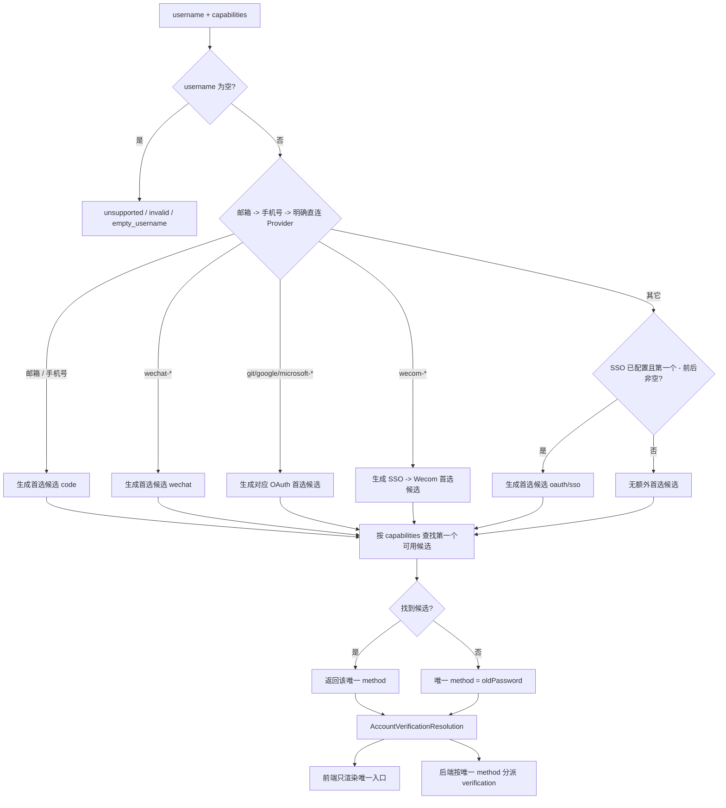

#### 3.4.4 前端使用

前端从当前用户信息取得 username，将公开的 `feConfigs` 转成 `AccountVerificationCapabilities`：

```ts
const resolution = resolveAccountVerificationByUsername({
  username: userInfo.username,
  capabilities: getAccountVerificationCapabilitiesFromFeConfig(feConfigs)
});

if (resolution.status === 'unsupported') {
  return renderUnsupported(resolution.unsupportedReason);
}

switch (resolution.method) {
  case 'code':
    return renderCodeForm({ channel: resolution.accountKind });
  case 'oldPassword':
    return renderOldPasswordForm();
  case 'wechat':
    return renderWechatPanel();
  default:
    return renderOAuthButton(resolution.method);
}
```

页面只渲染 `resolution.method` 对应的一个入口，不提供“使用旧密码”或其它验证方式切换入口。仅当 resolver 判断当前账号没有可展示的验证码或 Provider 方式时，页面才会得到并展示 `oldPassword`。前端结果只控制 UI，不作为后端授权依据。

#### 3.4.5 后端使用

后端只在敏感验证流程的 create 入口做一次权威推导。请求中的 method 是 Zod 判别字段，不是用户可选策略；服务端先通过 Session 得到 userId，再读取数据库中的 username 和真实 Provider 配置并精确比对：

```ts
const { body } = parseApiInput({
  req,
  bodySchema: SensitiveAccountVerificationCreateBodySchema
});
const { userId } = await parseHeaderCert({ req, authToken: true });
const user = await MongoUser.findById(userId, { username: 1 }).lean();
if (!user) {
  throw new UserError('User not found');
}

const resolution = resolveAccountVerificationByUsername({
  username: user.username,
  capabilities: getAccountVerificationCapabilitiesFromServerConfig()
});

if (resolution.status === 'unsupported' || body.method !== resolution.method) {
  throw new UserError('Verification method is not allowed for this account');
}

const result = await createAccountVerificationForUser({
  method: resolution.method,
  payload: body.payload,
  user,
  scene: 'accountCancellation'
});
```

create 必须把 `method + userId + scene` 绑定到现有验证材料的 key/type/provider 命名空间。后续 action/consume 请求仍以 method 作为 payload 判别字段，但不再读取 capabilities 或调用 resolver，只校验请求 method 与材料绑定一致：

```ts
const { body } = parseApiInput({
  req,
  bodySchema: SensitiveAccountVerificationBodySchema
});
const { userId } = await parseHeaderCert({ req, authToken: true });
const user = await MongoUser.findById(userId, { username: 1 }).lean();
if (!user) {
  throw new UserError('User not found');
}
const identity = await consumeAccountVerificationForUser({
  verification: body,
  user,
  scene: 'accountCancellation'
});
await assertVerifiedIdentityMatchesUser({ user, identity });
```

敏感业务请求 schema 根本不包含 username，而不是“接收后忽略”。method 虽由客户端随当前唯一入口回传，但 create 会与服务端 resolver 结果精确比较，consume 会与服务端材料绑定精确比较，因此客户端不能借此选择其它方式。`consumeAccountVerificationForUser` 位于服务端应用层，按绑定后的 method 调用：

| method | 后端调用 | 归属校验 |
| --- | --- | --- |
| `code` | `codeVerification.consume({ account: user.username, scene, code })` | `identity.account === user.username` |
| `oldPassword` | `passwordVerification.consume({ username: user.username, password, code: preLoginCode })` | `identity.userId === user._id` |
| `wechat` | `wechatVerification.consume({ code })` | `identity.username === user.username` |
| `oauth/*` | `getOAuthAccountVerification(provider).consume(...)` | `identity.username === user.username` |

所有比较都使用持久化原值，不使用 resolver 的小写副本。resolver 只确定 create 时的唯一方式，不替代材料绑定或身份归属校验。验证码只能发往当前账号，OAuth state 绑定当前 userId 与业务 scene。流程建立后即使 capability 配置变化也不切换 method；对应 Provider 在 create 或 consume 时不可用，直接按该实现的正常错误处理。

## 4. 验证材料模型

### 4.1 存储兼容

继续使用集合 `auth_codes`，不新增表和 verification token。目标模型改名为 `MongoAccountVerificationMaterial`，但 collection name 保持不变。

| 字段 | 用途 | 调整 |
| --- | --- | --- |
| `key` | 按场景构造的材料键 | 保留 |
| `code` | 预登录、图片或短信/邮件验证码 | 保留六位限制 |
| `openid` | 微信回调写入的 openid | 保留，仅微信使用 |
| `type` | 验证场景 | 保留现有值，增加 `oauthLogin` |
| `createTime` | 创建时间 | 每次 upsert 必须刷新 |
| `expiredTime` | 业务过期时间 | 每次创建必须显式传入 |

材料 key 规则：

| 场景 | `type` | `key` | 典型有效期 |
| --- | --- | --- | --- |
| 密码预登录 | `login` | 原始 username | 30 秒 |
| 图片验证码 | `captcha` | 原始 account | 5 分钟 |
| 注册验证码 | `register` | 原始 account | 5 分钟 |
| 找回密码 | `findPassword` | 原始 account | 5 分钟 |
| 绑定联系方式 | `bindNotification` | 原始 account | 5 分钟 |
| 微信扫码 | `wxLogin` | scene code | 与二维码 1 小时有效期一致 |
| OAuth state | `oauthLogin` | `oauth:{purpose}:{subjectHash}:{provider}:{callbackHash}:{state}` | 10 分钟 |

`callbackHash` 使用规范化 callback URL 的 SHA-256 摘要。登录场景的 `purpose=login`、`subjectHash=anonymous`；敏感业务使用固定 scene 作为 purpose，并用当前 Session userId 的 SHA-256 摘要作为 subjectHash。这样可在不增加字段的前提下把 state 绑定到用途、当前用户、Provider 和回调地址。

敏感业务的 code、oldPassword 和 wechat 材料同样在现有 key 命名空间中绑定 `purpose + subjectHash + method`；OAuth 则由 key 中已有的 provider 段绑定具体 method。consume 使用请求 method 只查询同一 userId、scene 和 method 下的有效材料。该绑定不新增字段或 verification token，但可以让 consume 沿用 create 已确认的方式，而不必再次读取 capabilities。

### 4.2 索引与过期

目标索引：

```ts
schema.index({ key: 1, type: 1 }, { unique: true });
schema.index({ expiredTime: 1 }, { expireAfterSeconds: 0 });
```

TTL 删除不是实时保证。所有读取和消费都必须包含：

```ts
expiredTime: { $gt: now }
```

升级唯一索引前必须先运行重复数据 dry-run 和清理，不能直接依赖启动时 `syncIndexes()`，否则历史重复记录会导致建索引失败。

### 4.3 材料实体 API

`entity.ts` 只负责数据库原子操作，并按代码规范接受可选 `session`：

```ts
createVerificationMaterial(data, session?)
upsertVerificationMaterial(data, session?)
findValidVerificationMaterial(query)
consumeVerificationMaterial(query, session?)
updateWechatMaterialIdentity(data, session?)
deleteVerificationMaterialIfMatch(query, session?)
```

关键语义：

- `upsert` 使用 `$set` 刷新材料和过期时间，重发即使旧材料失效。
- OAuth state 和微信 scene 等随机键使用 `create`；发生极低概率碰撞时失败并重新生成，不能覆盖已有流程。
- 普通消费使用单次 `findOneAndDelete`，不使用“先 find 再 delete”的事务。
- 验证码大小写兼容必须对输入做转义后再进行锚定匹配，不能把用户输入直接拼成正则。
- 微信回调只更新 `create()` 已建立、尚未过期的 scene 占位记录，不允许 callback 自行 upsert 任意 scene。
- OAuth 在 Provider 交换成功后原子删除 state；删除不到记录时丢弃已取得的身份，不进入登录业务。
- 清理发送失败的验证码时必须同时匹配本次生成的 code，避免删除稍后创建的新材料。

### 4.4 生命周期

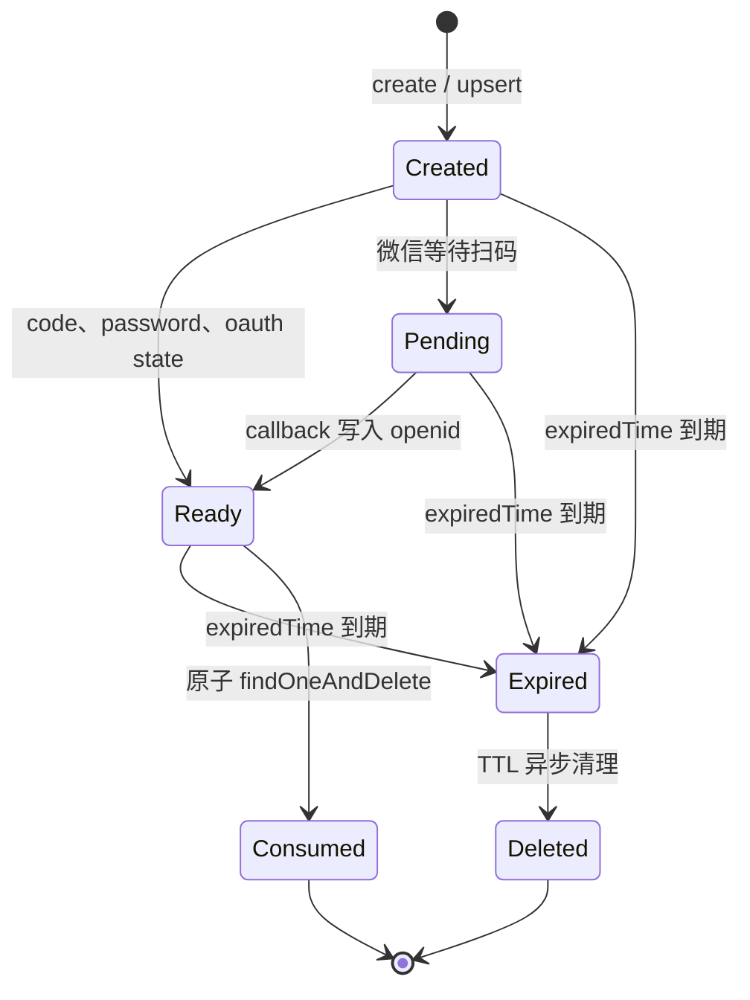

数据库不新增 `status` 字段。`Pending`、`Ready` 等状态由记录是否存在、是否过期及微信 `openid` 是否存在推导。

## 5. 各验证方式

### 5.1 密码验证

职责：

- `create({ username })`：生成六位预登录 code，以 `login + username` upsert，30 秒后过期并返回 code。
- `consume({ username, password, code })`：先消费预登录 code，再按 `username + password` 查询用户并检查禁用状态，返回 `LocalAccountIdentity`；不因账号来自第三方而拒绝正确密码。
- 不加载团队，不修改语言或 `lastLoginTmbId`，不创建 Session。

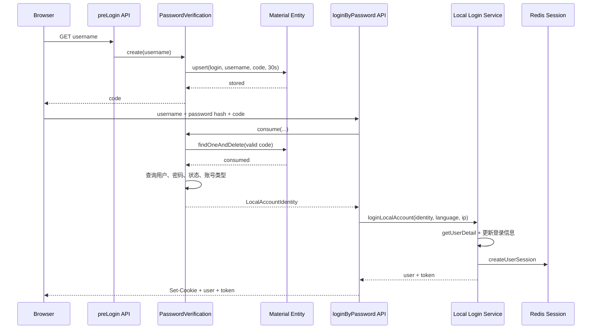

密码错误继续返回统一账号/密码错误，避免区分“用户不存在”和“密码错误”。当前 `loginByPassword.ts` 的 Wecom 密码登录禁令移到密码登录应用服务：登录 purpose 仍拒绝 Wecom，账号注销等敏感业务只调用密码验证组件，因此可以使用同一账号的旧密码兜底。IP 频率限制保留在 API 边界；`preLogin` 另加轻量 IP/username 限流，避免无限写入。

### 5.2 图片验证码与短信/邮件验证码

图片验证码是发送验证码前的人机挑战，不产出账号身份，因此由 `CaptchaChallengeService` 管理，不强行实现 `AccountVerification`。

`CodeAccountVerification`：

- `create` 仅允许 `register`、`findPassword`、`bindNotification` 三种 scene。
- 依次消费图片验证码、校验配置存在时的 reCAPTCHA、获取一分钟发送锁、生成六位数字码、upsert 材料、调用现有 `sendMessage`。
- 发送失败时删除本次 code 并释放发送锁，允许用户立即重试。
- `consume` 先按 `account + scene` 执行 Redis 固定窗口频控，60 秒内每次提交都累加，前 10 次允许，第 11 次起返回“验证过于频繁，请稍后再试”；通过频控后再按 `account + scene + code + expiredTime` 原子删除并返回 `VerifiedContactIdentity`。
- 不查询用户是否存在，不执行注册、改密或绑定。

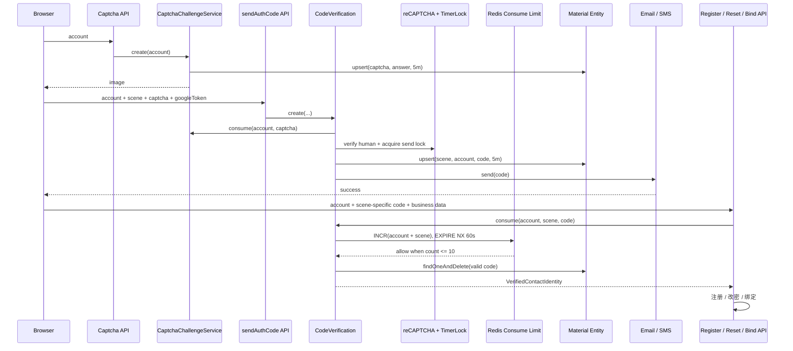

外部消息发送不能与 Mongo 事务形成真正原子操作，因此不再把网络发送包进 Mongo transaction。采用“先持久化、再发送、失败时条件清理”的补偿策略。

### 5.3 微信扫码验证

`WechatAccountVerification` 提供：

- `create()`：生成 scene 并创建占位材料，再取得微信 access token 和临时二维码，返回 `{ code, codeUrl, expiredAt? }`；上游失败时条件删除占位材料。
- `recordCallback({ code, openid })`：微信签名和 XML 解析仍在 callback API；验证通过后只更新有效占位材料。
- `consume({ code })`：无记录返回 `expired`，没有 `openid` 返回 `pending`；有 `openid` 时原子删除记录，调用微信用户信息 API 并返回外部身份。
- callback 消息校验 token 继续使用既有源码常量 `WX_AUTH_TOKEN`，不新增后台配置入口；AppID 和 AppSecret 仍由现有后台配置提供。

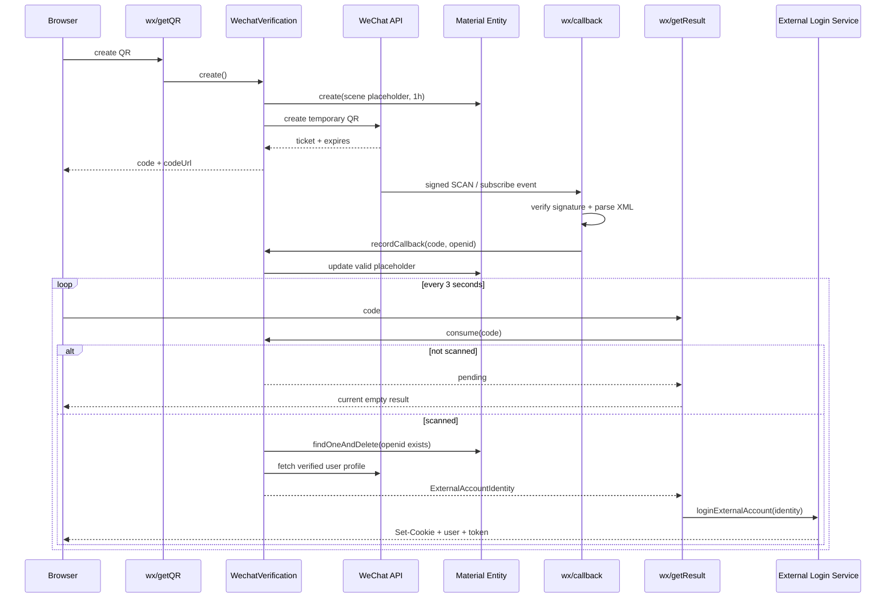

只有取得并删除记录的一个轮询请求能继续登录，解决当前同一 scene 重复创建 Session 的问题。Provider 查询失败时记录已消费，用户重新扫码；这是避免已确认扫码材料被无限重试的安全取舍。

### 5.4 OAuth 验证

公共流程位于 `OAuthAccountVerification`：

```ts
abstract class OAuthAccountVerification extends AccountVerification<
  CreateOAuthParams,
  OAuthRedirectResult,
  ConsumeOAuthParams,
  ExternalAccountIdentity
> {
  async create(params) {
    // 校验 provider 配置和 callback URL
    // 生成高熵 state，以 purpose + subjectHash + provider + callback 绑定后 create
    // 调用子类构造授权 URL
  }

  async consume(params) {
    // 旧 SSO 回调完全没有 state 时，仅按旧协议使用 code 换取身份
    if (provider === 'sso' && params.state === undefined) {
      return exchangeCode(params);
    }
    // 只读校验 purpose + subjectHash + provider + callback + state + expiredTime
    // 子类使用 code 换取并校验 Provider 身份
    // 原子删除 state；删除失败则拒绝身份
  }

  protected abstract buildAuthorizationUrl(params): Promise<string>;
  protected abstract exchangeCode(params): Promise<ExternalAccountIdentity>;
}
```

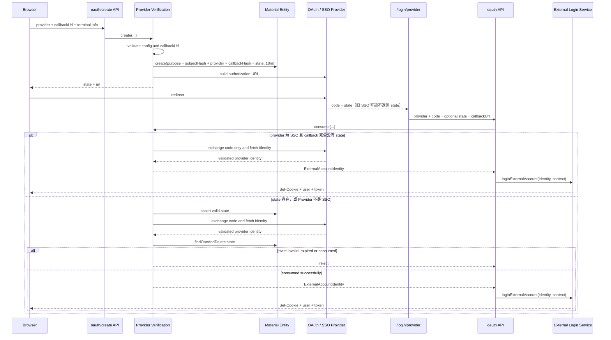

state 存在时先交换 code、再原子消费 state，沿用基准逻辑并允许 Provider 临时失败时重试。并发请求即使都完成交换，也只有一个能删除 state 并进入登录业务。旧 SSO code-only 路径不读取或消费本地 state，create 时生成的记录由短期过期机制清理；该路径只依赖 SSO 一次性 code，并保留第 10.1 节记录的残余风险。

callback URL 规则：

- 使用 `adminEnv.FE_DOMAIN` 生成或校验允许的 origin；
- path 必须精确为 `/login/provider`，不得含用户名、密码或 hash；
- 开发环境可以显式允许 localhost，生产环境只允许 HTTPS；
- 不直接信任客户端传入的任意 `callbackUrl`；
- state key 同时绑定 callback URL 摘要，避免跨回调地址使用。

### 5.5 Provider 适配

| Provider | create | consume 与身份映射 | 必要校验 |
| --- | --- | --- | --- |
| GitHub | 服务端构造 authorize URL | code 换 token，读取 `/user`，映射 `git-{login}` | token 使用 form body，响应 Zod 校验，不在 URL/日志暴露 secret |
| Google | 服务端构造 authorize URL | code 换 token，验证 id token，映射 `google-{sub}` | 校验签名、`aud`、`iss`、`exp`，需要直接依赖官方验证库 |
| Microsoft | 服务端构造 tenant authorize URL | code 换 token，读取 Graph `/me`，映射 `microsoft-{id}` | tenant/client 配置、token/user 响应 Zod 校验 |
| Wecom | 服务端构造企业微信 URL | code 换 `open_userid + corpid`，映射 `wecom-{open_userid}` | 验证企业微信 errcode；不在验证类创建 FastGPT 用户 |
| SSO | 调用配置的 SSO 服务获取授权 URL，并始终传入 state | 固定 SSO base URL 下用 code 获取身份 | callback 带 state 时完整校验；完全无 state 时 code-only；固定同源 URL；限制 props 数量和长度 |

Wecom 当前 `authWecom()` 会预先创建 FastGPT 用户。迁移后该副作用移动到登录应用服务：验证结果只返回 `organizationId=corpid`，登录服务再查找关联团队并按现有规则设置 `defaultTeamIdList`、`forbidCreateDefaultTeam` 和 Wecom tag。

本期范围是“接入统一身份验证并保持旧 SSO 兼容”。`pro/admin` 获取 SSO 授权地址时始终传入服务端生成的 state，但不要求现有 SSO 必须返回；回调带 state 时执行完整的错误、过期和一次性消费校验，回调完全没有 state 时仅对 `provider=sso` 使用旧 code-only 协议。GitHub、Google、Microsoft 和 Wecom 等非 SSO Provider 缺少 state 时直接拒绝，不允许 fallback。

本期不修改 `pro/sso` 的协议实现、进程级回调缓存或多实例行为，不新增 SSO 响应 capability 或其它兼容开关。Pro Admin 不再声明、读取或依赖历史 capability 字段，旧 SSO 即使继续返回该额外字段也会被忽略。统一组件只限制 SSO base URL、callback props 和返回身份结构；敏感业务即使走 code-only，也必须把 SSO 返回的持久化 username 与当前 Session 用户精确比较。

## 6. 登录与业务编排

### 6.1 总调用关系

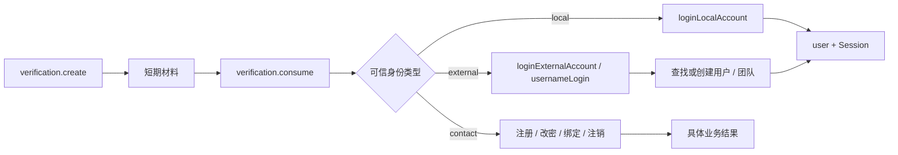

### 6.2 本地账号登录服务

`projects/app/src/service/support/user/login/service.ts` 提供 `loginLocalAccount`：

1. 接收 `LocalAccountIdentity`、语言和客户端 IP；
2. 通过 userId 加载用户详情及默认/最后团队；
3. 更新 `lastLoginTmbId` 和语言；
4. 创建现有 Redis Session；
5. 返回 `{ user, token }`。

Cookie、`pushTrack.login` 和 LOGIN 审计由 API 成功分支显式执行，验证失败不能触发。

### 6.3 外部账号登录服务

`pro/admin/src/service/support/user/login/service.ts`：

- `loginExternalAccount` 只接收 `ExternalAccountIdentity` 和注册上下文；
- 内部保留并迁移 `usernameLogin` 的查找、自动注册、团队创建、联系方式同步、语言更新和 Session 创建规则；
- 已存在但状态为 `forbidden` 的用户必须拒绝登录，补齐当前外部登录绕过禁用状态的问题；
- Wecom 的组织到团队映射在本层处理；
- 新用户并发登录依赖 `users.username` 唯一索引收敛；捕获重复键后重新读取用户，不能把可恢复竞争直接返回为登录失败；
- 第三方身份字段不能由 API body 直接构造，只能来自 Provider `consume()` 返回值。

登录成功后 API 再执行 Cookie、登录埋点和广告转化追踪。微信和 OAuth 共用该应用服务，但保留各自 track type。

### 6.4 验证码业务消费者

| 业务 | 调用顺序 | 验证组件之外的动作 |
| --- | --- | --- |
| 注册 | `code.consume(register)` | 重名/License 检查、创建用户团队、Session、Cookie、推广与转化追踪 |
| 找回密码 | `code.consume(findPassword)` | 更新密码和语言、创建新 Session、撤销其他 Session |
| 用户联系方式 | 先校验当前 Session，再 `code.consume(bindNotification)` | 更新用户 contact，按现有规则补团队通知账号 |
| 团队通知账号 | 先校验 owner 权限，再 `code.consume(bindNotification)` | 更新团队账号、按现有规则补 owner contact、写审计 |
| 账号注销 | 由存在该功能的分支增加独立 scene 后复用 | 注销资格、等待期和资源清理由注销业务负责 |

验证码实现只证明对目标邮箱/手机号的控制权，不证明 FastGPT 用户存在。是否允许该身份执行具体业务由调用方判断。

迁移完成前，仍调用旧 `authCode` 的用户联系方式和团队通知账号入口必须复用同一个 Redis 提交频控断言，不能因新旧消费路径并存而留下无限尝试入口。注册场景使用请求中的 `username` 作为 account；其它场景使用实际接收验证码的邮箱或手机号。

### 6.5 敏感业务的验证方式分派

账号注销等敏感业务按“resolver 唯一确定方式、后端校验并创建材料、业务 API 直接消费并执行动作”的顺序使用共享 resolver。前端不能提供方式选择器，每次只展示 resolver 返回的一种入口。create 请求携带 method 作为协议判别字段，服务端使用持久化 username 和真实 capabilities 推导一次并精确比对，随后把 method 绑定到验证材料。consume 不再重新推导，只验证请求 method、当前 userId、scene 与材料绑定。不能先在通用接口消费身份再返回布尔值，否则没有 verification token 就无法把验证结果安全传递给后续请求；也不能新增本方案明确排除的 verification token。

| 服务端确认的 method | create 请求（均不含 username） | create 结果 | action 请求中的 consume payload |
| --- | --- | --- | --- |
| `code` | `{ method: 'code', payload: captcha/reCAPTCHA }` | 验证码发送结果 | `{ method: 'code', payload: { code } }` |
| `oldPassword` | `{ method: 'oldPassword', payload: {} }`；服务端用 Session username 调用 password create | `{ preLoginCode }` | `{ method: 'oldPassword', payload: { password, preLoginCode } }` |
| `wechat` | `{ method: 'wechat', payload: {} }` | `{ code, codeUrl, expiredAt? }` | `{ method: 'wechat', payload: { code } }`；未扫码时 action 返回 pending |
| `oauth/*` | `{ method, payload: { callbackUrl, isWecomWorkTerminal? } }` | `{ state, url }` | `{ method, payload: { state, code, callbackUrl } }`；SSO 可额外带受限 props |

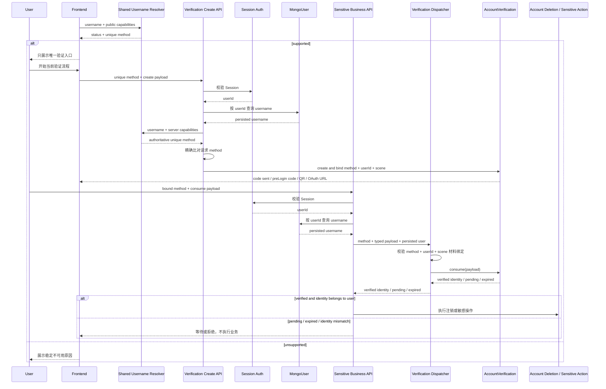

唯一 method 只在 create 接收前端请求时由后端推导和校验一次。consume 不重新读取 capabilities，也不因为流程中途配置变化改走其它方式；它只接受与服务端材料绑定相同的 method，并继续完成材料校验和身份归属校验。如果对应渠道在 create 或 consume 时实际不可用，当前流程按正常上游失败返回，不隐式切换到旧密码或另一 Provider。

## 7. API 契约与兼容

### 7.1 路由

| 路由 | 处理方式 |
| --- | --- |
| `GET /support/user/account/preLogin` | 路径和响应不变，改调 `passwordVerification.create` |
| `POST /support/user/account/loginByPassword` | 路径和请求不变，改调 password consume + local login |
| `GET /proApi/.../captcha/getImgCaptcha` | 路径不变，改调 captcha service |
| `POST /proApi/.../inform/sendAuthCode` | 路径不变，改调 code create |
| 注册、改密、绑定路由 | 路径和响应不变，改调 code consume |
| `GET /proApi/.../login/wx/getQR` | 路径不变，改调 wechat create |
| `POST /proApi/.../login/wx/getResult` | 路径不变，改调 wechat consume + external login |
| `POST /proApi/.../login/oauth/create` | 新增统一 OAuth create，返回 `{ state, url }` |
| `POST /proApi/.../login/oauth` | 路径不变；直连 Provider 的 `state` 必填，SSO 可省略；state 存在时执行完整 consume，无 state 时仅 SSO code-only |
| 旧 `getAuthURL` / `wecom/getRedirectUrl` | 新前端切换后删除，不保留转发文件 |
| 敏感业务的 verification create 路由 | 校验 Session，用持久化 username 推导一次并精确比对请求 method，创建绑定 method、userId 与 scene 的材料；不接收 username |
| 敏感业务 action 路由 | 不重算 method 或 capabilities；校验请求 method 与材料绑定后，在同一请求内 consume、校验身份归属并执行业务；不接收 username，不新增通用“验证成功”接口或 verification token |
| `fastLogin` | 不接入组件，按单独阶段废弃 |

主应用和 Pro Admin 需要协调发布统一 create/consume schema，但不增加前端门控、SSO 响应声明或兼容开关。OAuth/SSO 配置存在时前端直接使用统一入口；只有 `provider=sso && state===undefined` 命中旧协议，其它请求都进入 required-state 流程。

本地 `pro` 是独立 Git submodule。实现时需要先形成可独立校验的 Pro commit，再由主仓提交共享包、主应用改动和 submodule 指针；两边的 schema/capability 必须在同一发布单元中配套，不能只移动其中一侧。

### 7.2 OpenAPI schema

新增或调整 schema：

```ts
const OAuthVerificationProviderSchema = z.enum([
  OAuthEnum.github,
  OAuthEnum.google,
  OAuthEnum.microsoft,
  OAuthEnum.wecom,
  OAuthEnum.sso
]);

const CreateOAuthVerificationBodySchema = z.object({
  type: OAuthVerificationProviderSchema,
  callbackUrl: UrlSchema,
  isWecomWorkTerminal: z.boolean().optional()
});

const CreateOAuthVerificationResponseSchema = z.object({
  state: z.string(),
  url: UrlSchema
});

const OauthLoginCommonBodySchema = TrackRegisterParamsSchema.extend({
  callbackUrl: UrlSchema,
  code: z.string().min(1).max(4096),
  props: z.record(z.string(), z.string()),
  language: LanguageSchema.optional()
});

const OauthLoginBodySchema = z.discriminatedUnion('provider', [
  OauthLoginCommonBodySchema.extend({
    provider: z.literal(OAuthEnum.sso),
    state: z.string().min(32).max(128).optional()
  }),
  OauthLoginCommonBodySchema.extend({
    provider: OAuthVerificationProviderSchema.exclude([OAuthEnum.sso]),
    state: z.string().min(32).max(128)
  })
]);

const CodeVerificationPayloadSchema = z.object({
  code: z.string().length(6)
});

const OldPasswordVerificationPayloadSchema = z.object({
  password: z.string().min(1).max(512),
  preLoginCode: z.string().length(6)
});

const WechatVerificationPayloadSchema = z.object({
  code: z.string().min(16).max(128)
});

const OAuthVerificationPayloadSchema = z.object({
  state: z.string().min(32).max(256),
  code: z.string().min(1).max(4096),
  callbackUrl: UrlSchema
});

const reservedSsoCallbackProps = new Set([
  'method',
  'username',
  'state',
  'code',
  'callbackUrl'
]);
const SsoCallbackPropsSchema = z
  .record(z.string().regex(/^[A-Za-z0-9_.-]+$/).max(64), z.string().max(4096))
  .refine(
    (props) =>
      Object.keys(props).length <= 20 &&
      Object.keys(props).every((key) => !reservedSsoCallbackProps.has(key)),
    'Invalid SSO callback properties'
  );

const SsoVerificationPayloadSchema = OAuthVerificationPayloadSchema.omit({ state: true }).extend({
  state: z.string().min(32).max(256).optional(),
  props: SsoCallbackPropsSchema.default({})
});

const SensitiveAccountVerificationBodySchema = z.discriminatedUnion('method', [
  z.object({
    method: z.literal('code'),
    payload: CodeVerificationPayloadSchema
  }),
  z.object({
    method: z.literal('oldPassword'),
    payload: OldPasswordVerificationPayloadSchema
  }),
  z.object({
    method: z.literal('wechat'),
    payload: WechatVerificationPayloadSchema
  }),
  z.object({
    method: z.literal('oauth/github'),
    payload: OAuthVerificationPayloadSchema
  }),
  z.object({
    method: z.literal('oauth/google'),
    payload: OAuthVerificationPayloadSchema
  }),
  z.object({
    method: z.literal('oauth/microsoft'),
    payload: OAuthVerificationPayloadSchema
  }),
  z.object({
    method: z.literal('oauth/wecom'),
    payload: OAuthVerificationPayloadSchema
  }),
  z.object({
    method: z.literal('oauth/sso'),
    payload: SsoVerificationPayloadSchema
  })
]);
export type SensitiveAccountVerificationBody = z.infer<
  typeof SensitiveAccountVerificationBodySchema
>;
```

敏感业务请求不包含 username；method 是严格 union 的协议判别字段，不是用户可选策略。create schema 使用相同的 `method + payload` 结构：后端在该入口用 resolver 校验 method 一次，校验成功后将其绑定到材料。consume 直接解析上面的判别 union，不再检查当前 capabilities。除旧 SSO code-only 例外外，请求必须命中同一 userId 和 scene 下的材料绑定；旧 SSO 无 state 时无法用 state 绑定流程，因此必须依赖当前 Session、一次性 code 和消费后的持久化 username 精确归属校验。`code` 的邮件/手机通道沿用 create 时绑定的 `accountKind`。SSO adapter 只把受限 props 作为附加字段，并始终以顶层 `state`、`code`、`callbackUrl` 为准，禁止 props 覆盖安全字段。所有对象在生产 schema 中使用 `.strict()` 并补齐 OpenAPI `description`、`example`；callback URL 还要做服务端 allowlist 校验。所有改动路由统一使用 `parseApiInput`；第三方 Provider 响应使用普通 `Schema.parse`，失败应作为内部/上游异常记录。

### 7.3 微信轮询兼容

组件内部返回：

```ts
type WechatConsumeResult =
  | { status: 'pending' }
  | { status: 'expired' }
  | { status: 'verified'; identity: ExternalAccountIdentity };
```

第一阶段 API 将 `pending` 映射为现有空结果。QR create 响应可向后兼容增加 `expiredAt`，前端到期后重新获取二维码。若暂不扩展响应，`expired` 也映射为空结果以维持旧轮询协议，但服务端不得继续接受过期材料。

## 8. 目标目录

```text
packages/global/support/user/
└── account/
    └── verification/
        ├── constants.ts                 # 验证场景、方式常量和稳定原因码
        ├── type.ts                      # username/method/payload/capabilities/resolution Zod schema
        └── utils.ts                     # resolveAccountVerificationByUsername 纯函数

packages/global/common/system/types/
└── index.ts                              # 公开 accountVerification capability

packages/global/test/support/user/account/verification/
└── utils.test.ts                        # 前后端共享 username 推导 fixture

packages/global/openapi/support/user/account/verification/
├── api.ts                               # create/consume 请求响应 schema
└── index.ts                             # OpenAPI 路由声明

packages/service/support/user/
├── account/
│   └── verification/
│       ├── index.ts                     # 统一导出真实实现
│       ├── schema.ts                    # auth_codes Mongoose schema/model
│       ├── entity.ts                    # 原子 upsert/find/consume/update
│       ├── service.ts                   # AccountVerification 抽象与内部身份类型
│       ├── utils.ts                     # key、callback hash、code 匹配纯函数
│       └── password/
│           └── service.ts               # PasswordAccountVerification
└── session.ts                           # 保持现有位置，不属于验证组件

projects/app/src/service/support/user/login/
└── service.ts                           # loginLocalAccount

projects/app/src/web/support/user/account/verification/
├── api.ts                               # OAuth create/consume、微信和验证码 API 封装
├── utils.ts                             # feConfigs -> capabilities 纯适配
├── useAccountVerificationMethod.ts      # 调用共享 resolver 并映射 UI 入口
└── useOAuthVerification.ts              # 创建授权、保存回跳上下文、发起跳转

pro/admin/src/service/support/user/
├── account/
│   └── verification/
│       ├── service.ts                   # 敏感业务 method 分派与身份归属校验
│       ├── utils.ts                     # server config -> capabilities 纯适配
│       ├── captcha/
│       │   └── service.ts               # 图片验证码 challenge
│       ├── code/
│       │   └── service.ts               # CodeAccountVerification
│       ├── wechat/
│       │   └── service.ts               # QR、callback material、openid exchange
│       └── oauth/
│           ├── service.ts               # OAuth 基类、工厂和公共 state 流程
│           ├── github.ts                # GitHub Provider
│           ├── google.ts                # Google Provider
│           ├── microsoft.ts             # Microsoft Provider
│           ├── wecom.ts                 # 企业微信 Provider，仅返回身份
│           ├── sso.ts                   # 通用 SSO Provider
│           └── utils.ts                 # callback 校验与 Provider 公共纯函数
└── login/
    └── service.ts                       # usernameLogin / loginExternalAccount
```

OAuth Provider 文件是同一 `oauth` 子功能下的策略实现，不再为每个 Provider 增加一层目录，避免超过仓库约定的子功能嵌套深度。

### 8.1 旧文件迁移映射

| 当前文件 | 目标 |
| --- | --- |
| `packages/global/support/user/auth/constants.ts` | `.../account/verification/constants.ts` |
| `packages/global/support/user/auth/type.ts` | DB 类型移入新 `schema.ts`，不再放 global |
| 散落的 username 前缀/配置判断 | `account/verification/type.ts` + `utils.ts` 统一推导 |
| `FastGPTFeConfigsType` 与 Pro auth 配置 | 增加规范化 capability 输入，前端不暴露 secret，也不增加 SSO prefix 配置 |
| `packages/service/support/user/auth/schema.ts` | `.../account/verification/schema.ts` |
| `packages/service/support/user/auth/controller.ts` | 拆到 `entity.ts`、`service.ts`、`utils.ts` |
| `projects/app/.../preLogin.ts` 中的业务 | `password/service.ts#create` |
| `projects/app/.../loginByPassword.ts` 中的验证 | `password/service.ts#consume` |
| 密码登录后的用户/Session 编排 | `projects/app/.../login/service.ts` |
| `projects/app/src/web/support/user/api.ts` 中的验证 API | `web/support/user/account/verification/api.ts` |
| 前端各验证面板中的 username 分支 | `useAccountVerificationMethod.ts` 调用共享 resolver |
| 前后端直接读取原始配置判断 Provider | 各自 `account/verification/utils.ts` 适配成共享 capabilities |
| `FormLayout.tsx` 中的 OAuth URL/state 构造 | `useOAuthVerification.ts` |
| `pages/login/provider.tsx` 中的回调验证 | OAuth callback 调用新 consume API，页面只负责结果跳转 |
| `pro/admin/.../sendAuthCode.ts` 中的业务 | `code/service.ts#create` |
| `pro/admin/.../captcha/getImgCaptcha.ts` 中的业务 | `captcha/service.ts` |
| `pro/admin/.../login/wx/*` 中的 Provider 业务 | `wechat/service.ts` |
| `pro/admin/.../login/oauth.ts` 中的 Provider 函数 | `oauth/*.ts` |
| `pro/admin/.../login/getAuthURL.ts` | 统一 OAuth create 后删除 |
| `pro/admin/.../login/wecom/getRedirectUrl.ts` | 统一 OAuth create 后删除 |
| `pro/admin/src/service/support/wecom/auth.ts` | 身份交换到 `oauth/wecom.ts`，建用户逻辑到 login service |
| `pro/admin/src/service/support/user/login/wx.ts` | 配置/请求能力合并到 `wechat/service.ts` |
| `pro/admin/src/service/support/user/controller.ts#usernameLogin` | `login/service.ts` |

迁移完成后直接修改全部 import 并删除旧文件，不创建旧路径 re-export 转发文件。

## 9. 安全与异常语义

### 9.1 必须修正

1. 每次 consume 显式判断 `expiredTime`。
2. 验证材料使用原子 `findOneAndDelete`，配合唯一索引实现一次性语义。
3. 用户输入 code 正则必须转义；优先逐步归一化后精确匹配。
4. OAuth state 至少 32 个高熵字符，并绑定 purpose、当前用户（登录场景为 anonymous）、Provider 与 callback URL；仅旧 SSO 回调完全无 state 时走明确的 code-only 兼容分支。
5. OAuth create/consume 做 IP 频率限制；Provider code/state 不写日志。
6. Provider access token、refresh token、id token 和 client secret 不落库、不返回前端、不进入 URL 或结构化日志。
7. Google token 完整校验；所有 Provider 响应使用 Zod 收窄。
8. 外部登录同样拒绝 `forbidden` 用户。
9. SSO 请求只能访问配置的固定 base origin，callback props 设置数量和长度上限。
10. 微信 callback 必须先使用既有源码常量 `WX_AUTH_TOKEN` 验证签名，再允许写入已存在 scene；为兼容现有部署，不新增后台 token 配置入口。
11. Pro 始终向 SSO 传 state；SSO 回调带 state 时必须完整校验，完全无 state 时才可 code-only，且该例外不得扩展到非 SSO Provider。
12. username resolver 的前端结果用于展示和填写协议 method；后端只在 create 入口用 Session userId 对应的持久化 username 和服务端能力推导一次并精确比对。
13. create 将确认后的 method 绑定到材料；consume 校验请求 method 与 userId、scene、材料绑定一致，并在成功后校验外部身份 username 与当前用户一致。
14. 通用 SSO 只使用“第一个 `-` 前后非空”的格式规则，并以 SSO capability 为开关；不维护客户前缀枚举或 Admin 白名单。
15. 敏感业务的 create 与 action 请求都不接受 username；method 仅作为严格判别字段。OAuth state 绑定 userId 和 scene，action 必须在同一请求中消费身份并执行业务。
16. `oldPassword` 只在没有可展示的验证码或 Provider 方式时成为唯一 method；密码验证组件接受第三方账号的正确密码，Wecom 禁止密码登录的规则只留在登录应用服务。
17. 短信/邮件验证码 consume 在读取材料前按 Redis `account + scene` 累加 60 秒固定窗口计数；错误和成功提交都计数，前 10 次允许，第 11 次起拒绝，新旧消费入口必须使用同一策略。

### 9.2 失败处理

| 失败 | 组件行为 |
| --- | --- |
| 材料不存在、过期或已消费 | 统一验证失败，不透露具体原因；微信轮询内部可返回 expired |
| 同一 `account + scene` 在 60 秒内提交验证码超过 10 次 | 在查询材料前拒绝，返回“验证过于频繁，请稍后再试”；窗口从首次提交起固定 60 秒，超限请求继续累加但不延长窗口 |
| 密码错误/用户不存在 | 统一账号密码错误 |
| Provider capability 缺失 | resolver 在 create 前唯一返回 `oldPassword`，不调用 Provider，也不同时向用户展示两种入口 |
| create 请求 method 与服务端推导不一致 | 拒绝创建材料，前端刷新配置后重新渲染唯一入口 |
| 流程建立后 Provider 暂时不可用 | 当前 create/consume 正常返回上游失败；不重算 capabilities，也不隐式切换 method |
| 授权 URL 构建失败 | 条件删除本次 state |
| Provider code 交换失败 | state 在有效期内可重试，并受频率限制 |
| Provider 交换成功但 state 删除失败 | 丢弃身份，不创建用户或 Session |
| SSO callback 完全无 state | 仅 SSO 按旧协议用一次性 code 换取身份；敏感业务继续精确校验当前用户，非 SSO 直接拒绝 |
| 短信/邮件发送失败 | 条件删除本次 code、释放锁并返回失败 |
| 微信 profile 获取失败 | scene 已消费，要求重新扫码 |
| 用户/团队/Session 业务失败 | 不回滚已消费材料，沿用当前“重新验证后重试”语义 |

## 10. 可观测性

验证组件记录结构化但不含敏感值的事件：

- `verificationType`、`scene`、`provider`；
- `operation=create|consume|callback`；
- `outcome=success|pending|expired|invalid|rate_limited|upstream_error`；
- 耗时和上游 HTTP 状态；
- 可选的材料 key 哈希前缀，用于关联但不能反推账号/state。

不得记录 username、手机号、邮箱、code、state、openid、OAuth token、Provider 原始响应或 client secret。登录埋点仍在应用层，不能把验证成功等同于登录成功。

### 10.1 残余风险

| 风险 | 本轮处理 |
| --- | --- |
| GitHub login 可改名，而兼容 username 使用 `git-{login}` | 保持既有账号映射；彻底解决需要独立 Provider subject 绑定表，超出“不新增存储”边界 |
| SSO 可返回与本地账号相同的 username | SSO 返回的用户名必须有前缀，否则失败 |
| 部分定制 SSO Provider 无 state 能力 | 本期显式保留 SSO code-only 兼容；不把该 fallback 扩展到其它 Provider |
| OAuth 未采用 PKCE | 本轮使用机密客户端、服务端 code 交换和一次性 state；PKCE 属于后续协议增强 |
| 消息发送与数据库无法分布式原子提交 | 使用条件补偿并覆盖故障测试，仍可能出现“消息已发但客户端收到失败”的可接受窗口 |
| 企业微信 SSO 使用 `userid`、内部套件使用 `open_userid` | 双入口 capability 以前置身份映射/迁移为条件；未对齐时只开放单入口，最终 username 仍精确校验 |
| 账号级验证码提交频控可被外部请求触发短时锁定 | 固定窗口 60 秒后自动恢复，并按 scene 隔离；发送侧人机校验和 API IP 频控作为补充，但不能完全消除针对特定账号的短时拒绝服务 |

为兼容现有不支持 state 的 SSO，本期允许 SSO 回调在缺少 state 时按旧协议仅使用一次性 code 完成身份验证。该兼容路径不解决登录 CSRF 和协议降级风险；SSO state 强制校验、PKCE 或等价的流程绑定能力留待后续专项改造。

## 11. 测试设计

### 11.1 测试分层与代码落点

测试按依赖边界放入对应 workspace，不把 Pro 实现的测试放进开源包，也不通过前端测试替代服务端授权测试。

| 层级 | 建议目录 | 主要职责 | 外部依赖策略 |
| --- | --- | --- | --- |
| Global 纯函数与 schema | `packages/global/test/support/user/account/verification/` | username resolver、method/capabilities/resolution schema、OpenAPI 合约 | 无网络、无数据库；共享固定 fixture |
| Service 材料与密码 | `packages/service/test/support/user/account/verification/` | `auth_codes` entity、过期与原子消费、密码验证 | `mongodb-memory-server`、fake timers、固定随机数 |
| App API 与 Web | `projects/app/test/api/support/user/account/`、`projects/app/test/web/support/user/account/verification/` | 密码 API、Session/Cookie、前端唯一入口与回调上下文 | mock Pro API 和浏览器跳转 |
| Admin 验证与应用服务 | `pro/admin/test/service/support/user/account/verification/`、`pro/admin/test/api/support/user/account/verification/` | captcha/code/wechat/OAuth/SSO 兼容、method 分派、外部登录服务 | mock Provider HTTP、消息发送、Redis Session |
| 数据迁移 | 迁移脚本同目录的 `*.test.ts` | dry-run 统计、重复清理、幂等、唯一索引前置检查 | 独立测试库和可重复 fixture |

`pro/sso` 不在本期修改和测试范围内。SSO 兼容测试在 Pro Admin 边界模拟“正确 state、错误 state、完全无 state”三类现有服务响应。

### 11.2 必测矩阵

#### 11.2.1 Username resolver 与 capability adapter

同一组 canonical fixture 由 global resolver 测试直接消费；前端和后端 adapter 只测试“配置 -> capabilities”映射，不复制 username 分支。

| 场景 | 输入重点 | 期望结果 |
| --- | --- | --- |
| 非法账号 | 空字符串、全空白 | `unsupported/invalid/empty_username` |
| 邮箱优先 | 标准邮箱、local-part/domain 含合法 `-` | 先识别 `email`；邮件可用为 `code`，否则为 `oldPassword` |
| 手机号 | 合法手机号、相邻非法长度或号段 | 合法值识别 `phone`；非法值继续进入后续规则 |
| 普通本地账号 | 无前缀账号、首尾为 `-` 的账号 | 唯一 method 为 `oldPassword` |
| 明确直连 Provider | `wechat-*`、`git-*`、`google-*`、`microsoft-*` | capability 可用时返回对应方式；不可用时只返回 `oldPassword`，即使 SSO 可用也不能转 SSO |
| Wecom | SSO/内部 Wecom 的开关组合 | 按 SSO、内部 Wecom、`oldPassword` 顺序自动返回一个 method |
| 通用 SSO | 未命中直连 Provider 的 `prefix-suffix` | SSO 可用时为 `oauth/sso`，否则按 `local/oldPassword` |
| 匹配边界 | 空后缀、大小写变体、多个 `-` | 前缀精确且后缀非空；未命中的合法连字符账号再进入通用 SSO |
| 结果不变量 | 所有非空 username | `status=supported`、只有一个 method，不返回候选列表 |

Adapter 测试必须覆盖缺 client id、缺 secret、scene 未启用、SSO URL 缺失、License 不可用，以及 Wecom 身份命名空间未对齐时关闭对应 capability。前端 adapter 不得读取或暴露 secret；后端 adapter 以完整服务端配置为准。

#### 11.2.2 Verification material entity

| 能力 | 必测场景 | 断言 |
| --- | --- | --- |
| 创建与覆盖 | 同一 `{ key, type }` 连续 upsert | 只保留最新 code、`createTime` 和 `expiredTime` |
| 过期判断 | 有效、刚好到期、已过期但 TTL 尚未删除 | 只有 `expiredTime > now` 可读取或消费 |
| 单次消费 | 串行重复消费、`Promise.all` 并发消费 | 最多一个调用得到材料，其余统一失败 |
| 随机键创建 | OAuth state、微信 scene 碰撞 | 不覆盖已有流程，重新生成或明确失败 |
| 条件更新 | 微信 callback 更新不存在、过期、已带身份的 scene | 只允许更新仍有效的 create 占位记录 |
| 条件清理 | 消息/授权 URL 创建失败后发生同 key 重试 | 只删除本次材料，不误删后来创建的记录 |
| 敏感业务绑定 | method、userId、scene、provider/callback 任一不一致 | 查询和消费均失败，不跨业务复用材料 |
| 兼容数据 | 迁移前已存在验证码和微信记录 | 在原有效期内仍可按旧 key/type 规则消费 |
| 唯一索引 | 清理前存在重复、清理后建索引、重复执行脚本 | dry-run 能阻止建索引；清理幂等；最终索引可创建 |
| 验证码提交频控 | 同账号同场景连续提交、不同账号、不同 scene、新旧消费入口 | 前 10 次允许，第 11 次起返回频控错误；账号和 scene 独立计数；旧 `authCode` 与统一 `consume` 使用同一策略 |

#### 11.2.3 验证实现与应用编排

| 模块 | 成功路径 | 失败、安全与兼容路径 |
| --- | --- | --- |
| Password | create 30 秒材料；正确密码返回 `LocalAccountIdentity` | code 错误/过期/重复、用户不存在/禁用、密码错误；第三方账号可做敏感验证，但 Wecom 密码登录仍被应用服务拒绝 |
| Captcha/Code | 图片码 -> reCAPTCHA -> 锁 -> upsert -> 发送；consume 先做 Redis 提交频控，再返回 contact identity | 图片码大小写、reCAPTCHA 失败、锁冲突、发送失败条件补偿、scene 串用、重发旧码失效、同账号场景第 11 次提交被拒绝、旧 `authCode` 不绕过频控 |
| WeChat | create 占位、callback 写入、pending 轮询、扫码后返回 external identity | 签名失败、伪造/过期 scene、并发轮询仅一个成功、profile 上游失败、现有 pending 响应兼容 |
| OAuth base | create state 和 URL；required-state consume 交换身份并原子删除 state | state 熵、过期、provider/user/purpose/callback 不匹配、build 失败清理、交换失败保留、并发 consume 仅一个成功；非 SSO 缺 state 拒绝 |
| GitHub | authorize、token、user 映射 `git-*` | secret 不进 URL/日志；token/user 响应 Zod 错误 |
| Google | authorize、官方库验证 id token、映射 `google-*` | 签名、`aud`、`iss`、`exp` 任一失败即拒绝 |
| Microsoft | tenant authorize、token、Graph user 映射 | tenant/client 配置缺失；token/user 响应校验失败 |
| Wecom | 返回 `wecom-*` 外部身份，不创建 FastGPT 用户 | errcode、corpid、username 归属不一致；`userid/open_userid` 未对齐时不开放双 capability |
| SSO | 固定 base URL、始终发送 state、身份映射 | 正确 state 成功、错误/过期/已消费 state 拒绝、完全无 state code-only 成功、props 越界；敏感业务身份不匹配拒绝 |
| Login services | 本地/外部已有用户与新用户、团队映射、Session 创建 | forbidden 用户、并发首次登录重复键恢复、验证失败不写 Cookie/埋点/审计 |

#### 11.2.4 API、前端与敏感业务

| 边界 | 必测场景 |
| --- | --- |
| API schema | 所有新增/修改路由使用 OpenAPI Zod schema 和 `parseApiInput`；额外字段、method/payload 错配、非法 callback/props 返回请求错误 |
| Create 授权 | 服务端从 Session 加载持久化 username；请求 method 与唯一 resolver 结果不一致时不创建材料 |
| Consume 授权 | 不重新读取 capabilities；请求 method 必须命中同一 userId、scene 和 method 的材料，并在成功后校验身份归属 |
| 敏感业务原子边界 | consume 与注销/改密等具体动作在同一业务请求内编排；不存在通用“验证成功”布尔接口或 verification token |
| 前端入口 | 每个 resolver 结果只渲染一个入口；不存在方式选择器或“切换旧密码”；Provider 缺失时直接渲染 `oldPassword` |
| OAuth 前端 | create API 返回后才跳转；要求 loginStore、非空 code 和相同 callback URL；仅 SSO 可缺 state，state 存在时必须与 loginStore 精确相等 |
| 微信前端 | pending 继续轮询，过期重新取二维码，动态内容不改变布局 |
| 兼容行为 | 既有路由、成功响应、Cookie、Session、username 映射、团队创建和成功后埋点保持不变 |

### 11.3 并发、故障与敏感信息检查

- 时间相关测试统一使用 fake timers 或注入 `now`，明确覆盖边界时刻，不使用真实 sleep。
- code、state、scene 和随机碰撞通过可注入生成器固定，不让测试依赖概率。
- Provider、消息发送、Redis 和 Mongo 故障分别注入在“调用前、上游成功后、材料消费前后”，验证补偿和不可回滚边界。
- 原子消费至少使用两组并发测试：同进程 `Promise.all` 和两个独立 service 实例共享同一测试库。
- Provider 单元测试禁止访问真实外网；请求 URL、headers、form body 和响应解析都由本地 mock 断言。
- 日志测试捕获结构化事件，确认 username、邮箱、手机号、code、state、openid、token、Provider 原始响应和 secret 均未出现。

### 11.4 执行命令与门禁

开发中只运行当前阶段涉及的 workspace 和文件；阶段完成时运行该 workspace 全量测试，全部迁移完成后再运行仓库全量测试。

```bash
# 定向测试
pnpm --filter @fastgpt/global test -- test/support/user/account/verification
pnpm --filter @fastgpt/service test -- test/support/user/account/verification
pnpm --filter @fastgpt/app test -- test/api/support/user/account test/web/support/user/account/verification
pnpm --filter @fastgpt/admin test -- test/service/support/user/account/verification test/api/support/user/account/verification

# 应用类型检查
pnpm --filter @fastgpt/app typecheck
pnpm --filter @fastgpt/admin typecheck

# 最终门禁
pnpm lint
pnpm test
git diff --check
```

不设置脱离风险面的统一覆盖率数字。resolver 全分支、材料并发与过期、method 绑定、Provider 响应校验、登录副作用顺序必须有直接断言；只通过行覆盖率不能视为完成。

## 12. 分阶段迁移 TODO

迁移按依赖顺序推进。每一阶段都必须保持仓库可构建、可局部测试和可回滚；不得先删除旧实现，再等待后续阶段补齐调用方。

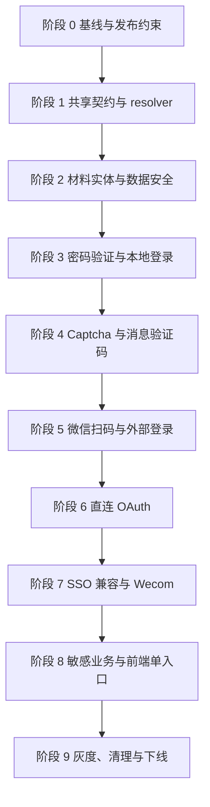

### 阶段 0：基线、数据盘点与发布约束

- [ ] 固化密码、验证码、微信、OAuth 的现有路由、请求、响应、Cookie、Session、username 映射、团队创建和埋点回归用例。
- [ ] 枚举主仓和 Pro 中所有 `auth_codes` 读写点，标注 key/type、过期时间、写入方式和消费方式，确认没有遗漏调用方。
- [ ] 编写重复材料 dry-run，按 type 输出重复组数、记录数、保留记录和脱敏样本；本阶段只读，不直接清理。
- [ ] 扫描启用 SSO 的部署中已有 `prefix-suffix` 本地账号，形成冲突迁移与回滚清单。
- [ ] 核对 Wecom SSO 的 `userid` 与内部 Wecom 的 `open_userid`，明确哪些部署可以同时声明两项 capability。
- [ ] 明确主应用、`pro/admin` 和 Pro submodule 指针的提交/发布顺序，并验证新旧 SSO 回调组合；`pro/sso` 保持不变。

完成门槛：现有行为回归测试通过；数据和账号冲突报告可重复生成；每个发布单元都有明确回滚点。

### 阶段 1：共享契约、resolver 与 API schema

- [ ] 在 `packages/global/support/user/account/verification/` 增加 method、account kind、capabilities、resolution 和稳定原因码 schema。
- [ ] 实现 `resolveAccountVerificationByUsername`，建立 canonical fixture，覆盖邮箱/手机号优先、直连 Provider、Wecom 自动顺序、通用 SSO 和旧密码兜底。
- [ ] 在前端和服务端分别实现配置 adapter；resolver 内不读取 `window`、数据库、`global.systemConfig` 或服务端 SDK。
- [ ] 在 `packages/global/openapi/support/user/account/verification/` 定义 create/consume 判别 union、响应和路由文档，补齐 `description`、`example` 与 `.strict()`。
- [ ] 统一导出前后端共享的 method、capabilities 和 resolution 类型，不在 global 放服务端身份实现。
- [ ] 增加敏感业务公开 capability，但不增加 OAuth/SSO 兼容开关。

完成门槛：global fixture 与 adapter 测试通过；前后端对同一输入得到同一唯一 method；现有生产行为没有变化。

### 阶段 2：材料实体、过期与唯一性

- [ ] 在 `packages/service/support/user/account/verification/` 建立 `schema.ts`、`entity.ts`、`service.ts`、`utils.ts` 和统一导出。
- [ ] 在 `service.ts` 定义 `AccountVerification` 抽象和三类可信身份类型；接口不出现 Session、Cookie 或具体业务返回值。
- [ ] 保持 collection 为 `auth_codes`，保留现有 type 值；新增 OAuth state scene 和敏感业务 key 命名空间。
- [ ] 实现 create、upsert、有效读取、原子 consume、微信条件更新和条件删除；全部查询显式包含 `expiredTime > now`。
- [ ] 按场景把普通验证码写入改为 upsert，把 OAuth state/微信 scene 改为随机键 create；碰撞不能覆盖已有流程。
- [ ] 在 key/type/provider 命名空间绑定敏感业务的 method、userId、scene 和 callback，不新增字段或 verification token。
- [ ] 保证迁移前已存在的验证码和微信记录在原有效期内仍可消费。
- [ ] 将全部旧读写方切到新 entity 后运行重复材料清理；先预览、再执行、再复核，脚本必须幂等。
- [ ] 仅在重复为零且所有写入方已兼容后创建 `{ key, type }` 唯一索引；失败时不修改现有索引。

完成门槛：材料 entity 的过期、并发、绑定、补偿和兼容测试通过；清理复核无重复；唯一索引可重复验证。

### 阶段 3：密码验证与本地登录应用服务

- [ ] 实现 `PasswordAccountVerification.create/consume`，迁移 `preLogin` 和 `loginByPassword`，保持客户端 hash 协议与响应不变。
- [ ] consume 先原子消费预登录 code，再校验用户、密码和禁用状态，只返回 `LocalAccountIdentity`。
- [ ] 拆出 `loginLocalAccount`，迁移用户详情、语言、最后团队和 Redis Session 编排；Cookie、埋点和审计留在 API 成功分支。
- [ ] 密码验证组件允许第三方来源账号验证正确密码；密码登录应用服务继续拒绝 Wecom 创建 Session。
- [ ] 更新全部 import 并删除已无引用的旧密码验证代码，不保留旧路径转发文件。

完成门槛：现有 `preLogin`、密码登录和 Session 回归测试全部通过；敏感密码验证与 Wecom 密码登录边界均有测试。

### 阶段 4：Captcha、消息验证码与业务消费者

- [ ] 拆出 `CaptchaChallengeService` 与 `CodeAccountVerification`，限定 register/findPassword/bindNotification 及新增敏感 scene。
- [ ] 把图片验证码、reCAPTCHA、发送锁、材料 upsert 和消息发送按第 5.2 节顺序编排。
- [ ] 在统一 `CodeAccountVerification.consume` 和迁移期旧 `authCode` 中复用 Redis `account + scene` 固定窗口频控，覆盖 60 秒 10 次边界、账号与 scene 隔离及超限错误文案。
- [ ] 将消息网络请求移出 Mongo transaction；发送失败时按 code 条件清理材料并释放锁。
- [ ] 迁移注册、找回密码、用户联系方式和团队通知账号消费者，保持业务校验、Session、Cookie 和审计行为。
- [ ] 所有相关 API 改用 global OpenAPI schema 与 `parseApiInput`，删除直接解析 `req.body/query` 的写法。
- [ ] 删除旧验证码 controller 前确认重发旧码失效、scene 隔离和迁移前记录兼容。

完成门槛：captcha/code、四类消费者和补偿故障测试通过；不存在继续向旧 controller 写入的调用方。

### 阶段 5：微信扫码与外部登录应用服务

- [ ] `WechatAccountVerification.create` 先创建有效期一致的 scene 占位，再请求临时二维码；上游失败按 scene 条件清理。
- [ ] callback 校验签名和请求尺寸后，只调用 `recordCallback` 更新有效占位，禁止任意 upsert。
- [ ] 保留微信 callback token 的既有源码常量，不新增后台配置入口；callback 仍必须先验签。
- [ ] `consume` 区分 pending/expired/verified，扫码成功时原子删除；保持现有 pending 对外响应。
- [ ] 微信 profile 请求和响应进入 service 并用 Zod 校验；上游失败按既定语义要求重新扫码。
- [ ] 建立 `loginExternalAccount`，迁入 `usernameLogin` 的已有用户、新用户、团队、联系方式、Session 和 forbidden 检查。
- [ ] 微信 API 成功后再写 Cookie 和埋点；并发轮询只能创建一个 Session。

完成门槛：微信签名、占位、轮询并发和登录回归测试通过；验证 service 中不存在用户创建或 Session 调用。

### 阶段 6：OAuth 基类与直连 Provider

- [ ] 实现 OAuth create API、服务端高熵 state、callback allowlist，以及 purpose/user/provider/callback 绑定。
- [ ] 实现 OAuth 基类的“只读校验 state -> Provider 交换 -> 原子删除 state”流程和并发保护。
- [ ] 迁移 GitHub、Google、Microsoft Provider，分别补齐 form body、官方 token 验证和所有上游响应 Zod schema。
- [ ] 前端改为调用 create API 获取 URL，不再本地拼接授权地址或生成安全 state；直连 Provider 回调必须提交 state，SSO 仅在 callback 完全无 state 时允许兼容。
- [ ] OAuth 登录统一进入 `loginExternalAccount`，保持 username 映射、Cookie、Session 和 track type。
- [ ] Provider code/state/token/secret 不进入 URL、响应或结构化日志。

完成门槛：三个直连 Provider 的 URL、交换、身份映射、state 并发与失败测试通过；非 SSO 缺 state 的请求全部被拒绝。

### 阶段 7：SSO 兼容、Wecom 与跨服务协调

- [ ] Pro Admin 获取 SSO 授权地址时始终传 state，但不要求旧 SSO 必须返回，也不修改 `pro/sso`。
- [ ] 实现唯一兼容分支：`provider=sso && state===undefined` 时 code-only；state 存在时统一进入 required-state consume。
- [ ] SSO 仅访问固定 base origin，限制 callback props 的键、数量、长度和保留字段。
- [ ] 实现 SSO 与 Wecom OAuth adapter；验证类只返回身份，不创建 FastGPT 用户。
- [ ] 把 Wecom `corpid` 到团队的映射和用户 provisioning 留在 `loginExternalAccount`。
- [ ] 前端仅允许 SSO 缺 state；state 存在时必须与 loginStore.state 相同，非 SSO 缺 state 必须拒绝。
- [ ] 敏感业务的 SSO code-only 结果必须与当前 Session 用户的持久化 username 精确一致。
- [ ] 对齐或迁移 `userid/open_userid` 命名空间；未对齐部署只开放来源明确的一项 capability。

完成门槛：SSO 正确 state、错误 state、无 state code-only、直连 Provider 无 state、敏感业务身份不匹配和 Wecom 团队映射测试通过。

### 阶段 8：敏感业务分派与前端唯一入口

- [ ] 实现前端 `useAccountVerificationMethod` 和 capabilities adapter，每个账号只渲染 resolver 返回的一种入口。
- [ ] 删除方式选择器和“切换旧密码”；只有无可展示验证码或 Provider 时才渲染 oldPassword。
- [ ] 实现敏感业务 create dispatcher：从 Session 加载持久化 username，推导一次并精确校验请求 method，再创建绑定材料。
- [ ] 实现 consume dispatcher：不重算 capabilities，只校验 method/userId/scene 材料绑定并调用对应验证实现。
- [ ] consume 后必须校验 contact/userId/username 与当前用户一致，再在同一请求内执行具体敏感业务。
- [ ] 请求 schema 不接受 username，method/payload 使用严格判别 union；篡改 method、跨 user/scene/state 和额外字段均被拒绝。
- [ ] 在实际存在的敏感业务中接入 dispatcher；账号注销仅由包含该功能的分支接入，不在当前分支虚构业务实现。

完成门槛：前端单入口、create 单次推导、consume 材料绑定和身份归属测试通过；不存在通用验证成功接口或 verification token。

### 阶段 9：灰度发布、旧代码清理与快速登录下线

- [ ] 按主应用、Admin 和 Pro submodule 计划完成灰度，观察 required-state/code-only consume outcome、上游错误和登录成功率；日志不得含敏感值。
- [ ] 演练应用版本回退和回滚唯一索引之外代码的流程；数据脚本保留 dry-run 和复核能力。
- [ ] 扫描并移除重复 username 分支、旧授权 URL/state 构造、旧 Provider route 函数和无引用 `support/user/auth` 文件。
- [ ] 确认目标实现均位于 `account/verification`，不存在 `accountVerification` 目录或旧路径 re-export。
- [ ] 统计 fastLogin 配置和路由使用，完成弃用窗口后删除 schema、OpenAPI、web API、页面、Pro handler 和管理配置；保留可信身份使用的 `usernameLogin` 业务能力。
- [ ] 运行各 workspace 测试、App/Admin typecheck、lint、仓库全量测试、`git diff --check` 和数据迁移复核。
- [ ] 使用 Mermaid 8.8.3 解析全部设计图，并同步更新 OpenAPI、运维说明和必要的用户文案。

完成门槛：灰度与回滚演练完成；旧路径和快速登录入口清零；第 13 章所有验收项均有可审计证据。

## 13. 验收标准

验收以“可观察行为 + 自动化测试或迁移输出”为准，不能只以文件已移动或代码已编译作为完成证据。

### 13.1 架构与契约

| ID | 验收条件 | 证据 |
| --- | --- | --- |
| A-01 | 通用契约位于 `packages/global/support/user/account/verification/`，服务实现位于各自 `account/verification/`；不存在 `accountVerification` 目录 | 目录扫描、import 扫描 |
| A-02 | `packages/service` 不导入 `pro/admin`；前端不导入 service-only 实现 | 依赖扫描、构建 |
| A-03 | 验证组件只创建/消费材料并返回可信身份，不创建用户、Session、Cookie，不写登录埋点或审计 | 单元测试、调用扫描 |
| A-04 | Local/contact/external identity 均为服务端判别类型；第三方身份字段只能来自 Provider consume | 类型检查、API 负例 |
| A-05 | 所有新增或修改 API 有 global OpenAPI schema，并通过 `parseApiInput` 校验边界输入 | OpenAPI 测试、路由扫描 |
| A-06 | collection 仍为 `auth_codes`，没有 verification token、OAuth token 或身份绑定新表 | schema diff、数据库检查 |

### 13.2 Resolver、前端与敏感业务

| ID | 验收条件 | 证据 |
| --- | --- | --- |
| R-01 | 前后端共用同一 resolver 和 canonical fixture；resolver 不读取运行环境 | Global/adapter 测试、依赖扫描 |
| R-02 | 邮箱和手机号优先于连字符规则；含合法 `-` 的邮箱不会进入 SSO | Resolver fixture |
| R-03 | WeChat/GitHub/Google/Microsoft capability 缺失时只降级 oldPassword，不转 SSO | Resolver fixture |
| R-04 | Wecom 按 SSO、内部 Wecom、oldPassword 自动单选；通用连字符账号仅受 SSO capability 控制 | Resolver fixture |
| R-05 | 每个非空 username 只得到一个 method；前端只展示一个入口，不存在方式选择器或旧密码切换 | Resolver 与组件测试、页面扫描 |
| R-06 | create 使用持久化 username 和服务端 capabilities 推导一次并校验 method；consume 不重算 capabilities | API/service 测试 |
| R-07 | consume 只接受同一 method、userId、scene 的材料，验证身份必须归属当前用户 | API 安全测试、并发测试 |
| R-08 | 敏感业务请求不接受 username，不签发通用验证成功结果或 verification token | OpenAPI schema、API 负例、路由扫描 |

### 13.3 材料、安全与并发

| ID | 验收条件 | 证据 |
| --- | --- | --- |
| M-01 | 每次读取/消费显式要求 `expiredTime > now`，TTL 延迟不会让过期材料成功 | 边界时间测试 |
| M-02 | 消费使用原子删除；并发请求最多一个得到可信身份或进入登录/敏感业务 | Mongo 并发测试、API 并发测试 |
| M-03 | 同一 `{ key, type }` 只保留最新材料；重复清理完成后唯一索引存在 | 迁移报告、索引检查 |
| M-04 | 迁移前已有验证码和微信记录在原有效期内仍可消费 | 兼容 fixture |
| M-05 | OAuth state 高熵、短期、一次性，并绑定 purpose、subject/provider、callback；仅旧 SSO 完全无 state 时走显式 code-only 兼容 | OAuth/SSO 测试 |
| M-06 | 微信 callback 只能更新有效占位；扫码成功只能被一个轮询消费 | 微信 service/API 测试 |
| M-07 | 消息或授权 URL 上游失败只条件清理本次材料，不误删并发重试产生的新材料 | 故障注入测试 |
| M-08 | 日志和响应不含 username、联系方式、code、state、openid、token、Provider 原始响应或 secret | 日志捕获测试、静态扫描 |
| M-09 | 验证码提交按 Redis `account + scene` 在 60 秒固定窗口内累计，前 10 次允许、第 11 次起统一返回频控错误，且新旧消费入口策略一致 | Service/Admin 频控边界与兼容测试 |

### 13.4 验证方式与登录兼容

| ID | 验收条件 | 证据 |
| --- | --- | --- |
| V-01 | 密码预登录协议、密码摘要、成功响应和 Session/Cookie 保持兼容 | App API 回归测试 |
| V-02 | 第三方来源账号可用正确旧密码完成敏感验证；Wecom 仍不能通过密码登录创建 Session | Password/service 测试 |
| V-03 | Captcha/code 的人机校验、发送锁、重发覆盖、scene 隔离、提交频控和失败补偿符合第 5.2 节 | Admin service/API 测试 |
| V-04 | 微信 pending 对外行为兼容，扫码后单次登录，签名和上游失败按第 5.3 节处理 | 微信回归与并发测试 |
| V-05 | GitHub、Google、Microsoft、Wecom、SSO 均由服务端 create/consume，响应经过 Zod 或官方库验证 | Provider 测试 |
| V-06 | 外部登录拒绝 forbidden 用户，并保持既有自动注册、默认团队、Wecom 团队映射、联系方式同步和 track type | 登录应用服务回归测试 |
| V-07 | 既有公开路由、成功响应、username 映射、Redis Session 规则和成功后埋点无非预期变化 | API contract diff、回归测试 |

### 13.5 迁移与交付

| ID | 验收条件 | 证据 |
| --- | --- | --- |
| D-01 | 重复材料、SSO 前缀冲突和 Wecom 命名空间均完成 dry-run、处理和复核，脚本重复执行结果稳定 | 脱敏迁移报告 |
| D-02 | 主应用、Admin 和 Pro submodule 的兼容矩阵通过；旧 SSO 无 state 可 code-only，新 SSO 带 state 必须完整校验，`pro/sso` 无本期改动 | 版本组合测试、发布记录 |
| D-03 | 旧 auth/controller、前端 URL/state 构造、route 内 Provider 逻辑和旧路径 re-export 已清除 | `rg`/依赖扫描、diff |
| D-04 | fastLogin 完成弃用窗口后从 schema、API、页面、handler 和管理配置移除，但 `usernameLogin` 可信身份能力保留 | 使用统计、路由与配置扫描 |
| D-05 | 定向测试、各 workspace 测试、App/Admin typecheck、lint、`pnpm test` 和 `git diff --check` 全部通过 | CI/本地命令输出 |
| D-06 | 全部 Mermaid 图由 8.8.3 解析通过，OpenAPI 和运维说明与最终实现一致 | Mermaid 校验输出、文档 diff |
| D-07 | 灰度指标无异常，应用回滚演练成功，未产生不可恢复的短期材料或 Session 行为 | 监控截图、演练记录 |
