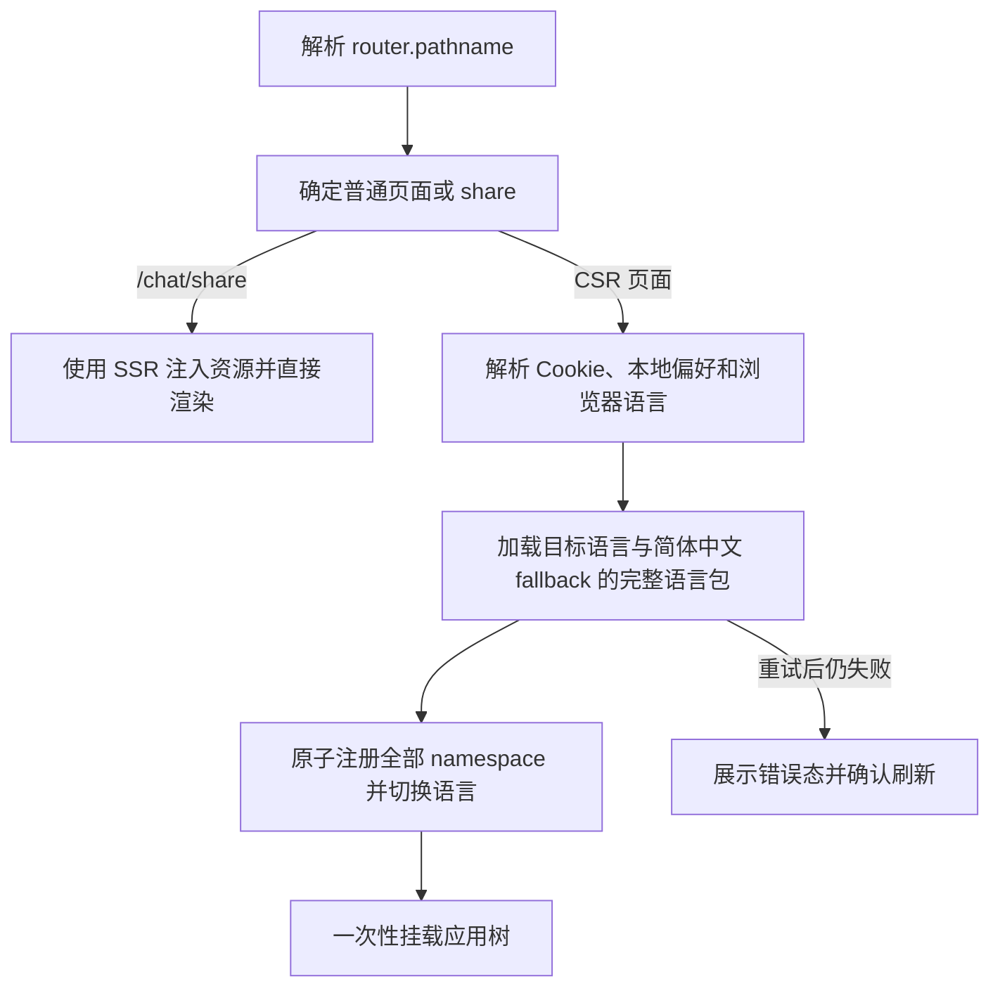

# 非分享页 CSR 与 i18n 完整语言包加载方案

## 1. 背景

FastGPT 主应用当前使用 Next.js Pages Router。`pages/_app.tsx` 通过
`appWithTranslation(AppRouter, clientI18nConfig)` 提供稳定的 i18n 上下文，各页面再通过
`getServerSideProps -> serviceSideProps -> serverSideTranslations` 注入页面需要的翻译资源。

现状包括：

- `/chat/share` 需要保留 SSR，用于首屏页面内容、分享应用名称、简介、头像和 Head 信息。
- 其他页面目标是逐步迁移到纯客户端渲染（CSR），不再依赖每次请求执行
  `getServerSideProps`。
- 当前仍有 24 个页面声明 `getServerSideProps`。绝大多数只返回
  `serviceSideProps`，但 `/chat`、`/dataset/detail`、`/login/fastlogin`、
  `/config/tool/marketplace` 等页面还返回查询参数或服务端业务数据，不能机械删除。
- 历史上 `serviceSideProps` 还从 `NEXT_DEVICE_SIZE` Cookie 读取 `deviceSize`，仅用于给
  `SystemStoreContextProvider` 的 Chakra `useMediaQuery` 提供 SSR fallback；迁移前置改动已删除该链路，
  `useSystem().isPc` 统一由浏览器媒体查询计算；默认 SSR fallback 为 PC。
- 翻译资源位于 `packages/web/i18n/{language}/{namespace}.json`，当前共 4 种语言、
  28 个 namespace。客户端只加载当前语言及简体中文 fallback，不把所有语言注入首屏。

本方案采用“小步试点、验证后扩面”：先以 `/account/apikey` 验证客户端 i18n 基础能力，随后扩展到
账户页面和 `/price`。当前代码已经完成这一批迁移，剩余页面仍按风险分批推进。

## 2. 目标与非目标

### 2.1 目标

1. `/chat/share` 继续 SSR，行为、SEO Head、分享语言 Cookie 和首屏内容保持不变。
2. 非分享页逐步移除 `getServerSideProps`，最终不再生成页面级服务端 HTML。
3. client-only 应用挂载前加载当前语言及简体中文 fallback 的完整 namespace 集合。
4. 同一浏览器会话内，相同语言包不重复解析和注册。
5. 页面刷新和后续访问尽量命中浏览器 HTTP 缓存，不自行维护翻译正文的
   `localStorage` 缓存。
6. 完整语言包就绪前保持白屏，就绪后一次性挂载页面树，不展示原始翻译 key，也不在路由切换时切换骨架。
7. 首个试点失败时可以只恢复一个页面的 SSR，不影响 `/chat/share` 和其他页面。

### 2.2 非目标

1. 本轮不切换到 Next.js App Router。
2. 本轮不修改既有翻译内容；只整理已迁移页面实际使用的 namespace，不做全量 namespace 重划分。
3. 本轮不一次性迁移所有页面。
4. 本轮不迁移 `projects/marketplace`；它共享翻译源目录，但保持现有 SSR 读取方式。
5. 本轮不把翻译正文写入 IndexedDB 或 `localStorage`。
6. 本轮不移除 Next.js server runtime；API Routes 和 `/chat/share` 仍依赖服务端。
7. 本轮不迁移 `pro/admin` 页面；客户端 i18n 基础能力放入 `packages/web` 并保持参数化，为 admin
   后续迁移复用。

## 3. 核心决策

### 3.1 i18n 实例全局初始化一次

`appWithTranslation` 仍是应用级 Provider，但必须向它传入稳定配置，使没有
`_nextI18Next` pageProps 的 CSR 页面也可以创建 i18n 实例。

当前只写 `appWithTranslation(App)` 时，实例初始化依赖页面通过
`serverSideTranslations` 返回的 `_nextI18Next`。试点页面删除
`serviceSideProps` 后不能继续依赖该隐式前提。

目标形态：

```ts
export default appWithTranslation(App, clientI18nConfig);
```

`clientI18nConfig` 只能包含浏览器可序列化的公共配置，不能把服务端绝对 `localePath` 或 Node.js 模块
打进客户端。公共语言列表、`defaultLocale`、`defaultNS` 和 fallback 配置应抽成单一来源，
`next-i18next.config.js` 在服务端补充文件系统 `localePath`；测试校验两边核心配置一致。

客户端稳定配置显式使用 `localePath: null`，避免 next-i18next 在浏览器或 `_app` 服务端分支自动创建
错误的文件/HTTP backend。`serverSideTranslations` 不使用这份 override 读取文件，仍通过
`next-i18next.config.js` 的绝对 `localePath` 生成 SSR pageProps；`appWithTranslation` 再把这些 pageProps
中的资源合并进全局实例。

配置需要满足：

- `defaultNS: 'common'`
- `fallbackLng: 'zh-CN'`，缺失词条统一回退到简体中文
- `localePath: null`
- `react.useSuspense: false` 作为全局默认值；已迁移组件也使用非 Suspense 加载
- `partialBundledLanguages: true`，允许 SSR 注入资源与客户端 backend 增量加载并存
- 通过 `use` 注册浏览器安全的 dynamic-import backend
- 不在公共 bundle 中静态注入全部翻译资源
- 服务端继续使用现有文件系统 `localePath`
- SSR 页仍可以把 `serverSideTranslations` 的资源合并到同一个实例

普通 CSR 页面首次进入时，不能沿用当前 `setUserDefaultLng` 的“发现 `NEXT_LOCALE` Cookie 就直接
返回”逻辑。该短路成立的前提是服务端已经按 Cookie 初始化语言；CSR 页面没有这个前提。门禁需要
显式解析 `Cookie -> localStorage -> navigator.language`，加载目标语言资源并调用
`i18n.changeLanguage` 后才允许渲染页面。

混合迁移期间 `appWithTranslation` 在没有 `_nextI18Next.initialLocale` 时会使用 Next Router 的默认
locale（当前通常为 `en`）。client-only 路由在进入 `appWithTranslation` 前只读取语言 Cookie，并把结果
注入 `_nextI18Next.initialLocale`。没有 Cookie 时允许先使用默认语言，挂载后再由 effect 从 localStorage、
内存或 `navigator.language` 恢复。client-only boundary 仍负责在资源未就绪时阻止业务页面渲染。稳定
config 的另一个作用是避免 SSR/CSR 路由切换时 Provider 在“存在/不存在”之间切换并导致整棵应用卸载重建。

### 3.2 资源按完整语言动态导入

生成脚本只维护一份 `language + namespace` loader map。完整语言加载器复用该映射，并行加载目标语言的
全部 namespace：

```ts
const resources = await Promise.all(
  I18N_NAMESPACES.map(async (namespace) => [
    namespace,
    (await generatedLoaders[language][namespace]()).default
  ])
);
```

选择动态 import 而不是运行时读取文件系统，原因如下：

- 浏览器不能访问当前 `localePath` 指向的 monorepo 文件系统目录。
- 每个翻译模块成为内容 hash 的静态 chunk，可直接使用 Next 静态资源的长期缓存；完整语言加载只是
  统一的运行时状态，不需要再生成一层聚合文件。
- chunk URL 自动包含 `basePath`，无需额外维护 `/fastai/locales`、`/gchat/locales` 等路径。
- 资源随应用构建版本发布，新版本产生新 hash，不需要手工实现缓存失效协议。
- `projects/marketplace` 可以继续通过原有文件系统 `localePath` SSR，不需要复制或移动翻译源。

不使用任意字符串模板直接 import。loader map 必须由受版本控制的生成脚本产生，确保 bundler
可以静态分析所有资源，也确保新增 namespace 或语言时不会漏项。生成结果需要接受
Prettier 格式化，并由测试检查与 `I18N_NAMESPACES`、支持语言和磁盘文件一致。

语言包 loader 与原有 namespace loader 都位于 `packages/web`。client-only 启动门禁直接加载完整语言包，
原有 i18next backend 继续保留作为 SSR 混合迁移和兼容路径：

```ts
const dynamicImportBackend = {
  type: 'backend' as const,
  read(language: SupportLanguage, namespace: I18nNsType[number], callback: ReadCallback) {
    loadLocaleResource(language, namespace).then(
      (resource) => callback(null, resource),
      (error) => callback(error, false)
    );
  }
};
```

backend 本身不负责业务路由判断，只把 i18next 发出的 `language + namespace` 请求转给生成的 namespace loader。
资源注册、已加载判断和 backend 状态由 i18next 管理。必须设置
`partialBundledLanguages: true`，否则实例中只要存在 SSR 注入的 `resources`，i18next 就可能把尚未加载的
namespace 误判为 ready。

client-only 门禁加载语言包后，通过 `addResourceBundle` 一次性注册全部 namespace；此后组件调用
`useTranslation(namespace)` 只做依赖声明和类型约束，不再产生页面级加载状态。backend 是
`packages/web` 内的小型兼容适配器，不引入新的 HTTP backend 依赖。翻译 JSON
本身已经由 `packages/web` 管理，因此 loader、backend、缓存和失败状态也由同一个包维护，
`projects/app` 与 `pro/admin` 复用时不会互相依赖项目目录。

页面 ready 条件覆盖“当前语言 + i18next 配置要求的 fallback 语言”。当前 fallback 为简体中文：
简体中文页面只加载简体中文完整包，其他语言页面加载目标语言完整包和简体中文完整包。

如果验证发现当前构建器无法稳定拆出 JSON chunk，再回退到以下备选方案：构建前复制资源到
`projects/app/public/locales`，并以版本化 URL 通过 HTTP backend 加载。试点期间不同时实现两套
资源加载机制。

### 3.3 组件继续显式声明 namespace

namespace 的正确性来源改为实际使用翻译的组件，而不是中央路由配置。迁移组件时，将无参调用改为
显式声明：

```tsx
const { t } = useTranslation(['apikey'] as const, {
  useSuspense: false
});
```

这样依赖仍与组件一起维护，类型参数继续受 `I18nNsType` 约束。它不再决定资源何时加载，完整语言包
已经在 client-only 应用挂载前注册完毕。

规则：

1. 每个已迁移组件必须声明自己直接调用 `t`、`Trans` 所使用的全部 namespace；不能依赖祖先组件
   “碰巧已经加载”。
2. 动态弹窗、抽屉和懒加载组件仍声明自己的 namespace，但挂载时资源已经存在，不需要额外骨架。
3. 完整语言包由 CSR 初始化门禁先加载，保证 `NextHead`、`Layout` 和公共组件不会展示 key；
   已迁移组件统一使用 `useClientTranslation(namespace)`，hook 内置 `common` 并关闭 Suspense。仅使用
   `common` 的组件调用 `useClientTranslation()`。
   `Layout` 根部声明 `price`，而 `serviceSideProps` 统一预加载 `price`，因此 SSR 页面无需再逐页声明该 namespace。
4. 原 `serviceSideProps(context, namespaces)` 数组只能作为迁移扫描起点，必须检查页面实际组件树中的
   `useTranslation`、`Trans` 和带 namespace 前缀的 key。
5. 不允许页面自行 `fetch` 或 `import` 翻译文件，所有资源统一由语言门禁加载。

页面根组件的首屏预加载声明为：

```tsx
useClientTranslation('apikey');
```

API key 专属文案统一收敛到 `apikey`，`AccountContainer`、`ApiKeyTable`、`TagMultiSelect` 和
`TagManageModal` 等试点可达组件分别显式声明自己的直接依赖。

CSR 路由集合与翻译依赖解耦，只负责渲染模式。当前 app 的集合为：

```ts
const clientOnlyRoutes = new Set([
  '/account/apikey', '/account/inform', '/account/setting', '/account/thirdParty',
  '/account/customDomain', '/account/bill', '/account/team', '/account/info',
  '/account/usage', '/account/model', '/price'
] as const);
```

页面只有在组件 namespace 改造和验收完成后才加入该集合，但集合本身不再复制 namespace 数据。

### 3.4 缓存与并发去重

client-only 启动加载以 `language` 为键；单 namespace backend 的状态仍以 `language + namespace` 记录，
便于兼容既有 SSR 路径和错误定位。

两层缓存职责：

| 层级 | 机制 | 作用域 | 失效方式 |
| --- | --- | --- | --- |
| 运行时资源缓存 | i18next resource store | 当前标签页会话 | 页面刷新或应用卸载 |
| 静态资源缓存 | 内容 hash 的 namespace chunk + HTTP cache | 浏览器跨刷新复用 | 新构建产生新 hash |

底层 `loadLanguageBundle` 在模块级维护进行中请求：

```ts
const pendingLanguageBundles = new Map<localeType, Promise<LanguageBundle>>();
```

加载过程为：

1. 门禁解析目标语言和 fallback 语言。
2. `pendingLanguageBundles` 已存在相同语言时复用同一个 dynamic import Promise。
3. 否则加载该语言聚合 chunk，并原子地把所有 namespace 注册到 i18next resource store。
4. Promise 完成后从 pending map 删除；失败按 300ms、1s、3s 退避重试，最终失败进入统一错误态。

语言级 Promise 防止初始化或并发切换边界重复执行。加载失败同步写入该语言全部 namespace 的错误状态。
顶层
`ClientI18nBoundary` 将这类错误转换成独立错误态，不能仅依赖 react-i18next 的 Suspense Promise：
该 Promise 在 backend 回调结束时会 resolve，即使底层加载失败，单独使用它可能继续渲染翻译 key。
每个语言包使用有限次数的退避重试；全部尝试失败后，错误态要求用户确认刷新页面，利用整页重新初始化
i18n 和静态 chunk，且不渲染不完整翻译。

不额外把翻译正文存入 `localStorage`，原因是：

- 静态资源缓存已经能覆盖刷新后的重复下载。
- `localStorage` 需要自行处理版本、原子写入、容量、解析异常和多标签同步。
- 同一资源会同时占用 HTTP cache、`localStorage` 和 i18next 内存，收益不足以抵消复杂度。

`localStorage`/Cookie 仅继续存语言偏好，不存翻译正文。

已迁移组件使用 `useClientTranslation('业务 namespace')`。该共享 hook 内部组合
`['common', namespace]` 并关闭 Suspense，调用方不重复声明 `common`，同时保留带 namespace 前缀的
翻译 key 类型检查。

### 3.5 页面渲染门禁

`ClientI18nGate` 下沉到 `packages/web`，只负责通用的客户端语言初始化：

```tsx
<ClientI18nGate
  defaultLanguage="en"
  storageKey={LANG_KEY}
  fallback={<PageLoading />}
>
  <ClientI18nBoundary>{children}</ClientI18nBoundary>
</ClientI18nGate>
```

共享组件不能读取 Next Router、`clientOnlyRoutes`、`FASTGPT_SHARE_LOCALE` 或 app/admin 的业务 store。
它只通过 props 接收默认语言、语言偏好 key、loading/error UI，并使用当前
`I18nextProvider` 中的实例。Gate 固定校验 `I18N_NAMESPACES` 的完整性，不接受页面 namespace 参数，
避免路由配置和组件依赖形成两份清单。app 默认语言传 `en`，admin 后续接入时传其配置的 `zh-CN`；两者都可以
复用 `NEXT_LOCALE`，但 admin 现存且未接入 i18next 的 `NEXT_LOCALE_LANG` 需要在 admin 迁移时单独
决定兼容或删除，不能固化进共享 Gate。

客户端路由进入后按以下顺序执行：



初始化门禁加载当前语言和 fallback 的完整资源，在此期间不挂载 `NextHead`、`Layout` 和页面组件。
资源完整后一次性挂载应用树。这样没有页面级资源发现、隐藏挂载或骨架切换，client-only 页面之间导航时
也不会重新进入 i18n loading。

直接访问或切换到 client-only 页面时：

- 所有 client-only 页面首次启动统一使用纯白加载态，资源完整后一次性展示。
- `Layout`、页面和后续懒加载组件所需 namespace 都已经存在，不会重新触发整页 loading。
- 已离开页面的请求可以正常写入 resource store，但不能改变当前页面错误状态；错误状态必须绑定
  `language + namespace`，而不是用单个全局 ready 布尔值。
- 加载失败不能标记为成功；展示刷新提示并保留 `language`、`namespace` 错误上下文。

### 3.6 语言切换

普通页面语言切换流程调整为：

1. 加载目标语言完整包及简体中文 fallback 完整包。
2. 校验每个 `I18N_NAMESPACES` 都可用，并暂存旧语言资源和偏好。
3. 全部成功后执行 `i18n.changeLanguage(targetLanguage)`；也可以直接使用
   `changeLanguage` 的 backend 加载阶段，但必须接管错误结果。
4. 持久化 `NEXT_LOCALE`。
5. 不再因为补资源而强制整页 reload。

语言切换会加载该语言全部 namespace，换取切换后的页面、弹窗和懒加载组件都不会出现混合语言或 key。

如果加载失败，保留原语言，不写入新的语言偏好，避免页面进入“语言已切换但资源不完整”的状态；
全局错误态要求用户确认刷新，刷新后重新读取 Cookie、本地存储和浏览器语言。

SSR 页面只按语言 Cookie 选择首屏语言；没有 Cookie 时使用 Next 默认语言，并允许客户端 effect 挂载后
再从 localStorage、内存或 `navigator.language` 恢复，因此首次无 Cookie 的语言闪烁属于可接受行为。
客户端成功写入语言时还会写入 localStorage 镜像，普通 CSR 页面可在 Cookie 到期后恢复原语言并重新
续写 Cookie。API 请求继续由客户端发送 `x-fastgpt-language`，服务端不直接访问浏览器存储。

分享页使用独立的 `FASTGPT_SHARE_LOCALE`。分享页的 Axios、SSE 和 Skill 流式请求从该 key 读取
Cookie/localStorage/内存，并发送独立的 `x-fastgpt-share-language` 请求头；服务端让该请求头优先于主站
`NEXT_LOCALE`，避免分享页语言被主站语言覆盖。普通页面仍只发送 `x-fastgpt-language`，两条语言链路互不污染。
服务端 API 只有在请求带有分享语言头时才读取 `FASTGPT_SHARE_LOCALE` Cookie（该 Cookie 的 Path 为 `/`，
普通页面也可能携带它）；未标记的普通请求会忽略分享 Cookie。分享页 SSR 则由 `serviceSideProps` 显式选择
分享 Cookie，再回退主站 Cookie。

首次初始化也遵循相同顺序：即使已经存在 `NEXT_LOCALE` Cookie，也必须为 CSR 页面显式加载该语言
并执行 `changeLanguage`。只有没有 Cookie 时才使用旧版 `localStorage` 偏好或浏览器语言，并在加载
成功后写回标准化后的 `NEXT_LOCALE`。

`/chat/share` 本阶段保持现有 `FASTGPT_SHARE_LOCALE`、SSR 资源注入与 reload 行为，不与普通页面的
本轮迁移同时修改。

### 3.7 CSR 边界

删除 `getServerSideProps` 只会使 Pages Router 页面变成自动静态优化，并不等于禁用页面 HTML
预渲染。为了验证“除分享页外只在客户端渲染”，应用入口需要设置明确的 client-only boundary：

- `/chat/share` 走原有同步 SSR 渲染路径。
- 已迁移页面走 `{ ssr: false }` 的客户端应用壳。
- 未迁移页面在过渡期继续走现有 SSR 路径。

因此过渡期不能用简单的“pathname 不是 `/chat/share` 就 CSR”开关，否则会一次性改变所有页面。
已迁移路由由独立的 `clientOnlyRoutes` 判定：

```ts
const isClientOnlyRoute = (pathname: string) => clientOnlyRoutes.has(pathname);
```

当前 `_app` 的结构是：全局 Provider 和 `AppShell` 始终挂载，已迁移路由只把页面内容交给
`ssr: false` 的 `ClientOnlyPage`；未迁移页面和 `/chat/share` 继续由同一个 `AppShell` 渲染。

```tsx
const ClientOnlyPage = dynamic(() => import('@/web/context/ClientOnlyPage'), {
  ssr: false
});

function AppRouter(props: AppPropsWithLayout) {
  const isClientOnlyRoute = clientOnlyRoutes.has(props.router.pathname);
  return <AppShell {...props} clientOnly={isClientOnlyRoute}
    renderPage={isClientOnlyRoute ? () => <ClientOnlyPage {...props} /> : undefined} />;
}

export default appWithTranslation(AppRouter, clientI18nConfig);
```

`AppShell` 内部只在 `clientOnly` 路由包裹 `ClientI18nGate`、`ClientI18nBoundary` 和
`SystemStoreContextProvider.waitForReady`。完整语言包和设备信息 ready 后才挂载页面。因此已迁移路由
不输出服务端页面业务 HTML，且不会经历页面级 namespace 门禁。

当全部非分享页面迁移完成后，再切换为“除 `/chat/share` 外默认 client-only”，并删除过渡兼容分支。

### 3.8 `deviceSize` 处理

在 i18n 试点前先删除 `deviceSize` 整条链路：

1. `serviceSideProps` 不再读取或返回 `NEXT_DEVICE_SIZE`。
2. app/admin 的 `_app` 不再向 `SystemStoreContextProvider` 传 `pageProps.deviceSize`。
3. `SystemStoreContextProvider` 不再写设备 Cookie/localStorage，只保留
   `useMediaQuery('(min-width: 900px)')`，初始 fallback 使用 PC。
4. client-only 页面通过 `waitForReady` 等待浏览器首次媒体查询结果，在结果确认前保持白屏；结果确认后
   才选择桌面或移动骨架，不会先显示错误尺寸的布局。

仍保留 SSR 的 `/chat/share`、admin 和 marketplace 会使用 PC fallback 生成服务端 HTML，客户端 effect
后切换到真实宽度；这不会造成 hydration mismatch，但移动端可能出现一次布局调整。普通页面进入
client-only boundary 后会等待真实宽度确认，不会把这次调整暴露给用户。设备类型不写入 localStorage：
缓存值可能来自旧窗口或旧设备，只能作为提示，不能作为当前布局依据。该取舍消除了有状态设备 Cookie、
过期尺寸和 i18n helper 混入设备职责的问题。

## 4. 本轮迁移范围与实现

### 4.1 选择 `/account/apikey`

选择原因：

- 当前 `getServerSideProps` 只调用 `serviceSideProps`，没有服务端业务查询或权限决策。
- 页面已有客户端 API 请求加载 API key 数据，不需要新增数据接口。
- 页面经过登录态 `Auth`、桌面/移动布局、账户侧栏和多个弹窗，能够真实验证应用壳加载。
- 页面直接使用 `common`、`account`、`apikey`，足以验证多个 namespace
  的加载和缓存。
- 回滚只需恢复该页面 `getServerSideProps`，影响范围小。

### 4.2 本轮实现范围

1. 建立客户端 i18n 配置与动态资源 loader。
2. 建立生成并校验 locale loader map 的脚本。
3. 接入 dynamic-import backend，并把迁移组件改为显式 `useTranslation(namespace)`。
4. 在 `_app` 增加 i18n ready 门禁和针对已迁移路由的 client-only boundary，保持 `AppShell` 常驻。
5. 删除账户页面和 `/price` 的 `serviceSideProps` import 与 `getServerSideProps`。
6. 保持 `/chat/share` 代码和 SSR 输出不变。
7. 将 `price` 作为 `serviceSideProps` 的全局预加载 namespace，因为常驻 `Layout` 中的充值弹窗可能在任意页面打开。
8. 增加 loader、缓存、路由门禁、语言切换和语言格式归一化测试。
9. 删除 PromotionRecord 历史索引、模型、接口和前端返佣功能。
10. 区分普通页与分享页语言请求头，避免 request interceptor 直接用主站 localStorage 覆盖分享语言。
11. GitHub/Forgejo workflow 增加 Web 测试和覆盖率任务；合并后再验证新 workflow 的门禁效果。

### 4.3 实际代码落点

当前实现的职责边界如下：

| 位置 | 职责 |
| --- | --- |
| `packages/web/i18n/clientConfig.ts` | 创建可由 app/admin 覆盖 `defaultLocale` 的稳定客户端公共配置 |
| `packages/web/i18n/resourceLoaders.generated.ts` | 唯一的 `language + namespace -> dynamic import` 生成映射，供 backend 和完整语言加载复用 |
| `packages/web/i18n/dynamicImportBackend.ts` | 把 i18next backend `read` 接到生成的 loader map |
| `packages/web/i18n/resourceLoaders.ts` | dynamic import、pending Promise 去重和资源错误状态 |
| `packages/web/i18n/ClientI18nGate.tsx` | 参数化解析语言，加载完整目标语言链并完成首次语言切换 |
| `packages/web/i18n/ClientI18nBoundary.tsx` | 捕获 namespace 加载错误并提供刷新提示 |
| `projects/app/src/web/context/AppShell.tsx` | 从 `_app` 抽出的现有应用布局与初始化逻辑，SSR/CSR 共用 |
| `projects/app/src/web/context/ClientOnlyPage.tsx` | 无 SSR 动态入口，给共享 Gate 注入 app 参数后挂载页面 |
| `projects/app/src/web/context/clientOnlyRouteConfig.ts` | 通过路由前缀和少量特例识别 client-only 页面，不声明 namespace |
| `scripts/generate-i18n-resource-loaders.mjs` | 扫描共享包支持语言和 namespace，生成 loader map |
| `scripts/check-i18n-resource-loaders.mjs` | 校验生成结果与翻译资源一致 |
| `projects/app/src/pages/_app.tsx` | Provider 配置、SSR/CSR 分流及整个应用壳的翻译门禁 |
| `packages/web/i18n/utils.ts` | 语言偏好、语言映射和 namespace 预加载工具 |
| `projects/app/src/pages/account/*.tsx`、`projects/app/src/pages/price.tsx` | 删除已迁移页面的 `getServerSideProps` |
| `packages/web/test/i18n/*.test.ts`、`packages/service/test/common/middle/i18n.test.ts` | loader、缓存、语言映射和请求语言解析测试 |

生成脚本需要接入 app/admin 的开发和构建前置步骤，且 CI 中增加“生成结果没有 diff”的检查，避免开发者
新增 namespace 后只在本地生成但未提交。loader 文件只承载机械映射，不写业务逻辑。

共享 i18n 模块不得使用 `@/` 别名或读取 app/admin 路由。各项目负责用自己的 `_app`、动态
client-only boundary 和默认语言配置组合共享能力。admin 本轮不跟随试点迁移，只要求共享 API 的设计
能支持其后续接入，并通过一个最小 Gate 单元测试覆盖 `defaultLanguage="zh-CN"` 的参数化行为。

### 4.4 本轮验收条件

功能验收：

- 直接访问当前 client-only 路由能正常完成登录态校验和页面展示。
- 页面加载过程中不出现 `common:*`、业务 namespace 原始 key。
- API key 列表、创建、编辑、删除、标签管理、复制、排序和搜索可正常使用。
- 桌面与移动布局正确，首次访问不发生明显布局跳变。
- 从其他页面进入 `/account/apikey` 和从试点页返回其他页面均正常。
- 中文、繁体中文、英文切换正确；切换失败时保留原语言。
- `/chat/share` 的 SSR HTML、Head 和独立语言偏好无回归。
- 非根路径部署至少验证 `NEXT_PUBLIC_BASE_URL=/fastai`。

渲染验收：

- 请求 `/account/apikey` 返回的服务端 HTML 中不包含 API key 页面业务文案或表格结构。
- 请求 `/chat/share?shareId=...` 返回的服务端 HTML 仍包含分享页对应 Head 信息。
- 当前 11 个 client-only 路由不再出现在 `getServerSideProps` 页面清单中。

缓存验收：

- 冷启动加载目标语言完整包；非简体中文语言同时加载简体中文 fallback 完整包。
- 同一语言下离开再进入 `/account/apikey`，不产生新的语言 chunk 请求或动态 import 执行。
- 同一语言包被并发需要时，只执行一次底层 loader。
- 切换到新语言时加载目标语言完整包，已缓存的简体中文 fallback 不重复下载。
- 刷新后静态翻译 chunk 命中 HTTP cache；发布新构建后使用新的 hashed URL。

质量门槛：

- namespace 加载失败时进入明确错误态并提示用户刷新，不继续渲染不完整翻译；该行为是有意的全局兜底。
- i18n 门禁不会让 API、WebSocket、轮询或业务 effect 在翻译就绪前重复启动。
- TypeScript、lint、相关单元测试和应用构建通过。

### 4.5 观察期

试点上线后至少观察一个完整发布周期，且覆盖三种语言、桌面/移动端和至少一个非根路径部署。
关注：

- 前端错误日志中的翻译加载失败、动态 chunk 404 和 ChunkLoadError。
- `/account/apikey` 首次可交互时间与现有 SSR 基线的差异。
- 语言 chunk 请求数量、传输体积和缓存命中情况。
- 语言切换失败率。
- `/chat/share` SSR 请求和页面行为是否保持原有水平。

本轮实现已完成代码迁移；直接访问、弹窗、三种语言和 basePath 等浏览器验收仍属于发布后的观察项。

## 5. 分批迁移计划

### 第一阶段：基础能力与单页试点（已完成实现）

先迁移 `/account/apikey` 验证架构假设、构建产物、缓存和回滚链路，随后在同一实现上扩展账户页面和价格页。

### 第二阶段：纯 i18n 页面（账户/价格批次已完成）

已完成的账户/价格批次包括：

1. `/account/apikey`、`/account/bill`、`/account/inform`、`/account/setting`、
   `/account/customDomain`、`/account/thirdParty`。
2. `/account/info`、`/account/team`、`/account/model`、`/account/usage`、`/price`。

仍待迁移的纯 i18n 页面包括：

1. Dashboard 列表页：`/dashboard/agent`、`/dashboard/tool`、
   `/dashboard/templateMarket`、`/dashboard/systemTool`、`/dashboard/mcpServer`、
   `/dashboard/evaluation`、`/dashboard/evaluation/create`、`/dashboard/create`、
   `/dashboard/skill`。
2. 数据集、应用和其他页面：`/dataset/list`、`/config/tool`、`/app/detail`、
   `/skill/detail`、`/login`、`/login/provider`。

每批都需要：把可达组件改为显式 `useTranslation(namespace)`、删除对应 `getServerSideProps`、验证
冷/热缓存和语言切换，不能只依赖原 `serviceSideProps` 数组。

### 第三阶段：带服务端 props 的页面

单独设计和迁移以下页面：

- `/dataset/detail`：把 `datasetId`、`currentTab` 改为从 `router.query` 读取并处理
  `router.isReady`。
- `/login/fastlogin`：把 `code`、`token`、`callbackUrl`、`lastTmbId` 改为客户端 query，确保
  鉴权 effect 只执行一次且不会在 query 未就绪时误请求。
- `/config/tool/marketplace`：把 `MARKETPLACE_URL` 改为安全的客户端配置来源，禁止暴露其他服务端配置。
- `/chat`：把 query、Cookie 判断和 MongoDB `MongoOutLink` 查询迁移为有鉴权边界的客户端 API；这是
  高风险项，必须单独设计。

### 第四阶段：特殊页面与收尾

- 审查 `_error`、404、根路由和 API 文档页。API 文档页当前用空 `getServerSideProps` 禁止静态生成，
  移除前必须确认 Scalar 组件在 client-only boundary 下正常。
- 将所有已迁移非分享页切换为默认 client-only，仅 `/chat/share` 保留 SSR。
- 删除过渡期 `clientOnlyRoutes` 白名单，改为除 `/chat/share` 外默认 CSR。
- 收缩 `serviceSideProps` 的职责和引用范围。
- 再次扫描所有 `getServerSideProps`，确认除明确豁免页面外没有残留。

## 6. 测试方案

### 6.1 单元测试

1. locale loader map 覆盖所有支持语言和 `I18N_NAMESPACES`。
2. 所有 loader 能返回合法 JSON 对象。
3. 完整语言 loader 覆盖每种语言的全部 namespace。
4. 并发请求相同语言复用同一个 Promise，只执行一次 loader。
5. 不同语言分别生成独立 chunk。
6. 语言包加载失败时退避重试，最终失败进入可定位的错误态，不渲染原始 key。
7. 组件的 namespace 参数继续受类型约束。
8. 语言切换在资源成功后才更新语言和存储；失败时不改变当前语言。

### 6.2 页面测试

1. 模拟首次访问 `/account/apikey`，断言 loading 后再出现已翻译内容。
2. 模拟客户端路由重复进入，断言不重复加载。
3. 模拟加载失败并确认刷新提示。
4. 模拟在加载过程中切换路由或语言，断言旧页面失败状态不会污染新页面。
5. 断言 `/chat/share` 不经过 CSR i18n 门禁，仍使用 SSR 注入资源。
6. 从中文 SSR 页面导航到试点 CSR 页面，断言门禁完成后保持中文且不闪现英文内容。
7. 从试点 CSR 页面返回 SSR 页面，断言不发生应用状态整体重建。

### 6.3 构建与手工验证

局部开发阶段运行试点相关测试、typecheck 和 lint。试点完成后运行应用 production build，检查：

- 完整语言加载能并行加载该语言的全部 locale JSON。
- root 与 basePath 部署都能加载 chunk。
- 服务端 HTML 符合 CSR/SSR 边界。
- 浏览器 Network 面板中的冷启动、重复导航、语言切换和刷新缓存行为符合验收条件。

全量测试只在本轮实现完成后运行一次。

## 7. 回滚方案

当前批次回滚按以下顺序：

1. 恢复目标页面的 `serviceSideProps` 与 `getServerSideProps`。
2. 从 `_app.tsx` 的 `clientOnlyRoutes` 移除对应页面，使其不再进入 client-only 分支。
3. 保留未被试点使用的客户端 i18n 基础代码时，必须确认它不改变现有 SSR 页行为；否则整体回滚基础代码。
4. `/chat/share` 始终不参与试点回滚，因为试点不修改其 SSR 方案。

禁止在出现翻译加载问题时静默回退为展示 key；应明确回滚该页面或修复 loader。

## 8. 风险与防护

| 风险 | 防护 |
| --- | --- |
| 删除 `serviceSideProps` 后 Provider 不创建 | 给 `appWithTranslation` 传入稳定客户端配置并测试无 `_nextI18Next` 页面 |
| 有语言 Cookie 时仍停留在默认语言 | CSR 门禁不复用 SSR 的 Cookie 短路，始终显式加载并切换目标语言 |
| SSR/CSR 路由切换时短暂使用 Router 默认语言 | 有 Cookie 时在 Provider 初始化前注入；无 Cookie 时接受一次闪烁并由 effect 恢复 |
| client-only 路由切换时出现 key 或页面重新初始化 | 应用启动前加载完整语言包；路由切换不再进入 i18n 门禁 |
| 组件漏声明 namespace | 类型约束、静态扫描、missingKey/failedLoading 监控和完整页面操作验收 |
| 同时请求导致重复加载 | `pendingLanguageBundles` 按语言复用 Promise，并补并发测试 |
| 语言切换时出现混合语言 | 先加载目标语言全部资源，成功后再 changeLanguage |
| 动态 import 被打入公共首包 | production build 检查 chunks 和首屏资源清单 |
| basePath 下资源 404 | 使用 Next 管理的 hashed chunk，并验证 `/fastai` 部署 |
| namespace 加载失败 | `ClientI18nErrorFallback` 统一提示“加载失败，请刷新”，确认后执行全局刷新，避免继续渲染不完整翻译 |
| 试点页面仍被静态预渲染 | 使用显式 client-only boundary，并检查返回 HTML |
| SSR 分享页回归 | `/chat/share` 独立路径和回归测试，保持 serverSideTranslations 注入 |
| 翻译发布后旧缓存不失效 | 使用内容 hash 的构建产物 URL，不使用固定 URL + immutable |

## 9. TODO

### 方案确认

- [x] 盘点当前 SSR、i18n、deviceSize 和语言偏好实现
- [x] 删除 `deviceSize` pageProps、`NEXT_DEVICE_SIZE` Cookie 和 Provider SSR fallback 链路
- [x] 选择 `/account/apikey` 作为首个试点页面
- [x] 明确按完整语言 chunk 加载、按浏览器 HTTP cache 跨刷新复用
- [x] 明确 `/chat/share` 保持 SSR
- [x] 评审并确认本方案后开始编码

### 第一阶段：基础能力（代码已完成）

- [x] 实现客户端 i18n 稳定配置，使无 `_nextI18Next` pageProps 的页面也有 Provider
- [x] 实现 locale loader map（已迁移 namespace）和动态 import backend
- [x] 实现动态 import、并发去重、资源注册和失败状态底层能力
- [x] 在 `packages/web` 实现参数化 `ClientI18nGate`，不依赖 app/admin 路由和业务状态
- [x] 实现类型安全的 `clientOnlyRoutes`，只承担已迁移页面的 CSR 分流
- [x] 实现完整语言包初始化门禁，目标语言及简体中文 fallback 就绪后再挂载应用
- [x] 移除页面首屏 namespace 门禁和 namespace 引用追踪
- [x] 移除 account/config 页面骨架，所有 client-only 页面初始化时统一白屏
- [x] 实现迁移路由限定的 client-only boundary
- [x] 调整迁移页面初始化为“先加载、再切换、再持久化”
- [x] client-only 路由在 Provider 初始化前只注入语言 Cookie；无 Cookie 时由 effect 恢复
- [x] 移除账号首页专用预加载，统一依赖 `common` 门禁与业务 namespace 后台加载
- [x] 为上述能力补充自动化单元测试（loader、backend、原子切换、语言映射和服务端请求解析）

### 第一批：账户页面与 `/price`（代码已完成，浏览器验收待发布）

- [x] 将迁移可达组件改为显式 `useTranslation(namespace, { useSuspense: false })`
- [x] API key 组件声明 `common`、`apikey`，账户容器声明 `common`、`account`
- [x] 删除迁移页面的 `serviceSideProps` 和 `getServerSideProps`
- [x] 将 `/account/apikey`、`/account/bill`、`/account/inform`、`/account/setting`、`/account/thirdParty`、`/account/customDomain`、`/account/team`、`/account/info`、`/account/model`、`/account/usage`、`/price` 加入 client-only 路由集合
- [x] Layout 常驻时全局预加载 `price` namespace，覆盖任意页面打开充值弹窗的场景
- [x] `zh-Hant-TW` 等脚本/地区格式统一归一化为 `zh-Hant`
- [x] 分享页从 `FASTGPT_SHARE_LOCALE` 读取语言并发送独立请求头，不读取主站语言覆盖分享语言
- [x] 加载失败展示独立错误态，确认按钮执行刷新
- [ ] 验证试点页直接访问、客户端导航、桌面端和移动端
- [ ] 验证 API key 完整操作路径与登录态跳转
- [ ] 验证三种语言及切换失败行为
- [ ] 验证冷启动、重复进入、切换语言、刷新后的缓存行为

### 第二阶段：`/account/inform`

- [x] 页面与通知详情弹窗显式声明 `common`、`account_inform`
- [x] 删除页面的 `serviceSideProps` 和 `getServerSideProps`
- [x] 将 `/account/inform` 加入 client-only 路由集合
- [ ] 验证通知列表、详情弹窗、已读状态和分页

### 第三阶段：账户设置与第三方账号

- [x] `/account/setting` 显式声明 `common`、`account_setting`
- [x] `/account/thirdParty` 及其弹窗显式声明 `common`、`account_thirdParty`
- [x] 删除两个页面的 `serviceSideProps` 和 `getServerSideProps`
- [x] 将两个页面加入 client-only 路由集合
- [ ] 验证语言切换、时区保存和第三方账号配置弹窗

### 第四阶段：自定义域名

- [x] 页面与域名弹窗显式声明 `common`、`account_custom_domain`
- [x] 删除页面的 `serviceSideProps` 和 `getServerSideProps`
- [x] 将创建域名弹窗明确设置为 `ssr: false`
- [x] 将 `/account/customDomain` 加入 client-only 路由集合
- [ ] 验证域名列表、创建/编辑、删除和 DNS 检查

### 第五阶段：使用记录

- [x] 页面、列表、详情与图表显式声明 `common`、`account_usage`
- [x] 删除页面的 `serviceSideProps` 和 `getServerSideProps`
- [x] 将 `/account/usage` 加入 client-only 路由集合
- [x] 充值弹窗仅在打开时延迟加载 `user` namespace，加载期间不阻塞页面
- [x] 补齐繁体 `account_usage` 缺失的翻译 key
- [ ] 验证列表筛选、导出、详情、Dashboard 与充值弹窗

- [x] 验证已迁移页面服务端 HTML 不含业务页面内容
- [x] 验证 `/chat/share` SSR、Head 与语言隔离无回归
- [x] 运行 Web 测试、typecheck、生成资源校验和 diff check；Service 定向测试在本地受 MongoMemoryServer sandbox 限制，CI 已通过
- [ ] 验证 root 和 `/fastai` basePath 构建与运行
- [ ] 运行 production build 和全量本地测试

### CI（合并后验证）

- [x] GitHub/Forgejo workflow 已增加 `test-web`、覆盖率上传及生成资源校验
- [ ] 合并后确认新 workflow 已成为实际分支门禁；当前分支不提前修改 workflow 逻辑

### 观察与扩面

- [ ] 记录本轮发布前后的首屏、错误率、资源体积与缓存命中基线
- [ ] 完成至少一个发布周期观察
- [ ] 根据观察结果确认继续、调整或回滚
- [ ] 按剩余页面列表逐批迁移纯 i18n 页面
- [ ] 为第三阶段带服务端 props 页面分别补充设计
- [ ] 完成特殊页面审查和默认 CSR 收尾
- [ ] 最终扫描并确认仅 `/chat/share` 保留业务页面 SSR；任何新增豁免必须单独评审

### 邀请返佣功能清理

- [x] 删除 `/account/promotion` 页面、前端请求和翻译资源
- [x] 删除返佣查询接口、注册奖励和支付返佣写入逻辑
- [x] 删除 PromotionRecord 类型、Mongoose Schema 和关联图标
- [x] 删除仅用于返佣的 `inviterId`、`promotionRate` 请求及用户字段
- [x] 保留独立的 CRM/SEM 营销归因链路和历史 MongoDB 数据

## 10. 参考资料

- [next-i18next v15.4.2：增量采用与稳定初始配置](https://github.com/i18next/next-i18next/blob/v15.4.2/README.md#usage-with-fallback-ssg-pages)
- [i18next：新增或按需加载翻译](https://www.i18next.com/how-to/add-or-load-translations)
- [i18next：Namespaces](https://www.i18next.com/principles/namespaces)
- [i18next API：`hasResourceBundle` 与资源加载](https://www.i18next.com/overview/api)
