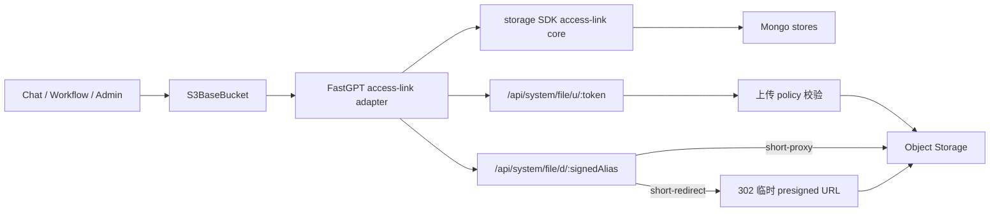

# S3 文件访问重构设计

## 1. 状态与范围

本设计记录当前已经落地的 S3 文件访问方案，覆盖以下能力：

1. 用短链替代模型可见的长 JWT 上传、下载链接。
2. 将上传校验拆成 `policy + hint + evidence`，支持无后缀文件和显式自定义扩展名。
3. ChatBox 删除上传占位时真正中止预签和 PUT 请求，并阻止异步结果回写。
4. 支持 `short-proxy`、`short-redirect` 两种下载模式，默认使用 `short-proxy`。
5. 抽取 `@fastgpt-sdk/storage/access-link`，让协议状态机与 FastGPT/Mongo 适配解耦。
6. 保持文件对象、临时 TTL、聊天删除和短链记录的原有清理语义。

不在本次范围内：重做所有文件资产的事务模型、让 Plugin Server 承接主项目文件下载、把业务资源权限下沉到匿名短链路由。

## 2. 总体架构



分层职责：

| 层 | 职责 |
| --- | --- |
| SDK core | HMAC、过期分桶、alias 去重、token hash、verify/revoke 状态机和 store port |
| Service adapter | Mongo schema/store、环境变量、URL builder、日志和 FastGPT 错误映射 |
| App route | HTTP 方法、Zod 入参、上传/下载流、302、状态码和客户端断开处理 |
| 业务入口 | 在签发前完成 team/app/chat/dataset 等资源鉴权，短链路由不重复业务鉴权 |

## 3. 短链协议

### 3.1 下载

默认 URL：

```text
/api/system/file/d/<aliasId>.<expMinute36>.<sig>
```

- `aliasId`：16 位随机 Base64URL ID，用于查询对象映射。
- `expMinute36`：Unix 分钟的 36 进制编码，过期时间直接参与签名。
- `sig`：`HMAC-SHA256(FILE_TOKEN_KEY, version + aliasId + expiry)` 的前 22 位 Base64URL。
- `.` 是 URL path-safe 分隔符，三段长度固定且易于严格解析。

Mongo 集合 `s3_download_aliases` 只保存对象映射，不保存可直接使用的 bearer URL：

```text
aliasId, aliasKey, bucketName, objectKey,
filename?, responseContentType?,
lastIssuedAt, purgeAt, disabledAt?
```

`aliasKey` 是 `bucketName + objectKey + filename + responseContentType` 的 HMAC。同一对象变体重复签发会复用 alias，只有过期时间和签名变化，因此文档数量接近对象变体数，不随页面刷新次数线性增长。

签发时按 TTL 向上分桶：短期 15 分钟、中期 1 小时、长期 24 小时。批量签发先对 aliasKey 去重，再使用 `$in` 查询和批量创建；只有 `purgeAt` 接近新链接有效期边界时才低频续租，避免每次签发产生 Mongo 写入。

校验顺序：格式 -> 过期 -> 常量时间 HMAC -> alias 查询 -> revoke 状态 -> payload。任何失败都不能暴露 bucket、objectKey 或 alias 是否存在等内部细节。

### 3.2 上传

URL：

```text
/api/system/file/u/<shortToken>
```

- token 为 22 位随机 Base64URL；Mongo 只保存 HMAC hash，不保存明文。
- `s3_upload_sessions` 保存 bucket/object、大小限制、policy、hint、metadata、`expiresAt/usedAt/revokedAt`。
- 当前使用策略为 `mark-used`：验证成功时记录 `usedAt`；过期记录由 Mongo TTL 索引删除。
- 上传仍由 App proxy 承接，以便执行大小、内容类型、metadata 和中止处理；不能把公开下载前缀用于上传。

### 3.3 索引与清理

| 集合 | 关键索引 | 清理 |
| --- | --- | --- |
| `s3_download_aliases` | `aliasId unique`、`aliasKey unique`、`purgeAt TTL`、`bucketName + objectKey` | 链接到期后加 24 小时 grace 自动删除；对象删除时按 key 主动删除 alias |
| `s3_upload_sessions` | `tokenHash unique`、`expiresAt TTL`、`bucketName + objectKey` | session 到期后自动删除 |

Mongo 是跨实例一致性的必要状态，不使用进程内缓存。性能优化优先采用批量查询、alias 复用、索引和低频续租；DBG 日志分别记录 HMAC、find/create/touch lease 和总耗时。

## 4. 下载模式与域名

`STORAGE_DOWNLOAD_URL_MODE`：

| 模式 | 对外 URL | 文件字节链路 | 适用场景 |
| --- | --- | --- | --- |
| `short-proxy` | FastGPT 短链 | App 代理对象流 | 默认；私有 S3、最稳定 |
| `short-redirect` | FastGPT 短链 | App 校验后 302，客户端直连 S3/CDN | 有外部 endpoint，降低 App 带宽 |

`short-redirect` 必须先完成短链校验，再生成不超过短链剩余寿命的临时 presigned URL。已经 302 给客户端的 URL 在其短 TTL 内无法被 alias revoke 立即收回，这是该模式的明确代价。

业务接口不再接受单次下载模式覆盖，`createExternalUrl()` 始终返回短链；传输方式只由全局 `STORAGE_DOWNLOAD_URL_MODE` 决定。底层 presigned 能力仅用于 `short-redirect` 的临时 `Location` 和服务端内部预览，不再作为对外下载模式。

环境变量：

| 变量 | 说明 |
| --- | --- |
| `FILE_TOKEN_KEY` | 上传 token hash 与下载 HMAC 密钥；生产环境必须稳定且足够随机，轮换会使存量链接失效 |
| `STORAGE_DOWNLOAD_URL_MODE` | 默认 `short-proxy` |
| `STORAGE_DOWNLOAD_REDIRECT_TTL_SECONDS` | 302 临时 S3 URL TTL，默认 300 秒 |
| `FILE_DOMAIN` | 完整 FastGPT 文件 API 域名，同时影响上传和下载 URL |
| `FILE_DOWNLOAD_PUBLIC_URL_PREFIX` | 可选下载短链公开前缀，只影响下载 |
| `STORAGE_EXTERNAL_ENDPOINT` / `STORAGE_S3_CDN_ENDPOINT` | `short-redirect` 使用的客户端可访问地址 |

使用 nginx 缩短公开下载路径时，可配置：

```nginx
location ~ ^/([A-Za-z0-9_-]{12,32}\.[0-9a-z]{1,8}\.[A-Za-z0-9_-]{16,64})$ {
  proxy_pass http://host.docker.internal:3000/api/system/file/d/$1;
  proxy_set_header Host $host;
  proxy_set_header X-Forwarded-Proto $scheme;
}
```

同时设置 `FILE_DOWNLOAD_PUBLIC_URL_PREFIX=http://localhost:8088`。Plugin、Pro 和浏览器拿到的仍是主 App 生成的 URL，不需要各自配置或实现文件下载 public API。

## 5. 上传策略与内容校验

### 5.1 三类输入

| 输入 | 含义 | 信任级别 |
| --- | --- | --- |
| `UploadPolicy` | 服务端允许的扩展名、MIME、fallback 和验证方式 | 权威规则 |
| `UploadFileHint` | 文件名、声明后缀、Content-Type、来源和大小 | 线索，不是安全事实 |
| `UploadFileEvidence` | magic bytes、Office ZIP marker、文本特征或 unknown | 内容证据 |

预签阶段只构建 policy，并拒绝“明确存在且不在白名单”的后缀；缺少文件名或后缀不会在预签阶段直接失败。上传阶段读取有限前缀生成 evidence，再由 `resolveUploadFile` 做最终裁决。

### 5.2 扩展名规则

每个扩展名对应一种验证方式：

| verification | 规则 |
| --- | --- |
| `content` | 必须由 magic/Office 内容证明；显式后缀与检测内容不一致时拒绝 |
| `text` | 允许文本特征作为弱证据；无后缀文本可落到 policy 指定的文本 fallback |
| `opaque` | 用于 `.dat/.bin/.exe` 等无法稳定由 magic 区分的自定义类型；必须显式声明允许的扩展名，最终使用 `application/octet-stream` |

因此：

- 将可检测的 EXE 改名为 `.png` 时，magic 与显式后缀不匹配，必须拒绝。
- 业务明确允许 `.exe/.dat` 时，可以将其配置为 custom opaque 上传；这是业务准入，不代表系统证明了文件安全。
- 无后缀文件若能检测出 magic 或文本，可在 policy 内推断；无后缀 unknown binary 且存在 allow-list 时拒绝，调用方应提供可信的声明后缀。
- 第三方 URL 的 Content-Type 可以作为 hint，不能单独覆盖内容证据；调用方已知业务类型时应显式传 `declaredExtension/declaredFilename`。

Chat 正式上传接口必须读取服务端已发布配置，不能信任客户端 `fileSelectConfig`。只有编辑态测试使用独立 draft 接口并要求写权限：

| 接口 | 策略来源 |
| --- | --- |
| `presignChatFilePostUrl` | App 最新发布版本、Home Chat 固定配置或 Helper 固定配置 |
| `presignDraftChatFilePostUrl` | 客户端临时配置，仅 App/Skill 编辑态且需写权限 |

文件选择器和拖拽入口共用同一允许规则，避免音视频只可点击上传、不可拖拽的问题。

## 6. ChatBox 上传中止

每个本地文件创建稳定 `uploadId` 和独立 `AbortController`，任务保存在 `Map<uploadId, task>`：

1. 删除占位时先标记 `canceled`，再 `abort()` 预签或 PUT，最后从 field array 删除。
2. 进度、成功和失败回调每次写回前，必须按 `uploadId` 重新定位并检查任务未取消。
3. 取消错误不显示上传失败 toast。
4. 清空文件或组件卸载时中止全部任务并清空 Map。
5. UI 排序后的 index 不可用于删除真实 field array，必须使用 `uploadId`。

中止是客户端到 App、App 到对象存储的协作行为；若对象存储已完整接收数据，不能承诺物理回滚，后续仍由既有临时 TTL/业务清理兜底。下载 proxy 同样将客户端断开转换为 abort signal，并在完成、错误或 close 时释放上游流。

## 7. 文件生命周期边界

短链只改变访问凭证，不改变对象所有权：

- Chat 文件 key 为 `chat/<sourceType>/<sourceId>/<uid>/<chatId>/<filename>`；旧 App key 继续兼容读取和删除。
- 工具、Sandbox 生成的临时文件在对话保存时由 `persistChatFiles` 校验 source/chat 归属并取消临时 TTL，使其随对话保留。
- 删除对话或 source 时，仍按对应 Chat prefix 删除私有/公开 bucket 文件；对象删除任务同时清理相关 download alias。
- 未被对话认领的临时文件继续由 `s3_ttls` 清理。
- alias/session 的 Mongo TTL 只清理访问凭证记录，不删除 S3 对象；对象生命周期不能由短链 TTL 推导。

本设计不引入新的全局资产表或跨 Mongo/S3 事务。后续若要治理历史孤儿文件、软删除 GC 或可靠删除 intent，应作为独立生命周期项目实施。

## 8. 错误边界

| 场景 | HTTP | 对外语义 |
| --- | --- | --- |
| token/alias 格式错误、过期、签名错误、missing、revoked | 403 | 无文件访问权限，不泄露内部原因 |
| 对象不存在 | 404 | 文件不存在 |
| 文件过大、扩展名不允许、内容不匹配 | 400 | 稳定业务错误，可由上游展示 |
| 存储、Mongo 或配置异常 | 500 | 通用内部错误，详细信息只写服务端日志 |
| 不支持的 HTTP 方法 | 405 | Method not allowed |

Route 必须捕获可预期文件代理错误并映射状态码，不能全部落入 `NextAPI` 默认 500。SDK 只抛稳定的 access-link error code，不依赖 FastGPT 全局错误枚举；上传 policy 错误继续由 FastGPT S3 业务错误处理。

## 9. 代码组织

| 路径 | 主要职责 |
| --- | --- |
| `sdk/storage/src/access-link/` | 短链协议、crypto、日期分桶、store ports、状态机 |
| `packages/service/common/s3/accessLink/` | Mongo adapter、schema、URL、日志和 service 实例 |
| `packages/service/common/s3/uploadPolicy/` | policy/hint/evidence 类型与最终裁决 |
| `packages/service/common/s3/buckets/base.ts` | 统一签发上传和下载短链 |
| `projects/app/src/pages/api/system/file/u/` | 新上传短链入口 |
| `projects/app/src/pages/api/system/file/d/` | 新下载短链入口和 proxy/redirect 分流 |
| `projects/app/src/service/common/s3/proxy.ts` | 上传/下载代理、流释放和错误响应 |
| `projects/app/.../ChatBox/hooks/useFileUpload.tsx` | 上传任务、取消和 UI 写回 |

旧 `/api/system/file/upload/:token`、`download/:token` 在兼容期保留；新代码统一使用 `/u`、`/d`。

## 10. P0 验收清单

- [ ] 同一对象变体重复签发复用 alias；批量签发只进行聚合 Mongo 操作。
- [ ] 下载短链正常、过期、篡改、撤销、对象不存在的状态码正确。
- [ ] `short-proxy` 支持 GET/HEAD、range、客户端断开且不泄漏流。
- [ ] `short-redirect` 先验签再 302，Location TTL 不超过短链剩余寿命。
- [ ] 配置旧值 `presigned` 时启动失败，业务 API 不再提供直出长 S3 URL 的参数。
- [ ] 上传 token 过期、撤销、重复使用、大小限制和 metadata 行为正确。
- [ ] 无后缀 magic/text 文件按 policy 处理；unknown binary 无安全 fallback 时拒绝。
- [ ] `.exe` 改名 `.png` 被拒绝；显式允许的 opaque 自定义扩展名可以上传。
- [ ] 正式聊天不能篡改 `fileSelectConfig`；draft 上传要求资源写权限。
- [ ] 点击删除、清空或卸载会 abort 请求，迟到回调不会恢复文件占位。
- [ ] 点击选择、拖拽和粘贴对图片、音频、视频、自定义扩展名行为一致。
- [ ] 对话保存后工具/Sandbox 文件不再按临时 TTL 误删；删除对话仍清理文件。
- [ ] App、Pro Admin、Plugin invoke 返回的主项目文件链接 host 和下载模式符合环境配置。
- [ ] Mongo TTL 索引存在，alias 数量不随重复签发线性增长，DBG timing 无异常写放大。

## 11. 升级与兼容

1. 上线前固定 `FILE_TOKEN_KEY`，确认 Mongo 用户具备创建 TTL/unique 索引权限。
2. 默认使用 `short-proxy`；外部 S3/CDN 部署可切换 `short-redirect`。旧配置 `presigned` 必须在升级前改为其中一种模式。
3. nginx 根路径短链是可选展示层，App 的 `/api/system/file/d/*` 必须始终可达。
4. 历史 JWT 路由和历史 Chat key 在兼容期继续工作；新写入统一使用短链和 source-aware key。
5. 回滚前必须评估已写入消息、dataset 或工具结果的新 `/d` 链接；直接移除新路由会使历史内容不可访问。
