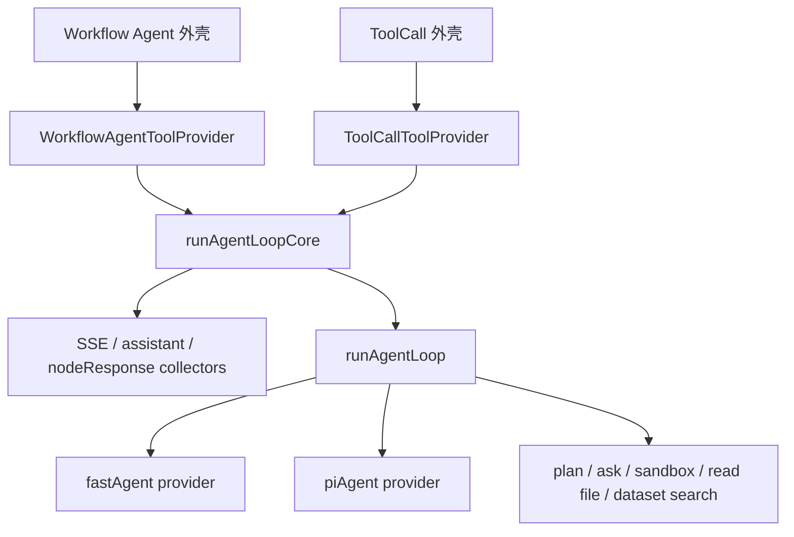
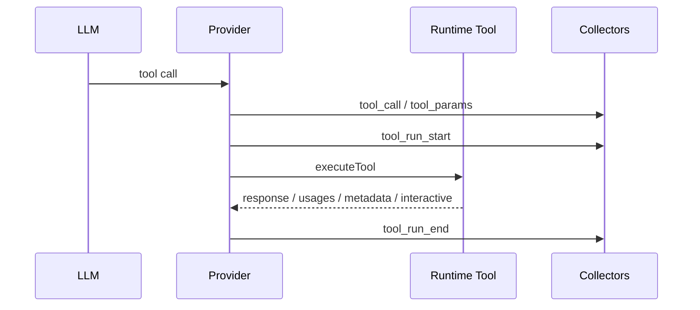
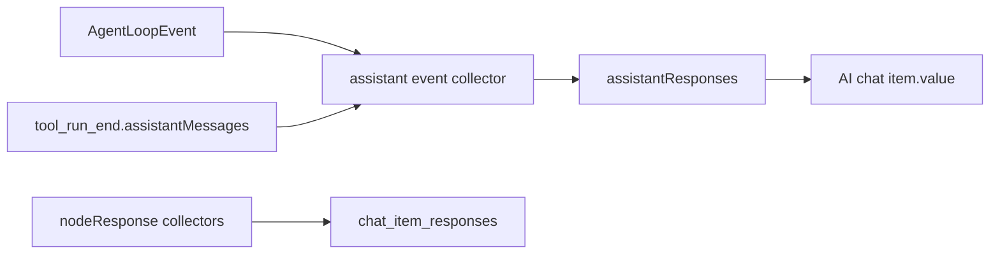
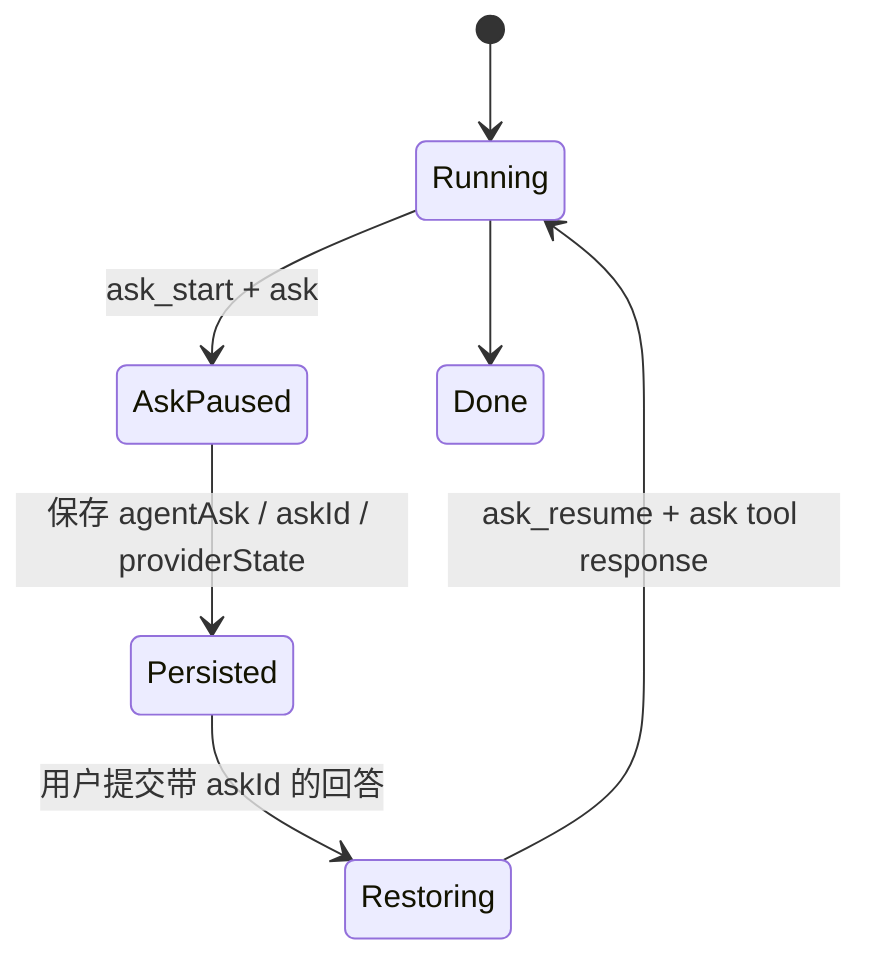
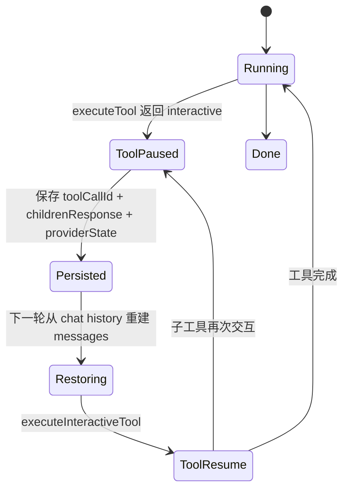
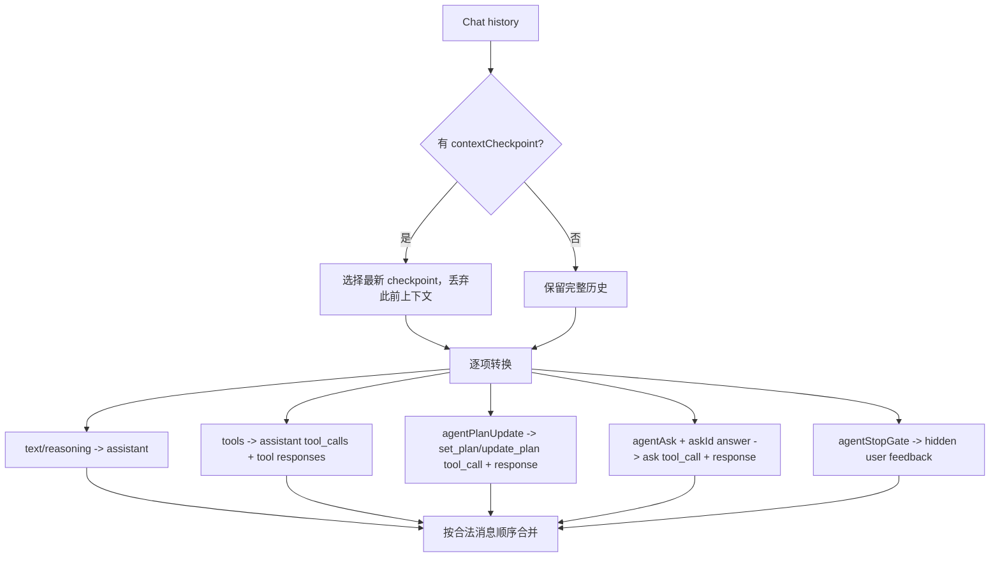
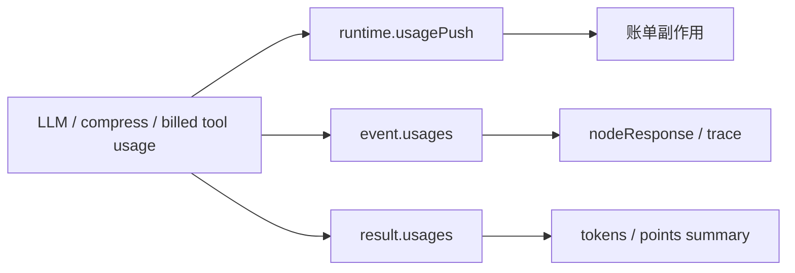

# Agent Loop 统一化技术设计

状态：实现验收中
日期：2026-07-13
关联需求：[Agent Loop 统一化需求](./requirements.md)

## 1. 设计结论

采用三层架构：

1. `agentLoop`：业务无关的模型循环内核。
2. `agentLoopCore`：workflow dispatch 侧的统一适配内核。
3. Workflow Agent / ToolCall：节点外壳及各自 ToolProvider。

核心原则是“单一循环、单一事件协议、单一 assistantResponses 收集器、多种节点包装”。ToolCall 不再维护另一套 agent 逻辑，而是关闭 plan/ask 的简化 Workflow Agent。



## 2. 分层职责

### 2.1 agentLoop

目录：`packages/service/core/ai/llm/agentLoop/`

负责：

- provider 选择和统一调用。
- 多轮 LLM 与工具循环。
- 标准 GPT messages 和 providerState。
- 系统工具注入。
- 发出标准事件。
- 通过 `usagePush` 推送实际 usage。
- 返回统一 result 或 pause。

禁止：

- 引用 workflow、ChatItem、SSE、nodeResponse 类型。
- 写数据库。
- 组装 workflow interactive。
- 理解工具 metadata 的业务结构。

### 2.2 agentLoopCore

目录：`packages/service/core/workflow/dispatch/ai/agentLoopCore/`

负责：

- 包装 agent-loop runtime。
- 将标准事件分发到互相独立的 collectors。
- 维护唯一的 `assistantResponses` 数组。
- 汇总 usage、requestIds、final text、reasoning 和错误。
- 将 `paused` 转为 workflow `interactive`。
- 提供 Workflow Agent 与 ToolCall 共用的稳定输出。

### 2.3 节点外壳

Workflow Agent 和 ToolCall 分别负责：

- 获取 chat history、节点输入和权限信息。
- 创建各自 ToolProvider。
- 初始化 sandbox client。
- 配置 provider 及 system tools。
- 将 core summary 包装为节点输出。
- 持久化节点自身的 memory 和运行详情。

ToolProvider 必须留在两个节点各自目录中，因为工具定义和执行是两者唯一主要业务差异。

## 3. 目录设计

```text
packages/service/core/ai/llm/agentLoop/
  interface/
    index.ts                       # 唯一公共导出入口
    run.ts                         # provider 选择与应用服务组合根
  application/
    run.ts                         # usage 收集、结果归一化和异常兜底
  domain/
    input.ts                       # 标准输入及恢复参数
    runtime.ts                     # 模型、工具、事件、计费回调
    result.ts                      # result/status/pause 协议
    event.ts                       # 标准事件联合类型
    tool.ts                        # 工具目录与执行结果
    interactive.ts                 # child interactive 恢复入参
    provider.ts                    # provider 领域端口
    usage.ts                       # 稳定计费项名称
    systemTool/
      contract.ts                  # 对外公开的系统工具协议
      plan/                        # plan schema、reducer、提示词
      ask/                         # ask schema 与解析
      sandbox/                     # sandbox 工具定义
      readFile/                    # read_files 工具定义
      datasetSearch/               # dataset_search 工具定义
  provider/
    registry.ts                    # provider 注册和选择
    fastAgent/                     # FastGPT 原生循环实现
    piAgent/                       # pi-agent-core 适配实现
      index.ts                     # provider 对象唯一导出，不转导内部实现
      run.ts                       # pi 状态机、事件订阅和最终结果编排
      message.ts                   # 消息恢复、tool call 碎片修复和标准消息转换
      payload.ts                   # 统一模型参数到 pi 请求 payload 的映射
      modelBridge.ts               # FastGPT 模型配置到 pi 模型定义的桥接
      type.ts                      # pi provider 私有持久化状态
      tool/
        catalog.ts                 # runtime/system tools 合并和重名过滤
        build.ts                   # AgentTool 构建及工具生命周期事件适配

packages/service/core/workflow/dispatch/ai/agentLoopCore/
  interface/
    index.ts                       # Workflow Agent 与 ToolCall 的最小公共入口，仅导出节点外壳所需契约
  domain/
    result.ts                      # workflow core result/status 协议
    toolProvider.ts                # 公共 ToolProvider 端口
    toolInfo.ts                    # 工具展示信息协议
    constants.ts                   # nodeResponse 展示元数据
  application/
    run.ts                         # 运行 loop 并组合 assistant collector
    context/                       # prompt/messages/reminder 准备
    runtime/                       # runtime 与 system tool 业务适配
    output/                        # result summary 和最终输出派生
  adapter/
    eventStream/                   # 标准事件到 SSE
    assistantResponses/            # 唯一聊天内容 collector
    nodeResponse/                  # LLM/tool/plan/ask/compress 运行详情
    interactive/                   # pause 到 workflow interactive
    memory/                        # providerState 读写与历史兼容
    toolInfo/                      # 系统工具展示信息查询实现

packages/service/core/workflow/dispatch/ai/agent/
  index.ts                         # Workflow Agent 外壳
  adapter/                         # Agent 专属上下文和 runtime 装配
  toolProvider/                    # selected tools/sub apps ToolProvider
  sub/                             # 具体业务工具执行

packages/service/core/workflow/dispatch/ai/toolcall/
  index.ts                         # ToolCall 外壳和节点输出
  toolCall.ts                      # ToolCall 的 core 调用配置
  hooks/                           # ToolCall 上下文及 tool nodes 准备
  toolProvider/                    # runtime graph ToolProvider
  tools/                           # ToolCall 专属工具适配
```

`interface/index.ts` 不转导 collector、参数解析、计分等内部 helper。内部单元测试直接引用
对应的 application、adapter 或 domain 模块，避免测试需求扩大节点外壳的公共依赖面。

## 4. 底层公共协议

### 4.1 Input

```ts
type AgentLoopInput<TChildrenResponse> = {
  messages: ChatCompletionMessageParam[];
  systemPrompt?: string;
  activePlan?: AgentPlanType;
  providerState?: unknown;
  userAnswer?: string;
  childrenInteractiveParams?: AgentLoopChildrenInteractiveParams<TChildrenResponse>;
};
```

- `messages` 是本轮唯一标准上下文。
- `providerState` 只保存 provider 无法从标准 transcript 重建的状态。
- `userAnswer` 只用于恢复 ask。
- `childrenInteractiveParams` 只定位并继续暂停的子工具。

### 4.2 Runtime

```ts
type AgentLoopRuntime<TChildrenResponse> = {
  teamId: string;
  llmParams: AgentLoopLLMParams;
  responseParams?: AgentLoopResponseParams;
  lang?: localeType;
  systemTools?: AgentLoopSystemTools;
  maxRunAgentTimes?: number;
  maxStopGateRejections?: number;
  checkIsStopping?: () => boolean;
  toolCatalog: AgentLoopToolCatalog;
  executeTool(params): Promise<AgentLoopToolExecutionResult<TChildrenResponse>>;
  executeInteractiveTool?(params): Promise<AgentLoopToolExecutionResult<TChildrenResponse>>;
  usagePush?(usages): void;
  emitEvent?(event): void;
};
```

runtime 只提供能力，不暴露 workflow 结构。`executeTool` 返回的 `metadata` 是 opaque 数据，agent-loop 只透传到 `tool_run_end`。

### 4.3 Result

```ts
type AgentLoopResultStatus = 'done' | 'paused' | 'aborted' | 'error';

type AgentLoopPause<TChildrenResponse> =
  | { type: 'ask'; ask: AgentAskPayload; askId: string }
  | { type: 'tool_child'; childrenResponse: TChildrenResponse; toolCallId: string };

type AgentLoopResultBase = {
  completeMessages: ChatCompletionMessageParam[];
  assistantMessages: ChatCompletionMessageParam[];
  requestIds: string[];
  usages: AgentLoopUsage[];
  finishReason: CompletionFinishReason;
  activePlan?: AgentPlanType;
  providerState?: unknown;
  contextCheckpoint?: string;
};
```

`completeMessages` 是执行后的完整 transcript；`assistantMessages` 是本轮新增 assistant transcript。二者必须返回。最终 answer/reasoning 从 `assistantMessages` 派生，不在 result 再提供单一文本字段。

## 5. 工具协议

### 5.1 分类与事件

| 工具类型 | 示例 | 事件协议 | assistant 结构 |
| --- | --- | --- | --- |
| 业务工具 | sub app、tool node | 通用 tool | `tools` |
| 普通系统工具 | sandbox、read file、dataset search | 通用 tool | `tools` |
| 控制系统工具 | plan | 独立 plan | `agentPlanUpdate` |
| 控制系统工具 | ask | 独立 ask | `agentAsk` |

普通工具完整生命周期：



`tool_run_start` 仅表达生命周期，不写 nodeResponse。`tool_run_end` 是 SSE、assistant 工具结果和 nodeResponse 的共同终态事实，但三种输出由不同 collector 各自处理。

### 5.2 plan

模型侧 plan 工具协议：

- `set_plan({ name, steps: string[] })`
- `update_plan({ updates?: Array<{ id, status, note? }>, add_steps?: string[] })`

两个工具均使用扁平 object schema，不使用 `action` 或 `oneOf`。系统生成 step id。步骤只包含执行描述、状态和可选备注；无须执行的步骤设为 `skipped`。

plan reducer 对外仍产生 `set_plan`、`add_steps`、`update_steps` 三种 operation。一次 `update_plan` 同时包含 `updates` 和 `add_steps` 时归类为 `update_steps`，但完整 plan 始终随终态事件输出。

事件分工：

- `plan_status`：生成中/更新中状态，仅 SSE。
- `plan_operation`：唯一的 plan 终态事件。成功时必须携带完整 plan，同时用于 SSE/UI、chat value 持久化、可恢复 tool call 和运行详情；失败时只记录操作结果。

### 5.3 ask

事件分工：

- `ask_start`：生成 `agentAsk` 和“收集问题”nodeResponse。
- `ask`：provider 进入暂停并返回 providerState。
- `ask_resume`：用户回答已接入循环。

`askId` 是 ask 的唯一恢复键。plan id 与 ask id 不得交叉使用。

### 5.4 sandbox

节点外壳先创建 `SandboxClient`，client 自身持有 source/user/chat 上下文。单次工具调用只传：

```ts
runSandboxTools({ toolName, args, sandboxClient });
```

get-file-url 等工具通过 `sandboxClient.getContext()` 获取上下文，不再要求调用方重复传 appId/userId/chatId。

## 6. 事件协议与消费者

### 6.1 事件矩阵

| 事件 | SSE | assistantResponses | nodeResponse/detail | 计费 |
| --- | --- | --- | --- | --- |
| `llm_request_start` | 运行状态 | 重置本次增量游标 | 否 | 否 |
| `reasoning_delta` | reasoning | 追加 reasoning | 否 | 否 |
| `answer_delta` | answer | 追加 text | 否 | 否 |
| `llm_request_end` | 否 | 补齐未流式尾部 | LLM 详情 | 否 |
| `tool_call` | 工具卡片 | 创建 tool call | 否 | 否 |
| `tool_params` | 参数增量 | 追加参数 | 否 | 否 |
| `tool_run_start` | 否 | 否 | 否 | 否 |
| `tool_run_end` | 工具结果 | response/子 assistant | 工具详情 | 否 |
| `after_message_compress` | 否 | checkpoint | 压缩详情 | 否 |
| `plan_status` | plan 状态 | 否 | 否 | 否 |
| `plan_operation` | 成功时推送 plan 内容 | 成功时按 planId 保存最新快照；始终保存 `agentPlanUpdate` | plan 详情 | 否 |
| `ask_start` | 否 | `agentAsk` | 收集问题详情 | 否 |
| `ask` / `ask_resume` | 否 | 否 | 否 | 否 |
| `stop_gate` | 否 | `agentStopGate` | 否 | 否 |

usage 可能随事件用于展示，但实际计费只发生在 provider 调用 `usagePush` 时。

### 6.2 Collector 隔离

每个 collector 只维护一种目标结构：

- event stream collector：只推 SSE。
- assistant collector：只修改 `assistantResponses`。
- nodeResponse collector：只记录运行详情。
- tool detail collector：只收集 ToolCall 子流程详情。

禁止 collector 之间互相调用，禁止为补某个 collector 而重复发送语义相同的事件。

## 7. assistantResponses 设计

### 7.1 唯一写入链路



Workflow Agent 与 ToolCall 都把同一个目标数组交给 core。core 在调用 provider 前包装 `emitEvent`，先写 assistant collector，再转发给调用方的 SSE/nodeResponse dispatcher。

最终 `completeMessages`/`assistantMessages` 不是第二套持久化来源。它们用于模型上下文、结果摘要和必要的兼容补齐。

### 7.2 数据分类

- `text/reasoning`：普通 assistant 输出。
- `tools`：普通工具 call、参数、response。
- `plan`：仅供客户端刷新恢复的完整计划快照，不进入模型消息。
- `agentPlanUpdate`：plan 调用参数和 response。
- `agentAsk`：ask 调用参数与 askId。
- `agentStopGate`：隐藏反馈。
- `contextCheckpoint`：隐藏压缩上下文。
- `interactive`：由业务层转换并保存的交互展示结构。

`agentPlanUpdate` 和 `agentAsk` 不兼容 `assistantText/reasoningText` 字段。

### 7.3 去重键

- LLM end：`requestId`。
- 普通工具：`toolCallId`。
- plan 快照：`planId`。
- plan/ask 操作记录：系统工具 call id。
- context checkpoint：`requestIds`，无 requestId 时使用 checkpoint 内容。
- stop gate：事件 id。

历史聊天中的 plan 在读取时兼容 `task -> name`、`steps[].title -> steps[].name`，解析后只向客户端输出当前结构，不回写数据库。

历史 ask 同样只在聊天读取边界迁移：`agentAsk`、`agentPlanAskQuery` 和对应 Human
回答上的旧 `planId` 统一转换为 `askId`，并删除响应中的旧字段。旧协议以 planId
关联 ask，因此兼容值沿用原 planId；新请求仍以 ask tool call id 生成 askId。

升级前暂停的 Workflow Agent memory 直接保存 `{ pendingMainContext }`。读取时将其包装为
fastAgent 的 `providerState`，并使用 plan read schema 迁移其中的 active plan；恢复后仍由
`askToolCallId` 把用户回答追加为原 ask tool response。该兼容只存在于读取路径，新 memory
继续只写统一 providerState 结构。

上述历史兼容只保留一个版本窗口。当前版本不得因为兼容逻辑而继续写入旧字段；下一版本在完成
离线数据迁移、确认历史暂停 ask 已处理后，删除 `planId` ask、旧 `pendingMainContext`、旧
plan 字段和 `memoryRequestMessages` 的读取分支及测试。若迁移窗口内仍发现旧数据，应先迁移数据
并评估发布阻塞，而不是把运行时兼容作为永久协议。

`llm_request_end` 只补齐 delta 未覆盖的尾部；重复终态事件直接忽略或 upsert，不追加第二份结构。

## 8. nodeResponse 与子 workflow

普通工具执行结果通过 `AgentLoopToolExecutionResult.metadata` 携带 workflow 侧摘要。底层不解释 metadata；agentLoopCore 的 nodeResponse collector 再读取并组装运行详情。

子 workflow 返回两类内容：

- `assistantMessages`：需要进入父 assistantResponses 的聊天内容。
- runtime node response summary / detail：用于工具停止判断、耗时、points 和运行详情。

完整子流程详情可由 writer 直接落库，避免在 agentLoop result 中长期保留大对象。`tool_run_end` 仍须携带足够 metadata，确保 fastAgent 与 piAgent 行为一致。

## 9. 暂停与恢复状态机

### 9.1 ask



业务层将 ask pause 转换为：

```ts
{
  type: 'agentPlanAskQuery',
  params: {
    askId,
    // content/reason/blockerType/options 来自 ask payload
  }
}
```

用户回答是 UI-only human value。`chats2GPTMessages` 跳过该普通 user message，再按 `askId` 回填对应 ask tool response，避免上下文重复。

### 9.2 child interactive



业务层将 tool pause 转换为：

```ts
{
  type: 'toolChildrenInteractive',
  params: {
    childrenResponse,
    toolParams: { toolCallId }
  }
}
```

新数据不保存 `memoryRequestMessages`。恢复所需 call/messages 由 provider 从本轮 `messages` 和 providerState 补齐。

## 10. chat2messages 恢复



关键不变量：

1. 每个 tool response 前必须存在同 id 的 assistant tool call。
2. plan 只从 `agentPlanUpdate` 恢复，ask 只从 `agentAsk` 恢复。
3. 带 `askId` 的 human answer 不重复生成 user message。
4. 普通工具 response 在后续 assistant payload 前及时 flush。
5. 只恢复最新 checkpoint 之后的上下文。

## 11. usage 设计



三个出口用途不同：

- `usagePush`：唯一写账单。
- `event.usages`：运行详情。
- `result.usages`：只读汇总。

provider 负责在 usage 产生时调用一次 `usagePush`。agentLoopCore 只归一化和汇总，不产生计费副作用。

## 12. Workflow Agent 与 ToolCall 接入

### 12.1 共用流程

1. 从 chat history 构建标准 messages。
2. 准备 runtime、system tools 和 ToolProvider。
3. 创建 SSE、assistant、nodeResponse collectors。
4. 调用 `runAgentLoopCoreWithSummary`。
5. 保存 providerState/context checkpoint/interactive。
6. 使用 summary 包装节点输出。

### 12.2 Workflow Agent 专属

- provider 可选 fastAgent 或 piAgent。
- prompt mode 使用 fastAgent 语义。
- 可开启 plan、ask。
- 工具来自 selected tools 与 sub apps。
- nodeResponse 以 Agent 节点详情形式写入。

### 12.3 ToolCall 专属

- 当前固定 fastAgent。
- prompt mode 为 raw。
- plan、ask 必须关闭。
- 工具来自 workflow runtime graph。
- 保留 ToolCall 的 preview、points 和 child detail 输出包装。

## 13. Provider 一致性要求

fastAgent 与 piAgent 的内部实现可以不同，但对外必须满足相同 contract：

- 每次 LLM 请求发 start/end，requestId、finishReason 和 usage 完整。
- 每次普通工具发 call/start/end，终态透传 response、error、assistantMessages、metadata 和 usage。
- 工具返回 stop 时停止后续模型循环。
- 工具返回 interactive 时产生 `tool_child` pause。
- interactive 恢复完成后发出标准 `tool_run_end`，并继续或再次暂停。
- 执行异常转换为合法 error result 或 tool end error，不允许破坏 result 必填字段。
- 所有计费 usage 只 push 一次。

应通过共享 provider contract tests 验证，不仅依赖各 provider 的局部实现测试。

## 14. 迁移步骤

1. 固化 agent-loop input/runtime/event/result/tool 协议。
2. 迁移 fastAgent、piAgent，并补 provider contract tests。
3. 建立 agentLoopCore 的 runtime、collectors、interactive 和 summary。
4. 先迁移 Workflow Agent，验证 SSE、存储和恢复。
5. 将 ToolCall 改为关闭 plan/ask 的 core 调用方。
6. 删除两条链路的旧 assistant/event adapter。
7. 删除旧 re-export，逐个修正 import。
8. 删除仅为旧恢复逻辑产生的 `memoryRequestMessages` 写入。
9. 完成边界、集成、TypeScript 和全量测试。

### 14.1 临时兼容窗口

本版本采用“只读兼容、只写新协议”。兼容范围包括历史 `planId` ask、旧
`{ pendingMainContext }` memory、旧 plan `task/title` 字段及 `memoryRequestMessages`。
下一版本的移除前置条件是：

1. 已完成历史数据离线迁移或确认不再需要继续恢复的旧记录。
2. 线上不再产生旧字段，且监控/抽样读取未发现旧协议数据。
3. 删除兼容分支和测试后，当前 schema、恢复和 ask 提交测试仍全部通过。

移除项：`controller.ts` 的历史 ask/plan 归一化、`providerState.ts` 的旧 memory 包装，以及
对应的兼容测试和文档条目。

迁移期间禁止旧、新 collector 同时工作，否则无法证明 assistantResponses 单写。

## 15. 测试设计

### 15.1 边界测试

- agent-loop 不引用 workflow/chat/SSE。
- 公共 `interface` 不导出 provider 私有执行函数。
- Workflow Agent 与 ToolCall 均引用 agentLoopCore。
- 无旧 adapter 和旧 import 残留。

### 15.2 Provider contract

- done/paused/aborted/error 均返回必填字段。
- 普通工具成功、失败、stop、interactive、再次 interactive。
- sandbox/read file/dataset search 事件与业务工具一致。
- metadata、assistantMessages、errorMessage 在 fast/pi 中一致透传。
- usagePush 精确调用次数。

### 15.3 Collector

- answer/reasoning delta 与 LLM end 补齐。
- 重复 requestId/toolCallId 不重复写入。
- plan/ask 与普通工具隔离。
- 子 workflow assistant 只追加一次。
- nodeResponse 与 SSE 各自产生一次。

### 15.4 恢复

- askId 用户回答恢复。
- child interactive 恢复及再次暂停。
- plan 与 ask id 完全独立。
- 最新 checkpoint 截断。
- 历史 `memoryRequestMessages` 兼容读取，新数据不写入。

### 15.5 节点集成

- Workflow Agent fastAgent/piAgent。
- ToolCall 普通工具、系统工具及 child interactive。
- 数据库存储不存在重复 assistant response。
- points、tokens、requestIds、finishReason 与旧业务输出兼容。

## 16. 风险与 review 重点

1. **provider 事件不对称**：fastAgent 和 piAgent 必须逐字段核对 tool end、stop、异常和恢复行为。
2. **双写未清理**：任何从最终 messages 再完整转换 assistantResponses 的路径都可能造成重复。
3. **子 workflow 大对象**：只在内存保留必要摘要，完整详情交给 writer，避免 result 膨胀。
4. **错误分支漏字段**：所有 provider result 分支仍须返回 required fields 和 finishReason。
5. **计费重复**：测试必须断言 `usagePush` 次数，而不是只比较最终 usage 数值。
6. **历史兼容污染新协议**：兼容逻辑应只读且局部存在，不能继续生成旧字段。
7. **事件顺序**：tool call、tool response 与后续 assistant message 的顺序必须满足 OpenAI transcript 约束。

## 17. 实施检查表

- [ ] 需求和设计评审完成。
- [x] agent-loop 公共协议与边界测试完成。
- [x] fastAgent provider contract 完成。
- [x] piAgent provider contract 完成。
- [x] agentLoopCore collectors 与 summary 完成。
- [x] Workflow Agent 迁移并移除旧 adapter。
- [x] ToolCall 迁移为简化 Agent。
- [x] assistantResponses 单写和数据库去重验证完成。
- [x] ask/child/checkpoint 恢复验证完成。
- [x] 历史 planId ask 与旧 pendingMainContext 跨版本恢复验证完成。
- [x] usage 单次计费验证完成。
- [x] 旧 re-export/import/兼容写入清理完成。
- [ ] 下一版本移除临时历史兼容读取，并删除迁移专用测试。
- [x] agent-loop 局部测试和仓库全量测试通过。
- [x] 本需求相关 TypeScript 错误清零。
- [ ] 仓库整体 TypeScript 检查通过（当前剩余一处无关的 `contentHeight` 类型错误）。
