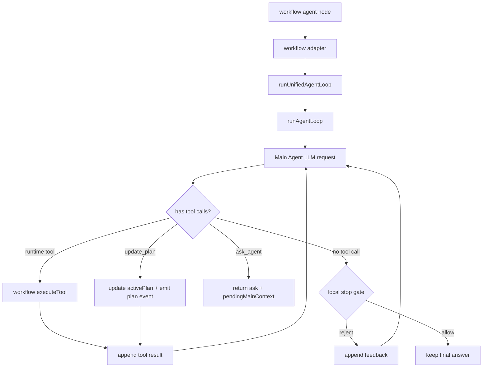

# Agent Loop 技术文档

状态：收口版  
日期：2026-05-11

## 总体架构

新方案只保留一个主 loop。Plan 不是独立 agent，也不是旧 `stepCall`，而是主 loop 内部的一份结构化状态，由模型通过 `update_plan` 更新，由本地 stop gate 校验。



## 核心模块

| 文件 | 职责 |
| --- | --- |
| `packages/service/core/ai/llm/agentLoop/baseLoop.ts` | 最底层循环：请求 LLM、收集 delta、执行 tool call、回灌 tool result、处理 final |
| `packages/service/core/ai/llm/agentLoop/unifiedLoop.ts` | 统一入口：组装 main prompt、内置工具、runtime tools、stop gate、事件输出 |
| `packages/service/core/ai/llm/agentLoop/mainPrompt.ts` | Main Agent system prompt，包含计划、追问、工具、完成规则 |
| `packages/service/core/ai/llm/agentLoop/plan/state.ts` | activePlan 状态维护、step 更新、replace_plan 合并逻辑 |
| `packages/service/core/ai/llm/agentLoop/plan/updateTool.ts` | `update_plan` tool schema、批量 updates、参数校验 |
| `packages/service/core/ai/llm/agentLoop/plan/reviser.ts` | replace_plan 时保留 planId 和仍有效的已完成证据 |
| `packages/service/core/ai/llm/agentLoop/stopGate.ts` | 本地完成校验，避免计划未完成或工具结果未记录时提前 final |
| `packages/service/core/workflow/dispatch/ai/agent/adapter/*` | workflow runtime 适配：工具、事件、responseNode、usage、memory |
| `packages/service/core/workflow/dispatch/ai/agent/index.ts` | workflow agent 节点入口，调用通用 loop |
| `projects/app/src/web/.../AIResponseBox.tsx` | plan card、tool、thinking、answer 的前端展示 |
| `projects/app/src/web/.../ChatBox/index.tsx` | SSE 事件消费、历史记录恢复和 plan loading 状态 |

## 上下文拼接

### 首轮请求

首轮主请求只拼接稳定上下文：

1. Main Agent system prompt；
2. workflow 注入上下文，例如用户背景、沙盒信息、引用规则、可用 runtime tools；
3. 过滤后的历史 chat messages；
4. 当前用户输入。

这里不再注入旧 `plan_agent`、旧 `stepCall` 或历史 plan tool call。

### 工具循环

同一轮 loop 内，每次工具调用都追加到当前 messages：

1. assistant message，包含 tool_calls；
2. tool message，包含 tool result 或参数错误；
3. 下一次 LLM request 继续使用这条 messages。

这样 runtime tool 结果、`update_plan` 结果、`ask_agent` 错误修正都能命中连续上下文和缓存。

### 追问恢复

`ask_agent` 返回时保存 `pendingMainContext`：

- 当前 messages；
- ask toolCallId；
- activePlan；
- requirePlan；
- runtimeToolCalledSinceLastPlanUpdate。

用户回答后，把用户回答作为 ask tool response 追加回原 messages，再继续同一个 main loop。不会重新调用独立 Plan Generator，也不会重建一份新的 planMessages。

## 内置工具

### `update_plan`

用于维护当前 activePlan。支持单次更新，也支持批量 updates，便于模型一次提交多个 step 变更。

主要动作：

- `set_plan`：创建计划，steps 必须非空。
- `update_step`：更新单个 step 的状态、证据、输出摘要、阻塞原因等。
- `replace_plan`：重规划；保留当前 planId，尽量保留仍存在且已完成 step 的证据。

关键约束：

- plan steps 至少 1 个；
- 旧 stepCall 兼容字段已删除；
- `blocked` 必须有 blocker；
- `needsReplan` 不能直接 final；
- runtime tool 执行后，需要再用 `update_plan` 记录工具结果或证据。

### `ask_agent`

用于必要追问，只在以下情况使用：

- 缺少必须的私有输入；
- 必需工具不可用；
- 目标完全歧义，无法制定或执行计划。

无效参数不会返回空 answer，而是把 tool error 回灌给模型，让模型修正后继续 loop。

### Runtime Tools

workflow 注入的工具保持原有执行方式，但需要过滤掉与内置工具冲突的名称，例如 `ask_agent`、`update_plan`。

runtime tool 的事件需要映射为普通工具卡和运行详情子项；内置工具只影响 plan/interactive 状态，不展示成普通工具卡。

## Stop Gate

Stop gate 是本地同步校验，不再额外请求 LLM verifier。

放行 final 的条件：

- 如果用户明确要求 plan，必须已经存在 activePlan；
- activePlan steps 非空；
- 所有 step 必须为 `done`、`skipped` 或带 blocker 的 `blocked`；
- 不能存在 `needsReplan`；
- 如果最近调用过 runtime tool，必须已有后续 `update_plan` 记录工具结果；
- 超过最大拒绝次数后返回明确错误，避免死循环。

拒绝时，stop gate 会把反馈作为新消息追加给模型，例如要求补充计划、更新 step 或记录工具证据，然后继续同一个 loop。

模型的 answer/reasoning delta 始终实时透传给前端，包括之后被 stop gate 打回的草稿输出。stop gate 只影响最终保留到 `assistantMessages` 里的 answer，不做 `answer_delta` 缓存、撤回或最终统一推送。

## Prompt 设计

Main Agent prompt 只保留一个角色，不再出现 Router、Plan Creator、Executor、Reviser 等多重角色。

核心规则：

- 简单问题直接回答；
- 复杂任务、明确要求规划、需要多步探索或多工具调用时，先用 `update_plan` 创建计划；
- 执行每个阶段后及时更新 plan；
- 缺少必要输入时调用 `ask_agent`；
- 工具调用结果要写回 plan evidence；
- final 前自己检查计划是否完成；
- 不解释路由过程，不输出内部规则。

workflow 可追加以下上下文块：

- `user_background`；
- `sandbox_environment`；
- `cite_rule`；
- `available_runtime_tools`。

Prompt 回归要求：

- 必须包含 `update_plan`、`ask_agent` 的使用规则；
- 不应再包含 `plan_agent`、`Master Router`、`Plan Creator`、`Reviser`；
- stop gate feedback 要包含可执行的修正方向。

## SSE 与持久化

### 事件映射

| Loop 事件 | workflow / chat 结果 |
| --- | --- |
| `plan_status` | 前端显示 plan loading skeleton |
| `plan_update` | upsert `assistantResponses[].plan` |
| runtime `tool_call/tool_params/tool_response` | 写入 `assistantResponses[].tools` 并展示工具卡 |
| thinking delta | 写入 thinking，刷新后可恢复 |
| answer delta | 实时写入前端过程流；stop gate 拒绝的草稿不进入最终持久化 answer |
| `llm_request_end` | 写入 nodeResponse，包含 model、tokens、finishReason、requestId |
| ask | 写入 interactive ask，并保存 pendingMainContext |

### RequestId

所有 AI 请求都需要包含 requestId，并写入运行详情。不同 agent 阶段可线性展示为多个 AI 调用；runtime tool 挂在对应 AI 调用下。

需要继续专项确认的链路：

- dataset query extension 内部 LLM requestId；
- dataset chunk selector 的 requestId；
- 使用外部 key 或 Pro 计费时的 usage item 和 request record。

## 前端展示

新的前端只适配新 plan card：

- plan loading skeleton 有中文提示文案，不带额外 icon；
- plan card 最小宽度为消息最大宽度的 50%；
- step 状态用颜色和动效表达，不展示英文状态标签；
- update_plan 只改变 plan card 状态，不额外生成 step summary 消息；
- 历史记录恢复直接读取 `assistantResponses[].plan/tools/thinking/answer/interactive`。

旧 `stepCall` UI 和兼容逻辑已移除。

## Mock LLM 测试设计

单测主要 mock `createLLMResponse`，不要 mock `runUnifiedAgentLoop` 或 `runAgentLoop`。这样可以真实覆盖 assistant tool_calls、tool result 回灌、stop gate reject、requestIds、assistantMessages、completeMessages、SSE 和 workflow adapter 事件映射。

核心用例：

| Case | 场景 | 期望 |
| --- | --- | --- |
| 1 | Direct Answer | 一次 LLM 请求后 done，无 activePlan |
| 2 | Plan Then Final | 先 plan_status/plan_update，再 final |
| 3 | Runtime Tool Requires Plan Update | 工具后直接 final 会被 stop gate 打回 |
| 4 | Explicit Plan Cannot Direct Answer | 明确 plan 时无 activePlan 不能 final |
| 5 | Ask Agent Pause | 返回 ask，保存 pendingMainContext |
| 6 | Ask Agent Resume | 用户回答作为 tool response 追加后继续 |
| 7 | Runtime Tool Before Ask Resume | ask 前工具状态恢复后仍需写入 plan |
| 8 | Invalid Ask Args | tool error 回灌，继续请求模型修正 |
| 9 | Replace Plan | 保留 planId 和仍有效的完成证据 |
| 10 | Workflow Event Mapping | internal tools 不生成普通工具卡，requestId 写入 nodeResponse |

## 推荐测试命令

```bash
corepack pnpm --filter @fastgpt/service exec vitest run -c vitest.config.ts test/core/ai/llm/agentLoop test/core/workflow/dispatch/ai/agent/adapter
corepack pnpm --filter @fastgpt/global exec vitest run -c vitest.config.ts test/core/chat/adapt.test.ts test/core/chat/type.test.ts test/core/workflow/runtime/utils.test.ts
corepack pnpm --filter @fastgpt/app exec vitest run -c vitest.config.ts test/web/common/api/request.test.ts
git diff --check
```

## 已知风险和后续任务

| 编号 | 风险 | 建议处理 |
| --- | --- | --- |
| T1 | dataset query extension requestId 可能没有完整进入 responseNode | 在 queryExtension 返回值、dataset search controller 和 workflow dataset agent 中补齐 requestId 透传 |
| T2 | 外部 key / Pro 计费路径未被本地 OSS 完整覆盖 | 在 Pro 环境验证 usage_items、llm_request_records、chat_item_responses |
| T3 | 无效 `update_plan` 后 plan skeleton 的失败态还可优化 | 失败时发送 plan_status failed 或在最终状态清理 skeleton |
