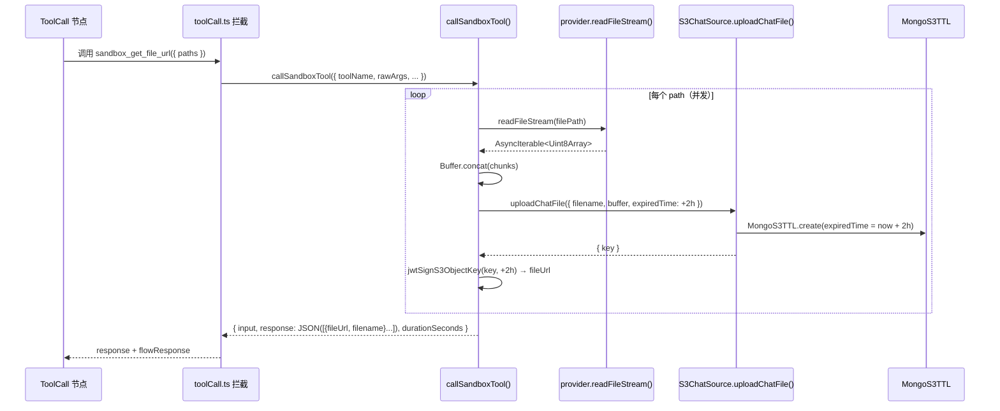
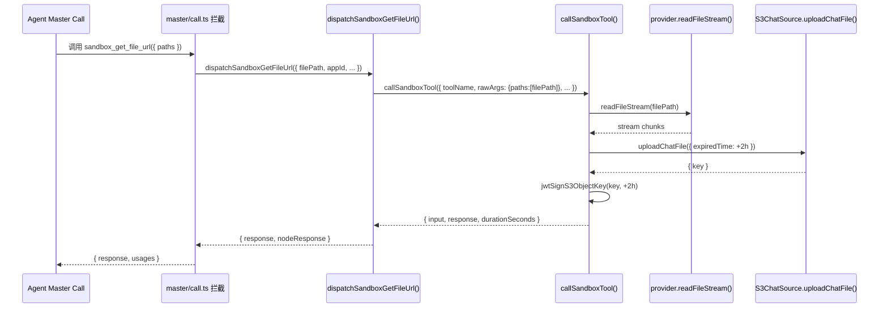

# 虚拟机系统工具：获取文件链接 (sandbox_get_file_url)

## 一、需求概述

为虚拟机（Agent Sandbox）新增一个系统级工具 `sandbox_get_file_url`：

1. Agent 调用该工具，传入虚拟机内的文件路径
2. 系统从虚拟机读取文件内容
3. 将文件上传到 S3（使用对话的 Chat Bucket 实例）
4. 返回 2 小时有效期的签名访问 URL

**工具返回格式**：
```json
{
  "url": "https://xxx.s3.amazonaws.com/...",
  "expired": "2 hours",
  "filename": "output.csv"
}
```

---

## 二、涉及文件

| 文件 | 变更类型 | 说明 |
|------|----------|------|
| `packages/global/core/ai/sandbox/constants.ts` | 修改 | 新增工具定义、Schema、更新系统提示词 |
| `packages/service/core/ai/sandbox/toolCall.ts` | 新增 | 沙盒工具统一执行层 `callSandboxTool()`，两条链路共享 |
| `packages/service/core/workflow/dispatch/ai/tool/toolCall.ts` | 修改 | 统一拦截所有 sandbox 工具，复用 `callSandboxTool` |
| `packages/service/core/workflow/dispatch/ai/agent/sub/sandbox/index.ts` | 修改 | 新增 `dispatchSandboxGetFileUrl()`，复用 `callSandboxTool` |
| `packages/service/core/workflow/dispatch/ai/agent/master/call.ts` | 修改 | 新增工具拦截逻辑（Agent 模式） |
| `packages/service/common/s3/buckets/base.ts` | 修改 | `uploadFileByBody` 新增 `filename`、`expiredTime` 参数 |
| `packages/service/common/s3/sources/chat/index.ts` | 修改 | `uploadChatFile` 透传 `filename`、`expiredTime` |
| `packages/service/common/s3/type.ts` | 修改 | `UploadFileByBodySchema` 新增 `filename`、`expiredTime` 字段 |
| `packages/service/common/s3/sources/chat/type.ts` | 修改 | `UploadChatFileSchema` 新增 `expiredTime` 字段 |
| `projects/app/src/pages/api/system/file/[jwt].ts` | 修改 | 下载接口支持 `Content-Disposition` 响应头 |

> **架构说明**：新增 `callSandboxTool` 作为纯执行层，不绑定业务响应格式。两条调用链路（普通工作流 / Agent 模式）均复用该层，消除重复逻辑。

> **URL 生成**：文件上传到 S3 后，通过 `jwtSignS3ObjectKey(key, expiredAt)` 生成 JWT 签名的内网访问 URL（有效期 2 小时），不依赖 S3 签名 URL。

---

## 三、详细设计

### 3.1 工具定义（constants.ts）

新增常量与 Schema：

```typescript
export const SANDBOX_READ_FILE_TOOL_NAME: I18nStringType = {
  'zh-CN': '虚拟机/获取文件链接',
  'zh-Hant': '虛擬機/獲取文件鏈接',
  en: 'Sandbox/Get File URL'
};
export const SANDBOX_GET_FILE_URL_TOOL_NAME = 'sandbox_get_file_url';

// 参数为 paths 数组，支持同时获取多个文件
export const SandboxGetFileUrlToolSchema = z.object({
  paths: z.array(z.string())
});

export const SANDBOX_GET_FILE_URL_TOOL: ChatCompletionTool = {
  type: 'function',
  function: {
    name: SANDBOX_GET_FILE_URL_TOOL_NAME,
    description: '从虚拟机读取指定文件，上传至云存储，返回 2 小时有效期的访问链接',
    parameters: {
      type: 'object',
      properties: {
        paths: {
          type: 'array',
          items: {
            type: 'string',
            description: '文件访问路径，例如: output.csv'
          },
          description: '文件访问路径，例如: ["output.csv", "output.txt"]'
        }
      },
      required: ['paths']
    }
  }
};

// 更新 SANDBOX_TOOLS（追加新工具）
export const SANDBOX_TOOLS: ChatCompletionTool[] = [SANDBOX_SHELL_TOOL, SANDBOX_GET_FILE_URL_TOOL];
```

更新系统提示词（`SANDBOX_SYSTEM_PROMPT`），追加工具说明：
```
- 若需要将生成的文件分享给用户，可使用 ${SANDBOX_GET_FILE_URL_TOOL_NAME} 工具获取文件的临时访问链接（有效期 2 小时）
```

---

### 3.2 沙盒工具统一执行层（toolCall.ts）

新增 `packages/service/core/ai/sandbox/toolCall.ts`，作为所有沙盒工具的纯执行层，不绑定业务响应格式：

```typescript
type SandboxToolCallParams = {
  toolName: string;
  rawArgs: string;
  appId: string;
  userId: string;
  chatId: string;
};

export type SandboxToolCallResult = {
  input: Record<string, any>;
  response: string;
  durationSeconds: number;
};

export const callSandboxTool = async (params: SandboxToolCallParams): Promise<SandboxToolCallResult>
```

**`sandbox_get_file_url` 执行逻辑**：
1. 解析 `paths` 数组参数
2. 用 `Promise.all` 并发处理每个文件路径：
   - 通过 `instance.provider.readFileStream(filePath)` 流式读取文件内容
   - 聚合 chunks 为 `Buffer`
   - 调用 `chatBucket.uploadChatFile({ ..., expiredTime: addHours(now, 2) })` 上传，TTL 设为 2 小时
   - 用 `jwtSignS3ObjectKey(key, addHours(now, 2))` 生成 JWT 签名访问 URL
3. 返回 `Array<{ fileUrl: string, filename: string }>`

**工具返回格式**（JSON 序列化后作为 response）：
```json
[
  { "fileUrl": "https://app.xxx.com/api/system/file/eyJ...", "filename": "output.csv" },
  { "fileUrl": "https://app.xxx.com/api/system/file/eyJ...", "filename": "report.txt" }
]
```

> **注意**：URL 不再使用 S3 签名 URL（`accessUrl`），而是通过 `jwtSignS3ObjectKey` 生成 JWT 签名的内部访问 URL，由 `/api/system/file/[jwt]` 接口代理下载。

---

### 3.3 S3 上传（uploadFileByBody 扩展）

扩展 `packages/service/common/s3/type.ts` 的 `UploadFileByBodySchema`，新增 `filename`（必填）和 `expiredTime`（可选）字段：

```typescript
export const UploadFileByBodySchema = z.object({
  buffer: z.instanceof(Buffer),
  contentType: z.string().optional(),
  key: z.string().nonempty(),
  filename: z.string().nonempty(),       // 新增，用于 Content-Disposition
  expiredTime: z.date().optional()       // 新增，不传则默认 now + 1h
});
```

`uploadFileByBody` 使用 `expiredTime` 写入 MongoS3TTL，并将 `filename` 写入对象 metadata：

```typescript
metadata: {
  contentDisposition: `attachment; filename="${encodeURIComponent(filename)}"`,
  originFilename: encodeURIComponent(filename),
  uploadTime: new Date().toISOString()
}
```

`uploadChatFile` 同步透传 `filename` 和 `expiredTime` 到底层方法。

---

### 3.4 封装方法（sub/sandbox/index.ts）

`dispatchSandboxGetFileUrl` 直接复用 `callSandboxTool`，与 `dispatchSandboxShell` 模式一致：

```typescript
export const dispatchSandboxGetFileUrl = async ({
  filePath,   // 保持参数名，内部转为 paths: [filePath]
  appId,
  userId,
  chatId,
  lang
}: SandboxDispatchParams & { filePath: string }): Promise<SandboxDispatchResult> => {
  const { input, response, durationSeconds } = await callSandboxTool({
    toolName: SANDBOX_GET_FILE_URL_TOOL_NAME,
    rawArgs: JSON.stringify({ paths: [filePath] }),
    appId,
    userId,
    chatId
  });

  return {
    response,
    usages: [],
    nodeResponse: buildNodeResponse({ toolId: SANDBOX_GET_FILE_URL_TOOL_NAME, input, response, durationSeconds, lang })
  };
};
```

---

### 3.5 工具拦截逻辑（两条链路）

两条链路均通过 `callSandboxTool` 统一处理，不再各自内联逻辑。

#### 3.5.1 普通工作流：toolCall.ts

`onRunTool` 中合并 `SANDBOX_TOOL_NAME` 和 `SANDBOX_GET_FILE_URL_TOOL_NAME` 到同一拦截块：

```typescript
if (
  call.function?.name === SANDBOX_TOOL_NAME ||
  call.function?.name === SANDBOX_GET_FILE_URL_TOOL_NAME
) {
  const { input, response, durationSeconds } = await callSandboxTool({
    toolName: call.function.name,
    rawArgs: call.function.arguments ?? '',
    appId: String(workflowProps.runningAppInfo.id),
    userId: String(workflowProps.uid),
    chatId: workflowProps.chatId
  });

  const flowResponse = getSandboxToolWorkflowResponse({
    name: tool.name,
    logo: SANDBOX_ICON,
    toolId: call.function.name,
    input,
    response,
    durationSeconds
  });

  return { response, flowResponse };
}
```

#### 3.5.2 Agent 模式：agent/master/call.ts

紧跟 `SANDBOX_TOOL_NAME` 拦截块之后，添加对 `SANDBOX_GET_FILE_URL_TOOL_NAME` 的处理，复用 `dispatchSandboxGetFileUrl`：

```typescript
if (toolId === SANDBOX_GET_FILE_URL_TOOL_NAME) {
  const toolParams = SandboxGetFileUrlToolSchema.safeParse(parseJsonArgs(call.function.arguments));
  if (!toolParams.success) return { response: toolParams.error.message, usages: [] };

  const result = await dispatchSandboxGetFileUrl({
    filePath: toolParams.data.paths[0],  // Agent 模式单文件路径
    appId: runningAppInfo.id,
    userId: props.uid,
    chatId,
    lang: props.lang
  });

  childrenResponses.push(result.nodeResponse);
  return { response: result.response, usages: result.usages };
}
```

---

## 四、执行流程

### 4.1 普通工作流链路（toolCall.ts）



### 4.2 Agent 模式链路（agent/master/call.ts）



---

## 五、错误处理

| 错误场景 | 处理方式 |
|----------|----------|
| 文件不存在 | `readFileStream` 抛出异常，`callSandboxTool` 捕获后返回错误字符串，Agent 收到后可重试 |
| 沙盒不可用 | `getSandboxClient` 失败，返回错误信息 |
| S3 上传失败 | 捕获异常，返回错误信息 |
| 文件过大 | ⚠️ **当前未限制**，文件内容先全部读入内存再上传（见六、待优化） |

---

## 六、待优化

### 6.1 内存占用问题（当前实现缺陷）

当前实现将沙盒文件全量读入内存后再上传 S3：

```typescript
// 当前：全量内存聚合
const chunks: Uint8Array[] = [];
for await (const chunk of stream) {
  chunks.push(chunk);
}
const fileBuffer = Buffer.concat(chunks); // 大文件 OOM 风险
```

**问题**：大文件会导致内存暴涨，Tool Call 场景下 AI 可以任意触发，存在 DoS 风险。

**优化方向一：文件大小限制**

在聚合 chunks 过程中累计字节数，超过阈值立即中止：

```typescript
const MAX_FILE_SIZE = 50 * 1024 * 1024; // 50MB
let totalSize = 0;
for await (const chunk of stream) {
  totalSize += chunk.byteLength;
  if (totalSize > MAX_FILE_SIZE) {
    throw new Error(`File too large (> ${MAX_FILE_SIZE / 1024 / 1024}MB)`);
  }
  chunks.push(chunk);
}
```

**优化方向二：直接流式上传 S3（推荐）**

绕过内存聚合，将 `readFileStream` 返回的 `AsyncIterable` 直接作为 S3 上传 body：

```typescript
const stream = instance.provider.readFileStream(filePath);
// 需要 S3 client 支持传入 AsyncIterable/Stream 作为 body
await this.client.uploadObject({ key, body: stream, contentType: '...' });
```

可行性取决于底层 S3 client（`@aws-sdk/client-s3` 的 `PutObjectCommand` 支持传入 `Readable` / `ReadableStream`）。需评估 `MinIO/custom` client 的支持情况后实施。

---

## 七、TODO

- [x] `packages/global/core/ai/sandbox/constants.ts`：新增 `SANDBOX_READ_FILE_TOOL_NAME`、`SANDBOX_GET_FILE_URL_TOOL_NAME`、`SANDBOX_GET_FILE_URL_TOOL`、`SandboxGetFileUrlToolSchema`（参数为 `paths: string[]`），更新 `SANDBOX_TOOLS` 和 `SANDBOX_SYSTEM_PROMPT`
- [x] `packages/service/core/ai/sandbox/toolCall.ts`：新增 `callSandboxTool()` 统一执行层，支持 `sandbox_shell` 和 `sandbox_get_file_url`
- [x] `packages/service/core/workflow/dispatch/ai/agent/sub/sandbox/index.ts`：重构为复用 `callSandboxTool`，新增 `dispatchSandboxGetFileUrl()`
- [x] `packages/service/core/workflow/dispatch/ai/tool/toolCall.ts`：合并拦截逻辑，复用 `callSandboxTool`
- [x] `packages/service/core/workflow/dispatch/ai/agent/master/call.ts`：新增 `SANDBOX_GET_FILE_URL_TOOL_NAME` 拦截逻辑
- [x] `packages/service/common/s3/type.ts`、`buckets/base.ts`、`sources/chat/index.ts`、`sources/chat/type.ts`：扩展 `filename`、`expiredTime` 参数
- [x] `projects/app/src/pages/api/system/file/[jwt].ts`：支持 `Content-Disposition` 下载头
- [ ] 大文件限制或流式上传优化（见六、待优化）
