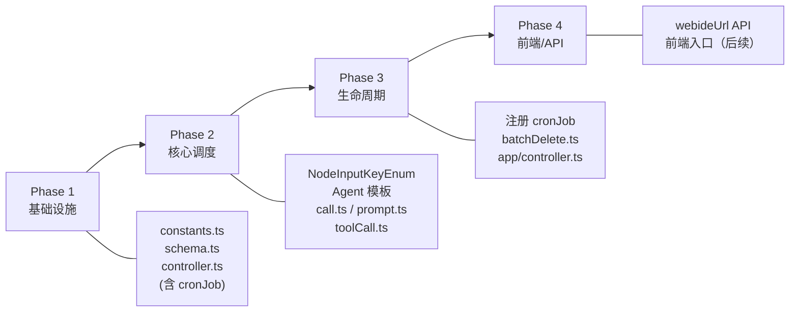

# FastGPT AI Sandbox 技术方案

> 基于 [PRD](./prd.md)，本文档详细到每个需要改造/新增的文件。

---

## 一、改造总览

```mermaid
graph TD
    subgraph 新增文件["🆕 新增文件"]
        A1["packages/service/core/ai/sandbox/schema.ts"]
        A2["packages/service/core/ai/sandbox/controller.ts\n(含 SandboxClient 类 + cronJob)"]
        A4["packages/global/core/ai/sandbox/constants.ts"]
        A5["projects/app/src/pages/api/core/ai/sandbox/webideUrl.ts"]
        A6["packages/service/.../agent/sub/sandbox/utils.ts"]
    end

    subgraph 改造文件["✏️ 改造文件"]
        B1["packages/global/core/workflow/constants.ts"]
        B1b["packages/global/.../agent/constants.ts\n(SubAppIds + systemSubInfo)"]
        B3["packages/service/.../agent/utils.ts\n(getSubapps)"]
        B4["packages/service/.../agent/master/call.ts"]
        B5["packages/service/.../agent/master/prompt.ts"]
        B6["packages/service/.../ai/tool/index.ts"]
        B7["packages/service/.../ai/tool/toolCall.ts"]
        B9["projects/app/.../system/cron.ts"]
        B10["projects/app/.../chat/history/batchDelete.ts"]
        B11["packages/service/core/app/controller.ts"]
    end

    A6 -.-> B3
    A2 -.-> B4
    A2 -.-> B9
    A2 -.-> B10
    A2 -.-> B11
    A4 -.-> B5
```



---

## 二、新增文件

### 2.1 `packages/global/core/ai/sandbox/constants.ts`

沙盒相关的全局常量和类型定义。

```typescript
// 沙盒系统提示词（useComputer=true 时追加到 System Prompt）
export const SANDBOX_SYSTEM_PROMPT = `你拥有一个独立的 Linux 沙盒环境（Ubuntu 22.04），可通过 shell 工具执行命令：
- 预装：bash / python3 / node / git / curl / wget
- 工作目录：/workspace（文件在本次会话内持久保留）
- 可自行安装软件包（apt / pip / npm）
- 可通过 timeout 参数指定命令超时时间`;

// 内置 shell 工具的 function calling schema
export const SANDBOX_SHELL_TOOL_SCHEMA = {
  type: 'function' as const,
  function: {
    name: 'sandbox_shell',
    description: '在独立 Linux 环境中执行 shell 命令，支持文件操作、代码运行、包安装等',
    parameters: {
      type: 'object',
      properties: {
        command: { type: 'string', description: '要执行的 shell 命令' },
        timeout: { type: 'number', description: '超时秒数（可选，由上游沙盒服务控制）' }
      },
      required: ['command']
    }
  }
};

// 沙盒状态枚举
export const SandboxStatusEnum = {
  running: 'running',
  stoped: 'stoped'
} as const;

// 沙盒默认配置
export const SANDBOX_SUSPEND_MINUTES = 5;

export const AGENT_SANDBOX_PROVIDER = process.env.AGENT_SANDBOX_PROVIDER
export const AGENT_SANDBOX_SEALOS_BASEURL = process.env.AGENT_SANDBOX_SEALOS_BASEURL
export const AGENT_SANDBOX_SEALOS_TOKEN = process.env.AGENT_SANDBOX_SEALOS_TOKEN
```

### 2.2 `packages/service/core/ai/sandbox/schema.ts`

MongoDB Model 定义。

```typescript
// 集合名: sandbox_instances
// 字段: sandboxId(唯一), appId, userId, chatId, status('running'|'stoped'), lastActiveAt, createdAt
// 索引: sandboxId(unique), chatId, appId, { status, lastActiveAt }
```

### 2.3 `packages/service/core/ai/sandbox/controller.ts`

沙盒业务逻辑层，核心类和函数：

**SandboxClient 类**：
| 方法 | 职责 |
|------|------|
| `constructor({ appId, userId, chatId })` | 初始化实例，生成 sandboxId，创建 SDK adapter |
| `exec(command, timeout?)` | SDK.create() → upsert DB (status=running) → SDK.execute() → 返回结果 |
| `delete()` | 使用事务：删除 DB 记录 + SDK.delete() |
| `stop()` | 使用事务：更新 DB status=stoped + SDK.stop() |

**导出函数**：
| 函数 | 职责 |
|------|------|
| `deleteSandboxesByChatIds(appId, chatIds)` | 查询 DB → 批量创建实例 → 调用 delete() |
| `deleteSandboxesByAppId(appId)` | 查询 DB → 批量创建实例 → 调用 delete() |
| `cronJob()` | 定时任务：查询 lastActiveAt 超时的 running 记录 → 批量调用 stop() |

**实现细节**：
- 使用 `mongoSessionRun` 保证 DB 操作和 SDK 调用的事务一致性
- 定时任务直接在 controller.ts 中实现，使用 `setCron('*/5 * * * *', ...)`
- 错误处理：SDK.create() 失败时返回 exitCode=-1 的错误结果

### 2.4 `projects/app/src/pages/api/core/ai/sandbox/file.ts`

文件操作 API（列表、读取、写入）。

```typescript
POST /api/core/ai/sandbox/file
Body: {
  appId: string;
  chatId: string;
  action: 'list' | 'read' | 'write';
  path: string;
  content?: string;  // write 时必需
  outLinkAuthData?: object;
}
Auth: authChatCrud
Response:
  - list: { action: 'list', files: Array<{ name, path, type, size }> }
  - read: { action: 'read', content: string }
  - write: { action: 'write', success: boolean }
```

### 2.5 `projects/app/src/pages/api/core/ai/sandbox/download.ts`

文件下载 API（单文件或目录 ZIP）。

```typescript
POST /api/core/ai/sandbox/download
Body: {
  appId: string;
  chatId: string;
  path: string;  // 文件或目录路径
  outLinkAuthData?: object;
}
Auth: authChatCrud
Response: 文件流或 ZIP 压缩包
```

---

## 三、改造文件

### 3.2 `packages/global/core/ai/sandbox/constants.ts`

**改动**：沙盒相关的全局常量和类型定义。

```typescript
// 沙盒状态枚举
export const SandboxStatusEnum = {
  running: 'running',
  stoped: 'stoped'
} as const;

// 沙盒默认配置
export const SANDBOX_SUSPEND_MINUTES = 5;

// sandboxId 生成函数
export const generateSandboxId = (appId: string, userId: string, chatId: string): string => {
  return hashStr(`${appId}-${userId}-${chatId}`).slice(0, 16);
};

// 工具名称和图标
export const SANDBOX_NAME: I18nStringType = {
  'zh-CN': '虚拟机',
  'zh-Hant': '虛擬機',
  en: 'Sandbox'
};
export const SANDBOX_ICON = 'core/app/sandbox/sandbox';
export const SANDBOX_TOOL_NAME = 'sandbox_shell';

// 系统提示词
export const SANDBOX_SYSTEM_PROMPT = `你拥有一个独立的 Linux 沙盒环境（Ubuntu 22.04），可通过 ${SANDBOX_TOOL_NAME} 工具执行命令：
- 预装：bash / python3 / node / bun / git / curl
- 工作目录：/workspace（文件在本次会话内持久保留）
- 可自行安装软件包（apt / pip / npm）`;

// 工具定义
export const SANDBOX_SHELL_TOOL: ChatCompletionTool = {
  type: 'function',
  function: {
    name: SANDBOX_TOOL_NAME,
    description: '在独立 Linux 环境中执行 shell 命令，支持文件操作、代码运行、包安装等',
    parameters: {
      type: 'object',
      properties: {
        command: { type: 'string', description: '要执行的 shell 命令' },
        timeout: { type: 'number', description: '超时秒数', max: 300, min: 1 }
      },
      required: ['command']
    }
  }
};

// Zod Schema 用于参数验证
export const SandboxShellToolSchema = z.object({
  command: z.string(),
  timeout: z.number().optional()
});
```

**影响范围**：新增文件，提供全局常量和类型定义。

### 3.3 `packages/global/core/workflow/constants.ts`

**改动**：在 `NodeInputKeyEnum` 中新增 key。

```typescript
// 新增
useAgentSandbox = 'useAgentSandbox',   // 启用沙盒（Computer Use）
```

**影响范围**：枚举新增，不影响现有逻辑。

---

### 3.4 `packages/service/env.ts`

**改动**：新增沙盒相关环境变量定义。

```typescript
export const env = createEnv({
  server: {
    AGENT_SANDBOX_PROVIDER: z.enum(['sealosdevbox']).optional(),
    AGENT_SANDBOX_SEALOS_BASEURL: z.string().optional(),
    AGENT_SANDBOX_SEALOS_TOKEN: z.string().optional(),
    // ...其他环境变量
  }
});
```

**影响范围**：环境变量验证和类型定义。

---

### 3.3 `packages/service/core/workflow/dispatch/ai/agent/sub/sandbox/utils.ts` 🆕

**新增文件**：沙盒工具定义，与 `sub/dataset/utils.ts`、`sub/file/utils.ts` 同级。

```typescript
import type { ChatCompletionTool } from '@fastgpt/global/core/ai/type';
import { SubAppIds } from '@fastgpt/global/core/workflow/node/agent/constants';
import z from 'zod';

// Agent 调用时传递的参数
export const SandboxShellToolSchema = z.object({
  command: z.string(),
  timeout: z.number().optional()
});

// ChatCompletionTool 定义
export const sandboxShellTool: ChatCompletionTool = {
  type: 'function',
  function: {
    name: SubAppIds.sandboxShell,
    description: '在独立 Linux 环境中执行 shell 命令，支持文件操作、代码运行、包安装等',
    parameters: {
      type: 'object',
      properties: {
        command: { type: 'string', description: '要执行的 shell 命令' },
        timeout: { type: 'number', description: '超时秒数（可选，由上游沙盒服务控制）' }
      },
      required: ['command']
    }
  }
};
```

---

### 3.4 `packages/service/core/workflow/dispatch/ai/agent/utils.ts`

**改动**：在 `getSubapps()` 中新增 `useAgentSandbox` 参数，与 `hasDataset`、`hasFiles` 同级注入。

```typescript
// 参数新增
export const getSubapps = async ({
  // ...现有参数...
  useAgentSandbox   // 新增
}: {
  // ...现有类型...
  useAgentSandbox?: boolean;  // 新增
}) => {
  // ...现有逻辑...

  /* Sandbox Shell */        // 新增，与 Dataset Search 同级
  if (useAgentSandbox) {
    completionTools.push(sandboxShellTool);
  }

  // ...后续不变...
};
```

---

### 3.5 `packages/service/core/workflow/dispatch/ai/agent/master/call.ts`

**改动**：在工具调用分发逻辑中，处理 `sandbox_shell` 的调用结果。

```
位置：约第 440 行附近，工具调用分发逻辑
当前：已有 plan / dataset / file / model / tool 等分支
新增：if (toolName === SubAppIds.sandboxShell) { 调用 execShell() 并返回结果 }
```

与 `datasetSearch` 的处理方式一致：拦截内置工具名 → 调用对应 controller → 格式化结果返回给 Agent。

---

### 3.6 `packages/service/core/workflow/dispatch/ai/agent/master/prompt.ts`

**改动**：`getMasterSystemPrompt()` 函数中，当 `useAgentSandbox=true` 时，在 System Prompt 末尾追加沙盒环境说明。

```typescript
// 新增参数 useAgentSandbox?: boolean
// 当 useAgentSandbox=true 时，追加 SANDBOX_SYSTEM_PROMPT
export const getMasterSystemPrompt = (
  systemPrompt?: string,
  hasUserTools: boolean = true,
  useAgentSandbox?: boolean  // 新增
) => {
  let prompt = `...现有逻辑...`;
  if (useAgentSandbox) {
    prompt += `\n\n${SANDBOX_SYSTEM_PROMPT}`;
  }
  return prompt;
};
```

---

### 3.7 `packages/service/core/workflow/dispatch/ai/tool/index.ts`

**改动**：`dispatchRunTools`（toolCall 模式）中，读取 `useAgentSandbox` 输入值，传递给下游。

```
位置：函数入口处，从 inputs 中读取 useAgentSandbox
传递给 runToolCall() 调用
```

---

### 3.8 `packages/service/core/workflow/dispatch/ai/tool/toolCall.ts`

**改动**：`runToolCall` 中：

1. 当 `useAgentSandbox=true` 时，在 `tools` 数组中追加 `sandboxShellTool`
2. 在 System Prompt 末尾追加 `SANDBOX_SYSTEM_PROMPT`
3. 处理 AI 返回的 `sandbox_shell` 工具调用：拦截 → 调用 `execShell()` → 将结果作为 tool response 返回

```
位置：约第 58-109 行（构建 tools 参数处）和第 205-267 行（处理工具响应处）
```

---

### 3.9 `projects/app/src/service/common/system/cron.ts`

**改动**：在 `startCron()` 中注册沙盒停止定时任务。

```typescript
import { cronJob } from '@fastgpt/service/core/ai/sandbox/controller';

export const startCron = () => {
  // ...现有定时任务...
  cronJob();  // 新增：注册沙盒停止定时任务
};
```

**说明**：定时任务逻辑直接在 controller.ts 中实现，不需要单独的 cron.ts 文件。

---

### 3.10 `projects/app/src/pages/api/core/chat/history/batchDelete.ts`

**改动**：在会话批量删除逻辑中，追加异步沙盒清理。

```typescript
import { deleteSandboxesByChatIds } from '@fastgpt/service/core/ai/sandbox/controller';

// 在现有删除逻辑之后，异步触发（不 await，不阻塞主流程）
deleteSandboxesByChatIds(appId, chatIds).catch(console.error);
```

**同样需要改造**：`delHistory.ts`（单个会话软删除时不触发，因为是软删除）和 `clearHistories.ts`（软删除，不触发）。只有硬删除（batchDelete）才触发沙盒清理。

---

### 3.11 `packages/service/core/app/controller.ts`

**改动**：在 `deleteAppDataProcessor()` 中追加沙盒清理。

```typescript
import { deleteSandboxesByAppId } from '../ai/sandbox/controller';

export const deleteAppDataProcessor = async ({ app, teamId }) => {
  const appId = String(app._id);

  // ...现有删除逻辑...

  // 新增：删除该应用下所有沙盒
  await deleteSandboxesByAppId(appId);

  await MongoApp.deleteOne({ _id: appId });
};
```

### 环境变量模板调整

需要调整对应的 env 文件，参考 `@fastgpt-sdk/sandbox-adapter` 需要的变量。

```bash
# Sealos devbox
AGENT_SANDBOX_PROVIDER=sealos-devbox
AGENT_SANDBOX_SEALOS_BASEURL=
AGENT_SANDBOX_SEALOS_TOKEN=
```

---

## 四、文件改动汇总

| 文件 | 操作 | 改动量 | 说明 |
|------|------|--------|------|
| `packages/global/core/ai/sandbox/constants.ts` | 🆕 新增 | ~40 行 | 常量、类型、系统提示词 |
| `packages/service/core/ai/sandbox/schema.ts` | 🆕 新增 | ~50 行 | MongoDB Model + 索引 |
| `packages/service/core/ai/sandbox/controller.ts` | 🆕 新增 | ~156 行 | SandboxClient 类 + delete/stop 函数 + cronJob |
| `packages/service/.../agent/sub/sandbox/utils.ts` | 🆕 新增 | ~35 行 | sandboxShellTool 定义（同 datasetSearchTool 模式） |
| `projects/app/src/pages/api/core/ai/sandbox/webideUrl.ts` | 🆕 新增 | ~30 行 | Web IDE URL API |
| `packages/global/core/workflow/constants.ts` | ✏️ 改造 | +1 行 | NodeInputKeyEnum 新增 useAgentSandbox |
| `packages/global/.../agent/constants.ts` | ✏️ 改造 | +12 行 | SubAppIds 新增 sandboxShell + systemSubInfo 注册 |
| `packages/service/.../agent/utils.ts` | ✏️ 改造 | +5 行 | getSubapps() 新增 useAgentSandbox 参数，注入 sandboxShellTool |
| `packages/service/.../agent/master/call.ts` | ✏️ 改造 | +20 行 | 拦截 sandbox_shell 调用，路由到 SandboxClient.exec() |
| `packages/service/.../agent/master/prompt.ts` | ✏️ 改造 | +5 行 | 追加沙盒 System Prompt |
| `packages/service/.../ai/tool/index.ts` | ✏️ 改造 | +5 行 | 读取 useAgentSandbox 传递下游 |
| `packages/service/.../ai/tool/toolCall.ts` | ✏️ 改造 | +30 行 | 注入 shell tool + 拦截调用 |
| `projects/app/.../system/cron.ts` | ✏️ 改造 | +2 行 | 注册沙盒 cronJob |
| `projects/app/.../chat/history/batchDelete.ts` | ✏️ 改造 | +3 行 | 异步删除沙盒 |
| `packages/service/core/app/controller.ts` | ✏️ 改造 | +3 行 | 应用删除时清理沙盒 |

---

## 五、实现顺序



| 阶段 | 内容 | 可独立测试 |
|------|------|-----------|
| Phase 1（完成）| 新增 constants + schema + controller (含 cronJob) | 可集成测试 SandboxClient.exec() / stop() / delete() |
| Phase 2 （完成）| ToolCall 节点注入 useAgentSandbox + 简易模式支持 useComputer（一个开关即可） + shell tool + 拦截调用 | 需手动运行验证 |
| Phase 3（完成） | 注册 cronJob + 会话/应用删除时清理 | 可通过 cron 日志 + 手动删除会话验证 |
| Phase 4 | Web IDE URL API + 前端入口 | 需要前端配合 |
| Phase 5 | Agent 模式支持 computer | 需手动运行验证 |

---

## 六、依赖项

| 依赖 | 说明 | 状态 |
|------|------|------|
| `@fastgpt-sdk/sandbox-adapter` | SDK 包，提供 create/exec/suspend/delete/getWebIdeUrl | 需确认 API 是否就绪 |
| i18n key | `workflow:template.use_agent_sandbox` / `workflow:template.use_computer_desc` | 需新增中英繁体翻译 |
