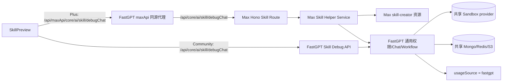

# Skill 辅助生成迁移 Max 需求设计文档

## 0. 文档标识

- 任务前缀：`skill-max-migration`
- 文档文件名：`skill-max-migration-需求设计文档.md`
- 状态：代码迁移已完成，待真实鉴权生成与部署镜像验收
- 最后核对：2026-09-15

## 1. 需求背景与目标

### 1.1 背景

- FastGPT 已通过 `max/` 子仓库承载 AgentV2 辅助生成，浏览器经 FastGPT 的 `/api/maxApi/*` 同源代理访问 Max Hono 服务。
- 迁移前，Skill 辅助生成的商业入口位于 `pro/admin`，其差异化能力来自内置 `skill-creator` Skill；本次实现已将两者迁入 Max。
- 社区版也有 Skill Edit Debug，且与商业版共用权限、聊天轮次、Workflow、Sandbox 和使用量记录等平台能力。不能把这些通用能力一并从 FastGPT 移除，否则社区版路径会失效。
- 本次先完成 Skill 辅助生成迁移。工作流辅助生成不在本期范围内。

触发场景：Plus 用户进入 Skill 详情页，在编辑沙盒已就绪后发送自然语言要求，由内置 `skill-creator` 指导 Agent 创建或修改用户工作区中的 Skill 文件。

### 1.2 目标

- 业务目标：Plus 用户使用 Skill 辅助生成时，请求由 Max 服务处理，不再执行 Pro 中的 Skill 辅助生成代码。
- 技术目标：Max 成为 `skill-creator` 源文件、加载逻辑和商业 Skill 调试入口的唯一所有者；FastGPT 继续提供通用 Skill 编辑运行时。
- 兼容目标：社区版 `/api/core/ai/skill/debugChat` 保持可用，前端交互、请求体、SSE 事件和聊天记录格式不变。
- 成功指标：
  - Plus 路径只访问 `/api/maxApi/core/ai/skill/debugChat`。
  - Pro 中旧路由、加载器和 `skill-creator` 源文件全部删除，仓库内不存在第二份有效副本。
  - `skill-creator` 在开发构建和生产镜像中均能被 Max 加载。
  - Max 能找到 FastGPT 创建的同一个 Skill Edit Sandbox，并完成文件写入。
  - 使用量继续记录为 `UsageSourceEnum.fastgpt`，不新增 `max` 或 `pro` 来源。

## 2. 项目事实基线与实现锚点（基于代码）

| 能力项 | 现有实现位置（文件路径） | 现状说明 | 结论（复用/修改/新增） |
|---|---|---|---|
| 前端触发 | `projects/app/src/pageComponents/dashboard/skill/detail/preview/SkillPreview.tsx` | 组装 Skill 调试消息并调用 `streamSkillDebugChat` | 复用，不改页面交互 |
| 前端选路 | `projects/app/src/web/core/skill/api.ts` | Plus 当前请求 `/api/proApi/core/ai/skill/debugChat` | 修改为 `/api/maxApi/core/ai/skill/debugChat` |
| 同源代理 | `projects/app/src/pages/api/maxApi/[...path].ts` | 将 `/api/maxApi/*` 转发为 Max 的 `/api/*`，支持 SSE | 完全复用，不新增 Skill 专用代理 |
| 社区 API | `projects/app/src/pages/api/core/ai/skill/debugChat.ts` | 校验请求后调用共享 `handleSkillDebugChat` | 保持不变 |
| Pro 商业入口 | `pro/admin/src/pages/api/core/ai/skill/debugChat.ts` | 迁移前向共享处理器注入 `skill-creator` | 已删除，由 Max 路由替代 |
| 通用调试流程 | `packages/service/core/ai/skill/debugChat/handler.ts` | 权限、聊天轮次、Workflow、usage、落库与失败收尾 | 抽出传输层无关 runner；原社区 Next 适配器保留 |
| Runtime 图 | `packages/service/core/ai/skill/debugChat/runtime.ts` | 构建 `workflowStart -> Agent`，写入隐藏 `editSkillId` | 完全复用 |
| 内置 Skill 协议 | `packages/global/core/ai/skill/runtime/builtin.ts` | 定义 `BuiltinSkillSource` 和文件结构 | 完全复用 |
| 内置 Skill 注入 | `packages/service/core/workflow/dispatch/ai/agent/sub/sandbox/prepare.ts` | `createBuiltinSkillPrepareAction` 在 Agent 运行前同步资源 | 完全复用 |
| Sandbox 同步 | `packages/service/core/ai/sandbox/application/runtime/skill/builtin.ts` | 写入 `$HOME/.fastgpt/skills/<name>`，按 etag 幂等同步 | 完全复用 |
| Skill Edit Sandbox | `packages/service/core/ai/sandbox/application/skillEdit/runtime.ts` | `getRunningSkillEditSandbox` 按 Skill 和团队查找运行实例 | 完全复用，共享同一数据库和 provider |
| Pro 内置资源加载 | `pro/admin/src/service/core/ai/skill/builtin/index.ts` | 迁移前从 Pro 目录递归读取内置 Skill | 已删除，Max 改为包内确定性路径 |
| Pro 内置资源 | `pro/admin/src/service/core/ai/skill/builtin/skill-creator/**` | 迁移前由该目录保存生成质量核心 | 已原样移动到 Max，Pro 副本已删除 |
| Max 路由 | `max/apps/server/src/app.ts`、`max/apps/server/src/routes/**` | Hono `/api` 路由及 SSE 会话已有 AgentV2 范式 | 新增 Skill 路由并挂载 |
| Max 请求适配 | `max/apps/server/src/services/skill-helper/debug-chat.ts` | 已有 Fetch Headers 到 Node 请求的共享转换函数 | 在组合共享 runner 时复用，不新增权限实现 |
| API 契约 | `packages/global/openapi/core/ai/skill/index.ts` | 同时登记社区和 Pro Skill 调试路径 | 将商业路径改为 Max；schema 不变 |
| 断流续传请求头 | `projects/app/src/web/common/api/fetch.ts` | 恢复请求白名单仍登记 Pro Skill 路径 | 替换为 Max Skill 路径 |
| 数据 | Mongo Chat、Skill、Sandbox、Usage 现有模型 | 三个服务通过相同基础设施访问同一业务状态 | 不新增字段、集合、索引或迁移脚本 |

## 3. 需求澄清记录

| 维度 | 已确认内容 | 待确认内容 | 备注 |
|---|---|---|---|
| 业务目标 | Skill 辅助生成商业能力迁入 Max，AgentV2 已迁移完成 | 无 | 工作流辅助生成后续单独迁移 |
| 范围边界 | `skill-creator`、加载器、商业路由与 Max 编排属于本期 | 无 | 通用 Skill Runtime 不属于商业代码 |
| 权限模型 | 继续使用 `authSkill` 与 `WritePermissionVal` | 无 | Max 不自建权限体系 |
| 数据模型 | 沿用 FastGPT 的 Skill、Chat、Sandbox、Usage 数据 | 无 | 不做 DB schema 变更 |
| API 行为 | Plus 前端改走 `/api/maxApi/core/ai/skill/debugChat`；社区路径不变 | 无 | Max 实际接收 `/api/core/ai/skill/debugChat` |
| 使用量来源 | 继续使用 `UsageSourceEnum.fastgpt` | 无 | 不因服务拆分改变产品侧记账口径 |
| Sandbox | Max 与 FastGPT 使用相同 Sandbox provider 配置和访问凭证 | 无 | Max 查找 FastGPT 已初始化的同一沙盒 |
| 前端交互 | 页面、请求体、SSE 事件、加载/错误/完成状态不变 | 无 | 仅修改 Plus URL 选择 |
| 文档 i18n | 本期仅内部中文设计文档，无用户可见文案 | 无 | 不触发产品文案翻译 |

### 3.1 影响域判定

| 维度 | 是否命中 | 证据（需求/代码锚点） | 核对规范 | 结论 |
|---|---|---|---|---|
| API | Yes | 商业路径由 `proApi` 切到 `maxApi`，新增 Hono 路由 | FastGPT API 规范、Max Hono 现有模式 | schema 复用，边界继续校验 |
| Data | No | 不改变任何模型和索引 | MongoDB Schema 与索引维护规范 | 无数据迁移 |
| Frontend | Yes | `streamSkillDebugChat` URL 分支变化 | 现有前端请求封装 | 页面本身不变 |
| Logging | Yes | 新增 Max Skill 服务和资源加载错误 | 项目日志规范 | 使用现有分类和结构化字段 |
| Packaging | Yes | Markdown、Python 等非 TS 资源不会被 tsdown 自动打包 | Max 构建与生产启动方式 | 必须显式复制并做构建产物测试；镜像启动单独验收 |
| Testing | Yes | 跨前端、代理、Max、Sandbox、SSE | `references/testing-standards.md` | 增加 Max 单元/集成和构建冒烟测试 |
| DocI18n | No | 无用户可见字符串变更 | 项目文档 i18n 规范 | 无需翻译文件 |

## 4. 范围定义

### 4.1 In Scope（本期必须）

- 把 `pro/admin/src/service/core/ai/skill/builtin/skill-creator/**` 原样迁移到 `max/apps/server/resources/builtin-skills/skill-creator/**`。
- 在 Max 新增包内资源加载器、Hono 路由、SSE 适配器和调试组合服务。
- 把现有 Skill Debug 生命周期抽为传输层无关共享 runner，使社区 Next API 与 Max Hono API 共用鉴权、团队限流、编辑沙盒、聊天轮次、Workflow、usage 和失败收尾逻辑。
- 通过 `createBuiltinSkillPrepareAction` 只注入 `skill-creator`，保持内置目录与用户 workspace 隔离。
- 修改 Plus 前端选路、流恢复白名单和 OpenAPI 商业路径。
- 为 Max 增加 Sandbox provider 配置示例；变量名和值与 FastGPT 主进程一致。
- 显式处理非 TS 内置资源的开发路径、构建复制和生产镜像验证。
- 迁移验证通过后删除 Pro 的旧入口、加载器和资源目录。

### 4.2 Out of Scope（本期不做）

- 不迁移工作流辅助生成。
- 不迁移 Skill 创建、发布、版本、导入导出、权限管理或 Sandbox 初始化 API。
- 不修改 `skill-creator` 的提示词、references 或 Python 校验脚本内容。
- 不新增模型配置。Max 继续加载 FastGPT 的系统模型配置。
- 不改变使用量来源，继续标记为 `fastgpt`。
- 不改变 Sandbox provider、镜像、资源规格或安全策略，仅共享现有配置与凭证。
- 不修改 MongoDB Schema、索引、聊天数据结构或历史数据。
- 不把 Max 反向依赖 Pro，也不让 FastGPT 主进程读取 Max 私有资源。

## 5. 方案对比

| 方案 | 核心思路 | 优点 | 风险 | 成本 | 结论 |
|---|---|---|---|---|---|
| 方案 A：整套 Skill Debug 全部搬入 Max | 删除 FastGPT 共享处理器，社区和商业请求都依赖 Max | 物理归属最单一 | 社区版被迫依赖商业服务；破坏开源能力；部署耦合错误 | 高 | 拒绝 |
| 方案 B：商业能力迁移，平台引擎保留 | `skill-creator`、加载器和商业入口归 Max；HTTP 无关 runner、权限、Workflow、Sandbox 等通用能力继续由 workspace 包提供 | 社区与 Max 共用生命周期；Pro 可彻底退出；改动边界清楚 | 共享 runner 需要显式注入 Next/Hono 传输差异 | 中 | 已采用 |
| 方案 C：Max 再转发到 Pro | 前端改走 Max，但 Max 内部继续请求 Pro | 表面改动小 | 没有真正迁移；增加一跳和故障点；Pro 仍不可移除 | 低 | 拒绝 |

推荐方案：方案 B。这里的“核心迁移”按所有权定义，而不是按依赖文件数量定义：生成质量核心 `skill-creator` 和商业入口必须只存在于 Max；通用平台引擎继续位于 FastGPT workspace，供社区与 Max 共同复用。

## 6. 推荐方案详细设计

### 6.1 目标调用链



连接原则：浏览器只连接 FastGPT 同源地址；FastGPT 代理连接 Max；Max 不连接 Pro，而是通过 workspace 包和相同基础设施配置直接使用通用服务。

命名约定：

| 对象 | 命名 | 原因 |
|---|---|---|
| Max 模块目录 | `skill-helper` | 与现有 `chat-agent-helper` 平级，分别表示 Skill 和 AgentV2 两类辅助生成能力 |
| 服务类/实例 | `SkillHelperDebugChatService` / `skillHelperDebugChatService` | 类名先表达所属能力，再表达具体动作 |
| Hono 路由对象 | `skillHelper` | 与模块目录一致 |
| 对外 API | `/api/core/ai/skill/debugChat` | 保留 FastGPT 现有 Skill 领域和动作语义，不因内部目录调整破坏接口契约 |
| 内置 Skill | `skill-creator` | 这是注入 Sandbox 的具体 Skill 名称，不等同于服务模块名，保持现有内容和扫描协议不变 |

### 6.2 API 设计

| 路由/接口 | 方法 | 鉴权 | 请求 | 响应 | 错误分支 | 相关文件 |
|---|---|---|---|---|---|---|
| 浏览器 `/api/maxApi/core/ai/skill/debugChat` | POST | cookie/header 由代理透传 | `SkillDebugChatBodySchema` | `ChatWorkflowSseResponse` SSE | 400 参数、无权限、限流、沙盒不存在、Workflow 失败 | `projects/app/src/web/core/skill/api.ts`、`projects/app/src/pages/api/maxApi/[...path].ts` |
| Max `/api/core/ai/skill/debugChat` | POST | `authSkill` + `WritePermissionVal` | 同上 | 同上 | 错误写为现有 SSE error 事件；请求尚未进入流时返回标准错误 | `max/apps/server/src/routes/skill-helper/debug-chat.ts` |
| 社区 `/api/core/ai/skill/debugChat` | POST | 原有鉴权 | 同上 | 同上 | 完全沿用现状 | `projects/app/src/pages/api/core/ai/skill/debugChat.ts` |

请求示例：

```json
{
  "skillId": "skill-id",
  "chatId": "chat-id",
  "modelId": "model-id",
  "messages": [{ "role": "user", "content": "创建一个 CSV 数据分析 Skill" }],
  "systemPrompt": ""
}
```

响应继续采用事件流，不新增事件类型：

```text
event: answer
data: {"choices":[{"delta":{"content":"..."}}]}

event: answer
data: [DONE]
```

### 6.3 数据设计

本期没有数据结构变更。Max 必须复用相同的 MongoDB、Redis、S3、系统模型配置和 Sandbox provider，确保以下标识在三个进程间含义一致：`teamId`、`tmbId`、`skillId`、`chatId`、`sandboxId`、`usageId`。

| 实体 | 字段 | 类型 | 必填 | 默认值 | 索引/约束 | 兼容策略 |
|---|---|---|---|---|---|---|
| Usage | `source` | `UsageSourceEnum` | 是 | 无 | 沿用现有模型 | 固定传 `UsageSourceEnum.fastgpt` |
| Skill Edit Chat | 现有全部字段 | 不变 | 不变 | 不变 | 不变 | 沿用 `preChatRound`、`finalizeChatRound`、`failChatRound` |
| Sandbox runtime | 现有记录 | 不变 | 不变 | 不变 | 不变 | Max 使用 `getRunningSkillEditSandbox` 查找同一实例 |

### 6.4 核心代码设计

| 模块 | 关键函数/类型 | 变更说明 | 上下游影响 |
|---|---|---|---|
| Max 路由 | `skillHelper.post('/debugChat')` | zod 校验、开启 Hono SSE、调用服务 | 新增商业入口 |
| 共享编排 | `runSkillDebugChat` | 从原处理器抽出 HTTP 无关生命周期，继续执行 `authSkill` 写权限、Chat、Workflow、usage 和失败收尾 | 社区与 Max 共用，不产生实现漂移 |
| Max 编排 | `SkillHelperDebugChatService.run` | 只组合共享 runner、Hono SSE、团队限流和 Max 内置 Skill | 影响 Plus 请求，不影响社区路由 |
| Max 资源加载 | `getMaxBuiltinSkillSources` | 从 Max 包内资源根目录递归读取并校验 `SKILL.md` | 替代 Pro 加载器 |
| Max 资源注入 | `createBuiltinSkillPrepareAction` | `includeNames` 固定为 `skill-creator` | 写入 Sandbox HOME，不污染用户版本 |
| Max SSE | `SseSession` + Workflow writer adapter | 把 Workflow 结构化事件写入 Hono SSE，并连接 resume mirror | 保持浏览器协议不变 |
| FastGPT 前端 | `streamSkillDebugChat` | Plus URL 从 `proApi` 改为 `maxApi` | 页面逻辑无变化 |
| OpenAPI | `SkillPath` | 商业调试路径从 Pro 改为 Max | 请求/响应 schema 无变化 |

### 6.5 必须保持不变的功能与代码

以下内容不是迁移遗漏，而是有意保留的稳定平台边界：

| 保持项 | 文件/符号 | 不变原因 |
|---|---|---|
| Skill 页面和聊天状态 | `SkillPreview.tsx`、`SkillDetailContext` | 用户交互已经可用，只需替换请求目的地 |
| 社区 Skill Debug API | `projects/app/src/pages/api/core/ai/skill/debugChat.ts` | 社区版不能依赖 Max |
| 社区 Next 适配器 | `handleSkillDebugChat` | 继续服务社区入口，负责 Node response header、SSE 初始化和 `res.end()` |
| 共享业务 runner | `runSkillDebugChat` | 社区和 Max 共用权限、聊天、Workflow、usage 及失败收尾，避免两套逻辑漂移 |
| Runtime 节点拓扑 | `buildDebugRuntimeNodes` | 隐藏 `editSkillId` 是 Agent 连接编辑沙盒的关键协议 |
| 请求/响应 schema | `SkillDebugChatBodySchema`、`ChatWorkflowSseResponseSchema` | 避免前后端协议分叉 |
| 权限语义 | `authSkill` + `WritePermissionVal` | 防止 Max 形成第二套授权逻辑 |
| Sandbox 初始化与 WebSocket | `projects/app` 的 runtime/init、SandboxEditor | 沙盒仍由 FastGPT 初始化和浏览器连接 |
| Sandbox 查找和内置 Skill 同步 | `getRunningSkillEditSandbox`、`createBuiltinSkillPrepareAction` | Max 只提供资源，不重写 provider 逻辑 |
| 用户工作区边界 | `<workspace>/skills/<name>` | 内置 Skill 仍写 `$HOME/.fastgpt/skills`，不能打包进用户版本 |
| 聊天和失败收尾 | `preChatRound`、`finalizeChatRound`、`failChatRound` | 保证历史记录和错误状态兼容 |
| 使用量口径 | `UsageSourceEnum.fastgpt` | 服务拆分不等于产品来源变化 |
| Max 同源代理 | `projects/app/src/pages/api/maxApi/[...path].ts` | 已支持 headers、body、错误和 SSE 透传 |

### 6.6 前端设计

| 页面/组件 | 入口文件 | 状态覆盖（加载/空/错/成功） | i18n | 变更说明 |
|---|---|---|---|---|
| Skill 编辑预览 | `SkillPreview.tsx` | 全部沿用 | 无 | 不改 |
| Skill API 封装 | `projects/app/src/web/core/skill/api.ts` | 沿用 `streamFetch` | 无 | 仅替换 Plus URL |
| 流恢复 | `projects/app/src/web/common/api/fetch.ts` | 沿用恢复成功、不可恢复、错误状态 | 无 | 白名单替换为 Max 路径 |

### 6.7 日志设计

| 场景 | 级别 | 分类 | 字段 | 脱敏策略 |
|---|---|---|---|---|
| 内置 Skill 加载失败 | error | `AGENT_SKILLS` | `skillName`、资源根路径、错误 | 不记录文件正文 |
| 编辑沙盒不存在 | warn/error | `AGENT_SKILLS` | `skillId`、`teamId` | 不记录 token/凭证 |
| Workflow 调度开始/完成 | debug | `AGENT_SKILLS` | `skillId`、`chatId`、`modelId`、耗时 | 不记录 prompt 和用户文件 |
| 调试失败 | error | `AGENT_SKILLS` | `skillId`、`chatId`、标准化错误 | 不记录 cookie、API key、Sandbox credential |

### 6.8 Packaging 与环境配置

- 源资源固定放在 `max/apps/server/resources/builtin-skills/skill-creator/**`。
- 构建阶段把该目录复制到 `max/apps/server/dist/resources/builtin-skills/skill-creator/**`；不能依赖 tsdown 自动处理 Markdown/Python 文件。
- 运行时按模块位置探测 Max 自身的源码资源目录和 `dist/resources` 构建资源目录；不依赖
  `NODE_ENV`、`process.cwd()` 或向上遍历整个仓库寻找 Pro 目录。
- `max/apps/server/.env.example` 增加与 FastGPT 主进程同名的 `AGENT_SANDBOX_PROVIDER` 及所选 provider 的凭证变量。部署时两边填写相同值，不新增 Max 专用 Sandbox 变量。
- `PRO_URL`/`PRO_TOKEN` 只负责系统配置和 usage 明细转发，不负责模型插件注册，也不用于连接 Sandbox。

## 7. 风险、迁移与回滚

### 7.1 风险清单

- 非 TS 资源未进入 `dist` 或 Docker 运行目录，开发环境可用但生产报 `skill-creator` 不存在。
- Max 与 FastGPT 的 Sandbox provider 或凭证不一致，导致 FastGPT 创建成功但 Max 无法访问。
- 共享 runner 抽取不完整会造成社区或 Max 的 `failChatRound`、interactive、usage 等行为回归。
- 前端流恢复白名单仍使用 Pro URL，断线后不会发送恢复请求头。
- 提前删除 Pro 代码且 Max 尚未发布，造成 Plus Skill 辅助生成中断。
- `skill-creator` 在 Pro 和 Max 同时维护，后续出现内容漂移。

### 7.2 迁移策略

1. 先在 Max 增加资源、加载器、服务、路由、环境模板和测试，不改前端选路。
2. 验证 Max 直连接口、FastGPT 同源代理、实际 Sandbox 文件写入和 usage 明细。
3. 再切换前端 URL、流恢复白名单和 OpenAPI 路径。
4. 完成社区路径回归后，删除 Pro 路由、加载器和资源目录。
5. 用仓库搜索确认 `skill-creator` 只有 Max 一份有效源文件，Pro 不再提供旧接口。

### 7.3 回滚策略

- 发布切换前：直接撤销 Max 新路由，不影响当前 Pro 路径。
- 切换后出现故障：仅把前端 URL 和流恢复白名单临时切回 Pro；前提是回滚窗口内尚未删除/发布移除 Pro 产物。
- Pro 代码删除后：通过版本回滚同时恢复 Pro 产物和前端旧 URL，不能只回滚其中一侧。
- 数据无需回滚，因为本次没有 schema 或历史数据变更；失败轮次按现有机制标记为 error。

## 8. 验收标准

| 验收项 | 验收方式 | 通过标准 |
|---|---|---|
| Plus 请求路由 | 浏览器 Network 与服务日志 | 只访问 `/api/maxApi/core/ai/skill/debugChat`，Max 收到 `/api/core/ai/skill/debugChat` |
| 社区兼容 | 调用 `/api/core/ai/skill/debugChat` | 行为与迁移前一致，不要求 Max 在线 |
| 权限 | 无权限成员调用 Max 接口 | 被拒绝，不能读取/修改 Skill 沙盒 |
| Sandbox 共享 | FastGPT 初始化后由 Max 调试 | Max 命中同一 sandboxId，并能修改用户 workspace |
| 内置 Skill 隔离 | 检查 Sandbox 目录和导出包 | `skill-creator` 位于 `$HOME/.fastgpt/skills`，不进入用户版本包 |
| 生成效果 | 创建和修改 Skill | Agent 能读取 `skill-creator/SKILL.md` 并完成文件生成与校验 |
| SSE | 正常、断线恢复、错误三类请求 | 事件顺序和现有前端兼容，无代理缓冲 |
| 记账 | 检查 usage 明细 | source 为 `fastgpt`，模型点数可追踪且不重复 |
| 构建产物 | 执行 Max build 并逐文件比较 | `dist/resources/.../SKILL.md`、references、scripts 与源码一致 |
| 部署镜像 | 使用 Node 26 Docker 镜像启动 Max | 生产镜像包含 `dist/main.mjs`、`dist/resources/builtin-skills/skill-creator` 和外部运行依赖，健康检查返回 200 |
| Pro 清理 | `rg` 搜索旧路由和资源 | Pro 无 Skill 辅助生成入口、加载器或 `skill-creator` 副本 |

## 9. MECE 核查结论

### 9.1 相互独立

- 所有权：Max 负责商业生成能力，FastGPT 负责通用平台能力，Pro 不再参与该调用链。
- 传输：FastGPT 代理负责同源转发，Max 路由负责 Hono 边界，Workflow 只负责执行。
- 数据：复用现有存储和标识，不额外同步或复制数据。
- 测试：资源加载、服务编排、路由契约、前端选路和端到端分别验证，不重复代替彼此。

### 9.2 完全穷尽

- 已覆盖正常生成、参数非法、无权限、限流、沙盒不存在、模型/Workflow 失败、断流续传、资源缺失和生产打包。
- 已覆盖源码运行、构建产物路径、Node 26 直接启动、Docker 镜像构建、灰度切换、Pro 清理和版本回滚。
- 已覆盖前端、API、核心服务、Sandbox、数据、usage、日志和文档边界。

### 9.3 修订动作

`[问题]` 最初“全部迁移到 Max”可能被理解为连社区 Skill Debug 引擎也删除。

`影响:` 社区版会被迫依赖商业服务，破坏产品边界。

`修订动作:` 将“核心”明确为 `skill-creator`、其加载器和商业入口；通用平台引擎列入保持不变清单。

`修订后结果:` Pro 可退出，Max 拥有商业能力，社区路径继续独立运行。

`[问题]` 非 TS 内置资源不会由 TypeScript bundler 自动保证进入运行镜像。

`影响:` 本地成功、生产失败。

`修订动作:` 增加显式资源复制和产物断言，并把部署镜像冒烟列为发布验收项。

`修订后结果:` 资源从源码到运行目录的链路可验证。
