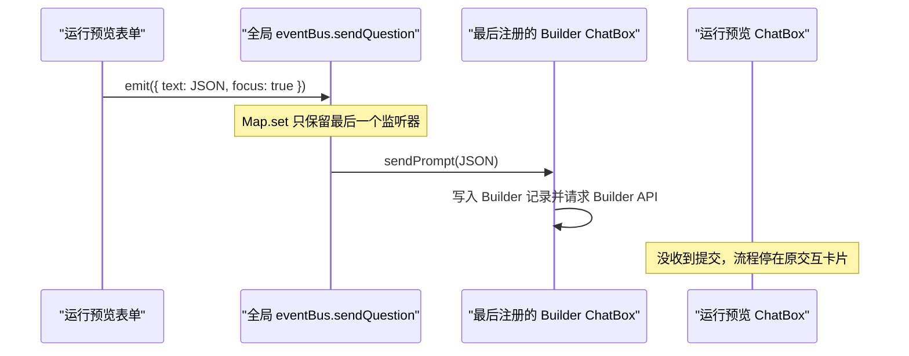
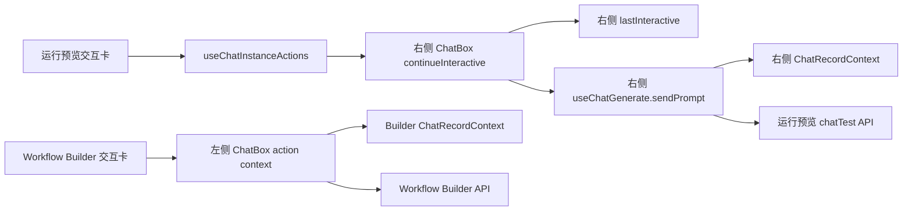

# ChatBox 实例隔离需求设计文档

## 0. 文档标识

- 任务前缀：`chatbox-instance-isolation`
- 文档文件名：`chatbox-instance-isolation-需求设计文档.md`
- 关联现象：同一应用详情页同时打开左侧 Workflow Builder 和右侧运行预览时，运行预览的交互答案被发送到 Workflow Builder。
- 设计结论：聊天记录本身已经按 Provider 和会话目标隔离；串线发生在前端全局动作分发层。

## 1. 需求背景与目标

### 1.1 背景

当前应用详情页允许同时存在两个 `ChatBox`：

1. 左侧 Workflow Builder：`sourceType=workflowBuilder`，使用独立 Builder `chatId`。
2. 右侧运行预览：`sourceType=app`，使用测试会话 `chatId`。

两边的 `ChatItemContextProvider`、`ChatRecordContextProvider`、生成控制器和后端会话目标原本是独立的。但是，历史交互卡片、快捷问题和编辑问题仍通过模块级全局 `eventBus` 发送 `sendQuestion/editQuestion`。`eventBus` 对每种事件只保存一个函数，两个 `ChatBox` 会争夺同一个监听槽。

已确认的错误链路：



### 1.2 目标

#### 业务目标

- Workflow Builder 与运行预览可以同时打开、同时聊天、同时生成，互不抢占消息和状态。
- 用户在任意一侧执行表单提交、选项选择、Ask 回答、快捷问题、编辑问题、继续运行时，只影响操作发生的那一个聊天框。
- 关闭、刷新或重新挂载任意一侧，不得删除或覆盖另一侧的动作监听。

#### 技术目标

- 将 ChatBox 内部动作从“全局广播”改为“实例内调用”。
- 使用 `sourceKey + chatId` 作为完整实例身份，覆盖动作、草稿和外部消息桥接。
- 保留真正的外部消息入口，但多实例时必须精确寻址；禁止在目标不明确时猜测接收者。
- 不复制 Workflow Builder 专用 ChatBox，不引入两套聊天实现。

#### 成功指标

1. 两个 ChatBox 同时挂载时，所有内部发送动作 100% 只进入来源实例。
2. 任一实例卸载、重渲染或恢复生成，不影响另一实例继续发送。
3. 两边同时流式生成、停止和恢复时，记录、状态、控制器和 UI 无交叉写入。
4. 单 ChatBox 页面现有交互行为保持不变。
5. 新增纯逻辑和路由模块达到 100% 行/分支覆盖；受影响组件关键分支不低于 90%。

## 2. 项目事实基线

### 2.1 项目画像

| 项目项 | 事实 |
|---|---|
| 主应用 | `projects/app`，Next.js + React + TypeScript + Chakra UI |
| 前端状态 | React Context、`use-context-selector`、Zustand、React Hook Form |
| 聊天记录 | `ChatRecordContextProvider` 按请求参数维护实例内记录 |
| 聊天运行时 | `WorkflowRuntimeContextProvider` 提供 `sourceTarget/sourceKey/chatId` |
| 测试 | Vitest，项目命令 `pnpm --dir projects/app test` |
| 质量检查 | ESLint、Prettier、TypeScript `tsc --noEmit` |
| 设计文档 | `.agents/design/`；现有 ChatBox 重构设计位于 `.agents/design/core/chat/chatbox-refactor.md` |

### 2.2 现有能力与隔离状态

| 能力项 | 代码锚点 | 当前状态 | 结论 |
|---|---|---|---|
| Builder 会话身份 | `WorkflowBuilder/ChatPanel.tsx`：`sourceTarget`、`sourceChatIdMap` | 使用 `workflowBuilder:${appId}` 与独立 `chatId` | 已隔离，复用 |
| 运行预览身份 | `WorkflowComponents/Flow/ChatTest.tsx`、`useChatTest.tsx` | 使用 `sourceType=app` 与测试 `chatId` | 已隔离，复用 |
| ChatItem 状态 | `web/core/chat/context/chatItemContext.tsx`：`ChatItemContextProvider` | 两侧分别创建 Provider | 已隔离，复用 |
| ChatRecord 状态 | `web/core/chat/context/chatRecordContext.tsx` | 两侧分别创建 Provider，Builder 额外传入 `sourceType=workflowBuilder` | 已隔离，复用 |
| 生成与恢复 | `ChatBox/hooks/useChatGenerate.ts`、`useChatResume.ts` | 控制器、active target ref 和记录 setter 均在实例内 | 已隔离，保留 |
| 运行时身份 | `ChatContainer/context/workflowRuntimeContext.tsx` | 已提供 `sourceKey` 与 `chatId` | 可直接作为实例身份 |
| 发送/编辑动作 | `web/common/utils/eventbus.ts`、`ChatBox/index.tsx` | 全局单监听槽，后注册覆盖先注册 | 必须修改 |
| 交互卡提交 | `AIResponseBox/utils.ts`：`onSendPrompt` | 无目标信息，`focus=true` 可绕过普通可发送条件 | 必须修改 |
| 外部消息 | `ChatBox/index.tsx`：`window.addEventListener('message')` | 每个实例都监听同一无目标消息 | 必须修改 |
| 输入草稿 | `ChatBox/hooks/useChatInputForm.ts` | 仅使用 `chatInput_${chatId}` | 应升级为 `sourceKey + chatId` |
| DOM 标识 | `ChatRecordsList.tsx` 的 `#history`、`AppChatMain.tsx` 的 `#variable-input` | 页面会出现重复 ID；变量查询已限定容器，导出仍使用全局查找 | 本期处理与实例动作相关的风险；导出作用域作为关联修复 |

### 2.3 根因

根因不是后端会话、数据库记录或 React Provider 混用，而是全局动作通道不支持多实例：

1. `eventBus.list` 是 `Map<EventNameEnum, Function>`。
2. `on(name, fn)` 使用 `Map.set`，相同事件的新监听器覆盖旧监听器。
3. `ChatBox` effect 会随 `lastInteractive/canSendPrompt` 变化反复注册。
4. `off(name)` 按事件名整体删除，任一实例 cleanup 都可能删除另一实例刚注册的处理器。
5. `onSendPrompt` 不携带实例身份，且 `focus=true` 让错误接收者仍可发送。

因此接收方取决于 React effect 最近一次执行顺序，属于生命周期竞争，而不是稳定业务规则。

## 3. 需求澄清记录

| 维度 | 已确认内容 | 设计决策 | 待确认内容 |
|---|---|---|---|
| 业务目标 | 两个聊天框与内容完全隔离，可同时操作 | 按通用 ChatBox 多实例能力设计，不做 Builder 特例 | 无 |
| 范围边界 | 当前直接场景是 Builder + 运行预览 | 内部所有发送入口一并实例化，避免下一类按钮继续串线 | 无 |
| 数据模型 | 两边应保留各自记录与 `chatId` | 不改数据库和后端接口 | 无 |
| 前端交互 | 一侧提交时另一侧不动 | 操作只进入来源实例；目标不明确时拒绝分发 | 无 |
| 兼容策略 | 单聊天框页面不能回归 | 单实例外部旧消息可兼容；多实例旧消息禁止猜目标 | 无 |
| UI | 用户未要求视觉变化 | 不改 Figma 样式和布局 | 无 |

### 3.1 影响域判定

| 维度 | 是否命中 | 证据 | 核对规范 | 结论 |
|---|---|---|---|---|
| API | No | 后端会话目标已经通过 `sourceTarget/chatId` 区分 | 项目 API 规范 | Not Applicable，不新增或修改接口 |
| Data | No | 不新增数据库字段，记录 Provider 已按目标查询 | 项目数据规范 | Not Applicable |
| Frontend | Yes | 全局动作总线、ChatBox 生命周期和草稿键需要修改 | 项目前端规范 | 采用实例动作上下文 |
| Logging | Yes | 多实例收到无目标外部消息时需要可诊断 | 项目日志规范 | 仅开发环境警告，不记录消息正文 |
| Packaging | No | 不新增第三方依赖，不跨 workspace 调整依赖 | 项目模块规范 | Not Applicable |
| Testing | Yes | 需要证明多实例动作、卸载和恢复隔离 | `testing-standards.md` | 单元 + 组件集成测试 |
| DocI18n | No | 无新增用户文案 | 项目文档 i18n 规范 | Not Applicable |

## 4. 范围定义

### 4.1 In Scope

- ChatBox 内部发送、交互继续、快捷问题和编辑输入的实例化动作接口。
- 以下现有全局入口迁移到实例动作：
  - `RenderUserFormInteractive`
  - `RenderUserSelectInteractive`
  - `RenderWorkflowBuilderPreviewInteractive`
  - `RenderPaymentPauseInteractive`
  - AI 回复后的问题建议
  - 欢迎页快捷问题
  - Markdown 空链接快捷问题
  - Question Guide 的发送与编辑
- `window.postMessage({ type: 'sendPrompt' })` 的目标化和歧义处理。
- 监听器精确注册/解绑，消除 effect 顺序依赖。
- 草稿 key 升级为完整实例 key。
- 与多实例直接相关的 DOM 查询限定到当前 ChatBox 根节点。
- 两实例并存、卸载、并发生成和刷新恢复测试。

### 4.2 Out of Scope

- Workflow Builder 或运行预览 UI 样式调整。
- 后端 Chat API、数据库 Schema、S3、Sandbox 隔离策略调整。
- 重写 `useChatGenerate/useChatResume`。
- 把所有全局 `eventBus` 能力整体替换；`refreshFeedback` 等非 ChatBox 动作保留现状。
- 多浏览器 Tab 的会话协作能力。

## 5. 方案对比

| 方案 | 核心思路 | 优点 | 风险 | 成本 | 结论 |
|---|---|---|---|---|---|
| A. 实例动作上下文 + 目标化外部桥接 | ChatBox 创建本地 action context，内部组件直接调用所属实例；外部消息通过 `sourceKey + chatId` 注册表寻址 | 不广播、类型清晰、组件天然拿到所属实例、支持任意数量 ChatBox | 需要迁移所有内部 emit 点 | 中 | 推荐 |
| B. 多监听器事件总线 + payload 目标字段 | `eventBus` 改成 handler Set，每个 ChatBox 过滤目标 | 改动模型接近现状 | 任一漏传 target 就广播或丢失；业务继续依赖全局基础设施；cleanup 和兼容复杂 | 中 | 不推荐 |
| C. Builder 使用独立事件名或复制 ChatBox | 新增 `sendWorkflowBuilderQuestion`，或维护 Builder 专用 ChatBox | 表面改动快 | 只覆盖当前两边；第三个 ChatBox 再次冲突；两套实现持续漂移 | 低起步、高维护 | 拒绝 |
| D. 打开运行预览时卸载/冻结 Builder | 保证页面只有一个监听器 | 实现简单 | 违背“两个聊天框同时独立运行”的目标，会中断 Builder | 低 | 拒绝 |

推荐方案 A。核心判断是：组件已经位于某个 ChatBox 的 React 子树内，所属实例是确定的，因此内部动作不应先逃逸到全局通道再猜接收者。

## 6. 推荐方案详细设计

### 6.1 实例身份

统一使用：

```ts
type ChatInstanceIdentity = {
  sourceKey: string;
  chatId: string;
};

const instanceKey = `${sourceKey}:${chatId}`;
```

`sourceKey` 已由 `getChatSourceKey(sourceTarget)` 生成：

- Builder：`workflowBuilder:<appId>`
- 运行预览：`app:<appId>`

即使极端情况下两边 `chatId` 相同，完整实例 key 仍不同。

### 6.2 ChatBox 实例动作上下文

新增 ChatBox 内部 action context，建议职责如下：

```ts
type ChatInstanceActions = {
  identity: ChatInstanceIdentity;
  sendMessage: (input: ChatBoxInputType) => void;
  continueInteractive: (input: ChatBoxInputType) => void;
  fillInput: (input: ChatBoxInputType) => void;
};
```

动作语义必须分开：

- `sendMessage`：普通用户发送，经过 `disabledSendTip` 和普通发送限制。
- `continueInteractive`：提交当前交互，绑定当前实例的 `lastInteractive`，不能依赖旧的 `focus=true` 绕行语义。
- `fillInput`：只修改所属实例的输入框。

Provider 放在 `ChatBox` 内部，在 `sendPrompt/lastInteractive/resetInputVal` 已创建后包裹消息区和输入区。内部组件使用 hook 取得 action，不再 import 全局 `eventBus`。

### 6.3 内部调用链

目标调用链：



两条链路不存在共享可写节点。

### 6.4 外部消息桥接

仓库内没有 `window.postMessage({ type: 'sendPrompt' })` 的发送方，但该入口可能供嵌入场景使用，不能让每个 ChatBox 无条件监听。

新增目标化注册表：

```ts
type ExternalChatPrompt = {
  type: 'sendPrompt';
  text: string;
  target?: ChatInstanceIdentity;
};

registerChatInstance(identity, handler): () => void;
dispatchExternalPrompt(payload): 'sent' | 'not-found' | 'ambiguous';
```

路由规则：

1. 有 `target`：只发送到完全匹配的实例。
2. 无 `target` 且当前只注册一个可用 ChatBox：兼容旧行为。
3. 无 `target` 且存在两个及以上 ChatBox：拒绝发送，不广播、不猜测；开发环境输出不含消息正文的 warning。
4. cleanup 使用注册函数返回的精确注销函数，只注销当前实例。

### 6.5 草稿隔离

现有 `chatInput_${chatId}` 改为：

```ts
const draftKey = `chatInput_${sourceKey}:${chatId}`;
```

兼容策略：

1. 优先读取新 key。
2. 新 key 不存在时，只在单实例/明确目标初始化阶段读取旧 key 一次并迁移。
3. 后续写入和删除只操作新 key。

### 6.6 DOM 查询隔离

- `useVariableInputVisibility` 已从当前滚动容器查询 `#variable-input`，逻辑上已限定作用域，可改为 `data-chat-variable-input` 避免重复 ID。
- `useChatBox.onExportChat` 当前使用全局 `document.getElementById('history')`，应由当前 ChatBox root/history ref 驱动，避免以后同页提供导出按钮时导出另一实例。

### 6.7 API 与数据

- API：Not Applicable，无路由或契约变更。
- Data：Not Applicable，无数据库字段、索引或迁移。
- 后端现有 `sourceType + sourceId + chatId` 隔离继续使用。

### 6.8 日志与隐私

多实例收到无目标外部消息时，仅在开发环境记录：

```ts
console.warn('[ChatBox] Ignored ambiguous external prompt', {
  registeredInstanceCount
});
```

禁止记录 `text`、文件、用户输入或完整 identity。

## 7. 风险、迁移与回滚

### 7.1 风险

1. 漏迁某个 `eventBus.emit(sendQuestion/editQuestion)`，导致该入口继续依赖旧全局通道。
2. 交互提交错误地走 `sendMessage` 而不是 `continueInteractive`，导致丢失 `lastInteractive`。
3. 直接把 eventBus 改成多订阅者但未做 target，会把一次消息同时发送到两边。
4. 旧外部 `postMessage` 在多实例页面没有 target 时会被拒绝；这是有意的安全行为，需要开发 warning 辅助发现调用方。
5. 隐藏但仍挂载的运行预览不能算作可接收外部消息实例；注册条件必须绑定 `isReady/active`。

### 7.2 迁移策略

1. 先建立实例 action context 与纯逻辑测试。
2. 迁移交互卡入口，优先修复当前串线主路径。
3. 迁移快捷问题和编辑问题入口，删除 ChatBox 对内部 send/edit event 的监听。
4. 上线目标化外部桥接并兼容单实例旧消息。
5. 升级草稿 key 和 DOM ref。
6. 最后通过 `rg` 保证聊天内部不再存在 `EventNameEnum.sendQuestion/editQuestion`。

### 7.3 回滚策略

- 代码不涉及持久数据，可按提交反向回滚。
- 草稿新 key 回滚后旧代码不会读取，但只影响未发送草稿，不影响历史记录；迁移期可短期双读避免风险。
- 回滚触发条件：单实例聊天的表单、快捷问题或编辑入口出现阻断，或外部嵌入场景无法指定目标。

## 8. 验收标准

| 验收项 | 验收方式 | 通过标准 |
|---|---|---|
| 右侧表单提交 | 同时打开 Builder 和运行预览，在右侧填写并提交 | 只有右侧新增记录并继续流程，左侧完全不变 |
| 左侧 Ask/预览操作 | 两边同时打开，在左侧选择或输入 | 只有 Builder 继续，右侧完全不变 |
| 快捷问题 | 两边分别点击欢迎问题/问题建议 | 点击来源实例独立发送 |
| 编辑问题 | 两边分别点击编辑入口 | 只填充来源实例输入框 |
| 并发生成 | 两边分别发起生成 | 可同时流式更新，停止任一边不停止另一边 |
| 生命周期 | 关闭/重开右侧、关闭/重开左侧 | 剩余实例动作持续有效，无监听丢失 |
| 刷新恢复 | 两边有独立运行状态时刷新 | 两边按自己的 `sourceKey/chatId` 恢复 |
| 外部目标消息 | 向指定 identity 发 `postMessage` | 只有指定实例接收 |
| 外部歧义消息 | 多实例时发送无 target 消息 | 两边都不发送，开发环境产生脱敏 warning |
| 草稿 | 两边输入不同未发送文本后刷新 | 分别恢复，不互换 |
| 单实例回归 | 普通聊天页执行原有动作 | 行为与改造前一致 |

## 9. MECE 核查结论

### 9.1 相互独立

- 记录隔离由 `ChatRecordContextProvider` 负责。
- 运行时身份由 `WorkflowRuntimeContextProvider` 负责。
- 输入和动作隔离由新的 ChatBox action context 负责。
- 外部跨树触发由目标化 registry 负责。
- 每一层职责唯一，不让 registry 介入内部 React 子树通信。

### 9.2 完全穷尽

- 正常路径：普通发送、交互继续、快捷回复、编辑、外部目标发送。
- 生命周期：挂载、重渲染、隐藏、卸载、刷新恢复。
- 异常路径：目标不存在、多目标歧义、交互过期、生成中停止。
- 兼容路径：单实例无 target 外部消息、旧草稿迁移。

### 9.3 修订动作

`[问题]` 仅修复运行预览表单入口会遗漏其他全局 emit 点。  
`影响:` 下一次点击问题建议或编辑问题仍可能串线。  
`修订动作:` 将所有 ChatBox 内部 send/edit emit 统一迁移到实例 action context。  
`修订后结果:` 内部动作链路完全脱离全局分发。

`[问题]` 只把 eventBus 改成多监听器会把无目标消息广播到两个 ChatBox。  
`影响:` 串线升级为双发，产生两份真实会话记录。  
`修订动作:` 内部使用实例回调；外部桥接必须目标化并拒绝歧义。  
`修订后结果:` 单次操作最多命中一个明确实例。

`[问题]` 草稿只按 `chatId` 分区，未表达完整会话来源。  
`影响:` 极端 ID 碰撞或未来复用会恢复错误草稿。  
`修订动作:` 草稿 key 使用 `sourceKey + chatId`。  
`修订后结果:` 输入持久化与运行时身份口径一致。

