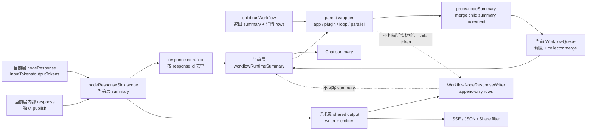

# 工作流 Summary 与 NodeResponse 设计

日期：2026-09-17
状态：当前权威文档

本文合并并替代以下两份分散文档：

- `workflow-node-summary-token-statistics.md`
- `workflow/node-response-append-only-interactive-id.md`

后续涉及 workflow 运行摘要、LLM token 归属、nodeResponse 持久化、实时发布、读取合并和交互
恢复时，以本文为准。

## 1. 设计范围

一次 `runWorkflow` 调用代表一个 workflow 运行层。根 workflow、子应用、插件 workflow、
loop、parallel、Agent tool 和 ToolCall workflow tool 都会创建自己的运行层。

本文区分四种东西：

1. `nodeResponse`：节点详情，负责展示、调试和持久化，也是普通节点 LLM token 的来源。
2. `NodeSummary`：当前 callback 向父 queue 提交的稀疏增量，不是第二份运行总账。
3. `workflowRuntimeSummary`：当前 `runWorkflow` 层的完整运行总账，child 运行结束时返回同名字段。
4. `WorkflowNodeResponseSink`/`WorkflowNodeResponseWriter`：详情写入和 SSE 发布链路，不拥有第二份
   summary。

核心目标是同时满足：

- 当前 workflow 层 publish 的 `nodeResponse` 由该层 response extractor 统计 token；
- 成功和失败 `nodeResponse` 使用相同的 summary、持久化和 SSE 发布链路；
- child workflow 的详情可以单独 publish，但 parent 只在 child 完成时通过 child summary 贡献 token；
- 没有任何 `nodeResponse` 表示的内部模型调用通过 `mergeNodeSummary` 贡献 token；
- 同一模型调用只有一个归属入口；
- child summary 的 token 在 parent 只贡献一次，控制字段按需单独消费；
- nodeResponse 运行期 append-only，读取时再按展示 identity 合并；
- writer 失败不回灌或补写 workflow runtime summary；
- `Chat.summary` 只累计统一 summary 中的 LLM token。

## 2. 一组不可破坏的规则

### 2.1 Token 只有一个归属入口

```text
response 属于当前 workflow 层，并通过当前层 scope publish
  -> 当前层 response extractor 读取 token

response 属于 child workflow，并通过 child scope 直接写入请求级 output
  -> parent 使用 child workflow summary 调用一次 mergeNodeSummary(...)

没有 nodeResponse 的内部模型调用
  -> 当前 callback 调用 props.nodeSummary.mergeNodeSummary(...)
```

同一次 LLM 调用不能同时出现在：

- 当前层 response extractor 统计的 `nodeResponse.inputTokens/outputTokens`；
- 当前 callback 的 `mergeNodeSummary` token 增量；
- parent wrapper 对同一 response 的 `childrenResponses`、`toolDetail`、`loopDetail` 或
  `parallelRunDetail` 递归统计。

### 2.2 每个 workflow 层只有一份完整 summary

每次 `runWorkflow` 创建一份独立的 `workflowRuntimeSummary`，当前层的 queue 和 sink scope 共享
这一份对象。child workflow 也创建自己的 summary，并在结束时通过 `DispatchFlowResponse` 返回。

queue 不解析 `nodeResponse`。所有当前层 response 都必须经过当前 sink scope，由 scope 更新这份
共享 summary；queue 只合并本次 callback 的 `NodeSummaryCollector` 增量。

`nodeSummary` 只是 callback 的稀疏增量视图，不能被当作另一份 workflow 总账，也不能让 writer
再维护一份同口径 summary。

### 2.3 Child 只向 parent 贡献一次

child 每次完成一次工具、一次 iteration 或一次并行 task 后返回自己的
`workflowRuntimeSummary`。parent wrapper 必须选择一种方式消费 token：

- 调用一次 `mergeNodeSummary`，把允许向上传递的 child token、积分、引用和控制字段合并到 parent；
- 工具错误等不能向上提升的字段必须在合并前过滤。

同一个 child summary 的 token 不能先通过 parent response extractor 统计，再调用
`mergeNodeSummary`；同一组 token 也不能拆成多条摘要增量重复合并。

### 2.4 Summary 和详情是两条不同的生命周期

- summary 在运行中更新，供调度、错误处理、计费和 Chat 汇总使用；
- nodeResponse 在运行中追加，供详情展示、SSE 和调试使用；
- 读取历史时只 fold nodeResponse rows，不重新从详情树递归推导 Chat token；
- writer 只负责详情，不是 summary 的来源。

## 3. 数据对象

### 3.1 `nodeResponse`

`nodeResponse` 是单个节点的详情对象。关键身份字段：

```ts
type NodeResponseIdentity = {
  id: string;
  parentId?: string;
};
```

- `id` 是展示节点实例 ID，不是数据库唯一键；
- `parentId` 只表示详情树上的父子关系，用于读取时重建 `childrenResponses`，不表示 summary 层级；
- `inputTokens/outputTokens` 表示当前 response 自己拥有的 LLM token；
- `childrenResponses`、`toolDetail`、`loopDetail` 等是详情结构。子响应可以作为独立 row
  publish，并通过 `parentId` 在读取时还原；详情结构本身不是 parent summary 的通用 token 入口；
- `quoteList`、`pluginOutput`、错误文本、运行时间、积分等属于详情或运行控制数据。

普通节点每次完成时生成一个 `id`。交互恢复和 append-only 增量可能复用同一个 `(id, parentId)`，
读取时再合并成一个展示节点。

### 3.2 `WorkflowRuntimeSummaryType`

当前代码将字段定义放在 `packages/service/core/workflow/types/summary.ts`，完整 workflow 类型
在 `packages/service/core/workflow/dispatch/type.ts` 中复用：

```ts
type WorkflowRuntimeSummaryFields = {
  responseIds: string[];
  finishedNodeIds: string[];
  hasError: boolean;
  errorText?: string;
  errorCount: number;
  hasLoopRunBreak: boolean;
  hasToolStop: boolean;
  hasNestedEnd: boolean;
  nestedEndOutput?: any;
  pluginOutput?: Record<string, any>;
  citeCollectionIds: string[];
  totalPoints?: number;
  childResponseCount?: number;
  llmInputTokens: number;
  llmOutputTokens: number;
};

type WorkflowRuntimeSummaryType = WorkflowRuntimeSummaryFields;
```

它表示当前 `runWorkflow` 层已经累计完成的运行结果：

- `responseIds`、`finishedNodeIds`：当前层已处理的 response 和节点；
- `hasError`、`errorText`、`errorCount`：非工具执行错误的控制信号；工具错误仅保留在 nodeResponse；
- `hasLoopRunBreak`、`hasToolStop`、`hasNestedEnd`、`nestedEndOutput`：父 wrapper 的调度信号；
- `pluginOutput`、`citeCollectionIds`、`totalPoints`、`childResponseCount`：当前层业务汇总；其中
  nodeResponse 的 `totalPoints` 只记录自身消耗，child points 通过 `NodeSummary` 向上归属；
- `llmInputTokens`、`llmOutputTokens`：当前层唯一的 LLM token 总账。

所有 summary 初始化 token 为 `0`，不能用“字段是否存在”判断节点类型。embedding、rerank 等
历史混合用量不进入这两个字段。

### 3.3 `NodeSummary` 与 `NodeSummaryCollector`

`NodeSummary` 是同一组字段的稀疏 callback 视图，当前实现为：

```ts
type NodeSummary = Partial<WorkflowRuntimeSummaryFields>;

type NodeSummaryCollector = Omit<NodeSummary, 'llmInputTokens' | 'llmOutputTokens'> & {
  llmInputTokens: number;
  llmOutputTokens: number;
  mergeNodeSummary: (summary?: NodeSummary) => void;
};
```

这样只有一处字段声明，同时保留两个边界的语义：

- 完整 `workflowRuntimeSummary` 必须有当前层的初始值；
- `NodeSummary` 只传递本次 callback 实际贡献的非空字段；
- `NodeSummaryCollector` 是可变采集器，不能直接作为 dispatch response 返回；
- `getNodeSummaryData` 会复制数组并去重引用，去掉 collector 方法；
- `runtimeSummaryToNodeSummary` 会把 child 完整 summary 转成独立的稀疏对象，避免引用 child
  的可变对象。
- agent-loop core 不再创建独立的 token summary；当前层 response token 由 response extractor
  统计，child workflow token 由 wrapper 在 child 完成时通过 `NodeSummaryCollector` 转移。

### 3.4 Response scope、请求级 output 与 `WorkflowNodeResponseWriter`

`createWorkflowNodeResponseScope` 为每次 `runWorkflow` 创建独立 scope，负责：

- 用 `response.parentId ?? input.parentId ?? scope.defaultParentId` 规范化父级；
- 对当前 sink scope 的 response 更新对应的 `workflowRuntimeSummary`。

底层请求级 `WorkflowNodeResponseSink` 是所有 scope 共享的 output，负责把完整 response 交给 writer，
并按 API 版本和可见性过滤后发送 SSE；它不拥有任何 workflow summary。child scope 直接调用这个
共享 output，不经过 parent scope 转发，因此 parent summary 不会重复统计 child response。

`WorkflowNodeResponseWriter` 只负责：

- append-only 的 Mongo rows；
- 批量 flush、重试和 slim fallback；
- 请求内可选的 flat response 缓存。

writer 不维护 usage、错误数、child count、控制信号或 LLM token，也不从数据库回读 summary。

子 workflow 复用同一个请求级 output，但每次 `runWorkflow` 必须创建独立 summary scope。child
response 只更新 child summary，再直接写入共享 output；parent scope 不会看到这批 response。
child 完成后，工具 parent 在当前 tool 完成边界调用一次 `pushLLMTokens`。

scope 还持有两类只影响输出、不影响 summary 的上下文：

- `defaultParentId`：保证 child workflow 内未显式设置父级的 Agent 等 response 仍挂到外层工具；
- `record/emit`：分别控制 writer 和 SSE，child 只能与 parent 策略做 AND，不能重新开启已经关闭的
  输出。系统级 workflow tool 使用该策略隐藏所有后代详情，但 child summary 仍正常计算。

每次节点 callback 还会绑定独立 `WorkflowNodeResponseActivity`。callback 直接 publish 的 response
以及它启动的 child workflow 都继承这个 activity，用来判断当前父 response 是否应抑制重复 SSE。
兄弟并发节点不共享 activity，因此其他节点的 publish 不会误判为当前节点的 child response。

### 3.5 `Chat.summary`

`Chat.summary` 是跨 workflow 轮次的累计对象：

```ts
type ChatSummary = {
  llmInputTokens: number;
  llmOutputTokens: number;
};
```

每轮保存只使用当前根 workflow 的 `workflowRuntimeSummary` 两个 LLM token 字段，通过 `$inc`
累计。不能把 `inputTokens/outputTokens` 中可能包含的 embedding/rerank 用量直接回填。

## 4. 一次运行的完整链路



实际时序如下：

1. `runWorkflow` 创建当前层 `workflowRuntimeSummary`。
2. `runWorkflow` 基于该对象创建当前层 `nodeResponseSink` scope，并把 queue 和 scope 指向同一
   summary。
3. `WorkflowQueue` 为每个节点创建独立的 `NodeSummaryCollector`，通过 `ModuleDispatchProps` 传给
   callback。
4. callback 返回当前节点的 `nodeResponse`、控制结果或显式 `nodeSummary` 增量；同层内部 response
   可以在 callback 执行期间直接 publish。
5. callback 返回的 response 和执行期间主动 publish 的 response 都交给当前层 sink scope；scope
   对完整 response 执行一次 `summarizeRuntimeNodeResponses`，成功和失败 response 行为一致。
6. queue 不解析 response，也不调用 response extractor；它只把本次 callback 的
   `NodeSummaryCollector` 增量合并到当前层 summary。
7. child workflow 的 response 由 child scope 统计后直接写入共享 output，不经过 parent scope；
   child 每次完成后 parent 只把筛选后的 child summary 合并一次。
8. 请求级 output 把 response 交给 writer，并根据 `responseAllData`、`responseDetail`、API 版本和 Share
   权限决定是否发布。
9. 当前层结束时，`runWorkflow` 返回该层完整 `workflowRuntimeSummary`；工具 parent 不等待整个
    Agent loop 才处理 child token，而是在每个 child tool 完成时处理一次。
10. 根入口用返回的 summary 更新 `Chat.summary`，不从 writer 或读取后的详情树重新计算。

## 5. Summary 更新细节

### 5.1 Response extractor

`packages/service/core/workflow/dispatch/utils/summary.ts` 中的
`summarizeRuntimeNodeResponses` 同时更新控制字段、数量、引用和 response-owned token。

单个 response 的处理规则：

1. 以 `response.id` 作为当前统计链路的去重 identity；没有 id 的异常 response 只做本次控制处理，
   不承诺跨批次 token 去重。
2. 读取 response 自身 `inputTokens/outputTokens`。
3. `toolCall` 只读取白名单 `toolCallInputTokens/toolCallOutputTokens`，不扫描 `toolDetail`。
4. `datasetSearchNode` 只读取已知的内嵌 LLM 结构，例如 query extension、image caption、deep
   search；embedding 和 rerank 不进入 LLM token。
5. `childrenResponses` 可以用于历史详情的错误、引用、积分和数量兼容处理，但 parent 不从
   `childrenResponses`、`toolDetail` 或其他详情字段通用递归读取 child workflow token；独立 child
   row 的 token 归属由 child scope 和 parent 的 child summary transfer 决定。
6. `error`/`errorText`、`loopRunBreak`、`toolStop`、`nestedEnd`、`pluginOutput`、引用和 response
   数量与 token 一起更新。

当前 response 的控制字段和 token 可能在不同 identity 集合中去重：父 response 先到、child row
 后到，或 child row 先到、父 response 后到时，同一调用仍只能贡献一次 token。

### 5.2 Callback 增量合并

节点完成后，queue 把 collector 中的增量合并到当前层：

```ts
workflowRuntimeSummary = mergeWorkflowRuntimeSummary({
  currentSummary: workflowRuntimeSummary,
  nodeSummary: getNodeSummaryData(nodeSummary)
});
```

`mergeNodeSummary`/`mergeWorkflowRuntimeSummary` 对数组去重、布尔值做 OR、错误数量和 token 做
加法、输出值使用最近一次非空值。一个 collector 只属于一个节点执行单元，不能跨节点复用。

### 5.3 Child workflow token transfer

child workflow 自己完成 response extractor 和 callback merge，每次工具执行完成时返回：

```ts
const childResult = await runWorkflow(childProps);
const childSummary = childResult.workflowRuntimeSummary;
```

child response 已经由 child scope 直接发布到共享 output。parent 不重新发布详情，只把允许向上
传递的 child summary 字段贡献一次：

```ts
props.nodeSummary.mergeNodeSummary({
  llmInputTokens: childSummary.llmInputTokens,
  llmOutputTokens: childSummary.llmOutputTokens,
  totalPoints,
  citeCollectionIds: childSummary.citeCollectionIds
});
```

`parentId` 只用于读取时还原详情树，不会把 child token 自动计入 parent。
如果 parent 还需要 `hasError`、`nestedEndOutput`、`pluginOutput` 等控制字段，应在同一次 merge
中按边界显式选择；不能为了传递控制字段而再次合并同一组 token。

### 5.4 Sink scope 与 queue 的关系

每个 `runWorkflow` scope 都拥有自己的 summary：

```ts
const workflowRuntimeSummary = createWorkflowRuntimeSummary();
const nodeResponseSink = createWorkflowNodeResponseScope({
  sink: parentSink,
  workflowRuntimeSummary,
  defaultParentId: nodeResponseParentId
});
```

scope 只统计自己收到的同层 response，并直接调用共享 output。child scope 从 parent scope 取得同一个
output，但不会以 parent scope 为下游，所以 parent summary 不会重复统计 child response。共享 writer
不等于共享 summary，`parentId` 也不等于 child summary 层级。

queue 为当前 callback 创建独立 activity view：

```ts
const activity = createWorkflowNodeResponseActivity();
dispatchData.nodeResponseSink = bindWorkflowNodeResponseActivity({
  sink: nodeResponseSink,
  activity
});
```

callback 和它启动的 child workflow 发布完成后，queue 只读取该 activity 的发布数。这个计数只解决
父 response 的 SSE 去重，不参与 summary 统计，也不能做成请求级全局计数。

## 6. Token 归属矩阵

### 6.1 普通 response-owned 节点

| 节点 | 入口 | 约束 |
| --- | --- | --- |
| `chatNode` | `nodeResponse.inputTokens/outputTokens` | 同一 usage 不再 push |
| `classifyQuestion` | `nodeResponse.inputTokens/outputTokens` | 只统计当前 response |
| `contentExtract` | `nodeResponse.inputTokens/outputTokens` | 只统计当前 response |
| `queryExtension`（弃用） | `nodeResponse.inputTokens/outputTokens` | 保留兼容，排除 embedding/rerank |
| `datasetSearchNode` | response 自身及白名单内嵌 LLM 字段 | 不通用递归 child token |

### 6.2 Child workflow wrapper

| 节点 | 入口 | 说明 |
| --- | --- | --- |
| `appModule` | 每次 child 完成时合并一次筛选后的 child summary | 控制字段按 app wrapper 规则选择 |
| `pluginModule` | 每次 child 完成时合并一次筛选后的 child summary | 控制字段按 plugin wrapper 规则选择 |
| `runApp`（弃用） | 每次 child 完成时合并一次 | 兼容旧子应用 |
| `loop`（弃用） | 每轮 child 完成时合并一次 | 每轮只贡献本轮增量 |
| `loopRun` | 每次 iteration 完成时合并一次 | resume 不重复历史轮次 |
| `parallelRun` | 每个 task/attempt 完成时合并一次 | retry 的实际消耗都计入 |
| `tool` | 默认无 token；执行 child workflow 时在工具完成边界合并一次 | 系统工具可隐藏内部统计 |

### 6.3 Mixed 节点

Agent 和 ToolCall 的详情响应都属于各自当前 workflow 层；`parentId` 只用于还原展示树：

```text
Agent 当前层
├── Agent 主模型 response
├── 工具 response
│   └── 工具响应压缩 response
└── 上下文压缩 response

ToolCall 当前层
├── ToolCall 主模型 response
├── 工具 response
│   └── 工具响应压缩 response
└── 上下文压缩 response
```

上图是读取后的展示树；运行期这些 response 可以作为独立 row 逐条 publish，并通过
`parentId` 建立关系，不要求把 child 重新嵌入顶层 response payload。

这些当前层 response 使用当前 sink publish，并由当前层 response extractor 统计。工具实际执
行的 child workflow 仍有自己的 summary scope；它的详情可以通过 `parentId` 挂到工具下面，
但 token 在 child 完成时通过 child summary 向 parent transfer。

| 节点 | 自身调用 | child/内部调用 |
| --- | --- | --- |
| `agent` | 主模型、工具、上下文压缩和工具响应压缩 response 在当前层 publish，由 extractor 读取；Agent 不额外制造一个根 response，内部行保持当前层顶级 | 工具执行的 child workflow 在每个工具完成时返回 summary，parent 过滤错误字段后合并一次 |
| `toolCall` | ToolCall 主模型、上下文压缩和工具响应压缩 response 在当前层 publish，由 extractor 读取 | workflow tool child response 作为详情 publish，child 完成时由 ToolCall parent 过滤错误字段后合并一次 |

如果某个内部调用已经作为当前层 response 通过当前 scope publish，必须删除对应的
collector token 增量；如果它属于独立 child workflow，则保留 child summary -> parent
token transfer，不能再从 parent 详情递归提取。

### 6.4 无 LLM token 的节点

以下节点成功运行时 runtime token 应保持 `0/0`：

`workflowStart`、`answerNode`、`datasetConcatNode`、`httpRequest468`、`ifElseNode`、
`variableUpdate`、`code`、`textEditor`、`customFeedback`、`readFiles`、`userSelect`、
`formInput`、`stopTool`、`toolParams`、`loopRunStart`、`loopRunBreak`、`nestedStart`、
`nestedEnd`、`emptyNode`、`globalVariable`、`comment`、`toolSet`、`pluginInput`、
`pluginOutput`、`internalRuntimeNode`（除非 runner 明确返回 token）以及不执行 child workflow
的 `tool`。

`pluginOutput`、`loopRunBreak`、`nestedEnd`、`stopTool` 仍需要分别更新业务控制字段，不能因为
没有 LLM token 就丢失运行信号。

## 7. NodeResponse 持久化与实时发布

### 7.1 Append-only 写入

`chat_item_responses` 的 row 结构：

```ts
type ChatItemResponseSchema = {
  teamId: ObjectId;
  appId: ObjectId;
  chatId: string;
  chatItemDataId: string;
  data: ChatHistoryItemResType;
  time: Date;
};
```

运行期 writer 只追加 rows：

- 不按 `data.id` 删除旧 rows；
- 不执行 `updateOne + upsert`；
- 不执行 replace 模式；
- 不在 buffer 中按 `data.id` 去重；
- 不依赖 `data.id` unique 索引；
- retry 不预生成 row `_id` 做幂等。

一个请求复用一个 writer，child、loop、parallel、Agent 和 ToolCall 可以共享它。writer 使用
promise queue 串行化 `record`，默认按 batch flush；普通写入失败重试后进入 slim fallback，详情
最终写入失败不阻断主 workflow，也不改变 runtime summary。

### 7.2 索引

保留：

```ts
ChatItemResponseSchema.index({ appId: 1, chatId: 1, chatItemDataId: 1, _id: 1 });
ChatItemResponseSchema.index({ teamId: 1, time: -1 });
```

不创建：

```ts
ChatItemResponseSchema.index(
  { appId: 1, chatId: 1, chatItemDataId: 1, 'data.id': 1 },
  { unique: true }
);
```

`chat_items` 的 `{ appId, chatId, dataId }` 也保持普通索引，因为同一轮 Human 和 AI 可以合法
共享 `dataId`。

### 7.3 Sink 和 SSE

节点 callback、Agent adapter、loop/parallel 虚拟节点只提交标准 nodeResponse，不直接操作 writer
或发送 `flowNodeResponse`。成功和失败 response 都由当前 workflow scope 统计、规范化，再交给
请求级 output 调用 writer 并按可见性发布：

- V2 `stream=true, detail=true`：逐条发送 `flowNodeResponse`；客户端按 `(id,parentId)` 拼树；
- V1 流式详情：结束时发送 `flowResponses`；
- V1/V2 非流式详情：结束时在 `responseData` 返回；
- Share 流式：writer 接收完整 response，SSE 只发送 public 字段。

可见性规则分层处理：

- `responseAllData=false` 只过滤公开节点和字段，并保留 `id/parentId`；
- `showCite=false` 不向 SSE/JSON 返回 `quoteList`，但不改变持久化引用元信息；
- `showRunningStatus` 控制 status/tool 过程事件，不替代 public nodeResponse；
- `showSkillReferences` 继续由 Agent 链路控制；
- `showWholeResponse`、`showFullText`、`canDownloadSource` 继续由前端能力和详情/引用/文件接口鉴权；
- 文件、引用和下载权限仍由对应接口校验；
- 系统级隐藏 workflow 不写入 child rows、不发布 child 事件，只保留外层工具节点 response。

`pushResult2Remote` 继续使用运行期最终结果调用远端完成回调，不增加一次延迟读库，也不改变
回调协议。

ToolCall 子工作流的错误 response 不做特殊过滤，与成功 response 一样更新 summary、持久化并
发送 SSE；错误只影响 queue 的调度决策，不改变 response 的记录和发布行为。

## 8. 读取与展示合并

读取 `chat_item_responses` 时按 `_id: 1` 取得 rows，再由
`mergeNodeResponseDataByIdAndParent` fold：

1. 只处理有 `data.id` 的 row；
2. identity 是 `(data.id, data.parentId)`，缺省 `parentId` 归一为同一个空值；
3. 同 identity 的 rows 合并为一个展示节点；
4. `runningTime`、`totalPoints`、`childResponseCount`、tokens 等数值字段按增量累加；
5. `llmRequestIds` 去重合并；
6. `compressTextAgent`、`deepSearchResult` 等结构化用量按既有累加规则合并；
7. 普通标量字段以后到的 incoming 为准；
8. `childrenResponses` 递归使用同一合并规则；
9. child row 先到时先作为临时 root，parent row 到达后再挂回 parent。

读取合并只负责详情展示，不能再把 wrapper 的 child token递归加入当前 Chat 或 workflow summary。
`childTotalPoints` 不再由后端生成，子节点积分由客户端递归汇总 `childrenResponses` 中所有后代
nodeResponse 的自身 `totalPoints` 现场计算，且不包含当前节点。

历史兼容：

- 新数据统一使用 `childrenResponses`；
- `pluginDetail/toolDetail/loopDetail/parallelDetail/loopRunDetail` 只作为历史详情读取来源；
- `chat_items.responseData` 仅在独立表没有 rows 时回退；
- `mergeSignId` 不再写入或参与合并。

## 9. 交互恢复与运行前边界

### 9.1 NodeResponse ID

普通运行生成随机 `data.id`。交互暂停时，`WorkflowInteractiveResponseType` 保存当前节点的
`nodeResponseId`；恢复时复用它，避免同一展示节点拆成两个节点：

```ts
const nodeResponseId =
  lastInteractive?.nodeResponseId && lastInteractive.entryNodeIds?.includes(node.nodeId)
    ? lastInteractive.nodeResponseId
    : getNanoid();
```

嵌套交互每层独立保存 ID，例如 ToolCall 的外层和 child workflow 的内层各有一个
`nodeResponseId`。恢复时分别复用对应层级，仍写入同一 AI `chatItemDataId`。

### 9.2 LoopRun

LoopRun 的 iteration wrapper ID 由父 nodeResponse ID 派生：

```ts
id = `${loopRunNodeResponseId}:iter:${iteration}`;
```

暂停和恢复会追加同一个 wrapper identity 的增量 row。恢复时只能写本次 resume 的增量，不能把
暂停前累计值再次写入，否则读取 fold 会重复累加。

### 9.3 `preChatRound`

保存历史的新运行先经过业务入口 `preChatRound`，由入口负责：

- 确定最终 `chatId/responseChatItemId`；
- 判断是否持久化；
- 占用生成锁；
- 检查 AI `dataId` 冲突；
- 创建 Human/AI placeholder；
- 交互继续时复用上一条 AI `dataId`。

`dispatchWorkFlow` 不负责 chat 保存字段和重复检查，只接收已经确定的
`responseChatItemId`。普通新运行中 Human 与 AI 共用一个 `dataId` 是合法的，只检查同一 `obj=AI`
下的冲突。

`persistToDb=false` 的运行仍传入随机 `responseChatItemId`，但不写 chat item response rows。

入口顺序必须保持为：解析最终 ID -> 对 `NO_RECORD_HISTORIES` 直接走不持久化路径 -> 占用生成锁
-> 检查 AI dataId 冲突 -> 创建 Human/AI placeholder -> 进入 workflow。placeholder 或冲突校验
失败时把生成状态置为 `error`；交互继续则复用上一条 AI dataId，不创建新的 Human/AI placeholder。

### 9.4 删除、清理与客户端约束

运行期 writer 不删除 nodeResponse rows。外部清理流程负责：

- 删除整条对话、应用或过期数据时，按 chat/app/team 范围批量清理 response rows；
- 局部消息删除保持 chat item 的软删除语义；
- 删除一轮 Human/AI 记录时，客户端对同一个 `dataId` 去重后再提交删除请求；
- 任何清理都不能依赖 `data.id` 的数据库 unique 约束。

客户端必须遵守以下 identity 规则：

- 普通新运行一轮只生成一个 `roundDataId`，Human 与 AI 可以共享它；
- React list key 不能只使用 `dataId`，必须包含 `obj` 或 `_id/id`；
- 按 `dataId` 更新 AI 记录时必须带 AI 语义，避免命中同 ID Human；
- SSE、详情弹窗和树形折叠统一按 `(id,parentId)` 合并，不再依赖 `mergeSignId`；
- 子节点积分展示递归汇总已合并 `childrenResponses` 中所有后代的自身 `totalPoints`，运行时间
  展示继续使用已合并的详情数据；二者都不再读取后端生成的 `childTotalPoints`。

## 10. Chat 汇总与错误边界

保存 Chat 时：

1. 读取根 workflow 返回的 `workflowRuntimeSummary`；
2. 用 `llmInputTokens/llmOutputTokens` `$inc` 更新 `Chat.summary`；
3. 错误数和错误文本使用 summary 中的当前层结果；
4. 不从 writer、Mongo rows 或合并后的 `childrenResponses` 重新推导 token；
5. 缺少旧 summary 的兼容入口按 `0/0` 处理。

详情写入失败、SSE 过滤和客户端折叠不能让已经完成的 runtime summary 回退或重复计算。

## 11. 兼容和废弃边界

以下旧概念不再作为当前设计入口：

- `RuntimeNodeResponseSummary`、`nodeResponseSummary`、`NodeResponseWriteSummary`：统一替换为
  `workflowRuntimeSummary`；
- writer 内部 summary：移除，writer 不参与运行统计；
- `DispatchNodeResultType.nodeResponses/childrenResponses`：不再作为 summary 传输协议，详情由
  sink/writer 处理；
- `childTotalPoints`：不再作为对外累计字段；
- `mergeSignId`：不再写入、读取或参与合并。

`childrenResponses` 仍然是 nodeResponse 详情树的一部分，不能因为不参与通用 token 统计而删除。

## 12. 实现位置

| 文件 | 职责 |
| --- | --- |
| `packages/service/core/workflow/types/summary.ts` | 公共 summary 字段类型 |
| `packages/service/core/workflow/types/runtime.ts` | `NodeSummary`、`NodeSummaryCollector`、节点 callback 类型 |
| `packages/service/core/workflow/dispatch/type.ts` | `WorkflowRuntimeSummaryType`、dispatch 返回协议 |
| `packages/service/core/workflow/dispatch/utils/summary.ts` | 创建、提取、去重、转换和合并 summary |
| `packages/service/core/workflow/dispatch/index.ts` | WorkflowQueue、scope 初始化和 callback collector 合并 |
| `packages/service/core/workflow/dispatch/nodeResponseSink.ts` | 独立 summary scope、共享 output 和 SSE 过滤 |
| `packages/service/core/chat/nodeResponseStorage.ts` | append-only row 写入和 child count 规范化 |
| `packages/service/core/chat/saveChat.ts` | 使用根 workflow summary 更新 Chat.summary |

## 13. 测试矩阵

所有 token 测试都必须同时断言：

```ts
expect(result.workflowRuntimeSummary.llmInputTokens).toBe(expectedInput);
expect(result.workflowRuntimeSummary.llmOutputTokens).toBe(expectedOutput);
```

并且对 child 场景断言：child 自己统计一次，parent wrapper 只合并一次，writer 不回灌。

### 13.1 Summary extractor

| ID | 场景 | 断言 |
| --- | --- | --- |
| S01 | 普通 response 带 `inputTokens/outputTokens` | 只统计自身 token |
| S02 | classify、extract、弃用 query extension | response-owned token 各统计一次 |
| S03 | 缺少 token 或 token 为 0 | 不抛错，结果为 0 |
| S04 | ToolCall 带 `toolCall*Tokens` 和 `toolDetail` | 只统计白名单字段，不递归 toolDetail |
| S05 | dataset query extension、image caption、chunk selection | 白名单 LLM token 计入 |
| S06 | dataset deep search | `deepSearchResult` LLM token 计入 |
| S07 | embedding/rerank 与 LLM token 同时存在 | embedding/rerank 排除 |
| S08 | dataset child 先到、parent 后到 | token 不重复 |
| S09 | parent 先到、child 后到，跨批处理 | token 不重复 |
| S10 | 同一 response id 重复发布 | response、points、token 不重复 |
| S11 | wrapper 带 children/tool/loop/parallel detail | 控制可递归，token 不通用递归 |
| S12 | error、loop break、tool stop、nested end、plugin output | 控制信号与 token 同时保留 |

### 13.2 所有节点类别

每个 `FlowNodeTypeEnum` 至少有一条 smoke test：无 LLM 节点断言 `0/0`，response-owned 节点断言
response token，wrapper 节点断言 child summary，mixed 节点同时断言自身和 child 两条来源。

| 类别 | 节点 |
| --- | --- |
| response-owned | `chatNode`、`classifyQuestion`、`contentExtract`、`queryExtension`、`datasetSearchNode` |
| child wrapper | `appModule`、`pluginModule`、`runApp`、`loop`、`loopRun`、`parallelRun`、`tool` |
| mixed | `agent`、`toolCall` |
| control/empty | `workflowStart`、`pluginInput`、`pluginOutput`、`answerNode`、`datasetConcatNode`、`httpRequest468`、`ifElseNode`、`variableUpdate`、`code`、`readFiles`、`textEditor`、`customFeedback`、`userSelect`、`formInput`、`stopTool`、`toolParams`、`loopRunStart`、`loopRunBreak`、`nestedStart`、`nestedEnd`、`emptyNode`、`globalVariable`、`comment`、`toolSet`、`internalRuntimeNode` |

### 13.3 Wrapper、mixed 和嵌套场景

| ID | 结构 | 断言 |
| --- | --- | --- |
| W01 | app -> chat | child summary 合并一次 |
| W02 | plugin -> app -> loopRun -> chat | 多层 child 每层只向上合并一次 |
| W03 | loopRun 两轮，各有 chat | 历史轮次不重复 |
| W04 | parallel 两 task | 兄弟 task 不覆盖 |
| W05 | parallel task 失败后 retry 成功 | 两次实际 attempt 都计入 |
| W06 | Agent 自身模型 + tool compress + child app | 三类 token 各计一次 |
| W07 | ToolCall 自身模型 + workflow tool | 顶层 response 和 child summary 不重复 |
| W08 | Agent + dataset 白名单 + child app | dataset 与 child summary 不相互重复 |
| W09 | loopRun 第二轮暂停后恢复 | 只计恢复产生的增量 |
| W10 | 同一 child 先 sink publish、再返回 parent summary | scope 和 parent 都不重复 |

### 13.4 NodeResponse、sink 和恢复边界

| ID | 场景 | 断言 |
| --- | --- | --- |
| K01 | sink publish 普通 response | 当前 scope summary 更新，writer 只写详情 |
| K02 | root/child 共享 writer | summary scope 独立 |
| K03 | ToolCall child 节点失败 | 与成功 response 一样更新 summary、持久化并发送 SSE |
| K04 | 同 response 重复 publish | summary 按 id 去重，writer 保持 append-only |
| K05 | response 无 id | 控制字段可处理，不承诺跨批 token 去重 |
| K06 | child 空 summary 或 child error | parent 不抛错，已消耗 token 不丢失 |
| K07 | 同 `(id,parentId)` 多行读取 | 数值字段累加，标量以后到为准 |
| K08 | 不同 parentId 的相同 id | 不合并 |
| K09 | child row 早于 parent row | 最终挂回正确 parent |
| K10 | interactive/ToolCall 嵌套恢复 | 各层复用自己的 nodeResponseId |
| K11 | LoopRun resume | wrapper 只写本次片段，读取不双算 |
| K12 | append-only 索引回归 | 不存在 `data.id` unique index |
| K13 | 两个节点 activity scope 并发 publish | activity 互不污染，父 SSE 抑制归属正确 |
| K14 | system workflow 多层嵌套 | 后代不能重新开启 writer/SSE，各层 summary 仍独立统计 |
| K15 | child workflow 内 Agent 直接 publish | 缺省 parentId 使用 child scope 的 defaultParentId |

建议测试文件归属：

- `packages/service/test/core/workflow/dispatch/utils.test.ts`：S01-S12、merge 和 identity 去重；
- `dispatch/index.test.ts`：queue 合并、普通 nodeResponse 和 sink 边界；
- `dispatch/nodeResponseSink.test.ts`、`core/chat/nodeResponseStorage.test.ts`：K01-K09；
- `ai/chat/dispatchChatCompletion.test.ts`、`ai/classifyQuestion.test.ts`、`ai/extract.test.ts`：
  response-owned 节点；
- `dataset/search.test.ts`、`ai/agent/sub/dataset.test.ts`：dataset 白名单；
- `ai/agentLoopCore/run.test.ts`、`ai/agent/index.test.ts`、`ai/agent/nodeResponseCollector.test.ts`：
  Agent mixed 和 child；
- `ai/toolcall/toolCall.test.ts`、`ai/toolcall/index.test.ts`：ToolCall mixed；
- `child/runApp.test.ts`、`plugin/run.test.ts`、`loopRun/runLoopRun.test.ts`、
  `parallelRun/runParallelRun.test.ts`：wrapper、retry 和 resume；
- `chat/saveChat.test.ts`：根 summary 到 Chat.summary 的跨轮次累计。

只有在上述类别、嵌套层级、append-only 读取和 resume 增量都通过后，才能认为 summary 与
nodeResponse 统计链路完成。
