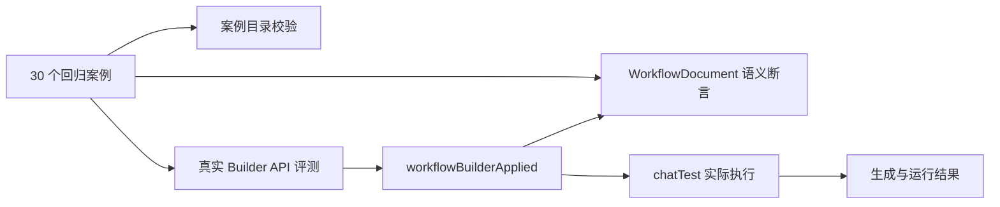

# Workflow Builder 回归案例库设计

## 目标

Workflow Builder 的回归测试需要同时回答两个问题：

1. 修改 Core、CLI、AgentLoop 或 Builder 后，既有节点、配置和交互协议是否仍然成立。
2. 真实模型能否从用户需求出发，完成需求确认、Mermaid 预览、CLI 构建、原子提交，并产出一个可实际运行的工作流。

因此，本方案保留现有分层单元测试，在其上新增由同一份案例目录驱动的语义回归和真实模型评测。

## 架构

### 案例目录

案例只描述用户目标、资源依赖、初始画布、预览决策和预期语义，不保存不稳定的节点 ID、坐标或完整模型文案。

每个案例包含：

- `request`：首轮用户需求。
- `requirementAnswers`：需求收集阶段可继续提供的信息。
- `initialWorkflow`：空白或既有工作流夹具。
- `resources`：模型、知识库、工具、子应用、文件和 HTTP 服务等外部资源。
- `preview`：确认或先修改再确认 Mermaid。
- `expected`：节点能力、路径、容器关系、系统配置和交互次数。
- `runtime`：生成后发送到 `chatTest` 的输入和输出断言。

### 普通回归测试

普通 Vitest 不访问真实模型，负责以下确定性约束：

- 案例 ID 唯一且数量固定为 30。
- 30 个案例联合覆盖全部公开内置模板。
- 系统配置案例联合覆盖全部允许配置路径。
- 修改型案例必须声明非空初始工作流。
- 每个成功案例必须包含生成语义和运行预期。
- 语义断言器能够发现缺少节点、路径、容器关系、配置和阻断诊断。

### 真实模型评测

真实评测使用独立 Vitest 配置，不进入默认 `pnpm test`：

1. 调用运行中 FastGPT 的 `/api/proApi/core/workflow/builder/chat`。
2. 对普通需求问题按案例顺序补充信息。
3. 对 Mermaid 预览发送结构化 `confirm` 或 `revise`。
4. 收到 `workflowBuilderApplied` 后执行 Core 语义断言。
5. 使用 `compileStoreWorkflow` 编译目标文档。
6. 调用 `/api/core/chat/chatTest` 实际运行生成结果。
7. 校验文本、JSON 或交互结果。

真实评测通过环境变量连接测试环境，不写死用户 Cookie、资源 ID 或文件 URL。

## 运行分级

- PR：案例目录、语义断言器和现有 Builder 确定性测试。
- 每日：通过 `WORKFLOW_BUILDER_EVAL_CASE_IDS` 运行 P0 案例。
- 发布前：运行全部 30 个真实案例。
- 稳定性：同一案例由外部 CI 重复运行并聚合成功率，单次 Vitest 不在内部重试以免掩盖失败。

## 通过标准

生成阶段：

- Mermaid 预览次数符合案例决策。
- `workflowBuilderApplied` 恰好出现一次。
- Core 不存在 `severity=error` 的诊断。
- 必需模板、执行路径、父子容器和配置均存在。
- 不出现多个可见回答所有者。

运行阶段：

- `chatTest` 不返回 SSE Error。
- 普通案例产生非空文本或满足关键事实断言。
- 结构化案例产生包含指定字段的 JSON。
- 交互案例返回预期交互类型。

## 环境变量

- `WORKFLOW_BUILDER_EVAL_BASE_URL`：运行中的 FastGPT 地址。
- `WORKFLOW_BUILDER_EVAL_APP_ID`：具有写权限的测试 Workflow 应用。
- `WORKFLOW_BUILDER_EVAL_COOKIE`：测试账号 Cookie。
- `WORKFLOW_BUILDER_EVAL_MODEL`：Builder 使用的真实模型。
- `WORKFLOW_BUILDER_EVAL_RESOURCES`：资源名称、测试事实、文件 URL 和 HTTP 地址组成的 JSON。
- `WORKFLOW_BUILDER_EVAL_CASE_IDS`：可选，逗号分隔的案例 ID。

## TODO

- [x] 定义统一案例合同。
- [x] 录入 30 个回归案例。
- [x] 增加案例覆盖矩阵测试。
- [x] 增加 WorkflowDocument 语义断言器。
- [x] 增加独立真实模型评测配置与 HTTP/SSE Harness。
- [ ] 在部署测试环境配置稳定的模型、知识库、工具、子应用和文件资源。
- [ ] 在 CI 中配置每日 P0 和发布前全量评测任务。
