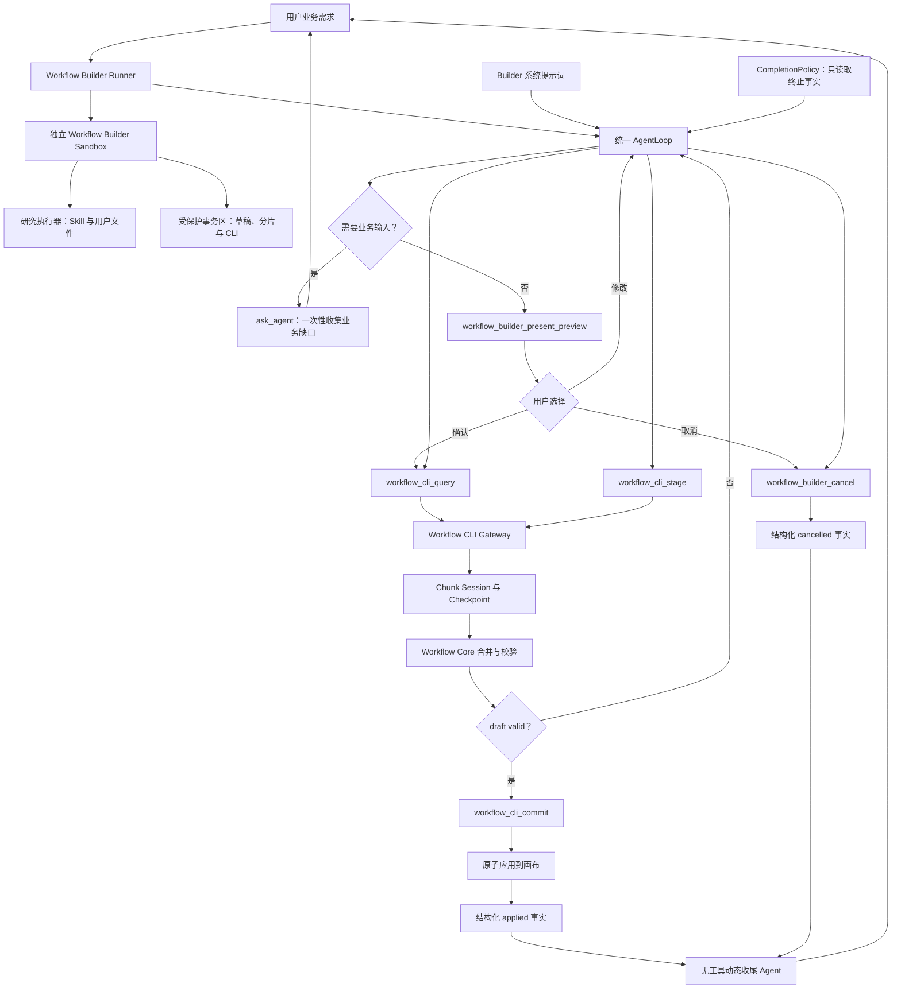
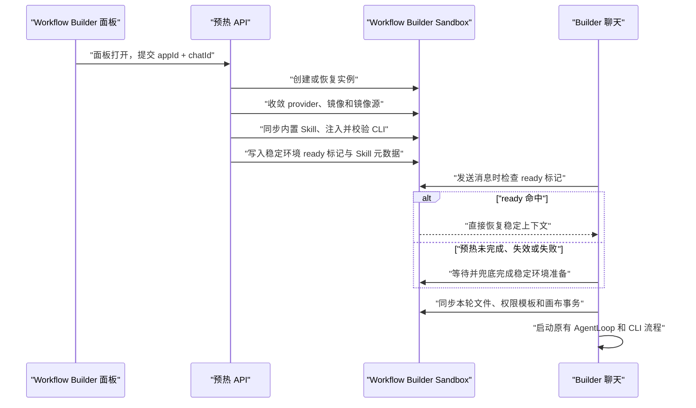

# Workflow Builder 单 Sandbox 与主 AgentLoop 架构

## 1. 目标

Workflow Builder 接收用户业务需求，在需求和资源闭合后，把完整工作流一次性搭建、校验并原子应用到当前画布。实现必须复用通用 AgentLoop，不在 Runner 外建立第二套业务状态机。

核心约束：

- 角色和业务生命周期由 Workflow Builder 系统提示词定义。
- AgentLoop 只提供通用的执行、交互、工具调度和可注入完成策略。
- 是否真正完成由工具产生的结构化事实决定，不解析 Agent 文本，不检查固定词汇。
- 当前画布事实只来自 Workflow CLI Gateway；Workflow Core 负责领域校验。
- Workflow Builder 与普通工作流运行使用不同物理 Sandbox；Builder 内的研究区与事务区保持逻辑隔离。
- 不新增数据库状态，不保存外部阶段机，不要求用户处理节点和连线问题。

## 2. 总体架构



Runner 只启动一次负责需求闭合、预览和搭建的主 `runAgentLoopCoreWithSummary`。用户确认 Mermaid 后尚未 Commit，或用户要求修改后尚未展示新 Mermaid 时，`CompletionPolicy` 才让同一个 Provider、同一份消息链和同一个运行预算继续执行，不重建主 AgentLoop。主执行产生终止事实后，Runner 另启动一次最多一轮、禁用全部工具的收尾 Agent；它只负责把结构化终止事实转换成用户答复，不参与搭建。普通问候和非搭建对话可以自然结束，也不会进入收尾 Agent。

## 3. 业务生命周期

系统提示词负责以下连续链路：

1. 需求建模与当前画布事实核对。
2. 解析知识库、模型、应用、工具、密钥等外部资源。
3. 将同一轮发现的业务或资源缺口合并成一次 `ask_agent`。
4. 所有工作流搭建和修改任务都调用 `workflow_builder_present_preview`，以 `title + mermaid + sections` 提交完整预览；普通 assistant 正文不得自行输出 Mermaid。
5. Preview 工具统一注入 `confirm`、`revise`、`cancel` 三个稳定动作。`revise` 先收集文本修改意见；Agent 合并意见后重新调用同一工具展示完整新版方案，不得重复旧图。
6. 用户确认后进入连续搭建，不再为 Schema、节点、引用、边、容器或诊断向用户确认。
7. 分片 Stage、draft validate、自主修复，最后 Commit。
8. Commit 返回 `state: applied` 与 `taskComplete: true` 后完成。

用户明确取消时必须调用 `workflow_builder_cancel`，避免把自然语言取消误当成普通完成。

## 4. 完成策略

通用 `AgentLoopRuntime` 接收可选 `completionPolicy`：

```ts
type AgentLoopCompletionPolicy = (context: {
  requestIndex: number;
}) =>
  | { action: 'complete' }
  | { action: 'continue'; message: string }
  | Promise<
      | { action: 'complete' }
      | { action: 'continue'; message: string }
    >;
```

策略不会收到 assistant 文本，因此不能演变成关键词、正则或意图分类补丁。未注入策略时，FastAgent 和 PiAgent 保持原来的自然结束行为。

Workflow Builder 的终止事实如下：

| 事实 | AgentLoop 行为 | Builder 结果 |
| --- | --- | --- |
| `ask_agent` 交互 | 暂停并保存 Provider 状态 | `clarification_pending` |
| Commit 成功 | 工具 `stop` | `applied` |
| Cancel 工具成功 | 工具 `stop` | `cancelled` |
| 同一修复目标第 10 次失败 | 工具 `stop` | `failed` |
| Provider 错误或预算耗尽 | 错误返回 | `failed` |
| 连接或用户停止信号 | 中止 | `aborted` |
| 无工具自然结束且没有上述事实 | 同一 AgentLoop 继续 | 不对用户返回阶段性结束 |

成功、取消和失败统一进入一次无工具收尾 Agent，根据权威事实动态生成最终答复。收尾失败时保留主 Agent 已经产生的内容，不注入固定兜底文案。

## 5. CLI 与状态边界

CLI Gateway 只维护执行所需状态：

- 当前 Chunk Session 与 checkpoint。
- 最近一次有效 draft validation 对应的 revision 和 WorkflowPlan。
- Stage 与 Commit 按修复目标隔离的失败次数。
- 已应用的 WorkflowDocument、WorkflowPlan 和终止错误。

不再维护 Supervisor round、stalled round、响应文本、最近工具指纹或执行快照。Stage 成功后清除该目标次数，并清除旧草稿版本上的 Commit 次数；错误类型变化不会让同一目标的计数清零。

修改顺序固定为：节点与结构化输入、执行边、数据引用和剩余配置、工具与容器关系。draft validate 必须无阻断诊断，Commit 只接受对应且未变化的 `draftRevision`。

## 6. Sandbox 边界

同一 App 用户使用一台稳定的 Workflow Builder 物理 Sandbox，不与普通工作流 Runtime Sandbox 共享。两类 Sandbox 的寻址规则为：

```text
普通工作流 Runtime:
  sourceType = app
  sourceId = appId
  userId = tmbId
  sandboxId = app-<stable-hash>

Workflow Builder:
  sourceType = workflowBuilder
  sourceId = appId
  userId = tmbId
  sandboxId = workflowbuilder-<stable-hash>
```

因此，工作流中的工具调用、文件和运行状态不会进入 Builder Sandbox；Builder 的 Skill、CLI 和事务文件也不会进入普通 Runtime Sandbox。两者拥有独立的物理资源、生命周期锁和初始化锁。App 删除时，两类资源使用同一个 `app` Source Mutation Lease 串行化创建与删除，防止 Builder 预热和 App 删除并发。

Builder 内不同 `chatId` 使用独立的 `sessions/<chatId>` 会话工作目录。Builder 在当前会话目录中准备：

```text
sessions/<chatId>/
  user_files/
  .fastgpt/workflow-builder/transaction/
    workflow.json
    chunks/
    runs/
    bin/fastgpt-workflow
```

内置 Skill 从 Builder 物理 Sandbox 的共享 Skill 根目录注入，用户文件和 Builder 事务状态位于当前会话目录。AgentLoop 只获得研究工具执行器；该执行器拒绝显式访问事务目录、`workflow.json` 和 CLI，Gateway 持有底层 `ISandbox` 并独占事务文件。这里的限制仅描述同一 Builder Sandbox 内“研究工具与事务区”的隔离：当前 SDK 尚不支持指定 Linux 用户运行命令，因此两者之间是服务端逻辑能力边界，不是 Linux 用户或容器级安全边界。Builder 与普通工作流 Runtime 之间则是独立物理 Sandbox 隔离。

Checkpoint 只有在 `appId`、base checksum、manifest 和每个分片内容校验都一致时才恢复。Commit 成功、画布基线变化或 checkpoint 损坏都会清理旧事务。

## 7. Builder 面板预热

### 7.1 触发时机与隔离边界

用户打开 Workflow Builder 面板并取得稳定 `chatId` 后，前端后台调用：

```text
POST /api/proApi/core/workflow/builder/runtime/prewarm
body: { appId, chatId }
```

接口必须先完成 App 写权限、Builder 功能开关、Sandbox 功能开关和团队套餐权限校验。Builder 物理 Sandbox 按 `sourceType=workflowBuilder + appId + tmbId` 寻址，同一成员操作同一 App 时复用一台 Builder 运行环境，但不会复用 `sourceType=app` 的普通工作流 Runtime Sandbox；`chatId` 只映射到 `sessions/<chatId>` 会话目录，保证不同 Builder 会话的事务文件互不覆盖。预热不创建新的 AgentLoop，不调用模型，也不读取或修改当前画布。

### 7.2 稳定环境与动态轮次



可以前置且缓存的稳定步骤：

- provider 和目标 runtime image 收敛；
- Sandbox 创建、恢复和会话目录准备；
- npm、pip 等包镜像源准备；
- 内置 `workflow-builder` Skill 同步和模型可见元数据扫描；
- Workflow CLI 注入、执行权限设置和版本校验。

每轮聊天必须保留的动态步骤：

- 当前请求上传文件同步；
- 当前可用工作流模板和权限过滤结果写入；
- 新任务写入当前画布 `workflow.json`，同轮交互恢复既有事务基线；
- CLI `query/stage/commit`、预览确认、候选版本生成和应用确认。

稳定环境 ready key 由 runtime schema、provider、runtime image、包镜像源、CLI 版本、locale 和内置 Skill 内容共同生成。任何固定环境配置变化都会使旧标记失效并重新准备；画布、上传文件和权限模板不得写入 ready key 或稳定元数据缓存。

### 7.3 并发与失败回退

预热和聊天使用同一 Sandbox 生命周期与初始化租约。若用户在首次创建期间立即发送消息，聊天请求在 Workflow Builder 局部等待窗口内轮询，而不是直接返回 `agentSandboxInitializing`；等待超时后仍保留原错误，防止请求无限挂起。该等待策略只作用于 Workflow Builder，不改变普通 Agent 的 Sandbox 并发语义。

前端预热是性能优化，不是聊天功能的成功前置条件。预热请求失败时不展示阻断提示，聊天请求仍执行同一套稳定环境检查和兜底准备。因此该优化不改变现有自动生成工作流的业务协议和结果，只把不依赖本轮输入的耗时从“发送消息后”移动到“打开面板后”。

## 8. 验收

- FastAgent 与 PiAgent 都支持可选 CompletionPolicy，默认行为不变。
- Builder 只启动一个主构建 AgentLoop；终止后最多追加一次无工具收尾 Agent 调用。
- 模型输出阶段总结、复杂度说明或手工操作建议时不会结束未提交任务。
- 需求提问、Mermaid 确认、修改后新 Mermaid 和取消均走结构化交互或工具。
- Mermaid 确认后不再出现技术阶段确认。
- 同一 Stage 或 Commit 目标第 10 次失败才终止，成功后清零。
- Commit 前必须 draft validate，Commit 后画布文档与 Workflow Core 目标一致。
- 最终答复由无工具 Agent 动态生成，不存在固定成功或失败回复。
- 打开 Builder 面板后立即后台预热，不等待用户发送第一条消息。
- Builder 与普通工作流 Runtime 使用不同的物理 Sandbox ID、生命周期锁和初始化锁。
- App 删除与 Builder 创建共用 App Source Mutation Lease，不会并发创建遗留资源。
- ready 标记命中后不重复镜像源准备、Skill 同步、Skill 扫描或 CLI 注入。
- 预热与首次聊天并发时，聊天等待同一初始化过程，不直接返回初始化 409。
- 预热失败、超时或未触发时，聊天链路仍能自行完成稳定环境准备。
- 每轮继续同步最新画布、权限模板和上传文件，预热缓存不持有动态业务数据。
- 预热不改变 AgentLoop、Workflow CLI、预览确认和候选版本应用协议。

## 9. TODO

- [x] 拆分稳定环境准备与每轮动态事务准备。
- [x] 新增预热 API，并完成 App 写权限、功能开关和团队 Sandbox 权限校验。
- [x] Builder 面板取得 `chatId` 后静默触发预热。
- [x] ready key 覆盖 provider、runtime image、镜像源、CLI、locale、Skill 和 schema。
- [x] ready 命中后恢复 Skill 元数据，跳过固定环境重复准备。
- [x] 首次创建和稳定初始化并发时由 Builder 局部有限等待。
- [x] 保留聊天兜底和每轮动态画布、模板、文件同步。
- [x] 补充预热 Handler、前端 API、并发等待和缓存命中定向测试。
