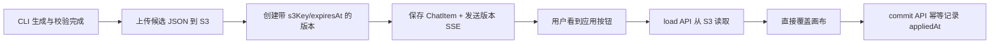

# Workflow Builder UI 与版本归档需求设计文档

## 0. 文档标识

- 任务前缀：`workflow-builder-ui-refresh`
- Figma：`vvySUfrYlBI44OKt5qKriv`，主节点 `2190:30502`
- 动效来源：`/Users/xxyyh/Downloads/ai-workflow-icon-motion.html`
- 文档职责：定义 Workflow Builder 入口、面板、引导、生成状态、版本卡片和 S3 生命周期。
- 关联文档：`workflow-builder-version-confirmation-需求设计文档.md`。本文档对其“画布应用成功后才归档”的旧结论作出修订：候选版本在生成、校验完成后即归档到 S3。

## 1. 需求背景与目标

### 1.1 背景

当前分支已完成 Workflow CLI、Sandbox、WorkflowDocument 校验、候选版本、画布覆盖、S3 归档和历史版本再次应用。当前前端仍是临时形态：

- Builder 入口在画布右上角，而 Figma 要求并入左侧工具栏。
- Builder 面板位于右侧且使用 `33vw`，与 Skill 辅助生成的 `490px`左侧面板不一致。
- 系统配置首次进入会直接展开，新设计要求改为顺序 Tooltip 引导。
- 生成中、待回应、待应用缺少统一的入口图标状态。
- 候选版本目前只在首次应用后上传 S3，导致未应用旧候选被 Sandbox 新结果覆盖后无法再应用。

### 1.2 目标

- 按 Figma 落地 Workflow Builder 完整 UI 与交互，不重写已有生成引擎。
- 将一次生成明确拆成“理解/确认 -> 生成/校验 -> S3 归档 -> 待用户应用”。
- 使每个已出现“应用到画布”按钮的版本都是可独立加载的 S3 版本。
- 保持方案预览现有 Mermaid + Sections + AgentAsk 交互不变。
- 保持生成期间用户手工修改画布后，点击应用仍直接覆盖当前画布。

### 1.3 成功指标

- 新建 Workflow 按规定顺序完成两次 Tooltip，然后自动打开 Builder 并聚焦输入框。
- 桌面端 Builder 宽度固定 `490px`，从 Header 底部铺到视口底部；移动端全屏。
- Builder 面板打开时整条左侧 Toolbar 隐藏；关闭面板时，Mermaid 确认到版本卡片出现前展示光环，存在未查看的待交互、待应用或运行错误时叠加红点。
- 每个通过服务端校验的候选版本先上传 S3，再发送版本 SSE/保存 ChatItem。
- 同一会话中多个未应用版本在未过期时均可应用，不再依赖 Sandbox 最新 `workflow.json`。
- 用户点击顶部待应用横幅的“应用到画布”后，横幅立即消失。

## 2. 项目事实基线

| 能力项 | 现有实现位置 | 现状 | 结论 |
|---|---|---|---|
| Builder 页面入口 | `projects/app/src/pageComponents/app/detail/Workflow/index.tsx#WorkflowEdit` | `Flow` 和 `WorkflowBuilder` 是同级组件 | 修改：在此层编排共享 UI 状态 |
| Builder 面板 | `WorkflowComponents/WorkflowBuilder/index.tsx#WorkflowBuilder` | 右侧 `33vw`，自己管理 `isOpen` | 修改为左侧 `490px` 和外部状态编排 |
| 工具栏 | `WorkflowComponents/Flow/index.tsx#Workflow` | 添加、系统配置、搜索分散定位 | 修改：统一 AI/添加/配置/搜索顺序 |
| 系统配置引导 | `Flow/hooks/useSystemConfigAutoOpen.ts` | 首次或新建时直接打开 Drawer | 替换为两步 Tooltip 状态机 |
| 引导持久化 | `components/core/app/useAppEditorUIState.ts` | 浏览器 `localStorage` | 复用并扩展 Builder 引导状态 |
| Builder Chat | `WorkflowBuilder/ChatPanel.tsx` | 复用 ChatBox、模型选择和独立 chatId | 复用，新增空态/聚焦和状态上报 |
| 方案预览 | `AIResponseBox/RenderWorkflowBuilderPreviewInteractive.tsx` | Mermaid + Sections + 后端 actions | 视觉和交互保持现状 |
| 处理过程 | `AIResponseBox/RenderProcessingCollapse.tsx`、`RenderTool.tsx` | 通用折叠、Tool Input/Response | 复用，新增 Builder tool 展示映射 |
| 版本卡片 | `AIResponseBox/RenderWorkflowBuilderVersion.tsx` | `ready/available/expired/superseded` | 修改为 S3 版本的待应用/可再应用/过期状态 |
| 版本创建 | `pro/admin/src/service/core/ai/workflowBuilder/version/service.ts#createReadyWorkflowBuilderVersion` | 只创建元数据，未立即上传 | 修改为生成完成即 S3 归档 |
| 版本加载 | `version/service.ts#loadWorkflowBuilderVersion` | 未应用读 Sandbox，已应用读 S3 | 统一读取 S3 |
| 应用归档 | `version/service.ts#commitWorkflowBuilderVersion` | 画布应用成功后上传 S3 | 改为仅幂等记录 `appliedAt`，不重复上传 |
| 画布覆盖 | `WorkflowBuilder/index.tsx#applyVersion` | 加载、校验、覆盖、布局、快照 | 复用，不新增画布冲突校验 |

## 3. 已确认需求

| 维度 | 已确认内容 | 待确认 |
|---|---|---|
| 面板 | 桌面端 `490px`，左侧，上下顶边；移动端全屏 | 无 |
| 新建应用 | 用创建路由标记识别，引导后自动打开并聚焦 | 无 |
| 引导 | 系统配置 Tooltip -> 知道了 -> AI Tooltip -> 知道了 | 无 |
| 引导存储 | 保存在本地 `localStorage` | 无 |
| 面板共存 | 左侧主面板互斥；Builder 可与右侧节点/运行预览共存 | 无 |
| 方案预览 | 保持当前 UI 和 actions 文案 | 无 |
| 生成动效 | 使用 HTML `cool`/“生成中·光环” | 无 |
| 画布修改 | 点击应用时直接覆盖用户在生成期间的修改 | 无 |
| 版本归档 | 校验完成且准备显示应用按钮前先上传 S3 | 无 |
| 历史应用 | 所有未过期 S3 版本均可应用，不区分是否曾应用 | 无 |
| 顶部横幅 | 只展示最新待应用版本；点击应用后立即消失 | 无 |

## 3.1 影响域判定

| 维度 | 是否命中 | 证据 | 结论 |
|---|---|---|---|
| API | Yes | version load/commit 和 Builder chat 生成完成链 | 调整语义，保持路由可兼容 |
| Data | Yes | `WorkflowBuilderVersion` 中 `s3Key/expiresAt/appliedAt` | 不新增 Mongo 顶层字段或索引 |
| Frontend | Yes | Builder 面板、Toolbar、ChatBox、Version Card | 本需求主要影响域 |
| Logging | Yes | 生成完成上传和版本应用失败 | 记录 ID/checksum/versionNo，不记录完整 JSON |
| Packaging | No | CSS keyframes 可在现有栈实现 | Not Applicable，不新增动效依赖 |
| Testing | Yes | 新增状态机、上传时机和 UI 分支 | 局部测试 + 最终全量测试 |
| DocI18n | No | 不修改用户文档站 | Not Applicable；产品 i18n 仍要三语同步 |

## 4. 范围

### 4.1 In Scope

- 左侧工具栏顺序和入口状态。
- Builder 面板宽度、顶底边界、动画、响应式。
- 新建/已有 Workflow 首次引导和本地完成状态。
- 空白工作流开场说明、示例、输入框聚焦和高度自适应。
- 关闭 Builder 后的光环、红点、顶部待应用横幅。
- Builder 处理过程折叠、Tool 展示名称和 Input/Response 展示。
- 版本卡片默认、hover、loading、可再应用、过期状态。
- 候选版本生成完成后立即上传 S3，load 统一从 S3 读取。
- 过期前端预判 + 服务端权威校验 + toast/按钮更新。

### 4.2 Out of Scope

- 改写 Workflow CLI 命令、WorkflowDocument 格式或核心校验器。
- 重新设计方案预览 UI 或固定后端 actions 文案。
- 服务端同步首次引导状态。
- 为版本提供一天以上的永久保存或独立版本管理页。
- 应用前比较当前画布 checksum，或尝试合并用户在生成期间的修改。
- 鼠标移到左边缘自动呼出已关闭 Builder。

## 5. 方案对比

| 方案 | 核心思路 | 优点 | 风险/成本 | 结论 |
|---|---|---|---|---|
| A：应用后归档 | 保持现有 Sandbox ready -> apply -> S3 commit | 改动少 | 旧未应用候选无法恢复，不满足需求 | 不采用 |
| B：生成后归档 | 候选校验通过后上传 S3，然后发布版本卡片 | 每个按钮都绑定稳定文件，历史均可应用 | 生成请求多一次 S3 写入，必须处理上传失败 | 采用 |
| C：为每个候选保留 Sandbox 副本 | 卡片持有 Sandbox candidate path | 不依赖 S3 | 清理、寻址、Sandbox 回收语义复杂 | 不采用 |

推荐方案 B。“应用按钮已出现”就代表对应 JSON 已通过校验并完成 S3 归档。若 S3 上传失败，本轮不发布版本卡片，而是保留明确错误，避免展示不可恢复的假按钮。

## 6. 推荐方案详细设计

### 6.1 界面布局与共存

- 桌面端 Builder：`position: fixed; left: 0; top: 67px; bottom: 0; width: 490px`。
- 移动端：`top: 0; width: 100vw; height: 100vh`。
- 左侧主面板状态统一为 `none | workflowBuilder | nodeTemplates | systemConfig`，一次只能打开一个。
- 搜索状态独立，右侧节点编辑/运行预览独立。
- 收起 Builder 后必须点击 AI 入口重新打开，不做边缘 hover 呼出。

### 6.2 首次引导状态机

```text
unseen
  -> systemConfigTooltip
  -> 用户点击“知道了”
  -> workflowBuilderTooltip
  -> 用户点击“知道了”
  -> completed
```

- 引导完成状态保存到 `app-editor-ui-state`，按当前浏览器全局生效，不按 appId 重复弹出。
- 新建 Workflow 路由标记只表示“引导完成后自动打开 Builder”。
- 若引导已完成，新建 Workflow 进入后直接打开 Builder。
- 若是已有 Workflow 且首次看到引导，引导结束后保持 Builder 关闭。

### 6.3 AI 入口状态

- Builder 面板打开时，整条左侧 Toolbar 不渲染，避免半透明 Builder 透出后方按钮。
- 搜索入口第一次点击打开画布顶部搜索框并保持灰底选中态；再次点击同一入口关闭搜索并恢复默认态，搜索框关闭按钮与 Escape 同样执行完整清理。
- 光环和红点是两个独立、可叠加的视觉图层，不使用互斥状态。
- 光环条件：Builder 关闭、用户已经确认最新 Mermaid、对应版本卡片尚未出现且聊天流仍在生成。
- 红点条件：Builder 关闭，且存在尚未查看的 Ask/方案确认等阻塞交互、待应用版本或本次生成的不可预知运行错误。
- 用户进入 Builder 或点击顶部待应用横幅时，将当前待处理事项 key 标记为已查看；关闭 Builder 后旧事项不重复提醒，只有新 key 才再次显示红点。

### 6.4 光环动效

使用 HTML `data-state="cool"` 的参数：

- 后层光环：`48px`，`blur(6px)`，蓝/紫径向渐变，`1.85s ease-in-out infinite`。
- 前层光环：`42px`，`blur(4px)`，紫/蓝径向渐变，`2.6s ease-in-out infinite`。
- 中心：`1.35s` 在 `scale(.98)` 和 `scale(1.12)` 间呼吸。
- 星点：`1.1s alternate`，B/D 延迟 `.32s`。
- 弧线：`1.25s`，第二组延迟 `.44s`。
- 动效只在 Builder 关闭、确认 Mermaid 后到版本卡片出现前运行；打开面板时入口整体隐藏。
- `prefers-reduced-motion: reduce` 下停止星点/弧线/扫光动画，只保留静态低透明度光环。
- 使用 CSS keyframes，不新增 motion 依赖。

### 6.5 理解、预览和生成过程

- 方案预览继续使用 `workflow_builder_present_preview` 产生的 Mermaid/Sections。
- 确认/调整的按钮文案使用后端 `actions`，不在前端写死 Figma 示例。
- 生成过程复用通用 processing collapse；中文界面将 Builder tool 映射为方案预览、查看现状、动手搭建、正式交付、取消任务，其他语言保留英文名称。
- 上述 5 个 Builder tool 的 `avatar` 由服务端工具信息直接提供；图标使用 Figma 对应节点导出的原始 `16px` SVG，并注册到通用图标库，聊天框继续复用现有 `Avatar` 渲染链路。
- Workflow Builder 的一次复杂响应增加最外层“处理中/已处理”折叠；外层内部保留现有每轮处理折叠和中间 Agent 正文，展开后可查看完整响应过程。
- 最外层直接复用现有 processing collapse，不增加缩进、引导线、背景或新的间距样式；普通聊天不启用该分组。
- 生成期间所有正文都属于过程；生成完成后只有最后一次 Agent 正文显示在最外层折叠之外，Ask、方案确认、错误和版本卡片继续保持可见。
- Workflow Builder 的 Ask 选项只展示 `summary` 标题，隐藏标题后的协议值 `value`；普通聊天继续展示原有选项说明。
- 输入/输出代码块保持现有 Markdown 复制能力。

### 6.6 版本生命周期



约束：

- S3 上传是发布应用按钮的前置条件。
- `expiresAt` 从生成归档时开始计算，保持现有 1 天 TTL。
- `appliedAt` 仍为可选，只表示该版本至少成功应用过一次。
- 版本 load 不再读 Sandbox，也不再校验“是否最新 ready”。
- 同一 `responseChatItemId` 的生成重试必须幂等：复用已上传版本，不创建重复对象。
- 服务端在读取 S3 后重算 checksum，必须与 ChatItem 版本 checksum 一致。

### 6.7 版本卡片和过期

| 状态 | 条件 | 按钮 | 行为 |
|---|---|---|---|
| 待应用 | 有效 S3 版本，本地未成功应用 | 应用到画布 | 读 S3 并覆盖 |
| 可再应用 | 有效 S3 版本，已成功应用 | 再次应用 | 读同一 S3 版本并覆盖 |
| 应用中 | 用户已点击 | loading | 防止重复请求 |
| 已过期 | `expiresAt <= now` 或服务端返回过期 | 已过期 | 禁用 |

过期过程：

1. 点击时用 `expiresAt` 做本地预判。
2. 已过期则显示 toast，卡片立即变为“已过期”。
3. 本地判断未过期时调用 load API。
4. 服务端仍以自身时间为权威结果；若返回过期，前端同样 toast 并更新卡片。

### 6.8 顶部待应用横幅

- 仅在 Builder 关闭且存在新生成待应用版本时显示。
- 样式以 Figma `2151:68297` 为准：横幅相对画布顶部定位、高度 `52px`、左右内边距 `32px`、内容分组间距 `32px`、全圆角、`rgba(255,255,255,0.76)` 背景和 `#E8EBF0` 描边。
- 与画布搜索框共享同一个画布定位容器、中心点和顶部偏移；搜索框位于上层，待应用横幅位于下层。
- 左侧复用聊天版本卡片的 `24px` 工作流版本图标；按钮高度 `32px` 且为全圆角；关闭点击区固定 `34px`。
- 横幅沿用现有动态版本名称和“已生成完毕”文案，只对齐 Figma 的视觉样式。
- 只保留最新一条，新版本替换旧横幅，不影响聊天中的历史卡片。
- 用户点击“应用到画布”后，横幅立即标记为已处理并消失，不等待 load/apply/commit 完成。
- 如果应用失败，使用 toast 和聊天卡片承接重试，横幅不自动恢复。
- 点击横幅关闭按钮只隐藏当前横幅，不改变版本卡片。

### 6.9 API 设计

| 路由 | 方法 | 调整 | 错误分支 |
|---|---|---|---|
| `/core/workflow/builder/chat` | POST/SSE | 生成完成后先上传 S3，再持久化/发送 version | S3 失败则不发布版本卡片 |
| `/core/workflow/builder/version/load` | POST | 统一从 version.s3Key 读取 | 无权限、过期、文件不存在、JSON/checksum 错误 |
| `/core/workflow/builder/version/commit` | POST | 不再上传 JSON；幂等记录 `appliedAt` | 版本不存在、过期、checksum 不一致 |

保持现有路由，避免前端调用链大幅变动。`commit` 名称解释为“确认该归档版本已成功应用”。

### 6.10 数据兼容

`WorkflowBuilderVersion` 保持当前字段：

| 字段 | 类型 | 必填 | 新语义 | 兼容策略 |
|---|---|---|---|---|
| `versionNo` | positive integer | 是 | 会话内递增版本 | 不变 |
| `name` | string | 是 | 版本名称 | 不变 |
| `filename` | string | 是 | S3 JSON 文件名 | 不变 |
| `checksum` | string | 是 | S3 JSON checksum | 不变 |
| `generatedAt` | datetime string | 是 | 生成校验完成时间 | 不变 |
| `s3Key` | string | 新版本是 | 生成归档对象 key | 旧聊天可缺失，load 保留 Sandbox 兼容分支 |
| `expiresAt` | datetime string | 新版本是 | 生成归档过期时间 | 旧聊天可缺失 |
| `appliedAt` | datetime string | 否 | 首次应用成功时间 | 不变 |

不新增 Mongo 字段、集合或索引，无数据迁移脚本。

### 6.11 日志

| 场景 | 级别 | 字段 | 限制 |
|---|---|---|---|
| 候选版本上传成功 | info | appId/chatId/responseChatItemId/versionNo/checksum/expiresAt | 不记完整 JSON |
| 候选版本上传失败 | error | 同上 + error | 不记 S3 凭据 |
| 版本 load | info | IDs/versionNo/checksum/source=s3 | 不记内容 |
| 版本应用标记 | info | IDs/versionNo/appliedAt | 幂等日志 |

## 7. 风险、迁移与回滚

### 7.1 风险

- S3 上传成为生成成功链的必要步骤，对象存储故障会阻止应用按钮产生。
- 生成了但从未应用的版本也会使用 S3 存储，总对象数会增加；1 天 TTL 控制成本。
- 引导使用 `localStorage`，同一用户换设备会重新看到引导，同一浏览器切换账号可能共享完成状态。
- CSS 光环使用 blur/filter，必须限制在 AI 按钮的 48px 上下文，避免整条工具栏重绘。

### 7.2 兼容/迁移

- 新 ChatItem 版本在创建时必须含 `s3Key/expiresAt`。
- 旧版本没有 `s3Key` 时，保留现有“仅最新 ready 可从 Sandbox 加载”的兼容分支，不回填历史数据。
- 现有已归档 S3 版本不需要数据迁移。

### 7.3 回滚

- 前端 UI 可通过恢复 `WorkflowBuilder/index.tsx` 和 `Flow` 工具栏改动回滚。
- 后端回滚时，新生成版本已有 `s3Key`，旧 load/commit 链仍可将其视为已归档版本加载，不破坏已有卡片。
- S3 对象按 TTL 自动过期，不执行批量删除。

## 8. 验收标准

| 验收项 | 验收方式 | 通过标准 |
|---|---|---|
| Toolbar | UI/E2E | AI/添加/配置/搜索顺序正确，左侧主面板互斥 |
| 面板 | 视觉 | 桌面 490px，Header 以下上下顶边，移动端全屏 |
| 引导 | 组件/E2E | 顺序和新建/已有 Workflow 最终开启状态正确 |
| 输入聚焦 | E2E | 新建应用自动打开后可直接输入 |
| 光环 | 视觉/E2E | Mermaid 确认后开始，版本卡片出现时停止，可与待处理红点叠加 |
| 入口提醒 | 组件/E2E | 面板打开时整条 Toolbar 隐藏；进入 Builder/点击横幅清除当前提醒，新事项重新显示 |
| 降低动效 | 样式测试 | reduced motion 下没有星点/弧线循环 |
| 版本发布 | 集成 | S3 上传成功后才保存/发送版本卡片 |
| 多版本 | 集成/E2E | 前一个未应用版本被新版本生成后仍可应用 |
| 覆盖 | E2E | 生成期间改画布后，应用版本直接覆盖 |
| 过期 | 单元+集成 | 点击时 toast，按钮变“已过期”，服务端也拒绝 |
| 横幅 | E2E | 只显示最新版本，点击应用后立即消失，失败不恢复 |
| 方案预览 | 回归 | 现有 Mermaid/Sections/actions 行为不变 |

## 9. MECE 核查

### 9.1 相互独立

- Toolbar/Drawer 组件只负责开关和布局；ChatPanel 负责聊天事实；version service 负责 S3/ChatItem 版本事实。
- 光环由 Mermaid/版本时间线派生，红点由待交互、待应用、运行错误 key 与已查看 key 的差集派生，横幅由最新版本派生。
- S3 保存 JSON，ChatItem 保存版本元数据，画布 Snapshot 保存当前页面编辑历史。

### 9.2 完全穷尽

- 已覆盖新建/已有 Workflow、面板开/关、生成/待回应/待应用/运行错误/过期。
- 已覆盖 S3 上传失败、load 失败、checksum 不符、画布应用失败和幂等重试。
- 已覆盖桌面/移动端和 reduced motion。

### 9.3 修订动作

`[问题]` 原版本协议只在应用后上传 S3。  
`影响:` 旧未应用版本被 Sandbox 覆盖后无法恢复。  
`修订动作:` 校验完成后立即上传 S3，按钮只绑定 S3 版本。  
`修订后结果:` 所有未过期历史版本均可独立应用。

`[问题]` 顶部横幅的消失时机不明确。  
`影响:` 点击后 loading/失败可能导致横幅重复出现。  
`修订动作:` 点击应用时立即本地 dismiss，失败交给 toast 和聊天卡片重试。  
`修订后结果:` 横幅一次性提醒语义稳定。

`[问题]` 动效演示同时提供 `generating` 和 `cool`。  
`影响:` 只根据状态名容易实现错版。  
`修订动作:` 明确选用 `data-state="cool"`，并固定其参数和 reduced-motion 分支。  
`修订后结果:` 生成中始终为用户选定的光环版。
