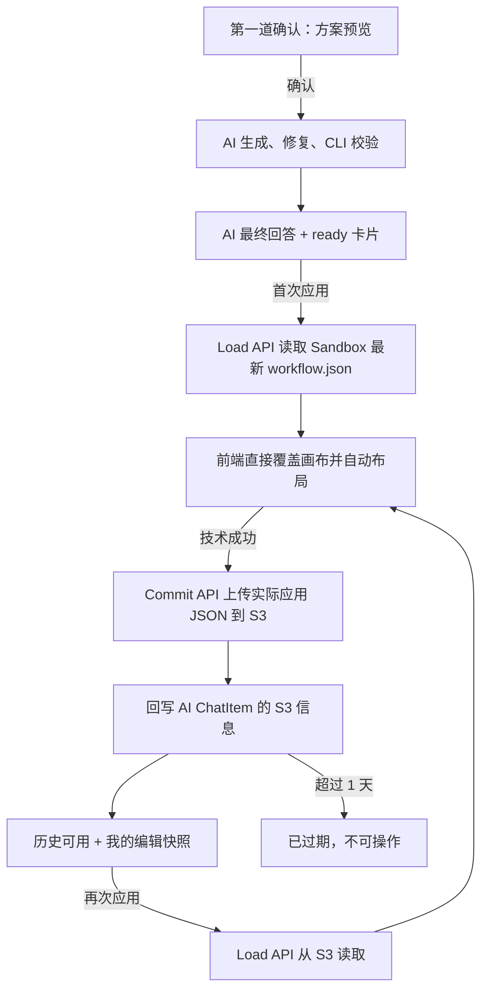

# Workflow Builder 二次确认与版本回退需求设计文档

## 0. 文档标识

- 任务前缀：`workflow-builder-version-confirmation`
- 文档文件名：`workflow-builder-version-confirmation-需求设计文档.md`
- 状态：方案确认，可进入开发设计评审
- 更新时间：2026-08-12

## 1. 需求背景与目标

### 1.1 背景

当前 Workflow Builder 在 CLI Commit 成功后，通过 SSE 立即把目标 `WorkflowDocument` 应用到画布。用户在 AI 真正完成生成、修复和校验后，没有第二次决定是否覆盖画布的机会；应用结果也没有作为聊天文件持久化，无法在聊天记录中恢复某次 AI 生成版本。

本需求把“允许 AI 开始搭建”和“允许生成结果覆盖画布”拆成两道确认，同时将每次实际应用成功的 JSON 保存为 1 天有效的聊天版本文件。

### 1.2 目标

- 保留现有第一道方案确认：用户确认方案后，AI 才开始搭建。
- 新增第二道应用确认：AI 完成生成、修复及校验后，只展示待应用文件卡片，不自动改画布。
- 用户点击后，直接读取当前 Sandbox 最新 `workflow.json` 覆盖画布，不比较生成前后的画布 checksum。
- 首次应用成功后，将实际应用的 JSON 上传 S3，保存 1 天，并回写到对应 AI 消息。
- 聊天卡片支持待应用、历史可用、已过期、已有更新版本四种展示状态。
- “我的编辑”使用 `AI 生成版本 N` 作为快照标题；历史有效版本可以再次应用。

### 1.3 成功指标

1. AI 完成生成后，画布在用户点击第二道确认前保持不变。
2. 首次点击“应用到画布”读取 Sandbox 最新 `workflow.json`，且不会再次调用 AI 或进入修复循环。
3. 画布应用成功后，聊天消息在刷新页面后仍可展示对应 S3 版本，最长保留 24 小时。
4. 历史有效版本显示“再次应用”；过期版本不可操作。
5. 归档到 S3 的 JSON checksum 与前端实际成功应用的 JSON checksum 一致。

## 2. 项目事实基线

| 能力项 | 现有实现位置 | 现状说明 | 结论 |
|---|---|---|---|
| 第一道确认 | `pro/admin/src/service/core/ai/workflowBuilder/previewTool.ts`、`runner.ts` | `workflowBuilderPreview` 提供确认、修改、取消 | 保留，不改变语义 |
| Builder 事务文件 | `pro/admin/src/service/core/ai/workflowBuilder/sandbox.ts` | 固定文件为 `.fastgpt/workflow-builder/transaction/workflow.json`；每次准备 Builder 时会以当前画布覆盖 | 读取时不得调用 `prepareWorkflowBuilderSandbox()` |
| Sandbox 连接 | `packages/service/core/ai/sandbox/application/runtime/client.ts#getSandboxClient` | 支持 `allowCreate: false`，可避免没有现有运行实例时创建空 Sandbox | 第二道确认读取时复用 |
| 当前自动应用 | `pro/admin/src/service/core/ai/workflowBuilder/handler.ts`、`projects/app/src/pageComponents/app/detail/WorkflowComponents/WorkflowBuilder/ChatPanel.tsx` | Commit 后发送 `workflowBuilderApplied` SSE，前端立即调用 `onWorkflowApplied` | 改为生成待应用版本卡片，不再自动应用 |
| 当前画布冲突检查 | `projects/app/src/pageComponents/app/detail/WorkflowComponents/WorkflowBuilder/index.tsx#onWorkflowApplied` | 应用前比较 `baseChecksum`，画布变化时拒绝应用 | 第二道确认场景删除该比较，用户操作即直接覆盖 |
| AI 消息结构 | `packages/global/core/chat/type.ts#AIChatItemValueSchema` | 没有工作流版本文件字段 | 新增 AI 专用版本值结构 |
| 文件 UI | `projects/app/src/components/core/chat/ChatContainer/ChatBox/components/FilesBox.tsx` | 支持文件视觉和 `window.open(url)`，主要用于用户消息 | 复用视觉规范，新增工作流版本专用卡片和业务按钮 |
| AI 响应渲染 | `projects/app/src/components/core/chat/components/AIResponseBox/index.tsx` | 按 AI value 渲染文本、工具和交互 | 增加工作流版本卡片分支 |
| S3 聊天文件 | `packages/service/common/s3/sources/chat/index.ts#uploadChatFile` | 支持 `expiredTime` 和聊天维度对象路径 | 复用，设置 `now + 1 day` |
| “我的编辑” | `projects/app/src/pageComponents/app/detail/WorkflowComponents/context/workflowSnapshotContext.tsx` | 内存维护 `past/future`，支持自定义快照标题、undo/redo | 复用；不改造成服务端版本库 |

## 3. 已确认需求与边界

### 3.1 两道确认

1. 第一道确认继续使用现有 `workflowBuilderPreview`：确认方案后才开始 AI 搭建。
2. 第二道确认只在 AI 已经完成生成、修复、CLI Commit 和服务端结构校验后出现。
3. 第二道确认卡片位于该轮 AI 最终回答之后。
4. 用户点击应用后不再进行业务校验或画布冲突检查；只允许出现技术成功或技术失败。
5. 不重新调用 AI，不重新进入修复循环。

### 3.2 文件来源和保存时机

- 首次应用：确认时直接读取同一 Sandbox 最新固定 `workflow.json`。
- 不创建 `candidates/{id}.json`，不复制候选文件，不使用 Redis 保存候选 JSON。
- 只有画布真正应用成功后才上传 S3。
- S3 保存的是前端刚刚实际应用成功的 JSON，而不是归档接口再次读取 Sandbox 的内容。原因是两个请求之间 Sandbox 固定文件可能被新一轮生成覆盖。
- S3 对象设置 1 天过期；ChatItem 保存 `s3Key`、`expiresAt` 和 checksum，不保存临时签名 URL。

### 3.3 版本编号

- 展示名称统一为 `AI 生成版本 N`，文件名为 `AI 生成版本 N.json`。
- `N` 代表当前 Builder 会话中第 N 个成功生成并可供确认的结果，而不是日期和时间。
- 每次产生新的待应用结果时，按当前 Builder 会话已有版本最大 `versionNo + 1` 分配。
- 同一 `responseChatItemId` 重试必须保持相同版本号，不能重复递增。

### 3.4 固定文件带来的产品语义

Sandbox 只有一个最新 `workflow.json`，因此未归档版本不能作为彼此独立的历史文件存在：

- 新一轮 Builder 生成完成后，旧 `ready` 卡片不再可操作。
- 页面上最多有一个可点击的待应用版本，即当前最新生成版本。
- 旧的未应用卡片显示“已有更新版本”，按钮禁用。
- 只有至少成功应用并上传 S3 的版本，才成为可长期（1 天内）再次应用的历史版本。

这条规则不是增加候选副本，而是承认“点击时取最新 Sandbox 文件”所决定的真实产品语义。

### 3.5 Builder 生成轮次判断

Builder 后端只使用当前聊天历史中的 `lastInteractive` 判断本次请求是否属于同一生成轮次：

```ts
const lastInteractive = getLastInteractiveValue(histories);
const isBuilderResume = lastInteractive !== undefined;
const isNewBuilderRound = !isBuilderResume;
```

| `lastInteractive` | 请求来源 | 轮次语义 | 画布处理 |
|---|---|---|---|
| 不存在 | 用户从聊天输入框发起新的工作流需求 | 新轮次 | 读取请求携带的当前画布，并重写 Sandbox `workflow.json` |
| 存在（需求澄清交互；旧 `agentPlanAskQuery` 会被 helper 适配为 `agentAsk`） | 用户回答需求澄清表单 | 同轮续跑 | 忽略请求携带的当前画布，保留 Sandbox `workflow.json` |
| `workflowBuilderPreview` | 用户确认或修改 Mermaid 表单 | 同轮续跑 | 忽略请求携带的当前画布，保留 Sandbox `workflow.json` |

- 不解析用户文字，不按确认/修改按钮分别编写业务判断，也不引入 `start/resume/stale_interaction` 状态机。
- `pendingMainContext` 和 `childrenInteractiveParams` 仍由 AgentLoop 用于恢复各自的运行现场，但都不参与 Builder 是否重写画布基线的判断。
- 即使 Mermaid 修改意见中写“重新读取画布”，当前请求仍有 `lastInteractive`，因此不会重读画布。用户需要先结束当前交互，再从聊天输入框发起新需求。
- 第二道“应用到画布”调用独立版本接口，不重新进入 Builder Agent，因此不参与本判断。

## 4. 影响域判定

| 维度 | 是否命中 | 证据 | 核对规范 | 结论 |
|---|---|---|---|---|
| API | Yes | 新增加载和归档接口，修改 Builder SSE/消息输出 | `AGENTS.md` API 入参规范 | 使用 Zod OpenAPI schema；API handler 用 `parseApiInput` |
| Data | Yes | AI ChatItem value 新增版本结构 | ChatItem 兼容规则 | 使用可选 value 字段，不新增 Mongo 顶层字段和索引，无迁移脚本 |
| Frontend | Yes | 新增文件卡片和四态操作，修改自动应用行为 | ChakraUI、i18n | 复用现有文件卡片视觉，专用业务组件承载按钮 |
| Logging | Yes | Sandbox 读取、画布归档、S3 上传可能失败 | 项目日志规范 | 记录 ID、版本号、checksum，不记录完整 JSON |
| Packaging | Yes | global/openapi、service、pro API、app UI 跨层协作 | `.agents/code/syntax.md` | global 只放 schema；服务端依赖不进入前端 |
| Testing | Yes | 状态推导、接口、归档幂等和画布行为均有风险 | `testing-standards.md` | 单元 + API/service + 前端交互测试 |
| DocI18n | No | 本期没有对外产品文档页面 | Not Applicable | UI 文案 i18n 属于 Frontend，仍需同步中英繁三套资源 |

## 5. 范围定义

### 5.1 In Scope

- 保留第一道预览确认。
- Builder 成功后创建 AI 工作流版本卡片。
- 首次加载 Sandbox 最新 JSON并应用。
- 应用成功后上传 S3，并回写原 AI ChatItem。
- 从 S3 再次应用历史版本。
- 四个 UI 展示状态和对应按钮。
- “我的编辑”使用 `AI 生成版本 N` 标题。
- 1 天过期和过期提示。
- 权限、JSON schema、checksum、幂等和错误提示。

### 5.2 Out of Scope

- 不增加候选 JSON 副本、Redis 状态或新的版本集合。
- 不把“我的编辑”改成服务端持久化版本库。
- 不延长 S3 保存期限，不提供永久版本管理。
- 不比较用户点击应用时的当前画布 checksum。
- 不提供 Workflow Builder 聊天卡片专属撤销；画布原有撤销/重做能力不在本需求范围内。
- 不改变普通聊天文件的下载/预览语义。

## 6. 方案对比与决策

| 方案 | 核心思路 | 优点 | 风险/成本 | 结论 |
|---|---|---|---|---|
| A：候选副本 | 每次生成复制独立 JSON，卡片绑定候选 ID | 每个未应用版本均可独立恢复 | 引入文件生命周期、清理和状态管理，违背当前简化要求 | 不采用 |
| B：最新 Sandbox + 应用后 S3 | 首次应用读取固定最新文件，实际应用成功后归档 | 路径最短，复用现有能力，只有真实应用版本进入历史 | 旧未应用卡片必须失效；需处理读取与归档之间竞态 | 采用 |
| C：生成即上传 S3 | 生成完成立即归档，点击时读取 S3 | 每张卡片天然稳定 | 会保存用户从未应用的候选，偏离“应用成功后才存” | 不采用 |

推荐方案为 B。它严格满足“确认时取最新 Sandbox `workflow.json`，应用成功后再存 S3”的约束。竞态通过归档实际应用 JSON 解决，不引入候选存储。

## 7. 推荐方案详细设计

### 7.1 总体流程



### 7.2 四个 UI 展示状态

状态根据版本归档事实和卡片位置推导，不写成数据库状态。

| UI 状态 | 推导条件 | 展示 | 操作 |
|---|---|---|---|
| 待应用 `ready` | 无 `s3Key`，且是当前最新待应用消息 | `AI 生成版本 N · 已生成完毕` | “应用到画布” |
| 历史可用 `available` | 有效 S3 版本 | `AI 生成版本 N · 已生成完毕` | “再次应用” |
| 已过期 `expired` | 有 `expiresAt` 且 `expiresAt <= now` | `AI 生成版本 N · 已过期` | 禁用“已过期”按钮 |
| 已被更新 `superseded` | 无 `s3Key`，但不是当前最新待应用消息 | `AI 生成版本 N · 已被更新` | 禁用“已被更新”按钮 |

`superseded` 是旧未应用卡片的兼容性禁用分支，不进入 S3 历史版本。四个状态均由版本归档事实、卡片位置和过期时间推导，不单独持久化状态字段。

### 7.3 撤销边界

- Workflow Builder 聊天卡片不提供专属撤销按钮，也不维护 `active` 版本状态。
- 应用完成后仍新增标题为 `AI 生成版本 N` 的“我的编辑”快照。
- 画布编辑器原有的撤销、重做和临时版本切换能力保持不变，不属于 Workflow Builder 版本卡片协议。

### 7.4 AI ChatItem 数据结构

在 `AIChatItemValueSchema` 增加可选的专用字段：

```ts
workflowBuilderVersion: {
  versionNo: number;
  name: string;             // AI 生成版本 N
  filename: string;         // AI 生成版本 N.json
  checksum: string;
  generatedAt: Date;
  s3Key?: string;
  expiresAt?: Date;
  appliedAt?: Date;
}
```

字段约束：

| 字段 | 类型 | 必填 | 默认值 | 索引 | 兼容策略 |
|---|---|---|---|---|---|
| `versionNo` | 正整数 | 是 | 无 | 无 | 仅新版本 value 存在 |
| `name` | string | 是 | 服务端按版本号生成 | 无 | 不用时间作为名称 |
| `filename` | string | 是 | `${name}.json` | 无 | 供卡片及 S3 文件名使用 |
| `checksum` | `sha256:*` | 是 | 无 | 无 | 首次为生成结果 checksum，归档必须一致 |
| `generatedAt` | Date | 是 | 服务端生成完成时间 | 无 | 只做次要信息展示 |
| `s3Key` | string | 否 | `undefined` | 无 | 不存签名 URL |
| `expiresAt` | Date | 否 | `undefined` | 无 | 有 S3 时必须同时存在 |
| `appliedAt` | Date | 否 | `undefined` | 无 | 记录首次成功归档时间 |

不增加顶层 Mongo Schema 字段或索引；ChatItem 的 `value` 当前为 Array，可以向后兼容旧消息。Zod schema 必须显式接纳新字段，避免历史读取时被丢弃。

### 7.5 API 设计

#### 7.5.1 加载版本 JSON

`POST /api/proApi/core/workflow/builder/version/load`

请求：

```json
{
  "appId": "67f4c91c79a4d61b1f116b2a",
  "chatId": "workflow-builder-chat-id",
  "responseChatItemId": "response-chat-item-id"
}
```

响应：

```json
{
  "versionNo": 3,
  "document": {},
  "checksum": "sha256:...",
  "source": "sandbox"
}
```

行为：

1. 按 App 写权限和 Builder ChatItem 归属鉴权。
2. 查询目标 AI ChatItem 中的 `workflowBuilderVersion`。
3. 若有 `s3Key`：检查 `expiresAt` 后从 S3 读取。
4. 若没有 `s3Key`：必须确认它是当前最新待应用消息；用 `getSandboxClient(..., { allowCreate: false })` 连接现有 Sandbox，直接读取固定 `workflow.json`。
5. 使用 `parseCompatibleWorkflowDocument()` 与 `getWorkflowChecksum()` 校验内容。
6. 首次加载时要求实际 checksum 与卡片 checksum 一致。若不一致，说明该卡片已被新生成覆盖，返回“已有更新版本”，而不是应用错误文件。

这里的 checksum 检查只用于确认“文件与卡片相符”，不是检查当前画布是否变化。

#### 7.5.2 归档已应用版本

`POST /api/proApi/core/workflow/builder/version/commit`

请求：

```json
{
  "appId": "67f4c91c79a4d61b1f116b2a",
  "chatId": "workflow-builder-chat-id",
  "responseChatItemId": "response-chat-item-id",
  "document": {},
  "checksum": "sha256:..."
}
```

响应：

```json
{
  "versionNo": 3,
  "name": "AI 生成版本 3",
  "filename": "AI 生成版本 3.json",
  "checksum": "sha256:...",
  "s3Key": "chat/app/.../AI%20生成版本%203.json",
  "appliedAt": "2026-08-12T10:00:00.000Z",
  "expiresAt": "2026-08-13T10:00:00.000Z"
}
```

行为：

1. 鉴权并读取目标 AI ChatItem。
2. 校验 `document` schema，重算 checksum，并要求与请求 checksum、ChatItem checksum 三者一致。
3. 若 ChatItem 已有相同 checksum 的 `s3Key` 且未过期，直接返回已有结果，保证重试幂等。
4. 使用 `S3ChatSource.uploadChatFile()` 上传规范化 JSON，`expiredTime = addDays(now, 1)`。
5. 使用 `responseChatItemId + checksum + s3Key 不存在` 条件更新原 AI ChatItem value，写入 `s3Key/appliedAt/expiresAt`。
6. 若并发请求已经完成归档，删除或进入清理队列处理本次多余对象，再返回最终 ChatItem 中的归档结果。

### 7.6 前端应用事务

前端把一次点击视为一个连续事务：

1. 卡片进入 loading，禁止重复点击。
2. 调用 load API 获取 JSON。
3. 使用现有导入适配逻辑将 JSON 直接覆盖画布；不检查 `baseChecksum`。
4. 完成节点权限适配、`initData()` 和自动布局。
5. 仅在上述步骤全部成功后调用 commit API。
6. commit 成功后更新卡片版本信息，并插入/确认 `AI 生成版本 N` 快照；卡片切换为“再次应用”。

异常边界：

- load 失败：画布未变，卡片恢复可点击并提示错误。
- 导入或布局失败：不调用 commit；沿用应用前快照恢复画布，避免留下半应用状态。
- 画布已成功但 commit/S3 失败：画布结果保留，同时显示“版本保存失败，请重试保存”。卡片继续保留可重试归档动作；不能谎报为历史可用。
- 重试 commit 必须复用同一 `document + checksum`，不再读取 Sandbox。

### 7.7 “我的编辑”定位

“我的编辑”由 `WorkflowSnapshotContext` 的内存 `past/future` 提供：

- AI 应用成功后，快照标题使用 `AI 生成版本 N`。
- 普通人工编辑仍沿用时间标题。
- 该区域继续使用画布原有的快照和版本切换能力。
- 聊天 S3 卡片在 1 天内可再次应用，不依赖页面内存状态。

### 7.8 权限与安全

- load、commit 均要求 App 写权限，因为操作目标是编辑画布。
- ChatItem 必须匹配 `sourceType + appId + chatId + responseChatItemId + AI role`。
- Sandbox 查询必须基于鉴权后解析出的 `sourceType/sourceId/userId/chatId`，客户端不能直接传 Sandbox 路径或 sandboxId。
- 服务端不信任前端 checksum，必须重算。
- 不将完整工作流 JSON写入日志。

### 7.9 i18n

新增或调整 `packages/web/i18n/{zh-CN,zh-Hant,en}/workflow.json` 文案，至少包括：

- `AI 生成版本 {{version}}`
- `已生成完毕`
- `应用到画布`
- `再次应用`
- `已过期`
- `已有更新版本`
- `版本保存失败，请重试`
- `正在应用`

## 8. 风险、迁移与回滚

### 8.1 风险清单

1. **固定文件被覆盖**：通过“只允许最新 ready 加载 + checksum 对齐”解决。
2. **画布成功但归档失败**：保留实际画布，允许对同一内容重试归档，不重新读取 Sandbox。
3. **重复归档产生多份 S3 对象**：commit 使用 ChatItem 条件更新和 checksum 幂等；并发多余对象安排删除。
4. **快照自动保存与自定义标题竞争**：实施时需要提供一次明确的 AI 应用快照入口，避免 500ms 自动快照先写入时间标题。
5. **S3 TTL 清理不是精确秒级**：UI 以 `expiresAt` 为权威立即禁用，物理对象由现有 TTL 清理机制异步删除。

### 8.2 迁移策略

- 新字段位于可选 AI value 内，旧 ChatItem 无需迁移。
- 旧 Builder 会话没有版本卡片，保持原样展示。
- 发布后新生成轮次才进入二次确认流程。

### 8.3 回滚策略

- 前端卡片和两个版本 API 可独立回滚。
- 若需要恢复旧自动应用行为，可恢复 `workflowBuilderApplied` SSE 消费链；新增的可选 ChatItem value 不影响旧代码读取。
- 已上传 S3 对象将在 1 天 TTL 后自动清理，无需数据回滚脚本。

## 9. 验收标准

| 验收项 | 验收方式 | 通过标准 |
|---|---|---|
| 第一道确认 | 手工/E2E | 方案确认仍在生成前出现，修改和取消保持原行为 |
| 第二道确认 | E2E | AI 完成后画布不变，最终回答后显示待应用卡片 |
| 首次应用 | API + E2E | 点击后读取 Sandbox 最新且 checksum 匹配的 JSON，直接覆盖画布 |
| 不再冲突检查 | 单元/E2E | 生成期间人工修改画布后仍可按确认直接覆盖 |
| 应用后归档 | 集成测试 | 画布成功后上传 S3，ChatItem 写入 key 和 1 天 expiresAt |
| 四种展示状态 | 组件测试 | ready、available、expired、superseded 的按钮与文案符合设计 |
| 历史回退 | E2E | 有效历史版本从 S3 加载并覆盖画布，之后仍可再次应用 |
| 版本命名 | 单元/E2E | 版本按 N 递增，“我的编辑”和卡片名称一致，不用时间作标题 |
| 过期 | 单元/E2E | `expiresAt` 到期立即禁用，服务端也拒绝加载 |
| 竞态 | 集成测试 | 旧 ready 卡片在 Sandbox 被新版本覆盖后不会应用错误内容 |
| 幂等 | 集成测试 | commit 重试返回同一版本信息，不产生多个有效归档 |

## 10. MECE 核查结论

### 10.1 相互独立

- ChatItem 记录版本文件事实；S3 保存已应用 JSON；SnapshotContext 记录“我的编辑”快照，三者职责不重叠。
- load 负责读和校验，commit 负责归档和回写，不设置撤销接口。
- 展示状态由最少持久字段和卡片位置推导，不把瞬时画布状态伪装为数据库事实。

### 10.2 完全穷尽

- 已覆盖生成前确认、生成后确认、首次应用、归档、再次应用、过期。
- 已覆盖无权限、Sandbox 不存在、文件损坏、checksum 不匹配、S3 失败和并发重试。

### 10.3 修订动作

`[问题] 固定 workflow.json 无法支撑多个独立未应用版本`

影响：旧待应用卡片可能加载到新一轮内容。

修订动作：只允许最新 ready 卡片加载，并校验实际文件 checksum 与 ChatItem checksum。

修订后结果：不增加候选副本，也不会用旧卡片应用错误 JSON。

`[问题] 应用后再次从 Sandbox 读取再归档存在竞态`

影响：S3 版本可能与画布实际应用版本不一致。

修订动作：commit 上传前端刚刚实际应用成功的规范化 JSON，并由服务端重算 checksum。

修订后结果：S3、ChatItem checksum 与实际画布版本一致。

`[修订] 删除 Workflow Builder 专属撤销`

影响：不再需要根据页面快照推导 `active` 状态。

修订动作：删除聊天卡片撤销按钮和 `active` 状态；保留“我的编辑”命名及画布原有撤销/重做能力。

修订后结果：已归档版本统一为 `available`，显示“再次应用”。
