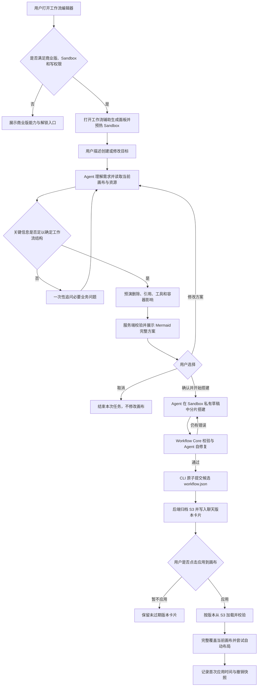

# Workflow Builder（工作流辅助生成）设计文档

## 1. 功能概述

Workflow Builder 是 FastGPT 工作流编辑器中的端到端辅助生成功能。用户使用自然语言描述新建或修改目标，系统负责把需求转化为一个经过校验、可以一键应用到当前画布的完整工作流版本。

它交付的不是建议、代码片段或部分节点，而是：

1. 理解当前画布和用户目标。
2. 补齐会改变工作流结构的必要业务信息。
3. 核对当前可用的系统配置、节点、模型、工具和其他受保护资源。
4. 对改造方案进行破坏性影响预演。
5. 生成并校验 Mermaid 方案预览。
6. 等待用户确认方案。
7. 在隔离的 Sandbox 草稿中完整搭建工作流。
8. 使用 Workflow Core 校验并驱动 Agent 自主修复。
9. 原子生成候选 `workflow.json`，归档为有时效的版本文件。
10. 等待用户第二次确认后，用候选版本覆盖当前画布。

因此，这项功能有两道明确的用户确认：

- 第一道确认：确认 Mermaid 方案，授权 Agent 开始搭建。
- 第二道确认：点击“应用到画布”，授权候选版本覆盖当前画布。

### 1.1 已实现能力

- 支持从零创建工作流和修改当前工作流。
- 支持普通节点、系统配置、全局变量、动态输入输出、执行边、分支、工具调用和容器关系。
- 支持读取当前画布事实与当前成员有权限使用的系统工具模板。
- 支持需求追问、方案修改和取消任务。
- 支持方案预演以及服务端 Mermaid 真实解析校验。
- 支持同一个 AgentLoop 中持续搭建、校验、自修复和提交。
- 支持分片 ChangeSet，避免复杂工作流一次工具调用过大。
- 支持生成过程、工具执行、交互和错误状态的 SSE 展示。
- 支持候选版本 S3 归档、聊天版本卡片、顶部待应用横幅和已生成版本再次应用。
- 支持应用失败时恢复应用前画布。
- 支持页面刷新后的交互恢复和生成状态恢复。
- 支持打开 Builder 面板时预热 Sandbox，减少首次生成等待时间。
- 支持简体中文、繁体中文和英文界面文案。
- 支持开发环境、主服务镜像和商业版镜像的依赖构建。

### 1.2 当前明确边界

- 完整生成能力依赖商业版 `pro` 后端、Agent Sandbox 和 S3 聊天文件存储。
- 用户必须对当前应用具有写权限。
- Builder 不会绕过用户确认自动覆盖画布。
- Builder 不在数据库中维护另一套工作流草稿状态；草稿和 CLI 事务文件位于 Sandbox。
- Builder 不通过研究型 Sandbox 工具直接读写当前工作流；当前工作流事实必须通过 Workflow CLI Gateway 获取。
- 候选版本不是永久版本，目前归档有效期为 1 天。
- 应用候选版本的产品语义是完整覆盖当前画布，不是与用户后续编辑做三方合并。
- 自动布局失败不影响候选 JSON 已经应用成功的业务结果。

## 2. 用户看到的完整流程



### 2.1 入口和可用性

入口位于 Workflow 编辑器左侧工具栏。系统根据以下条件决定入口行为：

| 条件 | 行为 |
| --- | --- |
| 系统尚未初始化 | 暂不显示入口 |
| `show_agent_sandbox` 关闭 | 不显示入口 |
| `show_workflow_builder` 显式为 `false` | 不显示入口 |
| 用户没有应用写权限 | 不显示入口 |
| 非商业版但其余条件满足 | 显示入口，打开后展示商业版能力和解锁按钮 |
| 商业版、Sandbox 开启且有写权限 | 启用完整 Builder 对话 |

首次进入工作流编辑器时，系统配置入口和 Workflow Builder 入口使用统一引导状态。Builder 支持：

- 独立左侧聊天面板。
- 模型选择，选择结果按应用保存在本地。
- 欢迎语和示例问题。
- 清空当前 Builder 会话历史。
- 收起后继续生成。
- 生成光环、待处理红点和待应用顶部横幅。

### 2.2 独立会话

Builder 使用 `ChatSourceTypeEnum.workflowBuilder`，不复用普通调试聊天。会话按以下维度隔离：

- 应用 `appId`
- 团队成员 `tmbId`
- Builder `chatId`

拥有应用写权限不代表可以读取其他成员的 Builder 会话。后端会同时校验应用权限和会话成员归属。

## 3. 一轮请求如何进入后端

用户发送消息时，前端从当前 React Flow 状态实时构造 `WorkflowDocument`：

- `app`：应用标识、名称、简介、类型和基础版本信息。
- `nodes`：当前完整节点配置。
- `executionEdges`：从 React Flow 边反编译得到的语义执行边。
- `chatConfig`：当前工作流对话配置。

前端计算文档 SHA-256 checksum，并把以下数据发送到商业版接口：

```text
POST /api/proApi/core/workflow/builder/chat
```

核心请求字段：

| 字段 | 作用 |
| --- | --- |
| `appId` | 当前工作流应用 |
| `chatId` | 独立 Builder 会话 |
| `responseChatItemId` | 当前 AI 消息标识，恢复时复用 |
| `messages` | 当前轮用户消息 |
| `model` | 用户选择的模型 |
| `agentPlanAskResponse` | 对需求追问或方案预览的结构化回答 |
| `workflowContext.document` | 请求开始时的完整画布事实 |
| `workflowContext.checksum` | 请求文档 checksum |

后端 Handler 依次完成：

1. 使用 API Schema 和 `parseApiInput` 校验请求。
2. 校验应用写权限、功能开关和 Agent Sandbox 开关。
3. 校验 Builder 会话属于当前成员。
4. 加载成员有权使用的系统工具模板，形成 `WorkflowTemplateBundle`。
5. 加载 Builder 聊天历史和未完成交互。
6. 校验新任务请求中画布文档的 `appId` 和 checksum。
7. 创建用量记录、聊天轮次和 SSE 上下文。
8. 调用主 `AgentLoop` Runner。
9. 持久化回答、工具过程、交互、最终文本和候选版本。

## 4. Agent 的业务生命周期

### 4.1 普通对话与工作流任务分流

Runner 首先判断用户是否真的在提出或继续一个工作流任务：

- 问候、能力咨询和无关问题直接自然语言回答。
- 创建、修改或继续搭建工作流才进入完整 Builder 生命周期。

普通对话不创建工作流计划、不查询画布，也不会产生候选版本。

### 4.2 需求建模

Agent 从用户输入中提炼：

- 业务目标。
- 触发方式和输入来源。
- 核心处理过程。
- 输出结果。
- 必要依赖。
- 成功标准。

只有缺失信息会改变节点类型、分支/循环/并行拓扑、执行方式、输入输出契约或核心结果时，Agent 才向用户追问。名称、文案和其他低影响细节使用合理默认值，避免把设计工作重新交给用户。

同一轮发现的缺口会合并为一次提问，最多提出三个简短业务问题。技术诊断、Schema 错误、连线错误和内部重试不会直接展示给用户处理。

### 4.3 事实和资源核对

当前工作流事实只能来自 `workflow_cli_query`。Agent 可以查询：

- 当前或草稿文档概览。
- 节点、输入、输出和可用引用。
- 执行边、分支、工具和容器子节点。
- 系统配置与全局变量。
- 内置模板和当前成员可使用的系统工具模板。
- 当前或草稿的 Workflow Core 校验结果。

研究 Sandbox 工具可以读取运行时 Skill 和用户输入文件，但不能访问私有事务目录、CLI 启动器或 `workflow.json`。

### 4.4 方案预演

在展示 Mermaid 之前，Agent 对会破坏现有工作流的操作做轻量预演：

| 操作 | 必须核对的影响 |
| --- | --- |
| 删除工具 | 所属工具调用节点是否还剩可执行工具 |
| 删除或重配节点/输出 | 是否仍被其他节点引用 |
| 删除循环终止节点 | 条件循环是否仍有退出路径 |
| 删除容器节点 | 是否会连带删除容器内子节点 |

能够安全修复的影响由 Agent 直接调整方案；需要业务取舍的影响才使用业务语言交给用户决定。配置完整性问题留到搭建后的正式校验阶段。

### 4.5 Mermaid 方案预览

Agent 必须调用专用工具 `workflow_builder_present_preview` 提交：

- 方案标题。
- 完整 Mermaid 源码。
- 至少一个自由结构的 Markdown 说明章节。

后端不会重写 Mermaid，而是使用与前端一致的 `mermaid` 解析器真实校验：

- 只接受 `flowchart TD` 或 `flowchart LR`。
- 使用独立 JSDOM 初始化 DOMPurify，不污染 Node.js 全局 DOM。
- 解析任务串行执行，避免 Mermaid 内部共享状态并发互相覆盖。
- 失败时把解析错误返回给 Agent，最多允许连续修复 3 次。
- 只有解析成功的源码才会形成 `workflowBuilderPreview` 交互并发送给前端。

前端不再负责把错误 Mermaid 猜测性转换为其他格式，因此不会展示一个已知无法渲染的空占位。

### 4.6 用户对预览的三种决定

| 动作 | 后端状态变化 |
| --- | --- |
| `confirm` | 标记方案已确认，允许进入连续搭建阶段 |
| `revise` | 把修改意见交回同一个 AgentLoop，要求重新提交完整预览 |
| `cancel` | 产生结构化取消事实并结束任务 |

预览未确认前，Gateway 会拒绝 `workflow_cli_stage` 和 `workflow_cli_commit`。确认后，普通 `ask_agent` 也会被拒绝，避免 Agent 在技术执行阶段再次暂停并把内部问题交给用户。

## 5. 单 Sandbox 运行架构

### 5.1 为什么使用单一物理 Sandbox

每个 Builder 会话复用一个按应用、成员和聊天隔离的物理 Sandbox。这样可以同时满足：

- Agent 研究工具、内置 Skill 和用户文件不需要重复准备。
- Workflow CLI 的草稿和分片可以跨 AgentLoop 轮次保留。
- 页面刷新或交互恢复后仍可继续当前任务。
- 避免研究 Sandbox 与 CLI Sandbox 分离后产生资源重复和状态漂移。

### 5.2 同一 Sandbox 内的权限分区

同一个物理 Sandbox 内分成两个逻辑区域：

```text
普通工作目录
└── Agent 研究工具、Skill、用户文件

.fastgpt/workflow-builder/
└── transaction/                 # 服务端私有事务区域
    ├── workflow.json
    ├── template-bundle.json
    ├── chunks/
    └── runs/
```

服务端研究执行器显式拦截任何包含私有目录、CLI 入口或 `workflow.json` 的参数。Agent 只能通过 Gateway 暴露的结构化工具访问当前工作流。

### 5.3 稳定运行时与动态轮次

可预热的稳定内容包括：

- Sandbox 实例和 provider 状态。
- 包镜像配置。
- Workflow Builder 内置 Skill。
- Workflow CLI 构建产物和启动器。
- Skill 扫描结果。

每轮请求动态写入：

- 当前 `WorkflowDocument`。
- 当前成员有权限使用的模板 Bundle。
- 当前用户输入文件。
- 本轮草稿、分片和运行目录。

前端首次打开可用 Builder 面板后调用：

```text
POST /api/proApi/core/workflow/builder/runtime/prewarm
```

预热按 runtime key 去重，失败不阻断面板使用；正式请求仍会再次确保环境可用。

## 6. Workflow CLI Gateway 与草稿事务

Agent 不直接拼接 shell 命令，而是使用三个结构化系统工具：

### 6.1 `workflow_cli_query`

只读工具，支持读取 `current` 或 `draft` 视图，承担：

- 当前事实查询。
- 模板和描述符查询。
- 输入输出、引用、边、工具和容器检查。
- 草稿校验。

### 6.2 `workflow_cli_stage`

把一个业务分片写入当前私有草稿：

1. Agent 按业务模块产生 ChangeSet 分片。
2. Gateway 校验分片结构、顺序、base checksum 和 draft revision。
3. CLI 在事务目录应用分片。
4. Workflow Core 返回变化摘要和诊断。
5. 成功后更新分片 Manifest 与草稿 revision。

复杂工作流通过多个有依赖顺序的分片完成，推荐顺序是：

1. 节点和系统配置。
2. 执行关系。
3. 输入引用、动态 IO、工具和容器关系。

### 6.3 `workflow_cli_commit`

提交前必须先执行 `workflow_cli_query` 的 draft validate，并携带最新 `draftRevision`。Commit 的职责是：

- 合并全部有效分片。
- 再次验证 base checksum、目标 checksum 和阻断诊断。
- 把最终候选文档原子写入 Sandbox 的 `workflow.json`。
- 返回 `candidate_ready` 和 `taskComplete: true`。

这里的 CLI Commit 只表示候选 JSON 已准备完成，不会修改用户画布，也不是版本接口的 applied commit。

同一修复目标的 Stage 或 Commit 最多允许连续失败 10 次。在到达结构化终止条件前，Agent 必须根据诊断自主修复。

## 7. Workflow Core 与 CLI

### 7.1 `@fastgpt/workflow-core`

Workflow Core 是与 UI、数据库和 Agent 解耦的领域层，负责：

- `WorkflowDocument` Schema 和兼容解析。
- Store Workflow 与语义文档互相编译。
- 节点模板实例化。
- 系统配置和全局变量描述符。
- 输入输出和变量引用编解码。
- 语义端口和执行边编译。
- 工具、容器和嵌套关系。
- ChangeSet 应用、合并和计划生成。
- checksum、诊断和完整工作流校验。

`WorkflowDocument` 是搭建过程中的唯一规范工作流状态：

```text
schemaVersion: fastgpt-workflow/v1
app
nodes
executionEdges
chatConfig
```

React Flow 坐标边不是 Agent 的主要编辑协议。Core 使用语义端口表达 `next`、`branch`、`catch`、`selectedTools` 等关系，最后再编译成 FastGPT Store Workflow。

### 7.2 `@fastgpt/workflow-cli`

Workflow CLI 是 Core 的文件和命令行适配层，提供：

- 文档初始化、导入、构建和查看。
- Meta、系统配置和全局变量操作。
- 模板、节点、输入、输出、边、工具和容器操作。
- 校验。
- ChangeSet plan/apply。
- JSON 结构化输出和稳定退出码。

Builder 运行时通过 Gateway 使用 CLI，不把完整命令面直接暴露给模型。

### 7.3 双重可信校验

Sandbox 和 CLI 的输出不是最终信任边界。服务端还会：

1. 使用 `WorkflowPlanSchema` 解析 Sandbox plan。
2. 校验 plan 的 base checksum。
3. 使用授权模板 Provider 在服务端重新执行 `planWorkflowChangeSet`。
4. 以服务端重算的 target document、checksum、changes 和 diagnostics 为准。
5. 再次应用 plan 并读取最终 `workflow.json`。
6. 校验目标 `appId` 和 target checksum。

只有通过上述检查的文档才能成为候选版本。

## 8. 候选版本、S3 归档和聊天卡片

### 8.1 候选版本产生时机

CLI Commit 成功后，Handler 在发布版本卡片前立即归档候选文档：

1. 解析并重新计算候选文档 checksum。
2. 为当前 Builder 会话分配递增 `versionNo`。
3. 生成名称和 JSON 文件名。
4. 上传到聊天文件 S3，设置 1 天过期时间。
5. 把版本对象写入当前 AI ChatItem。
6. 通过 SSE 发送版本卡片。

如果 S3 上传失败，本轮不会发布一个无法应用的版本卡片。

版本结构包含：

| 字段 | 语义 |
| --- | --- |
| `versionNo` | 当前 Builder 会话内的递增版本号 |
| `name` | 用户可见版本名 |
| `filename` | 归档 JSON 文件名 |
| `checksum` | 候选 WorkflowDocument checksum |
| `generatedAt` | 生成完成时间 |
| `s3Key` | 候选文档归档位置 |
| `expiresAt` | 版本过期时间 |
| `appliedAt` | 首次成功应用画布的时间 |

### 8.2 版本展示状态

| 状态 | 条件 | UI 行为 |
| --- | --- | --- |
| `ready` | 未过期且从未应用 | 展示“应用到画布” |
| `available` | 未过期且已经应用过 | 仍可再次应用 |
| `expired` | 已到 `expiresAt` | 禁止应用并提示过期 |

每个带 `s3Key` 且未过期的版本都可以从自己的 S3 对象独立加载，不依赖 Sandbox 中的最新草稿。未归档版本只支持从最新 Sandbox 读取。

## 9. 应用到画布的事务语义

用户点击版本卡片或顶部横幅的“应用到画布”后，前端执行：

1. 调用版本 load API，按 ChatItem 身份从 S3 加载文档。
2. 后端校验会话归属、过期时间、文档 Schema 和 checksum。
3. 前端把文档转换为当前应用类型可接受的 Workflow 配置。
4. 移除当前成员无权使用的模型引用。
5. 保存应用前的节点、边和 `chatConfig`。
6. 使用 `initData` 完整覆盖当前画布。
7. 尝试自动布局；布局失败只记录警告，不回滚业务配置。
8. 调用版本 commit API，幂等记录首次 `appliedAt`。
9. 写入“我的编辑”撤销快照并更新版本卡片状态。

版本接口为：

```text
POST /api/proApi/core/workflow/builder/version/load
POST /api/proApi/core/workflow/builder/version/commit
```

### 9.1 覆盖规则

应用版本就是完整覆盖当前画布。生成开始时的 base checksum 用于保证 Agent 在同一个基线上生成和校验候选版本，但用户最终点击应用时，不再要求当前画布仍等于生成基线，也不执行三方合并。

这意味着用户在生成期间对画布做的后续编辑可能被候选版本覆盖。第二道“应用到画布”确认就是这个覆盖动作的授权边界。

### 9.2 失败恢复

如果加载、转换、画布初始化或服务端 applied commit 失败：

- 前端展示统一失败提示。
- 在服务端 applied commit 成功前，尝试恢复应用前画布和 `chatConfig`。
- 原始错误不会被恢复错误覆盖。
- 版本过期使用独立提示。

服务端 commit 使用条件更新记录首次 `appliedAt`，并在并发请求下读取胜出的最终版本，保证幂等。

## 10. 交互恢复、状态和 SSE

### 10.1 可恢复交互

需求追问和 `workflowBuilderPreview` 都作为结构化 interactive 写入 AI ChatItem。用户回答后，Handler 在长任务开始前先持久化回答，因此刷新页面不会丢失“已经回答/已经确认”的事实。

预览修改意见继续使用同一个 AgentPlan；普通新任务会清除上一轮未完成 Plan，保留历史文本和 memories。

### 10.2 前端派生状态

前端从聊天记录和生成状态推导：

- `isChatGenerating`：聊天请求仍在运行。
- `isBuildingWorkflow`：已经确认预览但尚未产生版本或终止事实。
- `pendingInteractiveKey`：等待回答的需求问题或方案预览。
- `errorAttentionKey`：收起面板后出现的新错误。
- `latestVersion`：最新版本卡片和对应 AI 消息。

关键生成状态同时保存在 `sessionStorage`，用于 Fast Refresh 或页面刷新时避免入口光环瞬间丢失。

### 10.3 SSE 输出

Builder 复用 FastGPT 工作流 SSE 协议，主要发送：

- Agent 文本和 reasoning。
- 计划状态。
- `workflow_cli_query/stage/commit` 工具过程。
- Sandbox 初始化、升级和懒加载状态。
- 需求追问或方案预览 interactive。
- 候选版本卡片。
- 节点响应、用量、耗时、停止和错误事件。

工具过程默认收纳在“过程详情”，最终用户结论与版本卡片保持突出。

## 11. 前后端和两个仓库的职责

### 11.1 FastGPT 主仓库

| 模块 | 职责 | 关键位置 |
| --- | --- | --- |
| Workflow Core | 领域文档、命令、模板、边、引用、校验 | `packages/workflow-core/` |
| Workflow CLI | 文件和命令行适配、结构化输出 | `packages/workflow-cli/` |
| 全局契约 | Builder 版本、API、interactive、SSE 类型 | `packages/global/core/workflow/builder/`、`packages/global/openapi/core/workflow/builder/` |
| 前端 Builder | 入口、面板、聊天、状态、版本应用 | `projects/app/src/pageComponents/app/detail/WorkflowComponents/WorkflowBuilder/` |
| 通用聊天渲染 | 预览交互、版本卡片、过程详情 | `projects/app/src/components/core/chat/` |
| 共享 UI 与 i18n | 图标、样式、中文/繁中/英文文案 | `packages/web/` |

### 11.2 `pro` 商业版仓库

| 模块 | 职责 | 关键位置 |
| --- | --- | --- |
| API | chat、prewarm、version load/commit | `pro/admin/src/pages/api/core/workflow/builder/` |
| Handler | 权限、聊天轮次、SSE、持久化、版本归档 | `pro/admin/src/service/core/ai/workflowBuilder/handler.ts` |
| Runner | AgentLoop 生命周期、预览门禁、最终收尾 | `pro/admin/src/service/core/ai/workflowBuilder/runner.ts` |
| Preview Tool | 预览协议和服务端 Mermaid 校验 | `pro/admin/src/service/core/ai/workflowBuilder/previewTool.ts` |
| CLI Gateway | query/stage/commit、分片和修复门禁 | `pro/admin/src/service/core/ai/workflowBuilder/cliGateway.ts` |
| Sandbox | 预热、运行时准备、事务目录和 CLI 执行 | `pro/admin/src/service/core/ai/workflowBuilder/sandbox.ts` |
| Plan/Apply | 服务端重算、可信校验和候选生成 | `pro/admin/src/service/core/ai/workflowBuilder/plan.ts`、`apply.ts` |
| Version | S3 归档、加载、过期和 applied commit | `pro/admin/src/service/core/ai/workflowBuilder/version/service.ts` |
| Runtime Skill | Agent 操作知识和节点参考 | `pro/admin/src/service/core/ai/skill/builtin/workflow-builder/` |

Skill 文档按主题分片是运行时上下文优化，不应并入本设计文档。

## 12. 权限与安全边界

系统同时执行以下安全检查：

- 应用写权限。
- 商业版和功能开关。
- Agent Sandbox 开关。
- Builder 会话的 team/member 归属。
- 当前成员可使用的系统工具模板。
- 版本 ChatItem 与当前成员归属。
- S3 文件过期时间。
- 文档 Schema、`appId` 和 checksum。
- Sandbox plan 的服务端 Workflow Core 重算。
- 研究工具对私有事务目录的访问阻断。
- CLI 参数使用结构化 Schema，不允许 Agent 任意执行事务 shell。

画布权限和会话权限是两件事：即使两个成员都能编辑同一个应用，也不能互相读取或应用对方 Builder 会话里的私有生成版本。

## 13. 构建与部署

### 13.1 本地开发

仓库根命令：

```bash
pnpm dev:pro
```

会先执行：

```bash
pnpm run build:workflow-packages
```

该命令按顺序构建：

```bash
pnpm --filter @fastgpt/workflow-core build
pnpm --filter @fastgpt/workflow-cli build
```

根 `postinstall` 也会构建这两个包，因此首次安装依赖后即可启动包含 Builder 的开发环境。

### 13.2 Docker 镜像

- `projects/app/Dockerfile` 构建 `@fastgpt/workflow-core`，用于主服务前端和共享工作流适配。
- `pro/admin/Dockerfile` 构建 `@fastgpt/workflow-core` 与 `@fastgpt/workflow-cli`。
- 商业版 runner 镜像会复制 `packages/workflow-cli/package.json` 和 `packages/workflow-cli/dist`，供运行时打包 CLI 到 Sandbox。
- 商业版 runner 镜像会复制内置 Skill 目录，供 Sandbox 运行时部署 Workflow Builder Skill。

因此，使用当前两个仓库构建出的匹配版本主服务镜像与商业版镜像部署后，Workflow Builder 所需的 Core、CLI、后端 API 和运行时 Skill 才是完整闭环。

### 13.3 运行依赖

部署环境还必须正确提供：

- 商业版 API 路由代理。
- 可用的 Agent Sandbox provider。
- Sandbox 镜像/运行时依赖。
- 聊天文件 S3 存储。
- 可用 LLM 模型和团队额度。
- `isPlus`、`show_agent_sandbox` 和 `show_workflow_builder` 对应配置。

## 14. 错误处理和终止边界

| 阶段 | 处理方式 |
| --- | --- |
| 请求 Schema、权限或开关失败 | 在进入 AgentLoop 前返回用户错误 |
| Sandbox 初始化失败 | 发送结构化 Sandbox/流错误，不产生版本 |
| Mermaid 解析失败 | 返回 Agent 自动修复，最多 3 次 |
| Stage/Commit 诊断失败 | Agent 根据 Core 诊断自修复，同一目标最多 10 次 |
| S3 归档失败 | 本轮失败，不发布不可用版本卡片 |
| 版本加载过期或 checksum 不一致 | 拒绝应用并展示明确错误 |
| 前端应用失败 | 在 applied commit 前恢复旧画布 |
| 自动布局失败 | 保留已应用业务配置，只记录警告 |
| 用户取消 | 产生结构化取消事实，不生成候选版本 |
| 浏览器断开 | Runner 检查连接状态并由聊天轮次记录错误/恢复状态 |

Runner 只有在以下事实之一成立时才允许结束一项工作流任务：

- 需要用户补充会改变结构的业务信息。
- 已经提交可确认的方案预览。
- 用户取消。
- CLI 已经产生 `candidate_ready`。
- 到达结构化失败边界。

“任务复杂”“先完成一部分”“建议用户手动连线”都不是合法完成条件。

## 15. 测试体系

### 15.1 Workflow Core

`packages/workflow-core/test/` 覆盖：

- 文档 Schema、checksum 和 Store roundtrip。
- 模板实例化和默认值。
- 节点、边、引用、动态 IO、工具和容器命令。
- ChangeSet apply/merge/plan。
- 系统配置和全局变量。
- 校验诊断。
- 线性、分支、工具调用、动态 IO、catch 和嵌套循环 fixtures。

### 15.2 Workflow CLI

`packages/workflow-cli/test/` 覆盖：

- 参数解析和命令注册。
- 文档文件 IO。
- ChangeSet。
- 模板 Provider 契约。
- JSON 输出。
- 端到端命令。
- CLI 二进制和发布包 smoke test。

### 15.3 FastGPT 前端与共享契约

主要覆盖：

- WorkflowDocument 与画布互转。
- Builder 版本状态和应用数据合并。
- 预览 interactive 的确认、修改和取消。
- ChatBox 恢复、实例隔离和 SSE 渲染。
- OpenAPI Schema 和 i18n 资源加载。

### 15.4 商业版 Builder

`pro/admin/test/core/ai/workflowBuilder/` 覆盖：

- Handler 权限、聊天轮次和持久化。
- Runner 生命周期和终止事实。
- Mermaid 校验与预览协议。
- CLI Gateway query/stage/commit 门禁。
- Sandbox 准备、预热和运行时隔离。
- Plan 服务端重算和候选 apply。
- S3 版本归档、加载、过期和幂等 commit。
- 回归案例目录、语义断言和可选真实模型评测。

### 15.5 常用验证命令

```bash
pnpm --filter @fastgpt/workflow-core typecheck
pnpm --filter @fastgpt/workflow-core test
pnpm --filter @fastgpt/workflow-cli test:ci
pnpm --filter @fastgpt/app typecheck
pnpm --filter @fastgpt/admin typecheck
pnpm --filter @fastgpt/admin test
pnpm --filter @fastgpt/admin typecheck:workflow-builder:eval
pnpm --filter @fastgpt/admin test:workflow-builder:eval
```

真实模型评测不是普通 PR 必跑项，需要显式的模型、服务地址、鉴权和 Sandbox 环境。

## 16. 当前完成状态和维护约束

### 16.1 当前已经闭环

- 从入口、独立会话到 Agent 执行。
- 从当前画布快照到 CLI 私有草稿。
- 从需求闭合、预演到 Mermaid 确认。
- 从分片搭建、校验修复到候选提交。
- 从候选 S3 归档到版本卡片。
- 从用户二次确认到完整画布覆盖和 applied 记录。
- 从开发构建到主服务/商业版 Docker 镜像依赖携带。
- 从单元测试到 Builder 回归和真实模型评测入口。

### 16.2 修改时必须保持的关键不变量

1. 当前画布事实只能通过 Workflow CLI Gateway 进入 Agent。
2. 预览未确认前不能 Stage 或 Commit。
3. Mermaid 必须在后端真实解析成功后才能发送给前端。
4. 用户确认预览后，不再因技术实现问题打断用户。
5. 只有 draft validate 成功才能 CLI Commit。
6. Sandbox plan 必须经过服务端 Workflow Core 重算。
7. S3 归档成功后才能发布当前格式的版本卡片。
8. CLI Commit 不得直接修改画布。
9. 覆盖画布必须由用户点击“应用到画布”触发。
10. 会话归属不能被应用写权限替代。
11. Skill 运行时文档保持按需分片，设计文档不得成为 Agent 操作契约的唯一来源。
12. 修改用户可见文案时同步维护简中、繁中和英文 i18n。
