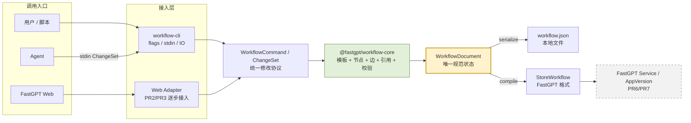
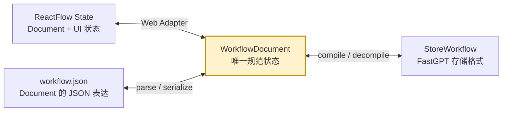
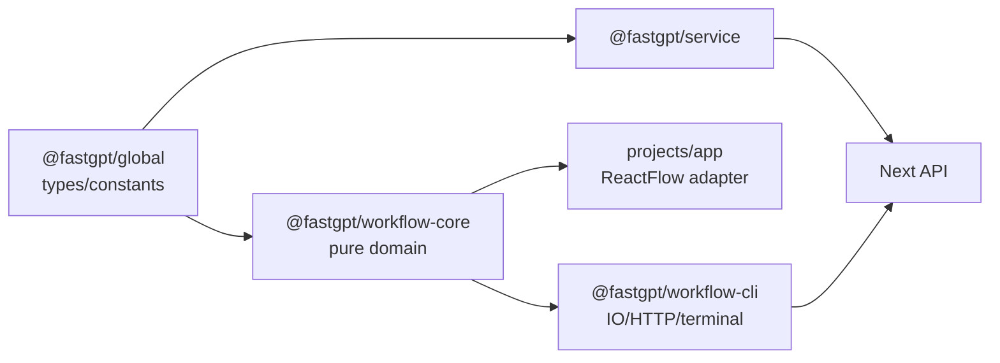
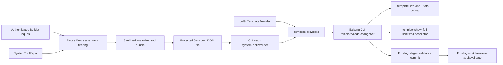

# Workflow CLI Builder 功能开发文档

## 0. 文档标识

- 文档状态：开发中
- 修订日期：2026-08-04
- 关联需求文档：`workflow-cli-builder-需求设计文档.md`
- 实施原则：先共享领域核心，再接 Web 和 CLI，最后接远端
- 文档范围：模块设计、实施任务、测试与发布方案
- Agent 接入范围：PR1 到 PR4 保证具备 Shell 能力的 Agent 可调用 CLI；PR5 在 Workflow 编辑器内注入单一内置 `workflow-builder` Skill，不实现通用 MCP Adapter

## 1. 开发目标和硬约束

### 1.1 开发目标

构建一个不依赖 React、ReactFlow、Next.js 和浏览器 API 的工作流领域核心，让以下两个入口执行同一套规则：

```text
Web command adapter ─┐
                     ├─> @fastgpt/workflow-core ─> WorkflowDocument ─> StoreWorkflow
CLI command handler ─┘
```

第一阶段完成本地闭环：

```text
load/import
  -> resolve template
  -> apply WorkflowCommand
  -> validate
  -> build StoreWorkflow
  -> atomic write
```

### 1.2 硬约束

1. `packages/global/core` 只继续提供已有共享类型、常量和基础工具，不承载 editor 业务实现。
2. `packages/workflow-core` 必须保持 browser-safe，不引用 `fs`、React、ReactFlow、Next.js 或服务端 SDK。
3. 文件 IO、终端交互、HTTP profile 和进程退出码位于 `packages/workflow-cli`。
4. 后端权限与数据写入继续位于现有 service/API 层。
5. API 入参修改必须使用 `parseApiInput` 和 OpenAPI schema。
6. Web 迁移必须通过 adapter，不能把 ReactFlow 类型扩散到 workflow-core。
7. 每条 mutation 都通过统一 command dispatcher，禁止 CLI command 直接修改数组。
8. 本地 JSON 约束、Confirm 和远端版本冲突都要由代码重新计算，不能信任文件内布尔值。
9. CLI/Agent 参数语义通过独立 Template Descriptor 暴露，不向运行时节点 Schema 混入 CLI 专用字段。
10. CLI 本体不新增通用 Skill、MCP Server 或 MCP Adapter；PR5 的 `workflow-builder` 仅是产品层内置 Skill，不进入 WorkflowDocument、StoreWorkflow 或 CLI 领域 Schema。
11. 当前 Builder 的系统工具事实源仍是 Service 层 SystemToolRepo；Core 继续使用现有 Provider 契约，CLI 只消费注入的组合 Provider，两者都不存工具全量数据。
12. 系统工具 Provider 必须使用字段 allowlist 构造脱敏模板，不得进入 `secretsVal`、token、credential、Authorization 或存在性泄露信息。
13. 外层 Agent Loop 仍使用 `workflow_cli_query`、`workflow_cli_stage`、`workflow_cli_commit`；系统工具作为 CLI Template Provider 数据源接入，不扩张 Agent Loop 的工具面。

### 1.3 Core 抽取与最小 CLI 落地总览

#### 1.3.1 抽取目标

PR1 采用纵向切片，不一次性搬迁 FastGPT Web 的全部工作流逻辑。交付目标是抽取能够构建基础线性工作流的最小 Core，同时打通 CLI 输入、Document 修改、StoreWorkflow 编译和本地文件写入的完整闭环。

`@fastgpt/workflow-core` 是 browser-safe TypeScript package，不启动进程、不监听端口。Web 和 CLI 将动作适配为相同的 `WorkflowCommand`，Core 只根据输入文档和显式依赖返回新文档与诊断。

```text
Current WorkflowDocument + WorkflowCommand + Dependencies
  -> structuredClone
  -> dispatch command
  -> command invariant validation
  -> WorkflowCommandResult
```

Core 不直接等于 ReactFlow。节点数据复用 `StoreNodeItemType`，执行边使用稳定的语义端口；ReactFlow 的 Node/Edge 外层、selected、zIndex、viewport、节点尺寸和临时 debug 状态继续由 Web Adapter 管理。

#### 1.3.2 PR1 数据流



状态转换单独表达，避免把 UI 适配、文件持久化和服务端编译混在调用图中：



三种转换的实现边界：

| 转换 | 所属模块 | PR1 要求 |
| --- | --- | --- |
| `workflow.json <-> WorkflowDocument` | CLI codec + Core Schema/normalize | 稳定序列化、schemaVersion、错误不覆盖原文件 |
| `WorkflowDocument <-> StoreWorkflow` | Core store compiler/decompiler | 普通节点和 next/target 边语义往返 |
| `ReactFlow State <-> WorkflowDocument` | Web Adapter | PR1 先用 fixture 固化当前行为，PR2/PR3 按动作接入 |

#### 1.3.3 PR1 首批节点

PR1 只支持能够证明基础工作流构建链路的四类内置节点：

| 节点 | Core 实现重点 | 可执行的最小场景 |
| --- | --- | --- |
| SystemConfig | 默认存在、唯一且不可删除/复制；配置读取 `chatConfig` | 提供变量和工作流开关的统一 Web 编辑入口 |
| WorkflowStart | 唯一性、系统输出、默认 userChatInput/userFiles 引用 | 提供工作流入口 |
| AI Chat | 完整模板实例化、模型和提示词参数、用户输入引用 | Start -> AI Chat |
| Text Editor | 固定文本和 VariableRef 输入 | Start -> Text Editor |
| Assigned Answer | 固定值/引用作为回答、普通 target 端口 | Text Editor -> Assigned Answer |

模板实例化必须读取现有 FastGPT 原始模板，保留 inputs、outputs、toolConfig、pluginData、catchError 等运行字段。CLI/Agent 参数说明通过 Descriptor 和 Automation Metadata 暴露，但这些元数据不得进入节点、`workflow.json` 或 StoreWorkflow。

#### 1.3.4 PR1 Core 操作面

| 分类 | PR1 操作 | 主要输出 |
| --- | --- | --- |
| Document | create、parse、normalize、serialize、基础 checksum | `WorkflowDocument` |
| Template | builtin list/show、descriptor normalize、instantiate | 完整 `StoreNodeItemType` |
| Node | list、show、add、add-after | 新节点及必要执行边 |
| Input | set literal、set VariableRef | 更新后的节点 input value |
| Edge | parse next/target、compile/decompile 普通边 | `WorkflowExecutionEdge` / `StoreEdgeItemType` |
| Validation | Schema、节点 ID、必填输入、普通边、引用、Start 可达性 | `WorkflowDiagnostic[]` |
| Store | compile、decompile、semantic round-trip | `StoreWorkflow` |

`node add --after` 必须只生成一个 `AddNodeCommand`，通过 `connectFrom` 在 Core 内原子完成“创建节点 + 连接边”。执行失败时不返回新节点，也不写入文件。

#### 1.3.5 PR1 CLI Demo

PR1 CLI 开放以下命令：

```text
init
build
template list
template show
node list
node show
node add
input set
input ref
validate
```

最小验收流程：

```bash
fastgpt-workflow init --dir ./demo
fastgpt-workflow node add --dir ./demo --node ai --template builtin:ai-chat --after start@next
fastgpt-workflow input ref --dir ./demo --node ai --key userChatInput --from start.userChatInput
fastgpt-workflow input set --dir ./demo --node ai --key systemPrompt --value "You are a helpful assistant"
fastgpt-workflow validate --dir ./demo
fastgpt-workflow build --dir ./demo --output ./demo/workflow.generated.json
```

验收条件：

1. `workflow.json` 可以稳定 parse/serialize，失败不产生半写入文件。
2. 生成的 StoreWorkflow 可被当前 FastGPT Web 正确读取。
3. Start、AI Chat、输入引用和普通执行边保持完整。
4. `StoreWorkflow -> WorkflowDocument -> StoreWorkflow` 规范化后语义等价。
5. 人工 CLI flags 和直接调用同一 Command 得到相同 Document。
6. `--dry-run` 零写入，`--format json` 的 stdout 只包含结构化结果。

#### 1.3.6 后续增量操作

| 阶段 | 新增节点和操作 | Core 演进重点 |
| --- | --- | --- |
| PR2 | 知识库搜索、问题优化、内容提取、HTTP、代码、调用应用；node update/remove/clone；edge connect/disconnect/reconnect；input unset；App/ChatConfig/global variables | 完整线性工作流和共享 Validator |
| PR3 | 条件分支、catch、工具调用、动态 IO、循环和容器节点；insert、复杂 reconnect、attach/detach tool、父子移动 | 复杂图语义、副作用和 Web action 迁移 |
| PR4 | 不新增节点；ChangeSet、plan/apply、checksum、Confirm、CI | 自动化事务和本地 CLI Beta |
| PR5 | Workflow ChatBox、独立 Builder Handler、App Sandbox、内置 Skill、CLI 调用、ChangeSet 预览/应用 | 端到端 Workflow 辅助生成 Demo |
| PR5 后续增强 | 当前实例系统工具授权目录、组合 Provider、类型/数量输出、Skill 约束 | 不改 Agent Loop 工具面地扩展 Builder 能力 |
| PR6 | 远端 Team App、System Tool、Tool 模板 Provider；pull/versions/preview | 远端只读和反编译 |
| PR7 | draft save、publish、run、debug | 权限、发布校验和乐观并发 |

所有后续操作继续扩展 `WorkflowCommandSchema` 和同一个 dispatcher。禁止在 CLI Handler、Web Context 或远端 Client 中形成第二套节点、边和引用修改逻辑。

#### 1.3.7 开发顺序

PR1 固定按以下顺序实施：

1. 从当前 Web 导出并脱敏 `basic-ai`、`basic-static` fixture，建立 Characterization Tests。
2. 创建 `workflow-core` 和 `workflow-cli` package，锁定依赖方向。
3. 定义 PR1 范围内的 Document、Diagnostic、ExecutionPortRef、VariableRef、Descriptor 和 Command Schema。
4. 实现普通 edge compiler/decompiler 和 StoreWorkflow round-trip。
5. 实现四类内置模板的 Provider、Descriptor 与完整节点实例化。
6. 实现 AddNode、SetInputValue、SetInputReference 和 dispatcher。
7. 实现最小 Validator、文件 codec、原子 IO 和 CLI Registry。
8. 完成 CLI 端到端、golden、失败不写盘、JSON contract 和确定性构建测试。

## 2. 总体模块设计

### 2.1 新增 package

```text
packages/
├── workflow-core/
│   ├── package.json
│   ├── tsconfig.json
│   ├── tsdown.config.ts
│   ├── src/
│   │   ├── domain/
│   │   ├── command/
│   │   ├── template/
│   │   ├── edge/
│   │   ├── reference/
│   │   ├── nesting/
│   │   ├── validation/
│   │   ├── store/
│   │   └── index.ts
│   └── test/
└── workflow-cli/
    ├── package.json
    ├── tsconfig.json
    ├── tsdown.config.ts
    ├── src/
    │   ├── cli.ts
    │   ├── registry.ts
    │   ├── context.ts
    │   ├── options/
    │   ├── commands/
    │   ├── io/
    │   ├── remote/
    │   ├── output/
    │   └── index.ts
    └── test/
```

两个目录都匹配 `pnpm-workspace.yaml` 的 `packages/*`，无需新增 workspace 路径。

建议包名：

- `@fastgpt/workflow-core`
- `@fastgpt/workflow-cli`

### 2.2 依赖方向



禁止依赖：

- `workflow-core -> workflow-cli`
- `workflow-core -> projects/app`
- `workflow-core -> packages/service`
- `packages/global -> workflow-core`

### 2.3 当前实例系统工具接入架构

这条链路使用 Builder Handler 已有的 Web 会话身份，不等待 PR6 的独立 CLI profile/API Key。Core 已有 `systemTool` TemplateRef 和 `WorkflowTemplateProvider`，CLI 已有完整的模板、ChangeSet 和校验链路，因此只补一个动态 Provider 并替换当前 builtin-only 注入点：



责任分配：

| 层 | 实现责任 | 禁止事项 |
| --- | --- | --- |
| SystemToolRepo | 合并插件服务和 Mongo 系统工具事实 | 为 CLI 维护副本 |
| System Tool Capability Service | 抽取 Web 当前可见性规则，返回已授权目录并按需生成脱敏 preview | 将越权条目或 Secret 返回给 Provider |
| Authorized Tool Bundle | 保存当前请求已授权的摘要和脱敏完整模板，同时供 Sandbox CLI 与服务端 plan 重算使用 | 保存 Secret、跨请求复用或成为长期工具仓库 |
| authorizedSystemToolProvider | 从 bundle 构造；`list()` 返回已授权引用，`resolve()` 只解析 bundle 中的 ID | 保存跨请求权限结论或自行实现用户鉴权 |
| CLI | 从 `CliContext` 取得组合 Provider，用现有 list/show/mutation/ChangeSet 链路消费 | 硬编码系统工具清单或另建系统工具命令体系 |
| workflow-core | 继续使用现有 TemplateRef、Provider、实例化和校验能力 | 新增权限模型、访问数据库或认证用户 |
| Gateway/Handler | 按当前身份构造组合 Provider，并注入 CLI 与服务端 plan 重算 | 新增 Agent Loop tool 或改变 stage/commit 协议 |
| 运行 Service | 延续现有工具状态检查和 Secret 解析 | 依赖 CLI 保存工具密钥 |

计划文件落点：

| 文件 | 计划改动 |
| --- | --- |
| `packages/service/core/app/tool/systemTool/capability.ts` | 抽取 Web API 和 Builder 共用的授权目录、精确详情解析和脱敏 presenter |
| `projects/app/src/pages/api/core/app/tool/getSystemToolTemplates.ts` | 保留 API 边界鉴权/入参/响应解析，内部调用 Capability Service，不复制过滤逻辑 |
| `packages/workflow-core/src/template/compose.ts` | 提供轻量 Provider 组合器；不新增授权快照 Schema |
| `packages/workflow-cli/src/type.ts`、`src/run.ts` 与模板 Provider loader | 从受控文件加载 systemTool Provider 并注入现有 `CliContext`；未提供文件时仍为 builtin-only |
| `packages/workflow-cli/src/commands/template.ts` | 从 Context Provider 读取模板，输出 `kind`、`total`、`counts`、`items`，保留精确 show |
| `packages/workflow-cli/src/commands/changeSet.ts` 及模板实例化命令 | 移除 builtin provider 硬编码，从 `CliContext` 获取 Provider |
| `pro/admin/src/service/core/ai/workflowBuilder/systemToolBundle.ts` | 按 Builder 身份构造 request-scoped 授权脱敏数据；服务端可从该数据构造 Provider |
| `pro/admin/src/service/core/ai/workflowBuilder/sandbox.ts` | 将 bundle 写入事务受保护目录，并通过固定环境变量把路径传给 CLI launcher |
| `pro/admin/src/service/core/ai/workflowBuilder/cliGateway.ts` | 复用现有 query/stage/commit，仅映射模板列表和详情查询 |
| `pro/admin/src/service/core/ai/workflowBuilder/plan.ts` | 服务端重算使用同一个组合 Provider，不再固定 builtin-only |
| `pro/admin/src/service/core/ai/skill/builtin/workflow-builder/` | 补充查看类型、数量、列表和精确 Descriptor 的流程，不存具体工具数据 |

Provider 使用方式：

1. `template list` 调用组合 Provider 的 `list()`，返回 builtin 与当前授权 systemTool，并增加模板类型和数量统计。
2. `template show --template systemTool:<id>` 调用同一 Provider 的 `resolve()`，按需生成完整脱敏节点和 Descriptor。
3. Builder 服务端保留 bundle 的内存值，同时把完全相同的数据写入事务受保护 JSON 文件；CLI 子进程从该文件构造 Provider，不能接收 Agent 指定的文件路径。
4. 节点创建、工具挂载、ChangeSet plan/apply 和 Builder 服务端重算都基于该 bundle 使用组合 Provider；目录外 ID 在 `resolve()` 时统一失败。
5. 每次新 Builder 请求重新读取 Capability Service 并覆盖文件，所以系统工具更新无需 cron 或 Core/CLI 同步；该文件只是子进程传输载体，不是新的持久化模型。

## 3. workflow-core 文件设计

### 3.1 文件清单

| 文件 | 职责 | 关键导出 |
| --- | --- | --- |
| `src/domain/document.ts` | Document schema/type | `WorkflowDocumentSchema`、`WorkflowDocument` |
| `src/domain/diagnostic.ts` | 统一诊断 | `WorkflowDiagnostic`、`DiagnosticCode` |
| `src/domain/checksum.ts` | 规范化和 checksum | `normalizeWorkflowDocument()`、`getWorkflowChecksum()` |
| `src/edge/type.ts` | 语义执行端口和边 | `ExecutionSourcePortRef`、`WorkflowExecutionEdge` |
| `src/edge/parser.ts` | CLI 语义字符串解析 | `parseExecutionPortRef()` |
| `src/edge/compiler.ts` | 语义边与 StoreEdge 互转 | `compileExecutionEdge()`、`decompileStoreEdge()` |
| `src/reference/type.ts` | 数据引用 | `VariableRefSchema` |
| `src/reference/codec.ts` | Document/Store 数据引用编解码 | output key/id 与文本占位符双向转换 |
| `src/reference/service.ts` | set/unset/available | `setInputReference()`、`getAvailableVariables()` |
| `src/template/type.ts` | 模板引用和 provider 接口 | `NodeTemplateRef`、`WorkflowTemplateProvider` |
| `src/template/builtin.ts` | 内置模板 provider | `builtinTemplateProvider` |
| `src/template/descriptor.ts` | 机器可读模板参数契约 | `NodeTemplateDescriptor`、`NodeParameterDescriptor` |
| `src/template/normalize.ts` | 现有模板到 Descriptor 的归一化 | `normalizeNodeTemplateDescriptor()` |
| `src/template/automationMeta.ts` | CLI/Agent 补充元数据 | `NodeTemplateAutomationMeta`、`getAutomationMeta()` |
| `src/template/instantiate.ts` | 完整节点实例化 | `instantiateNodeFromTemplate()` |
| `src/nesting/rules.ts` | 容器规则 | `checkCanMoveIntoParent()` |
| `src/nesting/service.ts` | 父子关系更新 | `moveNodeToParent()`、`removeParentCascade()` |
| `src/command/type.ts` | Command/ChangeSet schema | `WorkflowCommandSchema`、`WorkflowChangeSetSchema` |
| `src/command/apply.ts` | 单命令 dispatcher | `applyWorkflowCommand()` |
| `src/command/applyChangeSet.ts` | 批量原子执行 | `applyWorkflowChangeSet()` |
| `src/command/node.ts` | node commands | `addNode()`、`removeNode()`、`cloneNode()` |
| `src/command/edge.ts` | edge commands | `connectEdge()`、`insertNodeOnEdge()` |
| `src/command/input.ts` | input/output commands | `setInputValue()`、`removeOutput()` |
| `src/command/config.ts` | App 元数据、ChatConfig、全局变量 | `updateAppMeta()`、`updateChatConfig()`、`addGlobalVariable()` |
| `src/validation/schema.ts` | schema 诊断 | `validateWorkflowSchema()` |
| `src/validation/document.ts` | 节点和父子规则 | `validateWorkflowDocument()` |
| `src/validation/graph.ts` | 图和端口规则 | `validateWorkflowGraph()` |
| `src/validation/reference.ts` | 引用规则 | `validateWorkflowReferences()` |
| `src/validation/index.ts` | 聚合校验 | `validateWorkflow()` |
| `src/store/compile.ts` | Document -> Store | `compileStoreWorkflow()` |
| `src/store/decompile.ts` | Store -> Document | `decompileStoreWorkflow()` |
| `src/index.ts` | browser-safe 统一导出 | 上述公共 API |

### 3.2 领域类型

```ts
import {
  StoreEdgeItemTypeSchema,
  StoreNodeItemTypeSchema
} from '@fastgpt/global/core/workflow/type';

export const WorkflowDocumentSchema = z.object({
  schemaVersion: z.literal('fastgpt-workflow/v1'),
  app: z.object({
    appId: z.string().optional(),
    name: z.string().optional(),
    intro: z.string().optional(),
    appType: z.string().optional(),
    baseVersionId: z.string().optional()
  }),
  nodes: z.array(StoreNodeItemTypeSchema),
  executionEdges: z.array(WorkflowExecutionEdgeSchema),
  chatConfig: AppChatConfigSchema
});
```

注意：示例表示结构方向，实际 import 应以仓库现有类型导出位置为准，不为 CLI 复制 StoreNode/ChatConfig schema。

### 3.3 Template Descriptor

#### 3.3.1 类型定义

`FlowNodeInputItemTypeSchema` 同时服务于模板、ReactFlow 节点和 StoreNode。CLI/Agent 专用字段不能直接加到这个共享输入结构，否则会进入 Web 节点状态或 StoreWorkflow。

workflow-core 定义独立 Descriptor：

```ts
export type NodeTemplateDescriptor = {
  template: NodeTemplateRef;
  name: string;
  intro?: string;
  flowNodeType: string;
  inputs: NodeParameterDescriptor[];
  outputs: NodeOutputDescriptor[];
  constraints: {
    unique: boolean;
    isTool: boolean;
    allowedParents?: string[];
  };
};

export type NodeOutputDescriptor = {
  id: string;
  key: string;
  label: string;
  description?: string;
  valueType?: string;
  required: boolean;
  executable: boolean;
};

export type NodeParameterDescriptor = {
  key: string;
  label: string;
  description: string;
  valueType?: string;
  required: boolean;
  defaultValue?: unknown;
  defaultPolicy: 'template' | 'userRequired' | 'remoteValidated';
  resourceKind?: 'dataset' | 'model' | 'app' | 'tool' | 'secret';
  bindingRequired: boolean;
  configurable: boolean;
  inputModes: Array<'literal' | 'reference' | 'secret'>;
  enum?: Array<{
    label?: string;
    value: string;
    description?: string;
  }>;
  constraints?: {
    min?: number;
    max?: number;
    minLength?: number;
    maxLength?: number;
    valueSchema?: Record<string, unknown>;
  };
  examples?: unknown[];
};

export type NodeTemplateAutomationMeta = {
  inputs?: Record<
    string,
    {
      configurable?: boolean;
      agentHint?: string;
      valueSchema?: Record<string, unknown>;
      examples?: unknown[];
      defaultPolicy?: 'template' | 'userRequired' | 'remoteValidated';
      resourceKind?: 'dataset' | 'model' | 'app' | 'tool' | 'secret';
      bindingRequired?: boolean;
    }
  >;
};

export type ResolvedWorkflowTemplate = {
  template: FlowNodeTemplateType;
  automationMeta?: NodeTemplateAutomationMeta;
  validatedInputDefaults?: Record<string, { provided: true; value: unknown }>;
};
```

#### 3.3.2 归一化逻辑

```ts
export const normalizeNodeTemplateDescriptor = ({
  template,
  templateRef,
  automationMeta,
  locale
}: NormalizeNodeTemplateDescriptorParams): NodeTemplateDescriptor => ({
  template: templateRef,
  name: resolveLocale(template.name, locale),
  intro: resolveLocale(template.intro, locale),
  flowNodeType: template.flowNodeType,
  inputs: template.inputs
    .filter((input) => input.deprecated !== true)
    .map((input) => {
      const meta = automationMeta?.inputs?.[input.key];
      return {
        key: input.key,
        label: resolveLocale(input.label, locale),
        description: resolveLocale(
          meta?.agentHint ?? input.toolDescription ?? input.description ?? input.label,
          locale
        ),
        valueType: input.valueType,
        required: input.required ?? false,
        defaultValue: input.defaultValue ?? input.value,
        defaultPolicy: meta?.defaultPolicy ?? 'template',
        resourceKind: meta?.resourceKind,
        bindingRequired: meta?.bindingRequired ?? false,
        configurable: meta?.configurable ?? input.canEdit !== false,
        inputModes: renderTypesToInputModes(input.renderTypeList),
        enum: input.list,
        constraints: {
          min: input.min,
          max: input.max,
          minLength: input.minLength,
          maxLength: input.maxLength,
          valueSchema: meta?.valueSchema
        },
        examples: meta?.examples
      };
    }),
  outputs: template.outputs
    .filter((output) => output.deprecated !== true)
    .map((output) => ({
      id: output.id,
      key: output.key,
      label: resolveLocale(output.label, locale),
      description: output.description
        ? resolveLocale(output.description, locale)
        : undefined,
      valueType: output.valueType,
      required: output.required ?? false,
      executable: output.type === FlowNodeOutputTypeEnum.source
    })),
  constraints: {
    unique: template.unique === true,
    isTool: template.isTool === true
  }
});
```

实现要求：

- 普通字段从现有模板实时归一化，不在 CLI 维护第二份 `label/description/valueType`。
- `NodeTemplateAutomationMeta` 只补充现有模板无法表达的 Agent/CLI 信息。

#### 3.3.3 输入初始值解析

新增 `packages/workflow-core/src/template/defaultValue.ts`，集中实现值来源优先级；禁止在 builtin template、CLI handler 或 Agent 示例中分散判断资源字段。

```ts
const hasOwn = (value: object, key: PropertyKey) =>
  Object.prototype.hasOwnProperty.call(value, key);

export const resolveInitialInputValue = ({
  input,
  meta,
  validatedRemoteDefault
}: ResolveInitialInputValueParams) => {
  if (validatedRemoteDefault?.provided === true) {
    return structuredClone(validatedRemoteDefault.value);
  }

  if ((meta?.defaultPolicy ?? 'template') === 'template') {
    return structuredClone(input.defaultValue ?? input.value);
  }

  return getResourceSafeEmptyValue({
    valueType: input.valueType,
    resourceKind: meta?.resourceKind
  });
};
```

`getResourceSafeEmptyValue()` 规则：

| 输入 | 空值 |
| --- | --- |
| `resourceKind=dataset` / `selectDataset` | `[]` |
| `resourceKind=model/app/secret` | `undefined` |
| `resourceKind=tool` | 不实例化资源节点，不创建 selectedTools edge |
| 非资源数组且模板无默认值 | `[]` |
| 其他字段且模板无默认值 | `undefined` |

用户显式值不在该 helper 内解析。`node.add.inputOverrides` 在模板实例化后通过 `hasOwn(inputOverrides, inputKey)` 应用，确保 `[]`、`''`、`false` 和 `0` 都能覆盖远端值及模板默认值。

Start 默认引用作为实例化的后置步骤执行：仅当 `hasConfiguredValue(input.value) === false`、输入支持 reference 且共享 `areWorkflowValueTypesCompatible()` 认可源输出类型时补充。普通单引用仍要求类型匹配；对明确的聚合引用，`arrayString` 可接收 `string` 元素或 `arrayString` 输出。实例化、`input ref` 和 Validator 必须复用同一函数，禁止各自维护兼容表。
- `renderTypeList` 转成 `literal/reference/secret`，不把 React 组件名称暴露给 Agent。
- `description` 只负责语义说明；类型、范围和复杂结构必须使用结构化字段。
- `valueSchema` 用于 custom、object、array 等复杂输入；缺失时返回 warning，不允许 Agent 靠猜测提交复杂值。
- secret/input config 只输出参数约束，不输出实际值。
- Descriptor 不传入 `nodeTemplate2FlowNode()`，不写入 WorkflowDocument、`workflow.json`、StoreNode 或 StoreWorkflow。

#### 3.3.3 Provider 返回契约

```ts
export type ResolvedWorkflowTemplate = {
  template: FlowNodeTemplateType;
  automationMeta?: NodeTemplateAutomationMeta;
};

export type TemplateResolveContext = {
  locale: string;
  appId?: string;
};

export interface WorkflowTemplateProvider {
  resolve(
    ref: NodeTemplateRef,
    context: TemplateResolveContext
  ): Promise<ResolvedWorkflowTemplate>;
}
```

Provider 行为：

- builtin provider 返回内置模板和本地补充 metadata。
- Web remote provider 复用 `getClientToolPreviewNode`，将 preview template 包装为 resolved result；不改变 Web 节点实例化结果。
- CLI remote provider 通过 profile 获取完整 preview 和可用参数 Schema。
- 测试 provider 返回固定模板和固定 metadata，不依赖网络。
- `template show` 调用 `resolve -> normalizeNodeTemplateDescriptor`。
- `node add` 只使用 `resolved.template` 实例化，不能把 `automationMeta` 展开到节点。

#### 3.3.4 系统工具 Provider 组合契约

Core 不新增授权快照数据模型，只提供 Provider 组合能力。Builder 服务端从内存 bundle 构造 Provider，Sandbox CLI 从受保护 bundle 文件构造等价 Provider：

```ts
const templateProvider = composeWorkflowTemplateProviders([
  builtinTemplateProvider,
  authorizedSystemToolProvider
]);
```

实现约束：

- `authorizedSystemToolProvider.list()` 只返回 Service 已过滤的 `systemTool` 引用。
- `resolve(systemToolRef)` 先检查引用是否位于当前授权集合，再调用脱敏详情 presenter；未命中时返回统一 `WORKFLOW_TEMPLATE_UNAVAILABLE`，不区分不存在和无权限。
- Bundle 已包含 CLI 构建节点所需的脱敏模板数据，Provider 只做内存查询，不在 Sandbox 子进程中回调 FastGPT Service。
- 组合 Provider 按 `NodeTemplateRef.kind` 路由；相同引用由多个 Provider 声明时失败，不依赖注册顺序覆盖。
- Core 不校验用户、团队、来源、状态或 `hideTags`，也不定义授权 Schema；这些规则只在 Service 层维护。
- Service presenter 必须通过字段 allowlist 构造模板，测试显式确认 `secretsVal`、token、credential 和未知字段不会进入 CLI 输出。

### 3.4 语义执行端口

```ts
export const ExecutionSourcePortRefSchema = z.discriminatedUnion('kind', [
  z.object({ kind: z.literal('next'), nodeId: z.string() }),
  z.object({ kind: z.literal('branch'), nodeId: z.string(), branchKey: z.string() }),
  z.object({ kind: z.literal('sourceOutput'), nodeId: z.string(), outputKey: z.string() }),
  z.object({ kind: z.literal('catch'), nodeId: z.string() }),
  z.object({ kind: z.literal('selectedTools'), nodeId: z.string() })
]);

export const ExecutionTargetPortRefSchema = z.discriminatedUnion('kind', [
  z.object({ kind: z.literal('target'), nodeId: z.string() }),
  z.object({ kind: z.literal('selectedTools'), nodeId: z.string() })
]);
```

编译规则：

```ts
const compileSourceHandle = (port: ExecutionSourcePortRef, document: WorkflowDocument) => {
  switch (port.kind) {
    case 'next':
      return getHandleId(port.nodeId, 'source', Position.Right);
    case 'branch':
      return getHandleId(port.nodeId, 'source', port.branchKey);
    case 'sourceOutput':
      assertSourceOutput(document, port.nodeId, port.outputKey);
      return getHandleId(port.nodeId, 'source', port.outputKey);
    case 'catch':
      return getHandleId(port.nodeId, 'source_catch', Position.Right);
    case 'selectedTools':
      return NodeOutputKeyEnum.selectedTools;
  }
};
```

`Position.Right/Left` 不应让 workflow-core 引入 ReactFlow。实现时在 core 内定义稳定字符串常量 `right/left`，或让 `getHandleId` 接受字符串；上述伪代码只展示与当前 Web handle 的对应关系。

### 3.5 StoreEdge 反编译

`decompileStoreEdge()` 按以下顺序识别：

1. 两端均为 `selectedTools`：工具边。
2. source 为 `${nodeId}-source_catch-right`：catch 边。
3. source 为 `${nodeId}-source-right`：普通 next 边。
4. source key 命中节点中 `type=source` 的 output：sourceOutput 边。
5. source key 命中 ifElse/userSelect/classify 等分支配置：branch 边。
6. target 必须能规范化为 `${targetId}-target-left` 或工具目标。

未知 handle 不得被静默删除。返回阻断式诊断：

```ts
{
  code: 'WORKFLOW_EDGE_HANDLE_UNSUPPORTED',
  severity: 'error',
  edge: storeEdge
}
```

只有完成新 handle 类型映射后，import 才能继续。

### 3.6 Template 实例化

实例化函数：

```ts
export const instantiateNodeFromTemplate = async ({
  document,
  templateRef,
  nodeId,
  position,
  parentNodeId,
  provider,
  locale
}: InstantiateNodeParams): Promise<InstantiateNodeResult> => {
  // 1. resolve ResolvedWorkflowTemplate，只取 template 进入节点实例化
  // 2. 检查 unique/tool/nesting 限制
  // 3. 生成完整 StoreNode
  // 4. 按 workflowStart 补 userChatInput/userFiles 默认引用
  // 5. 创建容器所需系统子节点
  // 6. 返回主节点、附带节点和 warnings
};
```

实际实现链路调整为：

```text
provider.resolve(templateRef)
-> template + automationMeta + validatedInputDefaults(PR6)
-> resolveInitialInputValue() 逐输入解析
-> StoreNodeItemTypeSchema.parse()
-> 仅为空且类型兼容时补 Start 引用
-> addNodeFromTemplate() 创建系统子节点
-> applyWorkflowCommand() 最后应用 inputOverrides
```

文件级改动：

| 文件 | 职责与关键改动 |
| --- | --- |
| `packages/workflow-core/src/template/type.ts` | 增加 `defaultPolicy/resourceKind/bindingRequired/validatedInputDefaults` 类型，不进入运行时节点 |
| `packages/workflow-core/src/template/automationMeta.ts` | 声明 dataset/model/app/tool/secret 等资源输入及默认值策略 |
| `packages/workflow-core/src/template/defaultValue.ts` | 实现唯一的输入初始值解析器和安全空值映射 |
| `packages/workflow-core/src/template/instantiate.ts` | 消费 Provider 元数据，按优先级解析输入，通过共享类型函数限制 Start 默认引用 |
| `packages/workflow-core/src/command/apply.ts` | 保证 `inputOverrides` 按“是否提供”覆盖，不使用 truthy/nullish 判断 |
| `packages/workflow-core/src/reference/service.ts` | 实现单引用/聚合引用共享类型兼容规则 |
| `packages/workflow-core/src/binding/type.ts` | 定义 `missing/unverified` 绑定结果，不包含资源实际值 |
| `packages/workflow-core/src/binding/service.ts` | 收集待绑定项并转换为非阻断 warning |
| `packages/workflow-core/src/validation/index.ts` | 只输出本地可确定的结构诊断，外部绑定缺失不转换为结构 error |
| `packages/workflow-cli/src/commands/document.ts` | `build/inspect` 合并 Binding Collector 结果，构建不合成资源值 |
| `packages/workflow-cli/src/commands/validate.ts` | 返回结构 `valid`、绑定清单和 `executable` 提示，不接收校验 mode |

不得只复制 `flowNodeType/name`。必须保留 template 的 inputs、outputs、toolConfig、pluginData、catchError 等现有字段。

### 3.7 Command Dispatcher

```ts
export const applyWorkflowCommand = async ({
  document,
  command,
  dependencies
}: ApplyWorkflowCommandParams): Promise<WorkflowCommandResult> => {
  const nextDocument = structuredClone(document);
  const result = await dispatchCommand(nextDocument, command, dependencies);
  const diagnostics = validateCommandInvariants(result.document);

  if (diagnostics.some((item) => item.severity === 'error')) {
    throw new WorkflowCommandError(diagnostics);
  }

  return {
    ...result,
    checksum: getWorkflowChecksum(result.document)
  };
};
```

约束：

- 输入 document 不得原地修改。
- 单命令失败不返回半成品。
- ChangeSet 在内存中依次执行，全部成功后才交给 IO 层写盘。
- command error 与完整 workflow validation error 分开。

#### 3.7.1 WorkflowCommand 与 WorkflowChangeSet 边界

三类对象必须保持职责分离：

| 对象 | 职责 | 不负责 |
| --- | --- | --- |
| `WorkflowCommand` | 描述一个原子领域修改，是 Web 和 workflow-core 的最小 mutation 单元 | 保存完整状态、处理文件和网络 |
| `WorkflowChangeSet` | 封装一个或多个 WorkflowCommand，是 Agent、脚本和 CI 的版本化事务协议 | 重新实现节点、边、引用和校验规则 |
| `WorkflowDocument` | 保存当前完整工作流，是唯一规范状态 | 描述本次修改意图 |

调用边界固定为：

```text
FastGPT Web action -> WorkflowCommand -> applyWorkflowCommand()
人工 CLI flags -> WorkflowCommand -> applyWorkflowCommand()
Agent stdin -> WorkflowChangeSet -> applyWorkflowChangeSet() -> WorkflowCommand[]
```

`WorkflowChangeSet` 不是所有调用端必须使用的领域输入。Web 的拖拽、改单个参数和连一条边直接生成 WorkflowCommand；人工 CLI flags 是单条 WorkflowCommand 的人类友好适配器。Agent 的所有 mutation 无论只有一条还是多条，都必须通过 stdin 提交 WorkflowChangeSet，不做“简单/复杂”分类。

`applyWorkflowChangeSet()` 只负责编排，必须逐条调用 `applyWorkflowCommand()`，不能复制 dispatcher 或领域规则：

```ts
export const applyWorkflowChangeSet = async ({
  document,
  changeSet,
  dependencies
}: ApplyWorkflowChangeSetParams): Promise<WorkflowChangeSetResult> => {
  let nextDocument = structuredClone(document);
  const changes: WorkflowChangeSummary[] = [];
  const warnings: WorkflowDiagnostic[] = [];

  for (const command of changeSet.commands) {
    const result = await applyWorkflowCommand({
      document: nextDocument,
      command,
      dependencies
    });

    nextDocument = result.document;
    changes.push(...result.changes);
    warnings.push(...result.warnings);
  }

  return {
    document: nextDocument,
    changes,
    warnings,
    checksum: getWorkflowChecksum(nextDocument)
  };
};
```

执行期间只更新内存中的 nextDocument。任一 Command 失败，整个 ChangeSet 失败，IO 层不得写入中间状态。Command invariant 每条执行后检查；需要完整图才能判断的 graph/reference/publish validation 在 ChangeSet 全部执行后统一检查。

### 3.8 AddNodeCommand

```ts
type AddNodeCommand = {
  type: 'node.add';
  nodeId: string;
  template: NodeTemplateRef;
  name?: string;
  position?: { x: number; y: number };
  parentNodeId?: string;
  connectFrom?: ExecutionSourcePortRef;
  inputOverrides?: Record<string, unknown>;
};
```

执行顺序固定：

1. 检查 nodeId 唯一。
2. resolve + instantiate 完整模板。
3. 应用 input overrides。
4. 确认或继承 parentNodeId。
5. 创建系统子节点并维护 childrenNodeIdList。
6. 若有 connectFrom，连接到新节点 target。
7. 检查边、父子和 unique node invariant。
8. 一次性返回 document。

这正是用户要求的“添加一个节点，并把节点的边连上”的原子动作。

### 3.9 节点和 IO 副作用

共享 command 必须实现：

| 操作 | 必要副作用 |
| --- | --- |
| 删除节点 | 删除所有入边、出边、变量引用诊断；父节点默认级联子节点 |
| 删除父节点 | 删除 childrenNodeIdList 内子节点及相关边 |
| 移入容器 | 更新 child.parentNodeId 和 parent.childrenNodeIdList；按 Web 语义清边 |
| 移出容器 | 同步移除 parent.childrenNodeIdList |
| 替换动态 output | 删除旧 output handle 发出的执行边 |
| 删除动态 output | 删除该 output handle 发出的执行边；保留引用错误供 validator 报告 |
| 重置节点模板 | key 仍存在的 input value 按前端现状保留 |
| 条件 loopRun 删除 break | 若最后一个 break 被移除则拒绝操作 |
| 删除 tool node | 删除来自 toolCall 的 `selectedTools` 工具边 |

变量引用不建议在删除输出时静默清除。静默清除会丢失用户意图；应保留引用并由 validator 精确报告，除非命令显式传入清理策略。

### 3.10 InsertNodeCommand

```ts
type InsertNodeCommand = {
  type: 'node.insert';
  edge: WorkflowExecutionEdge;
  nodeId: string;
  template: NodeTemplateRef;
};
```

算法：

1. 精确找到旧 edge。
2. 校验旧 edge 唯一存在。
3. 创建节点但暂不提交。
4. 删除旧 edge。
5. 创建 `oldSource -> newNode@target`。
6. 创建 `newNode@next -> oldTarget`。
7. 若新模板没有普通 next 端口则拒绝插入。
8. 任一步失败回到原 document。

工具边、catch 边和分支边是否支持 insert 由显式规则决定，PR1 只支持普通 next -> target。

### 3.11 引用和可用变量

`getAvailableVariables(document, targetNodeId)` 不能简单返回所有其他节点输出。实现应复用或下沉当前 `getNodeAllSource` 的语义：

- 从目标节点逆向遍历可达上游。
- 加入 workflowStart 和系统变量。
- 识别嵌套父级可见变量。
- 排除下游、不可达和作用域外输出。
- 输出 valueType，供 `input ref` 做类型兼容检查。

```ts
type AvailableVariable = {
  ref: VariableRef;
  name: string;
  valueType: WorkflowValueType;
  source: 'node' | 'system' | 'parent';
};
```

#### 3.11.1 outputKey / outputId 编解码边界

Core 内存在两个不可混用的输出标识命名空间：

- CLI、WorkflowCommand、WorkflowDocument 和 `workflow.json` 使用稳定的 `output.key`。
- StoreWorkflow、FastGPT Web 引用选择器和 Runtime 使用节点内的 `output.id`。
- execution edge 的 source output 是执行端口语义，继续使用 `output.key`，不参与数据引用编解码。

`compileStoreWorkflow()` 必须递归处理节点 input value，将结构化引用
`[nodeId, outputKey]`、聚合引用和 `{{$nodeId.outputKey$}}` 文本占位符转换为 `output.id`。
`decompileStoreWorkflow()` 执行完全相反的转换。`VARIABLE_NODE_ID` 全局变量引用保持 variable key 不变。
编解码必须覆盖 `variable-update.updateList`、if/else 条件等嵌套配置，不能只处理
`selectedTypeIndex === reference` 的顶层输入。

Store -> Document -> Store 必须保持 StoreWorkflow 引用语义等价；Document -> Store 的产物必须能被当前
Web 引用选择器识别。不得要求 CLI 用户读取或手工填写模板生成的随机 output id。

## 4. Validator 下沉设计

### 4.1 校验边界

共享校验器接收 `WorkflowDocument` 并返回结构化诊断，不依赖 ReactFlow 类型。`projects/app/src/web/core/workflow/utils.ts` 的 `checkWorkflowNodeAndConnection()` 通过 Web adapter 调用共享校验器，并继续向页面返回错误 nodeId。

### 4.2 目标结构

```text
validateWorkflow(document)
  ├── validateWorkflowSchema
  ├── validateWorkflowDocument
  ├── validateWorkflowGraph
  └── validateWorkflowReferences

collectWorkflowBindings(document)
  ├── missing
  └── unverified

assertWorkflowExecutable(document, resolvedBindings) // PR6/PR7
  ├── validateWorkflow
  ├── resolveResourceBindings
  └── validateRuntimeAndPublishCapabilities
```

```ts
type WorkflowBindingRequirement = {
  nodeId: string;
  inputKey: string;
  defaultPolicy: 'userRequired' | 'remoteValidated';
  resourceKind?: WorkflowResourceKind;
  status: 'missing' | 'unverified';
};
```

`collectWorkflowBindings()` 读取 Automation Metadata，但不更改 Validator 诊断级别：

- 空值且 `input.required=true` 或 `bindingRequired=true`：返回 `missing`。
- 非空且 `defaultPolicy=remoteValidated`：本地只返回 `unverified`，不声称资源可用。
- 可选且空的外部输入不返回绑定项，避免关闭的 rerank、未使用 Secret 等字段产生噪声。
- 返回对象不包含 value，避免 Dataset 快照、URL 或 Secret 进入日志和 CLI envelope。

CLI `validate/build` 只被 `validateWorkflow()` 的 error 阻断，Binding Collector 输出稳定 warning。PR6 Resolver 和 PR7 `assertWorkflowExecutable()` 在需要调试、运行或发布时检查存在性、当前团队读取权限和运行能力；这是独立业务操作，不是 Validator mode。

返回：

```ts
type WorkflowValidationResult = {
  valid: boolean;
  diagnostics: WorkflowDiagnostic[];
};
```

### 4.3 Web adapter

```ts
const checkWorkflowNodeAndConnection = ({ nodes, edges }) => {
  const document = reactFlowToWorkflowDocument({ nodes, edges, chatConfig });
  const result = validateWorkflow(document);

  if (result.valid) return;
  return unique(
    result.diagnostics
      .map((item) => item.nodeId)
      .filter(Boolean)
  );
};
```

Web 继续负责：

- `onUpdateNodeError`
- `fitView`
- toast 文案和 i18n
- sandbox UI 开关提示

Core 只返回诊断事实，不发 toast。

### 4.4 校验迁移顺序

1. 先为当前校验行为补 characterization tests。
2. 将纯 Store/Document 规则迁入 workflow-core。
3. Web adapter 对同一 fixture 比较当前 Web 行为和共享校验结果。
4. 结果等价后，Web 切换到新 validator。
5. sandbox、套餐能力等环境规则通过 context/provider 注入。

## 5. 本地文件与自动化门禁实现

### 5.1 Workflow File Codec

初期不实现分片 Manifest。workflow-core 只定义 `WorkflowDocumentSchema` 和规范化函数，不读取文件；workflow-cli 负责把单文件 `workflow.json` 解析为 `WorkflowDocument`：

```ts
parseWorkflowDocument(input: unknown): WorkflowDocument;
serializeWorkflowDocument(document: WorkflowDocument): string;
```

`serializeWorkflowDocument()` 只负责稳定 JSON 序列化，不执行节点、边、权限或确认规则。

PR4 兼容策略固定为：

- 当前只接受 `fastgpt-workflow/v1`，因为此前没有已发布的历史 WorkflowDocument schema 可迁移。
- 缺失、旧于或新于当前版本的 `schemaVersion` 都返回 `WORKFLOW_DOCUMENT_VERSION_UNSUPPORTED` 和迁移指引，不猜测格式、不静默升降级。
- 后续增加 v2 时必须注册显式的逐版本迁移器并保留 v1 fixture；不能通过改写版本字符串冒充迁移。

### 5.2 Workflow File IO

workflow-cli 负责单文件 IO：

```ts
readWorkflowFile(dir: string): Promise<WorkflowDocument>;
writeWorkflowFileAtomic(dir: string, document: WorkflowDocument): Promise<void>;
```

写入规则：

1. 目标文件固定为工作目录下的 `workflow.json`。
2. 写入前先完成 Schema 和当前场景要求的领域校验，失败不得修改原文件。
3. JSON 使用稳定字段顺序、固定缩进和末尾换行。
4. 在同目录写入临时文件，完成必要 fsync 后原子 rename 为 `workflow.json`。
5. rename 失败时保留原文件并清理临时文件；不得出现半写入状态。
6. 两个进程并发写入的冲突控制在实现 PR 中通过 checksum/baseChecksum 验证，不引入目录事务协议。

分片 Manifest 仅是后期可选 IO Codec。只有真实实验证明单文件在大型 Git diff、多人冲突或 Agent 上下文方面构成瓶颈时才单独设计，不进入当前 package 目录、命令注册、TODO 和测试矩阵。

### 5.3 规范化与 checksum

checksum 输入：

- schemaVersion
- app 绑定字段，排除易变展示字段时必须明确
- 按 nodeId 排序的完整节点
- 按语义端口排序的 executionEdges
- 规范化 chatConfig

不纳入 checksum：

- 文件路径
- JSON 缩进
- `workflow.generated.json`
- plan 的 approvedAt 等审计元数据

实现使用稳定 JSON canonicalize、UTF-8 编码和 Web Crypto `SHA-256`，返回 `sha256:<64 lowercase hex>`。API 为异步，以保持 workflow-core 在 Node 和 Browser 中使用同一实现，不引入 Node-only `crypto`。

### 5.4 ChangeSet plan

```ts
type WorkflowPlan = {
  schemaVersion: 'fastgpt-workflow-plan/v1';
  baseChecksum: string;
  targetChecksum: string;
  changeSet: WorkflowChangeSet;
  changes: WorkflowChangeSummary[];
  diagnostics: WorkflowDiagnostic[];
};
```

`apply` 时重新执行 ChangeSet 并重新计算 targetChecksum，不直接信任 plan 中的目标文档。

Agent 默认不生成 ChangeSet 或 Plan 文件。`changeset plan --input -` 从 stdin 读取 `WorkflowChangeSetSchema`，JSON 结果通过 stdout 返回；调用方完成校验后，`changeset apply --plan -` 从 stdin 读取原始 WorkflowPlan。Workflow Builder Gateway 在单次原子工具调用内编排两个阶段，Apply 成功后只持久化 `workflow.json`。

文件只是 Git/CI/跨人审批的可选载体，不是 Agent mutation 的前置条件。stdin 和文件输入必须进入同一个 parser 和 Schema；不得维护两套 ChangeSet 业务逻辑。

### 5.5 ChangeSet Confirm

- `changeset plan --input <path|->` 校验 `baseChecksum` 后在内存执行，允许把存在 error diagnostics 的计划输出给审阅方，但不写 `workflow.json`。
- `changeset apply --plan <path|->` 不信任 plan 摘要，必须重新执行 ChangeSet、重新计算 targetChecksum 并执行完整工作流校验。
- `--dry-run` 完成上述全部计算但不要求确认、不写盘。
- 非 TTY 真实写入必须传 `--confirm <recomputed targetChecksum>`；TTY 无参数时只接受完整 `yes`，提示写入 stderr。
- base、target、Confirm 任一不匹配都保持原文件字节不变；不提供 `--yes`、`--force` 或跳过校验入口。
- apply 还必须比较重算后的 changes 和 diagnostics，防止 plan 审阅摘要被篡改后仍执行隐藏命令。

## 6. workflow-cli 实现

### 6.1 CLI 入口

`packages/workflow-cli/package.json`：

```json
{
  "name": "@fastgpt/workflow-cli",
  "type": "module",
  "bin": {
    "fastgpt-workflow": "dist/cli.js"
  }
}
```

命令示例统一使用 `fastgpt-workflow` 作为实际 bin；文档中的 `workflow` 是可读简称，正式帮助文本只保留一个名称，避免双命令漂移。

CLI 框架选型应优先复用仓库已有依赖；若仓库没有成熟 CLI parser，再在实现 PR 中比较 `commander`、`yargs` 或轻量自解析。框架不影响领域契约。

### 6.2 CLI 契约实现

所有命令由单一 Command Registry 注册，parser、`--help`、测试和命令可用性检查都消费该注册表，禁止分别维护命令列表：

```ts
type CliCommandDefinition<TInput> = {
  path: readonly string[];
  introducedIn: 'PR1' | 'PR2' | 'PR3' | 'PR4' | 'PR5' | 'PR6' | 'PR7';
  kind: 'query' | 'localMutation' | 'artifact' | 'remoteQuery' | 'remoteMutation';
  inputSchema: ZodType<TInput>;
  supportsDryRun: boolean;
  confirm: 'none' | 'checksum';
  handler: (input: TInput, context: CliContext) => Promise<CliResult>;
};
```

实现约束：

- 全局 parser 只注册 `--dir`、`--format`、`--locale`、`--no-color`、`--quiet` 和基础 help/version。
- `--dry-run`、`--profile`、`--output`、`--confirm` 只注册到适用命令，避免无效参数被静默忽略。
- 资源标识统一使用显式选项；不得同时支持位置参数和 option 两套语法。
- `--value`、`--value-json`、`--value-file`、`--value-env` 由互斥 Zod union 校验；`input ref` 只接受 `--from`。
- 配置解析优先级固定为 CLI 参数、环境变量、profile、内置默认值，并在 handler 执行前生成只读 `CliContext`。
- stdout renderer 使用 `--format`；只有 artifact command 使用 `--output`。JSON renderer 不读取 TTY 状态，也不输出 ANSI。
- 当前发行阶段未开放的命令不注册到 parser 和 help；不得注册后返回 TODO 或空结果。
- Command Registry 的 path、option、introducedIn、dry-run 和 confirm 属性需要 snapshot test。
- CLI 公共命令或 JSON envelope 的破坏性修改必须提升 CLI major version；WorkflowDocument 格式变化必须提升 schemaVersion 并提供明确迁移指引。
- 查询命令继续使用显式 CLI options；Agent 的 mutation 入口固定为 `changeset plan --input -` 和 `changeset apply --plan -`。
- Agent 即使只修改一个参数，也提交只包含一条 WorkflowCommand 的 ChangeSet；禁止增加简单/复杂参数分类器。
- 人工 mutation flags 只生成一条 WorkflowCommand，不能形成第二套 mutation 实现；需要批量原子操作时同样调用 applyWorkflowChangeSet。
- stdin 只承载版本化 JSON，不接受自然语言或待猜测的字符串格式；解析失败按参数/schema 错误返回退出码 2。

### 6.2.1 全局变量参数模型

`variable add/update` 直接复用 `VariableItemTypeSchema`，CLI 参数拆为两个正交维度：

- `--type` 对应 `VariableInputEnum`，控制输入组件或变量作用域；`external` 在 CLI 边界归一化为存储值 `custom`。
- `--value-type` 对应 `WorkflowIOValueTypeEnum`，控制变量值的数据结构；不得增加与 `--type` 重复表达作用域的 `--source`。

兼容规则：显式 `--type` 的优先级最高；未传时沿用现有 `valueType -> type` 推断。`variable update --value-type` 只在当前 `type` 等于旧 `valueType` 的推断结果时计算新 `type`，否则保留当前显式类型，避免把 `internal/custom` 意外改回普通输入框。

类型专属字段由 `VariableItemTypeSchema.partial().omit(coreFields).strict()` 校验。`--config-json/--config-file` 提供完整配置入口，常用快捷参数覆盖 JSON 同名字段；`coreFields` 包括 `key`、`label`、`description`、`type`、`valueType`、`required` 和 `defaultValue`，只能由各自专用参数修改。最终仍组装单条 `variable.add` 或 `variable.update` WorkflowCommand，不允许 handler 绕过 Core 直接写 `chatConfig.variables`。

### 6.3 Command Handler 边界

每个 handler 只做五件事：

1. parse args。
2. load document/profile。
3. 组装 WorkflowCommand 或调用 query service。
4. 调用 workflow-core。
5. 输出并按规则原子写入。

禁止在 handler 内复制节点模板、handle、嵌套或校验规则。

所有需要模板的 handler 不得直接 import `builtinTemplateProvider`，而是从 `CliContext.templateProvider` 获取组合 Provider。默认本地 CLI 仅注入 builtin provider；Workflow Builder 注入 `builtin + authorized systemTool` provider；PR6 独立 CLI 再按 profile 注入 remote provider。

当前 Builder 在 Sandbox 中运行真实 CLI 子进程，Provider 对象不能跨进程传递。CLI launcher 由服务端设置固定的 `FASTGPT_WORKFLOW_TEMPLATE_BUNDLE` 路径；`runCli()` 读取并校验该文件后构造组合 Provider。普通本地 CLI 未设置该变量时保持 builtin-only。该环境变量和文件路径不能来自 Agent tool 参数。

```ts
type CliContext = {
  locale: string;
  templateProvider: WorkflowTemplateProvider;
  // IO/output/profile 等现有依赖省略
};
```

`commands/template.ts`、`commands/changeSet.ts`、`commands/document.ts` 和节点/工具命令必须消费同一 `CliContext`，否则会出现 list/show 能看到系统工具，但 ChangeSet 无法实例化的假接入。

### 6.4 命令文件映射

| CLI | 文件 | Core 调用 |
| --- | --- | --- |
| `init/import/build/inspect/diff` | `src/commands/document.ts` | create/decompile/compile/diff |
| `template list/show` | `src/commands/template.ts` | template provider + `normalizeNodeTemplateDescriptor()` |
| `node list/show/add/update/remove/clone/move` | `src/commands/node.ts` | query/applyWorkflowCommand |
| `edge list/connect/disconnect/reconnect` | `src/commands/edge.ts` | query/applyWorkflowCommand |
| `node insert` | `src/commands/insert.ts` | applyWorkflowCommand |
| `input show/set/ref/unset/available`、`output list/add/remove` | `src/commands/input.ts` | descriptor lookup + command/reference service |
| `meta/config/variable` 的 list/show/get/set/add/update/remove | `src/commands/config.ts` | config commands |
| `tool attach/detach/list` | `src/commands/tool.ts` | toolCall 专用 command/edge query |
| `container children` | `src/commands/container.ts` | nesting query |
| `validate` | `src/commands/validate.ts` | validate |
| `changeset plan/apply` | `src/commands/changeSet.ts` | applyWorkflowChangeSet |
| `profile list/show/add/update/remove/test` | `src/commands/profile.ts` | CLI-only profile store |
| `remote pull/diff/versions/meta push/save/publish` | `src/commands/remote.ts` | remote client + core build |
| `debug start/run` | `src/commands/run.ts` | remote client |

### 6.4.1 `template show` 实现流程

```ts
const showTemplate = async ({ ref, locale, format }) => {
  const resolved = await templateProvider.resolve(ref, { locale });
  const descriptor = normalizeNodeTemplateDescriptor({
    template: resolved.template,
    templateRef: ref,
    automationMeta: resolved.automationMeta,
    locale
  });

  return printResult(descriptor, format);
};
```

`template show --format json` 必须输出稳定的 `NodeTemplateDescriptor`。它只读取模板和补充 metadata，不创建节点、不写 `workflow.json`、不调用保存 API。

对系统工具：

- `template list` 继续从 `templateProvider.list()` 获取全部可用模板，并在现有列表结果上增加 `total`、按 `kind` 聚合的 `counts` 和每项的 `kind`。
- `counts.systemTool` 只统计当前 Provider 中已授权的系统工具；禁止返回过滤前的全站工具数量。
- `template show --template systemTool:<id>` 从同一 Provider 解析并归一化完整脱敏 Descriptor。
- 本地 CLI 未注入系统工具 Provider 时只返回 builtin 模板，不主动访问 FastGPT 数据库。

稳定 JSON 结构：

```ts
type TemplateListResult = {
  total: number;
  counts: Partial<Record<NodeTemplateRef['kind'], number>>;
  items: Array<NodeTemplateDescriptor & { kind: NodeTemplateRef['kind'] }>;
};
```

### 6.4.2 `input set/ref` 参数校验

```ts
const validateInputMutation = ({ node, inputKey, value, mode }) => {
  const descriptor = getNodeParameterDescriptor(node, inputKey);

  assert(descriptor, 'WORKFLOW_INPUT_NOT_FOUND');
  assert(descriptor.configurable, 'WORKFLOW_INPUT_NOT_CONFIGURABLE');
  assert(descriptor.inputModes.includes(mode), 'WORKFLOW_INPUT_MODE_NOT_ALLOWED');
  assertValueType(value, descriptor.valueType, descriptor.constraints?.valueSchema);
};
```

资源型输入额外执行：

- PR6 前允许保存用户显式输入，但标记为 unverified；不能凭格式合法把它当作真实资源。
- Agent 未从用户输入或远端 Provider 获得资源值时必须调用 `input unset` 或保留安全空值，禁止从 `examples/label/description` 生成占位 ID。
- PR6 后由 `resourceResolver` 校验存在性和读取权限；通用 `input set` 不直接访问网络。
- model 等 `valueType=string` 的资源必须依赖 `resourceKind` 判断，不能只按 valueType 推断。

参数描述的来源顺序：

1. 节点实例自身的 input 元数据。
2. 对应 templateRef 的 Automation Metadata。
3. 远端模板版本的 preview/schema。

如果复杂参数没有 `valueSchema`，命令返回 warning 或阻断错误，不让 CLI/Agent 靠自然语言猜测对象结构。Descriptor 元数据不写入节点实例。

### 6.5 本地 mutation 流程

```ts
const runMutation = async ({ dir, command, dryRun, format }) => {
  const document = await readWorkflowFile(dir);
  const result = await applyWorkflowCommand({ document, command, dependencies });

  printResult(result, format);

  if (!dryRun) {
    await writeWorkflowFileAtomic(dir, result.document);
  }
};
```

构建门禁：

```ts
const buildDocument = async ({ document }: BuildParams) => {
  const diagnostics = validateWorkflow(document);
  assertNoValidationErrors(diagnostics);

  const bindings = collectWorkflowBindings(document);
  return {
    workflow: compileStoreWorkflow(document),
    bindings,
    warnings: getWorkflowBindingDiagnostics(bindings)
  };
};
```

结构校验失败时不写 StoreWorkflow；只存在待绑定项时正常构建并输出 warning，节点中的资源字段仍保持安全空值。build 阶段不填充、猜测或替换资源，也不等价于可运行或可发布。

打印错误后不得写盘。JSON 输出写 stdout，日志和交互提示写 stderr，便于脚本稳定解析。

### 6.6 输出和错误

内部异常统一转换：

| 错误类 | 退出码 |
| --- | --- |
| `CliArgumentError`、Zod schema error | 2 |
| `WorkflowCommandError` | 3 |
| `WorkflowValidationError` | 4 |
| `RemoteAuthError`、`RemotePermissionError` | 5 |
| `RemoteVersionConflictError` | 6 |
| `RemoteTransportError` | 7 |

不得根据英文 message 判断退出码，必须根据错误类型或稳定 error code。

## 7. Web 前端接入

### 7.1 Adapter 文件

建议新增：

```text
projects/app/src/pageComponents/app/detail/WorkflowComponents/adapters/
├── document.ts
├── command.ts
├── templateProvider.ts
└── validation.ts
```

职责：

- `document.ts`：ReactFlow Node/Edge 与 WorkflowDocument 转换。
- `command.ts`：把 UI action 转成 WorkflowCommand，应用后 setNodes/setEdges。
- `templateProvider.ts`：复用 `getClientToolPreviewNode`；Web 节点创建只消费 raw template，不消费 Automation Metadata。
- `validation.ts`：把 diagnostics 转为 node error、fitView 和 toast。

### 7.2 需要逐步迁移的调用点

| 当前文件 | 当前逻辑 | 迁移目标 |
| --- | --- | --- |
| `workflowActionsContext.tsx` | input/output 变更与清边 | 调用 node/input command |
| `Flow/hooks/useWorkflow.tsx` | add/delete/connect/insert/nesting | 调用 command dispatcher |
| `NodeTemplates/list.tsx` | resolve template/default refs/system child | 调用 instantiateNodeFromTemplate |
| `NodeTemplatesPopover.tsx` | 新增后自动连边 | 发出单个 AddNodeCommand.connectFrom |
| `workflowUtilsContext.tsx` | 转 Store + UI 校验 | 调用 shared validator |
| `projects/app/src/web/core/workflow/utils.ts` | ReactFlow 校验 | 保留 adapter，移除重复领域规则 |

### 7.3 迁移策略

不要一次性重写全部 Context。按命令垂直迁移：

1. 普通 edge connect/disconnect。
2. node add + connectFrom。
3. node remove cascade。
4. input value/reference。
5. output side effect。
6. nested move。
7. validator。

每接入一个动作，先通过 Web 行为回归测试，再删除对应的重复领域逻辑。

### 7.4 PR5 Workflow 辅助生成 Demo

PR5 在 Workflow 编辑器内增加独立辅助生成模块。前端可以复用 `ChatBox`、`ChatItemContextProvider`、`ChatRecordContextProvider` 和 `ChatAIModelSelector`，但使用独立 Workflow Builder 容器和 API client，不改造 Skill Preview。

```text
projects/app/src/pageComponents/app/detail/WorkflowComponents/WorkflowBuilder/
├── index.tsx
├── ChatPanel.tsx
└── api.ts
```

Pro 拥有 Workflow Builder 的产品编排、Sandbox 上下文和内置 Skill；FastGPT 主仓保留共享 Schema、Workflow Core/Web Adapter 与 UI。

```text
pro/admin/src/pages/api/core/workflow/builder/chat.ts
pro/admin/src/service/core/ai/workflowBuilder/
├── apply.ts
├── cliGateway.ts
├── handler.ts
├── runner.ts
├── sandbox.ts
├── schema.ts
└── index.ts
pro/admin/src/service/core/ai/skill/builtin/workflow-builder/SKILL.md
```

`handleWorkflowBuilderChat` 是独立 Handler，`runWorkflowBuilder` 是独立 Runner。二者直接复用已有 Chat、Agent Loop、AgentLoopCore 和 Sandbox 原子能力，不构造只有 `WorkflowStart -> Agent` 的假工作流，不抽取 Skill 辅助生成的公共业务 Runner：

1. 用 `authApp` 验证当前成员对 App 的写权限并执行聊天频控。
2. 将前端当前轮 `messages` 转换为 ChatItem，通过 `getChatItems` 恢复同 `appId + chatId` 的历史和 memories；只有 ask/interactive continuation 恢复未完成 AgentPlan，普通新请求不继承旧的未完成 AgentPlan。
3. 调用 `preChatRound`，然后由 `runWorkflowBuilder` 直接调用公共 Agent Loop；AgentLoopCore 继续负责 SSE、AgentPlan、ask、assistantResponses、nodeResponses 和 requestId 转换。
4. 同一 App 用户按 `sourceType=app + sourceId=appId + userId` 复用一个物理 Sandbox，Builder `chatId` 映射到独立的 `sessions/<chatId>` 会话工作目录；内置 `workflow-builder` Skill、用户文件和普通 Sandbox tools 通过研究执行器提供给 AgentLoop。
5. 同一会话工作目录下的 `.fastgpt/workflow-builder/transaction` 保存当前 `WorkflowDocument`、Chunk checkpoint 和版本一致的 CLI。Gateway 持有底层 `ISandbox` 并独占事务路径，AgentLoop 不直接获得该事务执行能力。
6. 需求和资源闭合后，Agent 必须调用 `workflow_builder_present_preview` 提交 `title + mermaid + sections` 完整方案。工具生成 `workflowBuilderPreview` 交互并统一注入 `confirm`、`revise`、`cancel` 三个动作；未确认前 Runner 拒绝 Stage 和 Commit，修改意见提交后要求 Agent 重新调用该工具生成完整新版方案。
7. `workflow_cli_query` 只接收结构化 action 和参数，Gateway 映射为白名单 CLI 查询，所有值使用 `shellQuote`，模型不得传递 Shell 或全局 CLI flags。
8. `workflow_cli_stage` 只接收版本化 `WorkflowChangeSetChunk`，在私有草稿中幂等 upsert/remove/reset，立即检查分片依赖和命令目标冲突，不修改画布。
9. `workflow_cli_query` 的 `view=draft, action=validate` 合并分片，执行 CLI plan 并由 workflow-core 重算 WorkflowPlan；校验通过后返回对应 `draftRevision`。
10. `workflow_cli_commit` 只接收已校验且未变化的 `draftRevision`，Gateway 内部调用 Handler 注入的 apply 回调，以本轮 `WorkflowDocument` 为 base 执行 CLI Confirm Apply。
11. Apply 回调清理临时 plan，读取 CLI 产出的目标 `workflow.json`，重新执行 Schema、appId 和 target checksum 校验；只有 commit 成功后才返回 `state=applied, taskComplete=true`。
12. 工具返回 `stop=true` 只结束主构建循环；Runner 紧接着启动一次禁用所有工具、最多一轮的收尾 Agent，根据权威终止事实生成已完成或具体失败结论。
13. Handler 使用 `finalizeChatRound` / `updateInteractiveChat` 持久化普通聊天历史，并通过 `workflowBuilderApplied` SSE 只返回验证后的目标 WorkflowDocument。
14. 前端通过 Web Adapter 用目标 Document 覆盖当前内存画布，等待 ReactFlow 完成节点测量后复用现有 dagre 布局和 `fitView`。该操作不自动调用保存、发布或运行 API。
15. 收尾 Agent 的终态回答同时写入 SSE 和 ChatItem；收尾模型异常或返回空内容时保留主 Agent 已产生的内容和结构化运行结果，不注入固定成功或失败文案。

请求 Schema 位于共享 OpenAPI 目录，只包含当前轮消息和当前画布事实：

```ts
type WorkflowBuilderChatBody = {
  appId: string;
  chatId: string;
  responseChatItemId?: string;
  messages: ChatCompletionMessageParam[];
  model?: string;
  workflowContext: {
    document: WorkflowDocument;
    checksum: string;
  };
};

type WorkflowBuilderApplied = {
  document: WorkflowDocument;
  checksum: string;
};
```

`AgentPlan` 与 `WorkflowPlan` 是两个独立协议。Agent 只有在网络检索、文档读取或复杂多步分析确有需要时才创建 AgentPlan；SKILL 中列出的 CLI 操作顺序不得机械映射为 AgentPlan 步骤。WorkflowPlan 是 Gateway 的服务端内部校验契约，不形成待确认状态；apply 完成后必须另调用一次无工具、最多一轮的收尾 Agent 生成最终结论。

不向前端开放 `systemPrompt` 和 `mode`；不单独传输完整历史、修改记录或节点选中上下文。PR5 基线只支持内置节点和本地静态校验；本文的后续增强另外注入当前 Web 会话已授权的系统工具，但仍不自动保存、发布、调试或调用 PR6/PR7 远端命令。

Workflow Builder 后端使用 `sourceType=app`，以复用普通 Chat round 和 App Sandbox 资源模型。物理 Sandbox 按 App 与用户稳定复用，Builder `chatId` 只用于分配 `sessions/<chatId>` 会话工作目录和对话历史。前端必须使用独立的 Workflow Builder chatId 缓存键，不得复用普通应用对话的 chatId。入口由 `feConfigs.show_workflow_builder` 独立开关控制，关闭后不注册 UI 入口，不影响手工画布编辑。

Workflow Builder 必须隔离“工作流事实”和“辅助对话运行配置”：`WorkflowDocument.chatConfig` 仍作为当前画布事实写入事务 Sandbox，但 Builder 前端 `ChatBox` 和后端 Runner 只能使用共享的最小 Builder ChatConfig，不得继承当前工作流的 `welcomeText`、`variables`、`autoExecute`、`questionGuide`、语音、定时触发或输入引导配置。Builder 保留本次辅助 Agent 的运行详情，并允许通过 `llmRequestIds` 查看本次 LLM 请求体和响应体；该详情不得引用当前工作流的旧运行记录。

#### 7.4.1 系统工具 Provider 与 Gateway 接入

实现优先复用已有服务，不把 `getSystemToolTemplates` API Handler 直接当成内部函数调用。应将其中的可见性规则收敛为可被 Web API 和 Builder 共用的 Service 函数。详情 presenter 复用 `getClientSystemToolPreviewNode` 的节点 IO 转换逻辑，并仅返回节点构建需要的脱敏字段；不把原始 `secretSchema`、`secretsVal` 或系统密钥发给 CLI/Agent。

Builder 流程调整为：

1. Handler 在 `authApp` 和用户身份确认后，调用 Capability Service 获取目录；规则与 Web 一致：来源包含 system/team/当前 active debug source，状态为 `Normal` 或旧来源未返回状态时可新增，非 root 用户应用 `hideTags` 过滤。
2. Capability Service 为授权工具生成节点构建所需的脱敏 bundle；Builder 服务端从内存 bundle 构造 Provider，用于 `validateWorkflowBuilderPlanResult`。
3. Sandbox prepare 将相同 bundle 写入事务受保护目录，launcher 通过固定环境变量传递文件路径；CLI 子进程读取文件并构造 `builtin + authorized systemTool` Provider，Agent 不能读取、替换或指定该路径。
4. `workflow_cli_query(template_list)` 仍走现有 template list，只是结果增加 `kind/total/counts`；`template_show` 仍走现有 template show，不新增 Agent Loop tool 或任意 Shell 参数。
5. `workflow_cli_stage` 和 `workflow_cli_commit` 协议不变，不增加单独的权限扫描；当草稿引用未授权 ID 时，现有 plan/apply 调用 Provider `resolve()` 并返回 `WORKFLOW_TEMPLATE_UNAVAILABLE`。
6. 工作流真实运行时仍由现有 `runTool`/SystemToolRepo 检查工具状态并解析 Secret；Builder Provider 不替代运行时密钥管理。

Skill 改动限定在现有文件：

- `pro/admin/src/service/core/ai/skill/builtin/workflow-builder/SKILL.md`：增加“搜索授权系统工具 -> 查询精确 Descriptor -> stage -> draft validate -> commit”流程，以及 unavailable 处理规则。
- `references/templates-and-nodes.md`：增加 `systemTool:<id>` 模板引用、toolset 父子查询和完整 Descriptor 查询说明。
- `references/edges-and-tools.md`：说明系统工具节点与 toolCall 的挂载方式仍由运行时 Descriptor/命令契约决定。
- 不在 Skill 中枚举工具名称、数量、ID、版本或参数 Schema；这些数据只从 `workflow_cli_query` 运行时获取。

## 8. 远端 API 实现

该部分分为 PR6 的远端只读能力和 PR7 的远端写入与运行，不应混入本地 CLI MVP 或 PR5 Workflow 辅助生成 Demo。

### 8.1 鉴权改造

需要逐个审计并增加 API Key 支持的现有入口：

| 能力 | 当前文件 | 改造 |
| --- | --- | --- |
| pull 详情 | `projects/app/src/pages/api/core/app/detail.ts` | `authApp` 增加 `authApiKey: true`，保持完整图要求写权限 |
| push 应用资料 | `projects/app/src/pages/api/core/app/update.ts` | 增加 API Key，继续按字段执行已有权限和父目录规则 |
| template preview | `projects/app/src/pages/api/core/app/tool/getPreviewNode.ts` | 增加 API Key，保持团队资源权限 |
| draft save/publish | `projects/app/src/pages/api/core/app/version/publish.ts` | 增加 API Key、baseVersionId |
| debug | `projects/app/src/pages/api/core/workflow/debug.ts` | 增加 API Key，保持 app/resource 权限 |

不能只改 `parseHeaderCert`。每个 endpoint 必须明确 opt in，并补授权测试。

PR6 Template Provider 的资源默认值契约：

```ts
type ValidatedInputDefault = {
  provided: true;
  value: unknown;
  resourceKind: 'dataset' | 'model' | 'app' | 'tool';
};
```

- Provider 必须在当前 profile 身份下确认资源存在且具有读取权限，才放入 `validatedInputDefaults`。
- API 返回完整节点运行所需快照，例如 dataset 不能只返回 `_id`，还需返回当前模板要求的 name/avatar/vectorModel 等字段。
- 找不到、无权限、已删除或网络无法确认时不返回默认值，由实例化层落到安全空值并产生资源绑定诊断。
- `validatedInputDefaults` 只参与本次实例化，不写入 Automation Metadata；节点只保存现有 StoreNode 所需值。
- Secret 永远不进入 `validatedInputDefaults`，Provider 不读取、不返回、不记录模板中的 secret 默认值。

#### 8.1.1 只读资源解析 API

新增批量只读解析入口，避免 CLI 分别依赖 Dataset、App、Model 和 Tool 的 Web 页面接口：

```text
POST /api/core/workflow/resource/resolve
```

```ts
const WorkflowResourceResolveBodySchema = z.object({
  resources: z
    .array(
      z.object({
        requestKey: z.string().min(1),
        kind: z.enum(['dataset', 'model', 'app', 'tool']),
        resourceKey: z.string().min(1)
      })
    )
    .max(100)
});

const WorkflowResourceResolveResponseSchema = z.object({
  items: z.array(
    z.object({
      requestKey: z.string(),
      kind: z.enum(['dataset', 'model', 'app', 'tool']),
      status: z.enum(['available', 'unavailable']),
      value: z.unknown().optional()
    })
  )
});
```

`unavailable` 统一表示不存在、无权限或已删除，避免向调用方泄露资源是否真实存在。`value` 仅在 available 时返回节点当前 Store schema 所需的脱敏快照；响应 schema 不允许 secret/token/header credential 字段。

文件落点：

| 文件 | 改动 |
| --- | --- |
| `packages/global/openapi/core/workflow/resource.ts` | 定义带 Route/Method/Description/Tags 和字段 meta 的请求、响应 Zod Schema，导出类型并注册 OpenAPI |
| `projects/app/src/pages/api/core/workflow/resource/resolve.ts` | 使用 `parseApiInput` 校验 body，启用 API Key 只读鉴权，返回前执行 ResponseSchema.parse |
| `projects/app/src/service/core/workflow/resourceResolver.ts` | 按 kind 调用现有 Dataset/App/Model/Tool 权限服务，归一化 available/unavailable 和脱敏快照 |
| `packages/workflow-cli/src/remote/resourceResolver.ts` | 批量调用 API，转换为 Core `WorkflowResourceResolver`，不缓存 secret 或权限结论 |

该接口只读且不绑定、不保存资源；profile/API Key 不进入请求 body。请求日志只记录 kind、数量和结果数量，不记录资源快照、用户 Prompt 或任何凭证。

### 8.2 乐观并发

OpenAPI body 增加：

```ts
baseVersionId: ObjectIdSchema.optional()
```

服务端事务逻辑：

1. 开启 Mongo session。
2. 查询当前 App 的 `pluginData.nodeVersion`。
3. 若请求带 baseVersionId 且不一致，抛 `WORKFLOW_VERSION_CONFLICT`，HTTP 409。
4. 创建 version history。
5. 使用同时匹配 `_id` 和旧 versionId 的条件更新 App。
6. `matchedCount === 0` 时同样返回冲突。

仅在事务外先查询一次不够，会有 TOCTOU 覆盖窗口。

### 8.3 保存和发布

- draft save：使用 `isPublish: false`、`autoSave: false` 创建可追踪版本；允许 graph validation error，但请求 schema、权限和节点格式适配仍必须通过。CLI v1 不调用 Web 后台自动保存分支。
- publish：CLI 本地先 validate，服务端仍重新执行发布必要校验。
- 服务端不能信任 CLI 的 `validated: true` 或 checksum。
- 发布继续检查 Agent Skill 读取权限和资源引用。
- debug tool 发布限制应下沉成可复用 publish validator，Web 和 CLI 都展示同一诊断。

### 8.4 运行与调试

- `run` 可复用现有 OpenAI-compatible chat 接口时，不额外发明运行 API。
- `debug` 需要保持当前 entryNode、runtimeNodes、runtimeEdges、variables、usageId 的逐步状态契约。
- CLI debug v1 可以只输出 JSON step 结果，不实现 TUI。

## 9. 测试设计

### 9.1 workflow-core 单元测试

| 测试文件 | 覆盖 |
| --- | --- |
| `test/edge/parser.test.ts` | `@next/@target/@branch/@output/@catch/@tools` |
| `test/edge/compiler.test.ts` | semantic edge 与 StoreEdge 双向转换 |
| `test/template/descriptor.test.ts` | 现有模板字段归一化、locale、inputModes、valueSchema、secret 脱敏 |
| `test/template/automationMeta.test.ts` | 补充 metadata 与模板 key 对齐、configurable 和 examples |
| `test/template/defaultValue.test.ts` | 显式值、PR6 已验证值、模板安全默认值、资源安全空值的优先级和显式空值 |
| `test/template/instantiate.test.ts` | 完整模板、默认引用不覆盖已有值、引用类型兼容、unique、系统子节点 |
| `test/command/addNode.test.ts` | add、add-after 原子性、重复 ID |
| `test/command/removeNode.test.ts` | 边清理、父节点级联、forbidDelete |
| `test/command/input.test.ts` | 固定值、VariableRef、动态 IO、清边 |
| `test/command/insert.test.ts` | 替边、回滚、不支持端口 |
| `test/nesting/service.test.ts` | 父子列表、非法嵌套、条件 break |
| `test/validation/graph.test.ts` | 连通性、工具边、分支、sourceOutput |
| `test/validation/reference.test.ts` | 上游、作用域、输出存在和类型 |
| `test/binding/service.test.ts` | 必填绑定为空、未验证资源、可选 Secret 和诊断脱敏 |
| `test/io/workflowFile.test.ts` | parse/serialize round-trip、Schema 错误和原子写入 |
| `test/store/roundtrip.test.ts` | Store -> Document -> Store 语义等价 |
| `test/template/runtime-isolation.test.ts` | Descriptor 不进入 ReactFlow Node、StoreNode、`workflow.json` 和 StoreWorkflow |
| `test/template/providerComposition.test.ts` | Provider 组合、重复引用冲突、systemTool 路由和 unavailable |

### 9.2 workflow-cli 契约测试

| 测试文件 | 覆盖 |
| --- | --- |
| `test/registry.snapshot.test.ts` | 所有命令 path、首次开放 PR、kind、dry-run 和 Confirm 元数据 |
| `test/help.snapshot.test.ts` | 当前发行阶段只展示已开放命令，全局和命令级 option 不漂移 |
| `test/options/value.test.ts` | value/value-json/value-file/value-env 互斥、类型解析和 secret 脱敏 |
| `test/options/reference.test.ts` | TemplateRef、ExecutionPortRef、VariableRef、position 语法 |
| `test/output/json.test.ts` | JSON envelope、schemaVersion、stdout 纯 JSON、无 ANSI |
| `test/output/text.test.ts` | locale、quiet、no-color 和 stderr 分流 |
| `test/exitCode.test.ts` | 参数、领域、校验、权限、冲突和网络错误映射 |
| `test/dryRun.test.ts` | 本地与远端 mutation dry-run 零写入 |
| `test/compatibility.test.ts` | 已发布命令 option 和 JSON envelope 的向后兼容 |
| `test/stdinChangeSet.test.ts` | 单命令/多命令 ChangeSet、stdin 解析、零过程文件和原子失败 |
| `test/mutationEquivalence.test.ts` | 人工 flags、Web Command 与单命令 ChangeSet 产生相同 Document |
| `test/e2e.test.ts` | 待绑定资源下 validate/build 成功、warning 稳定、构建不合成资源值 |
| `test/templateProvider.test.ts` | `CliContext` 注入 builtin/system provider，list/show/node/tool/ChangeSet 共用同一 Provider |

Command Registry 测试必须校验需求文档完整命令目录中的每个 command path 都有唯一注册项。未到首次开放 PR 的命令不进入当前 help snapshot，但必须在对应 PR 合并时同时增加 registry、handler、测试和帮助快照。

### 9.3 Characterization tests

在迁移 Web 逻辑前，先冻结以下当前行为：

- `onChangeNode` 删除/替换 output 后清理 source edge。
- `node add` 默认关联 workflowStart 输入。
- 从 handle 添加节点后自动连边。
- 删除父节点级联删除 children。
- move into parent 清边并维护 childrenNodeIdList。
- 条件 loopRun 至少保留一个 loopRunBreak。
- save draft 不强制完整校验，publish/run 强制校验。
- `template show --format json` 返回稳定 Descriptor，且不产生任何工作流写入。
- `input set/ref` 根据 Descriptor 的 type、inputMode、configurable 和 valueSchema 进行校验。
- 模板安全默认值保留，资源默认值在 PR6 验证前保持空；显式 `[]/''/false/0` 不被覆盖。
- Start 默认引用只补空输入且类型兼容；知识库搜索的聚合输入允许 `string/arrayString -> arrayString`，普通单引用仍拒绝该转换。

### 9.4 Golden fixtures

从真实 FastGPT 导出并脱敏保存：

```text
packages/workflow-core/test/fixtures/
├── basic-ai/
├── branching/
├── tool-call-tools/
├── nested-loop/
└── dynamic-io-catch/
```

每个 fixture 包含：

- `store-workflow.json`
- `workflow.json`
- `expected-diagnostics.json`
- 必要时的 template snapshot

Round-trip 比较使用规范化后的语义对象，不比较 JSON 字段顺序和 ReactFlow 展示位置微调。

### 9.5 Web/CLI 等价测试

PR1 不接入 Web Adapter，也不要求复刻当前 Web 校验器的短路顺序或内部副作用。PR1 的 Characterization Test 将当前 Web 结果投影为 `valid/invalid + blockingNodeIds`，再与 workflow-core 在 `basic-ai`、`basic-static` 及对应失败样本上的规范化投影比较。完整 WorkflowCommand、StoreWorkflow 和 diagnostics 等价从 PR2 的 Web Validation Adapter 开始，并在 PR3 随复杂图语义补齐。

对同一初始 fixture 和同一 WorkflowCommand：

1. CLI 直接调用 workflow-core。
2. Web adapter 转 Document 后调用 workflow-core。
3. 两边编译 StoreWorkflow。
4. 比较规范化 StoreWorkflow 和 diagnostics。

这组测试是防止双实现漂移的核心验收，不可省略。

### 9.6 Workflow 辅助生成测试

- Workflow Builder 前端只发送当前轮 message、model、WorkflowDocument 和 checksum。
- Builder ChatBox 和 Handler 使用同一份最小 ChatConfig，不继承 WorkflowDocument 中的欢迎语、变量、自动执行或语音等运行配置。
- Builder 展示本次 Agent 运行详情；存在 `llmRequestIds` 时可打开 LLM 请求详情并查看请求体，不读取普通工作流对话的运行详情。
- Handler 按 `appId + chatId` 恢复历史 ChatItem 和 memories；ask 交互恢复 active plan，普通新请求不恢复未完成 active plan。
- 显式 model 与默认 model 路径均进入公共 Agent Loop，不调用 `dispatchWorkFlow`，usage 只计费一次。
- 同一 App 用户的不同 `chatId` 复用同一物理 Sandbox，但使用独立的 `sessions/<chatId>` 会话工作目录；同一会话稳定恢复自己的用户文件和事务 checkpoint。
- prepare action 每轮向当前会话的事务目录写入 WorkflowDocument 和 CLI；内置 Skill 由共享 Skill 根目录注入，AgentLoop 通过研究执行器使用它。
- `workflow_cli_query` 拒绝 mutation、artifact、apply、未知 action 和路径/全局 flag 注入。
- `workflow_cli_stage` 拒绝非法分片，`workflow_cli_commit` 拒绝未校验或已过期 `draftRevision`；临时文件无论 CLI 成功或失败都清理，同一 Stage/Commit 修复目标第 10 次连续失败时结构化终止。
- 有效 WorkflowPlan 必须在 Gateway 内立即 apply；tool result 只返回 `applied` 或失败诊断，不交付待确认 metadata。
- tool 终止后必须出现一次无工具、最多一轮的收尾 Agent 调用；执行详情不得以 `Workflow CLI Apply` 工具作为最后一项。
- base checksum 匹配时，Gateway 通过 Sandbox CLI Confirm 门禁自动应用，并通过 SSE 返回服务端验证后的目标 Document。
- 目标 Document 允许覆盖生成期间的人工画布修改；导入后必须复用现有 dagre 布局能力自动对齐并执行 `fitView`。
- 篡改 plan、target checksum 不一致、CLI 输出非法、同一 Sandbox 并发写入时均不得替换当前画布。
- 刷新页面后恢复聊天和生成状态；不存在待确认 plan、plan 状态接口或本地 plan 存储。
- 刷新恢复后仍能看到本轮主 Agent 终态；收尾失败时的兜底摘要包含实际变更或未应用原因。

#### 9.6.1 系统工具 Provider 测试

- Capability Service 与 `getSystemToolTemplates` 对同一用户/团队/调试会话返回相同可见集合，覆盖 system/team/active debug source、root、user tags、`hideTags`、Normal/非 Normal 状态和 toolset child。
- `template_list` 的 `total`、`counts.builtin`、`counts.systemTool` 和 `items[].kind` 与组合 Provider 返回结果一致，不包含权限过滤前的数量。
- `template_show` 返回完整脱敏 Descriptor；CLI JSON stdout、tool result 和 audit 均不包含 `secretsVal`、token、credential 或 Authorization。
- `template_list/template_show`、`node.add`、`tool.attach`、draft validate、commit 对已授权工具成功，对手写未授权/不存在/非 Normal ID 在 Provider resolve 时返回同一 unavailable code。
- CLI plan 和 `validateWorkflowBuilderPlanResult` 使用同一组合 Provider，不再因 builtin-only provider 对合法 `systemTool` 产生假阴性。
- 下一轮 Builder 请求可看到新安装/更新的工具和最新权限集合，不依赖定时同步。
- Skill 契约测试确认工具列表/Schema 没有静态写入 Skill，且 Agent 会先 query list/show 再 stage/commit。

### 9.7 远端契约测试

- API Key 可/不可访问各 endpoint。
- `projects/app/test/api/core/workflow/resource/resolve.test.ts` 覆盖 available、格式非法、批量上限、无权限/不存在统一 unavailable、跨团队、响应无 Secret。
- `packages/global/openapi/core/workflow/resource.test.ts` 覆盖请求和响应 Schema、OpenAPI 注册及 kind-specific resourceKey。
- `packages/workflow-cli/test/remote/resourceResolver.test.ts` 覆盖批量映射、网络失败、部分 unavailable 和不缓存权限结论。
- 只读成员无法拉取完整图。
- 无 Agent Skill 权限不能 publish。
- baseVersionId 正常更新。
- 两个并发请求只有一个成功，另一个 409。
- draft save 未完成图成功，publish 同图失败。
- PR6 Provider 仅返回当前 profile 可读资源；无权限、删除、跨团队和网络无法确认时不返回 validated default。
- PR7 debug/run/publish 对 PR6 曾验证但随后删除或撤权的资源重新阻断。

资源初始值和 Binding Collector 核心函数要求优先达到 100% 行/分支覆盖，最低不得低于 90%；远端 Resolver 只 mock 鉴权和网络边界，本地优先级、空值映射、绑定脱敏、diagnostics 和 build 必须真实执行。

## 10. 可观测性和审计

CLI 的结构化日志字段：

```ts
type CliAuditEvent = {
  command: string;
  appId?: string;
  profile?: string;
  baseChecksum?: string;
  targetChecksum?: string;
  baseVersionId?: string;
  changedNodeIds?: string[];
  changedEdgeCount?: number;
  durationMs: number;
  result: 'success' | 'rejected' | 'conflict' | 'failed';
};
```

禁止记录：

- API Key、session token。
- 完整用户输入和 prompt。
- 节点 secret、header、credential。
- 未脱敏的远端响应体。

FastGPT 服务端已有 audit log 继续作为远端写入审计源；CLI 日志不替代服务端审计。

PR4 的本地 plan/apply 在 JSON success envelope 中增加可选 `audit` 字段，只记录 command、appId、base/target checksum、变更节点 ID、边变更数、耗时和结果；不得把 ChangeSet 的输入值复制到 audit。

## 11. 质量门禁

每个 PR 至少执行：

```bash
pnpm --filter @fastgpt/workflow-core test
pnpm --filter @fastgpt/workflow-core build
pnpm --filter @fastgpt/workflow-cli test
pnpm --filter @fastgpt/workflow-cli build
pnpm --filter @fastgpt/workflow-cli test:bin
pnpm --filter @fastgpt/workflow-cli test:ci
```

涉及 Web adapter 时增加相关 app 单测和类型检查；涉及 API 时增加 OpenAPI、路由和权限测试。最终合并前再执行仓库要求的全量检查。

PR5 额外要求 Workflow Builder Handler、Sandbox prepare action、聊天恢复、usage 单次上报、checksum 过期和 Web apply 的定向测试；Pro 内置 Skill 注入测试不得依赖用户工作区或外部网络。

系统工具增强额外要求 System Tool Capability Service 权限矩阵、Provider 组合、CLI 类型/数量输出、未授权 ID resolve 拒绝和 Secret 零泄露的定向测试；不使用真实 Secret 或外部付费工具完成自动化测试。

i18n 要求：

- core diagnostic 使用稳定 code 和参数，不内置面向用户的中文/英文长文案。
- Template Descriptor 的 label/description/placeholder 按 CLI `--locale` 解析；JSON 不输出未解析的 i18n key。
- Web 使用现有 i18n 展示诊断。
- CLI text renderer 根据 locale 翻译；JSON 始终输出稳定 code。
- 新增文案同步仓库现有的英文、简体中文和繁体中文资源。

## 12. 发布和回滚

### 12.1 发布顺序

1. PR1 合并最小可用 Demo CLI，仅用于内部验证，不发布正式 CLI。
2. PR2 增加常用线性节点和基础编辑，继续作为内部 alpha。
3. PR3 开放复杂图语义，Web 按动作迁移到 shared commands。
4. PR4 完成 ChangeSet、Confirm、checksum 和 CI 后发布本地 CLI Beta。
5. PR5 在 Workflow 编辑器开放内部辅助生成 Demo，只支持 ChangeSet 预览和画布应用。
6. 完成 T41.7-T41.14 后在 Workflow Builder 开放当前实例系统工具，保持 query/stage/commit 外层契约不变；可通过独立 feature flag 回滚系统工具 Provider 注入。
7. PR6 完成 API Key 只读契约后开放 remote read beta。
8. PR7 完成权限、并发和发布测试后开放 remote write beta。

### 12.2 回滚边界

- workflow-core 是纯函数 package，可按依赖版本回滚。
- Web adapter 每个动作独立接入，可按 feature flag 临时切回当前 Web 实现。
- Workflow Builder 入口通过 feature flag 独立关闭，回滚不影响 Skill 辅助生成、手工画布编辑或已发布 CLI。
- WorkflowDocument schemaVersion 不允许静默降级；不兼容时给出明确错误和迁移指引。
- 远端 baseVersionId 字段为 optional，旧 Web 客户端保持兼容。
- API Key opt in 出现权限问题时可单 endpoint 关闭，不影响 session Web。

## 13. Reviewer 阅读顺序

1. `domain/document.ts`：是否只有一个规范状态。
2. `edge/type.ts` 和 `edge/compiler.ts`：执行边是否与 VariableRef 分开。
3. `template/defaultValue.ts`、`template/instantiate.ts`：是否按显式值、PR6 已验证值、模板安全默认值、安全空值解析，且 Start 引用不覆盖已有值。
4. `command/apply.ts`：是否纯函数、原子、无半成品。
5. node/input/nesting command：是否覆盖前端副作用。
6. validation/binding：Web 和 CLI 是否共享单一结构规则，Binding Collector 是否不修改结构诊断级别且不泄露资源值。
7. workflow file IO：是否只是解析和序列化，不执行权限或确认。
8. CLI handlers：是否没有复制领域逻辑，结构失败是否零写入，待绑定时是否保持资源字段为空。
9. Web adapter：是否没有把 ReactFlow 放入 core。
10. Workflow Builder：是否保持独立 Handler，只复用底层 Chat/Agent/Sandbox 能力，并在服务端二次校验 ChangeSet。
11. Authorized System Tool Provider：是否由 Service 过滤，list/show/节点/ChangeSet/服务端重算是否共用 Provider，是否正确输出类型和数量并拒绝越权 ID 与 Secret。
12. API/远端 Provider：是否逐 endpoint 鉴权、只返回可读资源默认值，并在运行/发布时重新检查资源与版本。
13. golden 和 adapter 等价测试：是否证明没有行为漂移。

## 14. 实施 TODO

当前 TODO 交付 workflow-core、workflow-cli、Web Adapter、PR5 Workflow 辅助生成 Demo 和必要的 FastGPT API 改造。Agent 通过 Shell 使用 CLI；PR5 只注入单一内置 `workflow-builder` Skill，通用 MCP Adapter 不在 PR1 到 PR7 范围内。PR 是增量开发与审核单元，不等于发布单元；PR1 只提供内部技术 Demo，PR4 完成后才发布本地 CLI Beta。

共享校验能力集中在 PR2 完成：一次性抽取 FastGPT Web 现有工作流规则，建立 Web 与 CLI 共用的 Validator 和新旧结果等价测试。PR1 只保留最小 Demo 所需的结构检查；PR3 以后只为新增图语义或远端场景补充规则，不再重复建设校验框架。

### PR1：最小可用 Demo CLI

- [x] T1 创建 `packages/workflow-core`、`packages/workflow-cli` package 及构建测试配置。
- [x] T2 用 `basic-ai` 固化 Web 当前 WorkflowStart、AI Chat、必填输入、普通边、基础变量引用和 Start 可达性行为。
- [x] T3 定义最小 WorkflowDocument、Diagnostic、ExecutionPortRef、VariableRef、Command 和 Descriptor。
- [x] T4 实现普通 semantic edge parser/compiler/decompiler 和 StoreWorkflow compile/decompile。
- [x] T5 实现 builtin template provider、Automation Metadata、Descriptor 归一化和完整节点实例化。
- [x] T6 支持 WorkflowStart、AI Chat、Text Editor、Assigned Answer 四种基础模板。
- [x] T7 实现 `node add --after`、`input set/ref` 和基础 WorkflowCommand dispatcher。
- [x] T8 实现 PR1 Demo 所需的最小 Store/Document/Graph/Reference 结构检查，不在本 PR 迁移完整 Web Validator。
- [x] T9 实现 `workflow.json` Schema codec、schemaVersion 和单文件原子 IO。
- [x] T10 实现 `init/build/template list/template show/node list/node show/node add/input set/input ref/validate`、`--dry-run`、JSON 输出和基础退出码。
- [x] T10.1 统一默认工作流初始化：`init` 创建 SystemConfig + WorkflowStart，`import` 对旧工作流补齐 SystemConfig，且不覆盖 `chatConfig`。
- [x] T11 增加 `basic-ai`、`basic-static` CLI 端到端和 golden round-trip 测试。
- [x] T12 增加 Command Registry/help/JSON snapshot、value option 互斥、Descriptor runtime isolation、命令失败不写盘、确定性构建、构建后真实 bin 冒烟和 PR1 新旧校验结果等价测试。

### PR2：常用线性工作流

- [x] T13 实现 node update/remove/clone 和普通 edge connect/disconnect/reconnect。
- [x] T14 实现 import/inspect、App 元数据、ChatConfig、全局变量和 available variables。
- [x] T14.1 为全局变量补齐 `--type`、`external -> custom` 别名、类型专属配置和更新兼容规则，覆盖 Web 变量类型模型。
- [x] T15 接入知识库搜索、问题优化、内容提取、HTTP、代码和调用应用等常用线性节点中可独立落地的部分。
- [x] T16 完善 `input set/ref/unset`、常用复杂参数 `valueSchema` 和基础删除副作用。
- [x] T17 集中抽取 FastGPT Web 现有工作流校验为共享 Validator，覆盖节点必填参数、输入输出、边合法性、变量引用、Start 可达性和删除残留关系。
- [x] T18 建立常用线性工作流 fixtures 和 CLI 端到端测试。
- [x] T19 建立 Web Validation Adapter，对同一 fixture 比较新旧校验结果；等价后让 Web 与 CLI 共同调用共享 Validator，但不一次性迁移全部 Web mutation action。

### PR3：复杂图语义

- [x] T20 实现 branch/sourceOutput/catch/tool edge。
- [x] T21 实现 add-after 扩展、insert 和复杂 reconnect。
- [x] T22 实现动态 input/output 和清边副作用。
- [x] T23 实现 nesting rules、父子同步和系统子节点。
- [x] T24 迁移分支、catch、工具边、动态 IO、父子关系和循环校验，并增加 branching、tool-call-tools、nested-loop、dynamic-io-catch fixtures。
- [x] T25 逐动作迁移 Web editor 到 shared commands。
- [x] T26 完成复杂图 Web/CLI StoreWorkflow、阻断结果、warning 和 diagnostics 等价测试。
- [x] T26.1 修复数据引用的 outputKey/outputId 编解码，覆盖结构化引用、文本占位符、嵌套配置和 Store 往返回归测试。

### PR4：自动化与门禁

- [x] T27 完善 WorkflowDocument schemaVersion 兼容策略和 `workflow.json` 迁移指引。
- [x] T28 实现基于规范化 WorkflowDocument 的 canonical checksum。
- [x] T29 实现 stdin ChangeSet plan/apply、单命令/多命令统一编排和 baseChecksum。
- [x] T30 实现 TTY/non-TTY Confirm gate。
- [x] T31 固化模板输入值来源优先级、资源安全空值、Start 引用不覆盖、共享引用类型兼容规则、单一结构校验和独立 Binding Collector；CLI validate/build 输出稳定 warning 且不合成资源值。
- [x] T32 增加 workflow file/ChangeSet/Confirm/CI、审计字段和失败零写入测试，并补齐本地 CLI Beta 端到端验收。
- [x] T33 完成本地 CLI Beta 的安装、升级、回滚和端到端验收。

### PR5：Workflow 辅助生成 Demo

- [x] T34 定义 `WorkflowBuilderChatBodySchema` 和 Workflow Builder SSE/ChangeSet 输出契约，只接收当前轮 messages、model、WorkflowDocument 和 checksum。
- [x] T35 在 Pro 中实现独立 `handleWorkflowBuilderChat`、Runtime 构造和 API route，复用底层 Chat/Workflow 能力但不抽取或修改 Skill Handler。
- [x] T36 实现 App Sandbox prepare action，每轮向 `sessions/<chatId>` 会话工作目录写入当前 `workflow.json`，注入版本匹配的 CLI 构建产物，并确保不同 chatId 的事务目录隔离。
- [x] T37 实现 Pro 内置 `workflow-builder` Skill，约束 Agent 先查询 Descriptor、只调用 JSON CLI、不直接编辑 Document/StoreWorkflow。
- [x] T38 恢复普通 Chat 历史、memories、plan/ask、模型选择、SSE、停止和 usage，并通过现有 Chat round 流程持久化。
- [x] T39 在 Handler 中对 Sandbox 输出的 ChangeSet 执行 Schema、base checksum、graph 和 reference 二次校验，禁止未确认的远端保存/发布。
- [x] T40 在 Workflow 编辑器接入独立 ChatBox、模型选择和历史恢复，不实现节点选中上下文、确认卡片和复杂 diff UI。
- [x] T41 Handler 在同一轮通过事务 Sandbox 调用 CLI Confirm Apply，再把服务端验证的目标 Document 通过 Web Adapter 映射到当前画布并自动对齐；覆盖目标 checksum、计费单次上报和 Skill 路径零回归。
- [x] T41.1 隔离 Workflow Builder ChatConfig 与 WorkflowDocument ChatConfig，并展示本次 Builder Agent 的运行详情和 LLM 请求体详情。
- [x] T41.2 区分可选 AgentPlan 与必选 WorkflowPlan：普通新请求不继承旧 active plan，ask continuation 保持可恢复，WorkflowPlan 成功后不再调用模型并自动 Apply。
- [x] T41.3 将 `dispatchWorkFlow + WorkflowStart -> Agent` 替换为独立 `WorkflowBuilderRunner`，直接复用 Agent Loop/AgentLoopCore 协议和 Chat round 生命周期。
- [x] T41.4 实现 `WorkflowCliGateway`：查询白名单、分片草稿 stage/draft validate/commit、同目标十次修复门禁和成功 `stop=true`。
- [x] T41.5 在单物理 Sandbox 内拆分研究执行器与 Gateway 事务能力，事务状态落在当前会话的受保护目录，并移除固定 `workflow-plan.json` 和模型管理中间文件的协议。
- [x] T41.6 迁移 Skill、Handler 和原子 Commit，补齐普通问答、ask 恢复、draft validate、成功 commit 立即停止并应用、十次同目标修复上限、临时文件清理、Sandbox 隔离和计费/requestId 测试。

#### 当前 Workflow Builder 系统工具增强

- [ ] T41.7 在 workflow-core 增加轻量 Provider 组合器，复用现有 `NodeTemplateRef.systemTool` 和 `WorkflowTemplateProvider`；覆盖重复引用冲突、kind 路由和 unavailable 测试，不新增授权快照 Schema。
- [ ] T41.8 将 workflow-cli 对 `builtinTemplateProvider` 的硬编码改为 `CliContext.templateProvider` 依赖注入，让 template/document/changeSet/node/tool 命令共用组合 Provider；`template list` 增加 `kind`、`total`、`counts`，`template show` 保持完整 Descriptor。
- [ ] T41.9 在 Service 层抽取 Web API 与 Builder 共用的 System Tool Capability Service，复用 SystemToolRepo、active debug source、root/user tags、`hideTags` 和状态策略，用 allowlist presenter 产出授权列表和脱敏 preview。
- [ ] T41.10 在 Builder 中生成 request-scoped 授权脱敏 bundle：服务端内存用于 plan 重算，同一数据写入 Sandbox 事务受保护文件并通过固定环境变量交给 CLI loader；两端构造等价组合 Provider，目录外 ID unavailable，不增加 cron 或长期持久化。
- [ ] T41.11 保持 `WorkflowCliGateway` 的 query/stage/commit 外层契约不变，让 list/show、节点/工具命令、draft validate、commit 内部 plan/apply 全部消费同一个组合 Provider。
- [ ] T41.12 更新 `workflow-builder/SKILL.md`、`references/templates-and-nodes.md` 和 `references/edges-and-tools.md`，说明查看模板类型、数量、列表、精确 Descriptor 和 unavailable 处理，不写死任何工具数据。
- [ ] T41.13 补齐 Core/CLI/Service/Builder 定向测试，覆盖 Web 可见集合等价、类型/数量统计、直接 ID 越权、Secret 零泄露、toolset child 和跨请求更新。
- [ ] T41.14 完成手工端到端验收：用普通用户/root/团队/调试来源分别生成包含系统工具的工作流，确认列表数量、画布节点、工具边、参数 Schema 和权限拒绝符合 Web 现状。

### PR6：远端只读能力

#### Core/CLI 节点运行时契约修复

- [x] T42.1 盘点 `template list` 暴露的全部 22 个内置节点及其输入、输出、执行端口、容器和动态 IO 行为。
- [x] T42.2 在 workflow-core 建立版本化节点能力定义，并让 Edge、Nesting 与 Descriptor 共用同一事实源。
- [x] T42.3 补齐所有节点的 Automation Metadata：系统维护字段不可配置，可配置字段有说明，复杂输入有结构化 Schema。
- [x] T42.4 扩展 JSON Schema 子集校验，支持长度、常量、组合 Schema、tuple 和对象附加属性 Schema。
- [x] T42.5 让 CLI `template list/show` 原样输出完整节点契约，不在 CLI 复制节点规则。
- [x] T42.6 增加 22 节点全量质量门禁、复杂输入正反例、执行端口一致性和 CLI JSON 契约测试。
- [x] T42.7 运行 workflow-core/workflow-cli 单测、typecheck、build 和 package smoke，确认现有合法工作流无行为迁移。

- [ ] T42 设计 profile 和密钥读取，不在配置文件明文保存 key。
- [ ] T43 为 detail、preview、versions 和 dataset/model/app/tool 资源解析增加 API Key 只读契约与权限测试，所有响应禁止包含 Secret 值。
- [ ] T44 实现 team app/system tool/remote tool provider 和只读 Resource Resolver，返回远端参数 Schema/Descriptor；仅把当前 profile 已鉴权且具有读取权限的非 Secret 资源写入 `validatedInputDefaults`。
- [ ] T45 实现 remote pull、versions 和 template preview。
- [ ] T46 增加远端模板版本、读取权限、资源可见性、未授权/已删除资源默认值回退为空、pull 本地冲突和 StoreWorkflow 反编译校验测试。
- [ ] T47 完成 remote read beta 验收。

### PR7：远端写入与运行

- [ ] T48 为 update、publish 和 debug 增加 API Key 写入契约与权限测试。
- [ ] T49 为 publish schema 增加 baseVersionId。
- [ ] T50 在事务内实现版本比较和 409 冲突。
- [ ] T51 实现 remote meta push、draft save 和 publish。
- [ ] T52 实现 run 和 JSON step debug。
- [ ] T53 完成 runtime/publish Validator，重新验证 PR6 已解析资源，增加并发、权限撤销、资源删除、跨团队复制、资源引用、draft/publish 门禁差异的服务端端到端测试。
- [ ] T54 完成 remote write beta 的发布与回滚验收。

## 15. 开发开始前的阻断条件

以下四项没有确认前，不进入源代码实现：

1. 接受 `WorkflowDocument` 为唯一 CLI 规范状态，初期直接持久化为单文件 `workflow.json`；分片 Manifest 不进入 PR1 到 PR7。
2. 接受执行边使用 `@next/@target/...`，变量引用使用 `node.output`，两者彻底分开。
3. 接受按 PR1 到 PR7 增量落地，PR1 只作为内部技术 Demo，PR4 后发布本地 CLI Beta，PR5 接入 Workflow 辅助生成 Demo，PR6/PR7 再开放远端能力。
4. 接受当前 Builder 系统工具由 Service 按用户权限构造 request-scoped Provider，并与 builtin Provider 组合；CLI 只增加类型和数量输出，Core/CLI 不存工具全量信息、不做定时同步，外层 Agent Loop 仍使用 query/stage/commit。

确认后，实际开发从 T1 开始，并按 TODO 逐项更新状态。
