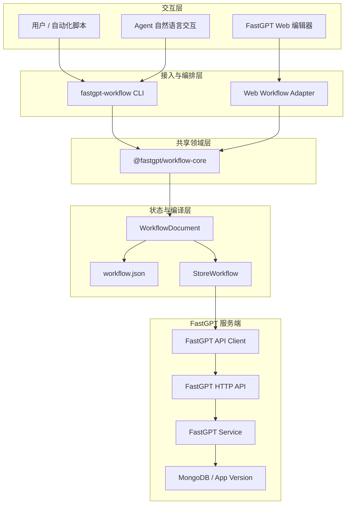
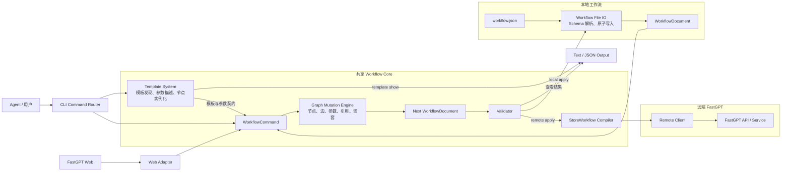

# Workflow CLI Builder 需求设计文档

## 0. 文档标识

- 文档状态：开发中
- 修订日期：2026-07-22
- 目标仓库：FastGPT
- 目标对象：FastGPT Workflow 的本地构建、自动化修改、Web 辅助生成、远端保存、发布与调试
- 关联开发文档：`workflow-cli-builder-功能开发文档.md`
- 文档范围：需求边界、CLI 规范与总体架构

## 1. 结论先行

CLI 不能被设计成一套脱离 FastGPT 前端的 JSON 拼装器。它必须是 FastGPT 工作流编辑领域能力的第二个调用端：

```text
FastGPT Web Editor ─┐
                    ├─> Shared Headless Workflow Core ─> WorkflowDocument ─> StoreWorkflow
FastGPT Workflow CLI ┘
```

本方案锁定以下决策：

1. Web 与 CLI 共享同一套节点、执行边、变量引用、嵌套、删除副作用和校验规则。
2. ReactFlow 只负责画布交互，不作为共享领域模型。
3. 执行边与变量引用是两种不同关系，必须使用不同类型和命令。
4. `WorkflowDocument` 是 CLI 内存中的唯一规范状态，初期直接序列化为单文件 `workflow.json`。
5. `WorkflowChangeSet` 只描述对 `WorkflowDocument` 的命令集合，不是第二份工作流状态。
6. `StoreWorkflow` 是编译结果和 FastGPT 现有保存、发布、运行接口的输入。
7. `workflow.json` 只记录状态，约束由共享代码和校验命令执行；分片 Manifest 仅作为后期实验指标证明有必要时的可选优化。
8. 本地编辑命令默认原子写入，统一支持 `--dry-run`；远端发布和 AI 生成的批量变更需要确认门禁。
9. 第一阶段只交付本地核心闭环，远端鉴权和并发控制完成后再开放远端写入。
10. 新建和导入工作流必须包含唯一且不可删除的系统配置节点；变量和开关仍以 `chatConfig` 为唯一事实源，系统配置节点只提供 Web 编辑入口。
11. PR5 在 Workflow 编辑器内提供独立的辅助生成 Demo：复用现有 Chat、Agent Loop、Sandbox、Skill 和计费基础设施，但不抽象或改写 Skill 辅助生成的业务 Handler。

## 2. 目标与设计约束

### 2.1 产品目标

用户能够用 CLI 自动化完成一个 FastGPT 工作流从零到可运行的全过程，包括：

- 选择节点模板并创建完整节点。
- 给节点设置固定值、变量引用和节点专用配置。
- 建立普通执行边、分支边、异常边和工具边。
- 将节点插入已有边，或在创建节点时直接接到现有节点后。
- 创建和维护循环、批处理等嵌套结构。
- 删除、克隆、移动节点，并正确处理关联边和子节点。
- 校验节点配置、图连通性、引用有效性和运行前置条件。
- 将本地草稿保存为可审查、可版本控制的 `workflow.json`。
- 拉取、保存、发布、调试和运行远端 FastGPT 应用。
- 让 AI 只生成可审查的 ChangeSet，再由确定性代码应用。

### 2.2 设计约束

FastGPT Web 已经具备完整的画布操作。CLI 需要将分布在 React Context、ReactFlow hook、节点模板 UI、校验工具和 API 中的领域规则收敛为共享能力，并满足以下约束：

- 节点创建必须包含模板默认输入和远端模板完整数据。
- 变量引用与执行边使用独立的数据结构和命令。
- 删除输出、节点或父容器时执行确定性的清理副作用。
- 嵌套关系遵循与 Web 相同的领域规则。
- CLI 与 Web 使用同一套运行、发布校验规则。
- 远端命令只使用已明确支持并经过权限测试的 API Key 契约。

第一阶段先建立可被 Web 和 CLI 共同调用的工作流领域核心，再实现命令行入口。

## 3. FastGPT 现状事实基线

以下事实来自当前代码，后续实现不得用推测替代。

| 领域 | 当前代码 | 已确认行为 | 对 CLI 的要求 |
| --- | --- | --- | --- |
| 编辑器初始化 | `projects/app/src/pageComponents/app/detail/Workflow/index.tsx` | 由 `appDetail.modules` 和 `appDetail.edges` 初始化 ReactFlow | CLI 使用存储态，不依赖 ReactFlow Node/Edge |
| 编辑器能力分层 | `WorkflowComponents/context/index.tsx` | Init、Actions、Utils、Debug、Persistence 等 Context 叠加 | 共享领域规则由 workflow-core 承载 |
| 节点修改 | `workflowActionsContext.tsx` | 支持属性、输入、输出增删改；删除或替换输出会清边 | CLI 节点命令必须产生相同副作用 |
| 图操作 | `Flow/hooks/useWorkflow.tsx` | 连接、删除、复制、插入、嵌套均有额外规则 | CLI 不能只对数组做 CRUD |
| 嵌套节点 | `useWorkflow.tsx`、`useNestedNode.ts` | 维护 `parentNodeId` 和 `childrenNodeIdList`；移入容器会清边 | 嵌套命令必须原子更新父子关系和边 |
| 节点模板 | `Flow/components/NodeTemplates/useNodeTemplates.tsx` | 模板包含内置节点、团队应用、系统工具 | 模板引用必须区分来源，不能只用 `flowNodeType` |
| 模板实例化 | `NodeTemplates/list.tsx` | 远端模板先取完整 preview；内置模板补默认输入引用和本地化文案 | CLI 应复用模板提供器和实例化规则 |
| 普通执行边 | `ConnectionHandle.tsx`、`getHandleId()` | 常规 source/target handle 使用节点 ID、方向和类型生成 | CLI 接收语义端口，内部编译 handle |
| 输出执行边 | `RenderOutput/Label.tsx` | 仅 `output.type === source` 的输出产生执行 handle | 普通变量输出不能被当作执行端口 |
| 工具边 | `NodeCard.tsx`、`ToolHandle.tsx`、`NodeTemplatesPopover.tsx` | toolCall 节点提供 source，工具节点提供 target；两端 handle 均为 `selectedTools` | 工具调用连边是专用执行边，不能泛化成任意 Agent 连边 |
| 异常边 | `CatchError.tsx` | source 类型为 `source_catch` | CLI 要有 `catch` 端口语义 |
| 变量引用 | 工作流 input/reference 逻辑 | 引用值是 `[nodeId, outputId]`，存储在节点输入中 | 使用 `input ref`，不创建 StoreEdge |
| 新增后连边 | `NodeTemplatesPopover.tsx` | 从 handle 新增节点后，会自动添加一条边 | CLI 的 `node add --after` 必须是原子操作 |
| 新增默认引用 | `NodeTemplates/list.tsx` | 常见输入会默认引用 workflowStart 的用户文本或文件 | CLI 与 Web 应生成相同默认值 |
| 删除父节点 | `useWorkflow.tsx` | 同时删除子节点及所有关联边 | CLI `node remove` 默认级联 |
| 条件循环 | `useWorkflow.tsx`、校验函数 | 条件 loopRun 至少保留一个 loopRunBreak | CLI 在修改和校验阶段都要阻止非法状态 |
| 校验 | `projects/app/src/web/core/workflow/utils.ts` | `checkWorkflowNodeAndConnection` 同时检查节点和连通性，但输入是 ReactFlow 类型 | 使用 Store/Document 级共享校验器 |
| 草稿保存 | `Header.tsx`、`SaveButton.tsx` | 保存到云端不强制执行完整校验，允许保存未完成草稿 | CLI 必须区分 draft save 与 publish |
| 运行和发布 | `Header.tsx` | Run 和 Save and publish 会先调用检查 | CLI run/publish 必须经过阻断式校验 |
| 发布权限 | `version/publish.ts` | 要求写权限；发布时检查 Agent Skill 读取权限 | CLI 不得绕过资源权限 |
| 只读详情 | `api/core/app/detail.ts` | 只有读权限、没有写权限时返回空 nodes/edges | CLI pull 工作流图实际需要写权限 |
| API 鉴权 | detail、preview、publish、debug API | 当前主要开启 `authToken: true`，未统一开启 `authApiKey` | 远端 CLI 上线前必须补 API Key 契约或明确只支持 session token |
| 包边界 | `.agents/code/syntax.md` | `packages/global/core` 主要承载类型和常量 | 共享领域实现位于独立 package |

### 3.1 当前校验层级与复用边界

当前 FastGPT 没有统一的工作流 Validator。校验职责分散在以下三层：

| 当前层级 | 当前职责 | 代表代码 | CLI 设计处理 |
| --- | --- | --- | --- |
| Web 前端层 | 节点配置、必填输入、变量引用、特殊节点规则、执行边和图连通性 | `projects/app/src/web/core/workflow/utils.ts` 的 `checkWorkflowNodeAndConnection()` | 复用规则本身，将纯规则下沉到 workflow-core；CLI 不直接依赖 ReactFlow 函数 |
| API Schema 层 | 请求字段、枚举、ObjectId、nodes/edges/chatConfig 基本结构 | OpenAPI/Zod Schema 和 `parseApiInput` | 保留 API 边界校验，不能替代工作流领域校验 |
| Service 层 | App 权限、资源引用、Agent Skill 读取权限、发布限制和版本写入 | `authApp`、`beforeUpdateAppFormat`、publish controller | 继续留在服务端；CLI 本地校验结果不能替代服务端权限和发布校验 |

当前主要图校验调用链：

```text
ReactFlow Nodes/Edges
  -> checkWorkflowNodeAndConnection()
  -> 节点标红 / toast
  -> uiWorkflow2StoreWorkflow()
  -> FastGPT API
```

`checkWorkflowNodeAndConnection()` 不能被 CLI 直接 import，原因是它接收 ReactFlow Node/Edge、读取 sourceHandle/targetHandle、只返回首个错误节点，并在部分分支中修改 input value。CLI 建设不重新发明校验准则，而是通过 Characterization tests 固化现有行为，再把判断规则迁移为不依赖 UI、文件系统和网络的纯 Validator：

```text
FastGPT Web -> Web Adapter -------┐
                                 v
                           WorkflowDocument
                                 |
CLI workflow.json -> File Codec --┘
                                 v
                    Shared Workflow Validator
                                 |
                    WorkflowDiagnostic[]

FastGPT API / Service -> Schema、权限、资源、运行和发布校验
```

目标拆分：

- `validateWorkflowSchema()`：Document 与字段结构。
- `validateWorkflowDocument()`：节点、模板实例、必填配置和动态 key。
- `validateWorkflowGraph()`：执行端口、重复边、连通性、分支、工具边和循环规则。
- `validateWorkflowReferences()`：变量存在性、类型、上游可达性和父级作用域。
- `validateWorkflowRuntime()`：模型、sandbox 和外部资源能力，需要运行环境上下文。
- `validateWorkflowPublish()`：调试工具、Agent Skill 和远端资源权限，最终由服务端执行。

校验策略不能对所有命令一刀切：

| 场景 | 阻断规则 | 非阻断诊断 |
| --- | --- | --- |
| 普通本地 mutation | Schema、ID、端口、父子一致性、本次参数类型和引用格式 | 整体连通性、其他节点尚未补齐的业务参数 |
| `build` / ChangeSet apply | schema、document、graph、reference | runtime、publish |
| `remote save --draft` | schema、document、服务端请求结构和权限 | graph、reference、runtime、publish |
| `remote publish` / `run` | schema、document、graph、reference、runtime、publish | 仅明确标记为 warning 的诊断 |

每条 mutation 在内存中生成 `Next WorkflowDocument` 后执行对应策略。存在阻断错误时，不写 `workflow.json`、不调用远端写接口；Validator 只返回完整 `WorkflowDiagnostic[]`，不得修改 Document。Web 将诊断转换为节点高亮和 toast，CLI 将同一诊断渲染为 text 或 JSON。

### 3.2 本次 Binding 职责拆分影响域

| 维度 | 是否命中 | 证据 | 结论 |
| --- | --- | --- | --- |
| API | No | 本地 `validate/build` 不调用远端 Resolver | Not Applicable，PR6 再设计鉴权接口 |
| Data | No | Binding 不写入 WorkflowDocument、StoreWorkflow 或数据库 | Not Applicable，无迁移 |
| Frontend | No | 本次只改 workflow-core 和 workflow-cli | Not Applicable，Web 行为不切换 |
| Logging | No | Binding 只进入 CLI result/warnings，且不包含实际值 | Not Applicable，不新增日志通道 |
| Packaging | Yes | 新增 `packages/workflow-core/src/binding/*` 并从 package 入口导出 | 保持 browser-safe，不引入 IO/服务端依赖 |
| Testing | Yes | Core Binding/reference/validation 与 CLI e2e 都需回归 | 真实运行 CLI，不 mock 本地领域逻辑 |
| DocI18n | No | 未增加用户可见文案，诊断使用稳定 code | Not Applicable，无 i18n key 变更 |

## 4. 范围和分档

### 4.1 档位 A：共享领域核心和本地 CLI 闭环

必须优先完成：

- `WorkflowDocument`、语义执行端口、变量引用、命令和结果模型。
- StoreWorkflow 的导入、编译与语义等价 round-trip。
- 内置模板实例化。
- 内置模板参数的机器可读 Descriptor 和 `template show --format json`。
- 节点新增、修改、删除。
- 普通执行边连接、断开。
- 输入固定值和变量引用。
- 共用的 Store/Document 级校验器。
- 本地文件读写、原子保存、`--dry-run` 和 JSON 输出。

### 4.2 档位 B：完整图编辑语义

- 分支边、输出 source 边、catch 边、工具边。
- `node add --after`、`node insert`、reconnect。
- 动态输入输出及清边副作用。
- clone、批量删除、嵌套移动。
- loop、loopRun、batch 等父子节点自动创建与约束。
- 团队应用、插件、MCP/HTTP 工具等远端模板提供器。
- custom/object 参数的 JSON Schema、示例和远端模板 Descriptor。

### 4.3 档位 C：ChangeSet 和 Confirm 门禁

- ChangeSet diff、plan、apply。
- AI 生成 ChangeSet，不直接生成最终 StoreWorkflow。
- 对 base checksum 和 target checksum 做确认门禁。
- 确认后内容发生变化时自动使确认失效。

### 4.4 档位 D：Workflow 辅助生成 Demo

- Workflow 编辑器内的独立聊天入口。
- 建立独立 `WorkflowBuilderRunner`，直接复用公共 Agent Loop 协议，不再构造 `WorkflowStart -> Agent` 假工作流。
- 使用研究 Sandbox 承载 Skill、文档和通用分析；使用隔离的事务 Sandbox 承载当前 `workflow.json` 和固定版本 CLI。
- Agent 只通过 `workflow_cli_query` 和 `workflow_cli_apply` 访问事务 Sandbox，不获得该 Sandbox 的 Shell 权限。
- `workflow_cli_apply` 直接接收 `WorkflowChangeSet`，由 Gateway 完成 CLI plan、Core 二次校验和原子 apply，不产生待确认中间态。
- 应用成功或失败终止后，Runner 必须进入一次禁用工具的主 Agent 收尾，再由 Web Adapter 覆盖当前画布并自动对齐。
- PR5 不自动保存、发布或调试，不支持节点选中上下文、文件上传或复杂 diff 编辑。

### 4.5 档位 E：远端生命周期

- profile/login/whoami。
- pull、draft save、publish、versions。
- debug step、run。
- API Key 鉴权、写权限、资源权限。
- `baseVersionId` 乐观并发控制和 409 冲突。

### 4.6 后期可选优化：分片 Manifest

分片 Manifest 不进入当前 PR1 到 PR7 的开发、测试和验收范围。初期统一使用单文件 `workflow.json`，先通过真实工作流实验验证以下问题是否实际存在：

- 大型工作流导致 Git diff 难以审核。
- 多人并行编辑单文件产生高频冲突。
- Agent 读取完整文件造成不可接受的上下文开销。
- 单文件原子写入或恢复不能满足实际可靠性要求。

只有实验数据证明上述问题达到需要优化的程度，才新增可选的 Manifest Codec。该 Codec 只负责 `WorkflowDocument` 的分片序列化和组装，不改变 Command、Validator、StoreWorkflow Compiler 和远端 API 契约。

### 4.7 档位 F：团队与 CI

- 非交互模式和稳定退出码。
- 结构化审计日志。
- CI validate/build/diff/publish。
- 策略配置，例如禁止调试工具发布、允许节点类型白名单。

### 4.8 第一版明确不做

- 不在 CLI 内实现可视化画布。
- 不把 ReactFlow viewport、选择态、toast、modal、节点宽高放进共享核心。
- 不在 v1 中创建、删除 FastGPT App；先针对本地文档和已有 App。
- 不在 v1 中自动布局复杂图；节点位置先由模板默认、显式参数或简单确定性偏移产生。
- CLI 本体不实现通用 Skill 或 MCP Adapter；PR5 只在产品层注入单一内置 `workflow-builder` Skill，Agent 仍通过 Shell 调用 CLI 并读取结构化输出。
- 不允许用户在常规命令中手写 `sourceHandle` 和 `targetHandle`。
- 不让大模型直接写数据库格式并绕过确定性命令。

## 5. CLI 整体架构与实现逻辑

### 5.1 架构目标

整体架构采用“一个共享领域核心、两个直接调用端、两个持久化落点”：

- 一个共享领域核心：`@fastgpt/workflow-core`，集中执行节点、执行边、变量引用、嵌套、副作用和校验规则。
- 两个直接调用端：FastGPT Web Adapter 和 `fastgpt-workflow` CLI。
- 两个持久化落点：本地单文件 `workflow.json` 和正在运行的 FastGPT 服务。
- Agent 位于 CLI 上游；PR1 到 PR4 保证具备 Shell 能力的 Agent 可直接调用 CLI，PR5 再将同一能力接入 FastGPT Workflow 编辑器。

核心原则：

1. Web、CLI 和 Agent 最终都执行同一套 WorkflowCommand。
2. CLI 只做命令解析、流程编排、文件 IO、HTTP 和结果输出。
3. workflow-core 只做确定性领域计算，不依赖 React、文件系统和网络。
4. 本地工作流与服务端工作流通过 StoreWorkflow 编译结果对接。
5. 所有高风险变更先 plan、validate，再 confirm 和 apply。

### 5.2 整体大架构



Agent 不形成第二套工作流引擎。具备 Shell 能力的 Agent 直接调用 CLI，并读取稳定 JSON 输出；PR5 的内置 `workflow-builder` Skill 只规定 Agent 如何使用 CLI，实际修改仍由 CLI 和 workflow-core 完成。通用 MCP Adapter 不属于当前开发范围。

### 5.3 详细架构设计



精简后的详细架构只保留两条关键链路：

- 模板查询链路：`CLI -> Template System -> 参数描述 -> Text / JSON 输出`。
- 工作流修改链路：`workflow.json -> WorkflowDocument -> WorkflowCommand -> Graph Mutation Engine -> Validator`；校验通过后，根据命令选择 `local apply` 原子写回 `workflow.json`，或 `remote apply` 编译为 StoreWorkflow 并提交 FastGPT 服务。

Automation Metadata 只进入 Descriptor 归一化和参数校验，不进入节点实例化、WorkflowDocument、`workflow.json` 或 StoreWorkflow。

### 5.4 组件职责

| 组件 | 位置 | 核心职责 | 明确不负责 |
| --- | --- | --- | --- |
| Workflow CLI | `packages/workflow-cli` | 参数解析、命令编排、本地 IO、远端 HTTP、输出和退出码 | 节点与图规则 |
| Workflow Core | `packages/workflow-core` | 模板实例化、Command、图操作、引用、嵌套、校验、编译 | ReactFlow、fs、HTTP、终端交互 |
| Web Adapter | `projects/app/.../WorkflowComponents/adapters` | ReactFlow 与 WorkflowDocument 转换、UI action 适配、诊断展示 | 重复实现领域规则 |
| Template Provider | core 接口 + Web/CLI 实现 | 提供内置模板、团队应用、系统工具的完整模板和可选自动化元数据 | 直接修改工作流 |
| Template Descriptor | `packages/workflow-core/src/template` | 将现有模板字段与 Automation Metadata 归一化为机器可读参数契约 | 修改 Web 模板或进入 StoreNode |
| Workflow File IO | `packages/workflow-cli/src/io` | `workflow.json` 的 Schema 解析、确定性序列化和单文件原子写入 | 判断节点是否合法 |
| Remote Client | `packages/workflow-cli/src/remote` | profile、鉴权、pull、save、publish、debug、run | 直接读写数据库 |
| FastGPT API | 现有 Next API 与 Service | 权限、资源校验、版本写入和运行调试 | 信任客户端已完成校验 |

### 5.5 分层调用规则

依赖方向固定为：

```text
Agent -> Workflow CLI -> Workflow Core -> @fastgpt/global
FastGPT Web -> Web Adapter -> Workflow Core -> @fastgpt/global
Workflow CLI -> FastGPT API -> Service -> Database
```

禁止出现：

- workflow-core 引用 workflow-cli。
- workflow-core 引用 projects/app、ReactFlow 或 packages/service。
- CLI command handler 直接拼 `sourceHandle/targetHandle`。
- Agent 绕过 CLI 直接写 StoreWorkflow 或 MongoDB。
- FastGPT API 信任客户端传入的 `validated: true`、confirm 状态或权限结论。
- CLI 专用 Automation Metadata 写入 `FlowNodeInputItemTypeSchema`、WorkflowDocument、`workflow.json` 或 StoreWorkflow。

### 5.6 数据流与对象关系

工作流状态、变更指令和编译结果必须分开：

```text
WorkflowChangeSet
  -> apply
WorkflowDocument
  -> serialize / parse -> workflow.json
  -> build -> StoreWorkflow
  -> save / publish / run -> FastGPT Service
```

- `WorkflowChangeSet` 回答“要执行哪些动作”。
- `WorkflowDocument` 回答“当前完整工作流是什么”。
- `workflow.json` 回答“工作流如何在本地持久化”。
- `StoreWorkflow` 回答“如何提交给 FastGPT”。

任何时候都只能有一个规范工作流状态，即 `WorkflowDocument`。`workflow.json` 是它的单文件序列化结果，StoreWorkflow 是它的编译结果。

### 5.7 单条命令执行流程

以创建节点并自动连边为例：

```bash
fastgpt-workflow node add \
  --dir ./flow \
  --template builtin:ai-chat \
  --node answer \
  --after start@next
```

内部执行顺序：

1. CLI parser 校验参数并确定工作目录。
2. Workflow File IO 读取并解析 `workflow.json` 为 `WorkflowDocument`。
3. CLI 将参数转换为 `AddNodeCommand`，其中包含 templateRef、nodeId 和 connectFrom。
4. workflow-core 通过 Template Provider 解析完整节点模板。
5. command dispatcher 创建完整节点、默认输入引用和系统子节点。
6. dispatcher 创建 `start@next -> answer@target` 语义执行边。
7. validator 检查节点 ID、模板、端口、父子关系和图约束。
8. workflow-core 返回新 Document、变更摘要、warning 和 checksum。
9. `--dry-run` 只输出结果；普通模式通过临时文件和原子 rename 写回 `workflow.json`。
10. 若执行 `remote save/publish`，CLI 编译 StoreWorkflow 并调用 FastGPT API。

步骤 4 到步骤 7 任一失败，Document 不落盘，远端 API 也不会被调用。

### 5.8 本地构建模式

本地模式不要求 FastGPT 服务运行：

```text
workflow.json -> WorkflowDocument -> Command -> Validate -> workflow.json / StoreWorkflow JSON
```

适用场景：

- 在代码仓库中维护工作流。
- 使用 Git review 工作流变化。
- CI 执行 validate/build。
- 批量生成可导入的 workflow JSON。
- Agent 在沙箱中先生成并审查工作流，不直接影响服务端。

本地 mutation 默认原子写入，所有 mutation 支持 `--dry-run`。

### 5.9 FastGPT 服务端模式

服务端模式通过 HTTP API 操作一个正在运行的 FastGPT 实例。该实例可以位于公网、内网，也可以是 `localhost`。

```text
WorkflowDocument -> Build StoreWorkflow -> FastGPT API -> App Version
```

规则：

- CLI 不直接连接 MongoDB。
- pull、save、publish 和 debug 都经过 FastGPT 权限系统。
- draft save 与 publish 使用不同校验门禁。
- `baseVersionId` 用于阻止覆盖其他客户端的新版本。
- 服务端重新执行 schema、权限、资源和发布校验。
- 当前 v1 面向已有 App；创建和删除 App 不属于 v1。

### 5.10 Web 共用逻辑

FastGPT Web 不调用 CLI 进程，而是通过 Web Adapter 直接调用 workflow-core：

```text
ReactFlow action -> WorkflowCommand -> Workflow Core -> WorkflowDocument -> ReactFlow state
```

Web Adapter 负责坐标、选择态、viewport、toast、modal 和错误高亮。节点创建、连边、引用、嵌套和校验规则由 workflow-core 负责。

同一初始 Document 和同一 WorkflowCommand，Web 与 CLI 必须生成语义相同的 StoreWorkflow。

### 5.11 Agent 接入逻辑

Agent 不作为另一套工作流引擎。PR1 到 PR4 只保证具备 Shell 能力的 Agent 直接调用 `fastgpt-workflow`，并读取稳定 JSON 输出；PR5 将这条路径接入 Workflow 编辑器，但不改变 WorkflowCommand、ChangeSet 和 Core 的事实边界。通用 MCP Adapter 不进入当前验收范围。

Agent 的标准执行循环：

1. 查询模板及其输入输出约束。
2. 根据用户需求生成 `WorkflowChangeSet`。
3. 调用 `changeset plan` 获取变更摘要和诊断。
4. 根据诊断调整 ChangeSet，直到静态校验通过。
5. 向用户展示 plan。
6. 获得确认后执行 apply。
7. 根据用户要求停留在本地、保存草稿或发布到 FastGPT。

Agent 只能提出和调用结构化动作。checksum、权限、发布校验和并发冲突必须由 CLI/Core/API 独立执行。

### 5.12 PR5 Workflow 辅助生成接入

PR5 是独立产品模块，不抽取、改造或共用 `handleSkillDebugChat` 的业务 Handler。它复用 `ChatBox`、`getChatItems`、`preChatRound`、公共 Agent Loop、AgentLoopCore 事件适配、Sandbox runtime、usage 和 `finalizeChatRound`，但不再通过 `dispatchWorkFlow` 构造假 Workflow runtime。

```text
Workflow ChatBox
  -> independent Workflow Builder API/Handler
  -> restore normal chat histories and Agent memories
       -> only resume unfinished AgentPlan for ask/interactive continuation
       -> ordinary new requests do not inherit stale unfinished AgentPlan
  -> WorkflowBuilderRunner
       -> prepare research sandbox with builtin workflow-builder Skill
       -> prepare isolated transaction sandbox with current workflow.json and version-matched CLI
       -> run public Agent Loop with plan/ask/research tools and two Builder runtime tools
  -> workflow_cli_query
       -> validate a discriminated read-only query
       -> execute an allowlisted CLI query in transaction sandbox
  -> workflow_cli_apply
       -> validate WorkflowChangeSetSchema
       -> write a server-owned per-call temporary ChangeSet
       -> execute CLI changeset plan and parse JSON stdout
       -> revalidate plan through workflow-core
       -> execute CLI changeset apply and validate target WorkflowDocument
       -> delete the temporary file in finally
       -> return authoritative applied or failed result with stop=true
  -> WorkflowBuilderRunner starts one tool-free main Agent finalization turn
  -> SSE returns the validated target WorkflowDocument
  -> Web Adapter overwrites the current canvas and runs the existing auto-layout
```

Workflow Builder 中存在三个不同层次，禁止混为同一个 plan：

- `AgentPlan`：Agent 为完成复杂检索、文档读取或多步分析而自主创建的内部执行计划；简单修改不要求创建。
- `WorkflowPlan`：每次实际修改画布前必须生成的内部校验契约，由服务端和 CLI 共同验证，不作为待确认 UI 状态。
- `WorkflowDocument`：CLI Apply 并经服务端校验后得到的唯一工作流状态。

本阶段用于验证 CLI 在 FastGPT 对话流程中的完整可用性，不增加用户确认轮次。服务端以本轮请求携带的画布事实为 base 调用 CLI Confirm 门禁，验证成功后直接把目标文档返回画布；生成期间发生的人工画布修改允许被该目标文档覆盖。

PR5 请求只携带当前轮消息、模型和画布事实；历史对话、Agent memories、计费和生成状态继续按普通 Chat 机制恢复：

```ts
type WorkflowBuilderChatBody = {
  appId: string;
  chatId: string;
  responseChatItemId?: string;
  messages: ChatCompletionMessageParam[];
  model?: string;
  workflowContext: {
    document: WorkflowDocument;
    checksum: string;
  };
};

type WorkflowBuilderApplied = {
  document: WorkflowDocument;
  checksum: string;
};
```

PR5 不传入 `mode`、不单独建模“修改记录”、不传节点选中上下文。事务 Sandbox 只修改本轮请求 Document 的副本；校验成功后允许覆盖内存画布，但不得自动调用保存、发布或运行 API。

Agent 与事务执行层之间的结构化交接仅通过 `workflow_cli_apply`：服务端在事务 Sandbox 中创建每次调用唯一的临时 ChangeSet 文件，Gateway 先生成并重算 WorkflowPlan，再调用注入的 apply 回调完成 CLI 应用和目标文档校验。tool result 只暴露 `applied` 或结构化失败诊断，不暴露待确认 plan 生命周期。模型不得指定输入/输出路径，不得直接访问事务 Sandbox Shell，不存在跨轮固定 WorkflowPlan 文件。

Workflow Builder 专用状态为 `reasoning -> clarification_pending | drafting_changeset -> validating -> applying -> finalizing -> applied | failed`。普通问答可在 `reasoning` 直接结束；AgentPlan 只是当前任务的实时推理进度，只有 ask continuation 可恢复；`workflow_cli_apply` 结束变更阶段后，Runner 立即启动一次无工具主 Agent 收尾。每轮最多三次校验失败，apply 失败则直接进入收尾并报告真实问题。

Workflow Builder 复用 Chat 基础设施不等于继承工作流运行配置。当前 `WorkflowDocument.chatConfig` 仅作为 Agent 可读取和修改的画布事实；Builder ChatBox 与 Builder Handler 必须使用独立最小 ChatConfig，禁止继承原工作流的欢迎语、启动变量、自动执行、问题引导、语音和定时触发等配置。Builder 需要保留本次辅助 Agent 的运行详情；当详情包含 `llmRequestIds` 时，用户可继续查看对应的 LLM 请求体与响应体。

### 5.13 Workflow Core 抽取与阶段交付

`@fastgpt/workflow-core` 是 Web 和 CLI 共同依赖的 TypeScript 领域包，不是独立部署的服务。它围绕 `WorkflowDocument` 提供确定性的模板实例化、节点编辑、执行边编辑、变量引用、嵌套、副作用、校验和 StoreWorkflow 转换能力。

Core 的状态关系固定为：

```text
workflow.json
  <-> parse / serialize
WorkflowDocument
  <-> compile / decompile
StoreWorkflow

ReactFlow State
  <-> Web Adapter
WorkflowDocument
```

其中：

- `workflow.json` 是 `WorkflowDocument` 的单文件持久化表达，不是第二套领域模型。
- `StoreWorkflow` 是 FastGPT 当前保存、发布和运行所需的编译结果。
- ReactFlow State 是 `WorkflowDocument` 加上 Web 画布运行状态；selected、viewport、节点测量尺寸、toast 和 debug 展示信息不得进入 Core。
- Core 复用 `StoreNodeItemType` 保存完整节点，以语义执行端口代替面向用户暴露的 ReactFlow handle。

PR1 只抽取能够构建基础线性工作流的最小 Core 纵向切片，并交付本地 CLI Demo，不宣称完成全部 Workflow Core。首批节点固定为：

| 节点 | 用途 | PR1 必要能力 |
| --- | --- | --- |
| WorkflowStart | 工作流入口，提供用户问题和文件等系统输出 | 初始化、默认引用、Start 可达性校验 |
| AI Chat | 调用模型生成结果 | 模板实例化、模型/提示词参数、用户输入引用 |
| Text Editor | 提供静态文本或拼接文本 | 固定值输入、变量引用 |
| Assigned Answer | 将固定内容或上游结果作为最终回答 | 固定值/引用输入、普通执行边 |

PR1 必须打通以下完整链路：

```text
CLI flags
  -> WorkflowCommand
  -> applyWorkflowCommand()
  -> WorkflowDocument
  -> validate
  -> compileStoreWorkflow()
  -> workflow.generated.json
```

PR1 的 Core 操作范围：

- 创建和解析 `WorkflowDocument`，规范化并计算基础 checksum。
- 解析内置模板并实例化完整 `StoreNodeItemType`。
- 添加节点，并通过 `connectFrom` 原子地连接普通 `next -> target` 执行边。
- 设置 input 固定值、设置 VariableRef、查询节点和模板。
- 编译和反编译普通 StoreEdge，完成 StoreWorkflow 语义往返。
- 执行最小 Schema、节点、图、引用和 Start 可达性校验。
- 返回结构化 changes、warnings、diagnostics 和稳定退出码。

后续能力按增量 PR 进入同一 Core，不创建第二套编辑引擎：

| 阶段 | Core 新增操作 |
| --- | --- |
| PR2 | node update/remove/clone、edge connect/disconnect/reconnect、input unset、App 元数据、ChatConfig、全局变量、完整线性图 Validator |
| PR3 | branch/sourceOutput/catch/tool edge、insert、动态 input/output、嵌套和循环、系统子节点、Web action 逐步迁移 |
| PR4 | ChangeSet plan/apply、canonical checksum、Confirm、并发写入保护、CI 契约 |
| PR5 | Workflow 编辑器 ChatBox、独立 Builder Handler、App Sandbox、内置 Skill、CLI 调用、ChangeSet 预览/应用 |
| PR6 | 远端模板 Provider、StoreWorkflow pull/decompile、版本查询 |
| PR7 | draft save、publish、run/debug 前校验和远端版本冲突处理 |

PR1 的验收结果必须是：仅通过 CLI 即可创建 Start -> AI Chat 或 Start -> Text Editor -> Assigned Answer 基础工作流，生成可被当前 FastGPT 识别的 StoreWorkflow；命令失败不写盘，Store -> Document -> Store 语义等价。

## 6. 核心对象模型

### 6.1 WorkflowDocument

`WorkflowDocument` 是 CLI 和共享核心使用的唯一规范状态。

```ts
type WorkflowDocument = {
  schemaVersion: 'fastgpt-workflow/v1';
  app: {
    appId?: string;
    name?: string;
    intro?: string;
    appType?: string;
    baseVersionId?: string;
  };
  nodes: StoreNodeItemType[];
  executionEdges: WorkflowExecutionEdge[];
  chatConfig: AppChatConfigType;
};
```

约束：

- `nodes` 使用 FastGPT 完整存储节点，不发明精简节点格式。
- `executionEdges` 使用语义执行端口，不在用户格式中暴露 ReactFlow handle。
- 变量引用保留在节点 input value 中，不进入 `executionEdges`。
- `app` 只保存本地绑定与并发基线，不替代 FastGPT App 数据。
- 编译器将该文档转换为现有 `{ nodes, edges, chatConfig }`。

### 6.2 StoreWorkflow

`StoreWorkflow` 是现有 FastGPT 保存、发布、运行链路所需的编译结果：

```ts
type StoreWorkflow = {
  nodes: StoreNodeItemType[];
  edges: StoreEdgeItemType[];
  chatConfig: AppChatConfigType;
};
```

它不是主要手工编辑格式。`fastgpt-workflow build` 负责生成它，`fastgpt-workflow import` 负责把现有 StoreWorkflow 反编译为 `WorkflowDocument`。

### 6.3 NodeTemplateRef

模板来源必须显式区分：

```ts
type NodeTemplateRef =
  | { kind: 'builtin'; templateId: string }
  | { kind: 'teamApp'; appId: string; versionId?: string }
  | { kind: 'systemTool'; toolId: string; versionId?: string }
  | { kind: 'tool'; toolId: string; parentId?: string; versionId?: string };
```

模板实例化必须输出完整 `StoreNodeItemType`，并执行与 Web 一致的默认输入引用、节点名、本地化文案、父节点和系统子节点处理。

#### 6.3.1 模板输入初始值优先级

节点输入初始值必须由统一解析器决定，禁止各模板、CLI handler 或 Agent 自行猜测。值来源优先级固定为：

1. 用户显式提供的值。
2. PR6 远端 Template Provider 在当前 profile 下完成鉴权、存在性和读取权限验证后返回的值。
3. 原始模板中与部署环境、团队和用户无关的安全默认值。
4. 与 `valueType` 匹配的安全空值。

规则：

- 用户显式提供 `[]`、`''`、`false` 或 `0` 也视为明确输入，不得使用空值合并运算覆盖。
- PR6 前不存在可信远端值，第二优先级必须跳过；本地 CLI 不得把示例值、名称或自然语言推断结果当成资源 ID。
- `dataset/model/app/tool/secret` 等资源型输入必须由 Automation Metadata 声明；未验证资源不得从模板默认值写入节点。
- 资源输入的安全空值分别为：`selectDataset -> []`，其他单值资源和 secret 保持 `undefined`，工具资源不创建工具边。
- Secret 永远使用 `userRequired`，即使到 PR6 也不得通过 Template Provider 返回或写入默认值。
- HTTP URL 等用户环境参数不是远端资源 ID，但没有真实输入时同样保持为空，不得写入 `example.com` 等演示地址。
- Start 默认引用属于确定性图推导，不参与上述四级值来源竞争；只在输入仍为空、目标允许 reference 且源输出类型兼容时补充，且不得覆盖模板值或用户值。
- `defaultValue`、模板 `input.value` 和已验证远端值只作为实例化输入；来源元数据不得进入 WorkflowDocument、StoreWorkflow 或数据库。

该优先级解决“创建节点时写入什么”，不证明远端资源在运行时持续可用。PR6 负责读取时验证，PR7 的 debug/run/publish 和服务端仍必须重新验证资源存在性与权限。

### 6.4 NodeTemplateDescriptor

现有 FastGPT 模板已经包含 `key`、`label`、`description`、`toolDescription`、`valueType`、`required`、`defaultValue`、`renderTypeList`、`list`、`min/max` 等参数信息。CLI 不复制这些字段，而是将它们归一化为稳定的机器可读契约：

```ts
type NodeTemplateDescriptor = {
  template: NodeTemplateRef;
  name: string;
  intro?: string;
  flowNodeType: string;
  inputs: NodeParameterDescriptor[];
  outputs: NodeOutputDescriptor[];
  constraints: {
    unique: boolean;
    isTool: boolean;
    allowedParents?: string[];
  };
};

type NodeOutputDescriptor = {
  id: string;
  key: string;
  label: string;
  description?: string;
  valueType?: string;
  required: boolean;
  executable: boolean;
};

type NodeParameterDescriptor = {
  key: string;
  label: string;
  description: string;
  valueType?: string;
  required: boolean;
  defaultValue?: unknown;
  defaultPolicy: 'template' | 'userRequired' | 'remoteValidated';
  resourceKind?: 'dataset' | 'model' | 'app' | 'tool' | 'secret';
  bindingRequired: boolean;
  configurable: boolean;
  inputModes: Array<'literal' | 'reference' | 'secret'>;
  enum?: Array<{
    label?: string;
    value: string;
    description?: string;
  }>;
  constraints?: {
    min?: number;
    max?: number;
    minLength?: number;
    maxLength?: number;
    valueSchema?: Record<string, unknown>;
  };
  examples?: unknown[];
};
```

归一化规则：

- `description` 优先使用 `toolDescription`，其次使用 `description`，最后回退到 `label`。
- `inputModes` 由 `renderTypeList` 转换，不要求 Agent 理解 Web 组件枚举。
- `required/defaultValue/enum/min/max` 直接来自现有模板结构字段。
- hidden 不直接等于不可配置；是否由系统维护通过 Automation Metadata 显式声明。
- `description` 只解释含义，类型、范围和复杂结构必须使用结构化字段表达。
- i18n 文案按照 `--locale` 解析后输出，不把翻译 key 交给 Agent。
- secret 参数只输出约束和说明，不输出当前值或默认密钥。

现有模板缺少的复杂参数信息使用独立补充层：

```ts
type NodeTemplateAutomationMeta = {
  inputs?: Record<
    string,
    {
      configurable?: boolean;
      agentHint?: string;
      valueSchema?: Record<string, unknown>;
      examples?: unknown[];
      defaultPolicy?: 'template' | 'userRequired' | 'remoteValidated';
      resourceKind?: 'dataset' | 'model' | 'app' | 'tool' | 'secret';
      bindingRequired?: boolean;
    }
  >;
};
```

隔离要求：

- 不向 `FlowNodeInputItemTypeSchema` 添加 CLI/Agent 专用字段。
- 不为了 Agent 批量修改现有模板的 `label`、`description`、`required`、`valueType`、`renderTypeList` 和默认值。
- Automation Metadata 只参与 `normalizeNodeTemplateDescriptor()`，不得被 `nodeTemplate2FlowNode()` 展开到节点实例。
- Automation Metadata 不进入 WorkflowDocument、`workflow.json`、StoreWorkflow 和数据库。
- Web 可继续使用原始 `FlowNodeTemplateType`；Descriptor 层不改变 Web 渲染和保存结果。
- 未声明 `defaultPolicy` 的历史 Automation Metadata 按 `template` 解释；资源型输入必须显式声明，避免通过 valueType 为 `string` 的模型、应用等字段漏检。
- `defaultPolicy` 只描述初始值来源，不承担必填语义；当原始模板的 `required` 不能表达运行前必须配置时，使用 `bindingRequired` 显式补充。

### 6.5 ExecutionPortRef

执行端口只描述控制流：

```ts
type ExecutionSourcePortRef =
  | { kind: 'next'; nodeId: string }
  | { kind: 'branch'; nodeId: string; branchKey: string }
  | { kind: 'sourceOutput'; nodeId: string; outputKey: string }
  | { kind: 'catch'; nodeId: string }
  | { kind: 'selectedTools'; nodeId: string };

type ExecutionTargetPortRef =
  | { kind: 'target'; nodeId: string }
  | { kind: 'selectedTools'; nodeId: string };

type WorkflowExecutionEdge = {
  source: ExecutionSourcePortRef;
  target: ExecutionTargetPortRef;
};
```

CLI 文本格式：

| 语义 | 文本格式 | 编译结果 |
| --- | --- | --- |
| 普通后继 | `start@next` | `${startId}-source-right` |
| 普通目标 | `ai@target` | `${aiId}-target-left` |
| 分支 | `if1@branch:else` | `getHandleId(if1, 'source', 'else')` |
| source 输出 | `node@output:success` | `getHandleId(node, 'source', 'success')` |
| 异常 | `node@catch` | `getHandleId(node, 'source_catch', 'right')` |
| 工具 | `agent@tools -> tool@tools` | 两端 handle 均为 `selectedTools` |

规则：

- `sourceOutput` 只允许引用 `output.type === source` 的输出。
- 普通输出变量不能用 `edge connect`。
- 普通执行边不能连接工具目标，工具边也不能连接普通目标。
- 自连接、重复边和不存在的节点/端口必须被拒绝。

### 6.6 VariableRef

变量引用描述数据流：

```ts
type VariableRef = {
  nodeId: string;
  outputKey: string;
};
```

CLI 文本格式为 `nodeId.outputKey`。例如：

```bash
fastgpt-workflow input ref --node ai --key text --from start.userChatInput
```

该命令修改 `WorkflowDocument` 中 `ai` 节点的 input value，保存为语义引用
`[startNodeId, userChatInput]`，不会创建执行边。`WorkflowDocument` 和 `workflow.json` 始终使用稳定的
`output.key`；编译 StoreWorkflow 时必须把结构化引用和 `{{$nodeId.outputKey$}}` 文本引用转换为
FastGPT Web/Runtime 使用的 `output.id`，反编译时再转换回 `output.key`。全局变量引用
`[VARIABLE_NODE_ID, variableKey]` 不参与转换，执行边的 source output 也继续使用 `output.key`。

### 6.7 WorkflowCommand 与 WorkflowChangeSet

```ts
type WorkflowChangeSet = {
  schemaVersion: 'fastgpt-workflow-changeset/v1';
  baseChecksum: string;
  commands: WorkflowCommand[];
};

type WorkflowCommand =
  | UpdateAppMetaCommand
  | AddNodeCommand
  | UpdateNodeCommand
  | RemoveNodeCommand
  | MoveNodeCommand
  | CloneNodeCommand
  | ConnectExecutionEdgeCommand
  | DisconnectExecutionEdgeCommand
  | ReconnectExecutionEdgeCommand
  | InsertNodeCommand
  | SetInputValueCommand
  | SetInputReferenceCommand
  | UnsetInputCommand
  | AttachToolCommand
  | DetachToolCommand
  | AddGlobalVariableCommand
  | UpdateGlobalVariableCommand
  | RemoveGlobalVariableCommand
  | UpdateChatConfigCommand;
```

所有命令由同一个 dispatcher 执行，并返回：

```ts
type WorkflowCommandResult = {
  document: WorkflowDocument;
  changes: WorkflowChangeSummary[];
  warnings: WorkflowDiagnostic[];
  checksum: string;
};
```

### 6.8 本地工作流文件

初期使用单文件 `workflow.json` 直接保存 `WorkflowDocument`：

```text
workflow.json
  <-> parse / serialize
WorkflowDocument
  -> build
StoreWorkflow JSON
```

本地文件规则：

- `workflow.json` 是本地唯一 source of truth，不额外保存第二份 Document 状态。
- 写入前执行对应校验；存在阻断错误时不得覆盖原文件。
- JSON 使用稳定字段顺序、固定缩进和末尾换行，便于 Git diff 和 checksum。
- 写入临时文件并在同一文件系统内原子 rename，失败时保留原文件。
- `workflow.generated.json` 是可选 build 输出，不是手工维护的 source of truth。

文件格式不负责决定节点、端口、嵌套或发布是否合法，也不保存可被手工修改绕过的“已确认”状态，上述约束全部由代码执行。

分片 Manifest 是后期可选 IO Codec，不进入初期命令面。若实验数据证明单文件在大型工作流 Git diff、并发冲突或 Agent 上下文方面存在实际瓶颈，可在不改变 `WorkflowDocument` 的前提下增加：

```text
WorkflowDocument <-> Optional Manifest Codec <-> workflow.manifest/
```

## 7. 详细功能需求

| 需求编号 | 功能域 | 目标 |
| --- | --- | --- |
| FR-01 | 文档、配置与本地文件 | 创建、导入、配置、单文件持久化和编译工作流 |
| FR-02 | 节点模板 | 查询并解析完整节点模板 |
| FR-03 | 节点操作 | 新增、修改、克隆、移动、删除和插入节点 |
| FR-04 | 执行边 | 管理普通、分支、异常和输出执行边 |
| FR-05 | 工具连接 | 管理 toolCall 与工具节点之间的专用边 |
| FR-06 | 输入、输出和变量引用 | 管理固定值、数据引用和动态 IO |
| FR-07 | 嵌套容器 | 管理 loop、loopRun、batch、parallel 父子结构 |
| FR-08 | 校验和诊断 | 提供 schema、graph、reference、runtime、publish 校验 |
| FR-09 | ChangeSet 与 Confirm | 提供可审查、可确认、原子应用的批量修改 |
| FR-10 | FastGPT 服务端生命周期 | pull、save、publish、versions、debug 和 run |
| FR-11 | Workflow 辅助生成 | 通过 Chat + Agent Loop + Sandbox + Skill + CLI 生成并应用可审查 ChangeSet |

### 7.0 CLI 公共契约

CLI 公共契约一次性定义 PR1 到 PR7 的最终命令面。PR5 不新增 CLI 命令，只在产品层调用 PR4 稳定的 ChangeSet 契约。后续 PR 只按阶段开放命令，不改变已经发布的命令语法；未实现命令不得出现在正式帮助文本中，也不得返回伪成功结果。

#### 7.0.1 命令语法

统一语法：

```text
fastgpt-workflow [global options] <resource> <action> [command options]
```

规则：

- 正式 bin 只有 `fastgpt-workflow`，不提供 `workflow` 等别名。
- 资源 ID 和引用统一使用显式选项，例如 `--node ai`、`--template builtin:ai-chat`、`--app APP_ID`，不混用位置参数。
- 查询动作统一使用 `list/show/inspect/validate/diff`；创建和修改使用 `add/set/update/remove`；不提供语义模糊的 `edit`、`sync` 或通用 `exec`。
- 创建命令遇到重复 ID 必须失败，更新命令遇到不存在 ID 必须失败；不提供隐式 upsert。
- `--help` 和 `--version` 属于所有阶段的基础能力，帮助文本只展示当前版本已开放的命令。

#### 7.0.2 公共选项

| 选项 | 适用范围 | 默认值 | 语义 |
| --- | --- | --- | --- |
| `--dir <path>` | 本地工作流命令 | 当前目录 | 包含 `workflow.json` 的工作目录 |
| `--format text\|json` | 所有命令 | `text` | stdout 的展示格式 |
| `--locale <locale>` | 需要人类文案的命令 | 系统 locale | Descriptor 和 text renderer 的语言 |
| `--no-color` | text 输出 | 非 TTY 自动关闭 | 禁止 ANSI 颜色 |
| `--quiet` | 所有命令 | `false` | 隐藏非必要进度信息，不隐藏结果或错误 |
| `--dry-run` | mutation 命令 | `false` | 完整计算但不执行本地或远端写入 |
| `--profile <name>` | 远端命令 | 无 | 选择 FastGPT 服务配置 |
| `--output <path>` | 产生文件的命令 | 命令定义 | 产物文件路径，不用于控制终端格式 |
| `--confirm <checksum>` | 受门禁保护的命令 | 无 | 确认目标 checksum |

`--format` 与 `--output` 必须严格分离：前者控制 stdout，后者指定文件产物。JSON 模式推荐同时使用 `--no-color`，但 JSON 输出无论是否传该参数都不得包含 ANSI 字符。

配置优先级固定为：命令行参数 > 环境变量 > profile > 内置默认值。CLI 不根据 TTY 自动切换 `--format`，Agent 和脚本必须显式使用 `--format json`。

#### 7.0.3 值、引用和资源语法

输入值参数互斥：

| 参数 | 用途 |
| --- | --- |
| `--value <scalar>` | string、number、boolean 等标量，由 Descriptor 决定解析类型 |
| `--value-json <json>` | object、array、custom 等结构化值 |
| `--value-file <path\|->` | 从 UTF-8 文件读取；`-` 表示 stdin |
| `--value-env <name>` | 从环境变量读取 secret，避免进入 shell history |
| `--from <node.output>` | 设置 VariableRef，仅用于 `input ref` |

引用格式：

```text
模板引用：builtin:ai-chat | teamApp:APP_ID | systemTool:TOOL_ID | plugin:PLUGIN_ID
执行端口：start@next | route@branch:yes | request@catch | caller@tools
变量引用：start.userChatInput | search.datasetQuote
坐标：600,200
边引用：--from start@next --to ai@target
```

CLI 不猜测字符串是否为 JSON、文件或变量引用，也不允许通过普通 `--value` 写入 secret。

#### 7.0.4 完整命令目录

| 领域 | 最终命令 | 类型 | 首次开放 |
| --- | --- | --- | --- |
| 基础 | `--help`、`--version` | 查询 | PR1 |
| 文档 | `init`、`build` | 本地 mutation / 产物 | PR1 |
| 文档 | `import`、`inspect` | 本地 mutation / 查询 | PR2 |
| 文档 | `diff` | 查询 | PR4 |
| 元数据 | `meta show`、`meta set` | 查询 / 本地 mutation | PR2 |
| ChatConfig | `config list`、`config get`、`config set`、`config unset` | 查询 / 本地 mutation | PR2 |
| 全局变量 | `variable list`、`variable add`、`variable update`、`variable remove` | 查询 / 本地 mutation | PR2 |
| 模板 | `template list`、`template show` | 查询 | PR1；远端来源 PR6 |
| 节点 | `node list`、`node show`、`node add` | 查询 / 本地 mutation | PR1 |
| 节点 | `node update`、`node remove`、`node clone`、`node move` | 本地 mutation | PR2 |
| 节点 | `node insert` | 本地 mutation | PR3 |
| 执行边 | `edge list`、`edge connect`、`edge disconnect`、`edge reconnect` | 查询 / 本地 mutation | PR2；复杂端口 PR3 |
| 输入 | `input show`、`input set`、`input ref`、`input unset`、`input available` | 查询 / 本地 mutation | set/ref PR1；其余 PR2 |
| 动态输出 | `output list`、`output add`、`output remove` | 查询 / 本地 mutation | PR3 |
| 工具连接 | `tool list`、`tool attach`、`tool detach` | 查询 / 本地 mutation | PR3 |
| 嵌套 | `container children`、`node move --parent/--root` | 查询 / 本地 mutation | PR3 |
| 校验 | `validate` | 查询 | PR1；完整层级 PR3/PR7 |
| ChangeSet | `changeset plan`、`changeset apply` | 产物 / 本地 mutation + Confirm | PR4 |
| Profile | `profile list`、`profile show`、`profile add`、`profile update`、`profile remove`、`profile test` | 本地配置 | PR6 |
| 远端只读 | `remote pull`、`remote diff`、`remote versions` | 远端查询 / 本地 mutation | PR6 |
| 远端写入 | `remote meta push`、`remote save`、`remote publish` | 远端 mutation | PR7 |
| 调试运行 | `debug start`、`run` | 远端执行 | PR7 |

`input available` 是查询指定节点输入可引用变量的唯一命令，不再提供重复的 `available-vars` 别名。

#### 7.0.5 命令参数契约

文档与配置：

| 命令 | 必填参数 | 可选参数与关键约束 |
| --- | --- | --- |
| `init` | 无 | `--dir`、`--name`；默认创建系统配置节点和 WorkflowStart；目标目录已有 `workflow.json` 时失败 |
| `import` | `--input <StoreWorkflow.json>` | `--dir`；缺少系统配置节点时补齐但不覆盖 `chatConfig`；导入未知 handle 或不支持 schema 时阻断 |
| `inspect` | 无 | `--dir`；只输出节点、边、引用、配置和诊断摘要 |
| `diff` | `--input <StoreWorkflow.json\|workflow.json>` | `--dir`；输出语义差异，不比较 JSON 排序和展示坐标微调 |
| `build` | `--output <StoreWorkflow.json>` | `--dir`；先执行 schema/document/graph/reference 校验 |
| `meta show` | 无 | `--dir` |
| `meta set` | 至少一个 `--name/--intro` | `--dir`、`--dry-run`；只修改本地绑定元数据 |
| `config list` | 无 | `--dir` |
| `config get` | `--path <allowlistedPath>` | `--dir` |
| `config set` | `--path` 与一个 value 参数 | `--dir`、`--dry-run`；path 必须在 ChatConfig allowlist |
| `config unset` | `--path <allowlistedPath>` | `--dir`、`--dry-run` |
| `variable list` | 无 | `--dir` |
| `variable add` | `--key`、`--value-type` | `--type`、`--description`、`--required`、类型配置、value 参数、`--dry-run` |
| `variable update` | `--key` 与至少一个更新字段 | `--type`、`--value-type`、类型配置；不允许修改为重复 key |
| `variable remove` | `--key` | `--dry-run`；仍被引用时阻断并返回引用位置 |

模板、节点与图：

| 命令 | 必填参数 | 可选参数与关键约束 |
| --- | --- | --- |
| `template list` | 无 | `--source builtin\|team\|system\|plugin`、远端来源要求 `--profile` |
| `template show` | `--template <TemplateRef>` | `--version`、`--locale`、远端模板要求 `--profile` |
| `node list` | 无 | `--dir`、`--type`、`--parent` |
| `node show` | `--node <nodeId>` | `--dir`；输出节点、Descriptor、执行端口和引用摘要 |
| `node add` | `--template`、`--node` | `--name`、`--position`、`--after`；`--parent` 从 PR3 开放 |
| `node update` | `--node` 与至少一个更新字段 | `--name`、`--position`、`--dry-run`；参数值修改应走 input 命令 |
| `node remove` | `--node` | `--dry-run`；执行边、引用和子节点副作用必须进入变更摘要 |
| `node clone` | `--node`、`--id` | `--offset`、`--position`、`--dry-run`；不复制不可复用 secret |
| `node move` | `--node` | `--position` 可与 `--parent` 或 `--root` 组合；`--parent` 与 `--root` 互斥 |
| `node insert` | `--from`、`--to`、`--template`、`--id` | `--position`、`--dry-run`；删除旧边并创建两条新边必须原子完成 |
| `edge list` | 无 | `--dir`、`--node`、`--kind` |
| `edge connect` | `--from <ExecutionPortRef>`、`--to <ExecutionPortRef>` | `--dry-run`；重复边失败 |
| `edge disconnect` | `--from`、`--to` | `--dry-run`；不存在边失败 |
| `edge reconnect` | `--from`、`--old-to`、`--to` | `--dry-run`；断开和重连必须原子完成 |
| `input show` | `--node`、`--key` | `--dir`；secret 只显示是否已配置 |
| `input set` | `--node`、`--key` 与一个 value 参数 | `--dry-run`；value 参数互斥并按 Descriptor 校验 |
| `input ref` | `--node`、`--key`、`--from <VariableRef>` | `--dry-run`；校验上游可达性、作用域和类型 |
| `input unset` | `--node`、`--key` | `--dry-run`；required 或系统维护参数不可清除 |
| `input available` | `--node`、`--key` | `--dir`；只返回该输入可合法引用的变量 |
| `output list` | `--node` | `--dir` |
| `output add` | `--node`、`--key`、`--value-type` | `--label`、`--description`、`--dry-run`；仅动态 IO 节点可用 |
| `output remove` | `--node`、`--key` | `--dry-run`；同步清理关联执行边并报告变量引用 |
| `tool list` | `--tool-call <nodeId>` | `--dir` |
| `tool attach` | `--tool-call` 与 `--template` 或 `--tool-node` | 两种工具来源互斥；创建节点和工具边必须原子完成 |
| `tool detach` | `--tool-call`、`--tool-node` | `--dry-run`；默认只断开，不删除已存在工具节点 |
| `container children` | `--node <containerId>` | `--dir`；返回系统子节点和普通子节点 |
| `validate` | 无 | `--level schema\|document\|graph\|reference\|runtime\|publish`；远端层级要求 `--profile` |

自动化与远端：

| 命令 | 必填参数 | 可选参数与关键约束 |
| --- | --- | --- |
| `changeset plan` | `--input <ChangeSet.json\|->` | `--dir`、可选 `--output <Plan.json>`；stdin 和文件共用同一 Schema，输出 base/target checksum、changes 和 diagnostics |
| `changeset apply` | `--plan <Plan.json\|->` | `--dir`、`--dry-run`、`--confirm`；非 TTY 写入必须提供 target checksum |
| `profile list` | 无 | 只显示名称、base URL 和 credential 来源，不显示密钥 |
| `profile show` | `--name` | secret 只显示来源和配置状态 |
| `profile add` | `--name`、`--base-url` 与 credential 来源 | credential 使用 `--api-key-env`，不接受明文 `--api-key` |
| `profile update` | `--name` 与至少一个更新字段 | 不把解析后的密钥写入配置文件 |
| `profile remove` | `--name` | profile 被当前命令使用时失败 |
| `profile test` | `--name` | 只测试连通性和身份，不读取完整工作流 |
| `remote pull` | `--app`、`--profile` | `--dir`、`--dry-run`；非空本地目录存在未同步变更时拒绝覆盖 |
| `remote diff` | `--app`、`--profile` | `--dir`；比较本地 Document 与远端版本，不写入两端 |
| `remote versions` | `--app`、`--profile` | `--limit`、`--cursor` |
| `remote meta push` | `--app`、`--profile`、`--confirm` | `--dir`、`--dry-run`；只同步允许的应用资料字段 |
| `remote save` | `--app`、`--profile`、`--draft` | `--dir`、`--dry-run`；携带 baseVersionId，允许 graph warning |
| `remote publish` | `--app`、`--profile`、`--confirm` | `--dir`、`--version-name`、`--dry-run`；publish error 必须阻断 |
| `debug start` | `--app`、`--entry`、`--profile` | `--input/--input-json/--input-file`；输出 JSON step 事件 |
| `run` | `--app`、`--profile` 与一个 input 参数 | `--input/--input-json/--input-file` 互斥；执行完整运行校验 |

#### 7.0.6 查询、写入和 Confirm

- query 命令不得修改 Document、`workflow.json`、profile 或远端 App。
- 本地 mutation 默认写入，统一支持 `--dry-run`，并以单条命令为原子事务。
- 远端 mutation 统一支持 `--dry-run`；dry-run 不得调用任何写接口。
- `changeset apply`、`remote meta push` 和 `remote publish` 受 checksum Confirm 保护。
- `remote save --draft` 不要求 Confirm，但必须携带 `baseVersionId` 并显示 graph warnings。
- 非 TTY 环境不允许等待输入；需要确认时必须显式传 `--confirm`。
- 不提供通用 `--force`、`--yes` 或跳过权限/校验的参数。

所有 mutation 必须转换为 WorkflowCommand 或明确的 CLI/remote mutation service，不允许 command handler 直接修改数组、JSON 或数据库。远端操作在客户端校验后，服务端仍重新执行权限和数据校验。

### 7.1 FR-01：文档、配置与本地文件

```bash
fastgpt-workflow init --dir ./flow --name "客服助手"
fastgpt-workflow import --input workflow.json --dir ./flow
fastgpt-workflow inspect --dir ./flow
fastgpt-workflow meta set --dir ./flow --name "客服助手" --intro "处理售后咨询"
fastgpt-workflow config set --dir ./flow --path welcomeText --value "你好"
fastgpt-workflow variable add --dir ./flow --key customerId --value-type string --required
fastgpt-workflow variable add --dir ./flow --key quizResults --type internal --value-type arrayObject --value-json '[]'
fastgpt-workflow variable add --dir ./flow --key theme --type select --value-type string --options-json '[{"label":"数学","value":"math"}]'
fastgpt-workflow variable update --dir ./flow --key customerId --description "客户编号"
fastgpt-workflow variable remove --dir ./flow --key customerId
fastgpt-workflow build --dir ./flow --output workflow.generated.json
```

`import -> build` 必须保证语义等价，不要求 JSON 字段顺序完全一致。

`config set` 只能修改 AppChatConfig schema 中列入 allowlist 的路径，不能实现成任意 JSON Pointer。全局变量命令维护 `chatConfig.variables`，并执行 key 唯一、valueType、required/defaultValue 等现有 schema 约束。

全局变量使用两个正交维度，不增加第三个 `source` 参数：

- `--type` 表示交互或作用域类型，取值与 `VariableInputEnum` 一致；CLI 额外接受 `external` 友好别名，落盘统一保存为现有 `custom`。
- `--value-type` 表示数据结构，如 `string`、`number`、`object`、`arrayObject`。普通输入变量的两个参数可能看起来相同或相关，但语义不能合并。
- 显式 `--type` 优先；省略时保留历史自动推断。更新 `--value-type` 时，只有旧变量仍是自动推断类型才重新推断，显式的 `internal/custom` 等类型必须保留。
- `custom`、`internal` 和 `switch` 固定为非必填；CLI 不接受它们与 `--required` 的冲突组合。
- 类型专属配置使用 `--config-json` 或 `--config-file`，两者互斥；`--options-json`、`--min`、`--max`、`--max-length`、`--time-granularity` 是高频快捷参数，并覆盖 JSON 配置中的同名字段。类型配置不得覆盖 `key/type/valueType/required/defaultValue` 等核心字段。

`meta set` 只更新本地 App 绑定信息；`build` 只输出 StoreWorkflow，不把 name/intro 混入工作流 payload。远端同步元数据必须使用独立命令，避免一次 publish 意外覆盖应用资料。

### 7.2 FR-02：节点模板

```bash
fastgpt-workflow template list --source builtin
fastgpt-workflow template list --source team --profile prod
fastgpt-workflow template show --template builtin:ai-chat --locale zh-CN --format json
fastgpt-workflow template show --template teamApp:APP_ID --version VERSION_ID --format json
```

`template show` 必须输出 `NodeTemplateDescriptor`，包括输入、输出、动态字段、允许的执行端口、是否唯一节点、是否工具节点和嵌套限制。

实现要求：

- 普通参数从现有 FlowNodeTemplate inputs/outputs 归一化，不在 CLI 中维护第二份说明。
- 内置模板可以离线生成 Descriptor。
- 团队应用、插件和工具先通过 Template Provider 获取完整 preview，再生成 Descriptor。
- custom/object/array 参数必须提供 `valueSchema` 或返回 `WORKFLOW_TEMPLATE_PARAMETER_SCHEMA_MISSING` warning，禁止让 Agent猜测结构。
- `configurable: false` 的参数不得通过 `input set/ref/unset` 修改。
- Descriptor 中不得包含 input 当前 secret、credential、Authorization 或其他敏感值。
- 同一模板、版本和 locale 的 JSON 输出必须确定性稳定。

示例输出：

```json
{
  "template": {
    "kind": "builtin",
    "templateId": "ai-chat"
  },
  "inputs": [
    {
      "key": "systemPrompt",
      "label": "系统提示词",
      "description": "定义 AI 的角色、回答规则和限制",
      "valueType": "string",
      "required": false,
      "configurable": true,
      "inputModes": ["literal", "reference"],
      "constraints": {
        "maxLength": 100000
      },
      "examples": ["你是一个售后客服助手"]
    }
  ]
}
```

### 7.3 FR-03：节点操作

```bash
fastgpt-workflow node add --template builtin:ai-chat --node ai --position 600,200
fastgpt-workflow node add --template builtin:ai-chat --node ai --after start@next
fastgpt-workflow node add --template builtin:if-else --node route --after start@next
fastgpt-workflow node update --node ai --name "回答用户"
fastgpt-workflow node clone --node ai --id ai_copy --offset 320,0
fastgpt-workflow node move --node child --position 900,300
fastgpt-workflow node move --node child --parent loop1 --position 120,180
fastgpt-workflow node move --node child --root
fastgpt-workflow node remove --node ai
```

`node add --after start` 的领域含义不是两个松散动作，而是一个原子命令：

1. 解析模板。
2. 创建完整节点。
3. 补齐默认输入引用。
4. 校验父节点和嵌套限制。
5. 添加 `start@next -> newNode@target` 执行边。
6. 任一步失败则整个命令不落盘。

### 7.4 FR-04：执行边

```bash
fastgpt-workflow edge connect --from start@next --to ai@target
fastgpt-workflow edge connect --from route@branch:yes --to success@target
fastgpt-workflow edge connect --from request@catch --to fallback@target
fastgpt-workflow edge reconnect --from start@next --old-to ai@target --to route@target
fastgpt-workflow edge disconnect --from start@next --to ai@target
fastgpt-workflow node insert --from start@next --to ai@target --template builtin:if-else --id route
```

`node insert` 必须原子完成：删除旧边、创建节点、建立前后两条边。失败时恢复原图。

### 7.5 FR-05：工具连接

```bash
fastgpt-workflow tool attach --tool-call caller1 --template systemTool:webSearch
fastgpt-workflow tool attach --tool-call caller1 --tool-node search1
fastgpt-workflow tool detach --tool-call caller1 --tool-node search1
fastgpt-workflow tool list --tool-call caller1
```

工具命令内部维护 `toolCall@tools -> toolNode@tools` 专用边，用户不接触内部 handle。Agent V2 的技能选择若存储在 `selectedTools` input 中，应走 input/专用 Agent Skill 命令，不能伪装成执行边。

### 7.6 FR-06：输入、变量引用和动态 IO

```bash
fastgpt-workflow input set --node ai --key systemPrompt --value "你是客服助手"
fastgpt-workflow input set --node code --key timeout --value-json 30
fastgpt-workflow input ref --node ai --key text --from start.userChatInput
fastgpt-workflow input unset --node ai --key text
fastgpt-workflow input available --node ai
fastgpt-workflow output add --node code --key score --value-type number
fastgpt-workflow output remove --node code --key score
```

规则：

- `input available` 复用 FastGPT 的上游可用变量语义，不能仅列出所有节点输出。
- `input set/ref/unset` 根据当前节点的 `NodeParameterDescriptor` 校验参数，不只检查 key 是否存在。
- `input set --value` 只接受与 `valueType` 兼容的标量；对象、数组和复杂配置使用 `--json`。
- `input ref` 只允许 Descriptor 声明 `reference` inputMode 的参数，并检查来源输出类型。
- `configurable: false`、deprecated 和系统维护参数禁止修改。
- custom/object 参数按照 `constraints.valueSchema` 校验；缺少 Schema 时不得静默接受 Agent 猜测的数据。
- 引用必须来自当前节点可达的上游节点、系统变量或合法父级作用域。
- 动态 input/output key 在同一节点内唯一。
- 删除或替换 `source` 类型输出时，必须同步删除从该 output handle 发出的执行边。
- 普通数据输出即使被引用，也不产生执行边。

### 7.7 FR-07：嵌套和容器

```bash
fastgpt-workflow container children --node loop1
fastgpt-workflow node move --node worker --parent loop1
fastgpt-workflow node move --node worker --root
```

共享核心必须覆盖前端现有规则：

- workflowStart、loop/loopRun/parallel、插件输入输出、系统配置等节点不能被任意放进容器。
- interactive 节点不能放入 parallel。
- loopRunBreak 只能位于 loopRun。
- 节点移入或移出父容器时按前端语义清理不满足新作用域约束的边。
- 同时维护 child 的 `parentNodeId` 和 parent 的 `childrenNodeIdList`。
- 新建 loopRun 等容器时自动创建系统子节点。
- 删除容器时默认级联删除子节点和所有关联边。

### 7.8 FR-08：校验和诊断

```bash
fastgpt-workflow validate --dir ./flow
fastgpt-workflow validate --dir ./flow --level schema
fastgpt-workflow validate --dir ./flow --level graph
fastgpt-workflow validate --dir ./flow --level runtime --profile prod
fastgpt-workflow input available --node ai --key userChatInput --dir ./flow
```

诊断必须包含稳定 code、severity、nodeId/edge、path 和 message。例如：

```json
{
  "code": "WORKFLOW_EDGE_SOURCE_OUTPUT_NOT_EXECUTABLE",
  "severity": "error",
  "nodeId": "code1",
  "path": "executionEdges[2].source",
  "message": "Output score is a data output and cannot be used as an execution port"
}
```

校验层级：

1. `schema`：文件结构、枚举、必填字段。
2. `document`：节点 ID、模板实例、动态 key、父子一致性。
3. `graph`：端口、重复边、连通性、起点可达、工具边和循环规则。
4. `reference`：变量存在、类型与作用域。
5. `runtime`：sandbox、模型、外部资源和运行环境能力。
6. `publish`：调试工具、Agent Skill 权限、远端资源权限。

校验层级只回答“工作流结构是否合法”，资源绑定和可执行性是独立职责，不通过 `draft/strict` 模式改变同一条诊断的阻断级别：

- `validateWorkflow(document)` 只检查 schema/document/graph/reference 等本地可确定规则，且保持单一签名。
- `collectWorkflowBindings(document)` 收集 `missing/unverified` 绑定；未绑定资源不是结构错误，以 `WORKFLOW_BINDING_REQUIRED` 或 `WORKFLOW_BINDING_UNVERIFIED` warning 返回。
- 本地 `validate` 和 `build` 只被结构 error 阻断；`build` 保留资源字段空值并输出待绑定清单，不声称产物已可执行。
- `defaultPolicy=userRequired|remoteValidated` 的外部绑定不使用通用 `WORKFLOW_REQUIRED_INPUT_MISSING` 报错；是否需要绑定由模板 `required` 或 Metadata `bindingRequired` 决定。
- PR6 Resolver 负责当前 profile 下的存在性和读取权限验证；PR7 的 debug/run/publish 通过 `assertWorkflowExecutable()` 重新解析并阻断未绑定、已删除或无权限资源。

绑定诊断必须至少包含 `nodeId`、`inputKey`、`defaultPolicy` 和可用时的 `resourceKind`，且不得包含实际资源值或 Secret；禁止把 Mongoose `CastError` 等内部异常直接展示给用户。

### 7.9 FR-09：ChangeSet 与 Confirm

```bash
fastgpt-workflow changeset plan --input changeset.json --dir ./flow --output plan.json
cat changeset.json | fastgpt-workflow changeset plan --input - --dir ./flow --format json
fastgpt-workflow changeset apply --plan plan.json --dir ./flow --dry-run
fastgpt-workflow changeset apply --plan plan.json --dir ./flow --confirm TARGET_CHECKSUM
```

门禁规则：

- plan 记录 `baseChecksum`、命令列表、变更摘要、诊断和 `targetChecksum`。
- 当前文档 checksum 与 `baseChecksum` 不一致时拒绝 apply。
- 非交互环境 apply 高风险计划时必须传 `--confirm targetChecksum`。
- plan 或目标文档发生任何变化后，旧 checksum 自动失效。
- Confirm 是代码校验，不是在 `workflow.json` 中写一个 `confirmed: true`。
- `--dry-run` 会重新执行、校验 base/target checksum 和完整图，但不要求 Confirm，也不写盘。
- TTY 仅接受完整单词 `yes`；交互提示写到 stderr，JSON stdout 保持单一结构化结果。

本地 Beta 使用打包后的 tarball 安装，不要求安装 FastGPT monorepo 内部 package：

```bash
pnpm --filter @fastgpt/workflow-cli test:package
npm install -g ./fastgpt-workflow-cli-0.2.0-beta.1.tgz
fastgpt-workflow --version
```

升级时安装新的明确版本 tarball；回滚时重新安装留存的上一版本 tarball。`workflow.json` 在 Beta 期间仍保持 `fastgpt-workflow/v1`，CLI 不允许静默重写未知 schemaVersion；执行升级或回滚前应由 Git 或文件备份保存工作流。

### 7.10 FR-10：FastGPT 服务端生命周期

```bash
fastgpt-workflow profile add --name prod --base-url https://fastgpt.example.com --api-key-env FASTGPT_API_KEY
fastgpt-workflow remote pull --app APP_ID --profile prod --dir ./flow
fastgpt-workflow remote meta push --app APP_ID --profile prod --dir ./flow --confirm CHECKSUM
fastgpt-workflow remote save --app APP_ID --profile prod --dir ./flow --draft
fastgpt-workflow remote publish --app APP_ID --profile prod --dir ./flow --version-name v1 --confirm CHECKSUM
fastgpt-workflow remote versions --app APP_ID --profile prod
fastgpt-workflow debug start --app APP_ID --entry NODE_ID --profile prod
fastgpt-workflow run --app APP_ID --input "你好" --profile prod
```

生命周期语义：

- `remote pull`：要求能读取完整图；按当前权限行为应要求写权限。
- PR6 远端 Template Provider 只可返回当前 profile 已鉴权、存在且可读的资源默认值；未授权、已删除或无法确认的值按未绑定处理。
- `remote meta push`：只同步本地 name/intro 等允许字段，不修改 workflow graph。
- `remote save --draft`：发送 `isPublish: false`、`autoSave: false`，创建一条可追踪版本；允许保存未完成草稿，但仍执行 schema 校验并输出 graph warning。Web 的后台 `autoSave: true` 语义不进入 CLI v1。
- `remote publish`：阻断所有 publish error，并校验 debug tool 与资源权限。
- `run`：执行完整运行前校验。
- `debug`：保留 FastGPT 当前逐节点 runtimeNodes/runtimeEdges/variables 语义。
- `pull/save/publish/debug` 在 API Key 契约完成前不得标记为正式可用。

### 7.11 FR-11：Workflow 辅助生成

- Workflow 编辑器提供独立聊天入口，复用普通 Chat 历史、模型选择、SSE、停止、计费和 Agent memories。
- Workflow Builder 使用独立 Handler 和 Runner，不抽取或修改 Skill 辅助生成的 Handler；仅复用现有底层 Chat、Agent Loop、AgentLoopCore 事件适配和 Sandbox 能力。
- 每轮以前端当前 `WorkflowDocument + checksum` 为事实输入，历史由后端根据 `appId + chatId` 恢复，不建立独立修改记录模型。
- Agent 只能通过内置 `workflow-builder` Skill 调用 `workflow_cli_query` 和 `workflow_cli_apply`；Gateway 必须执行查询白名单、ChangeSet Schema、CLI JSON envelope、Core 二次校验和原子 apply。
- 研究 Sandbox 与事务 Sandbox 必须物理寻址隔离，Agent 的通用 Sandbox tools 不得读写事务 Sandbox。
- `workflow_cli_apply` 必须以 `WorkflowChangeSet` 作为结构化入参；临时文件由服务端生成和清理，模型不得管理文件路径。
- WorkflowPlan 只作为服务端内部校验对象，不持久化为待确认 Artifact，也不直接返回原始 ChangeSet JSON。
- Gateway 在同一工具调用中注入 CLI `changeset apply --confirm <targetChecksum>` 能力，不向 Agent 暴露直接 apply 命令。
- 服务端必须用本轮请求的 WorkflowDocument 覆盖 Sandbox 副本，重新校验 base/target/plan 内容，读取并校验 CLI 产生的目标 WorkflowDocument 后才返回。
- 前端通过 Web Adapter 覆盖当前内存画布，等待节点尺寸就绪后复用现有 dagre 自动布局和 `fitView`。
- 服务端必须在工具终态后再调用一次无工具主 Agent，并把其基于真实执行结果生成的终态回答持久化进 ChatItem；固定摘要只作为收尾模型失败时的兜底。
- PR5 不支持节点选中上下文、自动保存/发布/调试或远端资源模板解析。

## 8. 共享规则与 UI 边界

### 8.1 必须进入共享核心

- 节点模板实例化和默认 input 引用。
- NodeTemplateDescriptor 归一化、Automation Metadata 合并和参数校验。
- 执行端口解析与 StoreEdge 编译。
- VariableRef 设置和有效性检查。
- 动态 input/output 唯一性和清边副作用。
- add/remove/clone/insert/reconnect。
- 父子节点、childrenNodeIdList 和嵌套约束。
- 工具边、catch 边、分支边。
- App 元数据、ChatConfig 和全局变量的 schema 化修改。
- 节点配置、引用、图连通性和发布前静态校验。
- WorkflowDocument、`workflow.json`、ChangeSet、checksum。

### 8.2 继续留在 Web

- ReactFlow Node/Edge 与 Store/Document 的 UI adapter。
- 鼠标拖拽、框选、快捷键、viewport、fitView。
- toast、modal、错误节点高亮。
- 节点尺寸、吸附、画布坐标交互。
- 前端本地化显示和模板面板筛选 UI。
- 原始 FlowNodeTemplate 的展示字段和 ReactFlow 节点持久化结构。

Web 调用共享核心后，负责把 `WorkflowCommandResult.document` 转回 ReactFlow 状态并展示 `warnings/diagnostics`。

Descriptor 接入不得改变同一模板创建出的 ReactFlow Node、StoreNode 和 StoreWorkflow。Web 是否未来展示 `examples/valueSchema` 属于独立需求，不是 CLI 参数发现能力的前置条件。

## 9. 写入、输出和自动化契约

### 9.1 本地写入

- 所有本地 mutation 命令默认写入。
- 所有本地 mutation 命令统一支持 `--dry-run`。
- `workflow.json` 使用同目录临时文件加原子 rename；失败不得留下半写入文件或覆盖原文件。
- 不提供通用 `--write`，避免与默认写入语义冲突。

### 9.2 远端写入

- 命令名必须明确包含 `remote save` 或 `remote publish`。
- publish 在 TTY 中展示摘要并确认；非 TTY 要求 checksum。
- 远端更新携带 `baseVersionId`；版本变化返回冲突，不自动覆盖。
- `--force` 不进入 v1，冲突应先 pull/diff/rebase。

### 9.3 结构化输出

所有命令支持 `--format text|json`。JSON 至少包含：

```ts
type CliResult = {
  schemaVersion: 'fastgpt-workflow-cli-result/v1';
  ok: boolean;
  command: string;
  changed: boolean;
  checksum?: string;
  result?: unknown;
  changes?: WorkflowChangeSummary[];
  warnings?: WorkflowDiagnostic[];
  errors?: WorkflowDiagnostic[];
};
```

稳定退出码：

| 退出码 | 含义 |
| --- | --- |
| 0 | 成功 |
| 2 | 参数或 schema 错误 |
| 3 | 领域命令冲突或非法操作 |
| 4 | 工作流校验失败 |
| 5 | 鉴权或权限失败 |
| 6 | 远端版本冲突 |
| 7 | 远端服务或网络错误 |

## 10. 远端 API 前置改造

远端 CLI 不是简单调用现有接口即可完成，至少需要：

1. 为详情、应用资料更新、模板 preview、发布、debug 等 CLI 所需接口明确开启并测试 `authApiKey`。
2. 继续复用 `authApp`、写权限和资源权限，不新增旁路鉴权。
3. 详情接口的 CLI 文档明确“拉取完整图需要写权限”。
4. 发布 body 增加可选 `baseVersionId`，服务端在事务内比较当前版本。
5. 冲突返回稳定 409 error code，CLI 映射为退出码 6。
6. OpenAPI schema、路由文档和客户端类型同步更新。
7. 所有 API 入参继续使用 `parseApiInput`。

在这些改造完成前，本设计只承诺本地 CLI。

## 11. 交付顺序

PR 是可审核、可回滚的增量开发单元，不等于发布单元。每个 PR 都必须保留此前行为并形成可独立演示的新增闭环；PR1 只作为内部技术 Demo，完成 PR4 后再发布本地 CLI Beta。

共享校验能力集中在 PR2 完成：一次性把 FastGPT Web 现有工作流规则抽取为 Web 与 CLI 共用的 Validator，并建立新旧结果等价测试。PR1 只保留保证最小 Demo 可生成、可导出的结构检查；PR3 以后只为新增图语义或远端场景补充规则，不再重复建设校验框架。

### PR1：最小可用 Demo CLI

- 建立 `packages/workflow-core` 和 `packages/workflow-cli` 最小结构。
- 定义基础 Document、Command、ExecutionPortRef、VariableRef、Descriptor 和 Diagnostic。
- 实现 workflowStart、AI Chat、Text Editor、Assigned Answer 的模板实例化。
- 实现 `init/build`、`template list/show`、`node list/show/add --after`、`input set/ref` 和 `validate`。
- 实现 `workflow.json` Schema 解析、单文件原子写入、JSON 输出和基础退出码。
- 用 Characterization tests 记录 PR2 需要复用的 Web 当前行为；PR1 只实现 Start、AI Chat、普通边和基础引用的最小结构检查。
- 建立 `basic-ai` 和 `basic-static` 端到端测试。
- 验收结果：CLI 可以真实构建并导出 `Start -> AI Chat`，但不作为正式用户版本发布。

### PR2：常用线性工作流

- 补齐普通节点 update/remove/clone 和普通边 connect/disconnect/reconnect。
- 增加 App 配置、全局变量、`input available` 和基础 inspect/import。
- 覆盖知识库搜索、问题优化、内容提取、HTTP、代码、调用应用等常用线性节点中可独立落地的部分。
- 资源依赖节点只生成结构和安全默认值；用户未显式提供真实资源时保持空值，不得使用示例 ID 伪造可运行状态。
- 集中抽取 FastGPT Web 现有工作流校验为共享 Validator，覆盖节点必填参数、输入输出、边合法性、变量引用、Start 可达性和删除残留关系；补充复杂参数 `valueSchema`、fixtures，并完成 Web/CLI diagnostics 等价测试。
- 验收结果：CLI 可以构建具有实际业务价值的线性知识库问答和数据处理流程。

### PR3：复杂图语义

- 分支、source output、catch 和 tool edge。
- insert、复杂 reconnect、动态 IO 及删除副作用。
- loop、loopRun、batch、parallel 等嵌套容器和系统子节点。
- 同步迁移分支、catch、工具边、动态 IO、父子关系和循环规则；逐动作迁移 Web editor 到 shared commands，并补齐复杂流程等价测试。
- 验收结果：CLI 覆盖 FastGPT Web 编辑器的主要工作流图语义。

### PR4：自动化与门禁

- 完整 WorkflowDocument schemaVersion、单文件兼容策略和 canonical checksum。
- ChangeSet diff/plan/apply、TTY/non-TTY Confirm。
- 固化 local mutation、build、ChangeSet apply 的校验策略，以及 JSON envelope、错误 code、退出码、审计和 CI 用法。
- 固化模板输入初始值优先级、资源型输入安全空值、单一结构校验和独立 Binding Collector；PR6 前本地构建产物不得被标记为远端可执行。
- 验收结果：Agent 可以通过 Shell 安全执行计划、确认和批量修改；完成后发布本地 CLI Beta。

### PR5：Workflow 辅助生成 Demo

- 在 Workflow 编辑器中提供独立可收起 ChatBox，复用模型选择、历史恢复、SSE、停止和计费基础设施。
- 在 Pro 中实现独立 Workflow Builder API、Handler、Runtime 和 Sandbox prepare action；只模仿 Skill 辅助生成顺序，不抽取或修改 Skill Handler。
- 按 `sourceType=app`、`sourceId=appId`、`userId`、`chatId` 归属 Sandbox，注入当前 `WorkflowDocument`、与服务端匹配的 CLI 产物和内置 `workflow-builder` Skill。
- 恢复普通 Chat 历史和 Agent memories，不建立独立修改记录模型；前端不传 `mode` 和节点选中上下文。
- Builder 使用独立最小 ChatConfig，不继承原工作流运行前置配置；保留本次辅助 Agent 的运行详情和 LLM 请求体查看能力。
- Agent 通过 CLI 生成 ChangeSet，服务端使用 workflow-core 重新校验并自动 Apply，前端通过 Web Adapter 覆盖画布并自动对齐。
- 允许覆盖生成期间的人工画布修改；PR5 不自动保存、发布或运行工作流。
- 验收结果：用户可在 Workflow 编辑器中通过多轮对话直接生成并应用工作流，以验证 CLI 在 FastGPT 链路中的完整可用性。

### PR6：远端只读能力

- profile、密钥读取和 API Key 只读鉴权契约。
- 远端 template preview、pull 和 versions。
- 团队应用、系统工具和远端工具 Template Provider。
- 数据集、模型、应用和工具的只读 Resource Resolver；返回存在性、当前团队可见性、读取权限和节点所需资源快照，不返回 Secret 值。
- 远端 Provider 返回已鉴权且已验证读取权限的资源值，并作为模板输入值来源的第二优先级；失败时保持未绑定，不回退到虚构资源。
- 增加远端模板版本、读取权限、资源可见性和 pull 反编译校验。
- 验收结果：CLI 可以安全读取已有 FastGPT App 和远端模板，不执行远端写入。

### PR7：远端写入与运行

- remote meta push、draft save、publish、debug 和 run。
- `baseVersionId`、事务内版本比较和 HTTP 409 冲突。
- 完成 runtime/publish 校验，并在服务端二次执行权限、资源、版本和发布校验及端到端测试。
- 对 PR6 已验证资源再次检查存在性和权限，处理绑定后删除、跨团队复制和权限撤销，不信任本地 validated 状态。
- 验收结果：CLI 可以安全操作本地或云端 FastGPT 的完整远端生命周期。

## 12. 验收标准

### 12.1 本地核心

以下条目是 PR1 到 PR3 的累计验收标准。PR1 只验收首批四类节点、普通 `next -> target` 执行边、基础引用、最小结构检查和 StoreWorkflow 语义往返；删除副作用、完整 Web Adapter 等价和真实工作流 import 分别在 PR2/PR3 按对应 TODO 验收。

- 能从空文档创建 start、AI 节点并通过 `--after` 原子连边。
- 新建工作流默认包含唯一的系统配置节点和 WorkflowStart；系统配置节点不可删除、复制或重复添加。
- 变量与欢迎语、问题引导、文件选择、语音、定时触发、自动执行等开关统一存储在 `chatConfig`，并通过系统配置节点在 Web 中编辑。
- 能从内置模板生成稳定的 NodeTemplateDescriptor，Agent 无需读取 React 组件即可理解参数。
- `input set/ref` 按 Descriptor 的类型、inputMode、可配置性和 valueSchema 校验。
- Automation Metadata 不出现在 ReactFlow Node、StoreNode、`workflow.json` 或 StoreWorkflow 中。
- 同一模板创建出的 Web 节点和 StoreWorkflow 在接入 Descriptor 前后语义一致。
- 用户显式值覆盖远端值和模板默认值；显式空值不得被覆盖。
- 环境无关的模板默认值被保留，资源型模板默认值在 PR6 验证前保持安全空值。
- Start 默认引用只补充空输入且必须类型兼容，不得覆盖已有值。
- 本地 `validate/build` 允许资源待绑定并返回稳定 warning；普通结构错误仍阻断，且任何构建都不得合成资源值。
- fixtures、示例和 Agent 生成流程不得包含虚构 dataset/app/tool ID、模型名、HTTP URL 或 secret。
- 能明确区分 `start@next -> ai@target` 与 `start.userChatInput` 引用。
- 删除输出、节点和容器时，副作用与 Web 一致。
- 同一命令输入在 Web adapter 与 CLI 中生成语义相同的 StoreWorkflow。
- 现有真实工作流 import/build 后通过语义等价测试。

### 12.2 本地文件和 ChangeSet

PR1 只验收 `workflow.json` 的确定性 round-trip、失败不覆盖原文件和基础 checksum。canonical checksum、ChangeSet base 校验与 Confirm 从 PR4 开始验收。

- `workflow.json` parse/serialize round-trip 结果确定性稳定。
- `workflow.json` 中的规范状态变化会改变 checksum，缩进和字段顺序变化不会改变 checksum。
- ChangeSet base 不匹配时拒绝应用。
- Confirm 不能被简单修改 `workflow.json` 字段绕过。

### 12.3 远端

- API Key 对 pull、preview、save、publish、debug 有明确测试结果。
- 无写权限不能拉取完整图或写入。
- 两个客户端基于同一版本更新时，后提交者收到 409 冲突。
- draft save 可以保存未完成图；publish 和 run 会被完整校验阻断。

### 12.4 测试样本

至少覆盖五类真实导出工作流：

1. start -> AI 的普通流程。
2. ifElse/userSelect 的分支流程。
3. agent/toolCall 与工具边。
4. loop/loopRun/batch 的嵌套流程。
5. 动态输入输出、变量引用和 catch edge。

## 13. 风险与控制

### 12.5 运行时节点契约补全（2026-07-24）

Workflow Builder 的真实调用证明，仅暴露输入参数不足以让 Agent 稳定生成可运行工作流。`ifElse` 分支键、交互节点没有普通 `next` 出口、容器系统字段和动态 IO 都属于节点执行能力，不能只依赖自然语言提示。

所有在 `template list` 中公开的内置节点必须通过同一份版本化 `NodeTemplateDescriptor` 暴露完整机器契约：

1. `schemaVersion` 固定为 `fastgpt-workflow-node-contract/v1`。
2. `execution` 描述可接受的目标端口、允许的源端口、终止节点和动态分支配置来源。
3. `container` 描述是否为容器、允许的父容器类型和禁止的子节点类型。
4. `dynamicIO` 描述输入变更会同步哪些动态输入、输出或执行分支。
5. `effects` 描述输入更新会清理失效引用、执行边或同步兼容字段等副作用。
6. 所有 `configurable=true` 的输入必须有非空说明；对象、对象数组和结构化 `any` 必须有 `valueSchema`。
7. `hidden`、布局尺寸、`childrenNodeIdList` 等系统维护字段默认不可配置；确需由 Agent 设置的隐藏字段必须在 Automation Metadata 中显式开放。
8. Descriptor 的执行能力必须复用 Core 校验的同一事实源，不允许在模板说明和 `assertExecutionEdge()` 中维护两份节点集合。

本次补全覆盖当前公开的全部 22 个内置节点，不只处理 `ifElse`。CLI 仍只负责透传 `template show` 的 Descriptor 和执行 WorkflowCommand，不复制 Core 业务规则。现有合法 `workflow.json`、StoreWorkflow 和 Web 模板结构不迁移；非法输入会更早在命令边界失败。

| 风险 | 影响 | 控制措施 |
| --- | --- | --- |
| Web 与 CLI 继续各写一套规则 | 行为漂移 | 共享 command/validator，做 adapter 等价测试 |
| CLI 参数说明直接写入共享 Input Schema | Web/存储结构变化 | 使用独立 Automation Metadata，并在实例化前隔离 |
| 模板参数描述不完整 | Agent 猜测参数导致坏工作流 | Descriptor 质量门禁；复杂参数要求 valueSchema 或 warning |
| Descriptor 与模板发生漂移 | CLI 校验错误 | 普通字段从模板实时归一化，补充元数据只描述缺失信息并做 key 对齐测试 |
| Agent 或示例编造远端资源 | 本地校验通过、导入后运行失败或泄露内部异常 | 固定值来源优先级；PR6 前资源留空；Binding Collector 输出待绑定项；禁止 fixture 使用占位资源 |
| PR6 验证后的资源被删除或撤权 | debug/publish 时使用过期资源 | PR7 服务端重新验证存在性、团队边界和权限，不信任本地 validated 状态 |
| 动态模板版本变化 | 构建不可复现 | `workflow.json` 保存完整节点快照；远端模板解析结果进入变更摘要和审计日志 |
| 语义端口覆盖不完整 | 导入丢边 | golden round-trip；未知 handle 导入时阻断并报告，不静默丢弃 |
| 本地 JSON 被当作校验器 | 可绕过 | 所有门禁在代码中重新计算 |
| 远端覆盖他人修改 | 数据丢失 | baseVersionId 事务内比较，无 `--force` |
| CLI 保存与发布语义混淆 | 未完成图被发布 | 分离 draft save 和 publish 命令 |
| MVP 范围过宽 | 无法形成闭环 | PR1 只做内部技术 Demo，PR2/PR3 增量补齐操作面，PR4 后再发布本地 CLI Beta |

## 14. MECE 核查

### 14.1 操作面完整性

- 状态载体：WorkflowDocument、`workflow.json`、StoreWorkflow。
- 构建来源：模板、导入、ChangeSet。
- 参数发现：Template Descriptor、Automation Metadata、机器可读 Schema。
- 输入初始化：用户显式值、PR6 已验证值、模板安全默认值、资源安全空值。
- 图操作：节点、执行边、变量引用、工具、嵌套。
- 生命周期：校验、build、draft save、publish、debug、run。
- 自动化：dry-run、JSON、退出码、checksum、并发控制。

### 14.2 边界互斥性

- 执行边不承担变量引用。
- `workflow.json` 不承担约束执行。
- ChangeSet 不承担完整状态存储。
- ReactFlow 不承担共享领域模型。
- Automation Metadata 不承担运行时节点状态，也不进入 StoreWorkflow。
- 模板值来源优先级只负责实例化；PR6 资源读取验证与 PR7 运行/发布复验职责互不替代。
- 本地 build 只表示结构可编译，不等于资源已解析、可调试或可发布。
- draft save 不等于 publish。
- 本地 checksum 不替代远端 baseVersionId。

### 14.3 最终评审结论

该方案可以作为实现基线，但必须严格按 PR1 到 PR7 增量落地。PR1 要以最小可运行 CLI 证明从模板、Command、Document、Validator、`workflow.json` 到 StoreWorkflow 的完整链路；PR5 只在 PR4 契约上增加独立的 Workflow 辅助生成产品入口，不得引入第二套修改规则。后续 PR 只能扩展能力，不能破坏已固化的基础契约和端到端测试。分片 Manifest 不进入初期开发范围，只有真实实验数据证明单文件方案存在瓶颈后再单独立项。
