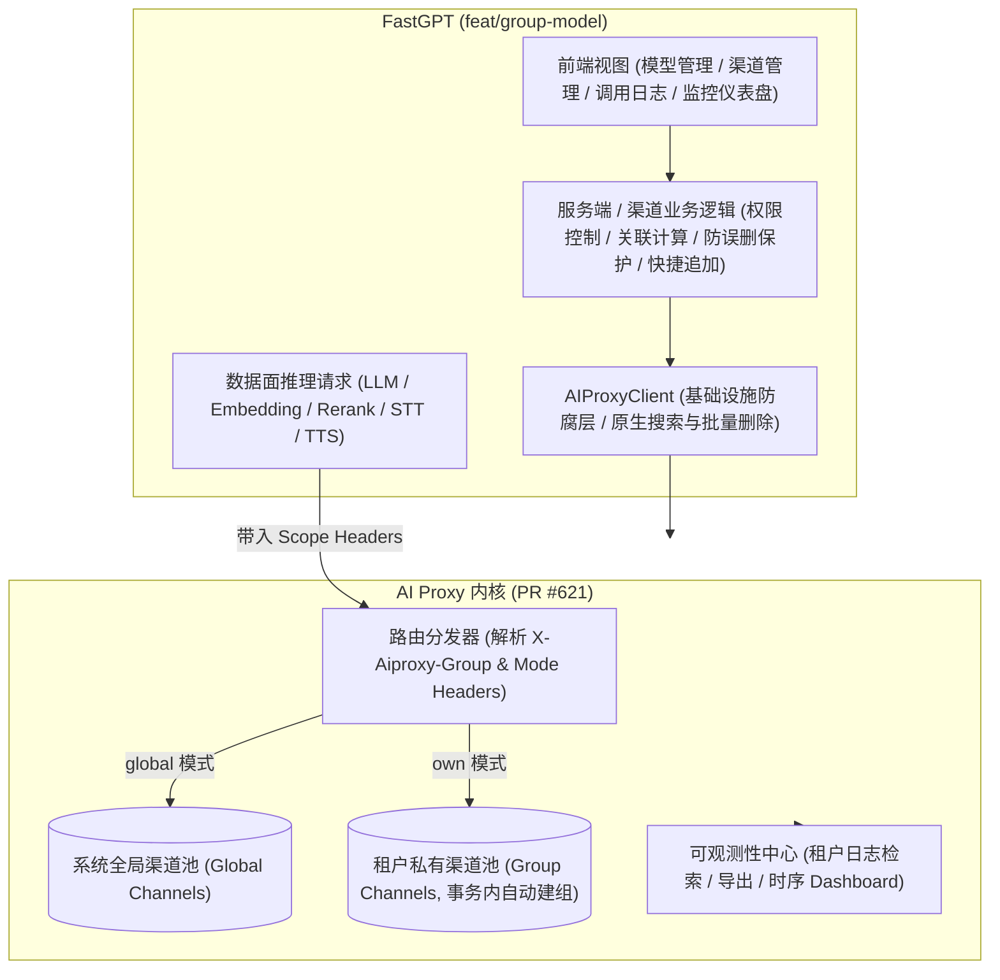

# AI Proxy 租户分组渠道（Group Channel）架构设计与 FastGPT 集成方案

> **文档归档路径**：`.agents/design/model/aiproxy-integration-and-branch-diff.md`  
> **适用分支**：`feat/group-model`  
> **关联底层**：[labring/aiproxy#621 - feat: group channel](https://github.com/labring/aiproxy/pull/621)  
> **核心目标**：统一收敛 AI Proxy 租户渠道（PR #621）能力分析与 FastGPT 架构设计，明确 Member 级多租户安全隔离边界，确立模型管理与 AI Proxy 的解耦架构、数据面路由规则及平滑迁移方案。

---

## 一、架构背景与系统定位

以往 AI Proxy 主要作为全局统一反向代理，所有渠道均为系统共享。PR #621 引入了原生 **Group Channel（租户分组渠道）** 体系，建立了“全局系统渠道（Global Channels）”与“租户分组渠道（Group Channels）”双轨并行的架构：



### 核心定位决策：
1. **AI Proxy 为标配底座（无条件常驻）**：
   彻底去除 `show_aiproxy` 等动态特性开关。只要具备模型管理权限的成员，在模型管理页面均常驻展示渠道管理、调用日志与监控分析能力。
2. **彻底解耦，单一事实源**：
   AI Proxy 作为渠道物理配置与中继转发的单一事实源；FastGPT 维护业务模型实体与显示名。两端通过模型名（`model`）在内存中动态映射，彻底废弃旧版分布式租约锁（`lease.ts`）以及在前端浏览器拉取全量渠道并发写回的反模式。

---

## 二、AI Proxy 核心能力与职责边界（对齐 PR #621 源码实现）

明确 AI Proxy 的实际能力边界是避免架构劣化的关键：

| 维度 | AI Proxy 能力范畴（PR #621） | AI Proxy 不负责的范畴（FastGPT 职责） |
| :--- | :--- | :--- |
| **渠道管理** | 1. 提供系统/Group 渠道完整 CRUD；<br>2. 原生支持 `batch_delete`（**Payload 约定为纯数组 `ids: []int`**）；<br>3. **无原生 `batch_status` 路由**，状态更新仅提供单条 `/status` 接口；<br>4. 模糊搜索通过独立的 `/channels/search?keyword=` 原生端点提供；<br>5. 通过 `ensureGroups` 原子建组，调用方无需预建 Group。 | 1. 控制谁能操作渠道（团队 RBAC 权限与 Member 隔离）；<br>2. 渠道名称唯一性防重校验（`assertChannelNameUnique`）；<br>3. 批量状态切换在 Service 层并发单条编排；<br>4. 前端展示交互。 |
| **路由转发** | Header 驱动路由：<br>- `X-Aiproxy-Group: <groupId>`<br>- `X-Aiproxy-Group-Channel-Mode: own / global`；<br>支持加权轮询、智能降权与熔断。 | 将内部业务 `modelId` 解析为实际模型名 `model`，注入正确的 Owner 路由 Header。 |
| **模型实体** | 仅维护渠道支持的模型名字符串列表（`models: []string`），无实体概念。 | 维护模型实体（`modelId`、类型、价格配置、权限、知识库/工作流绑定关系）。 |
| **依赖计算** | 仅根据模型名做转发匹配；提供 `channel-models/enabled` 查询可用模型集合。 | 内存计算模型关联渠道数（`channelCount`）、删除渠道前唯一依赖保护算法（`getChannelAffectedModels`）。 |
| **计费与权限**| 记录 Token 消耗量与基础通道费用；仅基于 Admin Token 与 Group ID 做接口鉴权。 | 用户钱包余额扣减、点数折算、VIP 额度控制、细粒度权限（Owner、协作者、模型操作权限）拦截。 |

---

## 三、核心业务原则与安全隔离铁律

1. **Member 级别私有数据绝对隔离**：
   - **渠道分组标识**：服务端强制推导：
     $$\text{groupId} = \text{fastgpt:tmb:} + \text{tmbId}$$
   - **私有模型归属**：归属于创建者（`modelData.tmbId`）。
   - **私有渠道归属**：归属于成员专属的 `groupId`，不同成员间**绝对互不可见**。
   - **日志与监控隔离**：仅允许查询当前成员专属 Group 的调用日志与时序仪表盘，严禁跨成员翻阅 Prompt 内容和指标。
2. **服务端强制防御，严禁信任前端透传**：
   - 所有 `/api/core/ai/channel/*` 接口服务端强制从当前登录 Session 提取 `tmbId` 并构建 `groupId`，杜绝前端通过 Query/Body 篡改。
   - 普通成员仅能操作 `channelType: 'team'`；系统管理员（Root）可通过 `channelType: 'system'` 维护平台全局渠道与监控。
3. **推理数据面路由规则（按模型 Owner 路由）**：
   - **系统模型**：统一走平台全局渠道，注入 `X-Aiproxy-Group-Channel-Mode: global`；
   - **团队私有模型**：无论工作流调用者是谁，**统一注入模型拥有者（Owner）的租户凭证**：
     ```ts
     export const getAiproxyScopeHeaders = (
       modelData: AiproxyScopeModelInput,
       baseUrl: string | undefined
     ): Record<string, string> => {
       if (!baseUrl || baseUrl !== aiProxyBaseUrl || !modelData) return {};
       if (isSystemModel(modelData)) {
         return { 'X-Aiproxy-Group-Channel-Mode': 'global' };
       }
       const tmbId = getModelOwnerTmbId(modelData);
       if (tmbId) {
         return {
           'X-Aiproxy-Group': getMemberGroupId(tmbId),
           'X-Aiproxy-Group-Channel-Mode': 'own'
         };
       }
       return {};
     };
     ```
     `own` 模式保证只在拥有者的私有渠道内寻找健康渠道；无渠道时 AIProxy 返回 404，绝不跨组泄漏，亦绝不私自回退到系统渠道。

---

## 四、系统架构与模块改造方案

### 1. 基础设施客户端与错误处理规范 (`packages/service/thirdProvider/aiproxy/`)
- **`AIProxyClient` 行为纯净化与底层端点对齐**：
  - **原生批量删除**：`batchDelete` 请求发送数组 Payload（`[1, 2, ...]`），直接对接 AI Proxy 原生端点；
  - **状态批量更新收敛**：移除底层不存在的 `/batch_status` 路由，由 Client 并发调用单条 `/status` 接口；
  - **动态端点选择**：构建 `buildChannelListUrl`，当存在 `search` 时自动路由至 AI Proxy 原生 `/search?keyword=` 端点；
- **404 精准业务识别**：
  - `resolve.ts`（单查渠道）：捕获 404 转为 `undefined`；
  - `summary.ts`（查询渠道摘要）：新用户未初始化渠道时捕获 404 转为空列表 `[]`，其余系统级错误正常抛出，由 API 层统一返回错误码供前端直接 Toast，严禁全量静默吞错；
- **运行时无可用渠道拦截**：
  在五大模型运行时调用出口（LLM、Embedding、Rerank、TTS、STT）统一使用 `normalizeRelayNoChannelError`，将 AIProxy 404 无渠道精准转换为 `ModelErrEnum.noAvailableChannel`。

### 2. 领域层概念收敛与模型管理规范 (`packages/global` & `packages/service`)
- **统一多租户作用域类型约定**：
  `AIScope` 统一采用规范的字面量联合 `'system' | 'team'`（与领域枚举 `ModelScopeEnum` 保持语义对齐），避免 OpenAPI 与前端/Service 交叉类型时引发 TypeScript 编译器 `never` 冲突；
- **通用模型判断 Helper**：
  在 `@fastgpt/global/core/ai/model/utils.ts` 中封装 `isSystemModel`、`isTeamModel` 与 `getModelOwnerTmbId`，彻底消除全仓多处非类型安全的 `(model as { tmbId?: string })` 强转断言；
- **新建模型快捷关联收敛至服务端**：
  在 `/api/core/ai/model/create` 接口支持可选的 `channelIds`；由服务端 `appendModelToChannels` 严格在租户权限校验后幂等追加关联，完全废弃前端拉取全量渠道并发写回的脏逻辑。

### 3. API 路由层收敛 (`projects/app/src/pages/api/core/ai/`)
全部接口基于 `parseApiInput` 进行 Zod 校验，强绑定 `session.tmbId`：
- `channel/list.ts`：透传 `pageNum`、`pageSize`、`search` 到 AI Proxy，全量关联时复用 `listAll()` 防止截断；
- `channel/create.ts` / `update.ts` / `delete.ts` / `status.ts`：标准的渠道 CRUD 控制；
- `channel/batch.ts`：对接批量删除与状态更新；
- `channel/affectedModels.ts`：在删除渠道前预检哪些模型将失去全部渠道；
- `channel/models.ts` & `channel/modelChannels.ts`：模型与渠道双向关联展示；
- `channel/logs.ts` / `logDetail.ts` / `dashboard.ts`：当前成员私有作用域下的日志与时序数据。

### 4. 前端交互层改造 (`projects/app/src/pageComponents/model/`)
- **常驻 Tabs**：在模型管理中常驻提供「活跃模型」、「模型配置」、「模型渠道」、「调用日志」、「监控分析」标签页；
- **统一 Tab 容器**：使用 `ModelManagementContainer` 统揽系统管理员视图与团队成员个人视图；
- **数据驱动与防抖**：表格多选直接对接 `batch.ts`，操作回调依靠 `useRequest` 原生机制进行 Toast 反馈；
- **安全渲染兜底**：消费层对模型与渠道列表默认采用 `?? []` 兜底，确保网络请求失败时仅弹 Toast，不会触发 React 渲染崩溃。

---

## 五、验收标准

1. **Member 隔离验证**：成员 A 创建的私有渠道与日志，成员 B 无法通过任何界面或 API 查询到；
2. **跨成员调用验证**：成员 B 在应用中调用成员 A 的私有模型，请求带入成员 A 的 `X-Aiproxy-Group` 顺利推理，配额与调用日志严格落在成员 A 名下；
3. **模糊搜索有效性**：在渠道管理页面搜索渠道名或模型名，关键词准确传递至 AI Proxy `/search?keyword=` 原生端点并即时过滤；
4. **批量操作原子性**：勾选多个渠道进行批量删除，以纯数组 Payload 形式由 AI Proxy 原生批量删除端点原子执行；
5. **新建模型关联无前端副作用**：新建模型时勾选渠道，由后端原子处理追加，前端无多余网络拉取与离散写入；
6. **单元测试矩阵**：`@fastgpt/service` 渠道/模型测试与 `projects/app` 核心测试全部 100% 通过。
