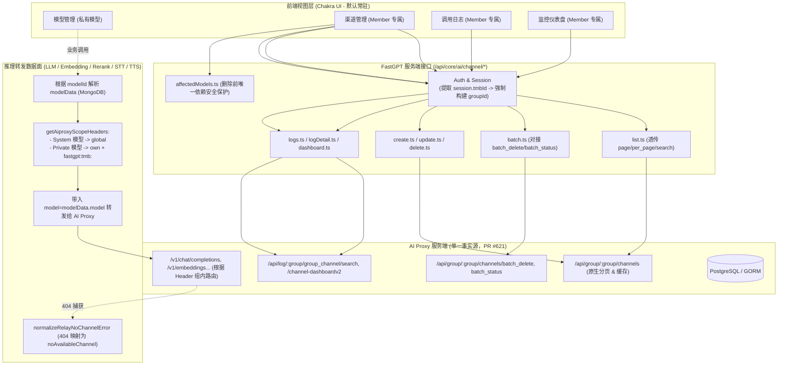

# FastGPT `feat/group-model` 分支对接 AI Proxy 架构设计与迁移方案

> **文档归档路径**：`.agents/design/model/aiproxy-integration-and-branch-diff.md`  
> **适用分支**：`feat/group-model`（基于最新 `upstream/main`）  
> **比对基准**：前置重构分支 `model-refactor`、AI Proxy 最新 PR [labring/aiproxy#621](https://github.com/labring/aiproxy/pull/621) 与当前 main 分支现状  
> **核心目标**：确立模型管理与 AI Proxy 的解耦架构，规范 Member 级数据安全隔离边界，制定透传分页、批量操作及基于最新统一系统迁移框架的实施路线。

---

## 一、核心业务原则与安全隔离边界（强制铁律）

在 FastGPT 平台内，**AI Proxy 已作为平台标配基础设施，全量默认走 AI Proxy**（无需 `show_aiproxy` 等动态特性开关）。  
**有管理模型权限的成员**所涉及的模型与渠道资产具备严格的私密性与独立性：

1. **全量默认走 AI Proxy（无条件常驻）**：
   - AI Proxy 是系统标准底层依赖，不再通过 `feConfigs.show_aiproxy` 或 `hasAIProxyApiEndpoint` 做动态条件显隐；
   - 凡是具备模型管理权限的成员，在模型管理页面均**默认展示**模型配置、模型渠道、调用日志、时序监控三大核心能力。
2. **Member 级别私有数据隔离（绝对互不可见）**：
   - **模型配置（Model Config）**：私有模型归属于特定成员（`modelData.tmbId`），普通成员只能管理自己名下的私有模型。
   - **模型渠道（Model Channel）**：私有渠道归属于该成员专属的分组，AI Proxy 对应的 `groupId` 格式为：
     $$\text{groupId} = \text{fastgpt:tmb:} + \text{tmbId}$$
     每个成员只能在界面上查看、配置自己的渠道，不同成员之间**绝对互不可见**。
   - **调用日志（Channel Logs）**：只允许查看归属于当前成员自身渠道的调用流水，绝不允许跨成员翻阅 Prompt 内容和执行记录。
   - **时序监控（Dashboard）**：监控折线图（QPS、Token 吞吐、延迟）仅聚合该成员名下的渠道流量，不混淆他人数据。
3. **服务端强制防御，严禁信任前端透传**：
   - 所有渠道相关的 API 路由（`/api/core/ai/channel/*`），服务端必须直接从当前登录会话中提取 `session.tmbId` 并生成 `groupId`；
   - 杜绝前端通过 URL Query 或 Request Body 篡改或伪造其他成员的 `tmbId` / `groupId`。
4. **系统管理员（Root）全局运维通道**：
   - 普通成员仅能操作 `channelType: 'team'`（绑定自身 `tmbId`）；
   - Root 管理员可通过 `channelType: 'system'` 维护平台公共系统渠道、查看系统级公共日志与全局监控仪表盘。

---

## 二、架构决策与纠偏清单（基于讨论确认）

结合此前重构分支（`model-refactor`）的经验教训、AI Proxy PR #621 的最新能力，确立以下 6 项核心决策：

| 序号 | 架构决策项 | 决策结论 | 理由与技术细节 |
| :---: | :--- | :--- | :--- |
| **1** | **标配化基础设施定位** | **不需要 `show_aiproxy` 开关，全量默认走 AI Proxy** | AI Proxy 为系统标配底座，彻底去除 `feConfigs.show_aiproxy` 字段及分支判断。只要拥有模型管理权限，前端常驻展示渠道、日志与监控三大 Tab。 |
| **2** | **模型调用路由归属** | **按模型拥有者（Owner）路由** | 无论谁在工作流中调用某私有模型，推理请求统一注入该**模型所属 Owner** 的标识：`X-Aiproxy-Group: fastgpt:tmb:<modelData.tmbId>` + `X-Aiproxy-Group-Channel-Mode: own`。保证私有模型始终走其创建者自己的渠道和配额。系统模型走 `global`。 |
| **3** | **渠道列表缓存与分页策略** | **透传分页给 AI Proxy，废弃本地全量拉取** | **彻底摒弃**旧分支在 FastGPT Node.js 本地 30s 内存桶全量递归拉取做 `slice` 分页的错误模式。直接透传前端的 `page`、`per_page`、`search` 到 AI Proxy，利用 AI Proxy PR #621 底层原生的高性能缓存和分页，彻底杜绝多 Pod 实例间缓存不一致。 |
| **4** | **PR #621 新能力接入范围** | **直接对接批量接口；表单暂不引入草稿预检与限流** | 暂不引入 `test-preview` 和渠道级 RPM/TPM 限流配置，避免增加前端复杂度；**直接对接** AI Proxy 原生提供的批量操作接口：`/channels/batch_delete` 和 `/channels/batch_status`，提升批量操作性能。 |
| **5** | **旧版租约锁与写渠道清理** | **彻底移除 `lease.ts`** | 彻底删除当前 main 分支中的 `packages/service/thirdProvider/aiproxy/lease.ts` 以及在模型增删改时强写渠道 `models` 数组的旧逻辑。AI Proxy 为渠道单一事实源，模型与渠道两端通过模型名在 FastGPT 内存中动态映射。 |
| **6** | **存量平滑升级迁移方案** | **接入统一迁移框架 `projects/app/src/migration/`** | 放弃旧分支单点的 `initv4170.ts` 脚本，遵循 FastGPT 最新的任务迁移规范（`projects/app/src/migration/tasks/`），以独立的非阻塞/阻塞 Task 实现将旧模型 `metadata.requestUrl`/`requestAuth` 迁移为 AI Proxy 渠道。 |

---

## 三、目标架构图与数据流



---

## 四、模块调整与代码改造规划（不修改代码，仅作为设计蓝图）

### 1. 后端服务层改造（`packages/service`）

#### 【移除（DELETE）旧版反模式模块】
- `packages/service/thirdProvider/aiproxy/lease.ts`：彻底废弃 Redis 租约锁。
- `packages/service/thirdProvider/aiproxy/channel.ts`：彻底删除 `replaceModelInAIProxyChannels`、`appendModelsToAIProxyChannels`、`removeModelsFromAIProxyChannels` 等在模型增删改时强写渠道的行为。

#### 【新建与完善核心渠道模块（`packages/service/core/ai/channel/`）】
- `const.ts`：定义轻量常量与 Group ID 推导函数：
  ```ts
  export const getSystemGroupId = (tmbId: string): string => `fastgpt:tmb:${tmbId}`;
  ```
- `api.ts`（AI Proxy Client）：
  - 包装强类型的 Axios 请求，统一走 `axiosWithoutSSRF` 并注入 `Bearer ${AIPROXY_API_TOKEN}`；
  - **直接支持服务端分页**：`listGroupChannels(groupId, { page, perPage, search })` 直接请求 `/api/group/:groupId/channels`，不再在本地全量拉取；
  - **批量操作**：封装 `batchDeleteGroupChannels` 和 `batchUpdateGroupChannelStatus`；
  - 导出 `getSystemChannelById`、`getGroupChannelById` 单条精准检索接口。
- `controller.ts`：
  - 业务层关联计算：`pairChannelsToModels`、`channelCount`；
  - 删除防误删算法：`getChannelAffectedModels`（计算哪些模型仅依赖该渠道，避免误删导致服务中断）；
  - 错误归一化：`normalizeAiproxyError`、`normalizeRelayNoChannelError`；
  - 权限断言：`assertOwnGroupChannel(channel, tmbId)` 校验渠道是否归属于当前成员。

#### 【数据面 Scope 注入（`packages/service/core/ai/config.ts`）】
- 统一维护 `getAiproxyScopeHeaders(modelData, baseUrl)`：
  ```ts
  export const getAiproxyScopeHeaders = (
    modelData: { isSystem?: boolean; tmbId?: string } | undefined,
    baseUrl: string | undefined
  ): Record<string, string> => {
    if (!baseUrl || baseUrl !== aiProxyBaseUrl) return {};

    // 系统公共模型：仅走全局渠道
    if (modelData?.isSystem) {
      return { 'X-Aiproxy-Group-Channel-Mode': 'global' };
    }

    // 团队私有模型：强制锁定模型拥有者自己的专属渠道
    if (modelData?.tmbId) {
      return {
        'X-Aiproxy-Group': getSystemGroupId(String(modelData.tmbId)),
        'X-Aiproxy-Group-Channel-Mode': 'own'
      };
    }

    return {};
  };
  ```
- 五大引擎（LLM、Embedding、Rerank、TTS、STT）统一在构造请求时合并该 Header，并使用 `normalizeRelayNoChannelError` 捕获异常。

---

### 2. API 路由层改造（`projects/app/src/pages/api/`）

#### 【移除旧接口】
- 删除 `projects/app/src/pages/api/aiproxy/api/createChannel.ts`。

#### 【收敛到规范 REST 路由（`projects/app/src/pages/api/core/ai/channel/`）】
全部接口强制使用 `parseApiInput` 校验，强制绑定 `session.tmbId`：
1. `list.ts`：调用 AI Proxy 分页接口拉取渠道列表，返回分页结果及每个渠道关联的 FastGPT 模型数。
2. `create.ts`：创建渠道，普通成员自动推导 `groupId`，Root 允许创建系统渠道。
3. `update.ts`：更新渠道配置，执行 `assertOwnGroupChannel` 校验防越权。
4. `delete.ts`：删除渠道，执行防越权校验。
5. `status.ts`：单渠道启停。
6. `test.ts`：单渠道探活测试，注入 `Aiproxy-Channel` 锁定渠道。
7. `affectedModels.ts`：删除前预检受影响模型。
8. `models.ts` & `modelChannels.ts`：模型与渠道双向悬浮详情。
9. `logs.ts` & `logDetail.ts`：严格限制当前成员查自己的组日志。
10. `dashboard.ts`：聚合当前成员渠道的时序指标。

---

### 3. 统一系统迁移框架接入（`projects/app/src/migration/`）

按照 FastGPT 最新迁移设计规范（`projects/app/src/migration/tasks/README.md`）：
- 在 `projects/app/src/migration/tasks/` 下新增独立的迁移任务目录（如 `YYYYMMDD_migrate_legacy_channel_configs/`）；
- `index.ts` 导出标准的系统迁移任务结构，在 `registry.ts` 末尾注册；
- 任务逻辑：
  1. 扫描带有旧 `requestUrl`/`requestAuth` 的模型；
  2. 内存按 `(model, requestUrl, requestAuth)` 去重；
  3. 通过 AI Proxy API 幂等创建 `Migrated: <model>` 系统渠道（已存在则跳过）；
  4. 采用标准的 `reportProgress` 与错误快照机制，支持断点续跑与失败重试；
  5. 不在日志中暴露 `requestAuth` 密钥明文。

---

### 4. 前端视图与交互层改造（`projects/app/src/pageComponents/account/model/`）

1. **Tab 布局（常驻展示）**：
   - 彻底废除 `show_aiproxy` 判断逻辑，有权限的成员打开模型管理页面直接展示「活跃模型」、「模型配置」、「模型渠道」、「调用日志」、「监控分析」Tabs。
2. **Member 数据隔离保障**：
   - 渠道页面不再提供“查看他人渠道”的切换开关；普通成员打开时，天然只能看到自己拥有权限的私有渠道；
   - 日志与监控页面默认锁定当前成员自身范围，无需也不允许切换租户 ID。
3. **对接批量能力**：
   - 渠道列表表格支持多选勾选，批量操作直接对接 `/batch_delete` 和 `/batch_status` 接口。

---

## 五、方案验证与验收标准

1. **多租户安全隔离验证**：
   - 成员 A 配置私有渠道后，成员 B 登录渠道管理页面，返回列表确认没有任何属于成员 A 的渠道信息；
   - 成员 B 在工作流中调用成员 A 创建的私有模型，请求成功通过，且扣减与日志完整记录在成员 A 的 `fastgpt:tmb:A` 组内。
2. **端到端推理转发验证**：
   - 发起 LLM、Embedding、Rerank、TTS、STT 请求，确认发送给 AI Proxy 的请求头携带正确的 `X-Aiproxy-Group` 与 `Mode`；
   - 当成员将模型渠道停用后，再次调用模型，确认前端精准提示“当前模型暂无可用渠道”（而非原始 404）。
3. **多 Pod 分页一致性验证**：
   - 修改渠道后立即刷新列表，确认分页数据直接由 AI Proxy 最新数据响应，不存在单机内存缓存导致的延迟与脏读。
4. **迁移任务幂等性验证**：
   - 运行新版系统迁移任务，确认旧配置平滑转为 AI Proxy 渠道，重跑任务状态正常判定为 skipped，无重复数据写入。
