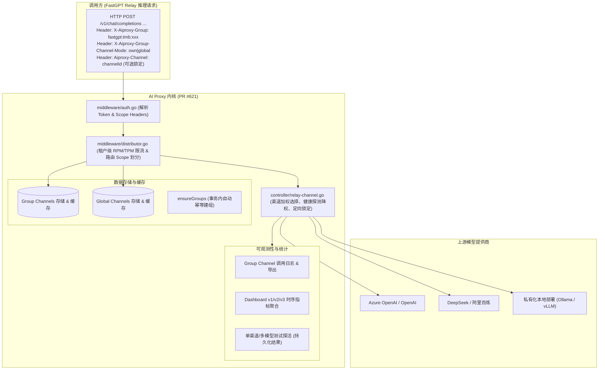

# AI Proxy PR #621（Group Channel）变更分析与能力边界报告

> **关联 PR**：[labring/aiproxy#621 - feat: group channel](https://github.com/labring/aiproxy/pull/621)  
> **核心目标**：为 AI Proxy 引入原生 **Group Channel（分组/租户渠道）** 体系，实现渠道级多租户隔离、动态路由、租户限流、独立测试与时序监控。  
> **面向系统**：FastGPT `feat/group-model` 分支对接与架构适配。

---

## 一、PR #621 核心变更背景与架构演进

以往 AI Proxy 主要作为全局统一的反向代理，所有渠道均为系统级共享，上层应用（如 FastGPT）只能通过修改全局渠道的 `models` 列表进行粗粒度管理。  
PR #621 彻底重构并扩展了 AI Proxy 的渠道与路由内核，建立了 **“全局系统渠道（Global Channels）”** 与 **“租户分组渠道（Group Channels）”** 双轨并行的架构：

---

## 二、AI Proxy 核心能力矩阵（能做什么）

PR #621 为 AI Proxy 赋予了五大层面的完备能力：

### 1. 租户分组渠道（Group Channel）管理能力
- **独立的 Group 渠道 CRUD 路由**：
  - 单租户操作：`POST /api/group/:group/channel/`、`PUT /api/group/:group/channel/:id`、`DELETE /api/group/:group/channel/:id`、`POST /api/group/:group/channel/:id/status`；
  - 全局聚合运维（Root 跨租户查看）：`POST /api/group_channel/`、`PUT /api/group_channel/:id`、`DELETE /api/group_channel/:id`、`GET /api/group_channels/`；
  - 批量删除与状态批量更新：`/api/group/:group/channels/batch_delete`、`batch_status`。
- **自动幂等建组（Ensure Groups）**：
  - 在创建 Group 渠道时，AI Proxy 内部通过 `ensureGroups` 在数据库层面原子执行 `ON CONFLICT DO NOTHING`；
  - **上层效益**：FastGPT 无需预先调用创建 Group 接口，直接创建租户渠道即可，天然幂等。
- **配置项完整支持**：
  - 提供商类型 `type`、名称 `name`、凭证 `key`、地址 `base_url`/`proxy_url`；
  - 模型重映射 `model_mapping`（例如将通用名映射为服务商私有部署名）；
  - 权重优先级 `priority`、模型标签集合 `sets`、网络配置（`skip_tls_verify` 等）。

### 2. 路由分发与安全隔离能力（Relay & Routing）
- **Header 驱动的多租户路由隔离**：
  | 请求头 | 允许值 | 行为约定 |
  | :--- | :--- | :--- |
  | `X-Aiproxy-Group` | `<groupId>` | 指定当前请求绑定的租户标识（如 `fastgpt:tmb:xxx`） |
  | `X-Aiproxy-Group-Channel-Mode` | `own` | **仅在本组私有渠道内寻找**匹配模型的健康渠道；组内无渠道直接报 404，**绝不跨组泄漏，也绝不回退到全局渠道** |
  | `X-Aiproxy-Group-Channel-Mode` | `global` | **仅在全局系统渠道内寻找**，忽略任何组内私有渠道 |
- **单渠道强制锁定（Designated Channel）**：
  - 支持请求头 `Aiproxy-Channel: <channelId>`；
  - 命中后，Relay 引擎**跳过负载均衡和轮询**，强制打到该具体渠道；
  - **安全性保证**：普通非 internal token 且非组内渠道时禁止使用，杜绝越权探测。
- **智能降权与故障剔除（Smart Failover）**：
  - 动态统计渠道近期的错误率（`maxRetryErrorRate = 0.85`）；
  - 采用平滑降权惩罚函数（`errorRatePenaltyBase = 0.10, errorRatePenalty = 2.0`），自动降低不健康渠道的分配概率，严重故障自动熔断跳过。

### 3. 租户级独立限流与配额保护（Rate Limit & Token Limit）
- 支持在 Group 渠道粒度进行精准限流：
  - **RPM 限制**：每分钟请求数限制（`PushGroupChannelModelRequest`）；
  - **TPM 限制**：每分钟 Token 吞吐限制（`GetGroupChannelModelTokensRequest`）；
- 超限时返回标准 `429 Too Many Requests`，并在 Header 中输出 `RateLimit-Limit` 与 `RateLimit-Remaining`。

### 4. 探活测试与预检能力（Testing & Previews）
- **即时持久化测试**：
  - `GET /api/group/:group/channel/:id/test/*model`：测试单个模型连通性；
  - `GET /api/group/:group/channel/:id/test`：批量测试渠道绑定的所有模型；
  - 测试产生的请求量、耗时及最新失败时间（`last_test_error_at`）直接更新并持久化在渠道记录中。
- **无需保存的草稿预检（Test-Preview）**：
  - `POST /api/group/:group/channel/test-preview`；
  - 在创建或编辑渠道保存前，直接将表单填写的 URL 和 Key 发起测试，验证配置正确性。

### 5. 可观测性（Logs & Multi-version Dashboards）
- **租户调用日志**：
  - `GET /api/log/:group/group_channel/search`：按 RequestID、模型、时间范围、状态码筛选日志；
  - `GET /api/log/:group/group_channel/detail/:log_id`：查询包含输入输出详情的调用记录；
  - 支持调用日志按组批量导出与历史清理。
- **多版本时序监控仪表盘**：
  - `GET /api/group/:group/channel-dashboardv2`（及 v3 版本）：
  - 支持按 `timezone`、`timespan`（小时/天）、`model`、`channel` 聚合输出 QPS、总 Tokens、错误率折线图。

---

## 三、AI Proxy 的边界限制（不能做什么 / 非职责范畴）

明确 AI Proxy 的能力边界，是 FastGPT 侧系统设计的核心准绳：

| 维度 | AI Proxy 能力范畴（Yes） | AI Proxy 不负责的范畴（No / 须由 FastGPT 实现） |
| :--- | :--- | :--- |
| **模型实体（Model）** | 仅维护渠道支持的模型名字符串列表（`models: []string`） | **不维护 FastGPT 业务模型实体**（无 `modelId`、无显示名称、无模型所属分类与图标、无知识库/工作流绑定关系） |
| **Relay 路由字段** | 只认请求体中的 `model` 字段（上游模型名） | **不接收、不解析 FastGPT 内部的 `modelId`**；FastGPT 必须在发送前将 `modelId` 解析为实际的 `model` 字符串 |
| **业务计费（Billing）** | 仅记录 Token 消耗量与基础通道费用明细 | **不负责 FastGPT 租户钱包余额扣减**、点数折算、VIP 套餐额度控制与商业发票逻辑 |
| **权限体系（RBAC）** | 仅做基于 Admin Token、Group ID 的粗粒度接口鉴权 | **不知道 FastGPT 的细粒度权限**（不知道谁是团队 Owner、协作者、是否有“创建模型权限”），需由 FastGPT 接口层拦截守门 |
| **渠道与模型关联映射** | 仅在被路由时根据字符串名称做前缀或完全匹配 | **不知道 FastGPT 某个业务模型究竟挂了多少个渠道**（关联数 `channelCount`、删除前保护算法 `affectedModels` 必须由 FastGPT 内存计算） |

---

## 四、FastGPT 侧对接设计建议（针对 `feat/group-model` 分支）

结合 PR #621 的能力边界，FastGPT 在 `feat/group-model` 分支上的调整适配建议如下：

### 1. 架构定位：彻底解耦，摒弃“写渠道模型”与“租约锁”
- **现状淘汰**：淘汰当前分支 `packages/service/thirdProvider/aiproxy/channel.ts` 中通过修改渠道 `models` 数组绑定的做法，移除 `lease.ts`（分布式租约锁）。
- **新模式**：
  - AI Proxy 作为渠道与转发事实源；
  - FastGPT 侧模型保存规范模型标识（`model`）与显示名；
  - 两者通过上游模型名（`model` 字段）在 FastGPT 服务端内存动态映射，无需双向写入。

### 2. 租户隔离对接：标准注入 Scope Headers
- 在五大 AI 引擎调用中，统一封装并调用 `getAiproxyScopeHeaders`：
  - 系统公共模型：注入 `X-Aiproxy-Group-Channel-Mode: global`；
  - 团队私有模型：注入 `X-Aiproxy-Group: fastgpt:tmb:<tmbId>` + `X-Aiproxy-Group-Channel-Mode: own`。

### 3. API 路由层演进：统一收敛到 `/api/core/ai/channel/*`
- 摒弃旧版单个 `/api/aiproxy/api/createChannel.ts`；
- 采用面向资源的统一路由：`list`, `create`, `update`, `delete`, `status`, `test`, `dashboard`, `logs`，并在服务端通过当前 session 推导 `groupId`，杜绝前端越权。

### 4. 读性能保障：引入 30s 内存桶缓存与事件驱动写失效
- 避免频繁直调 AI Proxy `/api/channels/all`；
- 按 `system` 和 `groupId` 划分 30 秒局部内存缓存，并在 FastGPT 渠道修改、删除或探活成功后立即失效缓存。
