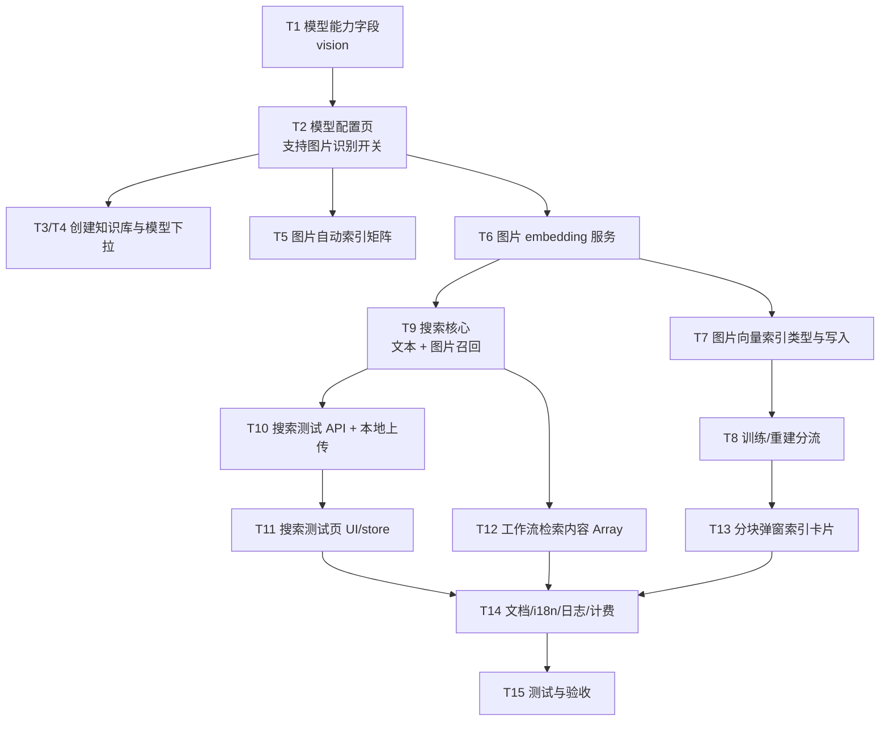
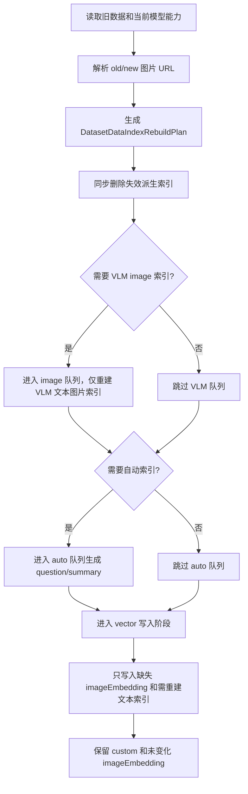

# 功能开发文档

## 文档标识

- 任务前缀：`图搜图-当前需求`
- 文档文件名：`图搜图-当前需求-功能开发文档.md`
- 更新时间：2026-05-01
- 文档状态：`v2.0 反向核对完成，补齐重建链路与搜索测试页 UI`
- 文档定位：面向开发和 AI 实现的任务拆解文档。旧的 `图搜图-接入-*` 文档不覆盖，本文件按用户最新确认需求重新规划。

## 0. 开发目标与约束

- 功能目标：接入图搜图能力，覆盖 embedding 模型配置页 `支持图片识别` 开关、创建知识库模型选择、图片自动索引、图片向量索引生成、分块弹窗 UI、搜索测试本地上传图片、工作流知识库搜索节点 `Array<string>` 检索内容和后端图文混合检索。
- 代码范围：`packages/global`、`packages/service`、`packages/web`、`projects/app`、`pro/admin`、`document/content`。
- 非目标：不新增知识库类型；不新增搜索模式大类；不重做模型配置页整体框架；不做存量图片向量自动迁移；不做全量工作流文件系统重构；不改训练状态展示大类。
- 实现原则：最小改动、复用现有搜索/RRF/权限/计费能力；图片向量索引和 VLM 文本索引分清楚；能靠配置和 helper 解决的不要到处散落判断。
- 必须遵循规范：`references/style-standards-entry.md`。
- 适用维度：API[x] DB[x] Front[x] Logger[x] Package[x] BugFix[ ] DocUpdate[x] DocI18n[x]。

## 1. 实施任务拆解（可直接执行）

| 任务ID | 任务名称 | 责任层 | 输入 | 输出 | 完成定义（DoD） |
|---|---|---|---|---|---|
| T1 | 扩展 embedding 模型能力字段 | Global/Service | 模型配置 | `vision?: boolean` | 老配置可解析，helper 能判断 image 能力 |
| T2 | 改模型配置页 embedding 功能配置 | Front/API | embedding 模型设置表单 | `支持图片识别` 开关，默认关闭，打开后保存 `vision=true` | 样式参考 LLM 功能配置，关闭时 text-only |
| T3 | 改模型选择器标签 | Front | embedding model list | `Beta`、`多模态` 标签和 `多模态` hover 说明 | `Beta` 在前，长模型名不挤压标签；hover `多模态` 展示固定文案 |
| T4 | 改创建知识库弹窗 | Front/API | 新 UI 图、最新提示文案 | 宽弹窗、三模型字段、索引模型标签、QuestionTip | 创建成功参数保持兼容；索引模型和图片理解模型问号提示使用固定文案 |
| T5 | 改图片自动索引可用性 | Front/Global | 商业版、多模态、VLM 配置 | 动态 disabled、tooltip、tips | 5 种场景符合矩阵，禁用时提交值为 false |
| T6 | 增加图片 embedding 服务 | Service | 图片 URL/S3 key | 图片向量 | 支持 db/query 两种场景，错误可观测 |
| T7 | 增加图片向量索引类型和写入链路 | Global/Service/DB | 图片数据/图文数据 | `imageEmbedding` 索引向量 | 不污染现有 VLM `image` 文本索引 |
| T8 | 改训练和重建分流 | Service/Pro | 多模态/VLM 配置、当前 `vectorModel`、data.indexes、内容变化状态 | 文本索引和图片索引按当前模型能力做差量规划、分流训练/重建 | 重建不把图片引用当文本 embedding；内容未变只补缺失索引/清理失效索引；内容变更时按文本、VLM、图片 URL diff 精准重建 |
| T9 | 改搜索核心 | Service | `textQueries + queryImageUrls`、当前知识库 `vectorModel/vlmModel` | 按模型能力分支召回 + RRF | 多模态 embedding 直接图/文检索；有 VLM 时合并图片转文字召回；普通 embedding 有 VLM 时图片先转文字；普通 embedding 无 VLM 时不做图片检索 |
| T10 | 改搜索测试 API 和本地上传图片 | API/Front | 本地图片、搜索参数 | 可测试图片输入 | `text` 可选；支持仅图片搜索；最多 10 张；只支持图片，不支持文件；格式和大小跟随系统并过滤不合法输入；上传对象 3 小时过期 |
| T11 | 改搜索测试页 UI/store | Front | 最新搜索测试上传图片与历史 hover 图 | 搜索配置、测试按钮、历史无 icon、输入框内上传按钮、缩略图、上传中卡片、历史图片 hover 缩略图浮层 | 视觉与交互符合新稿；超过 10 张提示 `最多支持上传10张图片`；无图片搜索能力时禁用上传按钮并提示 |
| T12 | 改工作流知识库搜索节点 | Global/Service/Front | `Array<string>` 检索内容 | 同槽位接用户问题和文件链接，兼容层统一归一化后端仅保留图片链接 | 新节点为 arrayString，旧节点 string 由兼容层处理；PDF/docx 等非图片文件链接被过滤 |
| T13 | 改文件/图片分块弹窗 | Front/API | 第三、第四张图与最新补充图 | 新索引卡片、图片预览、图片内容、索引删除入口 | 多模态图片索引内容不可见；默认索引和多模态图片索引不可删；其他索引可删 |
| T14 | 补计费、日志、i18n、文档 | Service/Web/Docs | 新能力 | 用量统计、脱敏日志、中英文文档 | 文档和翻译同步 |
| T15 | 测试与验收 | Test | T1-T14 | 自动化/手工验证 | 局部测试通过，最终 `pnpm lint`/必要测试通过 |

### 1.1 技术实现流程图（必填）



实现说明：

- `T1` 是所有判断的地基，别在前后端散写 `model.includes('xxx')` 这种土法炼钢。
- `T2` 是模型是否支持图片输入的唯一人工配置入口；embedding 模型复用现有 `vision` 字段，语义为“支持图片向量化”，不再新增 `modalities`。
- `T5` 是本次用户特别补充点，禁用状态和提示文案必须跟矩阵一致。
- `T12` 不能改成额外 `fileUrlList` 外露输入，用户已经确认“检索内容本身改 Array<string>”；但数组里的文件链接只有图片能参与检索，非图片文件链接必须在后端过滤。

## 2. 文件级改动清单

| 文件路径 | 改动类型 | 变更摘要 | 关键代码（可伪代码） | 关联任务ID |
|---|---|---|---|---|
| `packages/global/core/ai/model.schema.ts` | 修改 | `EmbeddingModelItemSchema` 增加/复用 `vision` | `vision: z.boolean().optional()` | T1 |
| `packages/service/core/ai/model.ts` | 修改 | 增加能力判断 helper | `isImageEmbeddingModel(model)` | T1 |
| `projects/app/src/pageComponents/account/model/AddModelBox.tsx` | 修改 | embedding 模型设置表单新增 `功能配置` 区域和 `支持图片识别` 开关 | 开关默认关；打开保存 `vision=true`；关闭保存/恢复为 `vision=false` 或缺省 | T2 |
| `projects/app/src/pageComponents/account/model/ModelConfigTable.tsx` | 修改 | 模型配置列表/设置入口识别 embedding `vision` | `vision=true` 显示 `多模态` 标签，`Beta` 在前 | T2/T3 |
| `projects/app/src/pages/api/core/ai/model/update.ts` | 修改 | 模型配置保存支持 embedding `vision` | schema parse 后保存 `vision`；老 embedding 无 `vision` 按 false | T2 |
| `projects/app/src/pages/api/core/ai/model/list.ts` | 修改/核查 | 模型配置列表返回 embedding `vision` | 前端下拉和配置页能拿到 image 能力 | T2/T3 |
| `packages/web/i18n/*/account_model.json` | 修改 | embedding 功能配置文案、图片理解模型 tip | 复用/新增 `支持图片识别` tip；更新/新增 `vlm_model_tip` 为 `自动标注文档里的图片并生成文本描述，辅助文本检索` | T2/T4 |
| `packages/web/i18n/*/common.json` | 修改 | 创建知识库索引模型 tip、多模态标签 hover 文案 | 更新 `core.dataset.embedding model tip` 或新增 `core.dataset.embedding_model_tip`；新增 `core.ai.model.multimodal_tip` | T3/T4/T14 |
| `projects/app/src/components/Select/AIModelSelector.tsx` | 修改 | 支持 `Beta`、`多模态` 标签顺序和 hover | tag list 先 beta 后 multimodal；`多模态` tag hover 展示 `多模态索引模型可以给图片生成向量。` | T3 |
| `projects/app/src/pageComponents/dataset/list/CreateModal.tsx` | 修改 | 弹窗和字段布局按第一张图，并接入新 QuestionTip 文案 | 宽度、label、selector 样式调整；`索引模型` 和 `图片理解模型` 问号提示用固定 i18n 文案 | T4 |
| `projects/app/src/pageComponents/dataset/detail/Form/CollectionChunkForm.tsx` | 修改 | 图片自动索引 disabled/tips 矩阵 | `getImageIndexConfigState()` | T5 |
| `packages/web/i18n/*/dataset.json` | 修改 | 图片自动索引动态文案、多模态图片索引默认说明、索引删除确认文案 | 新增 tips/default description/delete confirm key | T5/T13/T14 |
| `packages/service/core/ai/embedding/index.ts` | 修改 | 增加 `getVectorsByImage` | 图片输入转 embedding request | T6 |
| `packages/service/common/vectorDB/controller.ts` | 修改 | 支持外部预计算向量写入 | `insertDatasetVectors()` | T6/T7 |
| `packages/global/core/dataset/data/constants.ts` | 修改 | 新增 `DatasetDataIndexTypeEnum.imageEmbedding` | `imageEmbedding = 'imageEmbedding'` | T7 |
| `packages/global/core/dataset/constants.ts` | 修改 | 新增 `SearchScoreTypeEnum.imageEmbedding` | 用于 quote 分数展示 | T7/T9 |
| `projects/app/src/service/core/dataset/data/controller.ts` | 修改 | 数据写入按索引类型分流，并支持可删除索引同步清理后端数据/向量 | imageEmbedding 走图片向量；默认索引和 imageEmbedding 不允许删除；删除其他索引不能只做 UI 过滤 | T7/T13 |
| `projects/app/src/pages/api/core/dataset/collection/create/images.ts` | 修改 | 多模态索引模型时不再强制要求 VLM | `if (!vlm && !isImageEmbeddingModel) error` | T7/T8 |
| `projects/app/src/pages/api/core/dataset/data/insertImages.ts` | 修改 | 图片追加后按能力生成向量/文本索引 | 多模态无 VLM 仍可入队 | T7/T8 |
| `pro/admin/src/service/core/dataset/training/imageParse.ts` | 核查/复用 | 有 VLM 时继续生成文本描述索引；图片向量由后续 chunk/insert/rebuild 链路按多模态模型补齐 | 按能力分流 | T8 |
| `pro/admin/src/service/core/dataset/training/imageIndex.ts` | 修改 | 图文文档图片索引时仅生成 VLM 文本索引，保留原始 `q` 中的 markdown 图片引用 | 不复用 `image` 做图片向量；图片向量索引统一在 `generateVector` 建索引阶段补齐 | T8 |
| `projects/app/src/service/core/dataset/queues/generateVector.ts` | 修改 | 初次导入和重建时统一补齐 markdown 图片的 `imageEmbedding`，并按 `index.type` 分流 | 文本索引走文本 embedding；图片索引走 `getVectorsByImage`；不按文件格式分支 | T8 |
| `projects/app/src/pages/api/core/dataset/update.ts` | 修改 | 更新 `vectorModel` 或 `vlmModel` 后标记/触发全库重建 | 重建按切换后的模型组合重新生成索引 | T5/T8 |
| `projects/app/src/pages/api/core/dataset/data/update.ts` | 修改 | 单条更新索引时先生成差量重建计划 | 内容未变只补缺/清理；内容变更时保留未变化图片 URL 的 `imageEmbedding`；VLM 有无变化独立检查 | T8/T13 |
| `packages/service/core/dataset/search/controller.ts` | 修改 | 增加 `queryImageUrls`/图片向量召回 | `runImageRecall()` | T9 |
| `packages/global/openapi/core/dataset/api.ts` | 修改 | `SearchDatasetTestBodySchema` 支持 `text?`、`queryImageUrls?` | refine 至少一个输入；`queryImageUrls.max(10)`；允许纯图片搜索 | T10 |
| `projects/app/src/pages/api/core/dataset/searchTest.ts` | 修改 | 搜索测试接收文本和图片 | 上传后的图片 URL 参与搜索；拒绝超过 10 张图片；空文本 + 有图片可搜索 | T10 |
| 搜索测试图片上传接口/服务 | 新增/复用 | 上传本地图片为搜索测试临时输入 | 只接收图片；写入 S3 TTL，`expiredTime = addHours(new Date(), 3)`；不要复用正式图片集导入的 7 天过期策略 | T10 |
| `projects/app/src/web/core/dataset/api.ts` | 修改 | 更新搜索测试类型和图片上传 API wrapper | `postSearchText` 可保留名或重命名；图片上传只传图片文件 | T10 |
| `projects/app/src/pageComponents/dataset/detail/Test.tsx` | 修改 | 搜索测试页 UI 改版、本地上传图片和历史图片 hover 预览 | 搜索配置按钮、输入框左下角图片上传按钮、顶部缩略图/删除/上传中卡片、历史图片 hover 缩略图浮层、测试按钮下移；最多 10 张和过滤规则；普通 embedding 且无 VLM 时禁用图片按钮 | T11 |
| `projects/app/src/web/core/dataset/store/searchTest.ts` | 修改 | 历史支持图片摘要、缩略图引用并兼容旧数据 | `imageCount/queryImageRefs/queryImagePreviewRefs` | T11 |
| `packages/global/core/workflow/template/system/datasetSearch.ts` | 修改 | 检索内容 valueType 改 `arrayString` | 保持 key 为 `userChatInput`，改 valueType | T12 |
| `packages/service/core/workflow/dispatch/dataset/search.ts` | 修改 | 增加兼容层读取旧 string 或新 arrayString，并归一化文本和图片，过滤非图片文件链接 | `normalizeDatasetSearchInput()` 返回 `textQueries/queryImageUrls/filteredFileCount`；业务搜索层不扩散 `string | string[]` | T12 |
| `projects/app/src/pageComponents/app/detail/WorkflowComponents/Flow/components/NodeTemplates/list.tsx` | 修改/核查 | 新建 dataset search 节点默认只连接用户问题，文件链接由用户按需手动添加 | arrayString 默认单引用，支持后续追加文件链接引用 | T12 |
| `projects/app/src/pageComponents/dataset/detail/InputDataModal.tsx` | 修改 | 文件/图片分块弹窗新样式、索引内容可见性和删除入口 | `DataIndexPanel`、`ImageContentPanel`、`IndexDeleteAction` | T13 |
| `projects/app/src/pages/api/core/dataset/data/update.ts` | 修改/核查 | 删除可删除索引时同步更新 `indexes[]`，必要时清理对应向量记录 | 默认索引和多模态图片索引拒绝删除，其他索引允许删除 | T13 |
| `projects/app/src/components/core/dataset/QuoteItem.tsx` | 修改 | 展示图片向量分数类型 | `SearchScoreTypeMap.imageEmbedding` | T14 |
| `document/content/openapi/dataset.mdx` | 修改 | 更新搜索测试 API | 图片上传/纯图片搜索/最多 10 张/图文混合示例 | T14 |
| `document/content/openapi/dataset.en.mdx` | 修改 | 英文同步 | 字段名保持不翻译 | T14 |

## 2.1 关键代码片段（用于规划核对）

### 2.1.1 模型能力字段与 helper

```ts
// packages/global/core/ai/model.schema.ts
export const EmbeddingModelItemSchema = BaseAIModelSchema.extend({
  vision: z.boolean().optional()
});

// packages/service/core/ai/model.ts
export const isImageEmbeddingModel = (model?: string) => {
  const modelData = getEmbeddingModel(model);
  return !!modelData.vision;
};
```

### 2.1.2 embedding 模型配置开关映射

```ts
// projects/app/src/pageComponents/account/model/AddModelBox.tsx
// 注意：embedding 复用 vision 字段，但语义是图片向量化能力。
const supportImageRecognition = !!watch('vision');

<SwitchField
  label={t('account:model.vision')}
  tip={t('account:model.embedding_vision_tip')}
  isChecked={supportImageRecognition}
  onChange={(e) => {
    setValue('vision', e.target.checked);
  }}
/>;
```

实现要求：

1. 开关默认关闭，旧 embedding 模型无 `vision` 时按 text-only 展示。
2. 打开后保存 `vision=true`；关闭后保存/恢复为 `vision=false` 或缺省。
3. UI 样式参考 LLM 模型 `功能配置` 区域，但 helper 必须区分 LLM 的图片理解能力和 embedding 的图片向量化能力，别在业务里裸读字段到处判断。
4. 配置保存成功后，模型配置列表、创建知识库索引模型下拉、图片自动索引矩阵都必须读到同一份 `vision`。

### 2.1.3 图片自动索引状态矩阵

```ts
// projects/app/src/pageComponents/dataset/detail/Form/CollectionChunkForm.tsx
const getImageIndexConfigState = ({
  isPlus,
  isImageEmbeddingModel,
  vlmModel
}: {
  isPlus: boolean;
  isImageEmbeddingModel: boolean;
  vlmModel?: string;
}) => {
  if (!isPlus) {
    return {
      disabled: true,
      tooltip: t('common:commercial_function_tip'),
      tip: t('dataset:image_auto_parse_tip_commercial')
    };
  }

  if (isImageEmbeddingModel && vlmModel) {
    return {
      disabled: false,
      tooltip: '',
      tip: t('dataset:image_auto_parse_tip_multimodal_with_vlm')
    };
  }

  if (isImageEmbeddingModel) {
    return {
      disabled: false,
      tooltip: '',
      tip: t('dataset:image_auto_parse_tip_multimodal_without_vlm')
    };
  }

  if (vlmModel) {
    return {
      disabled: false,
      tooltip: '',
      tip: t('dataset:image_auto_parse_tip_vlm_only')
    };
  }

  return {
    disabled: true,
    tooltip: t('dataset:image_auto_parse_tip_no_vlm_or_multimodal'),
    tip: t('dataset:image_auto_parse_tip_no_vlm_or_multimodal')
  };
};
```

### 2.1.4 搜索测试 schema

```ts
// packages/global/openapi/core/dataset/api.ts
export const SearchDatasetTestBodySchema = z
  .object({
    datasetId: ObjectIdSchema,
    text: z.string().optional(),
    queryImageUrls: z.array(z.string()).max(10, '最多支持上传10张图片').optional(),
    limit: z.number().optional(),
    similarity: z.number().optional(),
    searchMode: z.enum(DatasetSearchModeEnum).optional(),
    usingReRank: z.boolean().optional(),
    datasetSearchUsingExtensionQuery: z.boolean().optional()
  })
  .refine((data) => !!data.text?.trim() || !!data.queryImageUrls?.length, {
    message: 'text or queryImageUrls is required'
  });
```

实现要求：

1. `text` 可为空，只要 `queryImageUrls` 有值就允许搜索，支持“仅上传图片，不带文字”。
2. schema 只校验输入形态，不判断知识库是否支持图片搜索；普通 embedding 且无 VLM 的能力限制由前端禁用上传按钮和搜索核心兜底处理。
3. 图片数量上限为 10 张；前端和后端都要校验，前端超出时提示 `最多支持上传10张图片`，后端作为兜底防绕过。
4. 搜索测试上传入口只支持图片，不支持 PDF、docx、xlsx、txt、pptx 等文件。
5. 图片格式和大小限制跟随系统现有上传规则，不在搜索测试里单独定义一套阈值。
6. 非图片文件、系统不支持格式、超出系统大小限制的图片直接过滤，不加入待上传列表，也不生成 `queryImageUrls`。
7. 如果一批选择中同时有合法图片和非法文件，合法图片正常加入，非法项过滤；只有图片数量超过 10 张需要使用本需求指定提示文案。
8. 搜索测试上传图片只用于临时检索，上传对象必须设置 3 小时过期时间：`expiredTime = addHours(new Date(), 3)`，并走现有 S3 TTL 清理链路。
9. 搜索测试历史/store 不保存 base64、完整私有 URL 或长期可访问 URL，只保存图片数量、文本摘要和受控缩略图引用。

### 2.1.5 工作流检索内容归一化

```ts
// packages/service/core/workflow/dispatch/dataset/search.ts
import { ChatFileTypeEnum } from '@fastgpt/global/core/chat/constants';
import { parseUrlToFileType } from '@fastgpt/service/core/workflow/utils/context';

const isLikelyFileLinkValue = (value: string) => {
  const trimmed = value.trim();
  return (
    trimmed.startsWith('data:') ||
    trimmed.startsWith('chat/') ||
    trimmed.startsWith('/') ||
    /^https?:\/\//i.test(trimmed)
  );
};

const normalizeDatasetSearchInput = (rawInput?: unknown) => {
  // 兼容层：旧节点可能存 string，新节点为 arrayString；业务层只使用归一化结果。
  const input =
    typeof rawInput === 'string' || Array.isArray(rawInput) ? rawInput : undefined;
  const values = Array.isArray(input) ? input : input ? [input] : [];

  return values.reduce(
    (acc, value) => {
      const trimmed = value.trim();
      if (!trimmed) return acc;

      if (isLikelyFileLinkValue(trimmed)) {
        const file = parseUrlToFileType(trimmed);
        if (file?.type === ChatFileTypeEnum.image) {
          acc.queryImageUrls.push(trimmed);
          return acc;
        }

        if (file?.type === ChatFileTypeEnum.file) {
          acc.filteredFileCount += 1;
          return acc;
        }
      }

      acc.textQueries.push(trimmed);
      return acc;
    },
    {
      textQueries: [] as string[],
      queryImageUrls: [] as string[],
      filteredFileCount: 0
    }
  );
};
```

过滤口径：

1. 只把 `parseUrlToFileType(value)?.type === ChatFileTypeEnum.image` 的链接放入 `queryImageUrls`。
2. `ChatFileTypeEnum.file` 的链接，包括 PDF、docx、xlsx、txt、pptx、html 等，一律过滤，不进入 `textQueries`。
3. 普通用户问题仍进入 `textQueries`；不要对所有字符串无脑调用 `parseUrlToFileType` 后就当文件处理，因为当前 parser 对无后缀文本也可能返回 file，容易误伤正常问题。
4. 不建议在工作流 dispatch 阶段对 URL 发起 HEAD 请求探测 MIME，成本、权限和 SSRF 风险都不划算；优先使用 `queryUrlTypeMap`、上传时文件类型和后缀白名单判断。
5. 过滤不作为节点错误。若输入数组只有非图片文件链接且无文本，节点按空检索返回空结果，并在 `nodeResponse` 或日志里记录 `filteredFileCount`，不记录完整 URL。

### 2.1.6 搜索核心分流

```ts
// packages/service/core/dataset/search/controller.ts
const supportImageEmbedding = isImageEmbeddingModel(dataset.vectorModel);
const hasVlm = !!dataset.vlmModel;

const imageCaptionQueries =
  queryImageUrls.length && hasVlm
    ? await getQueryImageCaptionsByVlm({
        imageUrls: queryImageUrls,
        vlmModel: dataset.vlmModel
      })
    : [];

const recallTasks = [
  textQueries.length
    ? runTextRecall({
        textQueries,
        searchMode,
        usingReRank,
        datasetSearchUsingExtensionQuery
      })
    : Promise.resolve([]),

  imageCaptionQueries.length
    ? runTextRecall({
        textQueries: imageCaptionQueries,
        searchMode,
        usingReRank: false,
        datasetSearchUsingExtensionQuery: false,
        source: 'imageCaption'
      })
    : Promise.resolve([]),

  queryImageUrls.length && supportImageEmbedding
    ? runImageRecall({
        imageUrls: queryImageUrls,
        model: dataset.vectorModel,
        datasetIds,
        limit
      })
    : Promise.resolve([])
];

const [textRecallResult, imageCaptionRecallResult, imageRecallResult] =
  await Promise.all(recallTasks);

const mergedResult = datasetSearchResultConcat(
  [
    { weight: textQueries.length ? embeddingWeight : 0, list: textRecallResult },
    { weight: imageCaptionQueries.length ? embeddingWeight : 0, list: imageCaptionRecallResult },
    { weight: queryImageUrls.length && supportImageEmbedding ? 1 : 0, list: imageRecallResult }
  ].filter((item) => item.weight > 0)
);
```

分支规则：

1. 多模态 embedding 的知识库：
   - 纯文本：文本 query 使用同一个多模态 embedding 的 text modality 检索。
   - 纯图片：图片 query 使用 image modality 检索 `imageEmbedding`。
   - 图片 + 文字：文本分支和图片向量分支并行召回后 RRF 合并。
2. 多模态 embedding + VLM：
   - 除图片向量召回外，查询图片还可以先经 VLM 转成文本，再检索 VLM 文本描述索引。
   - 同一数据同时命中 `imageEmbedding` 和 VLM 文本描述索引时，RRF 合并后排序权重自然提升。
3. 普通 embedding + VLM：
   - 图片不能直接走图片 embedding。
   - 查询图片先经 VLM 转文字，再用普通 embedding 做文本检索。
   - 图片 + 文字时，用户文字和图片 caption 作为多路文本 query 合并。
4. 普通 embedding + 无 VLM：
   - 不做图片检索。
   - 纯图片返回空召回结果；图片 + 文字只使用文字部分，不额外报错。
5. Query Extension 和 ReRank 默认只作用在用户文本分支；图片 caption 分支是否开启扩展/重排应保守处理，避免 VLM 已生成的描述被二次扩写导致语义漂移。

### 2.1.7 模型切换后的训练方式选择

```ts
// 伪代码：dataset vectorModel/vlmModel 更新后统一调用
const resolveImageIndexStrategy = ({
  vectorModel,
  vlmModel,
  imageIndex
}: {
  vectorModel: string;
  vlmModel?: string;
  imageIndex: boolean;
}) => {
  const supportImageEmbedding = isImageEmbeddingModel(vectorModel);

  return {
    enableImageEmbeddingIndex: imageIndex && supportImageEmbedding,
    enableVlmTextIndex: imageIndex && !!vlmModel,
    normalizedImageIndex: imageIndex && (supportImageEmbedding || !!vlmModel)
  };
};

const handleDatasetModelChanged = async (datasetId: string) => {
  // 模型切换后全部重建，不能只局部清理旧 imageIndex。
  await markDatasetRebuildRequired(datasetId);
};
```

### 2.1.8 重建索引分流

```ts
// projects/app/src/service/core/dataset/queues/generateVector.ts
const textIndexes = indexes.filter((item) => item.type !== DatasetDataIndexTypeEnum.imageEmbedding);
const imageIndexes = indexes.filter((item) => item.type === DatasetDataIndexTypeEnum.imageEmbedding);

await Promise.all([
  textIndexes.length
    ? rebuildTextVectors({ dataId, indexes: textIndexes, model })
    : Promise.resolve(),
  imageIndexes.length
    ? rebuildImageVectors({ dataId, indexes: imageIndexes, model })
    : Promise.resolve()
]);
```

#### 2.1.8.1 单条数据差量重建策略

目标：单条数据点击“更新索引”时，不能默认全量重建所有索引。需要先基于“内容是否变化”和“当前 VLM 有无变化/是否可用”生成重建计划，只处理缺失、失效或受内容变更影响的索引。

输入状态：

| 状态 | 来源 | 说明 |
|---|---|---|
| `oldQ/oldA` | `MongoDatasetData.q/a` | 已入库内容 |
| `nextQ/nextA` | API 请求入参 | 用户当前编辑后的内容 |
| `oldImageUrls` | 从 `oldQ` 解析 markdown 图片 | 当前已有图片 URL 集合 |
| `nextImageUrls` | 从 `nextQ` 解析 markdown 图片 | 新内容图片 URL 集合 |
| `supportVlm` | 当前知识库 VLM 是否可用 | 只判断当前状态；VLM 下架时不能继续保留 VLM 文本图片索引 |
| `supportImageEmbedding` | 当前向量模型是否多模态 | 单条更新不负责模型切换全量重建，只负责当前模型下缺失的 `imageEmbedding` |
| `autoIndexes` | 当前集合是否开启自动生成补充索引 | 用于判断 `question` / `summary` 是否需要重新进入自动索引队列 |
| `existingIndexes` | `MongoDatasetData.indexes` + 请求索引 | 用于识别已有 `image`、`imageEmbedding`、`custom`、`default`、`question`、`summary` |

核心判断：

```ts
const contentChanged = oldQ !== nextQ || oldA !== nextA;
const imageUrlsChanged = !isEqualSet(oldImageUrls, nextImageUrls);
const needRebuildAutoIndex =
  autoIndexes && (contentChanged || !hasQuestionIndex || !hasSummaryIndex);
```

差量规划输出：

```ts
type DatasetDataIndexRebuildPlan = {
  indexes: DatasetDataIndexItemType[];
  contentChanged: boolean;
  imageUrlsChanged: boolean;
  hasMarkdownImages: boolean;
  needRebuildVlmImageIndex: boolean;
  needRebuildAutoIndex: boolean;
};
```

规则矩阵：

| 场景 | `default` 文本索引 | VLM `image` 文本索引 | 多模态 `imageEmbedding` | 自动索引 `question/summary` | `custom` |
|---|---|---|---|---|---|
| 内容没变，当前无 VLM | 不动 | 删除旧 `image` | 多模态下补缺；非多模态下删除旧 `imageEmbedding` | 开启且缺失则进 `auto` 队列；关闭则删除旧自动索引 | 保留 |
| 内容没变，当前有 VLM | 不动 | 缺失则补；已有不动 | 多模态下补缺；非多模态下删除旧 `imageEmbedding` | 开启且缺失则进 `auto` 队列；关闭则删除旧自动索引 | 保留 |
| 内容变，图片 URL 没变，当前有 VLM | 重建 | 重建，因为 VLM 输入包含上下文文本 | 保留已有 `imageEmbedding`，不重新生成图片向量 | 开启则进 `auto` 队列重建；关闭则删除旧自动索引 | 保留 |
| 内容变，图片 URL 没变，当前无 VLM | 重建 | 删除旧 `image` | 多模态下保留已有 `imageEmbedding`；非多模态下删除 | 开启则进 `auto` 队列重建；关闭则删除旧自动索引 | 保留 |
| 内容变，图片 URL 变化，当前有 VLM | 重建 | 重建 | 按图片 URL diff：保留未变、删除移除、只给新增 URL 创建 | 开启则进 `auto` 队列重建；关闭则删除旧自动索引 | 保留 |
| 内容变，图片 URL 变化，当前无 VLM | 重建 | 删除旧 `image` | 按当前多模态能力和图片 URL diff 增删 | 开启则进 `auto` 队列重建；关闭则删除旧自动索引 | 保留 |

必须遵守：

1. 内容没变时，只补当前训练参数下没有创建出来的索引，并清理当前能力不再支持的旧索引。
2. 内容变了时，文本索引必须重建；VLM `image` 也必须重建，因为 VLM 描述受上下文文本影响。
3. 内容变了但图片链接没变时，不重建已有 `imageEmbedding`，因为图片本体没变，图片向量不需要重新生成。
4. 无论内容是否变化，都必须检查当前 VLM 状态：无 VLM 删除 `image`；有 VLM 且缺失则补。
5. 单条“更新索引”不负责处理多模态模型切换带来的全库重建；多模态模型切换由知识库配置侧触发全量重建。单条更新只检查当前模型参数下是否缺少 `imageEmbedding`，缺才补。
6. `custom` 索引永远保留，除非用户显式删除该自定义索引。
7. `summary` / `question` 属于自动生成索引，不是用户自定义索引：`autoIndexes=false` 时删除；`autoIndexes=true` 且内容变化或任一缺失时删除旧自动索引并创建 `TrainingModeEnum.auto` 任务重建。
8. 删除旧派生索引时只删除能力派生索引和自动生成索引，不得误删 `custom`。

推荐执行顺序：



落地建议：

1. 在 service 层新增/抽取 `buildDatasetDataIndexRebuildPlan()`，供 `data/update.ts`、`rebuildEmbedding.ts`、`generateVector.ts` 复用。
2. `imageIndex.ts` 只负责 VLM 文本图片索引，不负责图片向量。
3. `generateVector.ts` 按 plan 追加缺失 `imageEmbedding`，已有同 URL 的图片向量索引直接保留。
4. 前端“更新索引”按钮需要等异步重建结果写回后再刷新数据索引列表，不能把“训练任务创建成功”当成索引完成。
5. `data/update.ts` 在 `needRebuildVlmImageIndex=true` 时创建 `TrainingModeEnum.image`；在 `needRebuildAutoIndex=true` 时创建 `TrainingModeEnum.auto`，由 pro/admin 的 `generateAutoTraining` 生成 `question` / `summary` 后再转 `chunk` 写向量。
6. 如果本地或部署环境没有启动 pro/admin 训练进程，`TrainingModeEnum.auto` 任务只会停留在队列中，不会产出自动索引。

### 2.1.9 文档图文分块的多模态图片索引补齐

目标：把 DOCX、PDF 解析服务、HTML、Markdown、网页等来源统一成同一种处理方式。只要最终训练分块里保留 markdown 图片引用，并且当前知识库启用了图片自动索引、索引模型支持图片向量化，就在建索引阶段补齐 `imageEmbedding`。不要按文件扩展名分别写补丁。

职责边界：

1. `pro/admin/src/service/core/dataset/training/imageIndex.ts` 只负责 VLM 识别图片并生成 `DatasetDataIndexTypeEnum.image` 文本索引。
2. `projects/app/src/service/core/dataset/queues/generateVector.ts` 负责在真正建索引前追加 `DatasetDataIndexTypeEnum.imageEmbedding`。
3. `insertData2Dataset` / `updateData2Dataset` 继续负责按索引类型分流：文本索引走文本 embedding，`imageEmbedding` 走 `getVectorsByImage`。

图片来源收敛：

| 来源 | 是否作为补齐来源 | 原因 |
|---|---:|---|
| `trainingData.q` | 是 | 初次导入和 VLM/auto 处理后的训练记录仍应保留原始分块文本，是文档图文分块的主来源 |
| `trainingData.data.q` | 是，仅重建兜底 | 重建时可从已入库原始数据恢复 markdown 图片，避免 VLM 后续改写 `q` 时漏图 |
| 已有 `indexes` 中的 `imageEmbedding` | 否，仅用于去重 | 不能当来源重复生成，只用于避免重复追加同一图片 |
| `trainingData.imageId` / `trainingData.data.imageId` | 否，本方案不处理 | 图片数据集/单图数据已有 `insertData2Dataset` 的 `imageId` 链路，和文档 markdown 图片补齐分开 |
| `imageDescMap` 的 key | 否 | 它是 VLM 描述映射结果，不作为图片来源；避免依赖 VLM 产物来驱动图片向量索引 |

推荐伪代码：

```ts
const getMarkdownImageUrlsFromTrainingData = (trainingData: TrainingDataType) => {
  const texts = [trainingData.q, trainingData.data?.q].filter(Boolean) as string[];
  return unique(texts.flatMap(matchMarkdownImageUrls));
};

const appendMarkdownImageEmbeddingIndexes = ({
  indexes,
  trainingData,
  embModel
}: {
  indexes: DatasetDataIndexItemType[];
  trainingData: TrainingDataType;
  embModel: ReturnType<typeof getEmbeddingModel>;
}) => {
  if (!trainingData.collection.imageIndex) return indexes;
  if (!isImageEmbeddingModel(embModel)) return indexes;

  const existedImageUrls = new Set(
    indexes
      .filter((item) => item.type === DatasetDataIndexTypeEnum.imageEmbedding)
      .map((item) => item.text)
  );

  const appendIndexes = getMarkdownImageUrlsFromTrainingData(trainingData)
    .filter((url) => !existedImageUrls.has(url))
    .map((url) => ({
      type: DatasetDataIndexTypeEnum.imageEmbedding,
      text: url,
      dataId: ''
    }));

  return indexes.concat(appendIndexes);
};
```

接入要求：

1. `rebuildData()` 调用该 helper，保证存量数据重建时能从 `trainingData.data.q` 补齐图片向量索引。
2. `insertData()` 调用该 helper，保证 DOCX/PDF/HTML/Markdown/网页等初次导入时就生成 `imageEmbedding`。
3. 不在 `imageIndex.ts` 中调用 `getVectorsByImage`，避免 VLM 队列承担建向量职责。
4. 普通 embedding 模型或 `collection.imageIndex=false` 时不追加 `imageEmbedding`，避免出现没有实际向量的假索引卡片。
5. 同一分块里相同图片 URL 只追加一次 `imageEmbedding`。

## 3. 后端实施说明

### 3.1 API 改动

| 路由 | 方法 | 请求参数 | 响应结构 | 鉴权 | 错误处理 |
|---|---|---|---|---|---|
| `/api/core/ai/model/update` | PUT | embedding 模型配置中的 `vision?` | 更新后的模型配置或成功状态 | `authSystemAdmin` | 非法字段类型、模型配置解析失败 |
| `/api/core/ai/model/list` | GET | 原查询参数 | embedding 模型返回 `vision` | `authSystemAdmin` | 模型配置解析失败 |
| `/api/core/dataset/searchTest` | POST | `datasetId`、`text?`、`queryImageUrls?`、原搜索配置 | 复用 `SearchDatasetTestResponse`，可扩展参数摘要 | `authDataset` Read + AI points check | 空输入、图片超过 10 张、图片读取失败 |
| 搜索测试图片上传接口 | POST | multipart 图片文件，不支持普通文件 | 图片 URL/S3 key/文件信息，上传对象 3 小时过期 | 登录团队权限 | 非图片文件直接过滤；图片格式/大小跟随系统限制，超出直接过滤；上传失败；未写入 TTL |

请求示例：

```json
{
  "datasetId": "68ad85a7463006c963799a05",
  "text": "找一下类似图片",
  "queryImageUrls": ["dataset/tmp/search-test/flower.png"],
  "limit": 5000,
  "similarity": 0.4,
  "searchMode": "mixedRecall",
  "usingReRank": false
}
```

响应示例：

```json
{
  "list": [],
  "duration": "0.523s",
  "limit": 5000,
  "searchMode": "mixedRecall",
  "usingReRank": false,
  "similarity": 0.4,
  "queryExtensionModel": ""
}
```

### 3.2 Service/Core 改动

| 模块 | 函数/类型 | 具体改动 | 依赖关系 |
|---|---|---|---|
| AI 模型 | `EmbeddingModelItemSchema` | 增加/复用 `vision` | 前后端模型判断 |
| AI 模型 helper | `isImageEmbeddingModel` | 缺省 text-only | 图片自动索引、训练、搜索 |
| AI 模型配置 API | `update.ts`/`list.ts` | 保存和返回 embedding `vision` | 模型配置页、模型下拉 |
| Embedding | `getVectorsByImage` | 图片 URL/S3 key 生成向量 | 图片索引、图片 query |
| VectorDB | `insertDatasetVectors` | 支持预计算向量写入 | 避免图片被文本化 |
| Dataset data | `insertData2Dataset`/`updateData2Dataset` | 文本和图片索引分流 | 数据新增/编辑 |
| Dataset update | `projects/app/src/pages/api/core/dataset/update.ts` | 切换 `vectorModel` 或 `vlmModel` 时标记/触发全库重建，并按新模型组合重算图片自动索引策略 | 防止新模型配置继续沿用旧索引生成方式 |
| Training | `imageParse`/`imageIndex` | 只生成 VLM 文本描述索引，保留 markdown 图片引用给后续建索引阶段使用 | Pro 队列 |
| Vector build/Rebuild | `generateVector.ts` | 初次导入和重建统一从 `trainingData.q` / `trainingData.data.q` 补齐 markdown 图片的 `imageEmbedding`，再根据 `DatasetDataIndexTypeEnum` 分流建向量 | 避免索引错路；避免按文件格式补丁化 |
| Search | `searchDatasetData` | 图片召回与文本召回合并 | 搜索测试、工作流 |
| Workflow | `dispatch/dataset/search.ts` | 兼容层读取旧 string 或新 arrayString，图片链接入检索，非图片文件链接过滤 | 新旧工作流兼容，业务层只吃归一化结果 |

### 3.3 数据层改动

| 集合/表 | 字段 | 类型 | 必填 | 默认值 | 索引 | 迁移策略 |
|---|---|---|---|---|---|---|
| 模型配置 | `vision` | boolean | 否 | helper 中视为 `false` | 无 | 不迁移旧配置；embedding 场景语义为图片向量化 |
| `dataset_datas.indexes.type` | `imageEmbedding` | enum | 否 | N/A | 复用现有 index | 仅新数据或重建后生成 |
| `dataset_datas.indexes.text` | 图片引用 | string | 是 | N/A | 复用现有 index | 存可控 URL/S3 key，不存 base64 |
| 向量库 | 无新增字段 | N/A | N/A | N/A | 复用 | 图片 embedding 维度与现有向量写入链路保持一致，维度不兼容时沿用现有校验/报错 |

### 3.4 计费与用量

| 场景 | 现有能力 | 新增/调整 |
|---|---|---|
| 文本 embedding | 已有 | 保持 |
| 图片 embedding 索引 | 无明确图片 embedding 统计 | 记录模型、图片数量、返回 usage；若模型无 token usage，按图片数量计入可观测字段 |
| 搜索测试图片 query | `pushDatasetTestUsage` 只统计文本 embedding/rerank/extension | 增加图片 embedding usage 汇总 |
| 工作流图片 query | workflow nodeResponse 记录模型使用 | 增加图片 embedding 用量，避免账单对不上 |
| VLM 文本描述索引 | 已有 VLM 训练用量 | 多模态 + VLM 时仍记录 VLM 用量 |

### 3.5 搜索策略

| 知识库配置 | 输入 | 文本 embedding/全文检索 | 图片 embedding | VLM 查询图片转文字 | RRF |
|---|---|---|---|---|---|
| 多模态 embedding，无 VLM | 纯文本 | 是，使用 text modality | 否 | 否 | 单路文本结果 |
| 多模态 embedding，无 VLM | 纯图 | 否 | 是，检索 `imageEmbedding` | 否 | 多图图片召回 RRF |
| 多模态 embedding，无 VLM | 图文混合 | 是，用户文本分支 | 是，图片向量分支 | 否 | 文本 + 图片 RRF |
| 多模态 embedding，有 VLM | 纯文本 | 是，可命中 VLM 文本描述索引 | 否 | 否 | 文本索引结果合并 |
| 多模态 embedding，有 VLM | 纯图 | 是，来自查询图片 caption | 是，检索 `imageEmbedding` | 是 | 图片向量 + VLM caption RRF，同数据多路命中权重提升 |
| 多模态 embedding，有 VLM | 图文混合 | 是，用户文本 + 查询图片 caption | 是 | 是 | 用户文本 + 图片向量 + VLM caption 多路 RRF |
| 普通 embedding，有 VLM | 纯文本 | 是 | 否 | 否 | 文本结果 |
| 普通 embedding，有 VLM | 纯图 | 是，来自查询图片 caption | 否 | 是 | caption 文本召回，多图 caption RRF |
| 普通 embedding，有 VLM | 图文混合 | 是，用户文本 + 查询图片 caption | 否 | 是 | 多路文本 RRF |
| 普通 embedding，无 VLM | 纯文本 | 和现在一样 | 否 | 否 | 和现在一样 |
| 普通 embedding，无 VLM | 纯图 | 否 | 否 | 否 | 空召回，不额外报错 |
| 普通 embedding，无 VLM | 图文混合 | 只使用文字部分 | 否 | 否 | 文本结果 |

实现注意：

1. 不能把所有 `queryImageUrls` 都直接丢给图片 embedding。只有 `isImageEmbeddingModel(dataset.vectorModel)` 为 true 时才允许。
2. 有 VLM 时，查询图片也要转成文本，才能检索入库阶段生成的 VLM 文本描述索引。
3. 同一数据同时被图片向量索引和 VLM 文本描述索引召回时，不要去重到只保留一条召回源；应进入 RRF 合并，让排序权重自然变大。
4. 普通 embedding 无 VLM 的纯图片输入返回空列表即可，不作为接口错误；图文混合时忽略图片分支。
5. 日志中可记录 `textQueryCount/imageQueryCount/imageCaptionQueryCount/supportImageEmbedding/hasVlm`，不要记录完整图片 URL 和完整 caption。

## 4. 前端实施说明

| 页面/组件 | 文件路径 | 交互变化 | i18n 改动 | 状态覆盖 |
|---|---|---|---|---|
| 模型配置表单 | `projects/app/src/pageComponents/account/model/AddModelBox.tsx` | embedding 模型设置里新增 `功能配置` 区域和 `支持图片识别` 开关，默认关闭 | `account:model.vision`、建议新增 `account:model.embedding_vision_tip` | 初始值、保存中、保存失败、打开/关闭 |
| 模型配置列表 | `projects/app/src/pageComponents/account/model/ModelConfigTable.tsx` | 根据 embedding `vision=true` 展示多模态标签，`Beta` 在前 | `core.ai.model.multimodal`、`core.ai.model.multimodal_tip` | 长名称、标签拥挤、无 vision、多模态 hover |
| 创建知识库弹窗 | `projects/app/src/pageComponents/dataset/list/CreateModal.tsx` | 宽弹窗；名称、索引模型、文本理解模型、图片理解模型按新稿；索引模型和图片理解模型问号提示使用固定文案 | `core.dataset.embedding_model_tip` 或旧 key 替换、`vlm_model_tip`、创建文案 | 加载/空/错误/创建中/QuestionTip hover |
| 模型下拉 | `projects/app/src/components/Select/AIModelSelector.tsx` | 模型名后展示 `Beta`、`多模态`，Beta 在前；hover 多模态标签展示能力说明 | `core.ai.model.multimodal`、`core.ai.model.multimodal_tip` | 长名称、标签拥挤、选中态、多模态 hover |
| 图片自动索引 | `projects/app/src/pageComponents/dataset/detail/Form/CollectionChunkForm.tsx` | 按 5 场景矩阵动态 disabled 和 tips | 5 个 tips key | 商业版/多模态/VLM 组合 |
| 文件分块弹窗 | `projects/app/src/pageComponents/dataset/detail/InputDataModal.tsx` | 左内容 textarea + 生成索引按钮；右索引卡片 | 多模态图片索引、生成索引 | loading/edit/save/error |
| 图片分块弹窗 | `projects/app/src/pageComponents/dataset/detail/InputDataModal.tsx` | 左图片预览 + 图片内容 textarea；右索引卡片 | 图片内容、多模态图片索引 | 图片加载失败、编辑、保存 |
| 搜索测试页 | `projects/app/src/pageComponents/dataset/detail/Test.tsx` | `搜索配置` 按钮、输入框左下角图片上传按钮、测试按钮放框下、历史无 icon、图片历史 hover 预览、支持本地上传图片；无图片搜索能力时图片按钮 disabled | 上传图片、删除图片、输入测试内容、搜索配置、历史图片预览、图片数量超限提示、无图片能力提示 | 空/纯图片/图片上传中/图片过滤/图片按钮禁用/测试中/失败/结果/历史 hover |
| 搜索历史 store | `projects/app/src/web/core/dataset/store/searchTest.ts` | 保存文本摘要、图片数量、受控缩略图引用 | N/A | 兼容旧历史，不保存 base64/完整私有 URL |
| 工作流知识库搜索节点 | `packages/global/core/workflow/template/system/datasetSearch.ts` | “检索内容”改 `Array<string>`，可多引用；运行时只接受图片文件链接参与检索 | `workflow:content_to_search` | 旧节点 string 值、新节点 array 值；非图片文件链接过滤 |

### 4.1 UI 参考图全集

说明：下面这些图用于开发实现时对齐 UI，图片来源为 `/Users/xxyyh/Desktop/figme` 中导出的真实 Figma 图片。原先临时手绘的 SVG 已移除，后续实现以这些 PNG/JPEG 为准。

#### 4.1.1 创建通用知识库弹窗


#### 4.1.2 索引模型下拉样式


实现注意：截图里展示顺序看起来是 `多模态` 在前，但用户已确认最终实现为 `Beta` 放在 `多模态` 前。hover `多模态` 标签时展示 `多模态索引模型可以给图片生成向量。` 开发时按文字口径实现，别被旧截图带偏。

#### 4.1.3 文件分块点击后弹窗


#### 4.1.4 QA 模式文件分块弹窗


#### 4.1.5 图片分块点击后弹窗


#### 4.1.6 工作流知识库搜索节点


#### 4.1.7 搜索测试页基础态


#### 4.1.8 搜索测试页上传图片与历史 hover 态


#### 4.1.9 模型配置页参考


实现注意：该图只表达 embedding 模型设置里新增 `支持图片识别` 开关的视觉样式。开发时参考 LLM 模型已有 `功能配置` 区域，保存字段为 embedding 模型的 `vision`。

### 4.2 创建知识库弹窗与模型下拉 UI 细节

1. `索引模型` label 后保留问号提示，hover/click 后展示：`索引模型可以将知识库内容转成向量，用于进行语义检索。注意，不同索引模型的知识库无法同时查询，切换索引模型需重建全量向量索引，请慎重选择。`
2. `图片理解模型` label 后保留问号提示，hover/click 后展示：`自动标注文档里的图片并生成文本描述，辅助文本检索`
3. 索引模型下拉中，支持图片的 embedding 模型展示 `Beta` 和 `多模态` 标签时，顺序必须是 `Beta` 在前、`多模态` 在后。
4. hover `多模态` 标签时展示：`多模态索引模型可以给图片生成向量。`
5. `多模态` hover 只绑定在 `多模态` 标签上，不绑定整行模型；`Beta` 标签不展示该说明。
6. 长模型名仍按现有省略规则处理，不能把 `Beta`、`多模态` 标签挤出可视区域。
7. 以上三段文案必须走 i18n，覆盖 zh-CN/en/zh-Hant；中文文案以本文档为准。
8. 现有 `common.json` 中旧 `索引模型可以将自然语言转成向量...选择完索引模型后将无法修改` 口径需要替换或停用，别让新旧文案在不同入口同时出现，用户看完容易怀疑人生。

### 4.3 模型配置页 UI 细节

1. 入口仍是现有模型配置页，针对 embedding 模型点击设置后进入 `AddModelBox` 表单。
2. 在 embedding 模型表单中新增 `功能配置` 区域，位置和样式参考 LLM 模型已有的 `功能配置`。
3. 区域内新增 `支持图片识别` 开关，默认关闭。
4. 开关关闭时，保存/恢复为 `vision=false` 或缺省，模型按 text-only 处理。
5. 开关打开时，保存 `vision=true`。
6. 开关再次关闭时必须关闭 `vision`，并让模型配置列表、模型下拉、图片自动索引矩阵立即回到普通 embedding 表现。
7. 文案可复用 `支持图片识别` label；tip 建议新增 embedding 专用 key，说明“开启后该 embedding 模型可接收图片输入并用于图片向量索引/图搜图”。
8. `vision` 在 LLM 和 embedding 上语义不同：LLM 是图片理解，embedding 是图片向量化。必须通过模型类型和 helper 判断，别一看字段名一样就到处裸用，后面排障基本就是开盲盒。

### 4.4 分块弹窗数据索引 UI 细节

1. 右侧标题仍为 `数据索引（n）`，数量按当前可展示索引数量计算。
2. `默认索引` 是基础索引，不展示删除入口，不允许被删除。
3. `默认索引` 和 `多模态图片索引` 都不展示删除入口，不允许被删除。
4. 其他索引展示删除入口并允许删除，包括 `推测问题索引`、`摘要索引`、自定义索引等。
5. `多模态图片索引` 的索引内容不可见，不展示向量、图片 URL、S3 key、原始索引文本或任何内部字段。
6. `多模态图片索引` 展开后只展示 UI 默认说明文案：`已通过多模态模型生成图片向量，支持以图搜图`。
7. 删除可删除索引时应有确认或防误触处理；删除成功后右侧索引数量和卡片列表立即刷新。
8. 删除动作必须同步后端索引数据，不能只在前端隐藏卡片，否则搜索仍可能命中已删除索引，这种“假删除”后面排查要命。

### 4.5 搜索测试页 UI 细节

1. 左侧标题为 `输入测试内容`。
2. 标题右侧为 `搜索配置` 按钮，使用 gear icon，点击打开现有搜索参数弹窗。
3. 输入区域是一个大 textarea 容器，placeholder 为 `输入需要测试的内容`。
4. 图片上传按钮放在输入框左下角，使用图片图标按钮，不使用文字按钮。
5. 若当前知识库 `!isImageEmbeddingModel(dataset.vectorModel) && !dataset.vlmModel`，图片上传按钮 disabled；hover 提示 `请配置图片理解模型或多模态索引模型`。
6. 图片上传只支持图片，不支持文件；文件选择器优先限制为图片类型，拖拽/粘贴/选择到非图片文件时直接过滤。
7. 支持仅上传图片不输入文字直接测试；只要待搜索图片列表非空，`测试` 按钮可用。
8. 图片数量上限为 10 张；选择后超过 10 张时提示 `最多支持上传10张图片`，超出的图片不加入列表。
9. 图片大小和格式限制跟随系统现有上传规则；不符合系统规则的图片直接过滤，不进入上传中状态。
10. 搜索测试上传图片必须设置 3 小时过期时间，前端不暴露配置项；后端上传时写入 TTL。
11. 已上传图片在输入框顶部横向排列，缩略图尺寸固定，避免 textarea 高度被图片加载状态反复撑开。
12. 单张图片 hover 或选中态展示右上角删除按钮，点击后从待搜索图片列表移除。
13. 图片上传中展示独立的上传中卡片，卡片尺寸与缩略图一致，中间显示 loading 圆环。
14. 输入文字区域位于图片缩略图下方；没有图片时，placeholder 仍从输入框上方自然显示。
15. `测试` 按钮放在输入框下方，撑满左侧区域。
16. `测试历史` 标题前不展示 icon。
17. 历史项不展示搜索模式 icon/title，只展示内容摘要、图片 token、时间或删除。
18. 图片检索历史用 `[图片]` token 表示图片输入；多张图片显示多个 `[图片]` token，超出宽度按现有文本省略规则处理。
19. 鼠标 hover 到含图片的历史项时，在历史项下方或右下方弹出图片缩略图浮层。
20. 缩略图浮层展示该次检索对应的图片缩略图，横向排列，尺寸固定，浮层有白底、圆角、阴影和边框。
21. 鼠标移出历史项和浮层后关闭缩略图浮层；hover 删除按钮时仍应优先展示删除操作，不要被浮层挡住。
22. 纯文本历史不展示图片缩略图浮层。
23. 中间区域保留 `测试参数` 和 `测试结果`。
24. 右侧知识库信息栏保持现有能力，不在本期做大改。

### 4.6 工作流节点 UI 细节

1. `知识库搜索` 节点的 `检索内容` valueType 改为 `WorkflowIOValueTypeEnum.arrayString`。
2. 同一个输入框允许同时引用：
   - `流程开始 > 用户问题`
   - `流程开始 > 文件链接`
3. 默认新建节点时只自动带上 `流程开始 > 用户问题`；不默认带 `流程开始 > 文件链接`。
4. 旧工作流若仍存 string 值，前端展示和后端运行都要兼容。
5. 后端归一化时将图片文件链接拆到 `queryImageUrls`，普通文本拆到 `textQueries`。
6. 文件链接变量里可能包含 PDF、docx、xlsx、txt、音视频等非图片文件；这些链接必须在后端过滤，不参与图搜图，也不要降级塞进文本检索。
7. 过滤非图片文件链接时不要弹前端错误。节点响应可记录 `filteredFileCount`，日志只记录数量和类型，不记录完整 URL。

### 4.7 图片自动索引配置逻辑

该部分不是 UI 图，不需要放截图。实现时必须按下面的配置矩阵控制 `imageIndex` 复选框、tooltip、QuestionTip 和最终提交值。

| 场景 | 条件判断 | Checkbox | Tooltip | QuestionTip | 提交值处理 |
|---|---|---|---|---|---|
| 非商业版 | `!feConfigs?.isPlus` | disabled | 商业版提示 | `请升级商业版后使用该功能` | 强制 `imageIndex=false` |
| 多模态索引 + 有 VLM | `isImageEmbeddingModel(dataset.vectorModel) && dataset.vlmModel` | enabled | 空 | `为文档中的图片生成图片向量索引和文本描述索引，支持以图搜图` | 尊重用户勾选值 |
| 多模态索引 + 无 VLM | `isImageEmbeddingModel(dataset.vectorModel) && !dataset.vlmModel` | enabled | 空 | `使用多模态模型为图片生成向量索引，支持以图搜图` | 尊重用户勾选值 |
| 普通索引 + 有 VLM | `!isImageEmbeddingModel(dataset.vectorModel) && dataset.vlmModel` | enabled | 空 | `调用 VLM 自动标注文档里的图片，并生成文本描述索引` | 尊重用户勾选值 |
| 普通索引 + 无 VLM | `!isImageEmbeddingModel(dataset.vectorModel) && !dataset.vlmModel` | disabled | 同 QuestionTip | `需配置图片理解模型，或切换多模态向量模型后，方可启用` | 强制 `imageIndex=false` |

实现要求：

1. 前端禁用时如果当前表单里 `imageIndex=true`，必须立即 `setValue('imageIndex', false)`，别出现“灰了但提交还是 true”的离谱状态。
2. 后端接收 `chunkSettings.imageIndex` 时也要复核同一套条件，前端禁用不是安全边界。
3. 多模态索引 + 无 VLM 时允许开启图片自动索引，但只生成图片向量索引，不生成 VLM 文本描述索引。
4. 普通索引 + 有 VLM 时允许开启图片自动索引，但只生成 VLM 文本描述索引，不生成图片向量索引。
5. 搜索阶段不额外报错：普通索引 + 无 VLM 的行为和现有逻辑一致，配置阶段负责禁止用户创建“以为有图片索引但实际没有”的状态。
6. 当知识库 `vectorModel` 或 `vlmModel` 发生切换时，前端和后端都要重新执行本矩阵，更新 `imageIndex` 可用性和提示文案。
7. 从普通 embedding 切到多模态 embedding 后，后续训练/重建应切到“图片向量索引 + 可选 VLM 文本描述索引”的生成方式。
8. 从多模态 embedding 切到普通 embedding 后，后续训练/重建不得继续生成 `imageEmbedding` 图片向量索引；如果没有 VLM，则必须强制 `imageIndex=false`。
9. 模型切换后必须全库重建或明确标记待重建，否则存量向量仍由旧 embedding/VLM 模型组合生成，搜索质量和配置会对不上。

## 5. 日志与可观测性

| 触发点 | 日志级别 | category | 字段 | 备注 |
|---|---|---|---|---|
| 图片 embedding 生成失败 | error | dataset embedding | `teamId/datasetId/collectionId/dataId/model/indexType/error` | 不记录图片内容 |
| 图片上传失败 | warn/error | dataset upload | `teamId/datasetId/fileCount/mimeType/size/error` | 文件名脱敏 |
| 工作流输入归一化异常/文件过滤 | warn/info | dataset search | `teamId/datasetIds/inputCount/textCount/imageCount/filteredFileCount/error` | 不记录完整输入和完整 URL |
| 模型不支持图片索引 | warn | dataset training | `teamId/datasetId/model/vision` | 用于排查配置 |
| 向量维度不匹配 | error | vector | `model/vectorLength/expectedLength/datasetId` | 不记录向量数组；维度约束沿用现有向量写入链路 |

注意事项：

- 统一使用 `@fastgpt/service/common/logger`。
- 不记录 token、密码、密钥、base64、完整私有 URL、完整用户问题。
- 搜索历史只保存摘要、图片数量和受控缩略图引用，不保存 base64 或完整私有预签名 URL。

## 6. 文档更新提醒（必填）

| 文档路径 | 文档类型 | 更新原因 | 计划更新内容 | 负责人 | 截止时间 | 状态 |
|---|---|---|---|---|---|---|
| `document/content/openapi/dataset.mdx` | OpenAPI 中文 | 搜索测试 API 增加图片输入 | `queryImageUrls`、本地上传说明、纯图片搜索、最多 10 张、图文混合示例 | 开发实现者 | 实现完成前 | 已更新 |
| `document/content/openapi/dataset.en.mdx` | OpenAPI 英文 | 中文同步 | 英文参数说明和示例，包含纯图片搜索和 10 张限制 | 开发实现者 | 实现完成前 | 已更新 |
| `document/content/introduction/guide/knowledge_base/dataset_engine.mdx` | 功能中文 | 新增图搜图与多模态图片索引 | 创建知识库、图片自动索引、搜索测试说明 | 开发实现者 | 实现完成前 | 已更新 |
| `document/content/introduction/guide/knowledge_base/dataset_engine.en.mdx` | 功能英文 | 中文同步 | 同步 image-to-image search、多模态图片索引和搜索测试说明 | 开发实现者 | 实现完成前 | 已更新 |
| `document/content/introduction/guide/dashboard/workflow/dataset_search.mdx` | 功能中文 | 检索内容改 `Array<string>` | 说明同时接用户问题和文件链接，并明确只有图片文件链接参与检索，其他文件链接会被过滤 | 开发实现者 | 实现完成前 | 已更新 |
| `document/content/introduction/guide/dashboard/workflow/dataset_search.en.mdx` | 功能英文 | 中文同步 | 同步 `Array<string>`、图片链接参与检索和非图片文件过滤说明 | 开发实现者 | 实现完成前 | 已更新 |

## 7. 文档 i18n 实施说明（命中时必填）

### 7.1 翻译范围识别

- 自动检测命令：
  - `git diff --name-only`
  - `git diff --cached --name-only`
- 手动指定路径：
  - `document/content/openapi/dataset.mdx`
  - `document/content/openapi/dataset.en.mdx`
  - 知识库功能文档中文/英文对应文件
  - 工作流知识库搜索节点中文/英文对应文件

### 7.2 文件映射与动作

| 中文文件 | 英文文件 | 类型 | 动作 | 状态 |
|---|---|---|---|---|
| `document/content/openapi/dataset.mdx` | `document/content/openapi/dataset.en.mdx` | mdx | 更新 | 已完成 |
| `document/content/introduction/guide/knowledge_base/dataset_engine.mdx` | `document/content/introduction/guide/knowledge_base/dataset_engine.en.mdx` | mdx | 更新 | 已完成 |
| `document/content/introduction/guide/dashboard/workflow/dataset_search.mdx` | `document/content/introduction/guide/dashboard/workflow/dataset_search.en.mdx` | mdx | 更新 | 已完成 |

### 7.3 翻译约束清单

- 保持不变：import、图片路径、URL、HTML/JSX 结构、表格结构、代码块字段名。
- 必须翻译：frontmatter、正文、表格文字、中文注释。
- 术语建议：
  - 图搜图：`image-to-image search`
  - 多模态图片索引：`multimodal image index`
  - 图片自动索引：`automatic image indexing`
  - 搜索配置：`Search configuration`

### 7.4 缺失文件与提醒

| 缺失英文文件 | 对应中文文件 | 处理建议 |
|---|---|---|
| 无 | 知识库功能文档 | 已复用现有中英文对应文件 |
| 无 | 工作流知识库搜索节点文档 | 已复用现有中英文对应文件 |

## 8. 测试与验证

测试规范来源：`references/testing-standards.md`。

### 8.1 测试文件映射（必填）

| 源文件路径 | 文件类型 | 目标测试文件路径 | 是否跳过 | 跳过理由 |
|---|---|---|---|---|
| `packages/global/core/ai/model.schema.ts` | packages | `test/cases/global/core/ai/model.schema.test.ts` | 否 | schema 兼容性需测 |
| `packages/service/core/ai/model.ts` | packages | `test/cases/service/core/ai/model.test.ts` | 否 | helper 需测 |
| `projects/app/src/pages/api/core/ai/model/update.ts` | projects | `projects/app/test/pages/api/core/ai/model/update.test.ts` | 否 | embedding `vision` 保存需测 |
| `projects/app/src/pages/api/core/ai/model/list.ts` | projects | `projects/app/test/pages/api/core/ai/model/list.test.ts` | 否 | embedding `vision` 返回需测 |
| `projects/app/src/pageComponents/account/model/AddModelBox.tsx` | projects | `projects/app/test/pageComponents/account/model/AddModelBox.test.tsx` | 否 | 支持图片识别开关需测 |
| `projects/app/src/pageComponents/account/model/ModelConfigTable.tsx` | projects | `projects/app/test/pageComponents/account/model/ModelConfigTable.test.tsx` | 否 | 模型配置列表标签需测 |
| `projects/app/src/pageComponents/dataset/list/CreateModal.tsx` | projects | `projects/app/test/pageComponents/dataset/list/CreateModal.test.tsx` | 否 | 创建知识库字段提示文案需测 |
| `projects/app/src/pageComponents/dataset/detail/Form/CollectionChunkForm.tsx` | projects | `projects/app/test/pageComponents/dataset/detail/Form/CollectionChunkForm.test.tsx` | 否 | 图片自动索引矩阵需测 |
| `packages/service/core/ai/embedding/index.ts` | packages | `test/cases/service/core/ai/embedding/index.test.ts` | 否 | 图片 embedding 入参和错误分支 |
| `projects/app/src/service/core/dataset/data/controller.ts` | projects | `projects/app/test/service/core/dataset/data/controller.test.ts` | 否 | 图片/文本索引分流 |
| `projects/app/src/service/core/dataset/queues/generateVector.ts` | projects | `projects/app/test/service/core/dataset/queues/generateVector.test.ts` | 否 | 重建分流 |
| `packages/service/core/dataset/search/controller.ts` | packages | `test/cases/service/core/dataset/search/controller.test.ts` | 否 | 图文搜索核心 |
| `projects/app/src/pages/api/core/dataset/searchTest.ts` | projects | `projects/app/test/pages/api/core/dataset/searchTest.test.ts` | 否 | API schema 与空输入 |
| `packages/service/core/workflow/dispatch/dataset/search.ts` | packages | `test/cases/service/core/workflow/dispatch/dataset/search.test.ts` | 否 | `Array<string>` 归一化 |
| `projects/app/src/pageComponents/dataset/detail/Test.tsx` | projects | `projects/app/test/pageComponents/dataset/detail/Test.test.tsx` | 否 | 搜索测试页 UI |
| `projects/app/src/web/core/dataset/store/searchTest.ts` | projects | `projects/app/test/web/core/dataset/store/searchTest.test.ts` | 否 | 搜索历史兼容 |
| `projects/app/src/components/Select/AIModelSelector.tsx` | projects | `projects/app/test/components/Select/AIModelSelector.test.tsx` | 否 | 标签顺序 |
| `projects/app/src/pageComponents/dataset/detail/InputDataModal.tsx` | projects | `projects/app/test/pageComponents/dataset/detail/InputDataModal.test.tsx` | 否 | 分块弹窗样式、索引可见性和删除交互 |
| `packages/global/core/dataset/constants.ts` | packages | N/A | 是 | 纯 enum/map，随引用测试覆盖 |
| `packages/global/core/dataset/data/constants.ts` | packages | N/A | 是 | 纯 enum/map，随引用测试覆盖 |

### 8.2 自动化测试设计

| 类型 | 用例 | 预期结果 |
|---|---|---|
| 单元测试 | 老 embedding 模型无 `vision` | helper 返回 text-only |
| 单元测试 | 多模态模型 `vision=true` | 支持 image |
| 单元测试 | 模型更新 API 保存 embedding `vision=true` | 列表 API 返回相同能力，模型下拉可识别为多模态 |
| 单元测试 | 模型更新 API 关闭支持图片识别 | `vision=false` 或缺省，模型按 text-only 判断 |
| 单元测试 | LLM 与 embedding 均存在 `vision` | helper 按模型类型隔离语义，embedding 场景只判断图片向量化能力 |
| 单元/i18n 检查 | 创建知识库索引模型 tip key | 中文文案为 `索引模型可以将知识库内容转成向量，用于进行语义检索。注意，不同索引模型的知识库无法同时查询，切换索引模型需重建全量向量索引，请慎重选择。`，en/zh-Hant key 不缺失 |
| 单元/i18n 检查 | 多模态 hover tip key | 中文文案为 `多模态索引模型可以给图片生成向量。`，en/zh-Hant key 不缺失 |
| 单元/i18n 检查 | 图片理解模型 tip key | 中文文案为 `自动标注文档里的图片并生成文本描述，辅助文本检索`，en/zh-Hant key 不缺失 |
| 单元测试 | 图片自动索引非商业版 | disabled，商业版提示 |
| 单元测试 | 多模态 + 有 VLM | enabled，提示图片向量 + 文本描述 |
| 单元测试 | 多模态 + 无 VLM | enabled，提示图片向量 |
| 单元测试 | 普通索引 + 有 VLM | enabled，提示 VLM 文本描述 |
| 单元测试 | 普通索引 + 无 VLM | disabled，提示配置 VLM 或切换模型 |
| 单元测试 | 普通 embedding 切多模态 embedding | 知识库进入全库重建/待重建状态，后续训练策略切换为图片向量索引 |
| 单元测试 | 多模态 embedding 切普通 embedding 且无 VLM | 强制 `imageIndex=false`，知识库进入全库重建/待重建状态，后续训练策略不再生成图片向量索引 |
| 单元测试 | 图文文档初次导入，`trainingData.q` 含 markdown 图片且模型 `vision=true` | `insertData()` 建索引前追加 `DatasetDataIndexTypeEnum.imageEmbedding`，图片走 `getVectorsByImage` |
| 单元测试 | 图文文档重建，`trainingData.q` 不含图片但 `trainingData.data.q` 含 markdown 图片 | `rebuildData()` 仍追加 `imageEmbedding`，避免 VLM 后续改写训练文本导致漏图 |
| 单元测试 | 图文文档已有相同 `imageEmbedding` | 不重复追加同一图片 URL |
| 单元测试 | 普通 embedding 或 `collection.imageIndex=false` 的图文文档 | 不追加 `imageEmbedding`，只保留文本类索引 |
| 单元测试 | 搜索测试空输入 | text 和 queryImageUrls 都空时报错 |
| 单元测试 | 搜索测试仅图片输入 | text 为空、queryImageUrls 有值时允许搜索 |
| 单元测试 | 搜索测试图片超过 10 张 | API 校验失败，前端提示 `最多支持上传10张图片` |
| 单元测试 | 搜索测试上传非图片文件 | 非图片文件被过滤，不生成 queryImageUrls |
| 单元测试 | 搜索测试上传超出系统格式/大小限制的图片 | 直接过滤，不进入待上传/待搜索列表 |
| 单元测试 | 搜索测试上传图片过期时间 | 上传成功后写入 S3 TTL，`expiredTime` 为当前时间后 3 小时 |
| 单元/组件测试 | 搜索测试无图片搜索能力 | 普通 embedding 且无 VLM 时图片上传按钮 disabled，hover 展示 `请配置图片理解模型或多模态索引模型` |
| 单元测试 | 多模态 embedding 纯图片搜索 | 走 image modality，检索 `imageEmbedding` |
| 单元测试 | 多模态 embedding + VLM 纯图片搜索 | 同时走图片向量召回和查询图片 VLM caption 文本召回 |
| 单元测试 | 多模态 embedding + VLM 图文混合搜索 | 用户文本、图片向量、图片 caption 三路召回并 RRF 合并 |
| 单元测试 | 普通 embedding + VLM 纯图片搜索 | 查询图片先转 caption，再走普通文本检索 |
| 单元测试 | 普通 embedding + VLM 图文混合搜索 | 用户文本和图片 caption 作为多路文本 query 合并 |
| 单元测试 | 普通 embedding + 无 VLM 纯图片搜索 | 不做图片检索，返回空召回结果，不抛错 |
| 单元测试 | 普通 embedding + 无 VLM 图文混合搜索 | 忽略图片分支，只使用用户文本检索 |
| 单元测试 | 工作流 `userChatInput` 为 string | 归一化为文本 query |
| 单元测试 | 工作流 `userChatInput` 为 array，含用户问题和图片链接 | 拆成 textQueries 和 queryImageUrls |
| 单元测试 | 工作流 `userChatInput` 为 array，含 PDF/docx/xlsx 等非图片文件链接 | 非图片文件链接被过滤，`filteredFileCount` 增加，不进入 textQueries/queryImageUrls |
| 单元测试 | 工作流 `userChatInput` 只有非图片文件链接 | 返回空检索结果，不抛错，nodeResponse/log 记录过滤数量 |
| 单元测试 | 多图搜索 | 每张图单独召回，RRF 合并 |
| 单元测试 | 重建图片索引 | 图片索引走图片 embedding |
| 组件测试 | 模型下拉标签 | `Beta` 在 `多模态` 前 |
| 组件测试 | 模型下拉多模态 hover | hover `多模态` 标签展示 `多模态索引模型可以给图片生成向量。`，hover `Beta` 不展示该说明 |
| 组件测试 | 创建知识库弹窗 QuestionTip | `索引模型` 和 `图片理解模型` 问号分别展示固定文案 |
| 组件测试 | embedding 模型设置表单 | `支持图片识别` 默认关闭；打开后提交 `vision=true`；关闭后提交 `vision=false` 或缺省 |
| 组件测试 | 模型配置列表标签 | `vision=true` 的 embedding 模型展示 `Beta`、`多模态`，普通 embedding 不展示多模态 |
| 组件测试 | 搜索测试图片上传 UI | 图片按钮位于输入框左下角；缩略图、删除按钮、上传中卡片按设计展示 |
| 组件测试 | 搜索测试纯图片 | 只上传图片不输入文字时，测试按钮可用并提交 queryImageUrls |
| 组件测试 | 搜索测试图片按钮禁用 | 普通 embedding 且无 VLM 时图片按钮不可点击，hover 展示 `请配置图片理解模型或多模态索引模型` |
| 组件测试 | 搜索测试图片数量限制 | 选择第 11 张图片时提示 `最多支持上传10张图片`，列表最多保留 10 张 |
| 组件测试 | 搜索测试历史项 | 不显示搜索模式 icon/title |
| 组件测试 | 搜索测试图片历史 hover | 含图片历史显示 `[图片]` token；hover 后展示缩略图浮层；纯文本历史不展示浮层 |
| 组件测试 | 搜索配置按钮 | 点击打开参数弹窗 |
| 组件测试 | 图片分块弹窗 | 展示图片预览和多模态图片索引卡 |
| 组件测试 | 多模态图片索引展开 | 不展示内部索引内容，只展示默认说明文案 |
| 组件测试 | 数据索引删除入口 | 默认索引和多模态图片索引不展示删除入口；推测问题索引、摘要索引、自定义索引展示删除入口 |
| 单元/组件测试 | 删除可删除索引 | 删除成功后更新 `indexes[]` 和向量索引状态，右侧数量刷新；默认索引和多模态图片索引拒绝删除 |

### 8.3 场景覆盖核对

| 场景 | 是否覆盖 | 对应用例/describe |
|---|---|---|
| 基础场景 | 是 | 纯文本、纯图、图文混合 |
| 复杂场景 | 是 | 多图、多路 RRF、工作流同槽位多引用 |
| 边界值 | 是 | 空输入、纯图片输入、图片超过 10 张、非图片文件过滤、系统格式/大小限制过滤、模型不支持 image、无 VLM |
| 安全边界 | 是 | 不记录 base64/完整私有 URL；历史仅摘要 |
| 异常场景 | 是 | 上传失败、图片读取失败、embedding API 异常、向量维度不匹配 |
| 兼容场景 | 是 | 旧模型无 `vision`、旧工作流 string、旧搜索历史 |

### 8.4 执行命令与结果

开发中优先局部测试：

```shell
pnpm test test/cases/service/core/ai/model.test.ts
pnpm test projects/app/test/pages/api/core/ai/model/update.test.ts
pnpm test projects/app/test/pages/api/core/ai/model/list.test.ts
pnpm test projects/app/test/pageComponents/account/model/AddModelBox.test.tsx
pnpm test projects/app/test/pageComponents/account/model/ModelConfigTable.test.tsx
pnpm test test/cases/service/core/ai/embedding/index.test.ts
pnpm test test/cases/service/core/dataset/search/controller.test.ts
pnpm test test/cases/service/core/workflow/dispatch/dataset/search.test.ts
pnpm test projects/app/test/pages/api/core/dataset/searchTest.test.ts
pnpm test projects/app/test/pageComponents/dataset/detail/Test.test.tsx
pnpm test projects/app/test/pageComponents/dataset/detail/InputDataModal.test.tsx
```

最终合并前：

```shell
pnpm test
pnpm lint
```

| 命令 | 结果 | 覆盖率 | 备注 |
|---|---|---|---|
| `pnpm run build:sdks` | 通过 | N/A | SDK 构建完成；Node 20 有 deprecated 提示，不影响结果 |
| `pnpm exec tsc --noEmit --pretty false --incremental false --project projects/app/tsconfig.json` | 通过 | N/A | app TypeScript 检查通过 |
| `pnpm exec prettier --config ./.prettierrc.js --check <changed files>` | 通过 | N/A | 已覆盖本次改动的 TS/TSX/JSON/MDX/Markdown 文件 |
| `pnpm exec eslint --ignore-path .eslintignore <changed TS/TSX files>` | 通过 | N/A | 仅有 monorepo root 下执行导致的 Pages directory/React version 环境警告 |
| `git diff --check` | 通过 | N/A | 无 whitespace error |
| i18n JSON parse | 通过 | N/A | `common/dataset/file/account/account_model` 三语言 JSON 均可解析 |
| `pnpm --filter @fastgpt/service test -- test/core/ai/embedding/index.test.ts` | 通过 | Statements 32.31% | 实际执行了 `@fastgpt/service` 测试包：86 个测试文件通过、1 个跳过；2109 个测试通过、26 个跳过 |
| `pnpm exec tsc --noEmit --pretty false --incremental false --project projects/app/tsconfig.json` | 通过 | N/A | 反向核对补齐重建链路、搜索测试页 UI 和工作流归一化后再次通过 |
| `pnpm --filter @fastgpt/admin typecheck` | 通过 | N/A | `pro/admin` 图片索引分流改动后再次通过 |
| 搜索测试页 UI 反向核对 | 已补齐 | N/A | `搜索配置` 按钮、输入标题、图片缩略图顶部、上传按钮、测试按钮下移、历史标题去 icon 已按文档修正 |
| 工作流输入归一化反向核对 | 已补齐 | N/A | 避免无后缀普通 URL 被 parser 误判为非图片文件后过滤 |
| 模型切换后图片自动索引反向核对 | 已补齐 | N/A | 切到普通 embedding 且无 VLM 时，后端清理 dataset/collection 的 `imageIndex=false`，避免后续重训继续按图片索引模式入队 |

pro/admin 补充验证：

| 范围 | 状态 | 说明 |
|---|---|---|
| `pro/admin/src/service/core/dataset/training/imageParse.ts` | 已核查复用 | 图片数据集有 VLM 时继续走 VLM 文本描述，再由 chunk 入库链路按多模态模型自动补 `imageEmbedding` |
| `pro/admin/src/service/core/dataset/training/imageIndex.ts` | 已补齐职责边界 | 文档 Markdown 图片仅由 VLM 生成文本描述索引，并保留原始 `q` 中的 markdown 图片引用；`imageEmbedding` 由后续 `generateVector` 建索引阶段统一补齐 |
| `pnpm --filter @fastgpt/admin typecheck` | 通过 | pro/admin TypeScript 检查通过 |

### 8.5 手工验证

| 场景 | 操作步骤 | 预期结果 |
|---|---|---|
| embedding 模型支持图片开关 | 进入模型配置页，打开某个 embedding 模型设置 | `支持图片识别` 默认关闭；打开保存后该模型配置写入 `vision=true`；关闭保存后 `vision=false` 或缺省 |
| 模型配置列表标签 | 保存打开图片识别的 embedding 模型后返回模型列表 | 该模型展示 `Beta`、`多模态` 标签；关闭后 `多模态` 标签消失 |
| 创建知识库模型提示 | 打开创建通用知识库弹窗，hover `索引模型` 问号和 `图片理解模型` 问号 | 分别展示本文档固定文案 |
| 创建知识库模型下拉 | 打开创建通用知识库弹窗，展开索引模型 | 多模态模型展示 `Beta`、`多模态`，顺序正确；hover `多模态` 标签展示固定说明 |
| 图片自动索引非商业版 | 模拟 `feConfigs.isPlus=false` | 复选框禁用，提示升级商业版 |
| 图片自动索引多模态无 VLM | 选择多模态索引模型且不配 VLM | 复选框可用，提示生成图片向量索引 |
| 图片自动索引普通无 VLM | 选择普通索引模型且不配 VLM | 复选框禁用，提示配置 VLM 或切换多模态 |
| 索引模型切换 | 将知识库索引模型从普通 embedding 切到多模态 embedding，再切回普通 embedding | 图片自动索引状态和提示实时变化；切回普通且无 VLM 时 `imageIndex` 被清理为 false；知识库进入全库重建/待重建状态 |
| DOCX 图文分块初次导入 | 使用多模态 embedding + VLM，导入包含内嵌图片的 DOCX 并开启图片自动索引 | 同一分块同时存在 VLM 文本索引和 `多模态图片索引`；图片本体可参与图搜图 |
| PDF/HTML/Markdown 图文分块导入 | 使用能产出 markdown 图片的 PDF 解析服务、HTML 或 Markdown 导入并开启图片自动索引 | 不按文件格式分支，只要分块 `q` 含 markdown 图片，就生成 `imageEmbedding` |
| 图片分块弹窗 | 打开图片数据分块 | 左侧图片预览和图片内容，右侧数据索引卡 |
| 多模态图片索引内容 | 展开右侧 `多模态图片索引` 卡片 | 不展示向量、图片 URL、S3 key 或原始索引内容，只展示 `已通过多模态模型生成图片向量，支持以图搜图` |
| 数据索引删除 | 在分块弹窗右侧查看默认索引、多模态图片索引和其他索引 | 默认索引和多模态图片索引无删除入口；其他索引可删除，删除后卡片和数量刷新 |
| 搜索测试纯图 | 点击输入框左下角图片按钮上传本地图片后点击测试 | 图片缩略图展示正常，能以图片参与检索 |
| 搜索测试纯图片无文字 | 在支持图片搜索的知识库中只上传图片，不输入文字，点击测试 | 前端允许提交，后端接收 `queryImageUrls` 并执行图片检索 |
| 搜索测试无图片搜索能力 | 使用普通 embedding 且无 VLM 的知识库打开搜索测试页 | 图片上传按钮 disabled；hover 展示 `请配置图片理解模型或多模态索引模型`；文本搜索仍可用 |
| 搜索测试图片数量限制 | 连续选择超过 10 张图片 | 前端提示 `最多支持上传10张图片`，待搜索图片列表最多 10 张 |
| 搜索测试非图片文件 | 通过选择/拖拽/粘贴尝试加入 PDF、docx、xlsx 等文件 | 非图片文件直接过滤，不出现在待搜索图片列表 |
| 搜索测试图片过期时间 | 上传一张搜索测试图片后检查 TTL 记录 | 上传对象过期时间为上传后 3 小时，历史/store 不保存 base64 或完整私有 URL |
| 搜索测试系统限制过滤 | 上传系统不支持格式或超出系统大小限制的图片 | 图片直接过滤，不进入上传中卡片和 queryImageUrls |
| 搜索测试图文混合 | 输入文本并上传图片 | 文本和图片召回合并 |
| 多模态 + VLM 图文混合召回 | 使用多模态 embedding 且配置 VLM 的知识库，输入文字和图片 | 用户文本、图片向量、图片 caption 三路召回；同时命中图片索引和 VLM 文本索引的数据排序更靠前 |
| 普通 embedding + VLM 图片召回 | 使用普通 embedding 且配置 VLM 的知识库，只输入图片 | 图片先转文字，再走文本检索 |
| 普通 embedding 无 VLM 图片召回 | 使用普通 embedding 且无 VLM 的知识库，只输入图片或图文混合 | 纯图片返回空结果；图文混合只按文字检索 |
| 测试历史 | 连续测试后查看历史 | 历史标题和历史项无前置模式 icon/title |
| 图片历史 hover | 鼠标移到包含 `[图片]` 的历史项上 | 历史项下方弹出对应图片缩略图浮层，鼠标移出后消失 |
| 工作流节点默认值 | 新建知识库搜索节点 | 检索内容默认只引用 `流程开始 > 用户问题`，不默认引用文件链接 |
| 工作流节点手动加文件链接 | 在知识库搜索节点检索内容中手动追加文件链接引用 | 运行时拆出文本和图片，返回 quoteQA |
| 工作流非图片文件链接 | 检索内容接入用户问题、图片链接、PDF 链接、docx 链接 | 用户问题进入文本检索，图片链接进入图搜图，PDF/docx 链接被过滤且不报错 |

## 9. 质量自检清单

- [x] 旧文档未覆盖。
- [x] embedding 模型复用 `vision` 作为图片向量化能力字段，不新增 `modalities`。
- [x] embedding 模型 `支持图片识别` 开关默认关闭，打开才保存 `vision=true`。
- [x] `vision` 在 LLM 和 embedding 上通过模型类型/helper 隔离语义，没有在业务里裸读导致混用。
- [x] 模型下拉 `Beta` 在 `多模态` 前。
- [x] 创建知识库 `索引模型` 问号、`图片理解模型` 问号和 `多模态` 标签 hover 使用固定 i18n 文案。
- [x] “检索内容”本身为 `Array<string>`，不是新增外露 `fileUrlList` 字段替代。
- [x] 工作流知识库搜索只把图片文件链接放入 `queryImageUrls`，PDF/docx/xlsx 等非图片文件链接被后端过滤，且普通无后缀 URL 不被误过滤。
- [x] 搜索召回按知识库模型能力分支：多模态 embedding 直接图/文检索，普通 embedding 只能通过 VLM caption 处理图片。
- [x] 多模态 embedding + VLM 时，图片向量召回和 VLM caption 文本召回都参与 RRF；同一数据多路命中排序权重提升。
- [x] 普通 embedding + 无 VLM 时不做图片检索，纯图片返回空召回，图文混合只用文字。
- [x] 搜索测试支持本地上传图片，且图片按钮、缩略图、删除按钮、上传中卡片符合最新 UI。
- [x] 搜索测试只支持上传图片，不支持文件；允许纯图片无文字搜索。
- [x] 普通 embedding 且无 VLM 时搜索测试图片上传按钮禁用，hover 提示 `请配置图片理解模型或多模态索引模型`。
- [x] 搜索测试最多 10 张图片，超过提示 `最多支持上传10张图片`。
- [x] 搜索测试图片大小和格式跟随系统上传规则，不符合规则的输入直接过滤。
- [x] 搜索测试上传图片对象设置 3 小时过期时间，并写入 S3 TTL 清理链路。
- [x] 图片检索历史显示 `[图片]` token，hover 后展示图片缩略图浮层，纯文本历史不展示浮层。
- [x] 多模态图片索引内容不可见，只展示默认说明文案。
- [x] 默认索引和多模态图片索引不可删除；其他索引可以删除。
- [x] 图片自动索引 5 场景矩阵全部实现。
- [x] 普通索引 + 无 VLM 时图片自动索引禁用且提交值为 false。
- [x] 多模态 + 无 VLM 时仍可生成图片向量索引。
- [x] embedding/索引模型或 VLM 切换后，图片自动索引可用性、后续训练方式和全库重建/待重建状态同步更新；切到普通 embedding 且无 VLM 时后端清理 `imageIndex=false`。
- [x] 图片向量索引和 VLM 图片文本索引不会混淆。
- [x] 重建索引按索引类型分流。
- [x] API 使用 zod schema parse。
- [x] 工作流旧 string 输入兼容。
- [x] 日志不记录 base64、完整私有 URL、完整用户输入。
- [x] i18n 覆盖 zh-CN/en/zh-Hant。
- [x] OpenAPI 和功能文档中英文同步。
- [x] 局部测试和最终检查通过。

## 10. 发布与回滚

### 10.1 发布步骤

1. 合并模型配置 `vision`，先确认现网 embedding 模型缺省字段可解析。
2. 发布后端搜索核心和训练分流，默认不影响 text-only 模型。
3. 发布前端 UI，开启多模态标签、图片自动索引矩阵、搜索测试图片上传。
4. 更新文档和 OpenAPI。
5. 灰度验证多模态模型数据集的图片导入、搜索测试、工作流搜索。

### 10.2 回滚触发条件

- 图片 embedding 大面积失败或向量维度不兼容。
- 工作流 `Array<string>` 兼容旧节点出现运行异常。
- 搜索测试图片上传存在权限或隐私风险。
- 图片自动索引误启用导致普通索引无 VLM 的知识库生成异常任务。

### 10.3 回滚动作

1. 前端隐藏搜索测试图片上传和多模态图片索引入口。
2. 模型配置关闭 embedding `vision`，前端自动回到普通模型表现。
3. 后端保留输入兼容层，但关闭图片 query 分支。
4. 停止新生成 `imageEmbedding` 索引，保留已有索引不影响文本检索。
5. 若工作流新模板有问题，回退模板但保留运行时兼容，避免已有应用崩溃。
