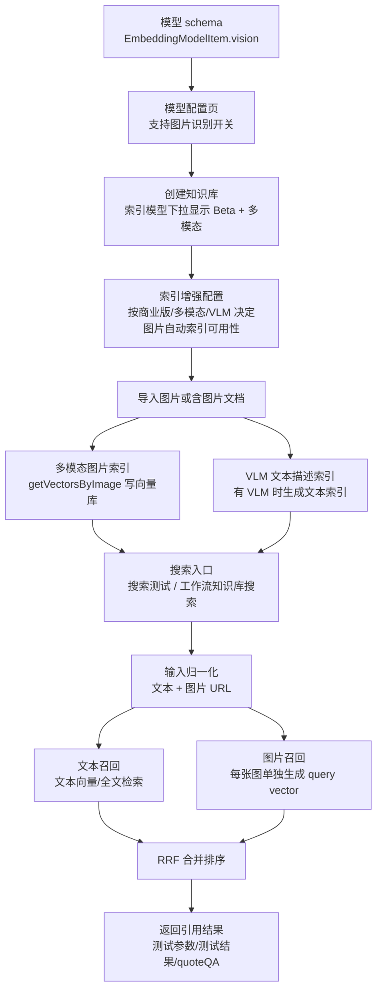

# 需求设计文档

## 0. 文档标识

- 任务前缀：`图搜图-当前需求`
- 文档文件名：`图搜图-当前需求-需求设计文档.md`
- 更新时间：2026-05-01
- 文档状态：`v2.0 反向核对完成，补齐重建链路与搜索测试页 UI`
- 文档定位：基于用户提供的两份 PDF、UI 截图、最新补充确认口径，以及当前 FastGPT 仓库事实，重新定义图搜图功能的产品边界、前后端影响域和实现策略。

## 1. 需求背景与目标

### 1.1 背景

当前 FastGPT 知识库已支持文本向量检索、全文检索、混合检索、VLM 图片解析、图片文本索引和知识库搜索节点，但还没有完整的“图片作为查询输入，检索相似图片/图文分块”的链路。

用户提供的资料包括：

- 产品设计稿：`/Users/xxyyh/Downloads/图搜图产品设计.pdf`
- 团队讨论稿：`/Users/xxyyh/Downloads/图片检索图片的技术方案.pdf`
- 用户补充 UI 图：创建通用知识库弹窗、索引模型下拉、文件分块弹窗、图片分块弹窗、知识库搜索节点、搜索测试页、搜索测试图片上传态；图片自动索引为逻辑矩阵，不作为 UI 图放入。

注意：团队讨论稿里已有方案只作为参考，不能机械照搬。本文档以用户最新确认口径为准。

### 1.2 最新确认口径

| 编号 | 维度 | 最新确认结果 | 设计结论 |
|---|---|---|---|
| C1 | 模型能力字段 | embedding 模型复用 `vision?: boolean` | 老 embedding 模型缺省按 `vision=false` 兼容；`vision=true` 表示该 embedding 模型支持图片向量化 |
| C2 | 模型标签顺序 | `Beta` 放在 `多模态` 前面 | 模型下拉展示顺序为 `模型名`、`Beta`、`多模态` |
| C3 | 工作流检索内容 | 把“检索内容”本身改成 `Array<string>`，同时接“用户问题”和“文件链接” | 不再新增一个单独外露的文件链接字段；后端归一化时从数组中拆文本和图片链接，非图片文件链接过滤掉 |
| C4 | 搜索测试图片来源 | 允许本地上传图片，不支持上传文件，支持仅上传图片不带文字 | 搜索测试页输入框左下角增加图片上传按钮；已上传图片在输入框顶部以缩略图排列，上传中展示独立 loading 卡片；图片检索历史 hover 时展示图片缩略图浮层 |
| C5 | 普通索引 + 无 VLM 搜索逻辑 | 搜索阶段和现在逻辑一样；创建/索引增强阶段控制不可选 | “图片自动索引”在不满足条件时禁用，提示文字根据索引模型和 VLM 配置动态变化 |
| C6 | embedding 模型是否支持图片 | 在模型配置页里由用户手动打开“支持图片识别”开关，默认关闭 | 开关打开后保存 `vision=true`；未打开或老模型无 `vision` 时按 text-only 处理 |
| C7 | 创建知识库提示文案 | 索引模型问号、多模态标签 hover、图片理解模型问号需要使用用户最新指定文案 | 创建弹窗和索引模型下拉必须接入固定 i18n 文案，不能复用旧文案或临时写死 |
| C8 | 搜索测试图片限制 | 最多 10 张；超出提示 `最多支持上传10张图片`；图片大小和格式跟随系统，超出的直接过滤 | 前端选择和后端上传都只接受图片；非图片文件、系统不支持格式、超出大小的图片直接过滤，不进入待搜索列表 |
| C9 | 图文混合检索召回分支 | 召回方式必须按知识库 embedding 是否多模态、是否配置 VLM 分情况处理 | 多模态 embedding 直接走 text/image modality 检索；有 VLM 时额外走图片转文字召回并合并；普通 embedding 有 VLM 时先将查询图片转文字再检索；普通 embedding 无 VLM 时不做图片检索 |
| C10 | 模型字段版本讨论 | 曾讨论过给 embedding 加 `version` 或新增 `modalities`，最终决定不采用 | 直接复用现有 `vision` 能力字段，减少配置字段扩散 |
| C11 | 索引类型命名 | 现有 `image` 先不改名，新多模态图片向量索引命名为 `imageEmbedding` | `image` 继续表示现有 VLM 图片文本索引，`imageEmbedding` 表示新增图片向量索引 |
| C12 | 搜索测试无图片能力时上传入口 | 普通 embedding 且无 VLM 时，不允许在搜索测试页上传图片 | 图片上传按钮 disabled，hover 提示 `请配置图片理解模型或多模态索引模型`；后端仍兜底兼容绕过前端的 `queryImageUrls` |
| C13 | 搜索测试图片过期 | 本地上传到搜索测试的图片只作临时检索输入，过期时间固定 3 小时 | 上传对象必须写入 TTL/过期记录，`expiredTime = addHours(new Date(), 3)`；搜索历史只保存受控缩略图引用和数量，不保存 base64 或完整私有预签名 URL |

### 1.3 业务目标

- 创建知识库时，用户能直观看到哪些索引模型支持多模态能力。
- 创建知识库时，用户能通过 `索引模型` 问号提示理解向量索引用途、跨模型查询限制和切换模型需重建全量向量索引的风险。
- 用户 hover `多模态` 标签时，能看到“多模态索引模型可以给图片生成向量。”的能力解释。
- 创建知识库时，用户能通过 `图片理解模型` 问号提示理解 VLM 会自动标注文档图片并生成文本描述，辅助文本检索。
- 知识库导入图片或含图片文档时，可生成“多模态图片索引”，支持以图搜图。
- 搜索测试页支持本地上传图片，支持纯文本、纯图、图文混合测试；本地上传只支持图片，不支持文件；最多 10 张，超出提示 `最多支持上传10张图片`；搜索测试上传图片只作为临时检索输入，上传对象过期时间固定 3 小时。若当前知识库既没有多模态索引模型也没有图片理解模型，则禁用图片上传按钮并提示 `请配置图片理解模型或多模态索引模型`。
- 图文混合检索按知识库能力分支召回：多模态 embedding 直接检索图片向量和文本向量；有 VLM 时合并 VLM 文本描述索引；普通 embedding 仅在配置 VLM 时把查询图片转成文字后参与文本检索。
- 工作流知识库搜索节点的“检索内容”改为 `Array<string>`，可同时接入用户问题和文件链接；文件链接里只有图片链接参与图搜图，PDF、docx、表格等非图片文件链接由后端过滤。
- 文件分块与图片分块弹窗按新 UI 展示右侧数据索引卡片，图片分块展示图片预览和图片内容。
- 索引增强里的“图片自动索引”根据商业版、多模态索引模型、VLM 配置动态决定可用性和提示文案。

### 1.4 技术目标

- 不新增知识库类型。
- 不新增搜索模式大类。
- 不改变现有训练状态展示口径。
- 复用现有向量库、RRF 合并、知识库权限、工作流变量引用体系。
- 将“VLM 图片文本索引”和“多模态图片向量索引”明确分开，避免重建和检索走错链路。

## 2. 当前项目事实基线（基于代码）

| 能力项 | 现有实现位置（文件路径/符号） | 现状说明 | 结论 |
|---|---|---|---|
| 创建知识库 API | `projects/app/src/pages/api/core/dataset/create.ts` | 接收 `vectorModel/agentModel/vlmModel`，没有多模态能力判断 | 修改 |
| 创建知识库 schema | `packages/global/openapi/core/dataset/api.ts` `CreateDatasetBodySchema` | 已有 `vectorModel/agentModel/vlmModel` | 复用 |
| Dataset schema | `packages/service/core/dataset/schema.ts`、`packages/global/core/dataset/type.ts` | 知识库存 `vectorModel/agentModel/vlmModel/chunkSettings`，不冗余保存模型能力 | 不新增 Dataset 字段，能力从模型配置读取 |
| Embedding 模型 schema | `packages/global/core/ai/model.schema.ts` `EmbeddingModelItemSchema` | 当前无 `vision` 字段；LLM 已使用 `vision` 表示图片能力 | 修改，embedding 复用 `vision?: boolean` |
| 模型读取 | `packages/service/core/ai/model.ts` `getEmbeddingModel` | 可按模型名读取 embedding 配置 | 增加 helper |
| 模型配置页 | `projects/app/src/pageComponents/account/model/ModelConfigTable.tsx`、`projects/app/src/pageComponents/account/model/AddModelBox.tsx` | 已有模型配置列表；LLM 模型已有 `功能配置` 区域和 `支持图片识别` 开关，embedding 模型暂无 `vision` 配置 UI | 修改，embedding 模型设置页新增同风格功能配置 |
| 模型配置 API | `projects/app/src/pages/api/core/ai/model/update.ts`、`projects/app/src/pages/api/core/ai/model/list.ts` | 更新/列表返回模型配置，当前仅 LLM 暴露 `vision` 等能力 | 修改，支持 embedding `vision` 保存和返回 |
| 模型选择器 | `projects/app/src/components/Select/AIModelSelector.tsx` | 只显示 provider icon、模型名、Beta 标签 | 修改，增加多模态标签并调整顺序 |
| 创建知识库弹窗 | `projects/app/src/pageComponents/dataset/list/CreateModal.tsx` | 已有索引模型、文本理解模型、图片理解模型字段，但布局与新稿不一致 | 修改 |
| 图片上传导入 | `projects/app/src/pageComponents/dataset/detail/Import/diffSource/ImageDataset.tsx` | 支持本地图片导入知识库 | 复用并扩展训练后索引生成 |
| 追加图片数据 | `projects/app/src/pages/api/core/dataset/data/insertImages.ts` | 图片上传后进入 `TrainingModeEnum.imageParse` | 修改，按模型能力补图片向量索引 |
| 图片集合创建 | `projects/app/src/pages/api/core/dataset/collection/create/images.ts` | 当前要求 `dataset.vlmModel`，否则报错 | 需调整：多模态索引模型可无 VLM 生成图片向量索引 |
| 图片解析队列 | `pro/admin/src/service/core/dataset/training/imageParse.ts` | VLM 解析图片为文本后转 chunk | 复用为“普通索引 + 有 VLM”的文本描述索引链路 |
| 图片文本索引队列 | `pro/admin/src/service/core/dataset/training/imageIndex.ts` | 为 Markdown 图片生成 VLM 文本索引，类型偏文本语义 | 与图片向量索引区分 |
| 数据索引类型 | `packages/global/core/dataset/data/constants.ts` `DatasetDataIndexTypeEnum` | 当前 `image` 表示现有 VLM 图片文本索引，虽然命名有歧义但先不改，避免牵扯历史数据 | 保留旧 `image`，新增多模态图片向量索引 `imageEmbedding` |
| 分块弹窗 | `projects/app/src/pageComponents/dataset/detail/InputDataModal.tsx` | 文本和图片分块编辑都在此处，右侧已有 indexes 列表 | 修改成新卡片样式；补充索引内容可见性和删除规则 |
| 数据更新 API | `projects/app/src/pages/api/core/dataset/data/update.ts` | 更新 `q/a/indexes`，文本索引走 `updateData2Dataset` | 图片向量索引需分流 |
| Embedding 服务 | `packages/service/core/ai/embedding/index.ts` `getVectorsByText` | 只支持文本 input | 增加图片 embedding 能力 |
| 向量写入 | `packages/service/common/vectorDB/controller.ts` | 写向量时内部调用文本 embedding | 需要支持预计算向量/图片向量 |
| 搜索测试 schema | `packages/global/openapi/core/dataset/api.ts` `SearchDatasetTestBodySchema` | `text` 必填，无图片字段 | 修改 |
| 搜索测试 API | `projects/app/src/pages/api/core/dataset/searchTest.ts` | 只构造 `queries: [text]` | 修改 |
| 搜索核心 | `packages/service/core/dataset/search/controller.ts` `searchDatasetData` | 只支持文本 queries，向量召回调用 `getVectorsByText` | 修改 |
| 搜索分数 | `packages/global/core/dataset/constants.ts` `SearchScoreTypeEnum` | 无图片向量分数类型 | 推荐新增 `imageEmbedding` |
| RRF 合并 | `packages/global/core/dataset/search/utils.ts` `datasetSearchResultConcat` | 已支持多路列表按权重合并去重 | 复用 |
| 搜索测试页 | `projects/app/src/pageComponents/dataset/detail/Test.tsx` | 当前“语义检索”按钮在输入卡片内，测试按钮也在卡片内，历史项带模式 icon/title | 按新稿大改 |
| 搜索历史 store | `projects/app/src/web/core/dataset/store/searchTest.ts` | 只保存文本和搜索模式 | 修改，支持图片上传摘要与 hover 缩略图引用 |
| 工作流模板 | `packages/global/core/workflow/template/system/datasetSearch.ts` | “检索内容”复用 `Input_Template_UserChatInput`，类型为 string | 改为 `Array<string>` |
| 工作流类型 | `packages/global/core/workflow/runtime/type.ts` | `fileUrlList?: string[]` 已存在，但 dataset search 当前未使用 | 本期不单独外露，检索内容数组内部可含文件链接 |
| 工作流变量兼容 | `packages/global/core/workflow/constants.ts` | `arrayString` 可接收 string 和 arrayString 引用 | 可支撑“用户问题 + 文件链接”同槽位 |
| 文件解析工具 | `packages/service/core/workflow/dispatch/ai/chat.ts` `getInputFiles` | 当前内部用 `parseUrlToFileType` 将链接转文件信息 | 建议抽出公共 helper 给 dataset search 复用 |
| 图片自动索引配置 | `projects/app/src/pageComponents/dataset/detail/Form/CollectionChunkForm.tsx` | 当前只按商业版和 `datasetDetail?.vlmModel` 禁用 | 修改为按商业版、多模态索引、VLM 动态判断 |
| 图片自动索引默认值 | `projects/app/src/pageComponents/dataset/detail/Import/Context.tsx` `defaultFormData.imageIndex` | 默认 `false` | 保持默认不勾选 |
| 图片自动索引配置字段 | `packages/global/core/dataset/type.ts` `ChunkSettingsSchema.imageIndex` | 已存在 `imageIndex` | 复用字段，调整语义和提示 |
| i18n | `packages/web/i18n/zh-CN/dataset.json`、`packages/web/i18n/en/dataset.json`、`packages/web/i18n/zh-Hant/dataset.json` | 已有 `image_auto_parse`、`image_auto_parse_tips` | 需扩展动态文案 |

## 3. 需求澄清记录

| 维度 | 已确认内容 | 待确认内容 | 备注 |
|---|---|---|---|
| 业务目标 | 支持以图搜图、图文混合检索、搜索测试本地上传图片 | 无 | 已确认 |
| 模型能力 | embedding 复用 `vision?: boolean` | 无 | 已确认字段；不再新增 `version` 或 `modalities` |
| 标签顺序 | `Beta` 在 `多模态` 前 | 无 | 已确认 |
| 工作流输入 | “检索内容”本身改为 `Array<string>` | 非图片文件链接过滤策略需实现时按本文档落地 | 已确认方向；兼容旧 string 通过归一化层处理，不把 `string | string[]` 扩散到业务层 |
| 搜索测试图片 | 允许本地上传图片，上传对象 3 小时过期 | 上传接口复用还是新增临时上传接口由实现阶段评估 | 已确认能力；无论复用还是新增，都必须写入 3 小时 TTL |
| 搜索降级 | 搜索阶段保持现有逻辑；创建/索引增强阶段控制不可用 | 无 | 已确认 |
| 图片自动索引 | 非商业版、普通索引无 VLM 时禁用；提示随配置变化 | 无 | 已确认 |
| 文档更新 | 需要更新 OpenAPI、知识库、工作流文档 | 具体文档路径实现时再核对现有目录 | 命中 DocUpdate/DocI18n |

## 3.1 影响域判定（先判定，再核对规范）

| 维度 | 是否命中 | 证据（需求/代码锚点） | 核对规范 | 结论 |
|---|---|---|---|---|
| API | Yes | 搜索测试需支持图片，本地上传图片需后端可读 URL，工作流 dispatch 入参类型变化 | `style/api.md` | OpenAPI schema 必须用 zod parse |
| DB | Yes | 需新增/区分图片向量索引类型，或至少扩展索引语义 | `style/db.md` | 尽量不改 Mongo schema，仅扩展 enum/索引语义 |
| Front | Yes | 创建知识库、模型下拉、分块弹窗、搜索测试页、工作流节点、图片自动索引配置均变化 | `style/front.md` | 大量 UI 调整，需 i18n |
| Logger | Yes | 图片向量化、图片读取、模型不支持图片、向量维度不匹配需观测 | `style/logger.md` | 结构化日志且脱敏 |
| Package | Yes | 涉及 `packages/global`、`packages/service`、`packages/web`、`projects/app`、`pro/admin` | `style/package.md` | 类型放 global，服务放 service/app |
| BugFix | No | 新功能，不是线上 bug 修复 | `bug-fix-workflow.md` | N/A |
| DocUpdate | Yes | OpenAPI 与用户使用说明变化 | `doc-update-reminder.md` | 必须列文档更新提醒 |
| DocI18n | Yes | 中文文档若更新需同步英文 | `doc-i18n-standards.md` | 必须中英文同步 |

## 4. 范围定义

### 4.1 In Scope（本期必须）

1. `EmbeddingModelItemSchema` 增加 `vision?: boolean`，语义为该 embedding 模型是否支持图片向量化。
2. 模型配置页中 embedding 模型点击设置后，新增 `功能配置` 区域，包含 `支持图片识别` 开关；样式参考 LLM 模型参数设置/功能配置，默认关闭。
3. embedding 模型 `支持图片识别` 打开后，保存 `vision=true`；关闭时保存/恢复为 `vision=false` 或缺省，按 text-only 模型处理。
4. 创建知识库索引模型下拉展示 `Beta`、`多模态` 标签，且 `Beta` 在前。
5. 创建通用知识库弹窗按新稿调整宽度和字段布局，并更新字段提示：`索引模型` 问号、`图片理解模型` 问号和索引模型下拉中的 `多模态` 标签 hover 文案必须使用本文档固定口径。
6. 索引增强里的“图片自动索引”根据商业版、多模态索引模型、VLM 配置动态启用/禁用和展示提示。
7. 多模态索引模型导入图片时，即使未配置 VLM，也可生成图片向量索引。
8. 多模态索引模型 + VLM 时，同时生成图片向量索引和文本描述索引。
9. 普通索引模型 + VLM 时，沿用 VLM 自动标注图片并生成文本描述索引。
10. 普通索引模型 + 无 VLM 时，“图片自动索引”禁用，提示配置图片理解模型或切换多模态向量模型。
11. 文件分块点击弹窗按第三张图改样式：左侧内容，右侧数据索引卡片。
12. 图片分块点击弹窗按第四张图改样式：左侧图片预览 + 图片内容，右侧数据索引卡片。
13. 右侧数据索引卡片展示“多模态图片索引”卡片时，索引内容不可见，仅展示 UI 默认说明文案：`已通过多模态模型生成图片向量，支持以图搜图`。
14. 数据索引删除规则：`默认索引` 和 `多模态图片索引` 不可删除；其他索引可以删除，包括推测问题索引、摘要索引、自定义索引等。
15. 知识库 embedding/索引模型切换时，必须按切换后的 `vectorModel + vlmModel` 组合重新决定索引生成策略：多模态模型走图片向量索引能力，普通模型只走 VLM 文本描述索引能力。
16. embedding/索引模型或 VLM 模型切换后，知识库必须进入全库重建流程或明确待重建状态，所有索引按切换后的模型组合重新生成；不能继续混用旧模型生成的向量。
17. 搜索测试页按最新上传图片 UI 改版：`搜索配置`、测试按钮下移、历史标题和历史项去掉前置模式 icon/title。
18. 搜索测试支持本地上传图片并参与搜索；输入框左下角放图片上传按钮，顶部横向展示图片缩略图、删除按钮和上传中 loading 卡片。
19. 搜索测试图片上传只支持图片，不支持文件；支持仅上传图片、不输入文字直接测试；最多支持 10 张图片，超过时提示 `最多支持上传10张图片`。
20. 搜索测试图片大小和格式限制跟随系统现有上传规则；不符合系统规则的图片、非图片文件直接过滤，不进入待上传/待搜索列表。
21. 搜索测试图片上传对象必须设置 3 小时过期时间，建议复用已有 S3 TTL 机制，写入 `expiredTime = addHours(new Date(), 3)`；不能复用正式图片集导入的长过期策略。
22. 若当前知识库 `!isImageEmbeddingModel(dataset.vectorModel) && !dataset.vlmModel`，搜索测试图片上传按钮 disabled，hover 提示 `请配置图片理解模型或多模态索引模型`；`SearchDatasetTestBodySchema` 仍保留 `queryImageUrls` 兼容能力，后端搜索核心兜底处理绕过前端的请求。
23. 搜索测试历史如果包含图片检索记录，列表中用 `[图片]` token 表示图片输入，鼠标 hover 到该历史项时弹出图片缩略图浮层。
24. 工作流知识库搜索节点的“检索内容”改为 `Array<string>`，可同时引用用户问题和文件链接。
25. 后端统一归一化检索输入：从 `Array<string>` 中拆出文本内容和图片文件链接；文件链接中只有 `ChatFileTypeEnum.image` 进入 `queryImageUrls`，非图片文件链接进入 filtered 统计并被忽略。
26. 搜索核心支持纯文本、纯图、图文混合、多图并行召回，并复用现有 RRF 合并排序。
27. 更新 OpenAPI、文档、i18n、测试。

### 4.2 Out of Scope（本期不做）

1. 不新增知识库类型。
2. 不新增搜索模式大类。
3. 不重做模型配置页整体框架，仅在 embedding 模型设置表单中新增图片能力开关。
4. 不做存量知识库自动迁移补图片向量。
5. 不重构所有工作流文件变量体系。
6. 不把图片 base64 写入搜索历史、日志或持久化 query。
7. 不做向量库多维度动态建表。图片 embedding 的向量维度与现有向量写入链路保持一致，维度不匹配沿用现有校验/报错路径处理。

## 5. 方案对比

| 方案 | 核心思路 | 优点 | 风险 | 实施成本 | 结论 |
|---|---|---|---|---|---|
| 方案A：只做 VLM 图转文检索 | 查询图片先 VLM caption，再走现有文本检索 | 改动较小 | 不是真正图搜图，且多模态索引模型能力无法体现 | 中 | 不采用为主方案 |
| 方案C：工作流新增单独文件链接输入 | 保留 `userChatInput: string`，额外展示 `fileUrlList: string[]` | 兼容性最好 | 不符合用户已确认“检索内容本身改 Array<string>” | 中 | 不采用 |
| 方案D：检索内容改 `Array<string>` | 一个“检索内容”输入同时接用户问题和文件链接，后端做输入归一化 | 符合最新 UI 和用户确认 | 需要兼容旧节点 string 值，后端要区分文本和文件链接 | 中 | 推荐 |

推荐组合：方案B + 方案D。

选型原则：

- 同等可行时优先最少新增字段、最少新增 UI、复用现有训练和搜索能力。
- 对用户已确认口径不再另起方案绕开，否则设计就是自嗨，开发还得返工。

## 6. 推荐方案详细设计

### 6.1 API 设计

| 路由/入口 | 方法 | 鉴权 | 请求 | 响应 | 错误分支 | 相关文件 |
|---|---|---|---|---|---|---|
| `/api/core/dataset/searchTest` | POST | `authDataset` Read | `text?: string`、`queryImageUrls?: string[]`、原搜索参数 | 复用现有 `SearchDatasetTestResponseSchema`，可扩展返回图片数量/归一化参数 | 文本和图片同时为空、图片超过 10 张、上传图片读取失败、模型不支持图片向量 | `packages/global/openapi/core/dataset/api.ts`、`projects/app/src/pages/api/core/dataset/searchTest.ts` |
| 搜索测试图片上传入口 | POST | 团队/知识库读权限或临时上传权限 | `multipart/form-data` 图片文件，不支持普通文件 | 可被搜索测试读取的图片 URL/S3 key/文件信息，上传对象 3 小时过期 | 非图片文件直接过滤；图片格式/大小跟随系统限制，超出直接过滤；上传失败；未写入 TTL | 可复用现有文件上传能力或新增临时接口 |
| 工作流 dataset search dispatch | internal | 工作流运行权限 | `userChatInput?: string \| string[]`，其中数组可含文本和文件链接 | `quoteQA`、`nodeResponse`、`toolResponse`，可附带过滤统计 | 检索内容为空、图片文件解析失败、非图片文件链接被过滤 | `packages/service/core/workflow/dispatch/dataset/search.ts` |

搜索测试请求示例：

```json
{
  "datasetId": "68ad85a7463006c963799a05",
  "text": "找一下类似这张图的内容",
  "queryImageUrls": ["dataset/tmp/search-test/xxx.png"],
  "limit": 5000,
  "similarity": 0.4,
  "searchMode": "mixedRecall",
  "usingReRank": false
}
```

工作流节点运行时归一化前示例：

```json
{
  "userChatInput": [
    "用户想找红色花朵相关图片",
    "https://example.com/files/query-flower.png"
  ]
}
```

工作流节点运行时归一化后示例：

```json
{
  "textQueries": ["用户想找红色花朵相关图片"],
  "queryImageUrls": ["https://example.com/files/query-flower.png"]
}
```

### 6.2 数据设计

| 实体/集合 | 字段 | 类型 | 必填 | 默认值 | 索引/约束 | 兼容策略 |
|---|---|---|---|---|---|---|
| `EmbeddingModelItemSchema` | `vision` | boolean | 否 | 缺省按 `false` 判断 | 无 | 老模型无需迁移；仅 embedding 场景语义为“支持图片向量化” |
| `DatasetDataIndexTypeEnum` | `imageEmbedding` | enum | 是，新增枚举 | N/A | 复用 `indexes.dataId` | 与现有 `image` 文本索引分开 |
| `MongoDatasetData.indexes[].text` | 图片索引引用 | string | 是 | N/A | 现有 schema | 图片索引存受控图片引用，不存 base64 |
| 向量库 | `vector` | number[] | 是 | N/A | 现有向量索引 | 多模态模型维度必须符合当前向量库约束 |
| `ChunkSettingsSchema.imageIndex` | 图片自动索引开关 | boolean | 否 | `false` | 现有字段 | 复用字段，不新增开关 |

### 6.3 图片自动索引可用性矩阵

| 场景 | 提示文案 | 按钮/复选框状态 | 设计结论 |
|---|---|---|---|
| 非商业版 | `请升级商业版后使用该功能` | 禁用，复选框灰置 | 沿用现有商业版限制 |
| 多模态索引 + 有 VLM | `为文档中的图片生成图片向量索引和文本描述索引，支持以图搜图` | 可用 | 同时走图片向量索引和 VLM 文本描述索引 |
| 多模态索引 + 无 VLM | `使用多模态模型为图片生成向量索引，支持以图搜图` | 可用 | 只生成图片向量索引 |
| 普通索引 + 有 VLM | `调用 VLM 自动标注文档里的图片，并生成文本描述索引` | 可用 | 保持现有图片自动索引逻辑 |
| 普通索引 + 无 VLM | `需配置图片理解模型，或切换多模态向量模型后，方可启用` | 禁用，复选框灰置 | 不允许勾选 |

实现注意：

- 这个矩阵作用在创建/导入/索引增强配置阶段，不改变搜索阶段“和现在的逻辑一样”的口径。
- 如果禁用时当前表单值为 `true`，前端需要自动置回 `false`，避免灰掉但提交 `true`，这种坑线上最爱冒烟。
- 多模态能力来自模型配置页 embedding 模型的“支持图片识别”开关，而不是模型名或模型供应商写死判断。开关默认关闭，只有用户主动打开后才把 `vision=true` 写入 embedding 模型配置。
- 当知识库 `vectorModel` 或 `vlmModel` 发生切换，整个知识库必须按新的模型组合重新生成索引，不能只局部清理 `imageIndex` 或继续沿用旧向量。
- 切换后的重建策略由 `vectorModel.vision` 和 `vlmModel` 共同决定：多模态 embedding + VLM 生成 `imageEmbedding` 与 VLM 文本索引；多模态 embedding + 无 VLM 只生成 `imageEmbedding`；普通 embedding + VLM 只生成 VLM 文本索引；普通 embedding + 无 VLM 不生成图片相关索引。
- 存量数据不会因为模型字段变化自动拥有新索引；必须通过全库重建把旧索引替换成切换后模型组合对应的新索引。

### 6.4 核心代码设计

| 模块 | 关键函数/类型 | 变更说明 | 上下游影响 |
|---|---|---|---|
| 模型能力 | `EmbeddingModelItemSchema`、`isImageEmbeddingModel` | 增加/复用 `vision?: boolean`，缺省 text-only | 前后端统一判断多模态 |
| 模型配置页 | `AddModelBox`、`ModelConfigTable`、`model/update`、`model/list` | embedding 模型新增 `支持图片识别` 开关，默认关闭，打开才写入 `vision=true` | 多模态标签、图片自动索引矩阵、训练分流的能力来源 |
| 模型下拉 | `AIModelSelector` | 展示 `Beta`、`多模态` 标签，`Beta` 前置；`多模态` 标签 hover 展示固定说明 | 创建知识库和其他使用处需避免误伤 |
| 图片自动索引 | `CollectionChunkForm.tsx` | 按矩阵计算 disabled、tooltip、tips | 导入、重训、网站配置等共用表单都受益 |
| 图片 embedding | `getVectorsByImage` | 图片 URL/S3 key 转模型输入，生成图片向量 | 训练和搜索共用 |
| 向量写入 | `insertDatasetDataVector` 或新增底层 helper | 支持外部传入预计算 vectors | 避免图片引用被文本 embedding |
| 图片训练 | `insertImages.ts`、`imageParse.ts`、`imageIndex.ts` | 按多模态/VLM 配置生成图片向量索引和/或文本描述索引 | 新数据可图搜图 |
| 重建索引 | `generateVector.ts` | 模型切换后全库重建；`imageEmbedding` 走图片 embedding，其他索引走文本 embedding | 重建不破坏图片索引，也不混用旧模型向量 |
| 索引卡片删除 | `InputDataModal.tsx`、`data/update.ts`、`data/controller.ts` | 默认索引和多模态图片索引保护；其他索引允许删除；多模态图片索引内容隐藏 | UI 和后端状态一致，避免假删除 |
| 搜索核心 | `searchDatasetData` | 增加 `imageQueries/queryImageUrls`，图片向量并行召回 | 搜索测试和工作流复用 |
| 工作流输入 | `datasetSearch.ts` | “检索内容”从 string 改 `Array<string>` | 前端变量引用可同时接用户问题和文件链接 |
| 工作流归一化 | `dispatch/dataset/search.ts` | 通过兼容层读取旧 string 或新 arrayString，并统一产出 `textQueries + queryImageUrls` | 兼容旧节点，业务层不扩散 `string | string[]` |
| 搜索测试 UI | `Test.tsx` | 输入框内图片上传按钮、顶部缩略图/删除/上传中卡片、搜索配置按钮、历史图片 hover 缩略图浮层 | 前端主要改动 |

### 6.5 技术实现流程图（必填）



实现说明：

- embedding 模型图片能力复用 `vision` 字段，不再新增 `modalities` 或 `multiModal` 字段。
- `vision=true` 在 LLM 场景表示图片理解能力，在 embedding 场景表示图片向量化能力；必须通过 `isImageEmbeddingModel` 这类 helper 隔离语义，别在业务里到处裸读字段。
- `图片自动索引` 用现有 `imageIndex` 字段承载，但提示和启用条件要按矩阵变化。
- `工作流检索内容` 是一个 `Array<string>` 槽位，后端不能偷懒当纯文本 join 完事，否则图片链接会被当普通文本，图搜图直接歇菜。
- 工作流文件链接过滤只在后端兼容层做最终判断：复用 `packages/service/core/workflow/utils/context.ts` 的 `parseUrlToFileType`，只有解析为 `ChatFileTypeEnum.image` 的链接进入 `queryImageUrls`；解析为 `ChatFileTypeEnum.file` 的 PDF、docx、xlsx 等链接过滤掉，不进入文本检索。
- `多模态图片索引` 和 `VLM 文本描述索引` 可以同时存在，但索引类型必须区分。

### 6.6 前端设计

| 页面/组件 | 入口文件 | 交互状态 | i18n key | 变更说明 |
|---|---|---|---|---|
| 模型配置页 | `projects/app/src/pageComponents/account/model/AddModelBox.tsx`、`ModelConfigTable.tsx` | 初始值、保存中、保存失败、开关打开/关闭 | `account:model.vision`、建议新增 `account:model.embedding_vision_tip`、`common:core.ai.model.multimodal` | embedding 模型设置表单新增 `功能配置/支持图片识别`；打开才保存 `vision=true` |
| 创建知识库弹窗 | `projects/app/src/pageComponents/dataset/list/CreateModal.tsx` | 加载模型、无模型、创建中、创建失败、QuestionTip hover | 建议新增/替换 `common:core.dataset.embedding_model_tip`、`account_model:vlm_model_tip` 或对应 dataset namespace key | 宽弹窗；名称、索引模型、文本理解模型、图片理解模型按新稿布局；索引模型和图片理解模型问号提示使用固定文案 |
| 索引模型下拉 | `projects/app/src/components/Select/AIModelSelector.tsx` | 长名称省略、标签展示、禁用模型、`多模态` 标签 hover | `common:core.ai.model.beta`、`common:core.ai.model.multimodal`、建议新增 `common:core.ai.model.multimodal_tip` | 标签顺序 `Beta` 在 `多模态` 前；hover `多模态` 标签展示固定说明 |
| 图片自动索引 | `projects/app/src/pageComponents/dataset/detail/Form/CollectionChunkForm.tsx` | 可用、禁用、tooltip、动态 tips | `dataset:image_auto_parse_*` | 按矩阵改禁用条件和提示 |
| 文件分块弹窗 | `projects/app/src/pageComponents/dataset/detail/InputDataModal.tsx` | 加载、编辑、保存中、索引展开/折叠 | `dataset:data_index`、新增多模态图片索引 key | 左内容右索引卡片 |
| 图片分块弹窗 | `projects/app/src/pageComponents/dataset/detail/InputDataModal.tsx` | 图片加载失败、编辑、保存中 | 新增图片内容/多模态图片索引 key | 左图片预览 + 图片内容，右索引卡片 |
| 数据索引卡片 | `projects/app/src/pageComponents/dataset/detail/InputDataModal.tsx`、`projects/app/src/pages/api/core/dataset/data/update.ts` | 默认索引和多模态图片索引保护、其他索引删除、多模态图片索引内容隐藏 | 新增多模态图片索引默认说明和删除确认文案 | 默认索引和多模态图片索引不展示删除入口；其他索引展示删除入口，删除需同步后端索引数据 |
| 工作流知识库搜索节点 | `packages/global/core/workflow/template/system/datasetSearch.ts` | 多变量引用、空值、旧值兼容、非图片文件链接过滤 | `workflow:content_to_search` | 检索内容 valueType 改 `arrayString`；文件链接只有图片参与检索 |
| 搜索测试页 | `projects/app/src/pageComponents/dataset/detail/Test.tsx` | 空、图片上传中、测试中、失败、历史选中、历史 hover | 新增图片上传按钮、缩略图、上传中卡片、搜索配置、测试内容文案、历史图片缩略图浮层 | 按最新搜索测试上传图片图改造 |

#### 6.6.1 创建知识库模型提示文案

该组文案是用户最新明确指定的产品文案，开发时必须接 i18n，不允许沿用旧文案或在组件内写死。

| 位置 | 触发方式 | 固定文案 | 实现说明 |
|---|---|---|---|
| `索引模型` label 后的问号 | hover/click QuestionTip | `索引模型可以将知识库内容转成向量，用于进行语义检索。注意，不同索引模型的知识库无法同时查询，切换索引模型需重建全量向量索引，请慎重选择。` | 替换旧 `索引模型可以将自然语言转成向量...选择完索引模型后将无法修改` 口径 |
| 索引模型下拉中的 `多模态` 标签 | hover `多模态` tag | `多模态索引模型可以给图片生成向量。` | hover 只绑定在 `多模态` 标签上；`Beta` 标签不展示该说明 |
| `图片理解模型` label 后的问号 | hover/click QuestionTip | `自动标注文档里的图片并生成文本描述，辅助文本检索` | 替换旧 “对文档中的图片进行额外的索引生成” 一类泛化文案 |

建议 i18n 落点：

- `packages/web/i18n/*/common.json`：更新 `core.dataset.embedding model tip` 或新增语义更明确的 `core.dataset.embedding_model_tip`。
- `packages/web/i18n/*/common.json`：新增 `core.ai.model.multimodal_tip`，用于模型下拉 `多模态` 标签 hover。
- `packages/web/i18n/*/account_model.json` 或 dataset 相关 namespace：更新/新增 `vlm_model_tip`，用于创建知识库 `图片理解模型` 问号提示。

#### 6.6.2 搜索测试图片上传约束

| 约束 | 规则 | 前端表现 | 后端/API 要求 |
|---|---|---|---|
| 上传类型 | 只支持图片，不支持文件 | 图片按钮打开系统图片选择；拖拽/粘贴/选择到非图片文件时直接过滤 | 上传接口只接收图片，非图片文件不入库、不返回 URL |
| 纯图片搜索 | 支持仅上传图片，不输入文字 | `text` 为空但存在图片时，`测试` 按钮可用 | `SearchDatasetTestBodySchema` 允许 `text` 为空，只要求 `text` 或 `queryImageUrls` 至少一个存在 |
| 无图片搜索能力 | 普通 embedding 且无 VLM 时不允许上传图片 | 图片上传按钮 disabled；hover 提示 `请配置图片理解模型或多模态索引模型` | schema 仍允许 `queryImageUrls`；搜索核心对绕过前端的纯图片请求返回空召回，图文混合只用文本 |
| 图片数量 | 最多 10 张 | 超过 10 张时提示 `最多支持上传10张图片`，超出的图片不加入列表 | `queryImageUrls` 服务端校验 `max(10)`，防止绕过前端 |
| 图片格式 | 跟随系统图片上传规则 | 系统不支持的格式直接过滤，不展示上传中卡片 | 复用系统现有图片 MIME/后缀白名单 |
| 图片大小 | 跟随系统图片上传规则 | 超出系统大小限制的图片直接过滤，不展示上传中卡片 | 复用系统现有大小限制，不为搜索测试单独开新阈值 |
| 图片过期 | 上传对象 3 小时后自动清理 | 前端不展示过期配置项；历史只保存受控缩略图引用和图片数量 | 上传时写入 `expiredTime = addHours(new Date(), 3)`，清理机制沿用 S3 TTL |

说明：

- “直接过滤”表示该文件不会进入待搜索图片列表，也不会生成 `queryImageUrls`。若本批次同时有合法图片，合法图片仍正常加入。
- 只有数量超过 10 张需要明确弹出 `最多支持上传10张图片`；格式和大小超限沿用系统已有过滤/提示行为，不在本需求里新增另一套提示文案。
- 无图片搜索能力时禁用上传入口属于前端体验优化，不改变 API schema 的兼容性；后端仍按搜索核心策略兜底，避免旧客户端或绕过前端的请求直接报错。

### 6.7 后端搜索策略

| 知识库配置 | 输入形态 | 召回分支 | VLM 查询图片转文字 | 结果合并 |
|---|---|---|---|---|
| 多模态 embedding，无 VLM | 纯文本 | 文本 query 使用同一个多模态 embedding 的 text modality，走现有文本向量/全文/混合检索 | 否 | 单路文本结果 |
| 多模态 embedding，无 VLM | 纯图片 | 图片 query 使用 image modality 生成 query vector，检索 `imageEmbedding` 图片向量索引 | 否 | 多图时按图片召回结果 RRF 合并 |
| 多模态 embedding，无 VLM | 图片 + 文字 | 文本分支 + 图片向量分支并行召回 | 否 | 文本结果和图片结果 RRF 合并 |
| 多模态 embedding，有 VLM | 纯文本 | 文本分支检索默认文本索引、VLM 文本描述索引等文本类索引 | 否 | 单路或多文本索引结果合并 |
| 多模态 embedding，有 VLM | 纯图片 | 图片向量分支检索 `imageEmbedding`；同时可用 VLM 将查询图片转成文本，检索 VLM 文本描述索引 | 是 | 图片向量结果 + VLM 文本结果 RRF 合并；同一数据多路命中时权重自然变大 |
| 多模态 embedding，有 VLM | 图片 + 文字 | 用户文字分支 + 图片向量分支 + 查询图片 VLM 文本分支 | 是 | 多路 RRF 合并；同时命中图片索引和 VLM 文本索引的结果排序更靠前 |
| 普通 embedding，有 VLM | 纯文本 | 沿用现有文本向量/全文/混合检索，可命中 VLM 文本描述索引 | 否 | 单路文本结果 |
| 普通 embedding，有 VLM | 纯图片 | 不能直接图片 embedding；先用 VLM 将查询图片转文字，再用普通 embedding 做文本检索 | 是 | VLM caption 文本结果合并；多图可多 caption RRF |
| 普通 embedding，有 VLM | 图片 + 文字 | 用户文字分支 + 查询图片 VLM 文本分支 | 是 | 多路文本结果 RRF 合并 |
| 普通 embedding，无 VLM | 纯文本 | 和现在一致 | 否 | 和现在一致 |
| 普通 embedding，无 VLM | 纯图片 | 不做图片检索 | 否 | 返回空召回结果，不额外报错 |
| 普通 embedding，无 VLM | 图片 + 文字 | 图片被忽略，文字按现有文本检索 | 否 | 返回文本检索结果 |

说明：

- 多模态 embedding 的“直接检索”指使用同一个 embedding 模型的不同 modality：文本走 text modality，图片走 image modality。
- 有 VLM 时，入库图片可能同时存在 `imageEmbedding` 图片向量索引和 VLM 文本描述索引；查询图片也需要额外经 VLM 转文字后，才有机会命中 VLM 文本描述索引。
- RRF 合并按多路召回列表进行；同一数据同时被图片向量索引和 VLM 文本索引命中，排序权重应自然提升。
- 普通 embedding 无 VLM 时不做图片检索。纯图片输入返回空召回结果；图文混合输入只使用文字部分，搜索阶段不额外报错。
- 创建/索引增强阶段仍必须按矩阵禁用非法“图片自动索引”，避免用户以为能生成图片索引。

### 6.8 日志与观测设计

| 场景 | 日志级别 | category | 结构化字段 | 脱敏策略 |
|---|---|---|---|---|
| 图片 embedding 失败 | error | `LogCategories.MODULE.DATASET.EMBEDDING` | `teamId/datasetId/collectionId/dataId/model/indexType/error` | 不记录 base64、完整 URL、向量数组 |
| 图片上传失败 | warn/error | dataset upload category | `teamId/datasetId/fileCount/mimeType/size/error` | 文件名可脱敏，URL 不落日志 |
| 工作流检索内容归一化失败/文件过滤 | warn/info | dataset search category | `teamId/datasetIds/inputCount/imageCount/textCount/filteredFileCount/error` | 不记录完整用户问题和完整文件 URL |
| 模型不支持图片却尝试生成图片向量 | warn | dataset training category | `teamId/datasetId/model/vision` | 不记录图片内容 |
| 向量维度不匹配 | error | vector category | `model/vectorLength/expectedLength/datasetId` | 不记录向量值 |

### 6.9 文档 i18n 设计（命中时必填）

| 中文文件 | 英文文件 | 类型（内容/导航） | 处理动作（新增/更新） | 翻译注意项 |
|---|---|---|---|---|
| `packages/web/i18n/zh-CN/common.json` | `packages/web/i18n/en/common.json` | UI 文案 | 更新/新增 | 更新索引模型 QuestionTip；新增 `多模态` hover tip |
| `packages/web/i18n/zh-CN/account_model.json` 或 dataset namespace | `packages/web/i18n/en/account_model.json` 或对应 namespace | UI 文案 | 更新/新增 | 更新图片理解模型 QuestionTip |
| `document/content/openapi/dataset.mdx` | `document/content/openapi/dataset.en.mdx` | 内容 | 更新 | 同步 `queryImageUrls`、本地上传说明、纯图片搜索、最多 10 张限制 |
| 知识库功能文档目录，具体路径实现时核对 | 对应 `.en.mdx` | 内容 | 更新或新增 | `图搜图` 建议译为 `image-to-image search` |
| 工作流知识库搜索节点文档，具体路径实现时核对 | 对应 `.en.mdx` | 内容 | 更新 | 说明“检索内容”为 `Array<string>`，可接文本和文件链接 |

补充要求：

- 若新增中文文档，必须同步英文文档和导航文件。
- 保持代码块字段名不翻译，例如 `vision`、`queryImageUrls`、`imageEmbedding`。

### 6.10 文档更新提醒（必填）

| 文档路径 | 文档类型 | 更新原因 | 计划更新内容 | 负责人 | 截止时间 | 状态 |
|---|---|---|---|---|---|---|
| `document/content/openapi/dataset.mdx` | OpenAPI 中文文档 | 搜索测试 API 支持图片输入 | 增加本地上传、`queryImageUrls`、纯图片搜索、最多 10 张、图文混合示例 | 开发实现者 | 实现完成前 | 已更新 |
| `document/content/openapi/dataset.en.mdx` | OpenAPI 英文文档 | 中文同步 | 同步英文参数说明与示例，包含纯图片搜索和 10 张限制 | 开发实现者 | 实现完成前 | 已更新 |
| `document/content/introduction/guide/knowledge_base/dataset_engine.mdx` | 功能文档 | 新增图搜图能力 | 说明多模态索引、图片自动索引配置、限制 | 开发实现者 | 实现完成前 | 已更新 |
| `document/content/introduction/guide/knowledge_base/dataset_engine.en.mdx` | 功能文档 | 中文同步 | 同步 image-to-image search 说明 | 开发实现者 | 实现完成前 | 已更新 |
| `document/content/introduction/guide/dashboard/workflow/dataset_search.mdx` | 功能文档 | 检索内容改为 `Array<string>` | 说明同时接用户问题和文件链接 | 开发实现者 | 实现完成前 | 已更新 |
| `document/content/introduction/guide/dashboard/workflow/dataset_search.en.mdx` | 功能文档 | 中文同步 | 同步说明 `Array<string>`、图片链接参与检索、非图片文件过滤 | 开发实现者 | 实现完成前 | 已更新 |

## 7. 风险、迁移与回滚

### 7.1 风险清单

1. 工作流兼容风险：现有 dataset search 节点的 `userChatInput` 是 string，新版是 `Array<string>`，需要兼容旧运行数据和旧模板。
2. 图片链接误判风险：`Array<string>` 同时含文本和文件链接，后端必须用可靠的文件解析逻辑区分；不能简单按 URL 字符串粗暴判断，也不能把 PDF、docx 等非图片文件链接当文本 query。
3. 索引类型混淆风险：现有 `image` 更偏 VLM 图片文本索引，必须和 `imageEmbedding` 分开。
4. 向量维度风险：图片 embedding 维度必须和现有向量写入链路保持一致；若模型输出维度不匹配，沿用现有校验/报错路径处理，不在本期引入多维度向量库策略。
5. 搜索成本风险：多图查询会多次图片 embedding，并行召回会增加模型调用和向量检索成本。
6. 隐私风险：本地上传图片、私有 S3 URL、预签名 URL 不能进入日志和长期历史明文；搜索测试上传图片必须 3 小时过期，避免测试图长期留存。
7. UI 误导风险：普通索引 + 无 VLM 时如果“图片自动索引”不禁用，用户会以为图片能被索引，最后搜不到就是纯纯给自己挖坑。

### 7.2 迁移策略

- 老 embedding 模型缺省无 `vision`，运行时按 `vision=false` 处理，无需迁移。
- 旧工作流 `userChatInput: string` 由兼容层归一化为单元素文本数组，搜索业务层只接收规范化后的 `textQueries/queryImageUrls`。
- 新工作流模板将“检索内容”展示为 `Array<string>`，默认只引用用户问题；允许用户按需手动追加文件链接。
- 存量知识库不自动补图片向量索引；当 `vectorModel` 或 `vlmModel` 切换时，必须进入全库重建流程或明确待重建状态。
- 旧搜索历史无图片字段时按纯文本历史展示。
- 新搜索历史若含图片，只保存可用于缩略图展示的受控图片引用、图片数量和摘要，不保存 base64 或完整私有预签名 URL。

### 7.3 回滚策略

1. 前端隐藏搜索测试图片上传入口和多模态图片索引展示。
2. 工作流模板回滚为 string 前，保留后端输入兼容层，避免旧流程直接崩。
3. 停止生成新的 `imageEmbedding` 索引，保留已生成索引不影响文本检索。
4. 搜索核心关闭图片 query 分支，纯文本链路保持现有行为。
5. 配置层关闭 embedding 模型 `vision` 后，前端自动回到普通模型表现。

## 8. 验收标准

| 验收项 | 验收方式 | 通过标准 |
|---|---|---|
| embedding 模型配置开关 | 手工验证/组件测试/API 测试 | `支持图片识别` 默认关闭；打开后保存 `vision=true`；关闭后保存/恢复为 `vision=false` 或缺省 |
| 创建知识库模型下拉 | 手工验证/组件测试 | 支持多模态的模型展示 `Beta`、`多模态`，且 `Beta` 在前 |
| 创建知识库模型提示 | 手工验证/组件测试/i18n 检查 | `索引模型` 问号、`图片理解模型` 问号、`多模态` 标签 hover 分别展示本文档固定文案；zh-CN/en/zh-Hant key 齐全 |
| 图片自动索引矩阵 | 单元测试/手工验证 | 5 种场景的禁用状态和提示文案符合矩阵 |
| 多模态无 VLM 导入图片 | 集成测试/手工验证 | 可生成图片向量索引，不要求 VLM |
| 多模态有 VLM 导入图片 | 集成测试/手工验证 | 同时生成图片向量索引和文本描述索引 |
| 普通索引无 VLM | 手工验证/组件测试 | 图片自动索引禁用，提示要求配置 VLM 或切换多模态模型 |
| 文件分块弹窗 | 手工验证/组件测试 | 左内容右索引卡片，符合第三张图 |
| 图片分块弹窗 | 手工验证/组件测试 | 左图片预览和图片内容，右索引卡片，符合第四张图 |
| 数据索引可见性与删除 | 手工验证/组件测试 | 多模态图片索引内容不可见，只显示默认说明；默认索引和多模态图片索引不可删除；其他索引可以删除 |
| 搜索测试页 | 手工验证/组件测试 | `搜索配置` 按钮、测试按钮位置、输入框内图片上传按钮、历史项无前置 icon/title |
| 搜索测试本地上传图片 | 集成测试/手工验证 | 支持图片能力时，上传图片后在输入框顶部展示缩略图；删除按钮可移除；上传中展示 loading 卡片；图片可作为 queryImageUrls 参与检索；不输入文字仅上传图片也可测试 |
| 搜索测试无图片能力 | 手工验证/组件测试 | 普通 embedding 且无 VLM 时图片上传按钮 disabled；hover 展示 `请配置图片理解模型或多模态索引模型` |
| 搜索测试图片限制 | 组件测试/API 测试/手工验证 | 只能上传图片，不支持文件；最多 10 张，超过提示 `最多支持上传10张图片`；图片格式和大小跟随系统规则，超出的直接过滤 |
| 搜索测试图片历史 | 手工验证/组件测试 | 图片检索历史显示 `[图片]` token；鼠标 hover 历史项时展示对应图片缩略图浮层；移出后浮层消失 |
| 工作流检索内容默认值 | 集成测试/手工验证 | 新建知识库搜索节点时，检索内容默认只引用用户问题，不默认引用文件链接 |
| 工作流检索内容手动多引用 | 集成测试 | 用户手动追加文件链接后，一个 `Array<string>` 输入能同时接用户问题和文件链接 |
| 工作流非图片文件过滤 | 单元测试/集成测试 | `Array<string>` 中的 PDF、docx、xlsx 等文件链接被过滤，图片链接进入 `queryImageUrls`，普通文本进入 `textQueries` |
| 多模态 embedding 纯图搜索 | 集成测试 | 每张图片通过 image modality 生成 query vector 并召回 `imageEmbedding` |
| 多模态 embedding + VLM 搜索 | 集成测试 | 图片向量召回和查询图片 VLM 转文字召回同时参与 RRF；同一数据多路命中时排序提升 |
| 普通 embedding + VLM 图片搜索 | 集成测试 | 查询图片先经 VLM 转文字，再走普通文本检索 |
| 普通 embedding 无 VLM 图片搜索 | 集成测试 | 纯图片返回空召回结果；图文混合时忽略图片，仅使用文字检索 |
| 图文混合搜索 | 集成测试 | 按知识库能力选择文本、图片向量、VLM caption 分支，并进入 RRF 合并 |
| 文档与 i18n | 文档检查 | 中英文文档和 UI 文案同步 |

## 9. MECE 核查结论

### 9.1 相互独立检查结果

- 模型能力字段和知识库字段独立：`vision` 属于模型配置，不写入 Dataset。
- 图片自动索引配置和搜索阶段行为独立：配置阶段负责能否生成索引，搜索阶段保持现有逻辑并使用已存在索引。
- VLM 文本描述索引和多模态图片向量索引独立：一个图转文，一个图转向量，索引类型不能混。
- 搜索测试和工作流入口独立：前者本地上传图片，后者从 `Array<string>` 中解析文件链接，但后端搜索核心复用。
- UI 分块弹窗和训练索引链路独立：弹窗展示索引状态，不应自己承担训练逻辑。

### 9.2 完全穷尽检查结果

| 链路 | 是否覆盖 | 说明 |
|---|---|---|
| 模型配置 | 是 | embedding `vision` |
| 创建知识库 | 是 | 模型下拉和三模型字段 |
| 索引增强 | 是 | 图片自动索引矩阵 |
| 图片导入 | 是 | 多模态/VLM 组合 |
| 分块展示 | 是 | 文件分块和图片分块弹窗 |
| 搜索测试 | 是 | 本地上传图片、纯图测试、最多 10 张、仅图片不支持文件、搜索配置、历史图片 hover 缩略图浮层 |
| 工作流节点 | 是 | 检索内容 `Array<string>` |
| 搜索核心 | 是 | 纯文本、纯图、图文混合、多图 |
| 计费与日志 | 是 | 图片 embedding、VLM、脱敏日志 |
| 文档/i18n | 是 | OpenAPI、知识库、工作流文档 |

### 9.3 修订动作与最终边界

- 旧文档 `图搜图-接入-*` 不覆盖，保留历史讨论痕迹。
- 本文档按最新确认口径作为后续实现依据。
- 后续若需要再改“工作流检索内容是否保留 string 兼容展示”，只能在实现文档中做兼容策略，不能推翻本期“Array<string>”产品口径。

## 10. TODO

- [x] 按本文档同步更新 `图搜图-当前需求-功能开发文档.md`。
- [x] 开发前确认创建知识库弹窗的三处提示文案对应 i18n key：索引模型问号、多模态 hover、图片理解模型问号。
- [x] 开发前核对模型配置中实际可用的多模态 embedding 模型。
- [x] 开发前确认搜索测试本地图片上传复用接口还是新增临时接口，并复用系统图片格式/大小限制；本次采用新增搜索测试临时上传接口，过期时间固定 3 小时。
- [x] 实现后补齐 OpenAPI、知识库、工作流文档与英文版。
- [x] 实现后按测试矩阵跑局部测试和最终检查。
- [x] 恢复 `pro` 子模块后，补齐 `pro/admin/src/service/core/dataset/training/imageParse.ts` 和 `pro/admin/src/service/core/dataset/training/imageIndex.ts` 的图片向量/VLM 文本索引分流实现。
- [x] 反向核对后补齐模型切换重建链路：切到普通 embedding 且无 VLM 时同步清理 dataset/collection 的 `imageIndex=false`。
- [x] 反向核对后补齐工作流输入归一化：普通无后缀 URL 不再被误判为非图片文件并过滤。
- [x] 反向核对后补齐搜索测试页 UI：输入标题、搜索配置按钮、图片缩略图顶部、上传按钮、测试按钮下移、历史标题去 icon。
