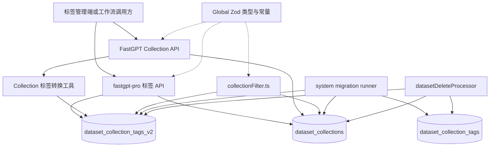
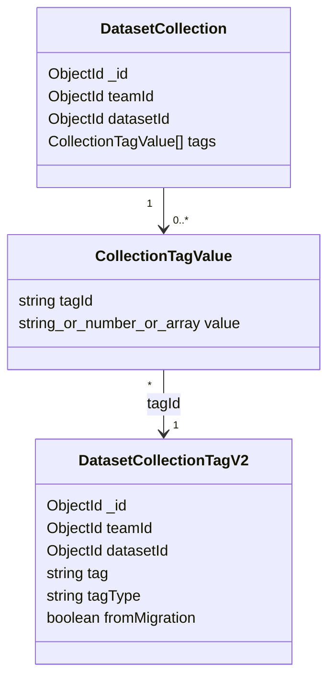
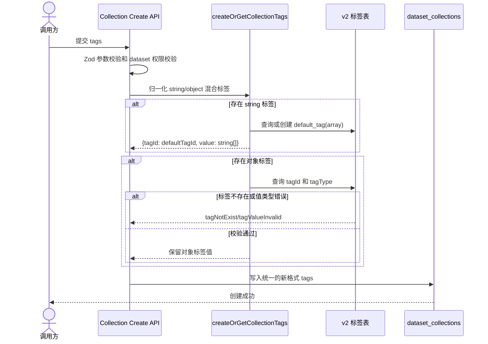
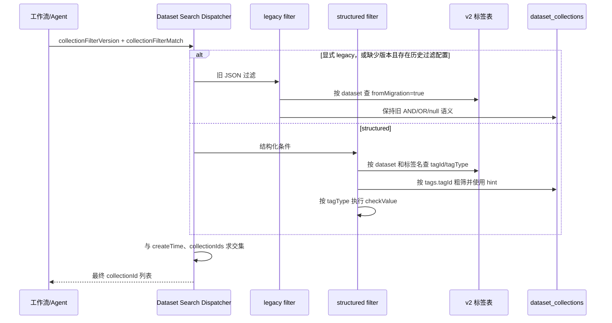

# 知识库标签系统设计文档

## 1. 文档概述

### 1.1 设计目标

本设计为 FastGPT 知识库提供统一的类型化标签模型、Collection 标签值管理、标签过滤、历史数据迁移和生命周期清理能力。设计以当前代码实现为准，标签定义存储在 `dataset_collection_tags_v2`，Collection 继续复用 `dataset_collections.tags` 字段。

系统支持以下标签类型：

- `string`：字符串值，支持相等、包含、前缀、后缀和正则匹配。
- `number`：数值比较。
- `datetime`：按时间戳进行比较。
- `array`：字符串数组集合比较，支持集合相等、子集、包含和空值判断。

历史标签表 `dataset_collection_tags` 作为迁移来源和兼容数据保留，不再作为新标签管理 API 的写入目标。

### 1.2 设计范围

| 范围 | 内容 |
|---|---|
| 标签定义 | v2 标签表、标签类型、名称唯一性和标签查询 |
| Collection 标签 | 标签值的创建、转换、设置、批量更新和展示转换 |
| 检索过滤 | 按标签名称、类型和值过滤 Collection，并与创建时间、Collection ID 条件求交集 |
| 历史迁移 | 将旧字符串标签转换为 `default_tag` 数组标签 |
| 生命周期 | dataset 物理删除时清理对应 v2 标签定义 |
| API | FastGPT Collection API、FastGPT 标签过滤 API、fastgpt-pro 标签管理 API |
| 本次不包含 | 删除 v1 标签表、反向迁移 v2 数据 |

### 1.3 术语

| 术语 | 定义 |
|---|---|
| v1 标签表 | `dataset_collection_tags`，历史标签定义表，无 `tagType` |
| v2 标签表 | `dataset_collection_tags_v2`，当前标签定义表，带 `tagType` |
| Collection | 知识库中的文件、链接、文本等集合对象，持久化于 `dataset_collections` |
| 新格式标签 | `{ tagId, value }`，`tagId` 引用 v2 标签表 |
| 旧格式标签 | 字符串形式的历史标签 ID，通常引用 v1 标签表 |
| `default_tag` | 承载记录首次创建时使用的默认名称；作为 API 标签名时按普通字符串处理 |
| `collectionFilterMatch` | 知识库检索使用的 Collection 过滤 JSON 字符串 |

## 2. 模块职责与边界

### 2.1 模块职责

1. 创建、查询、更新和删除知识库标签定义。
2. 根据标签类型校验 Collection 标签值，并将创建入参统一转换为可持久化的新格式。
3. 为知识库检索提供标签条件解析、MongoDB 粗筛和应用层精确比较。
4. 在 App 启动阶段按 dataset 维度自动迁移历史 Collection。
5. 在 dataset 异步物理删除时清理该 dataset 及其子 dataset 的 v2 标签定义。
6. 在 Collection 列表接口中将存储格式的 `tagId` 转换为对外展示的标签名称。

### 2.2 模块边界

| 方向 | 依赖或边界 |
|---|---|
| 上游 | 标签管理 API、Collection 创建 API、工作流知识检索节点、Agent V2 搜索 |
| 下游 | MongoDB、MongoDB secondary read、现有 dataset 权限系统 |
| 跨仓库依赖 | fastgpt-pro 提供标签管理 API，FastGPT 提供公共类型、数据模型、Collection 和搜索逻辑 |
| 不负责 | 向量库内部索引实现、旧表下线时间规划 |

## 3. 系统结构

### 3.1 子模块划分

| 子模块 | 主要职责 | 关键实现 |
|---|---|---|
| 标签模型 | 定义 v2 标签集合、字段和索引 | `packages/service/core/dataset/tag/schemaV2.ts` |
| Collection 模型 | 保存 Collection 标签值并提供标签索引 | `packages/service/core/dataset/collection/schema.ts` |
| 标签转换工具 | 创建/校验/展示转换标签值 | `packages/service/core/dataset/collection/utils.ts` |
| 标签 API | 提供标签定义和 Collection 标签值管理 | fastgpt-pro `projects/app/src/pages/api/core/dataset/tag/` |
| Collection API | 创建、列表和滚动读取 Collection | `projects/app/src/pages/api/core/dataset/collection/` |
| 搜索过滤 | 解析标签条件并返回 Collection ID | `packages/service/core/dataset/search/defaultRecall/collectionFilter.ts` |
| 系统迁移 | 分批读取 v1 标签并写入 `default_tag` 新格式 | `projects/app/src/migration/tasks/20260907_migrate_dataset_tags_v2/` |
| 删除处理器 | 删除 dataset 相关 v1/v2 标签定义 | `packages/service/core/dataset/delete/processor.ts` |
| 全局类型 | Zod Schema、标签类型、常量和错误码 | `packages/global/core/dataset/type.ts` |

### 3.2 依赖关系



### 3.3 总体架构影响

本设计不改变 FastGPT 的分层架构、权限模型和检索主流程，仅在知识库标签子系统内新增 v2 标签模型和过滤逻辑。Collection 的 `tags` 字段不新增字段，通过元素类型兼容旧格式和新格式；标签管理 API 的外部路由保持原有组织方式。

## 4. 对外接口设计

### 4.1 标签管理接口

标签管理接口位于 fastgpt-pro，基础路径为 `/proApi/core/dataset/tag`。接口通过现有 dataset 或 Collection 权限进行鉴权，内部统一操作 v2 标签表。

| 路径 | 方法 | 作用 | 关键请求 |
|---|---|---|---|
| `/create` | POST | 创建标签 | `datasetId`、`tag`、可选 `tagType` |
| `/update` | POST | 修改标签名称 | `datasetId`、`tagId`、`tag` |
| `/delete` | DELETE | 删除标签定义 | dataset 和标签标识 |
| `/list` | POST | 分页查询标签 | dataset、分页参数 |
| `/getAllTags` | GET | 查询全部标签 | dataset |
| `/usage` | GET | 查询标签使用情况 | dataset、标签标识 |
| `/batchUpsert` | POST | 批量维护标签定义 | `datasetId`、`tags: [{ tag, tagType }]` |
| `/setCollectionTags` | POST | 设置单个 Collection 标签值 | `datasetId`、`collectionId`、`tags` |
| `/batchSetCollectionTags` | POST | 批量设置 Collection 标签值 | `collectionIds`、`tags` |
| `/addToCollections` | POST | 按 Collection 差集添加或移除标签 | `tag`、`collectionIds`、`originCollectionIds`、`datasetId` |

`tagType` 的默认值为 `string`。标签值由 `CollectionTagValueSchema` 校验，存储格式为：

```json
{
  "tagId": "v2-tag-object-id",
  "value": "标签值或数组值"
}
```

### 4.2 Collection 标签接口

所有 Collection 创建入口均可接收混合格式标签：

```text
(string | { tag: string, value: string | number | string[] })[]
```

字符串元素被视为历史名称格式，由 `createOrGetCollectionTags` 聚合到当前 dataset 的 `default_tag` 数组标签；对象元素按 `tag`（标签名）解析到 v2 标签定义并进行存在性和类型校验。最终持久化时统一使用 `{ tagId, value }` 格式。

> **契约层次**：Collection 创建/更新入参为 `(string | { tag, value })[]`（按标签名解析，与 listV2 返回格式一致）；持久化存储为 `{ tagId, value }[]`；fastgpt-pro 的标签值设置接口（`setCollectionTags`/`batchSetCollectionTags`）入参为 `{ tagId, value }[]`（按标签 ID 解析）。三者格式不同属有意设计，使用时勿混用。

Collection 列表接口 `listV2` 使用 `collectionTagsToTagLabel` 将存储格式转换为：

```text
(string | { tag: string, value: string | number | string[] })[]
```

其中无法在 v2 表中解析的悬空引用不返回给调用方。

### 4.3 搜索过滤接口

工作流通过 `datasetSearchNode` 的隐藏输入 `collectionFilterVersion` 选择过滤器：显式 `legacy` 调用 `filterLegacyCollectionByMetadata`，显式 `structured` 调用 `filterCollectionByMetadata`；存量节点缺少版本时，仅在存在实际元数据过滤配置时使用 legacy，未配置过滤则直接使用 structured。兼容判断只检查配置是否存在，不根据 `collectionFilterMatch` 的字符串或对象形状推断版本。Agent V2 固定使用结构化过滤。共享能力支持：

- `tags.$and`：所有条件必须满足。
- `tags.$or`：至少一个条件满足。
- `createTime.$gte/$lte`：按 Collection 创建时间过滤。
- `collectionIds`：按指定 Collection 或文件夹递归展开后过滤。

新版入口只接受结构化标签条件；字符串或 `null` 条件直接拒绝。Legacy 入口仅按 `fromMigration=true` 查找承载标签，不调用 `filterCollectionByKeyValueTags` 或 `checkValue`。承载标签可以像普通标签一样改名或删除；删除后依赖它的 legacy 字符串条件无法满足，过滤结果为 `[]`，工作流继续运行但不产生知识库召回结果。

### 4.4 自动系统迁移

标签迁移不再暴露手工管理员接口。`20260907_migrate_dataset_tags_v2` 注册为阻塞启动任务，由统一 Runner 负责 lease、runId fencing、checkpoint、进度和失败状态。任务失败时 App 不进入 ready。

## 5. 内部设计

### 5.1 标签数据模型

v2 标签定义由 `teamId + datasetId + tag` 确定作用域，该三元组有唯一索引保证并发写入下不重复；`tagType` 决定值校验与过滤比较方式。只有存在旧字符串标签或仍通过兼容 API 写入字符串标签的 dataset 才按需创建一条 `tagType=array`、`fromMigration=true` 的承载定义，首次创建时默认命名为 `default_tag`。`default_tag` 本身是普通标签名称，不承担身份、权限或过滤分流语义；legacy filter 只按 `fromMigration` 定位承载记录。



### 5.2 标签创建与值归一化



处理规则：

1. 未提供 `tags` 时不写入标签值；空数组保留为空数组。
2. string 标签名全部合并为一条 `default_tag` 记录，数组值去重。
3. object 标签必须引用当前 team、dataset 下存在的 v2 标签。
4. `string`、`number`、`datetime`、`array` 的值类型分别校验：
   - `string` 只能为字符串，长度不超过 256。
   - `number` 必须为有限数值；支持输入 number 或可转换为有限数值的字符串，空字符串、纯空白字符串及无法转换的字符串均无效；校验通过后统一按 number 存储。
   - `datetime` 必须为有效的 Unix 时间戳（毫秒）；支持输入 number 或可转换为有限数值的字符串，空字符串、纯空白字符串、无法转换的字符串及超出 JavaScript `Date` 有效范围的数值均无效；日期字符串（如 `2024-01-01`）不作为输入格式，校验通过后统一按 UTC 毫秒时间戳存储。
   - `array` 只能包含字符串，数组长度不超过 64，单元素长度不超过 256。
5. 多个输入对象引用同一 `tagId` 且 value 不一致时拒绝整个批量操作。

### 5.3 标签批量设置

`batchSetCollectionTags` 的执行顺序如下：

1. 校验请求参数及每个 Collection 的写权限。
2. 对输入标签按 `tagId` 去重并检测冲突。
3. 读出目标 Collection 的当前 tags，在内存中计算覆盖、累加或移除后的结果。
4. 用 `bulkWrite` 一次性写回各 Collection 的 tags。

删除与写入操作均限定在请求的 `teamId`、`datasetId` 和 `collectionIds` 范围内。无匹配文档视为成功；数据库异常向上抛出，由 API 返回服务端错误。

`addToCollections` 计算 `collectionIds - originCollectionIds` 得到添加集合，计算反向差集得到移除集合。添加与移除都先读出当前 tags，在内存中覆盖或去掉该 `tagId`，再用 `bulkWrite` 一次性写回，确保一个 Collection 中同一标签只有一条记录。自动值规则为：`string` 使用空字符串；`number`、`datetime`、`array` 无法通过此接口添加，须走显式值接口。

### 5.4 标签检索过滤



过滤实现分为两层：

- MongoDB 粗筛：按标签 ID 使用 `$all` 或 `$in` 查询，并通过 `.hint({ teamId: 1, datasetId: 1, 'tags.tagId': 1 })` 强制使用新格式标签索引。
- 应用层精筛：读取候选 Collection 的标签对象，根据 v2 标签的 `tagType` 和操作符调用 `checkValue`。

标签不存在、Collection 未配置该标签、值类型不匹配或比较值不可转换时，条件均视为不满足。`$and` 要求全部满足，`$or` 要求至少满足一项；不存在的标签不会被当作满足条件。

### 5.5 核心比较算法

```text
checkValue(op, target, storedValue, tagType): boolean
  若 op 为 $empty：
    array 类型判断值不存在或数组长度为 0；其他类型判断 null、undefined 或空字符串
  若 op 为 $notEmpty：
    array 类型判断为非空数组；其他类型判断为非空值
  target 为 null/undefined 时返回 false

  number/datetime：将存储值和目标值转换为数字，转换失败返回 false，执行 eq/ne/gt/lt/gte/lte
  array：
    $is      -> 两个数组去重后集合相等
    $isNot   -> 两个数组去重后集合不相等
    $contains -> 存储数组包含目标字符串
    $notContains -> 存储数组不包含目标字符串
    $in      -> 存储数组是目标数组的子集
    $notIn   -> 存储数组不是目标数组的子集
  string：
    $eq/$ne 使用大小写敏感比较
    $contains/$notContains/$startsWith/$endsWith 忽略大小写
    $regex 使用 RegExp，正则构造失败返回 false
```

`$regex` 接受用户可控的 pattern，为防灾难性回溯（ReDoS），pattern 长度上限 64、被测值长度上限 256，并拦截不安全 pattern：嵌套量词类（`(a+)+`）由 `safe-regex` 检出，带分支的量词组（`(a|aa)+`）由首字符重叠检测兜底，超限或不安全均视为不匹配。

array 比较的时间复杂度为 `O(n+m)`，其他类型为 `O(1)`；单个 array 值受长度限制，应用层比较不会产生无界内存增长。

### 5.6 历史数据迁移

迁移由统一 System Migration Runner 按稳定 ObjectId 游标分批执行：

1. 按 `{ teamId, datasetId, tag }` 整理重复 v2 定义；保留 `_id` 最早项，对其余 ID 先从 Collection 删除引用并校验，再删除定义。
2. 从 v1 表建立 `旧 tagId -> 标签名称` 映射；遇到旧字符串标签时，按需创建或复用当前 dataset 的系统承载标签并合并名称数组。
3. 保留其他新格式标签，移除旧字符串元素，使用原始 BSON 快照条件更新。
4. 建立 v2 唯一索引和 `tags.tagId` 索引，校验无旧字符串标签、无重复定义、无重复或非法承载标签。

Collection 子阶段只修改 `tags` 字段，不修改 `_id`、`createTime` 或其他元数据，因此既有 `collectionIds` 和时间过滤仍然有效。工作流记录不参与数据迁移：运行时仅将“缺少版本且实际配置了过滤”的存量节点解释为 legacy，空配置直接使用 structured。重复执行时已转换记录不会再次转换；v1 表在迁移过程中只读。

### 5.7 dataset 物理删除

异步 `datasetDeleteProcessor` 找到 root dataset 及全部子 dataset 后，删除 v1 标签、v2 标签及其他 dataset 关联资源。v2 清理条件为：

```text
{ teamId, datasetId: { $in: rootAndChildDatasetIds } }
```

该操作不会删除其他 team 或其他 dataset 的标签定义；无匹配是正常成功。v2 标签清理位于本体 Mongo session 事务之外，任务失败时依赖现有队列重试和日志处理，不宣称跨操作原子性。

## 6. 数据库设计

### 6.1 `dataset_collection_tags_v2`

```javascript
const DatasetCollectionTagsV2Schema = new Schema({
  teamId: {
    type: Schema.Types.ObjectId,
    ref: TeamCollectionName,
    required: true
  },
  datasetId: {
    type: Schema.Types.ObjectId,
    ref: DatasetCollectionName,
    required: true
  },
  tag: {
    type: String,
    required: true
  },
  tagType: {
    type: String,
    default: 'string',
    enum: ['string', 'number', 'datetime', 'array']
  },
  fromMigration: {
    type: Boolean,
    default: false
  }
});

DatasetCollectionTagsV2Schema.index({ teamId: 1, datasetId: 1, tag: 1 }, { unique: true });
```

字段说明：

| 字段 | 类型 | 约束 | 说明 |
|---|---|---|---|
| `_id` | ObjectId | 主键 | 标签定义 ID |
| `teamId` | ObjectId | 必填 | 所属团队 |
| `datasetId` | ObjectId | 必填 | 所属知识库 |
| `tag` | String | 必填 | 标签名称；`default_tag` 按普通字符串处理 |
| `tagType` | String | 枚举 | `string`、`number`、`datetime`、`array`，默认 `string` |
| `fromMigration` | Boolean | 默认 `false` | 标识旧标签数据的系统承载记录；仅 legacy filter 用于定位 |

`{ teamId, datasetId, tag }` 唯一索引保证同一作用域下标签名不重复，并发写入由数据库兜底；业务层先查后写，撞索引时捕获 E11000 复用已存在记录。

### 6.2 `dataset_collections.tags`

Collection 现有 `tags` 字段继续使用 Mixed 数组，不增加独立字段：

```javascript
tags: {
  type: [],
  default: []
}

DatasetCollectionSchema.index({ teamId: 1, datasetId: 1, tags: 1 });
DatasetCollectionSchema.index({ teamId: 1, datasetId: 1, 'tags.tagId': 1 });
```

推荐的新格式：

```json
[
  { "tagId": "v2-string-id", "value": "产品" },
  { "tagId": "v2-number-id", "value": 2 },
  { "tagId": "v2-datetime-id", "value": 1704067200000 },
  { "tagId": "v2-array-id", "value": ["安全", "高优"] }
]
```

旧字符串格式仅用于迁移前历史数据。旧索引保留以支持历史数据读取，新格式过滤使用 `tags.tagId` 索引。

### 6.3 v1 表

`dataset_collection_tags` 保持原有结构和数据，仅用于历史迁移的只读映射以及现有删除链路的兼容清理。新 API 不读写该表作为当前标签定义来源。

## 7. 类型、校验与错误处理

### 7.1 全局类型

核心定义位于 `packages/global/core/dataset/type.ts`：

```typescript
DatasetCollectionTagType = 'string' | 'number' | 'datetime' | 'array'
CollectionTagValueType = {
  tagId: string;
  value: string | number | string[];
}
DEFAULT_TAG = 'default_tag'
```

### 7.2 校验规则

| 场景 | 处理 |
|---|---|
| 标签名为空 | 拒绝请求，返回标签名称错误 |
| 标签名重复 | 拒绝请求，返回重复错误 |
| v2 标签不存在 | 返回 `tagNotExist` |
| string 值不是字符串或超长 | 返回 `tagValueInvalid` |
| number 无法转换或超出安全范围 | 返回 `tagValueInvalid` |
| datetime 无法转换为有效时间 | 返回 `tagValueDatetimeInvalid` |
| array 非数组、元素非字符串、长度超过 64 或元素超过 256 | 返回 `arrayTagValueInvalid` |
| Legacy 过滤 JSON 解析失败 | 保持历史降级行为，当前请求不执行该过滤 |
| Structured 过滤不合法 | 拒绝运行，不回退 legacy 或扩大召回范围 |
| MongoDB 查询失败 | 保留异常并由上层统一返回服务端错误 |
| 旧标签 ID 在 v1 表中不存在 | 迁移时忽略该标签，其他可解析标签继续处理 |
| 同一 tagId 出现冲突值 | 拒绝批量写入，不执行覆盖操作 |

所有读写操作必须带 `teamId` 和 `datasetId` 作用域，API 入口使用现有权限函数，避免跨团队读取或修改标签。

## 8. 可靠性、性能与可运维性

### 8.1 一致性

- v2 标签定义与 Collection 标签值通过 `tagId` 关联，应用层校验引用关系。
- 写入 Collection 标签先读出当前 tags，在内存中保证同一 `tagId` 只有一条，再用 `bulkWrite` 写回。
- dataset 物理删除按完整 root/child dataset ID 集合清理，防止子 dataset 标签残留。
- 迁移按 dataset 维度可重复执行，已转换 Collection 跳过。

### 8.2 降级策略

- 过滤条件 JSON 不合法时不阻断知识检索。
- 未知或缺失 `tagType` 按 `string` 处理。
- 标签定义不存在时条件不匹配，不扩大查询结果。
- secondary 读取用于列表和过滤等只读路径，写入仍使用主库。

### 8.3 性能设计

1. v2 标签查询使用 `{ teamId, datasetId, tag }` 复合索引。
2. 新格式 Collection 过滤使用 `{ teamId, datasetId, 'tags.tagId' }` 复合索引。
3. `filterCollectionByKeyValueTags` 先按 tagId 粗筛，再在应用层执行类型比较，减少精确比较数据量。
4. 同时存在旧标签索引和新标签索引时，使用 MongoDB `hint` 强制选择 `tags.tagId` 索引，避免查询规划器误选旧多键索引。
5. array 值最多 64 项，单项最多 256 字符，控制比较和内存开销。
6. 标签列表接口使用分页、字段投影和 secondary read；Collection 列表仅返回所需字段。

### 8.4 运维要求

- 迁移前备份 `dataset_collections`，确认迁移范围和结果。
- 迁移由启动 Runner 自动执行；运维通迁移页面查看阶段进度，失败时 App 不进入 ready。
- 唯一索引和 `tags.tagId` 索引在完成校验前创建，运行期可安全使用强制 hint。
- 关注系统迁移阶段错误、dataset 删除任务日志及 MongoDB 查询慢日志。
- v1 表的最终下线需另行设计，不属于本模块。

## 9. 测试设计

### 9.1 单元测试

| 类别 | 必测内容 |
|---|---|
| 标签值校验 | 四种 tagType 的合法值、非法值、边界值 |
| `checkValue` | 各类型操作符、空值、类型转换失败、正则异常 |
| array 比较 | `$is`、`$isNot`、`$contains`、`$notContains`、`$in`、`$notIn`、`$empty`、`$notEmpty` |
| 标签归一化 | string、object 和混合输入；对象中的 `default_tag` 按普通标签名解析 |
| 冲突检测 | 相同 tagId 相同值去重、不同值拒绝 |
| Legacy 过滤 | string、null、AND 优先、OR、混合 null/string、多 dataset 承载标签 |
| Structured 过滤 | 拒绝 string/null，按类型执行新版条件 |

### 9.2 集成测试

1. 创建 Collection 后 string 标签被保存为 `default_tag` 新格式。
2. 创建和更新四种类型标签值均能正确读写。
3. `listV2` 返回标签名称而非内部 tagId。
4. 标签过滤与时间、Collection ID、文件夹递归条件正确求交集。
5. Agent V2 搜索可以透传 `collectionFilterMatch`。
6. 迁移保留已有新格式标签，旧标签名称正确合并，重复执行和 checkpoint 恢复幂等。
7. 迁移不修改 Collection `_id` 和 `createTime`。
8. dataset root/child 物理删除只清理目标 team 和目标 dataset 集合的 v2 标签。
9. 其他 team、其他 dataset 的同名或同 ID 标签不受影响。
10. MongoDB 查询命中新格式 `tags.tagId` 索引。
11. 缺少版本标记且存在历史过滤配置的旧节点调用 legacy filter；历史空配置和显式 structured 节点调用 structured filter。
12. 节点升级保留 ID、输入输出与连线，且持久化失败时不切换本地节点。

### 9.3 性能验证

在真实或等价 MongoDB 环境验证 30,000 个 Collection 的标签查询：

- 有 `tags.tagId` 索引时应明显减少扫描文档数。
- 两个标签索引并存时应确认查询使用 `hint` 指定的新格式索引。
- array 应用层比较耗时随数组长度线性增长，且受最大长度限制。

## 10. 发布与回滚

### 10.1 发布顺序

> 当前数据格式不支持旧 Pod 与迁移后数据并存。发布时必须先停止旧版本业务流量再启动带阻塞迁移的新版本；若要求无停机滚动升级，需要先单独发布能双读对象标签的过渡版本。

1. App 启动时执行阻塞式 `20260907_migrate_dataset_tags_v2` 系统迁移，失败时不进入 ready。
2. 迁移按稳定 `_id` 游标分批处理标签定义和 Collection，批次提交后才保存 checkpoint。
3. 迁移只为存在旧字符串标签的 dataset 按需创建唯一 `fromMigration=true` 承载标签，并把旧标签名称转换为数组值。
4. 重复 v2 标签定义按 `_id` 保留最早项；删除定义前先从 Collection 中删除指向重复 ID 的标签值，不向保留项合并。
5. 全部阶段完成后校验无旧字符串标签、无重复定义、无重复 ID 残留引用及非法承载标签。
6. 存量 `datasetSearchNode` 不改写；缺少 `collectionFilterVersion` 时按是否存在历史过滤配置选择 legacy 或 structured，新建节点显式保存 structured。
7. 阻塞迁移成功后才开放业务流量，不在运行期同时读取 v1/v2 标签。

### 10.2 回滚策略

- 未迁移数据仍保留 v1 标签和旧 `tags` 值，可回退到旧代码读取。
- v2 标签定义和新格式 Collection 数据需通过数据库备份恢复；不通过迁移接口反向回滚。
- 迁移不改 Collection 主键、创建时间或工作流节点类型；回滚旧版代码前需从备份恢复 `tags` 字段。
- v1 表不在本次发布中删除，回滚期间保留历史读取基础。

## 11. 实现文件索引

| 文件 | 作用 |
|---|---|
| `packages/global/core/dataset/type.ts` | 标签类型、标签值 Schema、`DEFAULT_TAG` |
| `packages/global/openapi/core/dataset/collection/tagApi.ts` | 标签 API 请求 Schema |
| `packages/service/core/dataset/tag/schemaV2.ts` | v2 标签 MongoDB Schema |
| `packages/service/core/dataset/collection/schema.ts` | Collection Schema 和标签索引 |
| `packages/service/core/dataset/collection/utils.ts` | 标签创建、校验、存储和展示转换 |
| `packages/service/core/dataset/search/defaultRecall/collectionFilter.ts` | 新版结构化标签过滤 |
| `packages/service/core/dataset/search/defaultRecall/legacy/collectionFilter.ts` | 存量节点的 legacy 过滤语义 |
| `projects/app/src/pages/api/core/dataset/collection/listV2.ts` | Collection 标签过滤列表接口 |
| `projects/app/src/migration/tasks/20260907_migrate_dataset_tags_v2/` | 历史标签阻塞迁移 |
| `packages/service/core/dataset/delete/processor.ts` | dataset 物理删除和 v2 标签清理 |
| `packages/service/core/dataset/collection/tagFilter.ts` | 详情页标签值筛选：已用值聚合与列表查询条件 |
| `projects/app/src/pages/api/core/dataset/collection/tagFilterOptions.ts` | 标签筛选选项接口 |
| `projects/app/src/pageComponents/dataset/detail/CollectionCard/DatasetTagFilter.tsx` | 知识库详情页双栏标签筛选弹窗 |

本设计描述的是同一套标签能力的统一实现，不按迭代或变更批次拆分章节。

## 12. 知识库详情页标签筛选弹窗

Figma：`07页面｜标签筛选`（node `2434:38727`），交互组件标注「两条独立滚动，勾选即生效」。

### 12.1 交互

1. 触发器默认 `标签 | 全部`；有选中值时展示第一项 `标签名：值`，其余以 `+n` 收起。
2. 弹窗宽 320px，左右两列独立滚动。
3. 左侧列出当前知识库全部标签定义；当前列高亮，该标签已选数量以圆形角标展示。
4. 右侧第一行搜索当前标签的值；下方 checkbox 多选可筛值。左右列固定高度并独立滚动。
5. 数字/日期/文本：展示当前文件上出现过的全部值。日期展示 `YYYY-MM-DD HH:mm`。
6. 选项类：展示标签管理里的全部预设 options，并与文件上已用但不在预设里的值取并集。
7. 勾选即写入列表查询条件，无单独确认按钮。底部展示「已选 N 项」和「清空」（无选中时禁用）。
8. 右侧无值显示「暂无可筛选值」；搜索无匹配显示「未匹配到相关信息」。
9. 有筛选条件且列表为空时，空态提供「清空筛选项」。

### 12.2 过滤语义

- 同一标签多个值：OR（命中任一值）。
- 不同标签：AND（每个被筛选的标签都要命中）。
- 选项类按数组包含匹配；文本/数字/日期按等值匹配。
- `listV2` 只接受 `tagFilters`，按 `{ tagId, values }` 精确匹配；不再兼容旧版 `filterTags` 与字符串标签。

### 12.3 接口

- `GET /api/core/dataset/collection/tagFilterOptions?datasetId=`：只返回 `{ tagId, values }`（已用值）。标签名和类型复用 `getAllTags`。
- `POST /api/core/dataset/collection/listV2` 新增 `tagFilters: [{ tagId, values }]`。

## 13. 旧新检索节点分流

1. `datasetSearchNode` 显式 `legacy` 时调用 legacy filter；显式 `structured` 时调用 structured filter；缺少版本时，有历史过滤配置走 legacy，空配置走 structured。
2. 节点版本只由隐藏输入决定，不根据 `collectionFilterMatch` 的字符串或对象形状推断。
3. legacy filter 使用每个 dataset 自己的 `fromMigration=true` 承载标签，保持旧 `$and` 优先于 `$or` 及 `null` 匹配真正空标签 Collection 的语义。
4. structured filter 只接受结构化条件，字符串或 `null` 标签条件是非法配置，不隐式转换或回退 legacy。
5. 用户点击升级时保留节点类型、ID、公共参数、输入输出和连线，清空无法安全转换的旧过滤配置，并在保存成功后把版本输入切换为 `structured`。
6. Agent V2 模板显式保存 `structured`；Agent 搜索服务也显式指定 structured filter，不复用 Dataset Search 的缺省兼容规则。

## TODO

- [x] 新增并注册阻塞式分批标签迁移，包含进度、checkpoint、lease 检查和完成校验。
- [x] 迁移重复标签定义时先删除 Collection 引用，再删除定义。
- [x] 使用隐藏版本输入在单一节点类型内分流 legacy/structured 过滤器，删除新链路的 legacy rewrite。
- [x] 完成节点升级、Agent 配置入口、multipart tags 透传和标签删除引用清理。
- [x] 承载标签只按 `fromMigration` 定位，`default_tag` 按普通标签名称处理。
- [x] 补充迁移恢复、旧新语义、API 透传、删除清理和升级行为测试。
- [x] 运行局部测试、App typecheck、相关 lint 和 `git diff --check`。
- [ ] 发布前确认采用停机切换，或先发布兼容对象标签的过渡版本；当前实现不支持旧 Pod 与迁移后数据并存。
