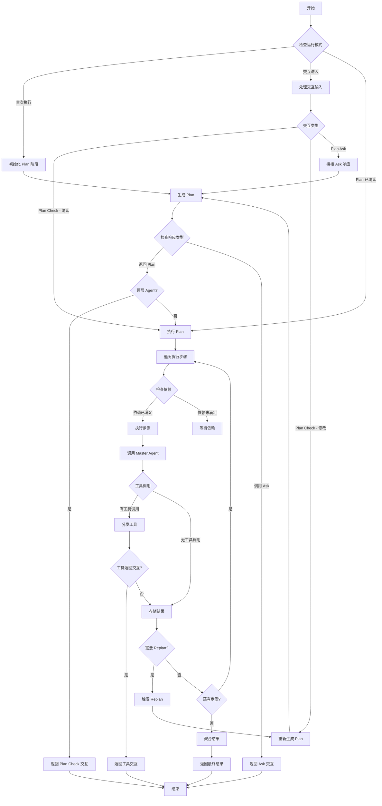
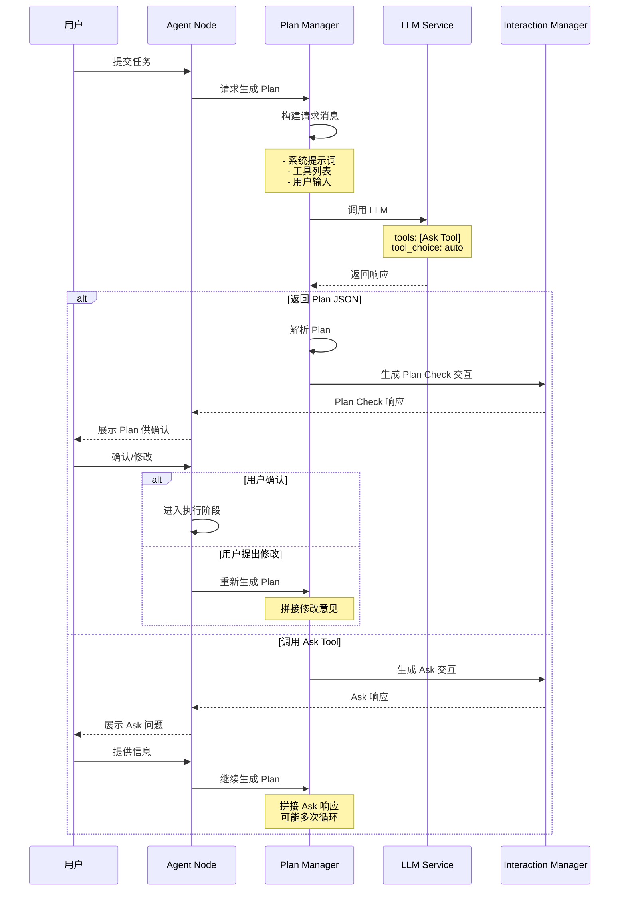
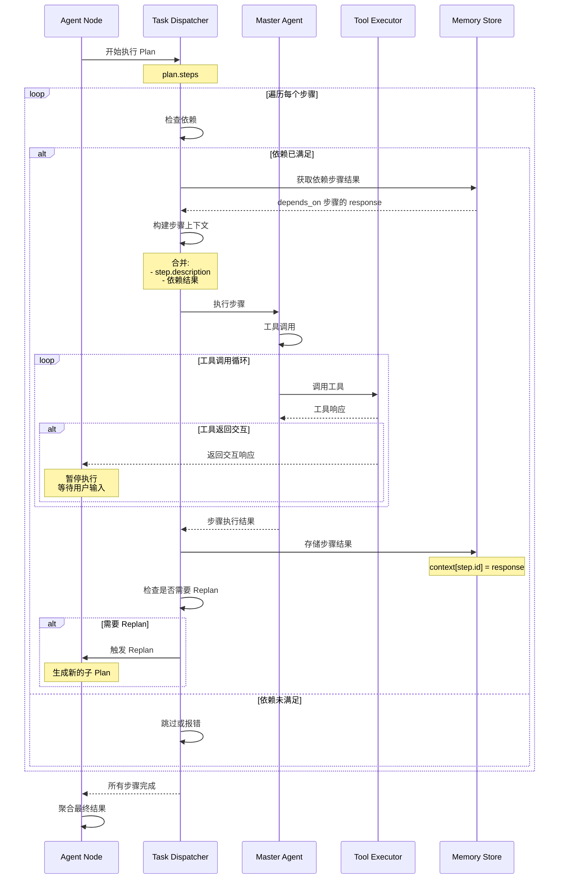
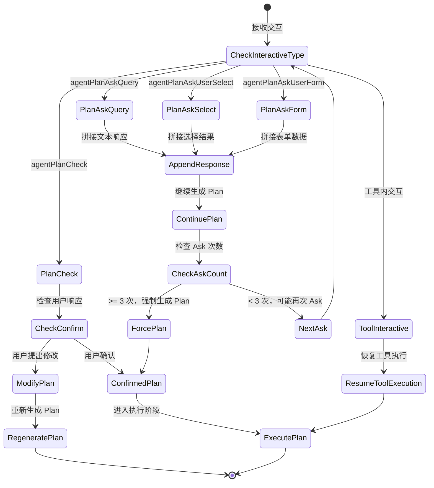

# FastGPT Agent V1 详细设计文档

## 📋 目录

1. [需求概述](#需求概述)
2. [系统架构](#系统架构)
3. [核心模块设计](#核心模块设计)
4. [数据结构定义](#数据结构定义)
5. [工作流程设计](#工作流程设计)
6. [交互机制设计](#交互机制设计)
7. [实现细节](#实现细节)
8. [技术挑战与解决方案](#技术挑战与解决方案)
9. [测试策略](#测试策略)
10. [实施路线图](#实施路线图)

---

## 需求概述

### 核心需求

基于现有工作流引擎，增强 Agent 节点的规划和交互能力，实现动态任务规划和人机协同的智能工作流。

#### 1. Agent 节点增强

新增 Agent 节点类型，包含以下配置：

- **模型配置**：模型选择及参数（temperature, top_p 等）
- **提示词配置**：系统提示词，用于定义 Agent 行为特征
- **问题输入**：用户任务输入
- **Plan 模式配置**：是否启用规划模式
- **Ask 模式配置**：是否启用信息采集模式

#### 2. Human Interaction 节点

新增 3 类交互节点：

1. **Plan Check**：确认和修改 Plan 的交互节点
2. **Plan Ask**：Plan 阶段信息采集的交互节点
3. **Plan Ask Form**：表单式信息采集节点

#### 3. Agent 处理函数

实现 Agent 节点的完整处理逻辑，包括：

- Plan 阶段的生成和迭代
- 任务调度和执行
- 交互响应处理
- 内存管理

---

## 系统架构

### 整体架构

```
┌─────────────────────────────────────────────────────────────┐
│                        FastGPT Workflow Engine                │
└─────────────────────────────────────────────────────────────┘
                              │
                              ▼
┌─────────────────────────────────────────────────────────────┐
│                         Agent Node Layer                      │
│  ┌─────────────┐  ┌──────────────┐  ┌──────────────────┐   │
│  │ Agent Entry │  │ Plan Manager │  │ Task Dispatcher  │   │
│  └─────────────┘  └──────────────┘  └──────────────────┘   │
└─────────────────────────────────────────────────────────────┘
                              │
                              ▼
┌─────────────────────────────────────────────────────────────┐
│                      Interaction Layer                        │
│  ┌─────────────┐  ┌──────────────┐  ┌──────────────────┐   │
│  │ Plan Check  │  │  Plan Ask    │  │  Plan Ask Form   │   │
│  └─────────────┘  └──────────────┘  └──────────────────┘   │
└─────────────────────────────────────────────────────────────┘
                              │
                              ▼
┌─────────────────────────────────────────────────────────────┐
│                       Tool Execution Layer                    │
│  ┌─────────────┐  ┌──────────────┐  ┌──────────────────┐   │
│  │  Sub Apps   │  │ System Tools │  │   File Reader    │   │
│  └─────────────┘  └──────────────┘  └──────────────────┘   │
└─────────────────────────────────────────────────────────────┘
                              │
                              ▼
┌─────────────────────────────────────────────────────────────┐
│                        Memory & State Layer                   │
│  ┌─────────────┐  ┌──────────────┐  ┌──────────────────┐   │
│  │ Plan Memory │  │Context Store │  │  Message Cache   │   │
│  └─────────────┘  └──────────────┘  └──────────────────┘   │
└─────────────────────────────────────────────────────────────┘
```

### 模块职责

#### Agent Entry（Agent 入口模块）

- 解析 Agent 节点配置
- 判断运行模式（Plan 模式 / 非 Plan 模式）
- 加载历史记忆和状态
- 协调各子模块执行

#### Plan Manager（计划管理器）

- 生成初始 Plan
- 处理 Plan 的交互反馈（Check/Ask）
- 管理 Plan 的迭代和修改
- 存储和恢复 Plan 状态

#### Task Dispatcher（任务调度器）

- 解析 Plan 中的任务步骤
- 按依赖关系调度任务
- 调用工具和子应用
- 聚合任务执行结果

#### Interaction Manager（交互管理器）

- 生成交互响应
- 处理用户输入
- 管理交互状态
- 支持多种交互类型

---

## 核心模块设计

### 1. Agent Node 模块

#### 节点配置结构

```typescript
type AgentNodeInputType = {
  // 模型配置
  [NodeInputKeyEnum.aiModel]: string;
  [NodeInputKeyEnum.aiChatTemperature]?: number;
  [NodeInputKeyEnum.aiChatTopP]?: number;

  // 提示词配置
  [NodeInputKeyEnum.aiSystemPrompt]: string;

  // 输入配置
  [NodeInputKeyEnum.userChatInput]: string;
  [NodeInputKeyEnum.history]?: ChatItemType[];
  [NodeInputKeyEnum.fileUrlList]?: string[];

  // 工具配置
  [NodeInputKeyEnum.selectedTools]?: FlowNodeTemplateType[];

  // 模式配置
  [NodeInputKeyEnum.isPlanAgent]?: boolean;
  [NodeInputKeyEnum.isAskAgent]?: boolean;
  [NodeInputKeyEnum.isConfirmPlanAgent]?: boolean;
};
```

#### 节点输出结构

```typescript
type AgentNodeOutputType = {
  [NodeOutputKeyEnum.answerText]: string;
  [DispatchNodeResponseKeyEnum.memories]: {
    planMessages?: ChatCompletionMessageParam[];
    masterMessages?: ChatCompletionMessageParam[];
    plans?: AgentPlanType;
    context?: Record<string, string>;
  };
  [DispatchNodeResponseKeyEnum.interactive]?: InteractiveNodeResponseType;
  [DispatchNodeResponseKeyEnum.assistantResponses]: ChatHistoryItemResType[];
  [DispatchNodeResponseKeyEnum.nodeDispatchUsages]: ChatNodeUsageType[];
};
```

### 2. Plan Manager 模块

#### 核心功能

**Plan 生成流程**

```typescript
async function generatePlan(params: {
  historyMessages: ChatCompletionMessageParam[];
  userInput: string;
  interactive?: WorkflowInteractiveResponseType;
  subAppPrompt: string;
  model: string;
  systemPrompt?: string;
  temperature?: number;
  top_p?: number;
  stream?: boolean;
  isTopPlanAgent: boolean;
}): Promise<{
  answerText: string;
  planList?: AgentPlanType;
  planToolCallMessages: ChatCompletionMessageParam[];
  completeMessages: ChatCompletionMessageParam[];
  usages: ChatNodeUsageType[];
  interactiveResponse?: InteractiveNodeResponseType;
}> {
  // 1. 构建请求消息
  const requestMessages = buildPlanRequestMessages(params);

  // 2. 调用 LLM 生成 Plan
  const llmResponse = await createLLMResponse({
    body: {
      model: params.model,
      messages: requestMessages,
      tools: params.isTopPlanAgent ? [PlanAgentAskTool] : [],
      tool_choice: 'auto',
      toolCallMode: 'toolChoice',
      parallel_tool_calls: false
    }
  });

  // 3. 解析响应
  const { text, planList } = parsePlanResponse(llmResponse.answerText);

  // 4. 处理交互响应
  const interactiveResponse = buildInteractiveResponse(
    llmResponse.toolCalls,
    planList,
    params.isTopPlanAgent
  );

  return {
    answerText: text,
    planList,
    planToolCallMessages: buildPlanToolCallMessages(planList, text),
    completeMessages: llmResponse.completeMessages,
    usages: calculateUsages(llmResponse.usage, params.model),
    interactiveResponse
  };
}
```

**Plan 迭代处理**

```typescript
async function handlePlanIteration(params: {
  interactive: WorkflowInteractiveResponseType;
  userInput: string;
  planMessages: ChatCompletionMessageParam[];
  // ... 其他参数
}): Promise<PlanIterationResult> {
  // 判断交互类型
  if (params.interactive.type === 'agentPlanCheck') {
    // 处理 Plan Check 交互
    if (userInput === ConfirmPlanAgentText) {
      // 用户确认，直接返回 Plan
      return { confirmed: true, planList: extractPlanFromMessages(planMessages) };
    } else {
      // 用户提出修改意见，重新生成 Plan
      return await regeneratePlan({
        ...params,
        modificationRequest: userInput
      });
    }
  } else if (
    params.interactive.type === 'agentPlanAskQuery' ||
    params.interactive.type === 'agentPlanAskUserSelect' ||
    params.interactive.type === 'agentPlanAskUserForm'
  ) {
    // 处理 Ask 交互，拼接用户响应后继续生成
    return await continuePlanGeneration({
      ...params,
      additionalInfo: userInput
    });
  }
}
```

### 3. Task Dispatcher 模块

#### 核心调度逻辑

```typescript
async function dispatchPlanSteps(params: {
  plan: AgentPlanType;
  context: Map<string, string>;
  toolNodes: RuntimeNodeItemType[];
  // ... 其他参数
}): Promise<TaskDispatchResult> {
  const { plan, context } = params;

  // 遍历执行每一步
  for (const step of plan.steps) {
    try {
      // 1. 检查依赖
      await checkStepDependencies(step, context);

      // 2. 构建步骤上下文
      const stepContext = buildStepContext(step, context);

      // 3. 调用 Master Agent 执行步骤
      const stepResult = await executePlanStep({
        step,
        context: stepContext,
        toolNodes: params.toolNodes,
        model: params.model,
        systemPrompt: params.systemPrompt,
        // ... 其他参数
      });

      // 4. 存储步骤响应
      context.set(step.id, stepResult.response);
      step.response = stepResult.response;

      // 5. 检查是否需要 Replan
      if (shouldReplan(step, plan.replan)) {
        // 触发 Replan 逻辑
        const replanResult = await handleReplan({
          currentPlan: plan,
          executedSteps: Array.from(context.entries()),
          // ...
        });

        // 更新 Plan 并继续执行
        plan.steps = replanResult.newSteps;
      }

    } catch (error) {
      // 错误处理：记录失败并决定是否继续
      handleStepError(step, error, params.continueOnError);
    }
  }

  return {
    completedSteps: plan.steps,
    context,
    totalUsages: calculateTotalUsages(params)
  };
}
```

#### 步骤执行逻辑

```typescript
async function executePlanStep(params: {
  step: AgentPlanStepType;
  context: string;
  toolNodes: RuntimeNodeItemType[];
  model: string;
  systemPrompt: string;
  // ...
}): Promise<StepExecutionResult> {
  // 1. 构建 Master Agent 的消息
  const systemMessages = chats2GPTMessages({
    messages: getSystemPrompt_ChatItemType(getMasterAgentDefaultPrompt()),
    reserveId: false
  });

  const taskMessages = chats2GPTMessages({
    messages: [{
      obj: ChatRoleEnum.Human,
      value: runtimePrompt2ChatsValue({
        text: buildStepTaskDescription(params.step, params.context),
        files: []
      })
    }],
    reserveId: false
  });

  // 2. 调用 runAgentCall 执行工具调用
  const result = await runAgentCall({
    maxRunAgentTimes: 100,
    body: {
      messages: [...systemMessages, ...taskMessages],
      model: params.model,
      temperature: params.temperature,
      stream: params.stream,
      top_p: params.top_p,
      agent_selectedTools: buildSubAppTools(params.toolNodes)
    },

    // 工具调用处理器
    handleToolResponse: async ({ call, messages }) => {
      return await dispatchToolCall({
        call,
        messages,
        toolNodes: params.toolNodes,
        // ...
      });
    },

    // 流式响应处理
    onStreaming({ text }) {
      params.workflowStreamResponse?.({
        event: SseResponseEventEnum.answer,
        data: textAdaptGptResponse({ text })
      });
    }
  });

  return {
    response: extractFinalResponse(result.assistantResponses),
    usages: result.subAppUsages,
    messages: result.completeMessages
  };
}
```

### 4. Interaction Manager 模块

#### 交互类型处理

```typescript
// Plan Check 交互
function buildPlanCheckInteractive(
  planList: AgentPlanType
): AgentPlanCheckInteractive {
  return {
    type: 'agentPlanCheck',
    params: {
      confirmed: false
    },
    entryNodeIds: [], // 将在运行时填充
    memoryEdges: [],
    nodeOutputs: []
  };
}

// Plan Ask Query 交互
function buildPlanAskQueryInteractive(
  askParams: AskAgentToolParamsType
): AgentPlanAskQueryInteractive {
  return {
    type: 'agentPlanAskQuery',
    params: {
      content: askParams.prompt
    },
    entryNodeIds: [],
    memoryEdges: [],
    nodeOutputs: []
  };
}

// Plan Ask User Select 交互
function buildPlanAskSelectInteractive(
  askParams: AskAgentToolParamsType
): UserSelectInteractive {
  return {
    type: 'agentPlanAskUserSelect',
    params: {
      description: askParams.prompt,
      userSelectOptions: askParams.options.map((v, i) => ({
        key: `option${i}`,
        value: v
      }))
    },
    entryNodeIds: [],
    memoryEdges: [],
    nodeOutputs: []
  };
}

// Plan Ask User Form 交互
function buildPlanAskFormInteractive(
  askParams: AskAgentToolParamsType
): UserInputInteractive {
  return {
    type: 'agentPlanAskUserForm',
    params: {
      description: askParams.prompt,
      inputForm: askParams.formFields.map(field => ({
        type: field.type,
        key: field.key,
        label: field.label,
        value: field.defaultValue,
        valueType: field.valueType,
        description: field.description,
        required: field.required,
        maxLength: field.maxLength,
        max: field.max,
        min: field.min,
        list: field.options
      }))
    },
    entryNodeIds: [],
    memoryEdges: [],
    nodeOutputs: []
  };
}
```

---

## 数据结构定义

### Plan 相关数据结构

#### AgentPlanStepType

```typescript
/**
 * Agent 计划步骤类型
 * 表示计划中的单个执行步骤
 */
export type AgentPlanStepType = {
  /** 步骤唯一 ID */
  id: string;

  /** 步骤标题，通常不超过 20 字 */
  title: string;

  /** 步骤详细任务描述，可包含 @tool_name 引用 */
  description: string;

  /** 依赖的步骤 ID 列表，用于获取前置步骤的响应 */
  depends_on?: string[];

  /** 步骤的执行响应结果 */
  response?: string;
};
```

#### AgentPlanType

```typescript
/**
 * Agent 计划类型
 * 表示完整的任务执行计划
 */
export type AgentPlanType = {
  /** 任务主题，准确覆盖所有执行步骤的核心内容和维度 */
  task: string;

  /** 完成任务的步骤列表 */
  steps: AgentPlanStepType[];

  /** 需要重新规划时依赖的步骤 ID 列表 */
  replan?: string[];
};
```

### 内存数据结构

#### AgentMemoryType

```typescript
/**
 * Agent 内存类型
 * 用于在对话历史中存储 Agent 的状态
 */
export type AgentMemoryType = {
  /** Plan 阶段的消息历史 */
  planMessages?: ChatCompletionMessageParam[];

  /** Master Agent 的消息历史 */
  masterMessages?: ChatCompletionMessageParam[];

  /** 当前任务的 Plan */
  plans?: AgentPlanType;

  /** 步骤执行上下文，key 为 step.id，value 为 step.response */
  context?: Record<string, string>;
};
```

### 交互数据结构

#### AskAgentToolParamsType

```typescript
/**
 * Ask Agent 工具参数类型
 * 用于 Plan 阶段信息采集
 */
export type AskAgentToolParamsType = {
  /** 交互模式：query-文本输入，select-选项选择，form-表单输入 */
  mode: 'query' | 'select' | 'form';

  /** 提示文本，描述需要用户提供什么信息 */
  prompt: string;

  /** select 模式：选项列表 */
  options?: string[];

  /** form 模式：表单字段定义 */
  formFields?: {
    type: FlowNodeInputTypeEnum;
    key: string;
    label: string;
    valueType: WorkflowIOValueTypeEnum;
    description?: string;
    defaultValue?: any;
    required: boolean;
    maxLength?: number;
    max?: number;
    min?: number;
    options?: { label: string; value: string }[];
  }[];
};
```

---

## 工作流程设计

### 1. Agent 节点执行主流程



### 2. Plan 生成流程



### 3. 任务调度流程



### 4. 交互处理流程



---

## 交互机制设计

### 1. Plan Check 交互

**触发条件**

- Plan Agent 成功生成 Plan（JSON 格式）
- 当前为顶层 Agent（非子 Agent）

**交互数据**

```typescript
type AgentPlanCheckInteractive = {
  type: 'agentPlanCheck';
  params: {
    confirmed?: boolean; // 用户是否确认
  };
  entryNodeIds: string[];
  memoryEdges: RuntimeEdgeItemType[];
  nodeOutputs: NodeOutputItemType[];
};
```

**前端展示**

- 展示 Plan JSON 的可读格式：
  - 任务主题（task）
  - 步骤列表（steps），每个步骤显示 id、title、description、depends_on
  - Replan 依赖（replan）
- 提供两个操作：
  - **确认**：点击后返回特殊文本 `ConfirmPlanAgentText`
  - **修改**：文本输入框，用户描述修改意见

**后端处理**

```typescript
// 用户点击确认
if (interactiveInput === ConfirmPlanAgentText) {
  // 直接进入执行阶段，不再调用 LLM
  return {
    confirmed: true,
    planList: plans // 使用已有的 Plan
  };
}

// 用户提出修改
else {
  // 拼接修改意见到 messages，重新调用 LLM
  const newMessages = [
    ...planHistoryMessages,
    {
      role: 'user',
      content: interactiveInput // 用户的修改意见
    }
  ];

  return await dispatchPlanAgent({
    historyMessages: newMessages,
    // ... 其他参数
  });
}
```

### 2. Plan Ask 交互

#### 2.1 Plan Ask Query（文本输入）

**触发条件**

- LLM 调用 Ask Tool，mode 为 'query'

**交互数据**

```typescript
type AgentPlanAskQueryInteractive = {
  type: 'agentPlanAskQuery';
  params: {
    content: string; // 问题描述
  };
};
```

**前端展示**

- 展示问题描述
- 提供文本输入框供用户输入

**后端处理**

```typescript
// 用户提交输入后
const lastMessages = requestMessages[requestMessages.length - 1];
if (lastMessages.role === 'assistant' && lastMessages.tool_calls) {
  // 作为 tool response 拼接
  requestMessages.push({
    role: 'tool',
    tool_call_id: lastMessages.tool_calls[0].id,
    content: userInput
  });
} else {
  // 作为 user message 拼接
  requestMessages.push({
    role: 'user',
    content: userInput
  });
}

// 重新调用 LLM
return await dispatchPlanAgent({
  historyMessages: requestMessages,
  // ...
});
```

#### 2.2 Plan Ask User Select（选项选择）

**触发条件**

- LLM 调用 Ask Tool，mode 为 'select'，并提供 options

**交互数据**

```typescript
type UserSelectInteractive = {
  type: 'agentPlanAskUserSelect';
  params: {
    description: string; // 问题描述
    userSelectOptions: {
      key: string; // 'option0', 'option1', ...
      value: string; // 选项文本
    }[];
    userSelectedVal?: string; // 用户选择的值
  };
};
```

**前端展示**

- 展示问题描述
- 展示选项列表（单选或多选）
- 用户选择后提交

**后端处理**

```typescript
// 用户选择后，selected option 的 value 作为 userInput
// 处理方式与 Plan Ask Query 相同
```

#### 2.3 Plan Ask User Form（表单输入）

**触发条件**

- LLM 调用 Ask Tool，mode 为 'form'，并提供 formFields

**交互数据**

```typescript
type UserInputInteractive = {
  type: 'agentPlanAskUserForm';
  params: {
    description: string; // 表单描述
    inputForm: UserInputFormItemType[]; // 表单字段列表
    submitted?: boolean; // 是否已提交
  };
};

type UserInputFormItemType = {
  type: FlowNodeInputTypeEnum; // input, textarea, numberInput, select, etc.
  key: string;
  label: string;
  value: any;
  valueType: WorkflowIOValueTypeEnum;
  description?: string;
  defaultValue?: any;
  required: boolean;
  maxLength?: number;
  max?: number;
  min?: number;
  list?: { label: string; value: string }[];
};
```

**前端展示**

- 展示表单描述
- 根据 formFields 渲染表单控件：
  - `input` / `textarea`：文本输入
  - `numberInput`：数字输入，支持 min/max
  - `select`：下拉选择，使用 list
  - 等等
- 用户填写后提交

**后端处理**

```typescript
// 用户提交表单后，将表单数据序列化为 JSON 字符串作为 userInput
const formData = {
  field1: value1,
  field2: value2,
  // ...
};
const userInput = JSON.stringify(formData);

// 处理方式与 Plan Ask Query 相同
```

### 3. Ask 循环限制

为防止无限循环，对 Ask 次数进行限制：

- **最大 Ask 次数**：3 次
- **检测方法**：统计 planHistoryMessages 中 Ask Tool 的调用次数
- **超过限制后**：不再提供 Ask Tool，强制 LLM 生成 Plan

```typescript
// 计算 Ask 次数
function countAskCalls(messages: ChatCompletionMessageParam[]): number {
  return messages.filter(msg =>
    msg.role === 'assistant' &&
    msg.tool_calls?.some(call => call.function.name === 'interactivePromptTool')
  ).length;
}

// 调用 LLM 时
const askCount = countAskCalls(planHistoryMessages);
const tools = (askCount < 3 && isTopPlanAgent) ? [PlanAgentAskTool] : [];

await createLLMResponse({
  body: {
    // ...
    tools,
    tool_choice: 'auto'
  }
});
```

---

## 实现细节

### 1. 内存管理

#### 内存键命名规则

```typescript
// 基于 nodeId 生成唯一的内存键
const planMessagesKey = `planMessages-${nodeId}`;
const masterMessagesKey = `masterMessages-${nodeId}`;
const contextKey = `context-${nodeId}`;
const plansKey = `plans-${nodeId}`;
```

#### 内存存储

```typescript
// 从最新的 AI 消息中恢复内存
function restoreMemoryFromHistory(
  chatHistories: ChatItemType[],
  nodeId: string
): AgentMemoryType {
  const lastHistory = chatHistories[chatHistories.length - 1];

  if (lastHistory && lastHistory.obj === ChatRoleEnum.AI) {
    return {
      planMessages: lastHistory.memories?.[`planMessages-${nodeId}`] || [],
      masterMessages: lastHistory.memories?.[`masterMessages-${nodeId}`] || [],
      plans: lastHistory.memories?.[`plans-${nodeId}`],
      context: lastHistory.memories?.[`context-${nodeId}`] || {}
    };
  }

  return {
    planMessages: [],
    masterMessages: [],
    context: {}
  };
}

// 保存内存到响应
function saveMemoryToResponse(
  memory: AgentMemoryType,
  nodeId: string
): Record<string, any> {
  return {
    [`planMessages-${nodeId}`]: filterMemoryMessages(memory.planMessages),
    [`masterMessages-${nodeId}`]: filterMemoryMessages(memory.masterMessages),
    [`plans-${nodeId}`]: memory.plans,
    [`context-${nodeId}`]: memory.context
  };
}
```

#### 内存过滤

为减少内存大小，过滤掉不必要的消息内容：

```typescript
function filterMemoryMessages(
  messages: ChatCompletionMessageParam[]
): ChatCompletionMessageParam[] {
  return messages.map(msg => {
    if (msg.role === 'tool') {
      // 截断过长的 tool response
      return {
        ...msg,
        content: sliceStrStartEnd(msg.content, 1000, 1000)
      };
    }
    return msg;
  });
}
```

### 2. 依赖检查

```typescript
/**
 * 检查步骤的依赖是否已满足
 */
function checkStepDependencies(
  step: AgentPlanStepType,
  context: Map<string, string>
): boolean {
  if (!step.depends_on || step.depends_on.length === 0) {
    return true; // 无依赖，可以执行
  }

  // 检查所有依赖步骤是否都有响应
  return step.depends_on.every(depId => context.has(depId));
}

/**
 * 构建步骤的上下文信息
 */
function buildStepContext(
  step: AgentPlanStepType,
  context: Map<string, string>
): string {
  let contextText = step.description;

  if (step.depends_on && step.depends_on.length > 0) {
    contextText += '\n\n依赖步骤的结果：\n';
    step.depends_on.forEach(depId => {
      const depResponse = context.get(depId);
      if (depResponse) {
        contextText += `\n[${depId}]: ${depResponse}\n`;
      }
    });
  }

  return contextText;
}
```

### 3. Replan 触发逻辑

```typescript
/**
 * 判断是否需要触发 Replan
 */
function shouldReplan(
  currentStep: AgentPlanStepType,
  replanDependencies?: string[]
): boolean {
  if (!replanDependencies || replanDependencies.length === 0) {
    return false;
  }

  // 如果当前步骤在 replan 依赖列表中，则触发 Replan
  return replanDependencies.includes(currentStep.id);
}

/**
 * 处理 Replan
 */
async function handleReplan(params: {
  currentPlan: AgentPlanType;
  executedSteps: [string, string][]; // [step.id, step.response]
  model: string;
  systemPrompt: string;
  // ...
}): Promise<{ newSteps: AgentPlanStepType[] }> {
  // 构建 Replan 的上下文
  const executedContext = params.executedSteps
    .map(([id, response]) => `步骤 ${id} 的结果：\n${response}`)
    .join('\n\n');

  const replanPrompt = `
基于以下已执行步骤的结果，生成接下来的执行计划：

${executedContext}

原计划：
${JSON.stringify(params.currentPlan, null, 2)}

请生成新的步骤列表以完成任务。
`;

  // 调用 LLM 生成新的 Plan
  const replanResult = await dispatchPlanAgent({
    historyMessages: [],
    userInput: replanPrompt,
    subAppPrompt: params.subAppPrompt,
    model: params.model,
    systemPrompt: params.systemPrompt,
    // ...
  });

  return {
    newSteps: replanResult.planList?.steps || []
  };
}
```

### 4. 工具调用分发

```typescript
/**
 * 分发工具调用
 */
async function dispatchToolCall(params: {
  call: ChatCompletionMessageToolCall;
  messages: ChatCompletionMessageParam[];
  toolNodes: RuntimeNodeItemType[];
  filesMap: Record<string, string>;
  // ...
}): Promise<{
  response: string;
  usages: ChatNodeUsageType[];
  isEnd: boolean;
  interactive?: WorkflowInteractiveResponseType;
}> {
  const toolId = params.call.function.name;

  // 系统内置工具
  if (toolId === SubAppIds.stop) {
    return { response: '', usages: [], isEnd: true };
  }

  if (toolId === SubAppIds.model) {
    // 调用 Model Agent
    const toolParams = parseJsonArgs<{
      systemPrompt: string;
      task: string;
    }>(params.call.function.arguments);

    return await dispatchModelAgent({
      model: params.model,
      systemPrompt: toolParams.systemPrompt,
      task: toolParams.task,
      // ...
    });
  }

  if (toolId === SubAppIds.fileRead) {
    // 调用文件读取工具
    const toolParams = parseJsonArgs<{
      file_indexes: string[];
    }>(params.call.function.arguments);

    const files = toolParams.file_indexes.map(index => ({
      index,
      url: params.filesMap[index]
    }));

    return await dispatchFileRead({
      files,
      teamId: params.runningUserInfo.teamId,
      tmbId: params.runningUserInfo.tmbId,
      customPdfParse: params.chatConfig?.fileSelectConfig?.customPdfParse
    });
  }

  // 用户自定义工具（Sub App / Plugin）
  const node = params.toolNodes.find(n => n.nodeId === toolId);
  if (!node) {
    return {
      response: 'Can not find the tool',
      usages: [],
      isEnd: false
    };
  }

  const toolCallParams = parseJsonArgs(params.call.function.arguments);
  if (!toolCallParams) {
    return {
      response: 'params is not object',
      usages: [],
      isEnd: false
    };
  }

  // 构建请求参数
  const requestParams = buildToolRequestParams(node, toolCallParams, params);

  // 分发到对应的节点类型
  if (node.flowNodeType === FlowNodeTypeEnum.tool) {
    return await dispatchTool({
      node,
      params: requestParams,
      // ...
    });
  } else if (node.flowNodeType === FlowNodeTypeEnum.appModule) {
    return await dispatchApp({
      node,
      callParams: {
        appId: node.pluginId,
        version: node.version,
        ...requestParams
      },
      // ...
    });
  } else if (node.flowNodeType === FlowNodeTypeEnum.pluginModule) {
    return await dispatchPlugin({
      node,
      callParams: {
        appId: node.pluginId,
        version: node.version,
        ...requestParams
      },
      // ...
    });
  }

  return {
    response: 'Unsupported tool type',
    usages: [],
    isEnd: false
  };
}
```

---

## 技术挑战与解决方案

### 挑战 1：Plan 的稳定生成

**问题描述**

LLM 可能生成不符合 JSON Schema 的 Plan，或者生成的 Plan 结构不完整。

**解决方案**

1. **严格的 Prompt 设计**
   - 在系统提示词中明确要求输出 JSON
   - 提供详细的 JSON Schema 定义
   - 使用示例展示正确的输出格式

2. **LLM 参数优化**
   - 设置 `response_format: { type: 'json_object' }`（对支持的模型）
   - 降低 `temperature` 以提高输出稳定性

3. **解析容错**
   ```typescript
   function parsePlanResponse(answerText: string): {
     text: string;
     planList?: AgentPlanType;
   } {
     try {
       // 尝试解析为 JSON
       const parsed = parseJsonArgs<AgentPlanType>(answerText);

       // 验证必要字段
       if (parsed && parsed.task && Array.isArray(parsed.steps) && parsed.steps.length > 0) {
         return { text: '', planList: parsed };
       }
     } catch (error) {
       // 解析失败，作为普通文本处理
     }

     return { text: answerText, planList: undefined };
   }
   ```

4. **迭代修复**
   - 如果 Plan 解析失败，返回文本给用户，要求用户提供更多信息
   - 通过交互逐步引导 LLM 生成正确的 Plan

### 挑战 2：交互状态管理

**问题描述**

交互节点涉及多次往返，需要保存中间状态，避免丢失上下文。

**解决方案**

1. **内存持久化**
   - 将 `planMessages`、`masterMessages`、`plans`、`context` 存储在对话历史的 `memories` 字段中
   - 每次交互后更新内存

2. **状态恢复**
   ```typescript
   function restoreAgentState(
     chatHistories: ChatItemType[],
     nodeId: string
   ): {
     planMessages: ChatCompletionMessageParam[];
     masterMessages: ChatCompletionMessageParam[];
     plans?: AgentPlanType;
     context: Record<string, string>;
   } {
     const lastHistory = chatHistories[chatHistories.length - 1];

     if (lastHistory && lastHistory.obj === ChatRoleEnum.AI) {
       return {
         planMessages: lastHistory.memories?.[`planMessages-${nodeId}`] || [],
         masterMessages: lastHistory.memories?.[`masterMessages-${nodeId}`] || [],
         plans: lastHistory.memories?.[`plans-${nodeId}`],
         context: lastHistory.memories?.[`context-${nodeId}`] || {}
       };
     }

     return {
       planMessages: [],
       masterMessages: [],
       context: {}
     };
   }
   ```

3. **内存优化**
   - 过滤掉过长的 tool response，只保留摘要
   - 定期清理不再需要的历史消息

### 挑战 3：复杂依赖的任务调度

**问题描述**

Plan 中的步骤可能有复杂的依赖关系，需要正确的调度顺序。

**解决方案**

1. **拓扑排序**
   ```typescript
   function topologicalSort(steps: AgentPlanStepType[]): AgentPlanStepType[] {
     const graph = new Map<string, string[]>();
     const inDegree = new Map<string, number>();

     // 构建依赖图
     steps.forEach(step => {
       inDegree.set(step.id, step.depends_on?.length || 0);
       step.depends_on?.forEach(depId => {
         if (!graph.has(depId)) graph.set(depId, []);
         graph.get(depId)!.push(step.id);
       });
     });

     // 拓扑排序
     const queue: string[] = [];
     const sorted: AgentPlanStepType[] = [];

     inDegree.forEach((degree, id) => {
       if (degree === 0) queue.push(id);
     });

     while (queue.length > 0) {
       const id = queue.shift()!;
       const step = steps.find(s => s.id === id)!;
       sorted.push(step);

       graph.get(id)?.forEach(nextId => {
         inDegree.set(nextId, inDegree.get(nextId)! - 1);
         if (inDegree.get(nextId) === 0) {
           queue.push(nextId);
         }
       });
     }

     // 检查循环依赖
     if (sorted.length !== steps.length) {
       throw new Error('Circular dependency detected in plan steps');
     }

     return sorted;
   }
   ```

2. **并行执行**
   - 对于无依赖关系的步骤，可以并行执行以提高效率
   ```typescript
   async function executeStepsInParallel(
     steps: AgentPlanStepType[],
     context: Map<string, string>
   ) {
     // 按依赖层级分组
     const levels = groupStepsByDependencyLevel(steps);

     // 逐层并行执行
     for (const levelSteps of levels) {
       await Promise.all(
         levelSteps.map(step => executePlanStep({ step, context, /* ... */ }))
       );
     }
   }
   ```

3. **错误处理**
   - 如果某个步骤失败，记录错误但不阻塞其他独立步骤
   - 提供 `continueOnError` 配置选项

### 挑战 4：工具内交互的传递

**问题描述**

Master Agent 调用的工具（Sub App）内部可能也有交互节点，需要正确传递交互响应。

**解决方案**

1. **交互检测**
   ```typescript
   const toolRunResponse = await runWorkflow({
     // ...
   });

   // 检查工具是否返回交互响应
   const workflowInteractiveResponse = toolRunResponse.workflowInteractiveResponse;

   if (workflowInteractiveResponse) {
     // 保存当前状态，返回交互给用户
     return {
       // ...
       toolWorkflowInteractiveResponse: {
         ...workflowInteractiveResponse,
         toolParams: {
           entryNodeIds: workflowInteractiveResponse.entryNodeIds,
           toolCallId: call.id,
           memoryMessages: currentMessages
         }
       }
     };
   }
   ```

2. **交互恢复**
   ```typescript
   if (interactiveEntryToolParams) {
     // 恢复工具的入口节点
     initToolNodes(runtimeNodes, interactiveEntryToolParams.entryNodeIds);
     initToolCallEdges(runtimeEdges, interactiveEntryToolParams.entryNodeIds);

     // 运行工具
     const toolRunResponse = await runWorkflow({
       // ...
     });

     // 替换 tool response
     const updatedMessages = interactiveEntryToolParams.memoryMessages.map(msg =>
       msg.role === 'tool' && msg.tool_call_id === interactiveEntryToolParams.toolCallId
         ? { ...msg, content: formatToolResponse(toolRunResponse.toolResponses) }
         : msg
     );

     // 继续执行
     return runToolCall({
       // ...
       messages: [...messages, ...updatedMessages]
     });
   }
   ```

---

## 测试策略

### 1. 单元测试

#### Plan Manager 测试

```typescript
describe('Plan Manager', () => {
  test('should generate valid plan from LLM response', async () => {
    const result = await dispatchPlanAgent({
      historyMessages: [],
      userInput: '帮我制定一个市场调研计划',
      subAppPrompt: '- [@research_agent]: 搜索信息;',
      model: 'gpt-4',
      systemPrompt: '你是一个任务规划助手',
      isTopPlanAgent: true
    });

    expect(result.planList).toBeDefined();
    expect(result.planList?.task).toBeTruthy();
    expect(result.planList?.steps).toBeInstanceOf(Array);
    expect(result.planList?.steps.length).toBeGreaterThan(0);
  });

  test('should handle Ask interaction', async () => {
    const result = await dispatchPlanAgent({
      // ... 配置让 LLM 调用 Ask Tool
    });

    expect(result.interactiveResponse).toBeDefined();
    expect(result.interactiveResponse?.type).toMatch(/agentPlanAsk/);
  });

  test('should limit Ask calls to 3 times', async () => {
    // 模拟多次 Ask 交互
    let messages: ChatCompletionMessageParam[] = [];

    for (let i = 0; i < 4; i++) {
      const result = await dispatchPlanAgent({
        historyMessages: messages,
        userInput: '更多信息',
        // ...
      });

      messages = result.completeMessages;

      if (i < 3) {
        // 前 3 次可能返回 Ask
        expect([
          'agentPlanAskQuery',
          'agentPlanAskUserSelect',
          'agentPlanAskUserForm',
          'agentPlanCheck'
        ]).toContain(result.interactiveResponse?.type);
      } else {
        // 第 4 次应该强制返回 Plan
        expect(result.planList).toBeDefined();
      }
    }
  });
});
```

#### Task Dispatcher 测试

```typescript
describe('Task Dispatcher', () => {
  test('should execute steps in correct order', async () => {
    const plan: AgentPlanType = {
      task: '测试任务',
      steps: [
        { id: 'step1', title: '步骤1', description: '执行任务1' },
        { id: 'step2', title: '步骤2', description: '执行任务2', depends_on: ['step1'] },
        { id: 'step3', title: '步骤3', description: '执行任务3', depends_on: ['step2'] }
      ]
    };

    const executionOrder: string[] = [];

    const result = await dispatchPlanSteps({
      plan,
      context: new Map(),
      onStepStart: (step) => executionOrder.push(step.id),
      // ...
    });

    expect(executionOrder).toEqual(['step1', 'step2', 'step3']);
  });

  test('should handle parallel steps', async () => {
    const plan: AgentPlanType = {
      task: '测试并行任务',
      steps: [
        { id: 'step1', title: '步骤1', description: '执行任务1' },
        { id: 'step2', title: '步骤2', description: '执行任务2' }, // 无依赖，可并行
        { id: 'step3', title: '步骤3', description: '执行任务3', depends_on: ['step1', 'step2'] }
      ]
    };

    const result = await dispatchPlanSteps({
      plan,
      context: new Map(),
      // ...
    });

    // step1 和 step2 应该并行执行，step3 等待它们完成
    expect(result.completedSteps).toHaveLength(3);
  });

  test('should trigger replan when needed', async () => {
    const plan: AgentPlanType = {
      task: '测试 Replan',
      steps: [
        { id: 'step1', title: '步骤1', description: '执行任务1' }
      ],
      replan: ['step1'] // step1 完成后需要 replan
    };

    const replanCalled = jest.fn();

    await dispatchPlanSteps({
      plan,
      context: new Map(),
      onReplan: replanCalled,
      // ...
    });

    expect(replanCalled).toHaveBeenCalled();
  });
});
```

### 2. 集成测试

#### 端到端 Agent 流程测试

```typescript
describe('Agent End-to-End Flow', () => {
  test('should complete full agent workflow with plan', async () => {
    // 1. 首次调用：生成 Plan
    const firstResult = await dispatchRunAgent({
      params: {
        model: 'gpt-4',
        systemPrompt: '你是一个智能助手',
        userChatInput: '帮我查找最新的 AI 新闻并总结',
        isPlanAgent: true,
        agent_selectedTools: [/* mock sub apps */]
      },
      // ... 其他参数
    });

    // 应该返回 Plan Check 交互
    expect(firstResult[DispatchNodeResponseKeyEnum.interactive]).toBeDefined();
    expect(firstResult[DispatchNodeResponseKeyEnum.interactive]?.type).toBe('agentPlanCheck');

    // 2. 用户确认 Plan
    const secondResult = await dispatchRunAgent({
      params: {
        // ... 相同配置
      },
      lastInteractive: firstResult[DispatchNodeResponseKeyEnum.interactive],
      query: ConfirmPlanAgentText,
      histories: [
        // ... 包含 firstResult 的历史
      ]
    });

    // 应该执行 Plan 并返回最终结果
    expect(secondResult[DispatchNodeResponseKeyEnum.answerText]).toBeTruthy();
    expect(secondResult[DispatchNodeResponseKeyEnum.assistantResponses]).toBeInstanceOf(Array);
  });

  test('should handle Ask interaction in plan phase', async () => {
    // 配置让 LLM 返回 Ask
    const firstResult = await dispatchRunAgent({
      params: {
        model: 'gpt-4',
        systemPrompt: '...',
        userChatInput: '帮我制定旅行计划',
        isPlanAgent: true,
        isAskAgent: true,
        agent_selectedTools: []
      },
      // ...
    });

    // 应该返回 Ask 交互
    expect(firstResult[DispatchNodeResponseKeyEnum.interactive]?.type).toMatch(/agentPlanAsk/);

    // 用户回答
    const secondResult = await dispatchRunAgent({
      params: { /* ... */ },
      lastInteractive: firstResult[DispatchNodeResponseKeyEnum.interactive],
      query: '我想去日本',
      histories: [ /* ... */ ]
    });

    // 可能继续 Ask 或返回 Plan
    expect(secondResult[DispatchNodeResponseKeyEnum.interactive]).toBeDefined();
  });
});
```

### 3. 性能测试

```typescript
describe('Agent Performance', () => {
  test('should complete plan execution within reasonable time', async () => {
    const startTime = Date.now();

    const result = await dispatchRunAgent({
      params: {
        model: 'gpt-4',
        userChatInput: '执行一个包含 5 个步骤的复杂任务',
        isPlanAgent: true,
        agent_selectedTools: [/* 5 个 sub apps */]
      },
      // ...
    });

    const duration = Date.now() - startTime;

    // 假设每个步骤平均 5 秒，5 个步骤不应超过 30 秒
    expect(duration).toBeLessThan(30000);
  });

  test('should handle large plan with many steps', async () => {
    const largePlan: AgentPlanType = {
      task: '大规模任务',
      steps: Array.from({ length: 20 }, (_, i) => ({
        id: `step${i + 1}`,
        title: `步骤 ${i + 1}`,
        description: `执行任务 ${i + 1}`
      }))
    };

    // 测试是否能处理大规模 Plan
    const result = await dispatchPlanSteps({
      plan: largePlan,
      context: new Map(),
      // ...
    });

    expect(result.completedSteps).toHaveLength(20);
  });
});
```

---

## 实施路线图

### Phase 1：基础架构（1-2 周）

**目标**：建立 Agent 节点的基础架构和数据流

**任务**：

1. ✅ **定义数据结构**
   - `AgentPlanStepType`
   - `AgentPlanType`
   - `AgentMemoryType`
   - 交互类型扩展

2. ✅ **创建 Agent Node 入口**
   - `dispatchRunAgent` 函数框架
   - 参数解析和验证
   - 模式判断逻辑

3. ✅ **实现内存管理**
   - 内存键命名规则
   - 内存保存和恢复逻辑
   - 内存过滤和优化

4. **单元测试**
   - 数据结构验证
   - 内存管理测试

### Phase 2：Plan Manager 实现（1-2 周）

**目标**：实现 Plan 的生成、迭代和交互

**任务**：

1. ✅ **Plan 生成逻辑**
   - `dispatchPlanAgent` 函数实现
   - Prompt 设计和优化
   - LLM 调用和响应解析

2. ✅ **Ask Tool 集成**
   - Ask Tool 定义
   - Ask 交互类型处理
   - Ask 循环限制

3. ✅ **Plan Check 交互**
   - Plan Check 交互生成
   - 用户确认处理
   - Plan 修改迭代

4. **单元测试**
   - Plan 生成测试
   - Ask 交互测试
   - Plan Check 测试

### Phase 3：Task Dispatcher 实现（2-3 周）

**目标**：实现 Plan 的任务调度和执行

**任务**：

1. **依赖管理**
   - 依赖检查逻辑
   - 拓扑排序实现
   - 循环依赖检测

2. **步骤执行**
   - `executePlanStep` 函数实现
   - 步骤上下文构建
   - Master Agent 调用

3. **Replan 逻辑**
   - Replan 触发判断
   - Replan 请求生成
   - Plan 更新和继续执行

4. **工具调用分发**
   - 系统工具处理（stop, model, fileRead）
   - 用户工具分发（Sub App, Plugin）
   - 工具响应聚合

5. **单元测试**
   - 依赖管理测试
   - 步骤执行测试
   - Replan 测试
   - 工具调用测试

### Phase 4：交互节点前端实现（1-2 周）

**目标**：实现前端的交互节点 UI

**任务**：

1. **Plan Check UI**
   - Plan 展示组件
   - 确认和修改按钮
   - 修改意见输入框

2. **Plan Ask Query UI**
   - 问题描述展示
   - 文本输入框

3. **Plan Ask Select UI**
   - 选项列表展示
   - 单选/多选控件

4. **Plan Ask Form UI**
   - 表单字段渲染
   - 各类输入控件（input, textarea, numberInput, select 等）
   - 表单验证

5. **集成测试**
   - 交互 UI 功能测试
   - 用户操作流程测试

### Phase 5：集成测试与优化（1-2 周）

**目标**：端到端测试和性能优化

**任务**：

1. **集成测试**
   - 完整 Agent 流程测试
   - 多轮交互测试
   - 错误场景测试

2. **性能优化**
   - 内存使用优化
   - LLM 调用优化（缓存、批处理）
   - 并行执行优化

3. **错误处理**
   - 异常捕获和恢复
   - 用户友好的错误提示
   - 日志记录

4. **文档编写**
   - 用户使用指南
   - 开发者文档
   - API 文档

### Phase 6：发布和迭代（持续）

**目标**：发布 Agent V1 并根据反馈迭代

**任务**：

1. **Beta 测试**
   - 内部测试
   - 小范围用户测试
   - 收集反馈

2. **正式发布**
   - 版本打包
   - 发布公告
   - 用户培训

3. **持续迭代**
   - Bug 修复
   - 功能增强
   - 性能优化

---

## 附录

### A. Plan Agent Prompt 示例

详见：`packages/service/core/workflow/dispatch/ai/agent/sub/plan/prompt.ts`

### B. Ask Tool 定义

```typescript
export const PlanAgentAskTool: ChatCompletionTool = {
  type: 'function',
  function: {
    name: 'interactivePromptTool',
    description: '当需要向用户询问信息以完善计划时使用此工具',
    parameters: {
      type: 'object',
      properties: {
        mode: {
          type: 'string',
          enum: ['query', 'select', 'form'],
          description: '交互模式：query-文本输入，select-选项选择，form-表单输入'
        },
        prompt: {
          type: 'string',
          description: '提示文本，描述需要用户提供什么信息'
        },
        options: {
          type: 'array',
          items: { type: 'string' },
          description: 'select 模式的选项列表'
        },
        formFields: {
          type: 'array',
          items: {
            type: 'object',
            properties: {
              type: { type: 'string' },
              key: { type: 'string' },
              label: { type: 'string' },
              valueType: { type: 'string' },
              description: { type: 'string' },
              required: { type: 'boolean' },
              // ... 其他字段
            }
          },
          description: 'form 模式的表单字段定义'
        }
      },
      required: ['mode', 'prompt']
    }
  }
};
```

### C. Master Agent Default Prompt

```typescript
export const getMasterAgentDefaultPrompt = () => `
你是一个任务执行助手，负责完成用户分配的具体任务。

你的职责：
1. 理解任务描述和上下文
2. 选择合适的工具完成任务
3. 返回清晰、准确的结果

注意事项：
- 使用 @tool_name 来引用可用工具
- 如果任务需要多个工具协作，合理安排调用顺序
- 如果遇到无法解决的问题，明确说明原因
- 返回结果应简洁且包含关键信息
`;
```

### D. 相关文件路径

**核心实现文件**：
- `packages/service/core/workflow/dispatch/ai/agent/index.ts` - Agent 入口
- `packages/service/core/workflow/dispatch/ai/agent/sub/plan/index.ts` - Plan Manager
- `packages/service/core/workflow/dispatch/ai/agent/sub/plan/type.ts` - Plan 数据结构
- `packages/service/core/workflow/dispatch/ai/agent/sub/plan/prompt.ts` - Plan Prompt
- `packages/service/core/workflow/dispatch/ai/agent/sub/plan/ask/constants.ts` - Ask Tool 定义

**交互类型定义**：
- `packages/global/core/workflow/template/system/interactive/type.ts`

**工具调用**：
- `packages/service/core/workflow/dispatch/ai/tool/toolCall.ts`

---

## 总结

本设计文档详细描述了 FastGPT Agent V1 的完整设计方案，包括：

- **系统架构**：模块化设计，职责清晰
- **核心模块**：Plan Manager、Task Dispatcher、Interaction Manager
- **数据结构**：Plan、Memory、Interactive 等类型定义
- **工作流程**：完整的执行流程和状态机
- **交互机制**：3 类交互节点的详细设计
- **实现细节**：关键算法和代码示例
- **技术挑战**：4 个主要挑战及解决方案
- **测试策略**：单元测试、集成测试、性能测试
- **实施路线图**：6 个阶段的开发计划

该方案结合了 FastGPT 现有的工作流引擎，充分利用了已有的工具调用、交互节点等基础设施，同时引入了 Plan 机制和更灵活的交互方式，实现了智能化的任务规划和执行能力。
