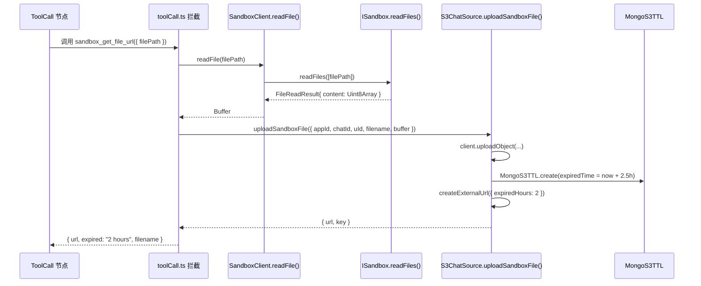
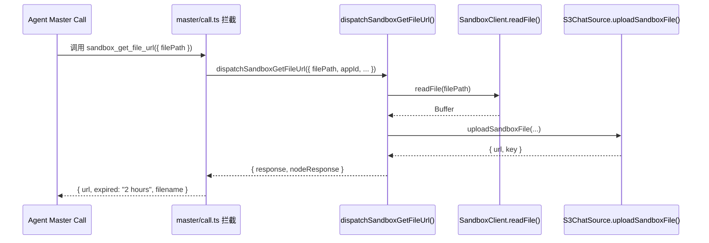

# 虚拟机系统工具：获取文件链接 (sandbox_get_file_url)

## 一、需求概述

为虚拟机（Agent Sandbox）新增一个系统级工具 `sandbox_get_file_url`：

1. Agent 调用该工具，传入虚拟机内的文件路径
2. 系统从虚拟机读取文件内容
3. 将文件上传到 S3（使用对话的 Chat Bucket 实例）
4. 返回 2 小时有效期的签名访问 URL

**工具返回格式**：
```json
{
  "url": "https://xxx.s3.amazonaws.com/...",
  "expired": "2 hours",
  "filename": "output.csv"
}
```

---

## 二、涉及文件

| 文件 | 变更类型 | 说明 |
|------|----------|------|
| `packages/global/core/ai/sandbox/constants.ts` | 修改 | 新增工具定义、Schema、更新系统提示词 |
| `packages/service/core/ai/sandbox/controller.ts` | 修改 | 新增 `readFile()` 方法 |
| `packages/service/core/workflow/dispatch/ai/tool/toolCall.ts` | 修改 | 新增工具拦截逻辑（普通工作流 ToolCall 模式） |
| `packages/service/core/workflow/dispatch/ai/agent/sub/sandbox/index.ts` | 修改 | 新增 `dispatchSandboxGetFileUrl()` 方法 |
| `packages/service/core/workflow/dispatch/ai/agent/master/call.ts` | 修改 | 新增工具拦截逻辑（Agent 模式） |

> **S3 上传**：直接复用 `S3ChatSource.uploadChatFileByBuffer()`，该方法已封装 key 生成、TTL 写入（1h）、上传文件、返回 2h 外网签名 URL，无需新增方法。

> **说明**：Sandbox 工具的拦截分布在两条调用链路中：
> - **普通工作流**：`toolCall.ts` 的 `handleToolResponse` 中直接内联处理
> - **Agent 模式**：`agent/master/call.ts` 的 `handleToolResponse` 中调用 `sub/sandbox/index.ts` 的封装方法

---

## 三、详细设计

### 3.1 工具定义（constants.ts）

新增常量与 Schema：

```typescript
export const SANDBOX_GET_FILE_URL_TOOL_NAME = 'sandbox_get_file_url';

export const SANDBOX_GET_FILE_URL_TOOL: ChatCompletionTool = {
  type: 'function',
  function: {
    name: SANDBOX_GET_FILE_URL_TOOL_NAME,
    description: '从虚拟机读取指定文件，上传至云存储，返回 2 小时有效期的访问链接',
    parameters: {
      type: 'object',
      properties: {
        filePath: {
          type: 'string',
          description: '虚拟机内文件的绝对路径，例如 /workspace/output.csv'
        }
      },
      required: ['filePath']
    }
  }
};

export const SandboxGetFileUrlToolSchema = z.object({
  filePath: z.string()
});

// 更新 SANDBOX_TOOLS（追加新工具）
export const SANDBOX_TOOLS: ChatCompletionTool[] = [
  SANDBOX_SHELL_TOOL,
  SANDBOX_GET_FILE_URL_TOOL  // 新增
];
```

更新系统提示词（`SANDBOX_SYSTEM_PROMPT`），追加工具说明：
```
- 若需要将生成的文件分享给用户，可使用 ${SANDBOX_GET_FILE_URL_TOOL_NAME} 工具获取文件的临时访问链接（有效期 2 小时）
```

---

### 3.2 SandboxClient 新增 readFile 方法

在 `packages/service/core/ai/sandbox/controller.ts` 的 `SandboxClient` 类中新增：

```typescript
/**
 * 从沙盒读取文件内容，返回 Buffer
 * @param filePath 文件在沙盒中的绝对路径
 */
async readFile(filePath: string): Promise<Buffer> {
  await this.ensureAvailable();

  const results = await this.provider.readFiles([filePath]);
  const result = results[0];

  if (result.error) {
    throw new Error(`Failed to read file "${filePath}": ${result.error.message}`);
  }

  return Buffer.from(result.content);
}
```

---

### 3.3 S3 上传（复用现有方法）

直接使用 `S3ChatSource.uploadChatFileByBuffer()`，无需新增方法。该方法定义在 `packages/service/common/s3/buckets/base.ts`：

```typescript
// 调用示例
const chatBucket = getS3ChatSource();
const { key, accessUrl } = await chatBucket.uploadChatFileByBuffer({
  appId,
  chatId,
  uId: userId,
  filename,
  buffer: fileBuffer,
  contentType: 'application/octet-stream'  // 可选
});
// accessUrl 即为 2 小时有效的外网签名 URL
```

> **注意**：底层 `uploadFileByBuffer` 会自动写入 1 小时 TTL 的 MongoS3TTL 记录，文件将在 1 小时后被清理。如业务场景需要 URL 与文件保持同步有效期，可考虑后续调整，当前阶段直接复用。

---

### 3.4 封装方法（sub/sandbox/index.ts）

在 `packages/service/core/workflow/dispatch/ai/agent/sub/sandbox/index.ts` 中新增 `dispatchSandboxGetFileUrl`，与已有的 `dispatchSandboxShell` 同级：

```typescript
import {
  SANDBOX_GET_FILE_URL_TOOL_NAME,
  SandboxGetFileUrlToolSchema,
  SANDBOX_ICON,
  SANDBOX_NAME
} from '@fastgpt/global/core/ai/sandbox/constants';
import { getS3ChatSource } from '../../../../../../common/s3/sources/chat';
import path from 'path';

type SandboxGetFileUrlParams = {
  filePath: string;
  appId: string;
  userId: string;
  chatId: string;
  lang?: localeType;
};

export const dispatchSandboxGetFileUrl = async ({
  filePath,
  appId,
  userId,
  chatId,
  lang
}: SandboxGetFileUrlParams): Promise<{
  response: string;
  usages: ChatNodeUsageType[];
  nodeResponse: ChatHistoryItemResType;
}> => {
  const startTime = Date.now();
  const nodeId = getNanoid(6);
  const moduleName = parseI18nString(SANDBOX_NAME, lang);

  try {
    const sandboxInstance = await getSandboxClient({ appId, userId, chatId });

    // 从沙盒读取文件
    const fileBuffer = await sandboxInstance.readFile(filePath);
    const filename = path.basename(filePath);

    // 上传到 S3，获取 2 小时签名 URL
    const chatBucket = getS3ChatSource();
    const { key, accessUrl } = await chatBucket.uploadChatFileByBuffer({
      appId,
      chatId,
      uId: userId,
      filename,
      buffer: fileBuffer
    });

    const responseData = { url: accessUrl, expired: '2 hours', filename };
    const response = JSON.stringify(responseData);

    return {
      response,
      usages: [],
      nodeResponse: {
        nodeId,
        id: nodeId,
        moduleType: FlowNodeTypeEnum.tool,
        moduleName,
        moduleLogo: SANDBOX_ICON,
        toolId: SANDBOX_GET_FILE_URL_TOOL_NAME,
        toolInput: { filePath },
        toolRes: response,
        totalPoints: 0,
        runningTime: +((Date.now() - startTime) / 1000).toFixed(2)
      }
    };
  } catch (error) {
    const errorResponse = `Get file URL error: ${getErrText(error)}`;
    return {
      response: errorResponse,
      usages: [],
      nodeResponse: {
        nodeId,
        id: nodeId,
        moduleType: FlowNodeTypeEnum.tool,
        moduleName,
        moduleLogo: SANDBOX_ICON,
        toolInput: { filePath },
        toolRes: errorResponse,
        totalPoints: 0,
        runningTime: +((Date.now() - startTime) / 1000).toFixed(2)
      }
    };
  }
};
```

---

### 3.5 工具拦截逻辑（两条链路）

Sandbox 工具在两条调用链路中被拦截，新工具需要同时添加到两处。

#### 3.5.1 普通工作流：toolCall.ts

在 `handleToolResponse` 的 `SANDBOX_TOOL_NAME` 拦截块之后，添加对 `SANDBOX_GET_FILE_URL_TOOL_NAME` 的处理：

```typescript
import {
  SANDBOX_GET_FILE_URL_TOOL_NAME,
  SandboxGetFileUrlToolSchema,
} from '@fastgpt/global/core/ai/sandbox/constants';
import { getS3ChatSource } from '../../../../common/s3/sources/chat';
import path from 'path';

// 在 handleToolResponse 内，紧跟 SANDBOX_TOOL_NAME 拦截块之后：
if (call.function?.name === SANDBOX_GET_FILE_URL_TOOL_NAME) {
  try {
    const params = SandboxGetFileUrlToolSchema.parse(
      parseJsonArgs(call.function.arguments)
    );

    const instance = await getSandboxClient({
      appId: String(workflowProps.runningAppInfo.id),
      userId: String(workflowProps.uid),
      chatId: workflowProps.chatId
    });

    // 从沙盒读取文件
    const fileBuffer = await instance.readFile(params.filePath);
    const filename = path.basename(params.filePath);

    // 上传到 S3，获取 2 小时签名 URL
    const chatBucket = getS3ChatSource();
    const { key, accessUrl } = await chatBucket.uploadChatFileByBuffer({
      appId: String(workflowProps.runningAppInfo.id),
      chatId: workflowProps.chatId ?? '',
      uId: String(workflowProps.uid),
      filename,
      buffer: fileBuffer
    });

    const responseData = { url: accessUrl, expired: '2 hours', filename };
    const stringToolResponse = JSON.stringify(responseData);

    const flowResponse = getSandboxToolWorkflowResponse({
      name: tool.name,
      logo: SANDBOX_ICON,
      input: params,
      response: stringToolResponse,
      durationSeconds: +((Date.now() - startTime) / 1000).toFixed(2)
    });

    return { response: stringToolResponse, flowResponse };
  } catch (error) {
    return {
      response: `Get file URL error: ${getErrText(error)}`
    };
  }
}
```

#### 3.5.2 Agent 模式：agent/master/call.ts

在 `handleToolResponse` 的 `toolId === SANDBOX_TOOL_NAME` 拦截块之后，添加对 `SANDBOX_GET_FILE_URL_TOOL_NAME` 的处理，复用 `dispatchSandboxGetFileUrl`：

```typescript
import { dispatchSandboxGetFileUrl } from '../sub/sandbox';
import {
  SANDBOX_GET_FILE_URL_TOOL_NAME,
  SandboxGetFileUrlToolSchema
} from '@fastgpt/global/core/ai/sandbox/constants';

// 在 handleToolResponse 内，紧跟 SANDBOX_TOOL_NAME 拦截块之后：
if (toolId === SANDBOX_GET_FILE_URL_TOOL_NAME) {
  const toolParams = SandboxGetFileUrlToolSchema.safeParse(
    parseJsonArgs(call.function.arguments)
  );
  if (!toolParams.success) {
    return {
      response: toolParams.error.message,
      usages: []
    };
  }

  const result = await dispatchSandboxGetFileUrl({
    filePath: toolParams.data.filePath,
    appId: runningAppInfo.id,
    userId: props.uid,
    chatId,
    lang: props.lang
  });

  childrenResponses.push(result.nodeResponse);

  return {
    response: result.response,
    usages: result.usages
  };
}
```

---

## 四、执行流程

### 4.1 普通工作流链路（toolCall.ts）



### 4.2 Agent 模式链路（agent/master/call.ts）



---

## 五、错误处理

| 错误场景 | 处理方式 |
|----------|----------|
| 文件不存在 | `readFiles` 返回 `result.error`，抛出错误，Agent 收到错误信息可重试 |
| 沙盒不可用 | `ensureAvailable` 失败，返回错误信息 |
| S3 上传失败 | 捕获异常，返回错误信息 |
| 文件过大 | 暂不限制，后续可在 `readFile` 中增加大小检查 |

---

## 六、TODO

- [x] `packages/global/core/ai/sandbox/constants.ts`：新增 `SANDBOX_GET_FILE_URL_TOOL_NAME`、`SANDBOX_GET_FILE_URL_TOOL`、`SandboxGetFileUrlToolSchema`，更新 `SANDBOX_TOOLS` 和 `SANDBOX_SYSTEM_PROMPT`
- [x] `packages/service/core/ai/sandbox/controller.ts`：`SandboxClient` 新增 `readFile()` 方法
- [x] `packages/service/core/workflow/dispatch/ai/agent/sub/sandbox/index.ts`：新增 `dispatchSandboxGetFileUrl()` 方法
- [x] `packages/service/core/workflow/dispatch/ai/tool/toolCall.ts`：新增 `SANDBOX_GET_FILE_URL_TOOL_NAME` 拦截逻辑（普通工作流链路）
- [x] `packages/service/core/workflow/dispatch/ai/agent/master/call.ts`：新增 `SANDBOX_GET_FILE_URL_TOOL_NAME` 拦截逻辑（Agent 模式链路），复用 `dispatchSandboxGetFileUrl`
