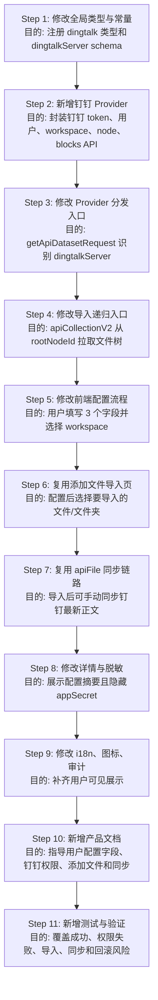

# 功能开发文档

## 开发总流程

本功能不要一上来就写页面或新建同步链路，开发顺序必须按“先确认接口，后接入抽象，再复用现有导入/同步能力”推进。钉钉只新增配置入口和 Provider，导入、训练、同步尽量复用现有 `apiFile` 链路，别整出一套钉钉专属流程给后人添堵。

1. **开发前确认钉钉 API**
   先用钉钉 API Explorer 或最小脚本确认 `appKey/appSecret -> accessToken`、`userId -> unionId/operatorId`、`operatorId -> workspace 列表`、`rootNodeId -> 节点树`、`nodeId -> 在线文档 blocks 文本` 的最终 endpoint、权限点、入参、返回字段、分页字段和限流表现。`GET /v2.0/wiki/workspaces` 与 `GET /v2.0/wiki/nodes` 都已暴露 `nextToken/maxResults`，文件列表接口需要额外做小流量压测，确认分页和限流响应结构。

2. **补全全局类型和常量**
   在 `packages/global` 中新增 `DatasetTypeEnum.dingtalk`、`DingtalkServerSchema`、`apiDatasetServer.dingtalkServer` 和 OpenAPI schema，让前端、后端、OpenAPI 都能合法识别钉钉配置。

3. **实现钉钉 Provider**
   新增 `packages/service/core/dataset/apiDataset/dingtalkDataset/api.ts`，按飞书/语雀 Provider 模式实现 `listFiles`、`getFileContent`、`getFilePreviewUrl`、`getFileDetail`、`getFileRawId`。`accessToken` 缓存必须在 Provider/helper 内完成，按钉钉返回的有效期提前刷新；workspace 列表和节点列表必须按 `nextToken + maxResults` 循环拉全；目录拉取要限制并发并对限流错误做短暂退避重试。钉钉差异全部收敛在 Provider 内部，不污染 `APIFileItemSchema` 和训练流程。

4. **接入 Provider 分发**
   在 `packages/service/core/dataset/apiDataset/index.ts` 的 `getApiDatasetRequest` 中增加 `dingtalkServer` 分支，让现有列目录、导入、读取正文、预览和同步自动走钉钉 Provider。

5. **补导入根节点**
   在 `projects/app/src/pages/api/core/dataset/collection/create/apiCollectionV2.ts` 中补 `dingtalkServer.rootNodeId` 作为递归导入起点。用户选择 workspace 后只保存 `workspaceId/rootNodeId`，不自动导入整个 workspace。

6. **补前端创建和配置流程**
   在创建入口、CreateModal 和 `ApiDatasetForm` 中新增钉钉类型。前台只让用户填写 `App Key`、`App Secret`、`操作人 User ID`，再通过“获取知识库列表”选择 workspace；不要让用户手填 `unionId/workspaceId/rootNodeId`。

7. **复用“添加文件”导入流程**
   配置保存后，用户进入知识库详情页点击“添加文件”，复用现有 `ImportDataSourceEnum.apiDataset` 和 `APIDataset` 导入页，展开钉钉文件树并勾选在线文档或文件夹，最后创建 `apiFile` collection 并进入训练。

8. **复用 `apiFile` 同步能力**
   导入后的钉钉文档仍然是 `apiFile` collection。同步时走现有 `collectionCanSync`、`postLinkCollectionSync`、`syncCollection`、`readApiServerFileContent` 链路；钉钉 Provider 的 `getFileContent` 负责根据 `apiFileId/nodeId` 拉取最新正文，hash 未变化返回 `sameRaw`，变化则重建集合。

9. **补详情展示、脱敏、i18n 和审计**
   详情页展示 `userId`、`workspaceName/workspaceId`，不能展示明文 `appSecret`。同时补中文、英文、繁中 i18n、图标、审计文案，确保用户可见文本不硬编码。

10. **补产品文档和用户指南**
    补充钉钉知识库中英文文档、导航 `meta`，并以 `.claude/design/dingtalk-dataset-用户接入指南.md` 为用户操作说明来源，明确字段去哪拿、应用开哪些权限、怎么添加文件、怎么同步、哪些类型不支持。

11. **测试和验收**
    重点覆盖 `appSecret` 脱敏、workspace 列表、文件树、在线文档正文读取、文件夹递归导入、`apiFile` 同步、权限不足错误提示、非在线文档拦截。单测优先 100% 行/分支覆盖，最低不得低于 90%。

## 文档标识

- 任务前缀：`dingtalk-dataset`
- 文档文件名：`dingtalk-dataset-功能开发文档.md`
- 关联需求文档：`.claude/design/dingtalk-dataset-需求设计文档.md`

## 0. 开发目标与约束

- 功能目标：新增钉钉知识库接入，支持用户通过企业内部应用 `appKey/appSecret` 和操作人 `userId` 获取当前用户可访问的钉钉知识库列表；选择 workspace 后只保存数据源配置，进入知识库详情页点击“添加文件”选择在线文档或文件夹导入，并复用现有 `apiFile` 同步链路。
- 代码范围：`packages/global`、`packages/service`、`packages/web`、`projects/app`、`document/content/introduction/guide/knowledge_base`。
- 非目标：
  - 不接钉钉 AI 助理知识管理 API。
  - 不支持第三方应用授权。
  - 不支持 pdf/docx/xlsx 等二进制文件解析。
  - 不让用户手填 `unionId/workspaceId/rootNodeId`；这些信息由后端查询和前端列表选择得到。
- 实现原则：简单优先、最小改动、避免不必要代码与抽象。
- 必须遵循规范：`references/style-standards-entry.md`、`references/testing-standards.md`、`references/doc-update-reminder.md`、`references/doc-i18n-standards.md`。
- 适用维度：API[x] DB[x] Front[x] Logger[x] Package[x] BugFix[ ] DocUpdate[x] DocI18n[x]。

### 0.1 Skill 产物核对表

规范源位于 `/Users/xxyyh/.codex/skills/fastgpt-requirement-design/references`；当前仓库根目录没有 `references/`，本文档中的 `references/*` 均按 skill reference 解析。

| Skill 要求 | 本文档落点 | 状态 |
|---|---|---|
| 可直接执行的任务拆解 | `1. 实施任务拆解` | 已补齐 |
| 技术实现流程图和步骤映射表 | `1.1`、`1.2` | 已补齐 |
| 文件级改动清单和关键代码片段 | `2. 文件级改动清单`、`2.1` | 已补齐 |
| API/Service/DB/Front/Logger/Package 实施说明 | `3`、`4`、`5`、`3.5` | 已补齐 |
| 文档更新提醒 | `6. 文档更新提醒` | 已补齐 |
| 文档 i18n 实施说明 | `7. 文档 i18n 实施说明` | 已补齐 |
| 测试文件映射、覆盖率目标、场景、命令 | `8. 测试与验证` | 已补齐并补充覆盖率规则 |
| 实施风险与防呆 | `9. 实施风险与防呆` | 已补齐 |

## 1. 实施任务拆解

| 任务ID | 任务名称 | 责任层 | 输入 | 输出 | 完成定义 |
|---|---|---|---|---|---|
| T1 | 扩展全局类型和常量 | Global/API | 钉钉配置字段 | `DatasetTypeEnum.dingtalk`、`DingtalkServerSchema` | 类型编译通过，OpenAPI schema 可引用钉钉配置。 |
| T2 | 实现钉钉 Provider | Service | 钉钉官方 API、现有 Provider 模式 | `useDingtalkDatasetRequest`、`accessToken` 缓存、分页拉取、目录限流退避 | 支持列目录、读正文、预览、详情、rawId；workspace 和节点列表按 `nextToken/maxResults` 拉全；`accessToken` 不重复高频获取；目录接口遇到限流可控失败或退避重试。 |
| T3 | 接入 Provider 分发 | Service | `dingtalkServer` 配置 | `getApiDatasetRequest` 支持钉钉 | 导入、同步、预览均能调用钉钉 Provider。 |
| T4 | 补导入递归根节点 | API/Service | `workspaceId/rootNodeId` 配置 | `apiCollectionV2` 支持钉钉根节点 | 在“添加文件”流程中选择根目录或文件夹时能递归列出钉钉节点。 |
| T5 | 补前端创建和配置入口 | Front | `appKey/appSecret/userId` | 创建菜单、Modal 类型、配置表单、workspace 选择 | 用户只填 3 个字段即可选择钉钉知识库。 |
| T6 | 对齐添加文件、同步和详情流程 | Front/Service | 钉钉配置、`apiFile` collection | 添加文件入口、导入页刷新、集合同步入口、详情展示、审计文案 | 配置后可选文件导入，导入后可手动同步，详情不展示密钥。 |
| T7 | 补 i18n 和图标 | Web | 新增文案和图标 | 三语言文案、钉钉图标 | 前端无硬编码中文。 |
| T8 | 补产品文档和导航 | Docs | 使用流程和限制 | 中英文 MDX、meta 同步 | 文档可被导航访问。 |
| T9 | 补测试 | Test | Provider、脱敏、导入根节点、同步 | 单测/集成测试 | 关键逻辑覆盖，外部钉钉接口 mock。 |
| T10 | 验证和自检 | QA | 测试命令、手工流程 | 验证结果 | 创建、导入、同步、脱敏、文档均通过。 |

### 1.1 技术实现流程图



### 1.2 步骤映射表

| 步骤 | 目标文件或模块 | 变更目的 | 输入 | 输出 | 前置依赖 | 后续衔接 |
|---|---|---|---|---|---|---|
| Step 1 | `packages/global/core/dataset/constants.ts`、`packages/global/core/dataset/apiDataset/type.ts`、`packages/global/openapi/core/dataset/api.ts`、`packages/global/openapi/core/dataset/apiDataset/api.ts` | 注册钉钉知识库类型、配置 schema 和 OpenAPI 描述。 | 字段：`appKey/appSecret/userId/operatorId/workspaceId/rootNodeId/workspaceName`。 | 可被前后端共同引用的类型和 schema。 | 现有 `apiDataset/feishu/yuque` 类型模式。 | Step 2 Provider、Step 5 表单按统一类型实现。 |
| Step 2 | `packages/service/core/dataset/apiDataset/dingtalkDataset/api.ts` | 新增钉钉 Provider，封装外部接口与 `APIFileItemType` 映射。 | `dingtalkServer`、钉钉 API 响应、Mock 测试数据。 | `useDingtalkDatasetRequest` 及内部 helper。 | Step 1 类型。 | Step 3 统一分发，Step 11 测试 Provider。 |
| Step 3 | `packages/service/core/dataset/apiDataset/index.ts` | 让现有 `getApiDatasetRequest` 支持 `dingtalkServer`。 | `ApiDatasetServerType`。 | 返回钉钉 Provider 实例。 | Step 2 Provider。 | `list/getCatalog/getPathNames/read/sync` 自动复用。 |
| Step 4 | `projects/app/src/pages/api/core/dataset/collection/create/apiCollectionV2.ts` | 让目录递归导入从钉钉 `rootNodeId` 开始。 | `dataset.apiDatasetServer.dingtalkServer.rootNodeId`。 | 创建 `apiFile` collection 并触发训练。 | Step 3 能列节点。 | 现有训练、同步和读取链路继续工作。 |
| Step 5 | `projects/app/src/pages/dataset/list/index.tsx`、`projects/app/src/pageComponents/dataset/list/CreateModal.tsx`、`projects/app/src/pageComponents/dataset/ApiDatasetForm.tsx` | 新增钉钉创建入口、三字段表单、workspace 选择。 | 用户填写 `appKey/appSecret/userId`。 | 表单保存 `operatorId/workspaceId/rootNodeId/workspaceName`。 | Step 1 schema、Step 2/3 试连能力。 | Step 6 添加文件导入，Step 8 展示配置。 |
| Step 6 | `projects/app/src/pageComponents/dataset/detail/CollectionCard/Header.tsx`、`projects/app/src/pageComponents/dataset/detail/Import/diffSource/APIDataset.tsx`、`projects/app/src/pages/api/core/dataset/collection/create/apiCollectionV2.ts` | 复用现有“添加文件”入口和 API 文件导入页，让用户选择要导入的在线文档或文件夹。 | 已保存 `dingtalkServer.rootNodeId`、用户勾选的 `apiFiles`。 | `apiFile` collection 创建请求和训练任务。 | Step 4/5。 | Step 7 的同步对象来自这里创建的 `apiFile` 集合。 |
| Step 7 | `packages/global/core/dataset/collection/utils.ts`、`projects/app/src/pageComponents/dataset/detail/CollectionCard/index.tsx`、`projects/app/src/pages/api/core/dataset/collection/sync.ts`、`packages/service/core/dataset/collection/utils.ts`、`packages/service/core/dataset/read.ts` | 确认钉钉 `apiFile` collection 复用同步菜单和服务端同步流程。 | `collectionId`、`apiFileId`、`dingtalkServer`。 | `success/sameRaw` 等同步结果，必要时重建集合。 | Step 2 的 `getFileContent`。 | 用户修改钉钉在线文档后可在 FastGPT 手动同步。 |
| Step 8 | `packages/global/core/dataset/apiDataset/utils.ts`、`projects/app/src/pageComponents/dataset/detail/Info/index.tsx` | 配置详情展示和敏感字段脱敏。 | 已保存 `dingtalkServer`。 | 详情页摘要、`appSecret` 空值回显。 | Step 5 保存配置。 | 用户后续编辑和安全审查。 |
| Step 9 | `packages/web/i18n/zh-CN/dataset.json`、`packages/web/i18n/en/dataset.json`、`packages/web/i18n/zh-Hant/dataset.json`、`packages/web/i18n/*/account_team.json`、`packages/web/components/common/Icon/constants.ts` | 补齐 UI 文案、审计文案和图标。 | 新增钉钉入口和配置字段。 | 三语言文案、审计类型、图标注册。 | Step 5/6/8 页面展示需要文案。 | 文档和 UI 展示一致。 |
| Step 10 | `.claude/design/dingtalk-dataset-用户接入指南.md`、`document/content/introduction/guide/knowledge_base/dingtalk_dataset.mdx`、`document/content/introduction/guide/knowledge_base/dingtalk_dataset.en.mdx`、`meta.json`、`meta.en.json` | 输出用户接入说明和文档站页面。 | 最小填写项、权限清单、常见错误、添加文件和同步说明。 | 中文/英文文档与导航。 | Step 1-9 行为已确定。 | 发布前文档验收。 |
| Step 11 | `test/cases/service/core/dataset/apiDataset/dingtalkDataset/api.test.ts`、`test/cases/global/core/dataset/apiDataset/utils.test.ts`、`projects/app/test/api/core/dataset/collection/create/apiCollectionV2.test.ts` | 验证 Provider、脱敏、递归导入、同步和错误路径。 | Mock 钉钉响应、测试 dataset/collection。 | 单测、集成测试、手工验证结果。 | Step 2-8 代码完成。 | 发布和回滚判断。 |

## 2. 文件级改动清单

| 文件路径 | 改动类型 | 变更摘要 | 关键代码 | 关联任务ID |
|---|---|---|---|---|
| `packages/global/core/dataset/constants.ts` | 修改 | 新增 `DatasetTypeEnum.dingtalk`、`ApiDatasetTypeMap`、`DatasetTypeMap`。 | `dingtalk = 'dingtalk'` | T1 |
| `packages/global/core/dataset/apiDataset/type.ts` | 修改 | 新增 `DingtalkServerSchema`、`DingtalkServerType`、`dingtalkServer`。 | 见 2.1 | T1 |
| `packages/global/core/dataset/apiDataset/utils.ts` | 修改 | 脱敏 `dingtalkServer.appSecret`。 | 见 2.1 | T1 |
| `packages/global/openapi/core/dataset/api.ts` | 修改 | `apiDatasetServer` 描述补钉钉。 | 描述从 API/飞书/语雀改为 API/飞书/语雀/钉钉 | T1 |
| `packages/global/openapi/core/dataset/apiDataset/api.ts` | 修改 | 第三方知识库接口描述补钉钉。 | 描述补 `DingTalk` | T1 |
| `packages/service/core/dataset/apiDataset/dingtalkDataset/api.ts` | 新增 | 钉钉 Provider。 | 见 2.1 | T2 |
| `packages/service/core/dataset/apiDataset/index.ts` | 修改 | 分发 `dingtalkServer`。 | 见 2.1 | T3 |
| `projects/app/src/pages/api/core/dataset/collection/create/apiCollectionV2.ts` | 修改 | `startId` 补钉钉根节点。 | 见 2.1 | T4 |
| `projects/app/src/pageComponents/dataset/detail/CollectionCard/Header.tsx` | 确认/少量修改 | 钉钉进入 `ApiDatasetTypeMap` 后复用“添加文件”按钮，进入 `ImportDataSourceEnum.apiDataset`。 | `router.replace(...source=apiDataset)` | T6 |
| `projects/app/src/pageComponents/dataset/detail/Import/diffSource/APIDataset.tsx` | 修改 | 复用 API 文件导入页，并让列表刷新依赖覆盖 `apiDatasetServer`，避免编辑钉钉配置后仍显示旧树。 | `refreshDeps: [datasetDetail.apiDatasetServer]` | T6 |
| `projects/app/src/pageComponents/dataset/detail/CollectionCard/index.tsx` | 确认 | `apiFile` collection 已通过更多菜单展示同步入口。 | `collectionCanSync(collection.type)` | T6 |
| `packages/global/core/dataset/collection/utils.ts` | 确认 | `collectionCanSync` 已支持 `DatasetCollectionTypeEnum.apiFile`，无需为钉钉新增类型。 | `[link, apiFile].includes(type)` | T6 |
| `projects/app/src/pages/api/core/dataset/collection/sync.ts` | 确认 | 复用现有单集合同步 API。 | `postLinkCollectionSync(collection._id)` | T6 |
| `packages/service/core/dataset/collection/utils.ts` | 确认 | `syncCollection` 对 `apiFile` 调用 `readDatasetSourceRawText` 并按 hash 判断重建。 | `DatasetCollectionTypeEnum.apiFile` | T6 |
| `packages/service/core/dataset/read.ts` | 确认 | `apiFile` 原文读取调用 `getApiDatasetRequest(...).getFileContent`。 | `readApiServerFileContent` | T6 |
| `packages/global/common/system/types/index.ts` | 修改 | 可选新增 `show_dataset_dingtalk?: boolean`。 | 与飞书/语雀开关一致 | T5 |
| `projects/app/src/pages/dataset/list/index.tsx` | 修改 | 第三方知识库菜单新增钉钉。 | `DatasetTypeEnum.dingtalk` | T5 |
| `projects/app/src/pageComponents/dataset/list/CreateModal.tsx` | 修改 | `CreateDatasetType` 支持钉钉。 | union 加 `DatasetTypeEnum.dingtalk` | T5 |
| `projects/app/src/pageComponents/dataset/ApiDatasetForm.tsx` | 修改 | 新增钉钉配置表单和 workspace 选择。 | appKey/appSecret/userId，选择后保存 operatorId/workspaceId/rootNodeId | T5 |
| `projects/app/src/pageComponents/dataset/detail/Info/index.tsx` | 修改 | 详情展示钉钉配置并支持编辑。 | 不展示 appSecret | T6 |
| `packages/service/support/user/audit/util.ts` | 修改 | 审计类型支持钉钉。 | `dataset.dingtalk_dataset` | T6 |
| `packages/web/i18n/zh-CN/dataset.json` | 修改 | 新增钉钉文案。 | `dingtalk_dataset` 等 | T7 |
| `packages/web/i18n/en/dataset.json` | 修改 | 新增英文文案。 | `DingTalk Knowledge Base` | T7 |
| `packages/web/i18n/zh-Hant/dataset.json` | 修改 | 新增繁中文案。 | `釘釘知識庫` | T7 |
| `packages/web/i18n/*/account_team.json` | 修改 | 新增审计文案。 | `dataset.dingtalk_dataset` | T7 |
| `packages/web/components/common/Icon/constants.ts` | 修改 | 注册钉钉知识库图标。 | `core/dataset/dingtalkDatasetColor` | T7 |
| `packages/web/components/common/Icon/icons/core/dataset/dingtalkDatasetColor.svg` | 新增 | 彩色图标。 | 可参考 `common/dingtalkFill` | T7 |
| `packages/web/components/common/Icon/icons/core/dataset/dingtalkDatasetOutline.svg` | 新增 | 线性图标。 | 与现有 dataset 图标命名一致 | T7 |
| `document/content/introduction/guide/knowledge_base/dingtalk_dataset.mdx` | 新增 | 中文使用文档。 | 前置条件、字段说明、限制 | T8 |
| `document/content/introduction/guide/knowledge_base/dingtalk_dataset.en.mdx` | 新增 | 英文使用文档。 | DingTalk terminology | T8 |
| `document/content/introduction/guide/knowledge_base/meta.json` | 修改 | 导航新增 `dingtalk_dataset`。 | 放在 `yuque_dataset` 后或 `lark_dataset` 后 | T8 |
| `document/content/introduction/guide/knowledge_base/meta.en.json` | 修改 | 英文导航同步。 | pages 保持一致 | T8 |

### 2.1 关键代码片段

全局配置类型：

```ts
export const DingtalkServerSchema = z
  .object({
    appKey: z.string(),
    appSecret: z.string().optional(),
    userId: z.string(),
    operatorId: z.string().optional(),
    workspaceId: z.string().optional(),
    rootNodeId: z.string().optional(),
    workspaceName: z.string().optional()
  })
  .meta({ description: '钉钉知识库配置' });

export const ApiDatasetServerSchema = z
  .object({
    apiServer: APIFileServerSchema.optional(),
    feishuServer: FeishuServerSchema.optional(),
    yuqueServer: YuqueServerSchema.optional(),
    dingtalkServer: DingtalkServerSchema.optional()
  })
  .meta({ description: '第三方知识库配置' });
```

敏感字段脱敏：

```ts
const { apiServer, yuqueServer, feishuServer, dingtalkServer } = apiDatasetServer;

return {
  apiServer: apiServer ? { ...apiServer, authorization: '' } : undefined,
  yuqueServer: yuqueServer ? { ...yuqueServer, token: '' } : undefined,
  feishuServer: feishuServer ? { ...feishuServer, appSecret: '' } : undefined,
  dingtalkServer: dingtalkServer ? { ...dingtalkServer, appSecret: '' } : undefined
};
```

Provider 分发：

```ts
export const getApiDatasetRequest = async (apiDatasetServer?: ApiDatasetServerType) => {
  const { apiServer, yuqueServer, feishuServer, dingtalkServer } = apiDatasetServer || {};

  if (apiServer) return useApiDatasetRequest({ apiServer });
  if (yuqueServer) return useYuqueDatasetRequest({ yuqueServer });
  if (feishuServer) return useFeishuDatasetRequest({ feishuServer });
  if (dingtalkServer) return useDingtalkDatasetRequest({ dingtalkServer });

  return Promise.reject('Can not find api dataset server');
};
```

导入根节点：

```ts
const startId =
  dataset.apiDatasetServer?.apiServer?.basePath ||
  dataset.apiDatasetServer?.yuqueServer?.basePath ||
  dataset.apiDatasetServer?.feishuServer?.folderToken ||
  dataset.apiDatasetServer?.dingtalkServer?.rootNodeId;
```

钉钉 Provider 控制流：

```ts
export const useDingtalkDatasetRequest = ({ dingtalkServer }: Props) => {
  const getAccessToken = async () => {
    // POST https://api.dingtalk.com/v1.0/oauth2/accessToken
    // body: { appKey, appSecret }
    // 必须缓存 accessToken：缓存 key 使用 appKey 或 appKey + appSecret hash
    // TTL 使用钉钉返回 expireIn，提前 5 分钟刷新；并发刷新要避免同 appKey 击穿
    // 注意：不要记录 appSecret 和 accessToken
  };

  const getOperatorId = async () => {
    // POST https://oapi.dingtalk.com/topapi/v2/user/get
    // body: { userid: userId }
    // 返回 result.unionid，作为 operatorId 使用
  };

  return {
    listFiles: async ({ parentId, searchKey }) => {
      const token = await getAccessToken();
      const operatorId = dingtalkServer.operatorId || (await getOperatorId());

      if (!dingtalkServer.rootNodeId && !parentId) {
        // GET /v2.0/wiki/workspaces 支持 nextToken/maxResults，必须循环拉全
        const workspaces = await listDingtalkWorkspaces({ token, operatorId, searchKey });
        return workspaces.map(formatDingtalkWorkspaceItem);
      }

      const parentNodeId = parentId || dingtalkServer.rootNodeId;
      // GET /v2.0/wiki/nodes 支持 nextToken/maxResults，必须循环拉全当前目录
      const list = await listDingtalkChildren({ token, operatorId, parentNodeId, searchKey });
      return list.map(formatDingtalkNodeItem);
    },
    getFileContent: async ({ apiFileId }) => {
      const token = await getAccessToken();
      const operatorId = dingtalkServer.operatorId || (await getOperatorId());
      const rawText = await readDingtalkOnlineDocText({ token, operatorId, nodeId: apiFileId });
      return { rawText };
    },
    getFilePreviewUrl: async ({ apiFileId }) => {
      const token = await getAccessToken();
      return { url: await getDingtalkPreviewUrl({ token, apiFileId }) };
    },
    getFileDetail: async ({ apiFileId }) => {
      const token = await getAccessToken();
      return formatDingtalkFileItem(await getDingtalkNodeDetail({ token, apiFileId }));
    },
    getFileRawId: (apiFileId) => parseDingtalkFileId(apiFileId).rawId
  };
};
```

注意：核心链路已通过最小脚本验证：`appKey/appSecret -> accessToken`、`userId -> unionId/operatorId`、`operatorId -> workspaces`、`rootNodeId -> nodes`、`nodeId -> document blocks`。实现时仍要按钉钉 API Explorer 核对 endpoint 和权限点，避免基于猜测编码。

## 3. 后端实施说明

### 3.1 API 改动

不新增 FastGPT API 路由，只扩展已有 schema 和 Provider；下表列出本需求会复用或扩展的现有路由。

| 路由 | 方法 | 请求参数 | 响应结构 | 鉴权 | 错误处理 |
|---|---|---|---|---|---|
| `/api/core/dataset/create` | POST | `type=dingtalk`、`apiDatasetServer.dingtalkServer` | datasetId | 现有创建鉴权 | schema 错误、权限错误走现有错误处理。 |
| `/api/core/dataset/update` | PUT | `apiDatasetServer.dingtalkServer` | 更新结果 | 管理权限 | 空 `appSecret` 不覆盖旧值。 |
| `/api/core/dataset/apiDataset/getCatalog` | POST | `apiDatasetServer`、`parentId` | `APIFileItemType[]` | 登录态/配置试连 | 钉钉错误转成可读错误。 |
| `/api/core/dataset/apiDataset/list` | POST | `datasetId`、`parentId` | `APIFileItemType[]` | 读权限 | Provider 抛错向上返回。 |
| `/api/core/dataset/collection/create/apiCollectionV2` | POST | `datasetId`、`apiFiles` | 创建结果 | 写权限 | 递归失败中断并返回错误。 |
| `/api/core/dataset/collection/sync` | POST | `collectionId` | 同步结果 | 写权限 | 钉钉正文读取失败、hash 未变化、训练失败走现有同步错误处理。 |

钉钉外部接口与权限：

| 目的 | 钉钉接口 | 实现函数 | 权限 |
|---|---|---|---|
| 获取 accessToken | `POST /v1.0/oauth2/accessToken` | `getDingtalkAccessToken` | 应用凭证可用即可；必须按 `expireIn` 缓存，禁止每次列目录/读正文都重新获取。 |
| User ID 换 operatorId | `POST /topapi/v2/user/get` | `getDingtalkOperatorId` | `qyapi_get_member` |
| 获取知识库列表 | `GET /v2.0/wiki/workspaces` | `listDingtalkWorkspaces` | `Wiki.Workspace.Read`；接口支持 `nextToken/maxResults`，必须分页拉全。 |
| 获取节点列表 | `GET /v2.0/wiki/nodes` | `listDingtalkChildren` | `Wiki.Node.Read`；接口支持 `nextToken/maxResults`，必须分页拉全当前目录。 |
| 读取在线文档正文 | `GET /v1.0/doc/suites/documents/{nodeId}/blocks` | `readDingtalkOnlineDocText` | `Storage.File.Read` |

创建请求示例：

```json
{
  "parentId": null,
  "type": "dingtalk",
  "name": "钉钉产品知识库",
  "intro": "钉钉在线文档同步",
  "avatar": "core/dataset/dingtalkDatasetColor",
  "apiDatasetServer": {
    "dingtalkServer": {
      "appKey": "dingxxxx",
      "appSecret": "secret",
      "userId": "300112376621597279",
      "operatorId": "WYdSICEVT95nyee1HTr69wiEiE",
      "workspaceId": "nV06pSYbo6XBEbaB",
      "rootNodeId": "NkDwLng8ZLGMOea0Tx1KeXLyVKMEvZBY",
      "workspaceName": "测试文档"
    }
  }
}
```

详情响应中的配置示例：

```json
{
  "apiDatasetServer": {
    "dingtalkServer": {
      "appKey": "dingxxxx",
      "appSecret": "",
      "userId": "300112376621597279",
      "operatorId": "WYdSICEVT95nyee1HTr69wiEiE",
      "workspaceId": "nV06pSYbo6XBEbaB",
      "rootNodeId": "NkDwLng8ZLGMOea0Tx1KeXLyVKMEvZBY",
      "workspaceName": "测试文档"
    }
  }
}
```

### 3.2 Service/Core 改动

| 模块 | 函数/类型 | 具体改动 | 依赖关系 |
|---|---|---|---|
| `packages/service/core/dataset/apiDataset/dingtalkDataset/api.ts` | `useDingtalkDatasetRequest` | 新增钉钉 Provider。 | 依赖 `@fastgpt/global/core/dataset/apiDataset/type`、logger。 |
| 同文件 | `getDingtalkAccessToken` | 获取并缓存企业内部应用 accessToken。 | 调用 `https://api.dingtalk.com/v1.0/oauth2/accessToken`，通过 `@fastgpt/service/common/redis/cache` 的 `getRedisCache/setRedisCache/delRedisCache` 写入 Redis，按返回 `expireIn` 提前刷新。 |
| 同文件 | `getDingtalkOperatorId` | 通过 `userId` 获取 `unionId/operatorId`。 | 调用 `https://oapi.dingtalk.com/topapi/v2/user/get`。 |
| 同文件 | `listDingtalkWorkspaces` | 获取当前操作人可访问的知识库列表。 | 调用 `GET /v2.0/wiki/workspaces`，使用 `maxResults` 和 `nextToken` 循环拉全，失败时识别限流错误并提示稍后重试。 |
| 同文件 | `listDingtalkChildren` | 获取目录节点列表。 | 调用 `GET /v2.0/wiki/nodes`，使用 `maxResults` 和 `nextToken` 循环拉全当前目录；递归导入时必须限制并发，避免大目录触发钉钉限流。 |
| 同文件 | `formatDingtalkFileItem` | 钉钉 workspace 或 node 转 `APIFileItemType`。 | workspace 阶段保存 workspaceId/rootNodeId，node 阶段保存 nodeId。 |
| `packages/service/core/dataset/apiDataset/index.ts` | `getApiDatasetRequest` | 新增 dingtalk 分支。 | 被导入、同步、预览共用。 |
| `projects/app/src/pages/api/core/dataset/collection/create/apiCollectionV2.ts` | `createApiDatasetCollection` | `startId` 支持钉钉根节点。 | 只读取 global 配置，不写钉钉接口细节。 |
| `packages/service/core/dataset/collection/utils.ts` | `syncCollection` | 不新增钉钉分支；钉钉导入后是 `apiFile`，直接走现有同步逻辑。 | 依赖 `getFileContent` 返回最新 `rawText`。 |
| `packages/service/core/dataset/read.ts` | `readApiServerFileContent` | 不改主逻辑；通过 Provider 分发读取钉钉原文。 | hash 比对和重建集合由现有同步链路负责。 |

钉钉错误处理要求：

- accessToken 失败：抛出“钉钉应用鉴权失败，请检查 AppKey/AppSecret 和应用权限”。
- accessToken 限流：命中钉钉 token 获取频控时不继续重试轰炸，返回“钉钉鉴权接口请求过快，请稍后重试”；实现上必须先依赖缓存降低触发概率。
- 获取操作人失败：抛出“获取钉钉用户 unionId 失败，请检查 UserId、通讯录可见范围和 qyapi_get_member 权限”。
- 获取知识库列表失败：抛出“读取钉钉知识库列表失败，请检查 Wiki.Workspace.Read 权限”。
- 目录失败：抛出“读取钉钉目录失败，请检查 rootNodeId、Wiki.Node.Read 权限和知识库访问权限”。
- 目录限流：命中钉钉文件列表接口限流时，允许 1 次短暂退避重试；仍失败则返回“钉钉目录接口请求过快，请稍后重试或减少一次导入的文件夹规模”。
- 正文失败：抛出“读取钉钉在线文档失败，请检查文档类型和权限”。
- 非在线文档：抛出“当前仅支持钉钉在线文档文本，不支持该文件类型”。

### 3.2.1 accessToken 缓存与目录限流策略

结论：`accessToken` 缓存必须做，目录接口限流保护必须做。钉钉服务端接口存在通用调用频率限制，且官方文档明确要求调用服务端接口前了解频率限制；获取 token 也不应被每次业务请求重复触发。这里不做缓存就是拿自己系统当压测工具，属于纯纯给后面挖坑。

| 项目 | 是否必须做 | 实施要求 |
|---|---|---|
| `accessToken` 缓存 | 是 | 直接复用 `packages/service/common/redis/cache.ts`，使用 `getRedisCache/setRedisCache/delRedisCache` 写 Redis；缓存 key 使用 `dataset:dingtalk:accessToken:${appKey}:${hash(appSecret)}`；缓存值只保存在服务端；TTL 使用钉钉返回 `expireIn`，提前 5 分钟刷新。 |
| token 并发刷新防击穿 | 是 | 同一 `appKey + appSecret hash` 同一时刻只允许一个刷新请求；首版用 Provider 模块内 `Map<string, Promise<string>>` 合并进程内并发请求，缓存落 Redis；其他请求等待结果或复用旧 token，避免并发导入时瞬间打爆 token 接口。 |
| token 错误缓存 | 否 | 鉴权失败、权限失败、网络失败都不缓存错误结果。 |
| 文件列表并发控制 | 是 | 递归导入文件夹时限制 `GET /v2.0/wiki/nodes` 并发，首版建议串行或小并发，避免触发单接口 QPS 限制。 |
| 限流重试 | 是 | 对明确的限流错误做 1 次 1 秒左右退避重试；重试失败直接返回可读错误，不做无限重试。 |
| 真实压测 | 待执行 | 需要使用测试应用的环境变量跑小流量脚本验证 `wiki/nodes` 的限流错误码和响应结构，结果补回本文档。 |

Redis 缓存实现建议：

```ts
import { createHash } from 'node:crypto';
import {
  getRedisCache,
  setRedisCache,
  delRedisCache
} from '@fastgpt/service/common/redis/cache';

const refreshingTokenMap = new Map<string, Promise<string>>();
const tokenSafeWindowSeconds = 5 * 60;

const hashSecret = (secret: string) => createHash('sha256').update(secret).digest('hex').slice(0, 12);
const getDingtalkAccessTokenCacheKey = ({ appKey, appSecret }: DingtalkServerType) =>
  `dataset:dingtalk:accessToken:${appKey}:${hashSecret(appSecret)}`;

const getDingtalkAccessToken = async (server: DingtalkServerType) => {
  const cacheKey = getDingtalkAccessTokenCacheKey(server);
  const cachedToken = await getRedisCache(cacheKey);
  if (cachedToken) return cachedToken;

  const refreshing = refreshingTokenMap.get(cacheKey);
  if (refreshing) return refreshing;

  const promise = (async () => {
    try {
      const { accessToken, expireIn } = await requestDingtalkAccessToken(server);
      const ttl = Math.max(expireIn - tokenSafeWindowSeconds, 60);
      await setRedisCache(cacheKey, accessToken, ttl);
      return accessToken;
    } catch (error) {
      await delRedisCache(cacheKey).catch(() => undefined);
      throw error;
    } finally {
      refreshingTokenMap.delete(cacheKey);
    }
  })();

  refreshingTokenMap.set(cacheKey, promise);
  return promise;
};
```

实现注意：

- 不新增 Redis 依赖，项目已有 `ioredis` 和 `@fastgpt/service/common/redis/cache`。
- 不把 `accessToken` 返回前端，不写入日志，不存数据库。
- `appSecret` 不直接进入 Redis key，只使用 hash 后的短摘要。
- 用户修改 `appSecret` 后 cache key 会变化，旧 token 等 TTL 自然过期即可；如更新接口能判断密钥变化，可额外调用 `delRedisCache` 清理旧 key，但不是首版必需。
- Redis 异常时不要阻塞核心错误提示：获取缓存失败可降级为直接请求钉钉 token，但请求成功后写缓存失败只记 warn，不应让用户创建失败。这个降级要谨慎包裹，别把真实鉴权失败吃掉。

### 3.2.2 workspace 与节点列表分页策略

结论：钉钉知识库列表和节点列表都必须做分页，不能按“当前测试数据一页返回完”来偷懒。官方接口已经暴露 `nextToken/maxResults`，说明服务端允许分批返回；如果 Provider 只请求第一页，大客户目录一多就会漏知识库或漏文件，后面排查起来能把人整精神。

| 接口 | 是否分页 | 实施要求 |
|---|---|---|
| `GET /v2.0/wiki/workspaces` | 是 | `listDingtalkWorkspaces` 使用 `maxResults` 控制单页数量，首次请求不传 `nextToken`；响应存在 `nextToken` 时继续请求下一页，直到没有 `nextToken`。 |
| `GET /v2.0/wiki/nodes` | 是 | `listDingtalkChildren` 对同一个 `parentNodeId` 使用 `maxResults + nextToken` 循环拉全当前目录，再映射为 `APIFileItemType[]`。 |
| `GET /v1.0/doc/suites/documents/{nodeId}/blocks` | 待接口确认 | 若 blocks 接口也返回分页游标，`readDingtalkOnlineDocText` 必须同样循环拉全文本；若无分页字段，按单次响应处理。 |

分页实现建议：

```ts
const listAllByNextToken = async <T>({
  requestPage,
  maxResults = 100
}: {
  requestPage: (params: { nextToken?: string; maxResults: number }) => Promise<{
    items: T[];
    nextToken?: string;
  }>;
  maxResults?: number;
}) => {
  const allItems: T[] = [];
  let nextToken: string | undefined;

  do {
    const page = await requestPage({ nextToken, maxResults });
    allItems.push(...page.items);
    nextToken = page.nextToken || undefined;
  } while (nextToken);

  return allItems;
};
```

注意：分页是为了拉全数据，限流是为了别拉太快，这俩不是一回事。分页循环内部仍要复用限流退避和错误处理，不要分页一多就一路猛冲，冲到 429 了再假装无辜。

### 3.3 数据层改动

| 集合/表 | 字段 | 类型 | 必填 | 默认值 | 索引 | 迁移策略 |
|---|---|---|---|---|---|---|
| `datasets` | `type=dingtalk` | enum | 是 | 无 | 复用现有 `type` | 无迁移。 |
| `datasets` | `apiDatasetServer.dingtalkServer` | Object | 钉钉知识库是 | 无 | 无新增索引 | 无迁移。 |
| `dataset_collections` | `apiFileId` | string | apiFile 是 | 无 | 现有查询模式 | 无迁移。 |
| `dataset_collections` | `apiFileParentId` | string | 否 | 无 | 现有查询模式 | 无迁移。 |

### 3.4 Bug 修复实施

Not Applicable。

### 3.5 Package 与依赖实施说明

| 层级 | 可依赖 | 禁止事项 | 实施要求 |
|---|---|---|---|
| `packages/global` | 无运行时业务依赖 | 不调用钉钉 HTTP API，不引入 logger，不依赖 `service/web/app`。 | 只放 `DingtalkServerSchema`、`DatasetTypeEnum.dingtalk`、OpenAPI schema 和纯类型。 |
| `packages/service` | `@fastgpt/global` | 不依赖 `projects/app`、不导入前端组件。 | 钉钉 Provider、外部接口请求、日志与错误处理都在该层完成。 |
| `packages/web` | `@fastgpt/global` | 不调用后端 service，不包含密钥处理逻辑。 | 只补图标、i18n 和通用展示资源。 |
| `projects/app` | `@fastgpt/global`、`@fastgpt/service`、`@fastgpt/web` | 不把钉钉 API 细节散落在页面组件中。 | API 路由和页面组合复用 Provider、表单和现有导入/同步链路。 |

导入约束：

- 跨包导入使用 `@fastgpt/global`、`@fastgpt/service`、`@fastgpt/web`。
- 不使用 `../../../../packages/*` 这类跨包相对路径，省得后面维护人员看路径看到眼睛冒火。
- 新增公共类型必须从稳定入口导出，供 OpenAPI、前端表单、Provider 共用。

## 4. 前端实施说明

| 页面/组件 | 文件路径 | 交互变化 | i18n 改动 | 状态覆盖 |
|---|---|---|---|---|
| 创建列表页 | `projects/app/src/pages/dataset/list/index.tsx` | 第三方知识库菜单新增钉钉项。 | `dingtalk_dataset`、`dingtalk_dataset_desc` | 成功态展示；可受开关隐藏。 |
| 创建 Modal | `projects/app/src/pageComponents/dataset/list/CreateModal.tsx` | `CreateDatasetType` 支持 `dingtalk`。 | 复用 DatasetTypeMap | 成功创建。 |
| 配置表单 | `projects/app/src/pageComponents/dataset/ApiDatasetForm.tsx` | 第一步填写 3 个字段，第二步展示 workspace 列表选择。 | appKey/appSecret/userId/workspace | 必填错误、权限错误、列表加载、保存成功。 |
| 详情页 | `projects/app/src/pageComponents/dataset/detail/Info/index.tsx` | 展示钉钉配置摘要和编辑入口。 | `dingtalk_dataset_config` | 展示 userId/workspaceName，密钥不展示。 |
| 添加文件入口 | `projects/app/src/pageComponents/dataset/detail/CollectionCard/Header.tsx` | 配置完成后在知识库详情页点击“添加文件”，进入 API 文件导入页。 | 复用已有添加文件文案 | 对齐飞书/现有第三方知识库流程。 |
| 导入页 | `projects/app/src/pageComponents/dataset/detail/Import/diffSource/APIDataset.tsx` | 复用现有 API 文件导入，支持勾选钉钉在线文档或文件夹。 | 复用已有导入文案 | 加载、空态、错误、成功复用；配置变更后应刷新列表。 |
| 同步入口 | `projects/app/src/pageComponents/dataset/detail/CollectionCard/index.tsx` | 导入后的 `apiFile` 集合在更多菜单显示“同步”。 | `dataset:collection_sync` | 点击后走现有 `postLinkCollectionSync`。 |

表单字段建议：

- `App Key`：必填，`apiDatasetServer.dingtalkServer.appKey`。
- `App Secret`：必填，`apiDatasetServer.dingtalkServer.appSecret`，编辑时允许为空以保留旧值。
- `操作人 User ID`：必填，`apiDatasetServer.dingtalkServer.userId`。
- `workspace`：不让用户手填；点击“获取知识库列表”后选择，保存 `workspaceId/rootNodeId/workspaceName/operatorId`。
- 保存配置后不自动导入全库；用户进入详情页点击“添加文件”，选择要同步到 FastGPT 的在线文档或文件夹。

## 5. 日志与可观测性

| 触发点 | 日志级别 | category | 字段 | 备注 |
|---|---|---|---|---|
| accessToken 获取失败 | `warn` | `LogCategories.MODULE.DATASET.API_DATASET` | `provider`、`userId`、`workspaceId`、`error` | 不记录 appSecret/accessToken。 |
| 获取 operatorId 失败 | `warn` | 同上 | `provider`、`userId`、`error` | 不记录 token。 |
| 获取 workspace 列表失败 | `warn` | 同上 | `provider`、`userId`、`error` | 输出 requiredScopes，便于用户开权限。 |
| 列目录失败 | `warn` | 同上 | `provider`、`workspaceId`、`parentId`、`error` | parentId 可记录，密钥不可记录。 |
| 读取正文失败 | `error` | 同上 | `provider`、`datasetId`、`apiFileId`、`error` | 不记录文档正文。 |
| 文件类型不支持 | `warn` | 同上 | `provider`、`apiFileId`、`fileType` | 用户可恢复错误。 |

注意事项：

- 统一使用 `@fastgpt/service/common/logger`。
- 不记录 token、密码、密钥、完整文档内容。
- 高频列表循环不要逐项打 info 日志。

## 6. 文档更新提醒

| 文档路径 | 文档类型 | 更新原因 | 计划更新内容 | 负责人 | 截止时间 | 状态 |
|---|---|---|---|---|---|---|
| `document/content/introduction/guide/knowledge_base/dingtalk_dataset.mdx` | 产品文档 | 新增钉钉知识库能力 | 配置准备、字段说明、导入流程、限制 | 开发执行者 | 合并前 | 待更新 |
| `document/content/introduction/guide/knowledge_base/dingtalk_dataset.en.mdx` | 英文产品文档 | 文档 i18n | 英文同步 | 开发执行者 | 合并前 | 待更新 |
| `.claude/design/dingtalk-dataset-用户接入指南.md` | 用户操作文档 | 给项目组和用户说明如何接入 | 前台填写项、字段获取位置、应用权限、常见报错 | 开发执行者 | 合并前 | 已新增 |
| `document/content/introduction/guide/knowledge_base/meta.json` | 中文导航 | 新增页面 | `pages` 加 `dingtalk_dataset` | 开发执行者 | 合并前 | 待更新 |
| `document/content/introduction/guide/knowledge_base/meta.en.json` | 英文导航 | 新增页面 | `pages` 加 `dingtalk_dataset` | 开发执行者 | 合并前 | 待更新 |

## 7. 文档 i18n 实施说明

### 7.1 翻译范围识别

- 自动检测命令：
  - `git diff --name-only`
  - `git diff --cached --name-only`
- 手动指定路径：
  - `document/content/introduction/guide/knowledge_base/dingtalk_dataset.mdx`
  - `document/content/introduction/guide/knowledge_base/dingtalk_dataset.en.mdx`
  - `document/content/introduction/guide/knowledge_base/meta.json`
  - `document/content/introduction/guide/knowledge_base/meta.en.json`

### 7.2 文件映射与动作

| 中文文件 | 英文文件 | 类型 | 动作 | 状态 |
|---|---|---|---|---|
| `document/content/introduction/guide/knowledge_base/dingtalk_dataset.mdx` | `document/content/introduction/guide/knowledge_base/dingtalk_dataset.en.mdx` | mdx | 新增 | 待更新 |
| `document/content/introduction/guide/knowledge_base/meta.json` | `document/content/introduction/guide/knowledge_base/meta.en.json` | meta | 更新 | 待更新 |

### 7.3 翻译约束清单

- 保持不变：import、图片路径、URL、HTML/JSX 结构、表格结构、代码块主体。
- 必须翻译：frontmatter 的 `title`、`description`、正文文本、组件文本、表格文字。
- 导航文件：`meta.json` 到 `meta.en.json`，保持 `pages` 完全一致。
- 术语：
  - 钉钉：`DingTalk`
  - 知识库：`Knowledge Base`
  - 在线文档：`online document`
  - 钉盘：`DingTalk Drive` 或按钉钉官方英文命名确认。

### 7.4 缺失文件与提醒

| 缺失英文文件 | 对应中文文件 | 处理建议 |
|---|---|---|
| `document/content/introduction/guide/knowledge_base/dingtalk_dataset.en.mdx` | `dingtalk_dataset.mdx` | 新增英文同步文档。 |

## 8. 测试与验证

测试规范来源：`references/testing-standards.md`。

### 8.1 测试文件映射

| 源文件路径 | 文件类型 | 目标测试文件路径 | 是否跳过 | 跳过理由 |
|---|---|---|---|---|
| `packages/service/core/dataset/apiDataset/dingtalkDataset/api.ts` | packages | `test/cases/service/core/dataset/apiDataset/dingtalkDataset/api.test.ts` | 否 | 核心 Provider，必须测。 |
| `packages/global/core/dataset/apiDataset/utils.ts` | packages | `test/cases/global/core/dataset/apiDataset/utils.test.ts` | 否 | 脱敏逻辑需要覆盖。 |
| `projects/app/src/pages/api/core/dataset/collection/create/apiCollectionV2.ts` | projects | `projects/app/test/api/core/dataset/collection/create/apiCollectionV2.test.ts` | 否 | 根节点递归逻辑需要覆盖。 |
| `packages/service/core/dataset/collection/utils.ts` | packages | `test/cases/service/core/dataset/collection/utils.test.ts` | 否 | 同步功能是本需求明确链路，需补钉钉 `apiFile` mock 场景。 |
| `packages/global/core/dataset/apiDataset/type.ts` | packages | N/A | 是 | schema/type 静态文件可跳过。 |
| `packages/global/core/dataset/constants.ts` | packages | N/A | 是 | 纯常量文件可跳过。 |
| `projects/app/src/pageComponents/dataset/ApiDatasetForm.tsx` | projects | `projects/app/test/pageComponents/dataset/ApiDatasetForm.test.tsx` | 视项目测试能力 | 若现有前端测试环境不支持 TSX，使用类型检查和手工验证补充。 |

### 8.2 自动化测试设计

| 类型 | 用例 | 预期结果 |
|---|---|---|
| 单元测试 | `filterApiDatasetServerPublicData` 输入 `dingtalkServer.appSecret` | 输出中 `appSecret` 为空，其他字段保留。 |
| 单元测试 | `getDingtalkAccessToken` mock 成功 | 使用 `appKey/appSecret` 请求，返回 token，不记录敏感信息。 |
| 单元测试 | `getDingtalkAccessToken` 连续调用 | 首次请求钉钉，后续命中缓存；缓存过期后刷新；失败结果不写入缓存。 |
| 单元测试 | `getDingtalkAccessToken` 并发调用 | 同一 `appKey` 并发只触发一次真实 token 请求，避免缓存击穿。 |
| 单元测试 | `getDingtalkOperatorId` mock 成功 | 使用 `userId` 请求，返回 `operatorId`。 |
| 单元测试 | `listDingtalkWorkspaces` mock 单页成功 | 返回 workspace 列表并映射为可选择项。 |
| 单元测试 | `listDingtalkWorkspaces` mock 多页成功 | 按 `nextToken/maxResults` 连续请求，合并所有 workspace，直到响应不再返回 `nextToken`。 |
| 单元测试 | `listFiles` mock 钉钉目录单页 | 返回 `APIFileItemType[]`，文件夹和在线文档类型正确。 |
| 单元测试 | `listFiles` mock 钉钉目录多页 | 对同一个 `parentNodeId` 按 `nextToken/maxResults` 拉全所有节点，不漏第二页及后续页面。 |
| 单元测试 | `listFiles` mock 钉钉限流 | 触发 1 次退避重试；重试仍失败时返回可读错误，不泄漏响应体和 token。 |
| 单元测试 | `getFileContent` mock 在线文档 | 返回 `{ rawText }`。 |
| 单元测试 | `getFileContent` mock 二进制文件 | 抛出“不支持该文件类型”。 |
| 单元测试 | `getFileDetail` mock 节点详情 | 返回标准 `APIFileItemType`。 |
| 集成测试 | `apiCollectionV2` 使用 dingtalkServer 根节点 | 递归调用从钉钉根节点开始。 |
| 集成测试 | 添加文件导入 | 通过 `ImportDataSourceEnum.apiDataset` 选择钉钉在线文档或文件夹，创建 `apiFile` collection。 |
| 集成测试 | 同步 `apiFile` | 调用钉钉 Provider 的 `getFileContent`，hash 变化时重建集合，未变化返回 `sameRaw`。 |

### 8.3 场景覆盖核对

| 场景 | 是否覆盖 | 对应用例 |
|---|---|---|
| 基础场景 | 是 | 创建配置、列目录、读正文。 |
| 复杂场景 | 是 | 递归导入文件夹。 |
| 边界值 | 是 | workspace 列表为空、根目录为空、分页最后一页为空、`operatorId` 需要重新换取。 |
| 安全边界 | 是 | 不记录密钥，不返回明文 `appSecret`。 |
| 异常场景 | 是 | token 失败、目录失败、正文失败、文件类型不支持。 |
| 限流场景 | 是 | token 缓存、token 并发防击穿、目录接口限流退避。 |
| 分页场景 | 是 | workspace 分页、nodes 分页、分页和限流同时出现。 |

### 8.4 覆盖率目标与例外说明

| 目标文件 | 行覆盖率目标 | 分支覆盖率目标 | 允许低于 100% 的原因 | 风险处理 |
|---|---|---|---|---|
| `packages/service/core/dataset/apiDataset/dingtalkDataset/api.ts` | 90%+，优先 100% | 90%+，优先 100% | 外部钉钉网络调用通过 mock 覆盖，真实网络失败仅做手工联调。 | mock 成功、权限失败、空列表、正文失败、不支持类型。 |
| `packages/global/core/dataset/apiDataset/utils.ts` | 100% | 100% | 纯函数，无例外。 | 覆盖 `dingtalkServer.appSecret` 脱敏。 |
| `projects/app/src/pages/api/core/dataset/collection/create/apiCollectionV2.ts` | 90%+，优先 100% | 90%+，优先 100% | 训练队列和外部 Provider 通过 mock/集成夹具处理。 | 验证 `dingtalkServer.rootNodeId` startId 和递归入口。 |
| `packages/service/core/dataset/collection/utils.ts` | 90%+，优先 100% | 90%+，优先 100% | 同步训练重建链路涉及现有集合重建流程。 | 补钉钉 `apiFile` hash 变化、`sameRaw`、正文读取失败。 |
| `projects/app/src/pageComponents/dataset/ApiDatasetForm.tsx` | 以类型检查和手工验证为主 | 以类型检查和手工验证为主 | 若当前项目 TSX 测试环境不稳定，不强行造测试框架。 | 手工覆盖加载、空态、权限错误、保存成功。 |

覆盖率规则：遵循 `references/testing-standards.md`，优先 100% 行/分支覆盖，最低不得低于 90%；低于 100% 必须保留上表原因与风险处理。

### 8.5 执行命令与结果

实现后执行：

```shell
pnpm test test/cases/service/core/dataset/apiDataset/dingtalkDataset/api.test.ts
pnpm test test/cases/global/core/dataset/apiDataset/utils.test.ts
pnpm test projects/app/test/api/core/dataset/collection/create/apiCollectionV2.test.ts
pnpm test test/cases/service/core/dataset/collection/utils.test.ts
pnpm typecheck
```

| 命令 | 结果 | 覆盖率（行/分支） | 备注 |
|---|---|---|---|
| `pnpm test test/cases/service/core/dataset/apiDataset/dingtalkDataset/api.test.ts` | 待执行 | 目标 90%+/90%+，优先 100% | 外部钉钉接口 mock。 |
| `pnpm test test/cases/global/core/dataset/apiDataset/utils.test.ts` | 待执行 | 目标 100%/100% | 脱敏纯函数。 |
| `pnpm test projects/app/test/api/core/dataset/collection/create/apiCollectionV2.test.ts` | 待执行 | 目标 90%+/90%+，优先 100% | 验证 dingtalk startId。 |
| `pnpm test test/cases/service/core/dataset/collection/utils.test.ts` | 待执行 | 目标 90%+/90%+，优先 100% | 验证钉钉 `apiFile` 同步。 |
| `pnpm typecheck` | 待执行 | N/A | 类型检查。 |

### 8.6 手工验证

| 场景 | 操作步骤 | 预期结果 |
|---|---|---|
| 正常创建 | 进入知识库列表，选择钉钉知识库，填写 appKey/appSecret/userId，拉取 workspace 列表并选择。 | 创建成功，详情页显示钉钉配置摘要。 |
| workspace 分页验证 | 使用测试应用调用 `GET /v2.0/wiki/workspaces?maxResults=1`，若返回 `nextToken`，继续请求下一页。 | Provider 能合并多页 workspace；即使当前数据量少，也保留分页逻辑。 |
| 添加文件导入 | 进入知识库详情页，点击“添加文件”，展开钉钉目录，选择在线文档或文件夹导入。 | 创建 `apiFile` 集合并完成训练。 |
| 节点分页验证 | 使用测试应用调用 `GET /v2.0/wiki/nodes?parentNodeId={rootNodeId}&maxResults=1`，若返回 `nextToken`，继续请求下一页。 | Provider 能合并同一目录下多页节点；添加文件页面不漏文件。 |
| 同步文档 | 修改钉钉在线文档后，在已导入集合的更多菜单点击“同步”。 | 内容变化时同步成功，集合名称按标题更新；未变化返回 `sameRaw`。 |
| 文件列表限流验证 | 使用测试应用对同一 `rootNodeId` 小批量连续调用 `GET /v2.0/wiki/nodes`，记录 QPS、错误码、响应结构。 | 明确当前租户下目录接口限流表现；若触发限流，Provider 能返回可读错误。 |
| 权限错误 | 使用无权限应用或错误根节点。 | 页面出现可读错误，不泄漏密钥。 |
| 类型限制 | 选择二进制文件。 | 提示首版仅支持在线文档文本。 |

## 9. 实施风险与防呆

| 风险点 | 可能后果 | 防呆要求 | 关联文件 |
|---|---|---|---|
| `appSecret` 编辑时传空字符串 | 用户编辑配置后把旧密钥冲掉，连接失效。 | 复用现有“空值不覆盖旧密钥”逻辑，并补脱敏测试。 | `projects/app/src/pages/api/core/dataset/update.ts`、`packages/global/core/dataset/apiDataset/utils.ts` |
| 前端把 `workspaceId/rootNodeId` 做成手填 | 用户填错概率高，排查成本爆炸。 | 表单必须通过“获取知识库列表”选择 workspace 后保存。 | `projects/app/src/pageComponents/dataset/ApiDatasetForm.tsx` |
| 钉钉 Provider 把二进制文件当在线文档读 | 训练失败或产生垃圾文本。 | `getFileContent` 对非在线文档抛明确错误。 | `packages/service/core/dataset/apiDataset/dingtalkDataset/api.ts` |
| 导入页编辑配置后列表不刷新 | 用户看到旧 workspace 文件树。 | `APIDataset` 刷新依赖覆盖 `datasetDetail.apiDatasetServer`。 | `projects/app/src/pageComponents/dataset/detail/Import/diffSource/APIDataset.tsx` |
| 同步链路新增钉钉专属分支 | 维护成本上升，和飞书/语雀不一致。 | 钉钉导入后仍是 `apiFile`，只实现 Provider 的 `getFileContent`。 | `packages/service/core/dataset/collection/utils.ts`、`packages/service/core/dataset/read.ts` |
| 日志记录 token/正文 | 密钥或企业文档泄漏。 | 日志只记录结构化上下文，不记录 appSecret、accessToken、文档正文。 | `packages/service/core/dataset/apiDataset/dingtalkDataset/api.ts` |
| 不缓存 `accessToken` | 每次列目录/读正文都请求 token，增加延迟且容易触发钉钉鉴权接口频控。 | `getDingtalkAccessToken` 必须按 `expireIn` 缓存并提前刷新，失败结果不缓存。 | `packages/service/core/dataset/apiDataset/dingtalkDataset/api.ts` |
| 只取第一页 workspace 或节点 | 用户看不到部分知识库或目录文件，导入结果不完整。 | `workspaces/nodes` 都必须按 `nextToken/maxResults` 循环拉全；测试覆盖多页响应。 | `packages/service/core/dataset/apiDataset/dingtalkDataset/api.ts` |
| 递归导入大文件夹时目录接口调用过快 | 钉钉返回限流错误，导入中断，用户以为配置坏了。 | 目录拉取限制并发；明确限流错误提示；真实压测结果补充到手工验证记录。 | `packages/service/core/dataset/apiDataset/dingtalkDataset/api.ts`、`projects/app/src/pages/api/core/dataset/collection/create/apiCollectionV2.ts` |

## 10. 质量自检清单

- [ ] 输入校验与权限校验完整。
- [ ] 无 `any` 滥用、无未处理 Promise。
- [ ] API 错误处理统一，错误信息可追踪。
- [ ] 前端文本都接入 i18n。
- [ ] 日志结构化且已脱敏。
- [ ] `accessToken` 已缓存且不会记录到日志。
- [ ] workspace 和节点列表已按 `nextToken/maxResults` 分页拉全。
- [ ] 文件列表接口已做并发控制和限流错误处理。
- [ ] 包依赖方向符合 monorepo 约束。
- [ ] 覆盖空态、加载态、错误态、成功态。
- [ ] 文档更新提醒已填写目标文档路径。
- [ ] 中英文文档与导航文件均已同步。
- [ ] 实现方案保持最小改动，无不必要抽象、依赖和防御性分支。
- [ ] 钉钉具体接口路径和权限点已通过 API Explorer 确认后再编码。

## 11. 发布与回滚

### 11.1 发布步骤

1. 合并代码前执行单测、类型检查和 i18n 检查。
2. 在测试环境配置钉钉企业内部应用权限。
3. 使用真实钉钉在线文档验证创建、导入、同步。
4. 确认文档站可访问钉钉知识库中英文页面。
5. 发布到生产。

### 11.2 回滚触发条件

- 钉钉 Provider 大面积读取失败。
- 创建钉钉知识库导致现有第三方知识库创建或同步异常。
- 发现密钥或 accessToken 泄漏风险。
- 文档类型识别错误导致二进制文件进入在线文档文本链路。

### 11.3 回滚步骤

1. 优先关闭 `show_dataset_dingtalk`，隐藏创建入口。
2. 若问题在 Provider，回滚钉钉 Provider 和分发分支。
3. 若已创建钉钉知识库，保留数据但禁止继续导入和同步。
4. 因无新增表和迁移，无需数据库回滚脚本。

## 12. AI 实施提示

- 严格按 T1 到 T10 执行，不要跳过类型和脱敏。
- 不要自行扩展到第三方应用授权或二进制文件解析。
- 不要接钉钉 AI 助理知识管理接口。
- 钉钉接口实现前，必须先在 API Explorer 确认目录、正文、预览、详情接口的 endpoint、权限点、请求参数和响应字段。
- 若钉钉响应字段与本文档假设不一致，以 Provider 内部适配为准，不要污染 `APIFileItemSchema`。
- 若发现现有 `third_dataset.mdx` 写的路径与当前代码不一致，可以顺手修正文档，但不要扩大到无关章节重写。
