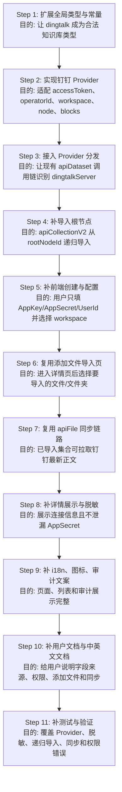

# 需求设计文档

## 0. 文档标识

- 任务前缀：`dingtalk-dataset`
- 文档文件名：`dingtalk-dataset-需求设计文档.md`
- 需求类型：新增第三方知识库接入
- 当前状态：方案设计完成，等待进入代码实现

## 1. 需求背景与目标

### 1.1 背景

- 问题现状：当前 FastGPT 已支持自定义 API 文件库、飞书知识库、语雀知识库等第三方知识库接入，但缺少钉钉文档知识库/知识空间、钉盘文件夹的接入形式。
- 触发场景：企业已有在线文档沉淀在钉钉文档知识库、知识空间或钉盘文件夹，希望通过 FastGPT 直接读取在线文档文本构建知识库，不把原文档二次存储为独立文件。
- 官方参考：
  - 钉钉开放平台基础概念：https://open.dingtalk.com/document/development/development-basic-concepts
  - 企业内部应用 accessToken：https://open.dingtalk.com/document/development/obtain-the-access-token-of-an-internal-app
  - 获取知识库列表：https://dingtalk.apifox.cn/api-141794382
  - 获取节点列表：https://dingtalk.apifox.cn/api-141798046

### 1.2 目标

- 业务目标：新增“钉钉知识库”作为第三方知识库入口，用户填写 `appKey/appSecret/userId` 后，系统自动换取 `operatorId` 并拉取当前用户可访问的钉钉知识库列表；用户选择知识库后保存数据源配置，再进入知识库详情页点击“添加文件”，从文件树中选择要导入/同步的在线文档或文件夹。
- 技术目标：复用现有 `apiDatasetServer`、`APIFileItemSchema`、`apiFile` 集合类型、第三方知识库导入和同步链路，新增钉钉 Provider，不新增独立数据表和独立导入链路。
- 成功指标：
  - 用户可以创建 `DatasetTypeEnum.dingtalk` 类型知识库。
  - 用户可以配置企业内部应用 `appKey/appSecret` 和操作人 `userId`。
  - 系统可以通过 `userId` 获取 `operatorId/unionId`，并列出当前用户可访问的 `workspace`。
  - 配置保存后，详情页可以通过现有“添加文件”入口进入 API 文件导入页。
  - 导入页可以展示钉钉根节点下的文件夹和在线文档。
  - 选择在线文档或文件夹后可以创建 `apiFile` 集合并完成训练。
  - 已导入的 `apiFile` 集合可以通过现有同步按钮重新拉取钉钉在线文档文本。
  - `appSecret` 不在详情接口、前端展示和日志中明文暴露。

### 1.3 项目画像

- 仓库入口：根目录存在 `package.json`、`pnpm-workspace.yaml`，项目是 pnpm workspace + Turbo monorepo。
- 应用分层：`projects/app` 是 Next.js 主应用，API 路由位于 `projects/app/src/pages/api`。
- 公共包分层：`packages/global` 放类型、常量、OpenAPI schema；`packages/service` 放后端服务、Mongo schema、Provider、日志；`packages/web` 放前端通用组件、图标和 i18n。
- 文档位置：当前文档站实际路径是 `document/content/introduction/guide/knowledge_base`，不是 skill 示例里的 `document/content/docs`。
- 测试位置：`packages/*` 对应 `test/cases/*`；`projects/app/src/*` 对应 `projects/app/test/*`。

## 2. 当前项目事实基线

| 能力项 | 现有实现位置 | 现状说明 | 结论 |
|---|---|---|---|
| 知识库类型 | `packages/global/core/dataset/constants.ts` | `DatasetTypeEnum` 已有 `apiDataset`、`feishu`、`yuque`，`ApiDatasetTypeMap` 维护入口图标、文案和文档地址。 | 修改：新增 `dingtalk`。 |
| 第三方配置类型 | `packages/global/core/dataset/apiDataset/type.ts` | `ApiDatasetServerSchema` 已包含 `apiServer`、`feishuServer`、`yuqueServer`。 | 修改：新增 `DingtalkServerSchema` 和 `dingtalkServer`。 |
| 敏感信息脱敏 | `packages/global/core/dataset/apiDataset/utils.ts` | `filterApiDatasetServerPublicData` 会清空 `authorization`、`token`、`appSecret`。 | 修改：清空 `dingtalkServer.appSecret`。 |
| Provider 分发 | `packages/service/core/dataset/apiDataset/index.ts` | `getApiDatasetRequest` 根据配置分发到 custom、yuque、feishu Provider。 | 修改：增加 dingtalk 分支。 |
| Provider 实现参考 | `packages/service/core/dataset/apiDataset/feishuDataset/api.ts`、`packages/service/core/dataset/apiDataset/yuqueDataset/api.ts` | Provider 统一实现 `listFiles`、`getFileContent`、`getFilePreviewUrl`、`getFileDetail`、`getFileRawId`。 | 新增：`dingtalkDataset/api.ts`。 |
| 添加文件入口 | `projects/app/src/pageComponents/dataset/detail/CollectionCard/Header.tsx` | `ApiDatasetTypeMap` 类型会展示“添加文件”按钮，点击后进入 `ImportDataSourceEnum.apiDataset`。 | 复用：钉钉进入 `ApiDatasetTypeMap` 后自然获得入口。 |
| 导入 API 文件 | `projects/app/src/pageComponents/dataset/detail/Import/diffSource/APIDataset.tsx`、`projects/app/src/pages/api/core/dataset/collection/create/apiCollectionV2.ts` | 导入页可勾选文件/文件夹；递归导入 `apiFile`，根节点起点目前取 `apiServer.basePath`、`yuqueServer.basePath`、`feishuServer.folderToken`。 | 修改：新增钉钉根节点起点，并确认配置变更后文件列表刷新。 |
| 同步 API 文件 | `packages/global/core/dataset/collection/utils.ts`、`projects/app/src/pageComponents/dataset/detail/CollectionCard/index.tsx`、`packages/service/core/dataset/collection/utils.ts`、`packages/service/core/dataset/read.ts` | `collectionCanSync` 已支持 `apiFile`；集合行菜单调用 `postLinkCollectionSync`；服务端通过 `getApiDatasetRequest(...).getFileContent` 拉取原文并按 hash 判断是否重建。 | 复用：钉钉 Provider 必须实现稳定的 `getFileContent`。 |
| API 合约 | `packages/global/openapi/core/dataset/api.ts`、`packages/global/openapi/core/dataset/apiDataset/api.ts` | 创建/更新知识库、列文件、列目录、查路径均复用 `ApiDatasetServerSchema`。 | 修改描述和 schema 即可，不新增路由。 |
| 前端创建入口 | `projects/app/src/pages/dataset/list/index.tsx`、`projects/app/src/pageComponents/dataset/list/CreateModal.tsx` | 第三方知识库菜单已有自定义 API、飞书、语雀。 | 修改：新增钉钉菜单项和创建类型。 |
| 前端配置表单 | `projects/app/src/pageComponents/dataset/ApiDatasetForm.tsx` | 根据知识库类型渲染不同配置字段。 | 修改：新增钉钉配置字段。 |
| 详情页配置展示 | `projects/app/src/pageComponents/dataset/detail/Info/index.tsx` | 已展示 API、语雀、飞书配置并支持编辑。 | 修改：新增钉钉配置展示与编辑入口。 |
| i18n | `packages/web/i18n/zh-CN/dataset.json`、`packages/web/i18n/en/dataset.json`、`packages/web/i18n/zh-Hant/dataset.json` | 已有 `feishu_dataset`、`yuque_dataset`。 | 修改：新增钉钉相关 key。 |
| 审计文案 | `packages/service/support/user/audit/util.ts`、`packages/web/i18n/*/account_team.json` | 审计日志类型文案已覆盖现有知识库类型。 | 修改：新增钉钉类型文案。 |
| 文档 | `document/content/introduction/guide/knowledge_base/*.mdx`、`meta.json`、`meta.en.json` | 已有 API 文件库、飞书、语雀、第三方知识库扩展文档。 | 新增：钉钉中英文文档并同步导航。 |
| 日志分类 | `packages/service/common/logger/categories.ts` | 已有 `LogCategories.MODULE.DATASET.API_DATASET`。 | 复用，不新增 category。 |
| 数据库 Schema | `packages/service/core/dataset/schema.ts` | `apiDatasetServer` 使用 Object 存储，`type` enum 来自 `DatasetTypeMap`。 | 弱修改：无需新字段/迁移，新增 enum 值会进入合法类型。 |

## 3. 需求澄清记录

| 维度 | 已确认内容 | 待确认内容 | 备注 |
|---|---|---|---|
| 业务目标 | 接入钉钉文档知识库/知识空间、钉盘文件夹。 | 无。 | 不接钉钉 AI 助理知识库。 |
| 范围边界 | 首版只支持在线文档文本。 | 钉钉具体“列目录/读正文/预览”接口参数需在 API Explorer 最终确认。 | 二进制文件不做。 |
| 权限模型 | 用户填写企业内部应用 `appKey/appSecret` 和操作人 `userId`；后端用 `userId` 换取 `operatorId/unionId`。 | 无。 | 不让用户手填 unionId，降低接入成本。 |
| 数据模型 | 在 `apiDatasetServer` 下新增 `dingtalkServer`，保存 `appKey/appSecret/userId/operatorId/workspaceId/rootNodeId`。 | 无。 | 不新增表。 |
| API 行为 | 复用现有创建、更新、列目录、导入、同步 API。 | 无新增 FastGPT API 路由。 | 只扩展类型和 Provider。 |
| 前端交互 | 第一步用户填写 `appKey/appSecret/userId`，第二步系统拉取知识库列表，用户选择 `workspace` 并保存；第三步进入知识库详情页点击“添加文件”，在导入页选择在线文档或文件夹；第四步导入后的 `apiFile` 集合可在列表中点击“同步”。 | 无。 | 对齐飞书/现有第三方知识库流程，不让用户手填 `workspaceId/rootNodeId`，由系统自动保存。 |
| Bug 修复分析 | Not Applicable。 | 无。 | 新功能。 |
| 文档更新 | 需要补钉钉知识库文档。 | 无。 | 中英文都补。 |
| 文档 i18n | 中文文档与英文文档、中文导航与英文导航同步。 | 无。 | 钉钉英文使用 `DingTalk`。 |

## 3.1 影响域判定

| 维度 | 是否命中 | 证据 | 核对规范 | 结论 |
|---|---|---|---|---|
| API | Yes | `CreateDatasetBodySchema`、`UpdateDatasetBodySchema`、`GetApiDataset*Schema` 都引用 `ApiDatasetServerSchema`。 | `references/style/api.md` | 不新增路由，扩展 schema、请求示例和错误分支。 |
| DB | Yes | `packages/service/core/dataset/schema.ts` 存储 `apiDatasetServer: Object`，`type` enum 来自 `DatasetTypeMap`。 | `references/style/db.md` | 不新增字段和索引，无迁移；注意 enum 兼容。 |
| Front | Yes | 创建菜单、配置表单、详情编辑、i18n 均需显示钉钉。 | `references/style/front.md` | 使用现有 React + Chakra + i18n 模式。 |
| Logger | Yes | 钉钉 Provider 需要记录外部接口失败上下文。 | `references/style/logger.md` | 复用 `DATASET.API_DATASET`，禁止输出密钥。 |
| Package | Yes | 变更跨 `packages/global`、`packages/service`、`packages/web`、`projects/app`。 | `references/style/package.md` | 遵循 monorepo 依赖方向。 |
| BugFix | No | 不是修复存量缺陷。 | Not Applicable | 不写 Bug 修复章节。 |
| DocUpdate | Yes | 新增用户可见的知识库类型和配置流程。 | `references/doc-update-reminder.md` | 必须补产品文档。 |
| DocI18n | Yes | 文档要求中英文同步。 | `references/doc-i18n-standards.md` | 新增 `.mdx` 与 `.en.mdx`，同步 `meta`。 |

### 3.2 命中规范核对结果

规范源位于 skill 目录：`/Users/xxyyh/.codex/skills/fastgpt-requirement-design/references`。当前仓库根目录没有 `references/`，所以本文档中的 `references/*` 均指该 skill 的 reference 文件。

| 维度 | 必须检查项 | 本方案落点 | 核对结论 |
|---|---|---|---|
| API | 路由位置、方法、鉴权、OpenAPI 合约、错误处理 | `6.1 API 设计`、`packages/global/openapi/core/dataset/api.ts`、`projects/app/src/pages/api/core/dataset/*` | 命中。只扩展 schema 和 Provider，路由复用现有鉴权。 |
| DB | Schema/字段、索引、迁移、兼容策略 | `6.2 数据设计`、`packages/service/core/dataset/schema.ts` | 命中。使用 `apiDatasetServer` Object，无新增表和索引。 |
| Front | React + TS、状态、i18n、加载/空态/错误/成功 | `6.4 前端设计`、`ApiDatasetForm.tsx`、`APIDataset.tsx` | 命中。新增配置字段，导入页复用现有状态。 |
| Logger | category、结构化字段、敏感信息脱敏 | `6.6 日志与观测设计`、`LogCategories.MODULE.DATASET.API_DATASET` | 命中。不记录 appSecret、accessToken、正文。 |
| Package | monorepo 依赖方向、导入路径、类型导出 | `6.5 Package 与依赖设计`、`packages/global`/`service`/`web`/`projects/app` | 命中。维持 global -> service/web -> app 的依赖方向。 |
| DocUpdate | 文档路径、更新内容、负责人、状态 | `6.8 文档更新提醒` | 命中。产品文档、英文文档、导航文件均列出。 |
| DocI18n | 中文/英文映射、导航同步、术语本地化、缺失英文文件 | `6.7 文档 i18n 设计` | 命中。DingTalk、Knowledge Base 等术语明确。 |
| TechFlow | Mermaid 流程图、步骤映射表 | `6.10 技术实现流程图` | 命中。包含目标文件、目的、输入/输出、上下游衔接。 |

### 3.3 完备性确认

| 门槛 | 判定 | 证据 |
|---|---|---|
| 问题定义和目标可量化 | 通过 | 成功指标覆盖创建、配置、列 workspace、添加文件导入、同步、脱敏。 |
| 改动对象可枚举 | 通过 | 影响域覆盖 API、DB、Front、Logger、Package、DocUpdate、DocI18n。 |
| 验收标准明确 | 通过 | `8. 验收标准` 按创建、列目录、导入、同步、类型限制、i18n、文档、日志列出。 |
| 回滚触发条件明确 | 通过 | `7.3 回滚策略` 与功能开发文档发布回滚章节已定义。 |
| 待确认项不阻塞设计 | 通过 | 仅剩钉钉 API Explorer 最终字段核对，已要求实现前确认。 |

## 4. 范围定义

### 4.1 In Scope

- 新增 `DatasetTypeEnum.dingtalk` 和对应 `ApiDatasetTypeMap`。
- 新增 `apiDatasetServer.dingtalkServer` 配置：
  - `appKey`：string，必填。
  - `appSecret`：string，保存时必填，详情返回时脱敏。
  - `userId`：string，必填，企业通讯录里的成员 ID，由用户填写。
  - `operatorId`：string，必填，后端通过成员详情接口由 `userId` 换取，作为钉钉知识库 API 的操作人。
  - `workspaceId`：string，用户选择知识库后保存。
  - `rootNodeId`：string，用户选择知识库后保存，作为 FastGPT 列文件树的起点。
- 新增钉钉 Provider，映射为统一 `APIFileItemSchema`。
- 支持列目录、列文件、读取在线文档文本、获取预览地址、获取节点详情。
- 创建知识库、编辑配置、通过详情页“添加文件”导入文件、同步 `apiFile` 集合。
- 配置保存不自动导入全库；真正进入训练的是用户在导入页明确选择的文件或文件夹。
- 新增前端入口、配置表单、详情页展示、i18n、图标。
- 新增钉钉知识库中英文使用文档并同步导航。

### 4.2 Out of Scope

- 不接入钉钉 AI 助理的“助理学习知识/获取学习知识列表”接口。
- 不支持第三方应用授权、服务商授权、免登授权。
- 不支持上传或解析钉盘二进制文件，例如 pdf、docx、xlsx。
- 不让用户手填 `unionId/workspaceId/rootNodeId`，这些值由后端接口自动查询或由用户在列表中点选。
- 不新增独立集合类型，不新增独立数据表，不改变训练主流程。
- 不做钉钉文档权限管理，只读取用户已授权应用可访问的内容。

## 5. 方案对比

| 方案 | 核心思路 | 优点 | 风险 | 性能影响 | 兼容性 | 维护复杂度 | 实施成本 | 结论 |
|---|---|---|---|---|---|---|---|---|
| 方案 A：新增内置钉钉 Provider | 在现有第三方知识库抽象下新增 `dingtalkServer` 和 `dingtalkDataset/api.ts`，用户只填 `appKey/appSecret/userId`，后端自动列出 workspace。 | 用户体验好，复用导入/同步链路，改动边界清晰。 | 需要处理钉钉权限缺失时的清晰提示。 | 与飞书/语雀一致，主要消耗在外部 API 和文档读取。 | 对存量知识库无迁移影响，只新增类型。 | 中，Provider 内聚维护。 | 中 | 推荐。 |
| 方案 B：用自定义 API 文件库代理钉钉 | 由部署方写一个代理服务，把钉钉转成 FastGPT 标准 `/v1/file/*`。 | FastGPT 基本不改代码。 | 不是内置钉钉接入，用户配置成本高，产品感弱。 | 取决于外部代理，FastGPT 侧不可控。 | 对 FastGPT 兼容好，但对用户部署环境要求高。 | 高，代理服务和 FastGPT 两头排查。 | 低 | 不推荐作为产品方案。 |
| 方案 C：接钉钉 AI 助理知识管理 API | 调用“助理学习知识”等接口。 | 表面上名字像知识库。 | 方向错误，是给钉钉助理喂知识，不是 FastGPT 拉文档。 | 无法满足 FastGPT 拉取文档文本的目标。 | 与现有 `apiFile` 抽象不匹配。 | 高，后续会接错模型。 | 中 | 明确放弃。 |

推荐方案：方案 A。

选型原则：同等可行时优先最小改动、少新增代码、少新增依赖。现有 API 文件库抽象已经覆盖导入与同步主流程，不需要新增独立导入链路。

## 6. 推荐方案详细设计

### 6.1 API 设计

| 路由 | 方法 | 鉴权 | 请求 | 响应 | 错误分支 | 相关文件 |
|---|---|---|---|---|---|---|
| `/api/core/dataset/create` | POST | 现有创建知识库鉴权 | `type=dingtalk`、`apiDatasetServer.dingtalkServer` | 新知识库 ID | schema 校验失败、权限失败、模型配置失败 | `projects/app/src/pages/api/core/dataset/create.ts`、`packages/global/openapi/core/dataset/api.ts` |
| `/api/core/dataset/update` | PUT | 现有知识库管理权限 | `apiDatasetServer.dingtalkServer` | 更新结果 | schema 校验失败、无权限、敏感字段空值处理错误 | `projects/app/src/pages/api/core/dataset/update.ts` |
| `/api/core/dataset/apiDataset/getCatalog` | POST | 登录态/配置试连 | `apiDatasetServer.dingtalkServer`、`parentId` | 目录节点列表 | 钉钉鉴权失败、目录不存在、无权限 | `projects/app/src/pages/api/core/dataset/apiDataset/getCatalog.ts` |
| `/api/core/dataset/apiDataset/list` | POST | 知识库读权限 | `datasetId`、`parentId` | 文件和文件夹列表 | 知识库不存在、钉钉接口失败 | `projects/app/src/pages/api/core/dataset/apiDataset/list.ts` |
| `/api/core/dataset/apiDataset/getPathNames` | POST | 登录态或知识库读取配置 | `datasetId` 或 `apiDatasetServer`、`parentId` | 路径字符串 | 节点详情接口失败 | `projects/app/src/pages/api/core/dataset/apiDataset/getPathNames.ts` |
| `/api/core/dataset/collection/create/apiCollectionV2` | POST | 知识库写权限 | `datasetId`、`apiFiles` | 创建集合结果 | 根节点缺失、递归拉取失败、训练限制超额 | `projects/app/src/pages/api/core/dataset/collection/create/apiCollectionV2.ts` |
| `/api/core/dataset/collection/sync` | POST | 知识库写权限 | `collectionId` | 同步结果 | 集合不存在、非 `apiFile`、正文读取失败、训练失败 | `projects/app/src/pages/api/core/dataset/collection/sync.ts` |

请求示例：

```json
{
  "type": "dingtalk",
  "name": "钉钉产品知识库",
  "intro": "从钉钉在线文档同步产品资料",
  "avatar": "core/dataset/dingtalkDatasetColor",
  "apiDatasetServer": {
    "dingtalkServer": {
      "appKey": "dingxxxx",
      "appSecret": "******",
      "userId": "300112376621597279",
      "operatorId": "WYdSICEVT95nyee1HTr69wiEiE",
      "workspaceId": "nV06pSYbo6XBEbaB",
      "rootNodeId": "NkDwLng8ZLGMOea0Tx1KeXLyVKMEvZBY"
    }
  }
}
```

响应示例复用现有创建知识库响应：

```json
"68ad85a7463006c963799a05"
```

对应规范：API 路由沿用 Next.js API Routes，业务逻辑放在 `packages/service`，错误通过现有 `NextAPI`/`APIError` 链路处理。

钉钉服务端接口链路：

| 目的 | 钉钉接口 | 入参来源 | 输出 | 需要权限 |
|---|---|---|---|---|
| 获取应用 token | `POST /v1.0/oauth2/accessToken` | `appKey/appSecret` | `accessToken` | 应用基础凭证可用即可。 |
| 查询操作人 | `POST /topapi/v2/user/get` | `accessToken/userId` | `unionId`，作为 `operatorId` | `qyapi_get_member` |
| 获取知识库列表 | `GET /v2.0/wiki/workspaces` | `accessToken/operatorId` | `workspaceId/rootNodeId/name` | `Wiki.Workspace.Read` |
| 获取文件树 | `GET /v2.0/wiki/nodes` | `accessToken/operatorId/parentNodeId` | 钉钉节点列表 | `Wiki.Node.Read` |
| 读取在线文档正文 | `GET /v1.0/doc/suites/documents/{nodeId}/blocks` | `accessToken/operatorId/nodeId` | 文档 blocks | `Storage.File.Read` |

限流与缓存结论：

- `accessToken` 缓存是必须做，不是优化项。缓存 key 按应用维度区分，TTL 使用钉钉返回的有效期并提前刷新；鉴权失败、权限失败、网络失败不缓存错误结果。
- 缓存实现直接使用项目已有 `@fastgpt/service/common/redis/cache`，通过 `getRedisCache/setRedisCache/delRedisCache` 写 Redis；key 使用 `dataset:dingtalk:accessToken:${appKey}:${hash(appSecret)}`，不新增缓存依赖，不把 token 存入数据库。
- 文件列表接口 `GET /v2.0/wiki/nodes` 是递归导入的高频接口，必须限制并发，并对明确限流错误做短暂退避重试。
- 真实限流压测需要测试应用凭证以环境变量方式提供，避免把 `appSecret` 写入脚本或日志；当前文档先把“压测并补充错误码”列为开发前验证项。

### 6.2 数据设计

| 实体/集合 | 字段 | 类型 | 必填 | 默认值 | 索引/约束 | 兼容策略 |
|---|---|---|---|---|---|---|
| `dataset.type` | `dingtalk` | enum value | 是 | 无 | 由 `DatasetTypeMap` 驱动 Mongo enum | 存量数据不变。 |
| `dataset.apiDatasetServer.dingtalkServer.appKey` | `appKey` | string | 是 | 无 | 无新增索引 | 新增配置，不影响旧知识库。 |
| `dataset.apiDatasetServer.dingtalkServer.appSecret` | `appSecret` | string | 保存时是，详情返回时脱敏 | 无 | 禁止前端明文展示 | 更新时如果传空字符串，沿用现有 update 逻辑保留旧密钥。 |
| `dataset.apiDatasetServer.dingtalkServer.userId` | `userId` | string | 是 | 无 | 无新增索引 | 用户填写，便于后续重新换取 operatorId。 |
| `dataset.apiDatasetServer.dingtalkServer.operatorId` | `operatorId` | string | 是 | 无 | 无新增索引 | 由后端通过 `userId` 换取，不要求用户手填。 |
| `dataset.apiDatasetServer.dingtalkServer.workspaceId` | `workspaceId` | string | 是 | 无 | 无新增索引 | 用户选择知识库后保存。 |
| `dataset.apiDatasetServer.dingtalkServer.rootNodeId` | `rootNodeId` | string | 是 | 无 | 无新增索引 | FastGPT 列文件树的入口。 |
| `dataset_collections.apiFileId` | 钉钉节点 ID | string | 文件集合是 | 无 | 无新增索引 | 复用现有 apiFile 存储。 |

不需要 Mongo 迁移，因为 `apiDatasetServer` 当前是 Object；不需要新增索引，因为查询仍按 `datasetId/teamId` 和集合主键走现有逻辑。

对应规范：DB 只扩展已有 Object 配置，不新增高基数字段索引，不引入迁移风险。

### 6.3 核心代码设计

| 模块 | 关键函数/类型 | 变更说明 | 上下游影响 |
|---|---|---|---|
| Global 类型 | `DingtalkServerSchema`、`ApiDatasetServerSchema` | 新增钉钉配置 schema。 | OpenAPI、前端表单、服务端 Provider 共享。 |
| Global 常量 | `DatasetTypeEnum`、`ApiDatasetTypeMap`、`DatasetTypeMap` | 新增钉钉知识库类型、图标、文档链接。 | 创建入口、列表展示、Mongo enum。 |
| 脱敏工具 | `filterApiDatasetServerPublicData` | 清空 `dingtalkServer.appSecret`。 | 详情页不会泄漏密钥。 |
| Provider | `useDingtalkDatasetRequest` | 新增 token 获取、Redis token 缓存、目录列表、正文读取、预览、详情、ID 规范化。 | 所有 apiDataset 路由自动复用。 |
| 分发入口 | `getApiDatasetRequest` | 增加 `dingtalkServer` 分支。 | 导入、同步、预览统一生效。 |
| 导入递归 | `createApiDatasetCollection` | `startId` 增加钉钉根节点。 | 支持选择根目录递归导入。 |
| 添加文件导入 | `APIDataset`、`CollectionCard/Header` | 不新增钉钉专属导入页；复用现有 API 文件导入页选择文件/文件夹。 | 用户体验与飞书一致。 |
| 同步集合 | `collectionCanSync`、`postLinkCollectionSync`、`syncCollection`、`readApiServerFileContent` | 不改同步主流程，依赖 Provider 返回最新 `rawText`。 | 导入后的钉钉 `apiFile` 集合同步链路复用。 |

钉钉 Provider 的统一返回策略：

- `listFiles`：未选择 `workspace` 时列出当前用户可访问的知识库列表；已选择 `workspace` 后把钉钉节点映射为 `APIFileItemType`。
- `type`：文件夹为 `folder`，在线文档为 `file`。
- `id`：workspace 列表阶段使用 `workspaceId`，文件树阶段使用钉钉 `nodeId`，保持稳定可反查。
- `rawId`：保存钉钉原始节点 ID。
- `parentId`：根节点下一级使用根节点 ID，子级使用上级节点 ID。
- `getFileContent`：只返回在线文档文本，非在线文档直接抛出“不支持的文件类型”；同步功能也会调用该方法拉取最新正文并比较 hash。
- `getFilePreviewUrl`：返回钉钉文档可访问 URL；若官方接口不提供预览 URL，则按官方文档链接规则拼接或返回空并让前端降级。

### 6.4 前端设计

| 页面/组件 | 入口文件 | 交互状态 | i18n key | 变更说明 |
|---|---|---|---|---|
| 创建知识库菜单 | `projects/app/src/pages/dataset/list/index.tsx` | 成功：展示钉钉入口；隐藏：受 `show_dataset_dingtalk` 控制。 | `dataset:dingtalk_dataset`、`dataset:dingtalk_dataset_desc` | 第三方知识库菜单新增钉钉。 |
| 创建 Modal 类型 | `projects/app/src/pageComponents/dataset/list/CreateModal.tsx` | 成功：可创建 `dingtalk` 类型。 | 复用类型文案 | `CreateDatasetType` 加 `DatasetTypeEnum.dingtalk`。 |
| 配置表单 | `projects/app/src/pageComponents/dataset/ApiDatasetForm.tsx` | 加载：获取知识库列表；错误：权限/必填校验；成功：保存配置。 | `dataset:dingtalk_app_key` 等 | 第一步渲染 appKey、appSecret、userId；第二步展示 workspace 列表供用户选择。 |
| 详情配置 | `projects/app/src/pageComponents/dataset/detail/Info/index.tsx` | 成功：展示 userId、workspace 名称或 workspaceId，密钥不展示；编辑：打开现有编辑弹窗。 | `dataset:dingtalk_dataset_config` | 类似飞书/语雀配置展示。 |
| 添加文件入口 | `projects/app/src/pageComponents/dataset/detail/CollectionCard/Header.tsx` | 点击“添加文件”进入 `currentTab=import&source=apiDataset`。 | 复用现有按钮文案 | 钉钉类型进入 `ApiDatasetTypeMap` 后自动展示入口。 |
| 导入页 | `projects/app/src/pageComponents/dataset/detail/Import/diffSource/APIDataset.tsx` | 加载、空态、错误、成功复用现有逻辑；用户勾选在线文档或文件夹后进入训练。 | 复用 `apiFile` 文案 | 不新增导入组件；建议刷新依赖覆盖 `apiDatasetServer`，避免编辑钉钉配置后列表仍用旧缓存。 |
| 同步入口 | `projects/app/src/pageComponents/dataset/detail/CollectionCard/index.tsx` | 导入后的 `apiFile` 集合在更多菜单展示同步；点击后调用 `postLinkCollectionSync`。 | `dataset:collection_sync` | 复用已有同步 UI，不新增钉钉按钮。 |

对应规范：所有用户可见文本接入 i18n；使用现有 Chakra UI 表单模式，不新增前端状态库。

### 6.5 Package 与依赖设计

| 包/模块 | 依赖方向 | 改动原则 | 相关文件 |
|---|---|---|---|
| `packages/global` | 不依赖 `service/web/app` | 只新增类型、常量、OpenAPI schema，不引入运行时请求逻辑。 | `packages/global/core/dataset/constants.ts`、`packages/global/core/dataset/apiDataset/type.ts`、`packages/global/openapi/core/dataset/*` |
| `packages/service` | 可依赖 `packages/global` | 钉钉 Provider、日志、Mongo 相关逻辑放这里；不反向依赖 `projects/app`。 | `packages/service/core/dataset/apiDataset/dingtalkDataset/api.ts`、`packages/service/core/dataset/apiDataset/index.ts` |
| `packages/web` | 可依赖 `packages/global` | 仅补 i18n、图标注册、通用展示资源。 | `packages/web/i18n/*/dataset.json`、`packages/web/components/common/Icon/constants.ts` |
| `projects/app` | 可依赖所有 packages | 页面入口、表单、API 路由、导入/同步 UI 都在 app 层组合。 | `projects/app/src/pageComponents/dataset/*`、`projects/app/src/pages/api/core/dataset/*` |

对应规范：遵循 `references/style/package.md`，跨包导入使用 `@fastgpt/global`、`@fastgpt/service`、`@fastgpt/web` 别名，不使用跨包相对路径。

### 6.6 日志与观测设计

| 场景 | 日志级别 | category | 结构化字段 | 脱敏策略 |
|---|---|---|---|---|
| 获取 accessToken 失败 | `warn` | `LogCategories.MODULE.DATASET.API_DATASET` | `provider=dingtalk`、`userId`、`workspaceId`、`error` | 不记录 `appSecret`、accessToken。 |
| 目录接口触发限流 | `warn` | 同上 | `provider`、`workspaceId`、`parentId`、`retryCount`、`error` | 不记录 token、密钥和完整响应体。 |
| 列目录失败 | `warn` | 同上 | `provider`、`workspaceId`、`parentId`、`error` | 不记录密钥和完整响应体。 |
| 读取正文失败 | `error` | 同上 | `provider`、`datasetId`、`apiFileId`、`error` | 不记录文档正文。 |
| 不支持的文件类型 | `warn` | 同上 | `provider`、`apiFileId`、`fileType` | 不记录敏感信息。 |

对应规范：统一 `getLogger(LogCategories.MODULE.DATASET.API_DATASET)`，不用 `console.log`，敏感信息禁止入日志。

### 6.7 文档 i18n 设计

| 中文文件 | 英文文件 | 类型 | 处理动作 | 翻译注意项 |
|---|---|---|---|---|
| `document/content/introduction/guide/knowledge_base/dingtalk_dataset.mdx` | `document/content/introduction/guide/knowledge_base/dingtalk_dataset.en.mdx` | 内容 | 新增 | 钉钉翻译为 `DingTalk`，知识库翻译为 `Knowledge Base`。 |
| `document/content/introduction/guide/knowledge_base/meta.json` | `document/content/introduction/guide/knowledge_base/meta.en.json` | 导航 | 更新 | `pages` 同步插入 `dingtalk_dataset`，仅翻译 title/description。 |
| `document/content/introduction/guide/knowledge_base/third_dataset.mdx` | `document/content/introduction/guide/knowledge_base/third_dataset.en.mdx` | 内容 | 可选更新 | 现有扩展文档路径有旧路径描述，可顺手校正。 |

缺失英文文件清单：新增 `dingtalk_dataset.mdx` 后必须同步新增 `dingtalk_dataset.en.mdx`。

### 6.8 文档更新提醒

| 文档路径 | 文档类型 | 更新原因 | 计划更新内容 | 负责人 | 截止时间 | 状态 |
|---|---|---|---|---|---|---|
| `document/content/introduction/guide/knowledge_base/dingtalk_dataset.mdx` | 产品/使用文档 | 新增钉钉知识库入口 | 前置条件、权限配置、字段说明、导入流程、限制说明；内容可参考 `.claude/design/dingtalk-dataset-用户接入指南.md` | 开发执行者 | 功能合并前 | 待更新 |
| `document/content/introduction/guide/knowledge_base/dingtalk_dataset.en.mdx` | 产品/英文文档 | 文档 i18n | 英文同步版本 | 开发执行者 | 功能合并前 | 待更新 |
| `document/content/introduction/guide/knowledge_base/meta.json` | 导航 | 新增页面 | 插入 `dingtalk_dataset` | 开发执行者 | 功能合并前 | 待更新 |
| `document/content/introduction/guide/knowledge_base/meta.en.json` | 英文导航 | 新增英文页面 | 插入 `dingtalk_dataset` | 开发执行者 | 功能合并前 | 待更新 |

### 6.9 Bug 修复分析

Not Applicable：本需求不是 Bug 修复。

### 6.10 技术实现流程图



步骤映射表：

| 步骤 | 目标文件或模块 | 变更目的 | 输入 | 输出 | 前置依赖 | 后续衔接 |
|---|---|---|---|---|---|---|
| Step 1 | `packages/global/core/dataset/constants.ts`、`packages/global/core/dataset/apiDataset/type.ts`、`packages/global/openapi/core/dataset/api.ts` | 增加 `dingtalk` 类型和 `dingtalkServer` 配置 schema。 | 钉钉字段设计：`appKey/appSecret/userId/operatorId/workspaceId/rootNodeId`。 | 全局类型、OpenAPI schema、DatasetTypeMap 可识别钉钉。 | 当前 DatasetTypeEnum 和 ApiDatasetServerSchema。 | Service Provider 和前端表单可以引用统一类型。 |
| Step 2 | `packages/service/core/dataset/apiDataset/dingtalkDataset/api.ts` | 封装钉钉接口调用与 `APIFileItemType` 映射。 | `dingtalkServer`、钉钉 accessToken、operatorId、workspace/node 数据。 | `listFiles/getFileContent/getFilePreviewUrl/getFileDetail/getFileRawId`。 | Step 1 的类型定义。 | Step 3 通过统一分发入口调用。 |
| Step 3 | `packages/service/core/dataset/apiDataset/index.ts` | 将 `dingtalkServer` 接入现有 Provider 分发。 | `ApiDatasetServerType.dingtalkServer`。 | `getApiDatasetRequest` 返回钉钉 Provider。 | Step 2 Provider 实现。 | API 路由、导入、同步、预览复用现有调用链。 |
| Step 4 | `projects/app/src/pages/api/core/dataset/collection/create/apiCollectionV2.ts` | 递归导入时以 `rootNodeId` 作为钉钉根节点。 | `dataset.apiDatasetServer.dingtalkServer.rootNodeId`。 | `apiFile` 集合创建和训练参数。 | Step 3 可列节点。 | 训练与同步进入现有 `apiFile` 流程。 |
| Step 5 | `projects/app/src/pages/dataset/list/index.tsx`、`projects/app/src/pageComponents/dataset/list/CreateModal.tsx`、`projects/app/src/pageComponents/dataset/ApiDatasetForm.tsx` | 新增创建入口、配置表单和 workspace 选择流程。 | 用户填写 `appKey/appSecret/userId`。 | 保存 `operatorId/workspaceId/rootNodeId/workspaceName`。 | Step 1 OpenAPI 类型，Step 2/3 可试连。 | Step 6 添加文件导入，Step 8 展示配置。 |
| Step 6 | `projects/app/src/pageComponents/dataset/detail/CollectionCard/Header.tsx`、`projects/app/src/pageComponents/dataset/detail/Import/diffSource/APIDataset.tsx` | 复用详情页“添加文件”与 API 文件导入页，让用户选择文件/文件夹。 | 已保存 `dingtalkServer.rootNodeId`、用户选择的 `apiFiles`。 | `apiFile` collection 创建请求。 | Step 5 保存配置，Step 4 支持根节点。 | 训练链路与现有第三方知识库一致。 |
| Step 7 | `packages/global/core/dataset/collection/utils.ts`、`projects/app/src/pageComponents/dataset/detail/CollectionCard/index.tsx`、`packages/service/core/dataset/collection/utils.ts`、`packages/service/core/dataset/read.ts` | 复用 `apiFile` 同步能力，确认钉钉集合可显示同步菜单并拉取最新正文。 | `collectionId`、`apiFileId`、`dataset.apiDatasetServer.dingtalkServer`。 | `success/sameRaw` 等同步结果。 | Step 2 Provider 的 `getFileContent` 正确返回文本。 | 用户修改钉钉在线文档后可手动同步。 |
| Step 8 | `projects/app/src/pageComponents/dataset/detail/Info/index.tsx`、`packages/global/core/dataset/apiDataset/utils.ts` | 详情页展示钉钉配置并脱敏密钥。 | 已保存的 `dingtalkServer`。 | 前端安全展示、`appSecret` 置空。 | Step 5 保存配置。 | 用户可后续编辑配置，避免密钥泄漏。 |
| Step 9 | `packages/web/i18n/*/dataset.json`、`packages/web/i18n/*/account_team.json`、`packages/web/components/common/Icon/constants.ts` | 补齐页面文案、审计文案和图标。 | 新增钉钉知识库用户可见入口。 | 中/英/繁文案和图标可用。 | Step 5/6/8 页面需要文案。 | 文档与 UI 展示一致。 |
| Step 10 | `.claude/design/dingtalk-dataset-用户接入指南.md`、`document/content/introduction/guide/knowledge_base/dingtalk_dataset.mdx`、`document/content/introduction/guide/knowledge_base/dingtalk_dataset.en.mdx`、`meta.json`、`meta.en.json` | 形成用户可读接入说明并同步文档导航。 | 实测链路和权限清单。 | 用户知道填什么、去哪里拿、开哪些权限、如何添加文件和同步。 | Step 1-9 明确功能行为。 | 发布前文档验收。 |
| Step 11 | `test/cases/service/core/dataset/apiDataset/dingtalkDataset/api.test.ts`、`test/cases/global/core/dataset/apiDataset/utils.test.ts`、`projects/app/test/api/core/dataset/collection/create/apiCollectionV2.test.ts` | 覆盖 Provider、脱敏、递归导入、同步和错误分支。 | Mock 钉钉接口响应、现有导入/同步函数。 | 自动化测试与手工验证结果。 | Step 2-8 实现完成。 | 发布与回滚决策依据。 |

## 7. 风险、迁移与回滚

### 7.1 风险清单

- 钉钉应用权限缺失时接口会返回 requiredScopes，前端需要把缺少的权限直接提示给用户。
- 钉钉知识库主链路已实测使用 `workspaceId/rootNodeId/nodeId`，不要再走偏钉盘存储体系的 `spaceId/dentryId/dentryUuid`。
- 企业内部应用权限不足时，表现会像“配置对了但拉不到文件”，需要错误提示清晰。
- 在线文档文本接口可能只支持特定文档类型，首版必须明确“不支持二进制文件”。
- `appSecret` 更新逻辑要复用现有“空值不覆盖旧密钥”能力，避免用户编辑配置后把密钥冲掉。
- 不缓存 `accessToken` 会导致每次列目录/读正文都打鉴权接口，延迟高且容易触发钉钉频控；必须作为 T2 的必做项。
- 递归导入大文件夹时 `wiki/nodes` 调用会集中爆发，必须限制并发并补充限流错误提示，否则用户会把限流误判成权限配置错误。

### 7.2 迁移策略

- 无需数据迁移。
- 存量知识库类型不变。
- 新增 enum 值后只影响新建钉钉知识库。
- 若加 `show_dataset_dingtalk` 开关，默认建议展示，即 `undefined !== false`，保持与飞书/语雀一致。

### 7.3 回滚策略

- 回滚代码后，已创建的 `dingtalk` 类型知识库在旧版本中可能无法识别。
- 若需要安全回滚，应先下线创建入口，再处理已创建的钉钉知识库或禁止继续导入。
- 因无新增表和迁移，数据库层无需回滚脚本。

## 8. 验收标准

| 验收项 | 验收方式 | 通过标准 |
|---|---|---|
| 创建钉钉知识库 | 前端手工 + API 测试 | `type=dingtalk` 可保存，详情返回不含明文 `appSecret`。 |
| 列出钉钉目录 | mock 钉钉接口 + 手工试连 | 文件夹和在线文档映射为 `APIFileItemType`。 |
| 限流与 token 缓存 | 单测 + 小流量手工压测 | `accessToken` 连续调用命中缓存；目录接口遇到限流可退避或返回可读错误。 |
| 添加文件导入 | 集成测试 + 手工验证 | 在知识库详情页点击“添加文件”，选择在线文档或文件夹后创建 `apiFile` 集合并完成训练。 |
| 同步在线文档 | 单测 + 手工验证 | 导入后的 `apiFile` 集合显示同步入口；文档内容变化后同步结果为 `success`，未变化为 `sameRaw`。 |
| 不支持二进制文件 | 单测 | pdf/docx/xlsx 等返回明确错误，不进入训练。 |
| i18n | 静态检查 + 手工查看 | 中文、英文、繁中前端文案齐全。 |
| 文档 | 文件检查 | 中英文文档和导航同步。 |
| 日志安全 | 代码审查 | 日志和详情接口不泄漏 `appSecret`、accessToken、文档正文。 |

## 9. MECE 核查结论

### 9.1 相互独立检查结果

- Provider 只负责钉钉 API 适配，不处理训练逻辑。
- `apiCollectionV2` 只补根节点来源，不理解钉钉字段细节。
- 前端表单只收集配置，不实现钉钉接口调用细节。
- 日志复用 `DATASET.API_DATASET`，不新增重复 category。

### 9.2 完全穷尽检查结果

- 正常流程：创建配置、保存 workspace、详情页添加文件、选择文件/文件夹导入、读取正文、同步已导入集合。
- 参数非法：缺少 `appKey/appSecret/userId/operatorId/workspaceId/rootNodeId`。
- 无权限：钉钉应用权限不足、文档无访问权限。
- 外部依赖失败：accessToken 获取失败、目录接口失败、正文接口失败。
- 兼容迁移：存量配置不变，无 DB 迁移。
- 前端状态：配置必填错误、导入列表加载、空态、错误态、成功态复用现有导入页。

### 9.3 修订动作与最终边界

`[问题]` 钉钉“知识库”容易和 AI 助理知识管理混淆。  
`影响:` 可能接错 API，导致 FastGPT 无法拉取文档。  
`修订动作:` 明确排除 `api-learnknowledge`、`api-getknowledgelist`。  
`修订后结果:` 只接钉钉文档知识库/知识空间/钉盘文件夹。

`[问题]` 早期方案把钉钉知识库误按钉盘存储字段设计为 `spaceId/dentryId/dentryUuid`。  
`影响:` 接入路径绕远，用户需要填写难找字段，产品体验和排错成本都会变差。  
`修订动作:` 根据实测结果改为 `appKey/appSecret/userId -> operatorId -> workspaceId/rootNodeId -> nodeId`。  
`修订后结果:` 前台只让用户填写 3 个字段，知识库和根节点由系统查询和用户点选。

`[问题]` 用户希望首版只支持在线文档文本。  
`影响:` 如果泛化支持二进制，会引入解析、存储和权限复杂度。  
`修订动作:` 明确二进制文件 Out of Scope。  
`修订后结果:` 首版范围收敛，复用现有 API 文件库文本导入链路。

`[问题]` 原文档缺少 skill 要求的项目画像、完备性确认、命中规范核对和 Package 依赖设计。  
`影响:` 交给开发执行时，规范依据和跨包边界不够清晰，容易把逻辑塞错层。  
`修订动作:` 补充 `1.3 项目画像`、`3.2 命中规范核对结果`、`3.3 完备性确认`、`6.5 Package 与依赖设计`，并扩展方案对比维度。  
`修订后结果:` 两份设计文档符合 `fastgpt-requirement-design` 的关键产物要求。
