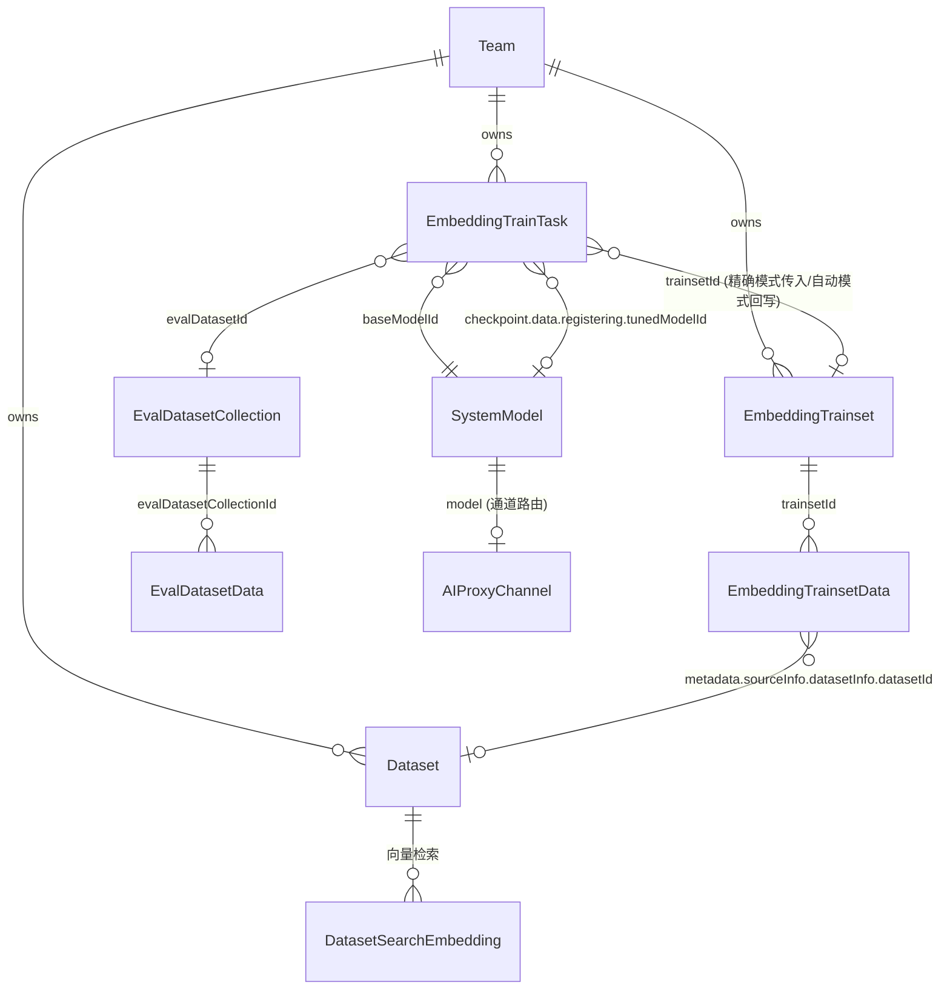
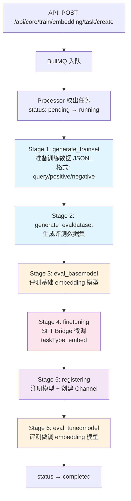
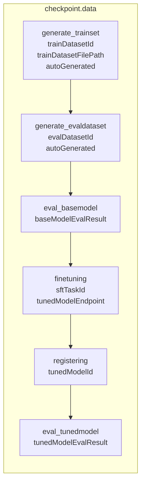
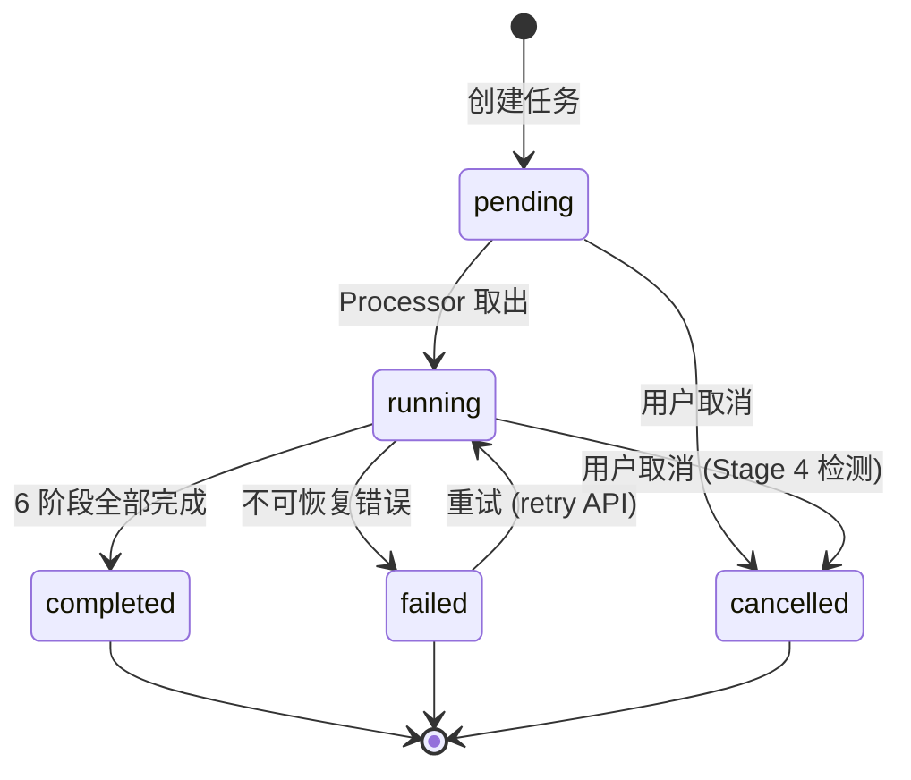
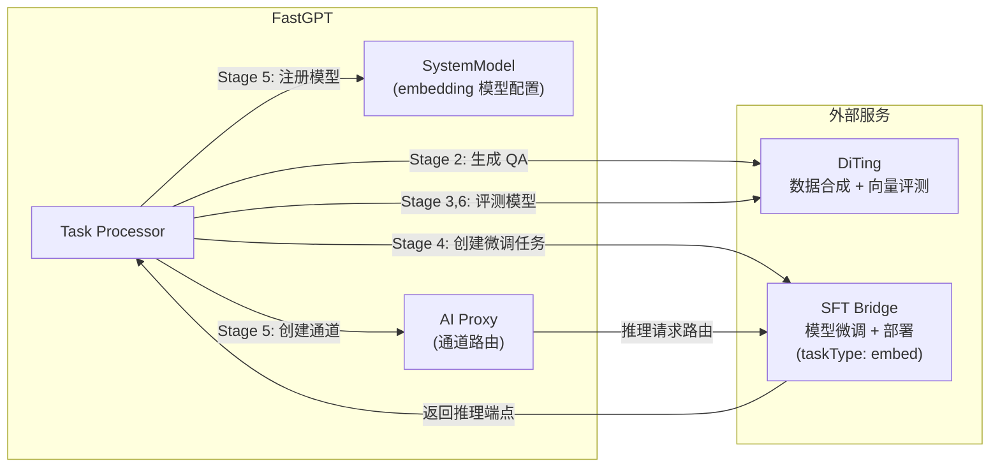

# Embedding 训练平台架构文档

> 本文档梳理 FastGPT Embedding 训练任务的执行流程、数据模型关系和关键设计决策。

## 1. 系统总览

Embedding 训练平台与 Rerank 训练平台共享相同的技术框架（BullMQ + MongoDB），通过 **6 阶段流水线** 实现从数据准备到模型微调、评测的全流程自动化。支持两种模式：

- **精确模式（Exact Mode）**：用户提供训练集 + 评测集，系统跳过生成阶段
- **自动模式（Auto Mode）**：用户提供知识库 IDs，系统自动生成训练集和评测集

## 2. 数据模型关系

### 2.1 ER 关系图



### 2.2 核心模型字段

#### EmbeddingTrainTask（训练任务）

| 字段 | 类型 | 说明 |
|------|------|------|
| `_id` | ObjectId | 任务 ID |
| `teamId` / `tmbId` | ObjectId | 权限归属 |
| `baseModelId` | String | 基础 embedding 模型 ID → SystemModel.model |
| `baseModelEndpoint` | Object | 基础模型端点 {base_url, model, api_key} |
| `trainsetId` | ObjectId? | → EmbeddingTrainset._id |
| `evalDatasetId` | String? | → EvalDatasetCollection._id |
| `datasetIds` | String[]? | 知识库 IDs（仅自动模式） |
| `trainType` | String | `'lora'` \| `'ptuning'`，默认 lora |
| `status` | Enum | pending / running / completed / failed / cancelled |
| `checkpoint` | Object | 阶段进度（见 §3.2） |
| `result` | Object? | 最终结果汇总 |
| `jobId` | String? | BullMQ 任务 ID |

#### EmbeddingTrainset（训练集）

| 字段 | 类型 | 说明 |
|------|------|------|
| `_id` | ObjectId | 训练集 ID |
| `teamId` / `tmbId` | ObjectId | 权限归属 |
| `name` | String | 名称 |
| `description` | String? | 描述 |
| `status` | Enum | pending / generating / ready / error |
| `statistics` | Virtual | 动态计算（dataCount, positiveCount, negativeCount, sourceSummary） |

#### EmbeddingTrainsetData（训练数据）

与 `RerankTrainsetData` 完全相同的 schema（便于代码复用）：

| 字段 | 类型 | 说明 |
|------|------|------|
| `trainsetId` | ObjectId | → EmbeddingTrainset._id |
| `query` | String | 查询文本/锚点文本 |
| `positiveDocs` | String[] | 正例文档（与 query 语义相似） |
| `negativeDocs` | String[] | 负例文档（与 query 语义无关） |
| `source` | Enum | dataset / chat_log / manual |
| `metadata.sourceInfo` | Object | 来源详情（datasetInfo / chatLogInfo / manualInfo） |

**注：** 虽然语义上 `query` 对应 embedding 的"查询文本"（相当于 anchor），但保持与 rerank 相同的字段名称，以便最大化代码复用和数据模型的一致性。

#### SystemModel（模型配置）

| 字段 | 类型 | 说明 |
|------|------|------|
| `model` | String | 模型标识（唯一键） |
| `type` | Enum | `'embedding'` |
| `metadata.isActive` | Boolean | 是否启用 |
| `metadata.isTuned` | Boolean | 是否为训练模块创建的微调模型 |
| `metadata.provider` | String | 模型提供商 |

#### Dataset（知识库）

| 字段 | 类型 | 说明 |
|------|------|------|
| `vectorModel` | String? | 当前使用的 embedding 模型 ID → SystemModel.model |

## 3. 训练任务执行流程

### 3.1 六阶段流水线



### 3.2 检查点（Checkpoint）结构

每个 stage 完成后保存检查点，支持断点续传。任务重启时自动从上次完成的 stage 之后继续执行。



### 3.3 各阶段详情与核心流程

#### Stage 1：generate_trainset（生成训练集）

**流程**（两种模式）：

| 模式 | 流程 |
|------|------|
| **Exact Mode（精确模式）** | 等待用户提供的 trainset 数据生成完毕（status = ready），验证数据不为空后导出 JSONL |
| **Auto Mode（自动模式）** | ① 创建新的 trainset（status = pending）<br/>② 用户可通过 UI 或 API 添加数据（或从知识库生成）<br/>③ 等待数据生成完毕（trainset status = ready）<br/>④ 导出 JSONL 文件 |

**JSONL 格式**（与 rerank 相同）：
```json
{"query": "锚点文本", "positive_docs": ["doc_id1", "doc_id2"], "negative_docs": ["doc_id3"]}
```

**说明：** 
- Rerank 和 Embedding 的 Stage 1 流程**完全相同**
- 两者都不在此阶段调用 `performDatasetSearch`
- **关键差异在 Stage 2**（生成评测数据集时），见下文

---

#### Stage 2：generate_evaldataset（生成评测数据集）

**流程**（两种模式）：

| 模式 | 流程 |
|------|------|
| **Exact Mode（精确模式）** | 用户已提供 evalDatasetId，跳过此阶段 |
| **Auto Mode（自动模式）** | ① 采样知识库数据（MIN_EVAL_QA_COUNT 条）<br/>② 调用 DiTing API 生成评测 QA 对<br/>③ **关键差异：Embedding 直接创建评测数据集，Rerank 需调用 performDatasetSearch**（见下文）<br/>④ 批量插入 EvalDatasetData<br/>⑤ 返回 evalDatasetId |

**关键差异（vs Rerank）：**
- **Rerank**：需调用 `performDatasetSearch` 获取 retrievalContextsFull（排序候选列表）
- **Embedding**：直接创建 EvalDatasetCollection（仅需标记相关文档 ID）
- **原因**：Embedding 评测只需验证相似度，不需要排序上下文

---

#### Stage 3：eval_basemodel（评测基础模型）

调用 DiTing 的 `/api/v1/evaluations/embed` 接口：

**输入参数**：
- evaluation dataset：评测数据集（query + expected_dataIds）
- embedding model：基础 embedding 模型配置

**输出指标**：
- MRR（Mean Reciprocal Rank）
- Precision（相似度匹配率，类似 hit_rate 的指标）

**说明：** 与 Rerank 评测指标相同，用于建立基础模型的性能基准

| 阶段 | 文件 | 外部服务 | 耗时 | 产出 |
|------|------|---------|------|------|
| 1. generate_trainset | `stages/generate-trainset.ts` | — | ~10 min | JSONL 训练文件（query/positive/negative 三元组） |
| 2. generate_evaldataset | `stages/generate-evaldataset.ts` | DiTing (QA 生成) | ~30 min | EvalDatasetCollection + Data（**无需 retrievalResults**） |
| 3. eval_basemodel | `stages/eval-basemodel.ts` | DiTing (`/evaluations/embed`) | ~5-10 min | EmbeddingEvalResult（MRR、Precision） |
| 4. finetuning | `stages/finetune.ts` | SFT Bridge (微调+部署，taskType: 'embed') | 1-10 h | tunedModelEndpoint |
| 5. registering | `stages/register.ts` | AI Proxy (通道创建) | ~30 s | tunedModelId (SystemModel) |
| 6. eval_tunedmodel | `stages/eval-tunedmodel.ts` | DiTing (`/evaluations/embed`) | ~5-10 min | EmbeddingEvalResult（MRR、Precision） |

### 3.4 状态机



## 4. 外部服务集成



| 服务 | 用途 | 环境变量 |
|------|------|---------|
| **DiTing** | QA 对生成、训练数据合成、embedding 向量质量评测 | `DITING_BASE_URL` |
| **SFT Bridge** | LoRA/P-Tuning 微调、模型部署、推理服务（taskType: 'embed'） | `SFT_BRIDGE_BASE_URL` |
| **AI Proxy** | 模型通道管理、请求路由 | `AIPROXY_API_ENDPOINT` |

**注：** SFT Bridge 的 `CreateSFTTaskRequest` 已支持 `taskType: 'embed'` 选项，无需修改。

## 5. 与 Rerank 的流程对比

本章对两个模块的关键阶段进行对比说明。详细的阶段流程见 §3.3。

### 5.1 Stage 1 & 2：数据生成（完全相同或差异点）

**Stage 1：generate_trainset**
- ✅ 流程完全相同
- ✅ 两者都不调用 performDatasetSearch
- ✅ 都导出 query/positive/negative 三元组 JSONL

**Stage 2：generate_evaldataset（关键差异）**

两者都是：采样数据 → DiTing 生成 QA 对

之后的差异：

| 维度 | Rerank | Embedding |
|------|--------|-----------|
| 下一步 | 调用 `performDatasetSearch` | 直接创建数据集 |
| 存储内容 | `retrievalContextsFull`（排序列表） | `expectedContextIds`（相关文档标记） |
| 原因 | 评测排序效果需要检索上下文 | 评测相似度只需相关性标记 |

---

### 5.2 Stage 3/6：评测指标（完全相同）

**两者的评测指标一致：**
- **MRR**（Mean Reciprocal Rank）
- **Precision**（相似度匹配率，类似 hit_rate 的指标，但算法层面命名为 Precision）

**Rerank 评测：**
- 输入：rerank_model + retrievalContextsFull
- 调用：`/evaluations/rerank`

**Embedding 评测：**
- 输入：embedding_model + expectedContextIds
- 调用：`/evaluations/embed`

**区别仅在输入数据形式**（来自 Stage 2 的差异），评测指标本身相同

## 6. 模型应用与资源管理

### 6.1 模型应用

**背景：** 训练任务现在仅负责生成微调 embedding 模型。模型应用（手动更新 Dataset 的 `vectorModel` 字段并触发向量重建）由用户通过独立的手动工作流触发，不再由训练 pipeline 自动执行。

用户需要在训练完成后，通过其他工作流手动决策是否应用模型到知识库中，以避免自动触发大规模向量重建的存储/计算压力。

### 6.2 创建任务的前置校验

- `baseModelId` 不存在 → `taskModelNotFound`
- `baseModelId` 对应模型已被 disable → `taskBaseModelDisabled`（防止在失败模型上继续训练）
- 同一 team + baseModelId 已有 pending/running 任务 → `taskAlreadyRunning`

## 7. 错误处理与重试

### 7.1 错误分类

| 类型 | 处理 | 示例 |
|------|------|------|
| `TrainTaskRetriableError` | 自动重试（最多 3 次，指数退避 5s） | 网络超时、服务暂时不可用 |
| `TrainTaskUnrecoverableError` | 任务失败，不重试 | 数据丢失、模型不存在、用户取消 |

### 7.2 资源清理（deleteEmbeddingTrainTask）

```
1. 模型配置 + AI Proxy Channel (registering 阶段产物)
2. SFT Bridge 资源 (async, non-blocking)
3. 自动生成的 EvalDataset Collections + Data
4. 自动生成的 Trainset + Data
5. Task 记录
6. 临时 JSONL 文件 (async, non-blocking)
```

## 8. API 接口总览

### 训练集管理

| 路径 | 方法 | 功能 |
|------|------|------|
| `/api/core/train/embedding/trainset/create` | POST | 创建训练集 |
| `/api/core/train/embedding/trainset/list` | POST | 列表查询（分页、排序、状态筛选） |
| `/api/core/train/embedding/trainset/detail` | GET | 获取详情（含统计） |
| `/api/core/train/embedding/trainset/delete` | POST | 删除训练集 |

### 训练数据管理

| 路径 | 方法 | 功能 |
|------|------|------|
| `/api/core/train/embedding/trainset/data/create` | POST | 手动添加数据 |
| `/api/core/train/embedding/trainset/data/list` | POST | 数据列表 |
| `/api/core/train/embedding/trainset/data/update` | POST | 更新数据 |
| `/api/core/train/embedding/trainset/data/delete` | POST | 删除数据 |
| `/api/core/train/embedding/trainset/data/generate` | POST | 从知识库生成 |

### 训练任务管理

| 路径 | 方法 | 功能 |
|------|------|------|
| `/api/core/train/embedding/task/create` | POST | 创建训练任务 |
| `/api/core/train/embedding/task/list` | POST | 任务列表 |
| `/api/core/train/embedding/task/detail` | GET | 任务详情 |
| `/api/core/train/embedding/task/retry` | POST | 重试失败任务 |
| `/api/core/train/embedding/task/cancel` | POST | 取消任务 |
| `/api/core/train/embedding/task/delete` | POST | 删除任务 |
| `/api/core/train/embedding/task/eval-dataset` | POST | 下载评测数据集 (JSONL) |
| `/api/core/train/embedding/task/eval-report` | POST | 下载评测报告 (XLSX) |

## 9. 与 Rerank Train 的关键差异

| 维度 | 说明 |
|------|------|
| **数据模型** | 完全相同：`query/positiveDocs/negativeDocs` 三元组 |
| **Stage 1（generate_trainset）** | 流程完全相同：创建 trainset → 等待数据生成 → 导出 JSONL |
| **Stage 2（generate_evaldataset）核心差异** | **Embedding 无需 performDatasetSearch**：采样 → DiTing QA 生成 → 直接存储；**Rerank 需要**：采样 → DiTing QA 生成 → performDatasetSearch → 存储 |
| **Stage 3/6 评测指标** | **完全相同**：MRR + Precision（区别仅在输入数据形式） |
| **DiTing 接口** | Rerank: `/evaluations/rerank`<br/>Embedding: `/evaluations/embed`（指标相同，接口名不同） |
| **模型类型** | Rerank: `ModelTypeEnum.rerank`<br/>Embedding: `ModelTypeEnum.embedding` |
| **模型责任范围** | 两者都仅负责生成微调模型，模型应用由用户通过独立工作流手动决策 |
| **向量维度约束** | Rerank 无此要求<br/>Embedding 需校验 1536 维兼容性 |

## 10. 文件结构

```
packages/service/core/train/embedding/
├── constants.ts                        # 服务层常量
├── utils.ts                            # 工具函数
├── external/                           # 外部服务集成
│   ├── index.ts                        # 统一入口（Mock/Real 切换）
│   ├── sftbridge/                      # 引用 rerank 的 sftbridge 客户端（taskType: 'embed'）
│   └── diting/client.ts               # DiTing API（扩展 evaluateEmbeddingModel 方法）
├── task/
│   ├── controller.ts                   # 任务 CRUD
│   ├── processor.ts                    # BullMQ Processor（6 阶段编排）
│   ├── worker.ts                       # Worker 初始化
│   ├── mq.ts                           # 队列配置
│   ├── schema.ts                       # MongoDB Schema
│   ├── errors.ts                       # 错误类
│   ├── helpers/
│   │   ├── channel.ts                  # AI Proxy 通道管理
│   │   ├── evaluate-model.ts           # 模型评测共享逻辑
│   │   ├── model.ts                    # isTunedModel、向量维度校验等
│   │   └── dataset-helper.ts           # 知识库相关操作（generate_evaldataset 无需 performDatasetSearch）
│   └── stages/
│       ├── generate-trainset.ts        # Stage 1: 从知识库生成 query/positive/negative
│       ├── generate-evaldataset.ts     # Stage 2: 生成评测数据集
│       ├── eval-basemodel.ts           # Stage 3: 评测基础 embedding 模型
│       ├── finetune.ts                 # Stage 4: SFT Bridge 微调（taskType: 'embed'）
│       ├── register.ts                 # Stage 5: 注册 embedding 模型
│       └── eval-tunedmodel.ts          # Stage 6: 评测微调 embedding 模型
├── trainset/
│   ├── controller.ts                   # 训练集 CRUD
│   └── schema.ts
├── data/
│   ├── controller.ts                   # 训练数据 CRUD
│   ├── processor.ts                    # 数据生成处理器（从知识库生成三元组）
│   └── schema.ts
├── model/
│   └── controller.ts                   # 模型配置管理
└── validation.ts                       # 环境校验

packages/global/core/train/embedding/
├── constants.ts                        # 枚举（状态、阶段、来源）
├── type.d.ts                           # Schema 类型
├── api.d.ts                            # API 请求/响应类型
└── error.ts                            # 错误类型

projects/app/src/pages/api/core/train/embedding/
├── task/
│   ├── create.ts
│   ├── list.ts
│   ├── detail.ts
│   ├── retry.ts
│   ├── cancel.ts
│   ├── delete.ts
│   ├── eval-dataset.ts
│   └── eval-report.ts
└── trainset/
    ├── create.ts
    ├── list.ts
    ├── detail.ts
    ├── delete.ts
    └── data/
        ├── create.ts
        ├── list.ts
        ├── update.ts
        ├── delete.ts
        └── generate.ts                 # 从知识库生成训练数据
```

## 11. 后续实现考虑

### 11.1 Stage 2 generate_evaldataset 的简化设计

Embedding 的 `generate_evaldataset` 阶段相比 Rerank 有一个关键简化：

**差异点：**
- **Rerank**：DiTing 生成 QA 后，需要调用 `performDatasetSearch` 获取检索排序列表（retrievalContextsFull）
- **Embedding**：DiTing 生成 QA 后，直接创建 EvalDatasetCollection，无需搜索

**原因：**
- Rerank 评测需要真实检索排序列表作为参考
- Embedding 评测只需标记期望相关的文档 ID

**性能提升：**
省去 performDatasetSearch 调用，数据生成速度提升 ~30-50%

**注意：** Stage 3/6 的评测指标完全相同（MRR + Precision），区别仅在于输入数据形式来自 Stage 2 的差异。

这是 embedding train 相比 rerank train 的**唯一流程差异**。

### 11.2 外部依赖确认

- **DiTing `/evaluations/embed` 接口**：需确认是否已实现；如未实现，可先使用 mock/placeholder 结果
- **向量维度兼容性**：FastGPT 中 `formatVectors` 强制将向量截断到 1536 维，微调后的 embedding 模型输出维度需匹配基础模型或在注册时适配

### 11.3 与其他模块的协同

**AI Model 模块**：
- 支持注册 `isTuned=true` 的 embedding 模型（Stage 5: registering 产出）
- 模型注册后，用户需手动决策是否应用到数据集并触发向量重建
