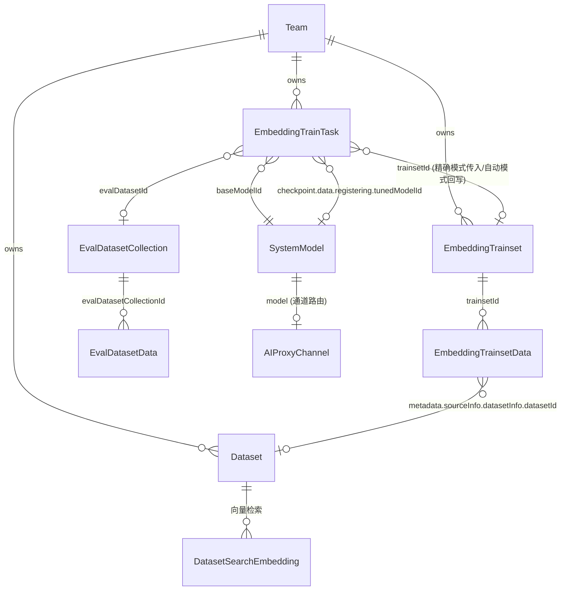
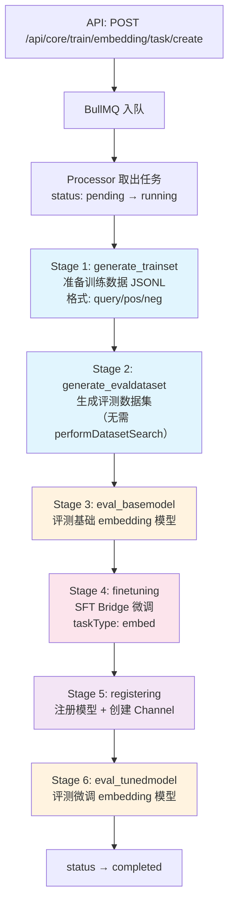
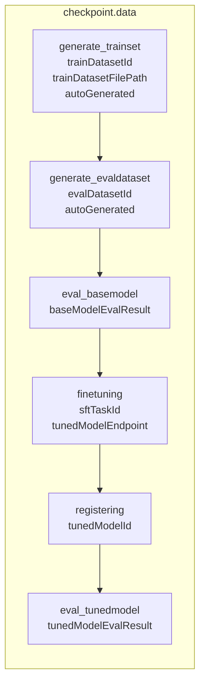
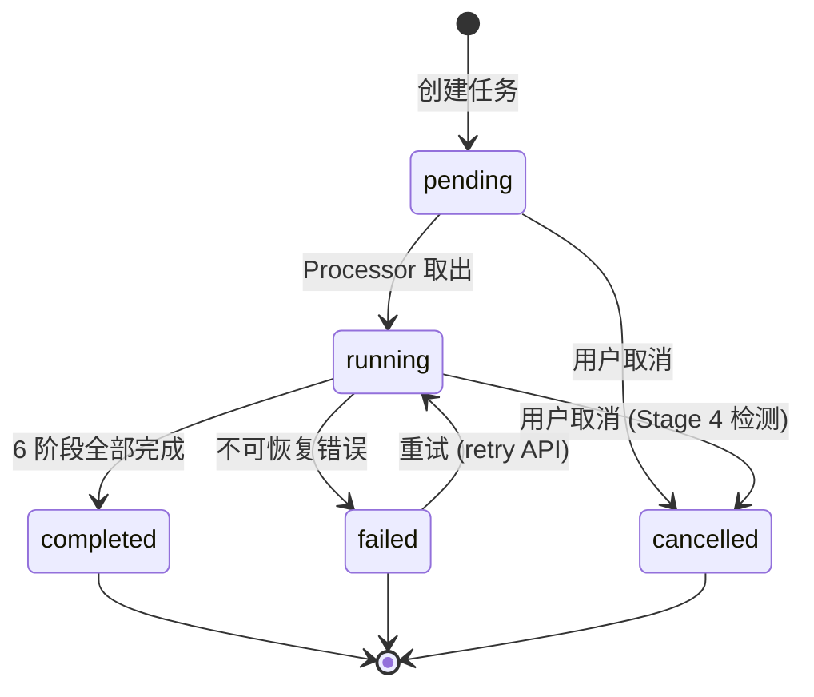
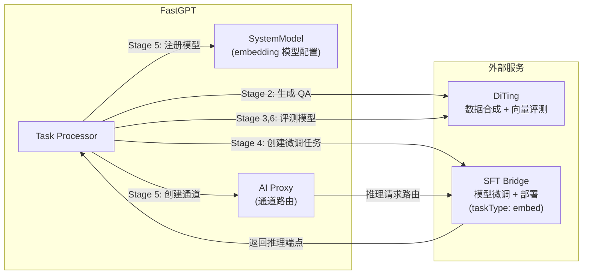

# Embedding 训练平台架构文档

> 本文档梳理 FastGPT Embedding 训练任务的执行流程、数据模型关系和关键设计决策。

## 1. 系统总览

Embedding 训练平台与 Rerank 训练平台共享相同的技术框架（BullMQ + MongoDB），通过 **6 阶段流水线** 实现从数据准备到模型微调、评测的全流程自动化。支持两种模式：

- **精确模式（Exact Mode）**：用户提供训练集 + 评测集，系统跳过生成阶段
- **自动模式（Auto Mode）**：用户提供知识库 IDs，系统自动生成训练集和评测集

**注：** 训练任务仅负责生成微调 embedding 模型。模型应用（手动更新 Dataset 的 `vectorModel` 字段并触发向量重建）由用户通过独立工作流手动决策，不由训练 pipeline 自动执行。

## 2. 数据模型关系

### 2.1 ER 关系图



### 2.2 核心模型字段

#### EmbeddingTrainTask（训练任务）

| 字段 | 类型 | 说明 |
|------|------|------|
| `_id` | ObjectId | 任务 ID |
| `teamId` / `tmbId` | ObjectId | 权限归属 |
| `baseModelId` | String | 基础 embedding 模型 ID → SystemModel.model |
| `baseModelEndpoint` | Object | 基础模型端点 {base_url, model, api_key} |
| `trainsetId` | ObjectId? | → EmbeddingTrainset._id |
| `evalDatasetId` | String? | → EvalDatasetCollection._id |
| `datasetIds` | String[]? | 知识库 IDs（仅自动模式） |
| `trainType` | String | `'lora'` \| `'ptuning'`，默认 lora |
| `status` | Enum | pending / running / completed / failed / cancelled |
| `checkpoint` | Object | 阶段进度（见 §3.2） |
| `result` | Object? | 最终结果汇总 |
| `jobId` | String? | BullMQ 任务 ID |

#### EmbeddingTrainset（训练集）

| 字段 | 类型 | 说明 |
|------|------|------|
| `_id` | ObjectId | 训练集 ID |
| `teamId` / `tmbId` | ObjectId | 权限归属 |
| `name` | String | 名称 |
| `description` | String? | 描述 |
| `status` | Enum | pending / generating / ready / error |
| `statistics` | Virtual | 动态计算（dataCount, positiveCount, negativeCount, sourceSummary） |

#### EmbeddingTrainsetData（训练数据）

与 `RerankTrainsetData` 完全相同的 schema：

| 字段 | 类型 | 说明 |
|------|------|------|
| `trainsetId` | ObjectId | → EmbeddingTrainset._id |
| `query` | String | 查询文本（即 anchor 文本） |
| `positiveDocs` | String[] | 正例文档（与 query 语义相似） |
| `negativeDocs` | String[] | 负例文档（与 query 语义无关） |
| `source` | Enum | dataset / chat_log / manual |
| `metadata.sourceInfo` | Object | 来源详情（datasetInfo / chatLogInfo / manualInfo） |

**注：** `query` 字段语义上对应 embedding 的锚点文本，保持与 rerank 相同的字段名以最大化代码复用。

#### SystemModel（模型配置）

| 字段 | 类型 | 说明 |
|------|------|------|
| `model` | String | 模型标识（唯一键） |
| `type` | Enum | `'embedding'` |
| `metadata.isActive` | Boolean | 是否启用 |
| `metadata.isTuned` | Boolean | 是否为训练模块创建的微调模型 |
| `metadata.provider` | String | 模型提供商 |

#### Dataset（知识库）

| 字段 | 类型 | 说明 |
|------|------|------|
| `vectorModel` | String? | 当前使用的 embedding 模型 ID → SystemModel.model |

## 3. 训练任务执行流程

### 3.1 六阶段流水线



### 3.2 检查点（Checkpoint）结构

每个 stage 完成后保存检查点，支持断点续传。任务重启时自动从上次完成的 stage 之后继续执行。



### 3.3 各阶段详情

| 阶段 | 文件 | 外部服务 | 耗时 | 产出 |
|------|------|---------|------|------|
| 1. generate_trainset | `stages/generate-trainset.ts` | — | ~10 min | JSONL 训练文件（query/pos/neg 三元组） |
| 2. generate_evaldataset | `stages/generate-evaldataset.ts` | DiTing (QA 生成) | ~30 min | EvalDatasetCollection + Data（**无 retrievalContextsFull**） |
| 3. eval_basemodel | `stages/eval-basemodel.ts` | DiTing (`/evaluations/embed`) | ~5-10 min | EmbeddingEvalResult（MRR、Precision） |
| 4. finetuning | `stages/finetune.ts` | SFT Bridge (微调+部署，taskType: 'embed') | 1-10 h | tunedModelEndpoint |
| 5. registering | `stages/register.ts` | AI Proxy (通道创建) | ~30 s | tunedModelId (SystemModel) |
| 6. eval_tunedmodel | `stages/eval-tunedmodel.ts` | DiTing (`/evaluations/embed`) | ~5-10 min | EmbeddingEvalResult（MRR、Precision） |

#### Stage 1：generate_trainset（两种模式）

| 模式 | 流程 |
|------|------|
| **Exact Mode** | 等待已有 trainset 状态 → `ready`（轮询，60 min 超时），验证数据不为空后导出 JSONL |
| **Auto Mode** | ① 创建新 trainset → ② 入队 data generate job → ③ 等待 trainset 状态 → `ready` → ④ 导出 JSONL |

等待轮询已覆盖 `error` 状态（立即抛出 `TrainTaskUnrecoverableError`，不等待超时）。

#### Stage 2：generate_evaldataset（与 Rerank 的关键差异）

| 维度 | Embedding | Rerank |
|------|-----------|--------|
| 流程 | 采样 → DiTing QA 生成 → 直接存储 | 采样 → DiTing QA 生成 → `performDatasetSearch` → 存储 |
| 存储内容 | `expectedContextIds`（相关文档标记） | `retrievalContextsFull`（排序候选列表） |
| 原因 | 评测相似度只需相关性标记 | 评测排序效果需要检索上下文 |
| 性能 | 省去检索调用，速度提升 ~30-50% | 需额外检索 |

### 3.4 状态机



## 4. 外部服务集成



| 服务 | 用途 | 环境变量 |
|------|------|---------|
| **DiTing** | QA 对生成、训练数据合成、embedding 向量质量评测（`/evaluations/embed`） | `DITING_BASE_URL` |
| **SFT Bridge** | LoRA/P-Tuning 微调、模型部署、推理服务（`taskType: 'embed'`） | `SFT_BRIDGE_BASE_URL` |
| **AI Proxy** | 模型通道管理、请求路由 | `AIPROXY_API_ENDPOINT` |

**SFT Bridge 客户端**统一在 `packages/service/core/train/common/external/sftbridge/` 中维护，embedding 和 rerank 均从此处导入（通过各自的 `external/index.ts` 重导出）。

## 5. 与 Rerank 的流程对比

| 维度 | Embedding | Rerank |
|------|-----------|--------|
| **数据模型** | 完全相同：`query/positiveDocs/negativeDocs` 三元组 | 同左 |
| **Stage 1（generate_trainset）** | 流程完全相同，都导出 query/pos/neg JSONL | 同左 |
| **Stage 2（generate_evaldataset）** | **无需 performDatasetSearch**，直接存储 expectedContextIds | **需要 performDatasetSearch**，存储 retrievalContextsFull |
| **Stage 3/6 评测指标** | MRR + Precision（调用 `/evaluations/embed`） | MRR + Precision（调用 `/evaluations/rerank`） |
| **SFT Bridge taskType** | `'embed'` | `'rerank'`（默认） |
| **模型类型** | `ModelTypeEnum.embedding` | `ModelTypeEnum.rerank` |
| **eval-dataset 导出格式** | JSONL（无 `retrievalContextsFull`） | JSONL（含 `retrievalContextsFull`） |
| **模型应用** | 用户手动决策，更新 Dataset.vectorModel | 用户手动决策，更新 App 的 rerankModel 引用 |

**这是 embedding train 相比 rerank train 的唯一流程差异**（Stage 2 的 performDatasetSearch 步骤）。

## 6. 资源管理

### 6.1 创建任务的前置校验

- `baseModelId` 不存在 → `taskModelNotFound`
- `baseModelId` 对应模型已被 disable → `taskBaseModelDisabled`
- 同一 team + baseModelId 已有 pending/running 任务 → `taskAlreadyRunning`

### 6.2 资源清理（deleteEmbeddingTrainTask）

```
1. 模型配置 + AI Proxy Channel (registering 阶段产物)
2. SFT Bridge 资源 (async, non-blocking)
3. 自动生成的 EvalDataset Collections + Data
4. 自动生成的 Trainset + Data
5. Task 记录
6. 临时 JSONL 文件 (async, non-blocking)
```

## 7. 错误处理与重试

### 7.1 错误分类

| 类型 | 处理 | 示例 |
|------|------|------|
| `TrainTaskRetriableError` | 自动重试（最多 3 次，指数退避 5s） | 网络超时、服务暂时不可用 |
| `TrainTaskUnrecoverableError` | 任务失败，不重试 | 数据丢失、模型不存在、用户取消、trainset error 状态 |

错误类定义在 `packages/service/core/train/common/errors.ts`，两个模块共享。

### 7.2 Trainset 生成的错误感知

`waitForTrainsetReady()` 在轮询中覆盖 trainset 的所有终态：
- `ready`：继续导出 JSONL
- `error`：立即抛出 `TrainTaskUnrecoverableError`（携带 trainset 的 errorMsg）
- 超时（360 次 × 10s = 60 min）：抛出 `TrainTaskRetriableError`

## 8. API 接口总览

### 训练集管理

| 路径 | 方法 | 功能 |
|------|------|------|
| `/api/core/train/embedding/trainset/create` | POST | 创建训练集 |
| `/api/core/train/embedding/trainset/list` | POST | 列表查询（分页、排序、状态筛选） |
| `/api/core/train/embedding/trainset/detail` | GET | 获取详情（含统计） |
| `/api/core/train/embedding/trainset/delete` | DELETE | 删除训练集（trainsetId 在 query） |

### 训练数据管理

| 路径 | 方法 | 功能 |
|------|------|------|
| `/api/core/train/embedding/trainset/data/create` | POST | 手动添加数据 |
| `/api/core/train/embedding/trainset/data/list` | POST | 数据列表（支持 source 过滤） |
| `/api/core/train/embedding/trainset/data/update` | POST | 更新数据 |
| `/api/core/train/embedding/trainset/data/delete` | POST | 删除数据（dataIds 在 body） |
| `/api/core/train/embedding/trainset/data/generate` | POST | 从知识库异步生成（返回 jobId） |

### 训练任务管理

| 路径 | 方法 | 功能 |
|------|------|------|
| `/api/core/train/embedding/task/create` | POST | 创建训练任务（支持自动/精确两种模式） |
| `/api/core/train/embedding/task/list` | POST | 任务列表（支持 baseModelId/status 过滤） |
| `/api/core/train/embedding/task/detail` | GET | 任务详情（taskId 在 query） |
| `/api/core/train/embedding/task/retry` | POST | 重试失败任务（仅 failed 状态） |
| `/api/core/train/embedding/task/cancel` | POST | 取消任务 |
| `/api/core/train/embedding/task/delete` | DELETE | 删除任务（仅 completed/failed/cancelled，taskId 在 query） |
| `/api/core/train/embedding/task/eval-dataset` | POST | 下载评测数据集 (JSONL，无 retrievalContextsFull) |
| `/api/core/train/embedding/task/eval-report` | POST | 下载评测报告 (XLSX) |

## 9. 文件结构

```
packages/service/core/train/embedding/
├── constants.ts                        # 服务层常量
├── utils.ts                            # 工具函数（createEmbeddingEnhancedError 等）
├── index.ts                            # 模块入口
├── external/                           # 外部服务集成（DiTing 专用）
│   ├── index.ts                        # 统一入口（Mock/Real 切换）
│   │                                   # ⚠️ SFT Bridge 从 common/external/sftbridge 重导出
│   └── diting/
│       ├── client.ts                   # DiTing API 客户端（evaluateEmbeddingModel）
│       ├── mock.ts                     # Mock 实现
│       └── types.ts                    # 类型定义
├── validation/                         # 环境和数据集校验
│   ├── index.ts
│   ├── environment.ts                  # SFT Bridge + DiTing 可用性检查
│   └── dataset.ts                      # 知识库合成索引校验
├── task/
│   ├── controller.ts                   # 任务 CRUD + 前置校验
│   ├── processor.ts                    # BullMQ Processor（6 阶段编排）
│   ├── worker.ts                       # Worker 初始化
│   ├── mq.ts                           # 队列配置（attempts:3, 指数退避）
│   ├── schema.ts                       # MongoDB Schema
│   ├── utils.ts                        # 任务工具函数
│   ├── helpers/
│   │   ├── channel.ts                  # AI Proxy 通道管理
│   │   └── evaluate-model.ts           # 模型评测共享逻辑
│   └── stages/
│       ├── generate-trainset.ts        # Stage 1（含 waitForTrainsetReady）
│       ├── generate-evaldataset.ts     # Stage 2（直接创建，无 performDatasetSearch）
│       ├── eval-basemodel.ts           # Stage 3
│       ├── finetune.ts                 # Stage 4（taskType: 'embed'）
│       ├── register.ts                 # Stage 5
│       └── eval-tunedmodel.ts          # Stage 6
├── trainset/
│   ├── controller.ts                   # 训练集 CRUD
│   └── schema.ts
├── data/
│   ├── controller.ts                   # 训练数据 CRUD + calculateEmbeddingTrainsetStats
│   ├── processor.ts                    # 数据生成处理器（DiTing 数据合成）
│   ├── mq.ts
│   ├── worker.ts
│   └── schema.ts
└── model/
    └── controller.ts                   # 模型配置管理

packages/service/core/train/common/
├── errors.ts                           # 共享错误类（TrainTaskRetriableError/UnrecoverableError）
├── constants.ts                        # 共享常量
├── utils.ts                            # 共享工具函数
└── external/
    └── sftbridge/                      # SFT Bridge 客户端（rerank + embedding 共用）
        ├── client.ts
        ├── mock.ts
        ├── types.ts
        └── index.ts

packages/global/core/train/embedding/
├── constants.ts                        # 枚举（状态、阶段、来源）
├── type.d.ts                           # Schema 类型
├── api.d.ts                            # API 请求/响应类型
└── error.ts                            # EnhancedErrorMessage 类型

packages/global/common/error/code/
└── train.ts                            # EmbeddingTrainErrEnum + RerankTrainErrEnum（各 95 个）

projects/app/src/pages/api/core/train/embedding/
├── task/
│   ├── create.ts
│   ├── list.ts
│   ├── detail.ts
│   ├── retry.ts
│   ├── cancel.ts
│   ├── delete.ts
│   ├── eval-dataset.ts
│   └── eval-report.ts
└── trainset/
    ├── create.ts
    ├── list.ts
    ├── detail.ts
    ├── delete.ts
    └── data/
        ├── create.ts
        ├── list.ts
        ├── update.ts
        ├── delete.ts
        └── generate.ts
```
