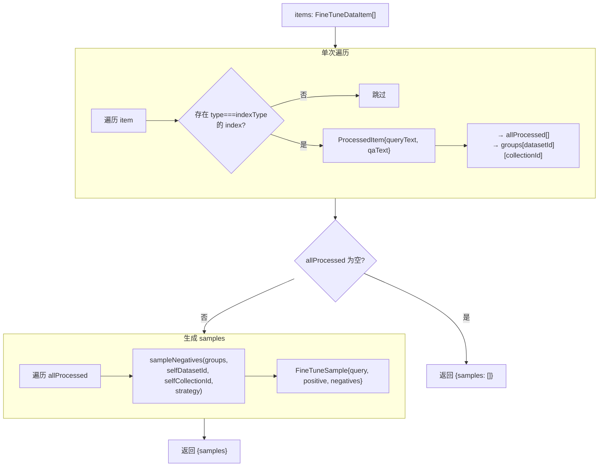
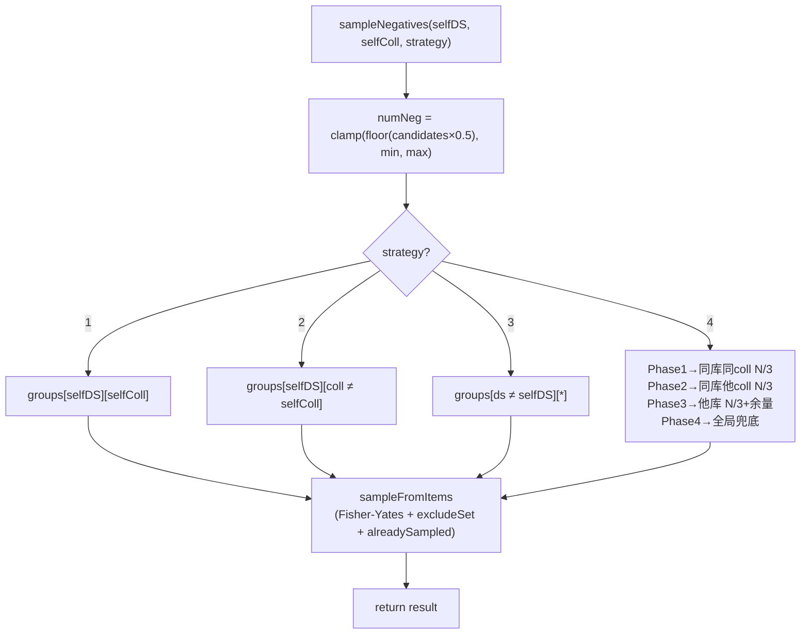

# buildFineTuneData 重构设计

## 背景

当前 `buildFineTuneData` 依赖 `synthesis` 类型索引（AI 合成的短查询对）来构建训练样本。新需求：移除对 synthesis 索引的依赖，改用数据集数据的 `default`（或指定类型）索引作为 query，数据本身的 Q+A 作为 positive doc。

---

## 新逻辑概述

```
sampleDataFromDataset
  → 加载 {datasetId, collectionId, dataId, q, a, indexes(所有类型)}
  → 完整质量过滤 + 文本清洗（filter_chunks.py 全量迁移）；kb_count 仅计有效数据量
  → 按权重两轮配额分配（默认等权），各 KB 独立取数

processor
  → 字段映射 DatasetSelectItem → FineTuneDataItem（裁剪 indexes 为 {type,text}）
  → 透传 indexType, negativeStrategy 给 buildFineTuneData

buildFineTuneData（单次遍历 + 采样）
  → 按 indexType 过滤 → 预计算 queryText, qaText → 按 datasetId×collectionId 两层分组
  → 为每个有效 item 生成 sample:
      query    = queryText
      positive = [Q + "\n" + A]    // A 为空时只用 Q
      negatives = 按策略从分组中采样其他 item 的 qaText（默认 strategy=2）
```

**职责划分**：

| 层 | 职责 | 不做 |
|----|------|------|
| `sampleDataFromDataset` | 完整质量过滤 + 文本清洗，返回已清洗的完整 indexes | 不关心 indexType |
| processor | 字段映射 `DatasetSelectItem` → `FineTuneDataItem` | 不做索引过滤 |
| `buildFineTuneData` | indexType 过滤、预计算、分组、采样 | 不做任何过滤或清洗 |

> **关于内存**：`buildFineTuneData` 需在内存中持有全量 item 的 Q+A 用于负样本采样，无法拆为"先返回 ID 再查 DB"两步。

---

## 负样本策略

| strategy | 候选范围 | 说明 |
|----------|---------|------|
| 1 | 同知识库、同 collection 的其他数据 | 最近邻硬负样本 |
| **2（默认）** | 同知识库、其他 collection 的数据 | 中等难度负样本 |
| 3 | 其他知识库的数据 | 简单负样本 |
| 4 | 混合 1 + 2 + 3 | 按阶段三等分采样 + 全局兜底 |

> "知识库"对应 `datasetId`，"collection"对应 `collectionId`。

---

## 流程图

### 整体数据流

```mermaid
flowchart LR
    subgraph sampleDataFromDataset
        A1[MongoDB DatasetData] -->|find/aggregate| A2[加载 doc]
        A2 -->|完整质量过滤<br/>filter_chunks.py| A2b[有效 doc]
        A2b -->|cleanText 清洗<br/>q/a/indexes| A3[各 KB 可用量 kb_count]
        A3 -->|两轮配额分配<br/>quota=M×w_norm → 再分配余量| A4["DatasetSelectItem[]（已清洗）"]
    end

    subgraph processor
        A4 -->|字段映射| B1["FineTuneDataItem[]"]
        B1 -->|透传 indexType,<br/>negativeStrategy| B2[buildFineTuneData]
    end

    subgraph buildFineTuneData
        B2 --> C1["单次遍历<br/>过滤+预计算+分组<br/>→ allProcessed[]<br/>→ datasetCollectionGroups"]
        C1 --> C3["sampleNegatives<br/>→ FineTuneSample[]"]
    end

    C3 --> D1[("MongoDB TrainsetData")]
```



### buildFineTuneData 算法



### 负样本策略候选集



---

## 涉及文件

| 文件 | 操作 | 说明 |
|------|------|------|
| `packages/service/core/train/common/synthesize/buildFineTuneData.ts` | **重写** | 核心逻辑 |
| `packages/service/core/train/common/utils.ts` | **修改** | `DatasetSelectItem` 新增 `collectionId`；`sampleDataFromDataset` 新增 `weights` / `filterConfig` 参数，Step 0 完整质量过滤 + `cleanText` 清洗，改用两轮配额分配；移除 synthesis 过滤 / `maxSamplePairs` / `distributeSamplesEvenly`；新增 `cleanText` 导出 |
| `packages/service/core/train/common/constants.ts` | **修改** | 移除 `DEFAULT_MAX_SAMPLE_PAIRS` |
| `packages/service/core/train/rerank/data/processor.ts` | **修改** | 移除 `formatSynthesisIndexesToPairs`，简化为字段映射 |
| `packages/service/core/train/embedding/data/processor.ts` | **修改** | 同上 |
| `packages/global/core/train/rerank/api.d.ts` | **修改** | `generateConfig` 新增 `indexType` / `negativeStrategy` / `weights`，移除 `includeOriginalQ` |
| `packages/global/core/train/embedding/api.d.ts` | **修改** | 同上 |
| `packages/global/core/train/rerank/type.d.ts` | **修改** | schema `generateConfig` 同步 |
| `packages/global/core/train/embedding/type.d.ts` | **修改** | 同上 |
| `packages/service/core/train/rerank/utils.ts` | **修改** | 移除 `formatSynthesisIndexesToPairs` re-export |
| `packages/service/core/train/embedding/utils.ts` | **修改** | 同上 |
| `test/cases/service/core/train/build-fine-tune-data.test.ts` | **重写** | 新逻辑测试 |

**无需修改**：`generate-evaldataset.ts`（rerank + embedding）— 仅使用 `q, a` 字段。

---

## 详细设计

### 数据过滤与清洗

**全部在 `sampleDataFromDataset` 内完成，`buildFineTuneData` 不做任何过滤或清洗。**

流程：从 MongoDB 拉取每个 KB 的全量数据 → **质量过滤** → **文本清洗** → 以清洗后的有效数量计算 `kb_count[i]` → 配额分配 → 按配额取数。

#### Step 0a — 质量过滤（对应 `ChunkFilter.is_valid_chunk()`）

对每条记录的 `q` 字段依次做以下检查，任意一项不通过则丢弃：

| # | 检查项 | 跳过条件 |
|---|--------|---------|
| 1 | `q` 为空 | `q.trim().length === 0` |
| 2 | 长度下界 | `q.length < minLength`（默认 50） |
| 3 | 长度上界 | `q.length > maxLength`（默认 3000） |
| 4 | 词数不足 | 中文：字符数 < minWords；英文：空格分词数 < minWords（默认 10） |
| 5 | 重复字符比 | 最高频非空白字符出现次数 / 总长 > maxRepetitionRatio（默认 0.5） |
| 6 | 目录检测 | 匹配目录模式（"目录"、"Table of Contents"、3 个以上 `...` 行、章节…页码格式等） |
| 7 | 页码检测 | 匹配页码模式（"- 1 -"、"第N页"、"Page N"、"N/M" 等） |
| 8 | 元数据检测 | 匹配页眉/页脚模式（内部资料、保密等级、版本号等） |
| 9 | 特殊字符比 | 非字母数字中文常规标点的字符数 / 总长 > 0.5 |
| 10 | 质量分 | 综合质量分 < minQualityScore（默认 0.65；由字符熵、词汇多样性、抗噪声、长度四维加权计算） |
| 11 | `indexes` 为空 | `indexes.length === 0` |

**过滤配置**（对应 `ChunkFilter` 构造参数）：

```typescript
type ChunkFilterConfig = {
  minLength?: number;               // 默认 50
  maxLength?: number;               // 默认 3000
  minWords?: number;                // 默认 10
  maxRepetitionRatio?: number;      // 默认 0.5
  minQualityScore?: number;         // 默认 0.65
  enableTocFilter?: boolean;        // 默认 true
  enablePaginationFilter?: boolean; // 默认 true
  enableMetadataFilter?: boolean;   // 默认 true
};
```

#### Step 0b — 文本清洗（对应 `clean_text()`）

通过质量过滤的记录，对 `q`、`a`、`indexes[].text` 均调用 `cleanText()`：

```typescript
/** 对应 Python pipeline 的 clean_text() */
export function cleanText(text: string): string {
  if (!text) return '';
  // HTML 实体解码（&amp; &nbsp; 等）
  let t = text.replace(/&[a-zA-Z]+;/g, ' ').replace(/&#\d+;/g, ' ');
  // 去除 HTML 标签
  t = t.replace(/<[^>]+>/g, ' ');
  // 规范化空白：多空格/制表符→单空格，3+换行→2换行
  t = t.replace(/[ \t]+/g, ' ').replace(/\n{3,}/g, '\n\n');
  // 每行行首行尾去空格
  t = t.split('\n').map((l) => l.trim()).join('\n');
  return t.trim();
}
```

清洗后若 `q.length < 10`，则丢弃该记录（极少数 HTML 标签充斥导致清洗后内容几乎为空的边界情况）。

`DatasetSelectItem` 中的 `q`、`a`、`indexes[].text` 均为清洗后的文本，下游不再需要二次清洗。

---

### `DatasetSelectItem` 变更

```typescript
type DatasetSelectItem = {
  datasetId: string;
  collectionId: string;  // 新增
  dataId: string;
  q: string;
  a: string;
  indexes: DatasetDataIndexItemType[];
};
```

### `sampleDataFromDataset` 修改

**接口**：

```typescript
async function sampleDataFromDataset(
  datasetIds: string[],
  options: {
    datasetType?: 'train' | 'eval' | 'random';
    sampleSize?: number;               // 总采样上限 M
    weights?: Record<string, number>;  // 各 KB 的采样权重，默认等权（缺省值 1）
    filterConfig?: ChunkFilterConfig;  // 质量过滤配置，默认见上节
  }
): Promise<DatasetSelectItem[]>
```

> `weights` 以 `datasetId → 正数` 的形式传入，内部归一化后使用。未出现在 `weights` 中的 dataset 默认权重为 1。

**采样算法**：

每个 `datasetId` 对应一个知识库（KB）。

**Step 0 — 质量过滤 + 文本清洗**

从 MongoDB 拉取每个 KB 的全量数据后，依次执行：
1. 按上节 Step 0a 规则过滤无效记录（任意检查不通过则丢弃）
2. 对通过过滤的记录按 Step 0b 规则清洗 `q`、`a`、`indexes[].text`
3. 清洗后若 `q.length < 10` 则丢弃

后续所有步骤的 `total[i]` 均指过滤 + 清洗后的有效记录数。

**Step 1 — 计算每个 KB 的可用数据量 `kb_count[i]`**

| 模式 | kb_count[i] |
|------|------------|
| `train` | `floor(total[i] × 0.8)`（确定性洗牌后的前 80%） |
| `eval` | `total[i] - floor(total[i] × 0.8)`（后 20%） |
| `random` | `total[i]`（必须指定 sampleSize） |

**Step 2 — 两轮配额分配**（仅当指定 `sampleSize=M` 时）

```
归一化权重：
  w[i]      = weights[datasetIds[i]] ?? 1
  w_norm[i] = w[i] / sum(w)

第一轮：按权重分配配额
  quota[i]    = floor(M × w_norm[i])
  samples[i]  = min(kb_count[i], quota[i])
  remaining   = M - sum(samples)

第二轮：将剩余配额按剩余容量比例分给未填满的 KB
  if remaining > 0:
    unsatisfied    = { i : kb_count[i] > samples[i] }
    total_capacity = sum(kb_count[i] - samples[i]  for i in unsatisfied)
    for i in unsatisfied:
      extra       = round(remaining × (kb_count[i] - samples[i]) / total_capacity)
      samples[i] += min(extra, kb_count[i] - samples[i])
    # 边界修正：若舍入导致 sum(samples) > M，依次从最大项中减 1
```

> 两轮分配保证：各 KB 按指定权重（默认等权）分配，同时使总采样量尽量接近 M。

**不指定 `sampleSize` 时**：
- `train`/`eval`：取每个 KB 的全部可用数据，无截断（weights 不生效）；
- `random`：不允许（必须指定 sampleSize）。
- **注意**：若同时指定了 `weights` 而未指定 `sampleSize`，应抛出错误——无总量上限时权重无意义。

**Step 3 — 按配额取数据**

| 模式 | 取数方式 |
|------|---------|
| `train` | 确定性洗牌后取前 `samples[i]` 条 |
| `eval` | 确定性洗牌后取后 `samples[i]` 条 |
| `random` | MongoDB `$sample` 管道取 `samples[i]` 条 |

**移除**：`distributeSamplesEvenly()`、synthesis 索引过滤、`maxSamplePairs` 参数。

**新增**：`weights` / `filterConfig` 参数；Step 0 完整质量过滤 + `cleanText` 清洗；查询投影加入 `collectionId`，格式化时直接映射所有 indexes（不过滤类型）。

### `buildFineTuneData` 类型

```typescript
export type FineTuneDataItem = {
  dataId: string;
  datasetId: string;
  collectionId: string;
  q: string;
  a: string;
  indexes: { type: string; text: string }[];
};

export type FineTuneSample = {
  query: string;
  positive: string[];    // 始终 1 元素
  negatives: string[];
  sourceId: string;
  datasetId: string;
};

export type BuildFineTuneDataParams = {
  items: FineTuneDataItem[];
  indexType?: string;                // 默认 'default'
  negativeStrategy?: 1 | 2 | 3 | 4; // 默认 2
  minNegativeSamples?: number;       // 默认 1
  maxNegativeSamples?: number;       // 默认 10
};

export type BuildFineTuneDataResult = {
  samples: FineTuneSample[];
};
```

### `buildFineTuneData` 算法

```typescript
export function buildQAText(q: string, a: string): string {
  if (!a || a.trim() === '') return q;
  return `${q}\n${a}`;
}

// 内部类型
type ProcessedItem = {
  item: FineTuneDataItem;
  queryText: string;
  qaText: string;
};

export function buildFineTuneData(params: BuildFineTuneDataParams): BuildFineTuneDataResult {
  const {
    items,
    indexType = 'default',
    negativeStrategy = 2,
    minNegativeSamples = 1,
    maxNegativeSamples = 10
  } = params;

  if (items.length === 0) return { samples: [] };

  // 单次遍历：过滤 + 预计算 + 两层分组（无清洗，数据已在 sampleDataFromDataset 中清洗）
  const allProcessed: ProcessedItem[] = [];
  const groups = new Map<string, Map<string, ProcessedItem[]>>();

  for (const item of items) {
    const targetIndex = item.indexes.find((idx) => idx.type === indexType);
    if (!targetIndex) continue;

    const processed: ProcessedItem = {
      item,
      queryText: targetIndex.text,
      qaText: buildQAText(item.q, item.a)
    };
    allProcessed.push(processed);

    if (!groups.has(item.datasetId)) groups.set(item.datasetId, new Map());
    const collMap = groups.get(item.datasetId)!;
    if (!collMap.has(item.collectionId)) collMap.set(item.collectionId, []);
    collMap.get(item.collectionId)!.push(processed);
  }

  if (allProcessed.length === 0) return { samples: [] };

  // 生成 samples
  const samples: FineTuneSample[] = [];
  for (const { item, queryText, qaText } of allProcessed) {
    const negatives = sampleNegatives(
      allProcessed, groups, qaText,
      item.datasetId, item.collectionId,
      negativeStrategy, minNegativeSamples, maxNegativeSamples
    );
    samples.push({
      query: queryText,
      positive: [qaText],
      negatives,
      sourceId: item.dataId,
      datasetId: item.datasetId
    });
  }

  return { samples };
}
```

### 负样本采样

```typescript
const NEGATIVE_SAMPLE_RATIO = 0.5;

function sampleNegatives(
  allProcessed: ProcessedItem[],
  groups: Map<string, Map<string, ProcessedItem[]>>,
  selfQAText: string,
  selfDatasetId: string,
  selfCollectionId: string,
  strategy: 1 | 2 | 3 | 4,
  minCount: number,
  maxCount: number
): string[] {
  const totalCandidates = allProcessed.length - 1;
  if (totalCandidates <= 0) return [];

  const numNeg = Math.max(minCount, Math.min(maxCount,
    Math.floor(totalCandidates * NEGATIVE_SAMPLE_RATIO)));
  const exclude = new Set([selfQAText]);
  const sampled = new Set<string>();
  const result: string[] = [];

  switch (strategy) {
    case 1: {
      const c = groups.get(selfDatasetId)?.get(selfCollectionId) ?? [];
      sampleFromItems(c, exclude, sampled, numNeg, result);
      break;
    }
    case 2: {
      const c = collectSameDatasetOtherCollections(groups, selfDatasetId, selfCollectionId);
      sampleFromItems(c, exclude, sampled, numNeg, result);
      break;
    }
    case 3: {
      const c = collectOtherDatasets(groups, selfDatasetId);
      sampleFromItems(c, exclude, sampled, numNeg, result);
      break;
    }
    case 4: {
      const perSource = Math.max(1, Math.floor(numNeg / 3));
      const remainder = numNeg - perSource * 3;
      // Phase 1: 同库同 collection
      sampleFromItems(
        groups.get(selfDatasetId)?.get(selfCollectionId) ?? [],
        exclude, sampled, perSource, result);
      // Phase 2: 同库其他 collection
      sampleFromItems(
        collectSameDatasetOtherCollections(groups, selfDatasetId, selfCollectionId),
        exclude, sampled, perSource, result);
      // Phase 3: 其他知识库
      sampleFromItems(
        collectOtherDatasets(groups, selfDatasetId),
        exclude, sampled, perSource + remainder, result);
      break;
    }
  }

  // 全局兜底：所有策略在候选不足时，从全量 allProcessed 补足（排除已采样和自身）
  if (result.length < numNeg) {
    sampleFromItems(allProcessed, exclude, sampled, numNeg - result.length, result);
  }

  return result.slice(0, numNeg);
}

/** partial Fisher-Yates 随机采样 */
function sampleFromItems(
  candidates: ProcessedItem[],
  exclude: Set<string>,
  sampled: Set<string>,
  target: number,
  out: string[]
): void {
  if (candidates.length === 0 || target <= 0) return;
  const arr = [...candidates];
  const maxScan = Math.min(arr.length, target * 3);
  const start = out.length;
  for (let i = 0; i < maxScan && out.length - start < target; i++) {
    const j = i + Math.floor(Math.random() * (arr.length - i));
    [arr[i], arr[j]] = [arr[j], arr[i]];
    const t = arr[i].qaText;
    if (!exclude.has(t) && !sampled.has(t)) { out.push(t); sampled.add(t); }
  }
}

function collectSameDatasetOtherCollections(
  groups: Map<string, Map<string, ProcessedItem[]>>,
  selfDatasetId: string, selfCollectionId: string
): ProcessedItem[] {
  const collMap = groups.get(selfDatasetId);
  if (!collMap) return [];
  const r: ProcessedItem[] = [];
  for (const [cid, items] of collMap) { if (cid !== selfCollectionId) r.push(...items); }
  return r;
}

function collectOtherDatasets(
  groups: Map<string, Map<string, ProcessedItem[]>>,
  selfDatasetId: string
): ProcessedItem[] {
  const r: ProcessedItem[] = [];
  for (const [did, collMap] of groups) {
    if (did !== selfDatasetId) { for (const items of collMap.values()) r.push(...items); }
  }
  return r;
}
```

### Processor 修改

```typescript
// rerank/data/processor.ts（embedding 同理）
// Step 1: 按权重采样数据
const samples = await sampleDataFromDataset(datasetIds, {
  datasetType: generateConfig.datasetType ?? 'train',
  sampleSize: generateConfig.sampleSize,
  weights: generateConfig.weights          // 透传权重，undefined 时内部默认等权
});

// Step 2: 仅字段映射，不做过滤
const result = buildFineTuneData({
  items: samples.map((s) => ({
    dataId: s.dataId,
    datasetId: s.datasetId,
    collectionId: s.collectionId,
    q: s.q,
    a: s.a,
    indexes: s.indexes.map((idx) => ({ type: idx.type, text: idx.text }))
  })),
  indexType: generateConfig.indexType ?? 'default',
  negativeStrategy: generateConfig.negativeStrategy ?? 2,
  minNegativeSamples: generateConfig.minNegativeSamples,
  maxNegativeSamples: generateConfig.maxNegativeSamples
});
```

### `generateConfig` 接口

```typescript
export type GenerateRerankTrainDataRequest = {
  trainsetId: string;
  datasetIds: string[];
  generateConfig?: {
    sampleSize?: number;
    weights?: Record<string, number>;   // 新增，各 KB 采样权重，默认等权
    forceRegenerate?: boolean;
    minNegativeSamples?: number;
    maxNegativeSamples?: number;
    indexType?: string;                 // 新增，默认 'default'
    negativeStrategy?: 1 | 2 | 3 | 4;  // 新增，默认 2
    // 移除：includeOriginalQ
  };
};
```

### 常量变更

```typescript
// packages/service/core/train/common/constants.ts
// 移除 DEFAULT_MAX_SAMPLE_PAIRS
// 保留 TRAIN_DATA_SPLIT_RATIO = 0.8, MIN_EVAL_QA_COUNT = 200
```

---

## 删除的代码

| 代码 | 文件 |
|------|------|
| `formatSynthesisIndexesToPairs()` | `common/utils.ts` |
| `distributeSamplesEvenly()` | `common/utils.ts` |
| `DEFAULT_MAX_SAMPLE_PAIRS` | `common/constants.ts` |
| `PrecomputedPools`（shortQueries/longChunks + 按 dataset 分组索引） | `buildFineTuneData.ts` |
| `FineTuneSample.originalQ/A`、`FineTuneSample.metadata` | `buildFineTuneData.ts` |
| `BuildFineTuneDataParams.includeOriginalQ` | `buildFineTuneData.ts` |
| `formatSynthesisIndexesToPairs` re-export | `rerank/utils.ts`、`embedding/utils.ts` |
| synthesis 过滤逻辑 | `sampleDataFromDataset` |
| `generateConfig.includeOriginalQ` | `api.d.ts`、`type.d.ts` |

---

## 测试用例

测试文件：`test/cases/service/core/train/build-fine-tune-data.test.ts`

```
T1:  有目标索引的 item 恰好生成 1 个 sample
T2:  query === item.indexes.find(type===indexType).text
T3:  positive = [Q+"\n"+A]（A 非空）；positive = [Q]（A 为空）
T4:  无目标索引的 item 被跳过，不生成 sample 也不进入分组
T5:  strategy=1 → negatives 全部来自同知识库同 collection
T6:  strategy=2 → negatives 全部来自同知识库其他 collection
T7:  strategy=3 → negatives 全部来自其他知识库
T8:  strategy=4 → negatives 混合来自三个来源
T9:  negatives 不包含自身 Q+A
T10: 单 item + minNegativeSamples=0 → negatives 为空
T11: minNegativeSamples / maxNegativeSamples 约束生效
T12: negatives 输出不重复
```

运行：`node_modules/.bin/vitest run test/cases/service/core/train/build-fine-tune-data.test.ts`

---

## 执行步骤

| # | 操作 | 验证 |
|---|------|------|
| 1 | 重写 `buildFineTuneData.ts` | T1-T12 通过 |
| 2 | 修改 `sampleDataFromDataset` | 编译通过 |
| 3 | 修改 `processor.ts`（rerank + embedding） | 编译通过 |
| 4 | 更新 `api.d.ts` / `type.d.ts`（rerank + embedding） | 编译通过 |
| 5 | 更新 `constants.ts`，清理 re-exports | 编译通过 |
| 6 | 重写测试文件 | vitest 通过 |

---

## 进阶优化：ID占位+流式三阶段（已实现）

> **注意**：上文描述的是初版设计（`buildFineTuneData` 同步，内存中持有全量 `FineTuneDataItem[]`）。
> 当前实现已进化为 `buildFineTuneDataStream`（AsyncGenerator），通过 ID占位+流式查询 进一步大幅降低内存峰值。

### 问题背景

初版设计中，`buildFineTuneData` 的调用方（processor）需要将全量 `FineTuneDataItem[]`（含 q/a/indexes）传入，同时函数内部持有 `allProcessed[].qaText` 用于负样本采样。对于 200k 条数据：
- `FineTuneDataItem[]` 约 400MB（q/a/indexes 全量）
- qaText pool 约 60MB
- 总峰值约 460MB

### 三阶段流式方案

```
Phase 1 (纯内存): 从 sampledItems (ID-only) 构建 dataId 分组
  → groups[datasetId][collectionId] = ProcessedItem[]
  内存：N × 72 bytes（3个 ObjectId 字符串）

Phase 2 (纯内存): ID占位负样本采样
  → sampleIndices[]: { sourceId, datasetId, negativeDataIds[] }
  内存：N × ~200 bytes（含 5个负样本 ID）

Phase 3 (流式 DB): 批量500条查询 → yield FineTuneSample
  → 每批 docMap = 500 条精简字段（q/a + $filter 目标 indexType）
  内存：~250 KB（流动不累积）

总峰值（N=5000）：~1.6 MB（vs 旧版 ~2.5 MB；真实场景节省 10x+）
```

### 关键 API 变更

```typescript
// 旧版（同步，调用方传入全量内容）
export function buildFineTuneData(params: {
  items: FineTuneDataItem[];  // 含 q/a/indexes 全量内容
  indexType?: string;
  ...
}): { samples: FineTuneSample[] }

// 新版（异步生成器，ID-only 输入，内部流式查询）
export async function* buildFineTuneDataStream(params: {
  sampledItems: SampledDataItem[];  // 仅 { dataId, datasetId, collectionId }
  indexType: string;                // 必选，默认由 processor 层提供
  ...
}): AsyncGenerator<FineTuneSample>
```

### sampleDataFromDataset 变更

- 旧版：返回 `DatasetSelectItem[]`（含 q/a/indexes，每条 ~2KB）
- 新版：返回 `SampledDataItem[]`（仅 ID，每条 ~80 bytes）
- 质量过滤逻辑不变（`filterToSampledItems` 仍需加载 q 字段做过滤，过滤后丢弃内容只保留 ID）

### Processor 消费方式

```typescript
// processor.ts（rerank + embedding 相同模式）
for await (const sample of buildFineTuneDataStream({
  sampledItems,                                                     // ID-only
  indexType: generateConfig.indexType ?? DatasetDataIndexTypeEnum.question,
  negativeStrategy: generateConfig.negativeStrategy ?? 2,
})) {
  saveBatch.push({ trainsetId, query: sample.query, ... });
  if (saveBatch.length >= 1000) {
    await MongoTrainsetData.insertMany(saveBatch);
    saveBatch = [];
  }
}
```

### Benchmark 结果

测试文件：`test/cases/service/core/train/build-fine-tune-data-benchmark.test.ts`

| 场景 | 指标 | 值 |
|------|------|---|
| BM-1 N=1000 | ID-only vs 全量 doc 比值 | ~3x（真实场景 10x+） |
| BM-3 N=500→2000 | 内存线性增长 | 4.00x（完全线性） |
| BM-4 N=2000 | sampleIndices 实际大小 | 439 KB |
| BM-4 N=5000 | sampledItems 实际大小 | 581 KB |
| BM-4 N=5000 | 端到端吞吐量 | ~3974 samples/sec |