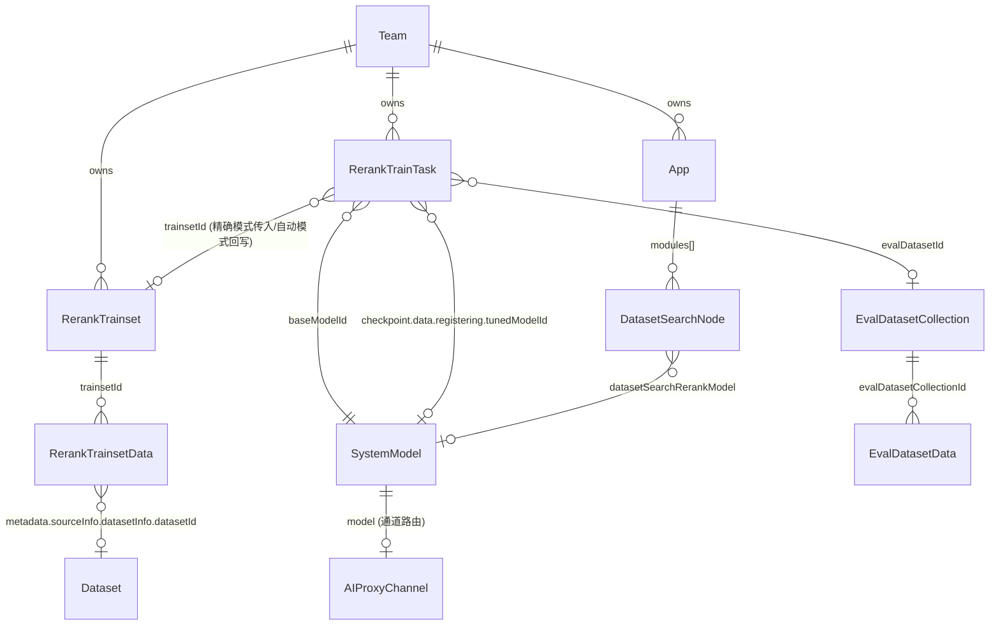
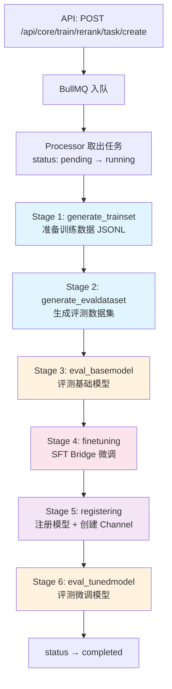
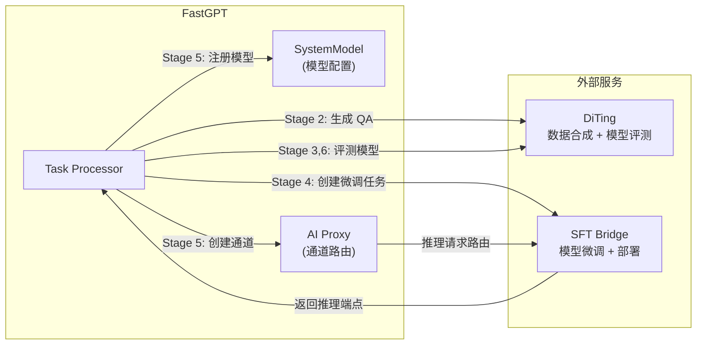

# Rerank 训练平台架构文档

> 本文档梳理 FastGPT Rerank 训练任务的执行流程、数据模型关系和关键设计决策。

## 1. 系统总览

Rerank 训练平台通过 **6 阶段流水线**，实现从数据准备到模型微调、评测的全流程自动化。支持两种模式：

- **精确模式（Exact Mode）**：用户提供训练集 + 评测集，系统跳过生成阶段
- **自动模式（Auto Mode）**：用户提供知识库 IDs，系统自动生成训练集和评测集

**注：** 训练任务仅负责生成微调模型。模型应用（更新 App 中的 rerank 模型引用）由用户通过独立工作流手动触发。

## 2. 数据模型关系

### 2.1 ER 关系图



### 2.2 核心模型字段

#### RerankTrainTask（训练任务）

| 字段 | 类型 | 说明 |
|------|------|------|
| `_id` | ObjectId | 任务 ID |
| `teamId` / `tmbId` | ObjectId | 权限归属 |
| `baseModelId` | String | 基础模型 ID → SystemModel.model |
| `baseModelEndpoint` | Object | 基础模型端点 {base_url, model, api_key} |
| `trainsetId` | ObjectId? | → RerankTrainset._id |
| `evalDatasetId` | String? | → EvalDatasetCollection._id |
| `datasetIds` | String[]? | 知识库 IDs（仅自动模式） |
| `trainType` | String | `'lora'` \| `'ptuning'`，默认 lora |
| `status` | Enum | pending / running / completed / failed / cancelled |
| `checkpoint` | Object | 阶段进度（见 §3.2） |
| `result` | Object? | 最终结果汇总 |
| `jobId` | String? | BullMQ 任务 ID |

#### RerankTrainset（训练集）

| 字段 | 类型 | 说明 |
|------|------|------|
| `_id` | ObjectId | 训练集 ID |
| `teamId` / `tmbId` | ObjectId | 权限归属 |
| `name` | String | 名称 |
| `status` | Enum | pending / generating / ready / error |
| `statistics` | Virtual | 动态计算（dataCount, positiveCount, negativeCount, sourceSummary） |

#### RerankTrainsetData（训练数据）

| 字段 | 类型 | 说明 |
|------|------|------|
| `trainsetId` | ObjectId | → RerankTrainset._id |
| `query` | String | 查询文本 |
| `positiveDocs` | String[] | 正例文档 |
| `negativeDocs` | String[] | 负例文档 |
| `source` | Enum | dataset / chat_log / manual |
| `metadata.sourceInfo` | Object | 来源详情（datasetInfo / chatLogInfo / manualInfo） |

#### SystemModel（模型配置）

| 字段 | 类型 | 说明 |
|------|------|------|
| `model` | String | 模型标识（唯一键） |
| `metadata.isActive` | Boolean | 是否启用 |
| `metadata.isTuned` | Boolean | 是否为训练模块创建的微调模型 |
| `metadata.type` | Enum | `'rerank'` |
| `metadata.provider` | String | 模型提供商 |

#### App DatasetSearchNode（应用中的 Rerank 引用）

| 字段 | 说明 |
|------|------|
| `inputs[datasetSearchUsingReRank]` | 是否启用 rerank |
| `inputs[datasetSearchRerankModel]` | 引用的 SystemModel.model |
| `inputs[datasetSearchRerankMethod]` | rerank 方法 |

## 3. 训练任务执行流程

### 3.1 六阶段流水线



### 3.2 检查点（Checkpoint）结构

每个 stage 完成后保存检查点，支持断点续传。任务重启时自动从上次完成的 stage 之后继续执行。

```mermaid
flowchart LR
    subgraph checkpoint.data
        GT["generate_trainset<br/>trainDatasetFilePath<br/>autoGenerated"]
        GE["generate_evaldataset<br/>evalDatasetId<br/>autoGenerated"]
        EB["eval_basemodel<br/>baseModelEvalResult"]
        FT["finetuning<br/>sftTaskId<br/>tunedModelEndpoint"]
        RG["registering<br/>tunedModelId"]
        ET["eval_tunedmodel<br/>tunedModelEvalResult"]
    end

    GT --> GE --> EB --> FT --> RG --> ET

### 3.3 各阶段详情

| 阶段 | 文件 | 外部服务 | 耗时 | 产出 |
|------|------|---------|------|------|
| 1. generate_trainset | `stages/generate-trainset.ts` | — | ~10 min | JSONL 训练文件 |
| 2. generate_evaldataset | `stages/generate-evaldataset.ts` | DiTing (QA 生成) | ~30 min | EvalDatasetCollection + Data |
| 3. eval_basemodel | `stages/eval-basemodel.ts` | DiTing (评测) | ~5-10 min | RerankEvalResult |
| 4. finetuning | `stages/finetune.ts` | SFT Bridge (微调+部署) | 1-10 h | tunedModelEndpoint |
| 5. registering | `stages/register.ts` | AI Proxy (通道创建) | ~30 s | tunedModelId (SystemModel) |
| 6. eval_tunedmodel | `stages/eval-tunedmodel.ts` | DiTing (评测) | ~5-10 min | RerankEvalResult |

### 3.4 状态机

```mermaid
stateDiagram-v2
    [*] --> pending: 创建任务

    pending --> running: Processor 取出
    pending --> cancelled: 用户取消

    running --> completed: 6 阶段全部完成
    running --> failed: 不可恢复错误
    running --> cancelled: 用户取消 (Stage 4 检测)

    failed --> running: 重试 (retry API)

    completed --> [*]
    failed --> [*]
    cancelled --> [*]
```

## 4. 外部服务集成



| 服务 | 用途 | 环境变量 |
|------|------|---------|
| **DiTing** | QA 对生成、训练数据合成、模型排序质量评测 | `DITING_BASE_URL` |
| **SFT Bridge** | LoRA/P-Tuning 微调、模型部署、推理服务 | `SFT_BRIDGE_BASE_URL` |
| **AI Proxy** | 模型通道管理、请求路由 | `AIPROXY_API_ENDPOINT` |

## 5. 资源管理

### 5.1 创建任务的前置校验

- `baseModelId` 不存在 → `taskModelNotFound`
- `baseModelId` 对应模型已被 disable → `taskBaseModelDisabled`（防止在失败模型上继续训练）
- 同一 team + baseModelId 已有 pending/running 任务 → `taskAlreadyRunning`

## 6. 错误处理与重试

### 6.1 错误分类

| 类型 | 处理 | 示例 |
|------|------|------|
| `TrainTaskRetriableError` | 自动重试（最多 3 次，指数退避 5s） | 网络超时、服务暂时不可用 |
| `TrainTaskUnrecoverableError` | 任务失败，不重试 | 数据丢失、模型不存在、用户取消 |

### 6.2 资源清理（deleteRerankTrainTask）

```
1. 模型配置 + AI Proxy Channel (registering 阶段产物)
2. SFT Bridge 资源 (async, non-blocking)
3. 自动生成的 EvalDataset Collections + Data
4. 自动生成的 Trainset + Data
5. Task 记录
6. 临时 JSONL 文件 (async, non-blocking)
```

## 7. API 接口总览

### 训练集管理

| 路径 | 方法 | 功能 |
|------|------|------|
| `/api/core/train/rerank/trainset/create` | POST | 创建训练集 |
| `/api/core/train/rerank/trainset/list` | POST | 列表查询（分页、排序、状态筛选） |
| `/api/core/train/rerank/trainset/detail` | GET | 获取详情（含统计） |
| `/api/core/train/rerank/trainset/delete` | POST | 删除训练集 |

### 训练数据管理

| 路径 | 方法 | 功能 |
|------|------|------|
| `/api/core/train/rerank/trainset/data/create` | POST | 手动添加数据 |
| `/api/core/train/rerank/trainset/data/list` | POST | 数据列表 |
| `/api/core/train/rerank/trainset/data/update` | POST | 更新数据 |
| `/api/core/train/rerank/trainset/data/delete` | POST | 删除数据 |
| `/api/core/train/rerank/trainset/data/generate` | POST | 从知识库生成 |

### 训练任务管理

| 路径 | 方法 | 功能 |
|------|------|------|
| `/api/core/train/rerank/task/create` | POST | 创建训练任务 |
| `/api/core/train/rerank/task/list` | POST | 任务列表 |
| `/api/core/train/rerank/task/detail` | GET | 任务详情 |
| `/api/core/train/rerank/task/retry` | POST | 重试失败任务 |
| `/api/core/train/rerank/task/cancel` | POST | 取消任务 |
| `/api/core/train/rerank/task/delete` | POST | 删除任务 |
| `/api/core/train/rerank/task/eval-dataset` | POST | 下载评测数据集 (JSONL) |
| `/api/core/train/rerank/task/eval-report` | POST | 下载评测报告 (XLSX) |

## 8. 文件结构

```
packages/service/core/train/rerank/
├── constants.ts                        # 服务层常量
├── utils.ts                            # 工具函数
├── external/                           # 外部服务集成
│   ├── index.ts                        # 统一入口（Mock/Real 切换）
│   ├── sftbridge/client.ts             # SFT Bridge API
│   └── diting/client.ts               # DiTing API
├── task/
│   ├── controller.ts                   # 任务 CRUD
│   ├── processor.ts                    # BullMQ Processor（6 阶段编排）
│   ├── worker.ts                       # Worker 初始化
│   ├── mq.ts                           # 队列配置
│   ├── schema.ts                       # MongoDB Schema
│   ├── errors.ts                       # 错误类
│   ├── helpers/
│   │   ├── channel.ts                  # AI Proxy 通道管理
│   │   ├── evaluate-model.ts           # 模型评测共享逻辑
│   │   ├── model.ts                    # isTunedModel 等
│   │   └── dataset-search.ts           # 数据集搜索
│   └── stages/
│       ├── generate-trainset.ts        # Stage 1
│       ├── generate-evaldataset.ts     # Stage 2
│       ├── eval-basemodel.ts           # Stage 3
│       ├── finetune.ts                 # Stage 4
│       ├── register.ts                 # Stage 5
│       └── eval-tunedmodel.ts          # Stage 6
├── trainset/
│   ├── controller.ts                   # 训练集 CRUD
│   └── schema.ts
├── data/
│   ├── controller.ts                   # 训练数据 CRUD
│   ├── processor.ts                    # 数据生成处理器
│   └── schema.ts
├── model/
│   └── controller.ts                   # 模型配置管理 + App 引用替换
└── validation.ts                       # 环境校验

packages/global/core/train/rerank/
├── constants.ts                        # 枚举（状态、阶段、来源）
├── type.d.ts                           # Schema 类型
└── api.d.ts                            # API 请求/响应类型
```
