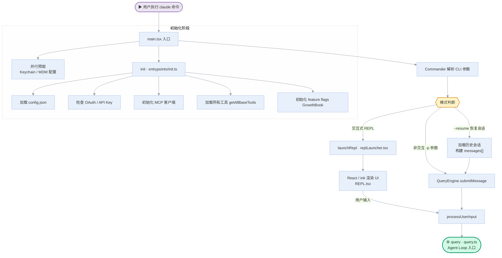
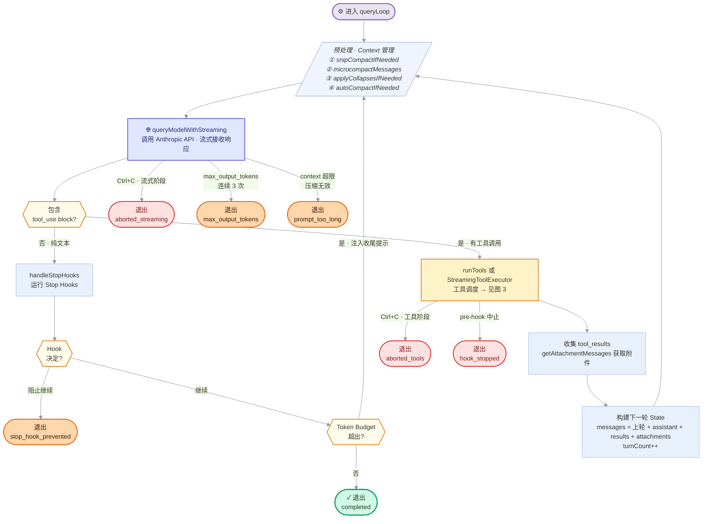
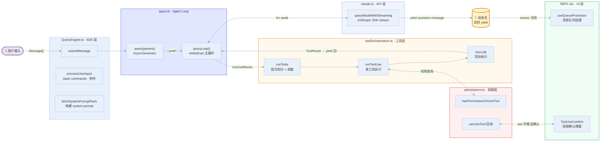

# Claude Code 调度逻辑分析图

> 基于 claude-code-source-code v2.1.88 源码分析

---

## 图 1：宏观启动流程



---

## 图 2：Agent Loop 主循环（核心）



---

## 图 3：工具调度与执行

```mermaid
%%{init: {'theme': 'base', 'themeVariables': {'primaryColor': '#E8F0FB', 'primaryTextColor': '#37352F', 'primaryBorderColor': '#A5C0E8', 'lineColor': '#9099A6', 'fontSize': '14px'}}}%%
flowchart TD
    IN(["收到 toolUseBlocks[]"]) --> PART

    PART["partitionToolCalls\n按 isConcurrencySafe 分批"]

    PART --> SAFE["只读工具批次\nFileRead · Glob · Grep …"]
    PART --> UNSAFE["写入工具批次\nFileEdit · FileWrite · Bash …"]

    SAFE --> CON["runToolsConcurrently\n并行执行 · 最多 10 个\nCLAUDE_CODE_MAX_TOOL_USE_CONCURRENCY"]
    UNSAFE --> SER["runToolsSerially\n严格串行执行"]

    CON --> RUN
    SER --> RUN

    RUN["runToolUse\n单个工具执行入口"]

    RUN --> V["① 输入验证\nZod schema · validateInput"]
    V  --> PH["② Pre-tool Hooks\nrunPreToolUseHooks"]
    PH --> PC["③ 权限检查\ncanUseTool  →  见图 4"]

    PC --> DEC{{"权限\n决定"}}
    DEC -->|allow| EX["④ 执行工具\ntool.call(input, ctx, onProgress)"]
    DEC -->|deny|  DR(["返回 ToolResult\n拒绝原因"])
    DEC -->|abort| AB(["⛔ 中止整个会话"])

    EX --> POH["⑤ Post-tool Hooks\nrunPostToolUseHooks"]
    POH --> RES(["返回 ToolResult ✓"])

    STREAM_NOTE["🚀 StreamingToolExecutor\n流中出现完整 tool_use block\n立即启动，与后续流并行执行"]
    STREAM_NOTE -.->|提前触发| RUN

    classDef entry   fill:#EAE4F2,stroke:#9065B0,stroke-width:2px,color:#37352F
    classDef process fill:#E8F0FB,stroke:#A5C0E8,stroke-width:1px,color:#37352F
    classDef blue    fill:#E0E7FF,stroke:#4F46E5,stroke-width:1.5px,color:#2D2B6B
    classDef green   fill:#D1FAE5,stroke:#059669,stroke-width:1.5px,color:#1A3A2A
    classDef red     fill:#FEE2E2,stroke:#DC2626,stroke-width:1.5px,color:#7F1D1D
    classDef amber   fill:#FEF3C7,stroke:#D97706,stroke-width:1.5px,color:#37352F
    classDef stream  fill:#FFF7ED,stroke:#EA580C,stroke-width:1.5px,stroke-dasharray:5 3,color:#431407
    classDef dec     fill:#FFFBEB,stroke:#D97706,stroke-width:1.5px,color:#37352F

    class IN entry
    class CON blue
    class SER blue
    class RES green
    class DR,AB red
    class PART,RUN,V,PH,EX,POH process
    class PC amber
    class STREAM_NOTE stream
    class DEC dec
```

---

## 图 4：权限决策树

```mermaid
%%{init: {'theme': 'base', 'themeVariables': {'primaryColor': '#E8F0FB', 'primaryTextColor': '#37352F', 'primaryBorderColor': '#A5C0E8', 'lineColor': '#9099A6', 'fontSize': '14px'}}}%%
flowchart TD
    START(["canUseTool 被调用"]) --> P1

    P1{{"① alwaysDenyRules\n命中黑名单?"}}
    P1 -->|是| DENY1(["🚫 deny"])
    P1 -->|否| P2

    P2{{"② alwaysAskRules\n命中需询问规则?"}}
    P2 -->|是 · 非沙箱| ASK
    P2 -->|否| P3

    P3{{"③ tool.checkPermissions\n工具自身检查"}}
    P3 -->|deny|              DENY2(["🚫 deny"])
    P3 -->|ask · 非safetyCheck| ASK
    P3 -->|ask · safetyCheck|  ASK_S
    P3 -->|allow|              P4

    P4{{"④ requiresUserInteraction\n强制用户交互?"}}
    P4 -->|是| ASK
    P4 -->|否| P5

    P5{{"⑤ 内容级 ask 规则\n如 npm publish:*"}}
    P5 -->|命中| ASK_S
    P5 -->|未命中| P6

    P6{{"⑥ safetyCheck\n.git · .claude · shell 配置"}}
    P6 -->|命中| ASK_S
    P6 -->|未命中| P7

    P7{{"⑦ bypassPermissions\n模式开启?"}}
    P7 -->|是| ALLOW1(["✅ allow"])
    P7 -->|否| P8

    P8{{"⑧ alwaysAllowRules\n命中白名单?"}}
    P8 -->|是| ALLOW2(["✅ allow"])
    P8 -->|否| ASK

    ASK["behavior = ask\n进入模式路由"]
    ASK_S["behavior = ask  🔒\nbypass 也无法豁免"]
    ASK   --> ROUTER
    ASK_S --> ROUTER

    ROUTER{{"当前权限模式?"}}
    ROUTER -->|dontAsk|         AD1(["🚫 自动拒绝"])
    ROUTER -->|auto / plan+auto| CLS
    ROUTER -->|shouldAvoidPrompts| HKP
    ROUTER -->|default 交互式|   UI

    CLS["🤖 AI 分类器\nclassifyYoloAction"]
    CLS --> CDEC{{"分类\n结果"}}
    CDEC -->|allow|               ALLOW3(["✅ allow"])
    CDEC -->|deny · 未超拒绝上限| AD2(["🚫 自动拒绝"])
    CDEC -->|deny · 超过拒绝上限| UI

    HKP["外部 PermissionRequest Hooks"]
    HKP --> HDEC{{"Hook\n决定"}}
    HDEC -->|allow|  ALLOW4(["✅ allow"])
    HDEC -->|无决定| AD3(["🚫 自动拒绝"])

    UI["💬 交互式弹窗\nhandleInteractivePermission\n推送到 REPL UI 队列"]
    UI --> UDEC{{"用户\n操作"}}
    UDEC -->|onAllow| ALLOW5(["✅ allow"])
    UDEC -->|onReject| DENY3(["🚫 deny"])
    UDEC -->|onAbort|  ABORT(["⛔ 中止会话"])

    classDef entry   fill:#EAE4F2,stroke:#9065B0,stroke-width:2px,color:#37352F
    classDef dec     fill:#FFFBEB,stroke:#D97706,stroke-width:1.5px,color:#37352F
    classDef route   fill:#F0F4FF,stroke:#8BA4D4,stroke-width:1px,color:#37352F
    classDef allow   fill:#D1FAE5,stroke:#059669,stroke-width:1.5px,color:#1A3A2A
    classDef deny    fill:#FEE2E2,stroke:#DC2626,stroke-width:1.5px,color:#7F1D1D
    classDef abort   fill:#1C1917,stroke:#1C1917,stroke-width:1px,color:#F5F5F4
    classDef ai      fill:#FEF3C7,stroke:#D97706,stroke-width:1.5px,color:#37352F
    classDef ui      fill:#E0E7FF,stroke:#4F46E5,stroke-width:1.5px,color:#2D2B6B

    class START entry
    class P1,P2,P3,P4,P5,P6,P7,P8,ROUTER,CDEC,HDEC,UDEC dec
    class ASK,ASK_S route
    class ALLOW1,ALLOW2,ALLOW3,ALLOW4,ALLOW5 allow
    class DENY1,DENY2,DENY3,AD1,AD2,AD3 deny
    class ABORT abort
    class CLS ai
    class UI,HKP ui
```

---

## 图 5：数据流与 AsyncGenerator 链



---

## 关键设计要点

| 特性 | 实现方式 | 源文件 |
|------|---------|--------|
| **全链路流式** | 每层均为 `AsyncGenerator`，`yield` 链式传递 | `query.ts` · `claude.ts` |
| **流式工具提前启动** | 流中出现完整 `tool_use` block 即立即执行，与后续流并行 | `StreamingToolExecutor.ts` |
| **工具并发控制** | `isConcurrencySafe` 分批，最多 10 并发 | `toolOrchestration.ts` |
| **Context 自动管理** | 超 token 时自动压缩/裁剪，对上层透明 | `query.ts` |
| **Token Budget** | 工具返回内容累计超限时注入收尾提示，防止无限循环 | `query.ts` |
| **多级权限** | 8 级判断规则 + 5 种模式路由（含 AI 分类器） | `permissions.ts` |
| **AbortController 层次** | 会话级 + 工具批次级，兄弟工具失败可互相取消 | `toolExecution.ts` |
| **启动并行优化** | Keychain / MDM 在 `main.tsx` 顶部并行预取 | `main.tsx` |
