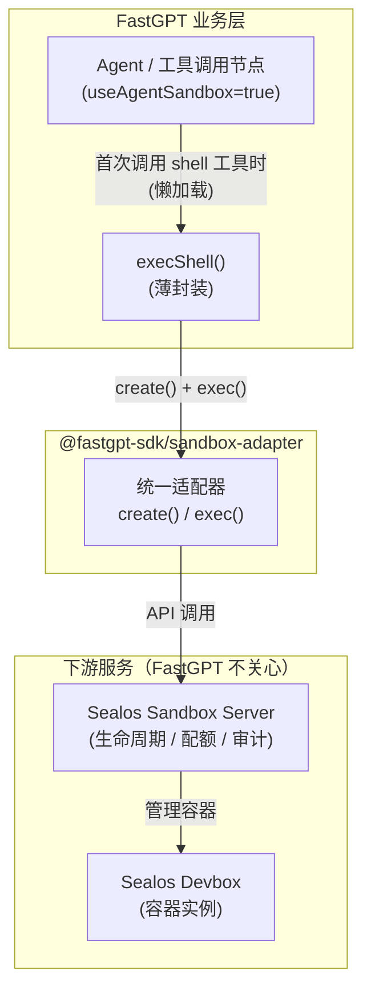
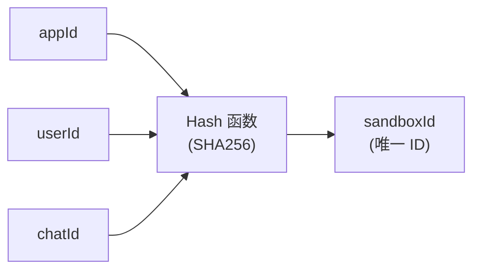
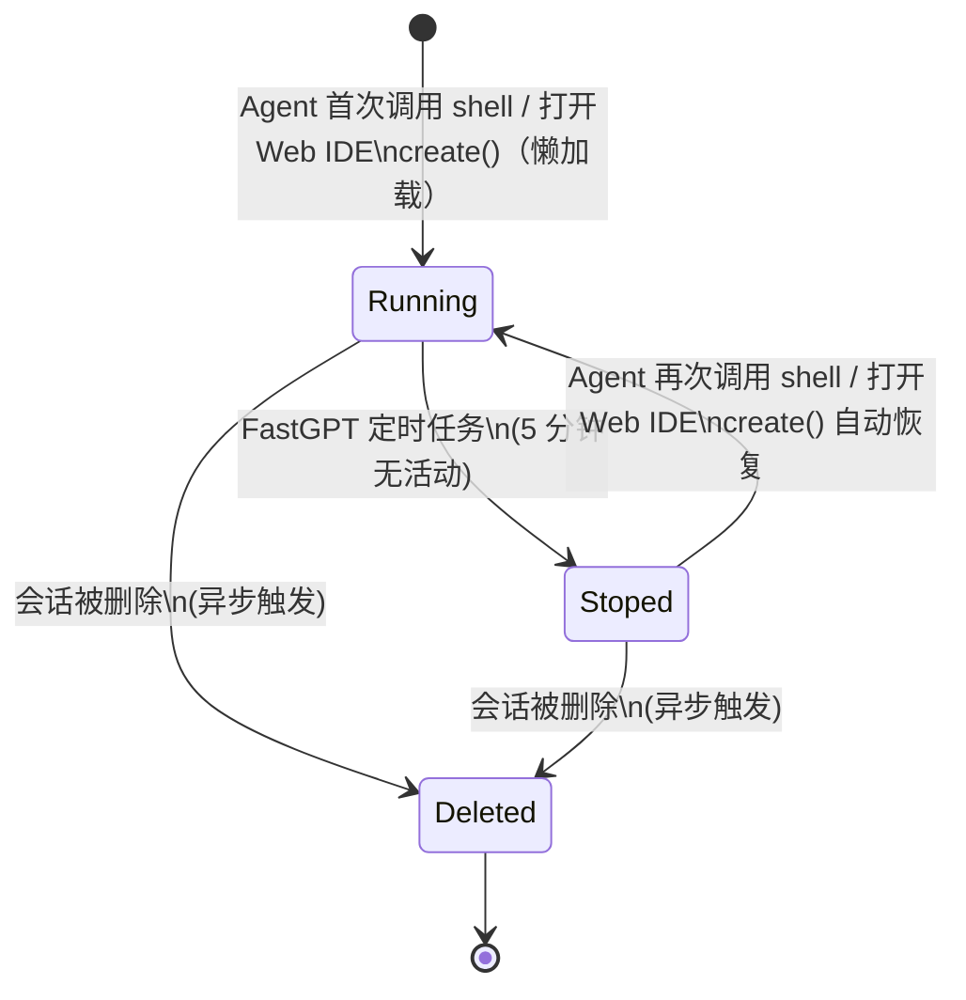
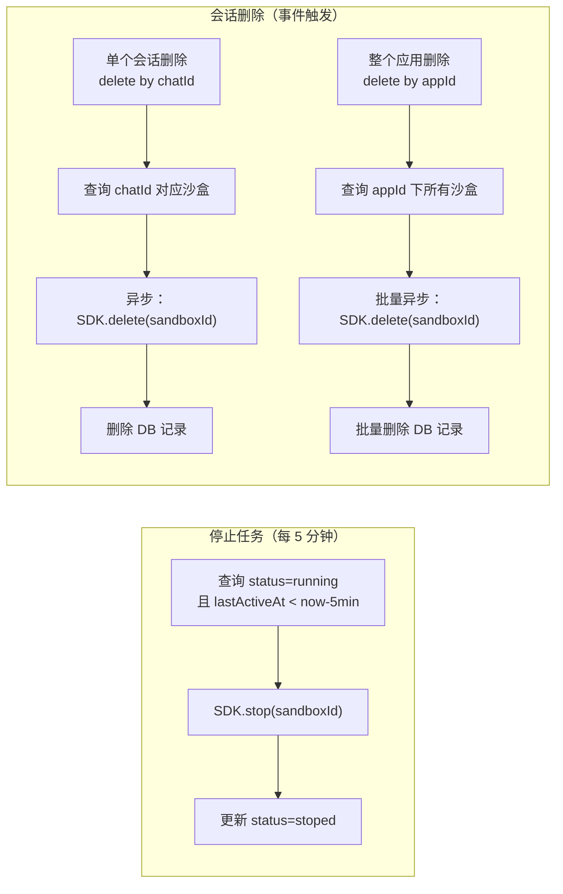
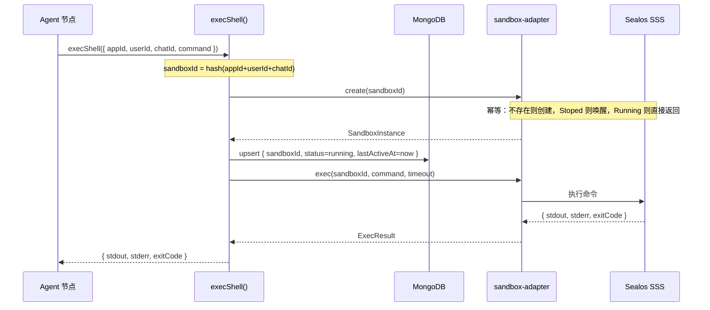
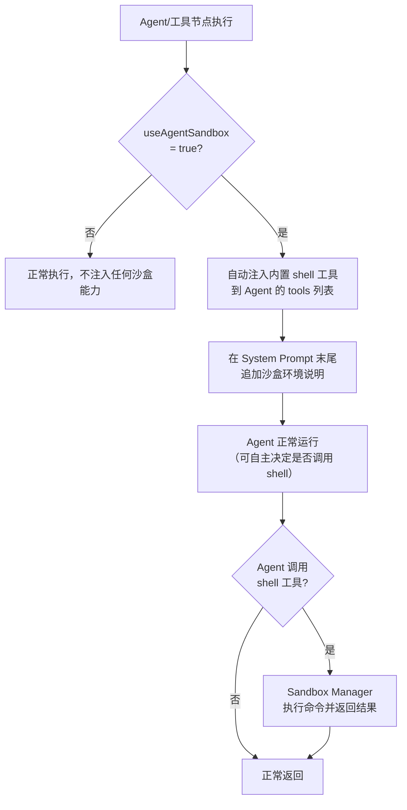
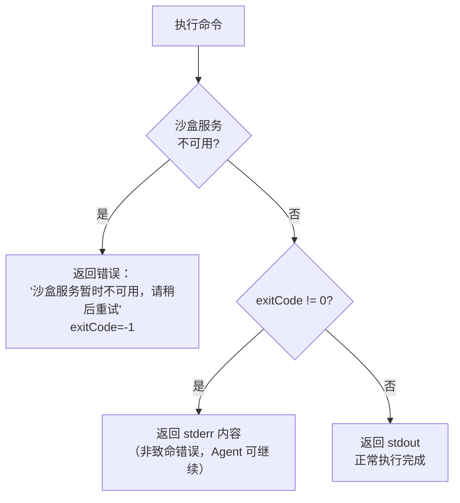
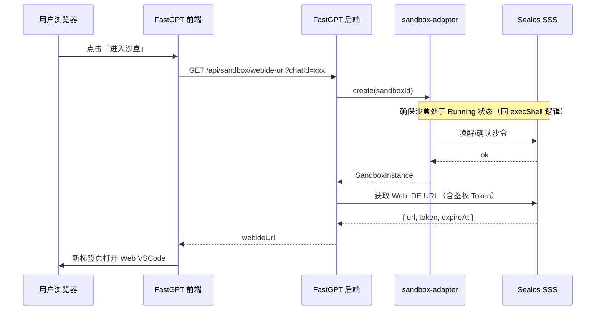

# FastGPT AI Sandbox 集成方案

## 一、背景与目标

当 Agent 拥有一个独立虚拟机时，可以执行代码、管理文件、调用系统命令，能力大幅增强。本方案通过接入外部沙盒服务，为每个会话提供一个隔离、持久的容器环境，让 Agent 拥有完整的 root 权限操作空间。

**核心目标**：
- 每会话独立隔离，互不干扰
- Agent 无感知沙盒状态，调用接口简单
- 沙盒自动生命周期管理，节省资源
- 支持用户通过 SSH/Web IDE 直接进入沙盒

---

## 二、整体架构

FastGPT 作为**纯业务层**，只负责在合适时机调用 SDK；沙盒的生命周期管理、配额、清理、审计等全部由下游（SDK / SSS）负责。



### 组件职责

| 组件 | 职责 | 归属 |
|------|------|------|
| **FastGPT execShell()** | 薄封装：组装 sandboxId，调用 SDK | FastGPT |
| **@fastgpt-sdk/sandbox-adapter** | 统一适配层；`create()` 保证返回可用沙盒 | SDK |
| **Sealos Sandbox Server** | 容器 CRUD、生命周期管理、配额、审计 | 下游 |
| **Sealos Devbox** | 实际的隔离容器实例 | 下游 |

---

## 三、沙盒管理设计

### 3.1 沙盒粒度

沙盒以 **会话维度** 分配，唯一标识由三元组生成：

```
sandboxId = hash(appId + userId + chatId)
```



> 不同会话之间完全隔离；同一会话内多轮对话共享同一个沙盒，保留执行上下文（变量、文件等）。

### 3.2 沙盒生命周期



**FastGPT 侧规则**：
- **懒加载**：会话开始时不创建沙盒，Agent 首次调用 `shell` 工具或用户打开 Web IDE 时才触发 `create()`
- **停止**：由 FastGPT 定时任务驱动，扫描 `lastActiveAt` 超过 5 分钟的 Running 沙盒，调用 SDK 停止
- **销毁**：会话被删除时，**异步**触发 SDK 删除并清理 DB 记录（不阻塞会话删除主流程）

### 3.3 数据库设计

**集合名**：`sandbox_instances`

```typescript
type SandboxInstanceSchema = {
  _id: ObjectId;
  sandboxId: string;        // hash(appId+userId+chatId)，唯一索引

  appId: string;
  userId: string;
  chatId: string;

  status: 'running' | 'stoped';
  lastActiveAt: Date;       // 最后活跃时间，驱动停止定时任务

  createdAt: Date;
};
```

**索引**：
- `sandboxId`：唯一索引（快速查找）
- `chatId`：单个会话删除时查找对应沙盒
- `appId`：整个应用删除时批量查找沙盒
- `status + lastActiveAt`：暂停定时任务扫描

### 3.4 定时任务 & 触发时机



---

## 四、执行流程

Agent 调用 shell 工具时序：



**FastGPT 侧代码逻辑（伪代码）**：

```typescript
async function execShell(params: {
  appId: string;
  userId: string;
  chatId: string;
  command: string;
  timeout?: number;
}) {
  const { appId, userId, chatId, command, timeout } = params;
  const sandboxId = sha256(`${appId}-${userId}-${chatId}`).slice(0, 16);
  const sandbox = await sandboxAdapter.create(sandboxId);   // 幂等，保证可用
  await SandboxInstanceModel.upsert({ sandboxId, status: 'running', lastActiveAt: new Date() });
  return sandboxAdapter.exec(sandbox.id, command, { timeout });
}

---

## 五、Agent 工具设计

### 5.1 节点改造方案

**不新增节点类型**，在现有的 **Agent 节点**（`tools`）和**工具调用节点**上增加一个 input：

```typescript
{
  key: 'useAgentSandbox',
  type: 'switch',          // 开关类型
  label: '启用沙盒（Computer Use）',
  defaultValue: false,
  description: '开启后，Agent 将获得一个独立 Linux 环境，可执行命令、操作文件'
}
```

### 5.2 启用后的行为



**自动注入的内置 shell 工具定义**：

```typescript
// 由系统内置，不需要用户配置，useAgentSandbox=true 时自动追加到 tools
const computerTool = {
  name: 'shell',
  description: '在独立 Linux 环境中执行 shell 命令，支持文件操作、代码运行、包安装等',
  parameters: {
    command: { type: 'string', description: '要执行的 shell 命令' },
    timeout: { type: 'number', description: '超时秒数（可选，由上游沙盒服务控制）', optional: true }
  },
  returns: {
    stdout: 'string',
    stderr: 'string',
    exitCode: 'number'   // 0=成功，负数=系统错误
  }
};
```

### 5.3 自动注入的系统提示词

`useAgentSandbox=true` 时，在节点原有 System Prompt **末尾追加**：

```
你拥有一个独立的 Linux 沙盒环境（Ubuntu 22.04），可通过 shell 工具执行命令：
- 预装：bash / python3 / node / git / curl / wget
- 工作目录：/workspace（文件在本次会话内持久保留）
- 可自行安装软件包（apt / pip / npm）
- 可通过 timeout 参数指定命令超时时间
```

---

## 六、错误处理



| 错误类型 | exitCode | 处理策略 |
|----------|----------|----------|
| 沙盒服务不可用 | -1 | 返回错误，终止当前节点，不中断整个工作流 |
| 命令执行失败 | ≠0 | 将 stderr 作为输出返回，由 Agent 自行判断 |
| 命令超时 | 由上游处理 | 上游沙盒服务自动断开，FastGPT 透传结果即可 |

---

## 七、安全与资源限制

FastGPT 业务层只控制命令超时，其余由下游负责：

| 限制项 | FastGPT 侧 | 说明 |
|--------|-----------|------|
| **命令超时** | 支持传递 timeout 参数 | 由上游沙盒服务控制，FastGPT 透传 timeout 参数（秒）转换为毫秒 |
| **CPU / 内存 / 磁盘** | 不关心 | 下游（SSS/Devbox）控制 |
| **配额** | 不关心 | 下游控制 |
| **网络隔离** | 不关心 | 下游控制 |
| **审计日志** | 不关心 | 下游控制 |

---

## 八、前端功能

### 8.1 SSH / Web IDE 接入

Web IDE 入口同样遵循懒加载原则，打开前先调用 `create()` 确保沙盒处于 Running 状态，再获取 IDE URL。



**实现方案**：利用 Sealos Devbox 内置的 Web IDE 能力（基于 code-server），前端只需跳转到带鉴权 token 的 URL。

### 8.2 沙盒状态展示（可选）

在对话页面的工具调用结果中，展示：
- 命令内容（折叠显示）
- 执行状态（成功/失败/超时）
- stdout/stderr 输出（Markdown 代码块）
- 执行耗时

---

## 九、设计决策记录

| 问题 | 决策 |
|------|------|
| 沙盒配额管理 | 不关心，由下游处理 |
| 沙盒何时创建 | 懒加载，Agent 首次调用 shell 或打开 Web IDE 时才创建 |
| 停止由谁驱动 | **FastGPT 定时任务**，5 分钟无活动自动停止，不可配置 |
| 销毁由谁驱动 | **会话删除时异步触发**，不依赖定时任务 |
| 多厂商适配 | 由 SDK 适配层处理，FastGPT 不感知 |
| 审计日志 | 下游处理，FastGPT 不记录 |
| 事务一致性 | 使用 mongoSessionRun 保证 DB 操作和 SDK 调用的一致性 |
