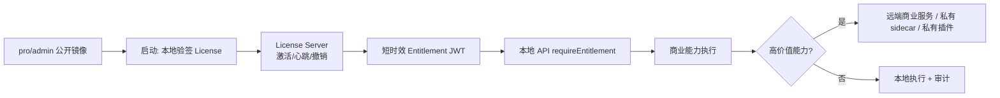

# pro/admin 镜像 License 防篡改方案

## 0. 文档标识

- 任务前缀：`pro-admin-license-anti-tamper`
- 更新时间：2026-05-24
- 文档定位：针对公开 `pro/admin` 镜像被 patch 绕过 License 的防护方案与实施拆解。
- 配套分析：`.codex/issue/pro-admin-license-anti-tamper-analysis.md`

## 1. 目标和非目标

### 1.1 目标

1. 防止“公开镜像 + 本地 License 判断”被简单 patch 后继续使用完整商业能力。
2. 建立官方镜像完整性证明、License 在线激活、短时效授权凭证和远端可撤销能力。
3. 把高价值商业能力从公开镜像的本地可控边界中逐步迁出。
4. 保留可灰度迁移路径，避免一次性破坏已有商业客户部署。

### 1.2 非目标

1. 不承诺在普通 Docker/Kubernetes 环境中实现绝对防篡改。客户完全控制运行环境时，本地代码一定可以被修改。
2. 不把代码混淆、自校验、隐藏校验点作为主防线。
3. 不在公开镜像内放置服务端私钥或不可泄露 secret。
4. 不依赖前端菜单隐藏或页面跳转作为安全边界。

## 2. 核心判断

公开镜像内的本地 License 校验只能证明“某个 License payload 是官方签发的”，不能证明“当前正在运行的是未经篡改的官方代码”。

因此防护策略必须从“本地代码判断是否允许”改为：

1. 官方镜像可以被验证：镜像签名、digest、SBOM、provenance。
2. 授权状态由 FastGPT 控制面签发：短时效 entitlement token，支持撤销和租约。
3. 商业能力不能只靠本地代码执行：高价值能力迁到远端服务、私有 sidecar、私有插件或受控资源。
4. 本地检查只作为体验和 fail-closed 缓存，不作为最终安全边界。

## 3. 总体方案

推荐采用“三层防线”：

| 层级 | 作用 | 能解决什么 | 不能解决什么 |
|---|---|---|---|
| L1 官方镜像完整性 | 通过 Cosign/SBOM/provenance 证明镜像来自官方构建 | 客户和部署脚本可识别官方镜像，避免误用未知镜像 | 不能阻止攻击者主动运行改包镜像 |
| L2 在线授权和租约 | License server 签发短时效 entitlement token，周期心跳和远端撤销 | 可撤销、可审计、可发现超装/复制/过期 | 如果商业能力完全在本地，强攻击者仍可 patch 本地拦截 |
| L3 商业能力迁出本地 | 高价值功能依赖远端服务、私有 sidecar 或私有插件 | patch 公开镜像也拿不到核心执行能力 | 需要服务拆分、部署和商业交付调整 |

最终要达到防 patch，必须落到 L3；L1/L2 是必要基础，但不是充分条件。



## 4. 方案分层

### 4.1 L1：官方镜像完整性证明

#### 4.1.1 镜像签名

构建发布时对 `fastgpt-admin` 镜像 digest 做签名：

- 使用 Cosign 对 digest 签名，不只签 tag。
- CI 发布 `image digest`、`cosign signature`、`SBOM`、`provenance`。
- Helm chart 和 docker-compose 示例默认 pin digest。
- 文档要求商业客户启动前执行 `cosign verify` 或由部署脚本自动验证。

#### 4.1.2 构建来源证明

CI 输出：

- Git commit、submodule revision、workspace lockfile hash。
- `pro/admin` standalone server bundle hash。
- `pnpm-lock.yaml` hash。
- SBOM。

这些数据用于证明“这是官方产物”，不是用于在本地阻止 patch。

#### 4.1.3 运行时上报镜像信息

容器启动时通过环境变量或 downward API 注入：

- `FASTGPT_IMAGE_DIGEST`
- `FASTGPT_IMAGE_TAG`
- `FASTGPT_BUILD_COMMIT`
- `FASTGPT_BUILD_TIME`

心跳时上报给 License server。注意：这些值可被伪造，所以只能作为风控信号，不能作为唯一授权条件。

### 4.2 L2：License Server 和短时效 Entitlement

#### 4.2.1 License 数据模型

License payload 建议包含稳定授权声明：

```json
{
  "licenseId": "lic_xxx",
  "customerId": "cus_xxx",
  "company": "xxx",
  "plan": "enterprise",
  "features": {
    "sso": true,
    "pay": true,
    "customTemplates": true,
    "datasetEnhance": true,
    "batchEval": true
  },
  "limits": {
    "maxUsers": 100,
    "maxApps": 1000,
    "maxDatasets": 1000,
    "maxInstances": 2
  },
  "hosts": ["example.com"],
  "notBefore": "2026-01-01T00:00:00.000Z",
  "expiredTime": "2027-01-01T00:00:00.000Z",
  "licenseVersion": 2
}
```

License 仍由官方私钥签发，`pro/admin` 内只保留公钥用于离线基本解析。

#### 4.2.2 实例激活

首次激活流程：

1. `pro/admin` 本地解析 License，拿到 `licenseId`。
2. 本地生成 `deploymentId` 和实例密钥对，私钥存入 MongoDB 或 K8s Secret。
3. 调用 License server `/v1/license/activate`：
   - License 原文。
   - `deploymentId`。
   - 实例公钥。
   - 版本、镜像 digest、域名、机器指纹摘要。
4. License server 检查过期、吊销、最大实例数、域名策略。
5. License server 返回 `activationId` 和短时效 entitlement token。

实例密钥不能提供强防篡改，因为本地存储仍由客户控制；它的价值是实例识别、重放约束和风控审计。

#### 4.2.3 心跳和租约

`pro/admin` 定时调用 `/v1/license/heartbeat`：

- 默认每 5 分钟心跳一次。
- Entitlement token 有效期建议 10-15 分钟。
- License server 可返回更新后的 feature、limit、grace 策略和撤销状态。
- 心跳失败进入 grace window；超过 grace 后 fail closed。

建议默认策略：

| 部署类型 | 心跳要求 | Grace |
|---|---:|---:|
| 普通商业部署 | 必须联网 | 24 小时 |
| 政企离线部署 | 合同单独授权 | 7-30 天离线包 |
| 内部测试 License | 必须联网 | 1 小时 |

#### 4.2.4 Entitlement Token

License server 签发短时效 JWT：

```json
{
  "iss": "fastgpt-license",
  "sub": "lic_xxx",
  "aud": "fastgpt-admin",
  "jti": "ent_xxx",
  "activationId": "act_xxx",
  "deploymentId": "dep_xxx",
  "customerId": "cus_xxx",
  "features": ["sso", "pay", "customTemplates", "datasetEnhance", "batchEval"],
  "limits": {
    "maxUsers": 100,
    "maxApps": 1000,
    "maxDatasets": 1000
  },
  "nbf": 1770000000,
  "exp": 1770000900
}
```

`pro/admin` 只缓存 token，不持久化长期可用授权状态。API 入口统一使用 `requireEntitlement(feature?)`，不再散落读取 `global.licenseData`。

#### 4.2.5 资源租约

当前 `maxUsers` 这类限制只靠本地 MongoDB count，很容易被 patch。更强的做法是将资源分配变成远端租约：

- 创建用户前向 License server 申请 seat lease。
- 释放用户时释放 seat lease。
- 本地定期上报用户数、应用数、知识库数摘要。
- License server 发现明显超限或多实例复制后可停止签发新的 entitlement token。

这仍不能阻止完全离线 patch，但能让官方服务停止为异常部署续租。

### 4.3 L3：商业能力迁出公开镜像

这是防 patch 的关键。

#### 4.3.1 能力分类

| 能力 | 当前风险 | 推荐处理 |
|---|---|---|
| License 总开关 | 本地 `global.licenseData` 可被 patch | 改为 entitlement token + 远端撤销 |
| 用户数限制 | 本地 count 可被 patch | seat lease 远端化 |
| SSO | 如果完整实现都在本地，可被 patch 开启 | SSO provider 配置、回调校验或 token exchange 接入 entitlement |
| 支付/套餐 | 本地 admin 可被 patch 打开 | 关键支付回调、账单、优惠券能力走远端签名或远端服务 |
| customTemplates | 如果模板完整在镜像内，可被 patch | 模板包远端拉取，按 entitlement 签发 |
| datasetEnhance | 如果解析/增强完整在本地，可被 patch | 高价值增强能力改为远端服务或私有 sidecar |
| batchEval | 本地页面和 API 可被 patch | 执行队列或评分能力接入 entitlement，优先远端化 |

#### 4.3.2 交付形态选项

| 选项 | 防护强度 | 交付复杂度 | 适用场景 |
|---|---:|---:|---|
| A. 停止公开 pro/admin 镜像，改私有 registry | 高 | 中 | 商业镜像本身就是核心资产 |
| B. 公开 admin shell，商业能力私有 sidecar | 高 | 高 | 客户仍需私有化部署，但核心能力不进公开镜像 |
| C. 商业能力远端 SaaS 化 | 最高 | 高 | 能接受联网和官方控制面 |
| D. 公开完整镜像 + 在线 entitlement | 中 | 中 | 主要防普通滥用和超装，不能防强 patch |
| E. 代码混淆/自检 | 低 | 低 | 只作为增加成本的辅助手段 |

推荐路线：先做 D 建立授权控制面，再逐步把最高价值能力迁到 B/C。若业务目标是强防 patch，应尽快选择 A 或 B/C。

## 5. 本仓库改造建议

### 5.1 统一授权入口

新增 `pro/admin/src/service/common/license/entitlement.ts`：

- `getEntitlementState()`
- `refreshEntitlement()`
- `requireEntitlement(feature?: CommercialFeatureKey)`
- `getLicenseViewForClient()`

然后把以下直接读取 `global.licenseData` 的路径逐步迁移：

- `pro/admin/src/service/middleware/licenseCheck.ts`
- `pro/admin/src/service/common/license/auth.ts`
- `pro/admin/src/service/support/user/controller.ts`
- `pro/admin/src/pages/api/support/user/account/register/emailAndPhone.ts`
- `pro/admin/src/service/core/dataset/training/*.ts`
- `pro/admin/src/components/Layout/*`
- `pro/admin/src/components/common/License/Input.tsx`

### 5.2 API 前置中间件升级

`licenseCheck` 改为：

1. 放行 License 激活、健康检查、登录前必要接口。
2. 对普通 API 要求有效 entitlement。
3. 对 feature API 要求对应 feature scope。
4. Entitlement 过期且不在 grace 内时 fail closed。

### 5.3 License 激活接口升级

`/api/admin/common/license/active`：

1. 使用 `parseApiInput` 校验 body。
2. 本地只做签名和格式预校验。
3. 调用 License server 激活。
4. 保存 activation 元数据，不把远端 token 当长期授权。
5. 返回前端可展示的 license view。

### 5.4 心跳和后台刷新

在 `pro/admin/src/service/common/system/cron.ts` 或独立 worker 中增加：

- 启动后立即 refresh entitlement。
- 定时 heartbeat。
- 网络失败进入 grace。
- 撤销、过期、超限时清空 entitlement 并记录结构化日志。

### 5.5 商业功能迁出顺序

建议优先级：

1. `maxUsers`：改 seat lease，收益高，范围相对清晰。
2. `customTemplates`：模板包远端签发，避免完整资产随镜像公开。
3. `datasetEnhance`：如果是高价值能力，迁到远端服务或私有 sidecar。
4. `batchEval`：执行队列或评分服务接入 entitlement。
5. `pay`、`sso`：根据现有客户部署形态决定是否远端化关键步骤。

## 6. 不推荐方案

1. **只做代码混淆**：Next standalone 输出仍可被改，混淆只能增加阅读成本。
2. **本地 self-hash**：攻击者可以同时 patch 校验逻辑和期望 hash。
3. **把私钥放进镜像**：公开镜像等于公开私钥。
4. **隐藏多个 licenseCheck 点**：会增加维护成本，但仍在本地可控边界内。
5. **前端隐藏菜单**：只能做体验，不是授权。
6. **只依赖镜像签名**：签名能证明官方镜像，不能阻止用户运行改包镜像。

## 7. 实施 TODO

| 任务ID | 任务 | 责任层 | 输出 | 完成定义 |
|---|---|---|---|---|
| T1 | 确认商业交付策略 | Product/Infra | 公开镜像、私有镜像、sidecar、远端服务的取舍 | 明确是否继续公开完整 `pro/admin` |
| T2 | 定义 License v2 payload | Global/License Server | License schema 和兼容策略 | 老 License 可迁移，新 License 有 `licenseId/features/limits` |
| T3 | 建 License Server MVP | Service | activate/heartbeat/revoke/entitlement API | 可签发短时效 entitlement token |
| T4 | pro/admin 接入 entitlement client | Pro/Admin | `entitlement.ts`、缓存、grace、日志 | API 可统一读取授权状态 |
| T5 | 改造 `licenseCheck` | Pro/Admin | fail-closed API 前置中间件 | 激活/健康检查白名单正确，其余 API 需要 entitlement |
| T6 | 改造 License 激活页和接口 | Front/API | 激活状态、错误提示、远端激活 | 前端不直接依赖 raw `global.licenseData` |
| T7 | 接入镜像签名和 SBOM | CI/Infra | cosign signature、SBOM、digest 文档 | 发布产物可验证官方来源 |
| T8 | Seat lease | Pro/Admin + License Server | 用户数远端租约 | 新增用户需要 lease，超限不能续租 |
| T9 | customTemplates 远端包 | Pro/Admin + License Server | 按 entitlement 拉取模板包 | 未授权或撤销后无法获取模板包 |
| T10 | datasetEnhance 远端化评估 | Pro/Admin + Service | sidecar/remote 方案 | 明确拆分边界和迁移成本 |
| T11 | 观测和风控 | License Server/Otel | 心跳、镜像 digest、实例数、超限日志 | 可发现复制部署、过期、撤销、异常版本 |
| T12 | 兼容和灰度 | Product/Support | 老客户迁移策略 | 老版本可在限定窗口内继续使用 |

## 8. 待确认问题

1. 商业客户是否允许 `pro/admin` 周期性访问 FastGPT License Server？如果允许，默认 grace window 是 24 小时、7 天还是更长？
2. 是否可以停止公开完整 `pro/admin` 镜像，改为私有 registry 或“公开 shell + 私有 sidecar”？
3. 哪些能力是必须强保护的商业资产：`datasetEnhance`、`customTemplates`、`batchEval`、`pay`、`sso` 的优先级如何？
4. 离线私有化客户是否存在硬性要求？如果存在，需要单独的离线 License 包、人工续签和更强合同约束。
5. 当前已有 License 是否需要无感迁移到 v2，还是新版本开始强制在线激活？

## 9. 推荐决策

如果只是想降低普通滥用，先做 L1 + L2：镜像签名、License Server、短时效 entitlement、统一 `requireEntitlement`。

如果目标是防止公开镜像被 patch 后继续使用商业能力，必须做 L3：不要把完整商业能力放在公开镜像里。优先选择“私有 registry”或“公开 shell + 私有 sidecar/远端服务”，否则本地 patch 始终可以绕过本地拦截。
