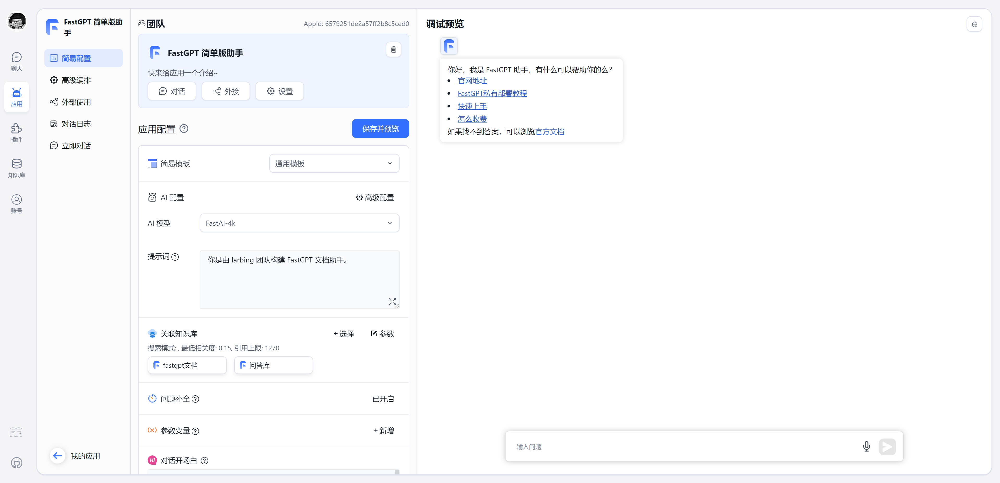
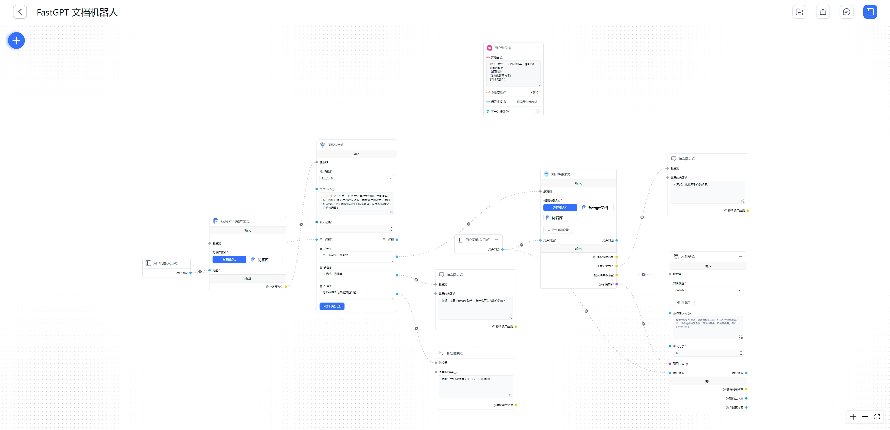
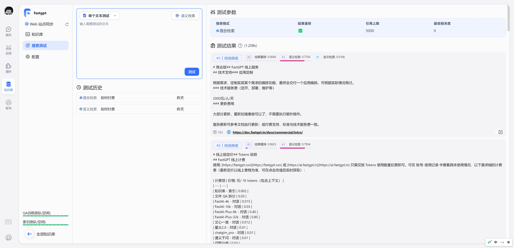
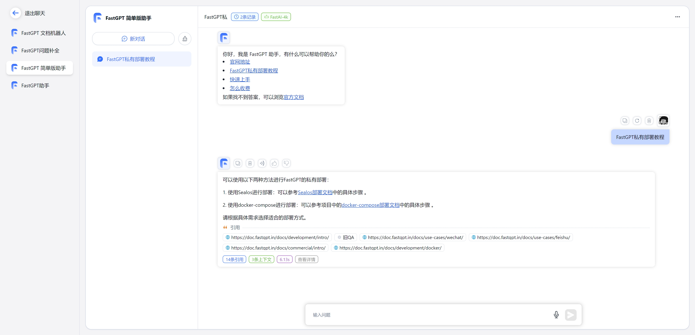

# FastGPT

  <a href="./README_en.md">English</a> |
  <a href="./README.md">简体中文</a> |
  <a href="./README_ja.md">日语</a>

FastGPT 是一个 AI Agent 构建平台，提供开箱即用的数据处理、模型调用等能力，同时可以通过 Flow 可视化进行工作流编排，从而实现复杂的应用场景！

  
  
  
  

https://github.com/labring/FastGPT/assets/15308462/7d3a38df-eb0e-4388-9250-2409bd33f6d4

## 🛸 在线使用

- 🌍 国际版：[fastgpt.io](https://fastgpt.io/)

|                                    |                                    |
| ---------------------------------- | ---------------------------------- |
|  |  |
|  |  |

## 💡 RoadMap

`1` 应用编排能力
   - [x] 对话工作流、插件工作流，包含基础的 RPA 节点。
   - [x] 用户交互
   - [x] 双向 MCP 
   - [ ] Agent 模式
   - [ ] AI 生成工作流

`2` 应用调试能力
   - [x] 知识库单点搜索测试
   - [x] 对话时反馈引用并可修改与删除
   - [x] 完整调用链路日志
   - [x] 应用评测
   - [ ] 高级编排 DeBug 调试模式
   - [ ] 应用节点日志

`3` 知识库能力
   - [x] 多库复用，混用
   - [x] chunk 记录修改和删除
   - [x] 支持手动输入，直接分段，QA 拆分导入
   - [x] 支持 txt，md，html，pdf，docx，pptx，csv，xlsx (有需要更多可 PR file loader)，支持 url 读取、CSV 批量导入
   - [x] 混合检索 & 重排
   - [x] API 知识库
   - [ ] RAG 模块热插拔
  
`4` OpenAPI 接口
   - [x] completions 接口 (chat 模式对齐 GPT 接口)
   - [x] 知识库 CRUD
   - [x] 对话 CRUD
   - [ ] 自动化 OpenAPI 接口
  
`5` 运营能力
   - [x] 免登录分享窗口
   - [x] Iframe 一键嵌入
   - [x] 统一查阅对话记录，并对数据进行标注
   - [x] 应用运营日志
   
`6` 其他
   - [x] 可视化模型配置。
   - [x] 支持语音输入和输出 (可配置语音输入语音回答)
   - [x] 模糊输入提示
   - [x] 模板市场

## 👨‍💻 开发

项目技术栈：NextJs + TS + ChakraUI + MongoDB + PostgreSQL (PG Vector 插件)/Milvus

- **⚡ 快速部署**

  > 使用 [Sealos](https://sealos.io) 服务，无需采购服务器、无需域名，支持高并发 & 动态伸缩，并且数据库应用采用 kubeblocks 的数据库，在 IO 性能方面，远超于简单的 Docker 容器部署。

  [点击查看 Sealos 一键部署 FastGPT 教程](https://doc.fastgpt.io/docs/introduction/development/sealos/)

* [快速开始本地开发](https://doc.fastgpt.io/docs/introduction/development/intro/)
* [部署 FastGPT](https://doc.fastgpt.io/docs/introduction/development/sealos/)
* [系统配置文件说明](https://doc.fastgpt.io/docs/introduction/development/configuration/)
* [多模型配置方案](https://doc.fastgpt.io/docs/introduction/development/modelConfig/one-api/)
* [版本更新/升级介绍](https://doc.fastgpt.io/docs/upgrading)
* [OpenAPI API 文档](https://doc.fastgpt.io/docs/introduction/development/openapi/)
* [知识库结构详解](https://doc.fastgpt.io/docs/introduction/guide/knowledge_base/RAG/)

## 💪 相关项目

- [FastGPT-plugin](https://github.com/labring/fastgpt-plugin)
- [Laf：3 分钟快速接入三方应用](https://github.com/labring/laf)
- [Sealos：快速部署集群应用](https://github.com/labring/sealos)
- [One API：多模型管理，支持 Azure、文心一言等](https://github.com/songquanpeng/one-api)

## 🌿 第三方生态
- [PPIO 派欧云：一键调用高性价比的开源模型 API 和 GPU 容器](https://ppinfra.com/user/register?invited_by=VITYVU&utm_source=github_fastgpt)
- [AI Proxy：国内模型聚合服务](https://sealos.run/aiproxy/?k=fastgpt-github/)
- [SiliconCloud (硅基流动) —— 开源模型在线体验平台](https://cloud.siliconflow.cn/i/TR9Ym0c4)

## 🏘️ 社区交流群

扫码加入飞书话题群：

## 👀 其他

- [保姆级 FastGPT 教程](https://www.bilibili.com/video/BV1n34y1A7Bo/?spm_id_from=333.999.0.0)
- [接入飞书](https://www.bilibili.com/video/BV1Su4y1r7R3/?spm_id_from=333.999.0.0)
- [接入企微](https://www.bilibili.com/video/BV1Tp4y1n72T/?spm_id_from=333.999.0.0)

## 🤝 参与贡献

我们非常欢迎各种形式的贡献。如果你对贡献代码感兴趣，可以查看我们的 GitHub [Issues](https://github.com/labring/FastGPT/issues?q=is%3Aissue+is%3Aopen+sort%3Aupdated-desc)，大展身手，向我们展示你的奇思妙想。

<a href="https://github.com/labring/FastGPT/graphs/contributors" target="_blank">
  <table>
    <tr>
      <th colspan="2">
           
      </th>
    </tr>
    <tr>
      <td>
        <picture>
          <source media="(prefers-color-scheme: dark)" srcset="https://next.ossinsight.io/widgets/official/compose-org-active-contributors/thumbnail.png?activity=active&period=past_28_days&owner_id=102226726&repo_ids=605673387&image_size=2x3&color_scheme=dark">
          
        </picture>****
      </td>
      <td rowspan="2">
        <picture>
          <source media="(prefers-color-scheme: dark)" srcset="https://next.ossinsight.io/widgets/official/compose-org-participants-growth/thumbnail.png?activity=new&period=past_28_days&owner_id=102226726&repo_ids=605673387&image_size=4x7&color_scheme=dark">
          
        </picture>
      </td>
    </tr>
    <tr>
      <td>
        <picture>
          <source media="(prefers-color-scheme: dark)" srcset="https://next.ossinsight.io/widgets/official/compose-org-active-contributors/thumbnail.png?activity=new&period=past_28_days&owner_id=102226726&repo_ids=605673387&image_size=2x3&color_scheme=dark">
          
        </picture>
      </td>
    </tr>
  </table>
</a>

## 🌟 Star History

<a href="https://github.com/labring/FastGPT/stargazers" target="_blank" style="display: block" align="center">
  <picture>
    <source media="(prefers-color-scheme: dark)" srcset="https://api.star-history.com/svg?repos=labring/FastGPT&type=Date&theme=dark" />
    <source media="(prefers-color-scheme: light)" srcset="https://api.star-history.com/svg?repos=labring/FastGPT&type=Date" />
    
  </picture>
</a>

## 使用协议

本仓库遵循 [FastGPT Open Source License](./LICENSE) 开源协议。

1. 允许作为后台服务直接商用，但不允许提供 SaaS 服务。
2. 未经商业授权，任何形式的商用服务均需保留相关版权信息。
3. 完整请查看 [FastGPT Open Source License](./LICENSE)
4. 联系方式：Dennis@sealos.io，[点击查看商业版定价策略](https://doc.fastgpt.io/docs/introduction/commercial/)
