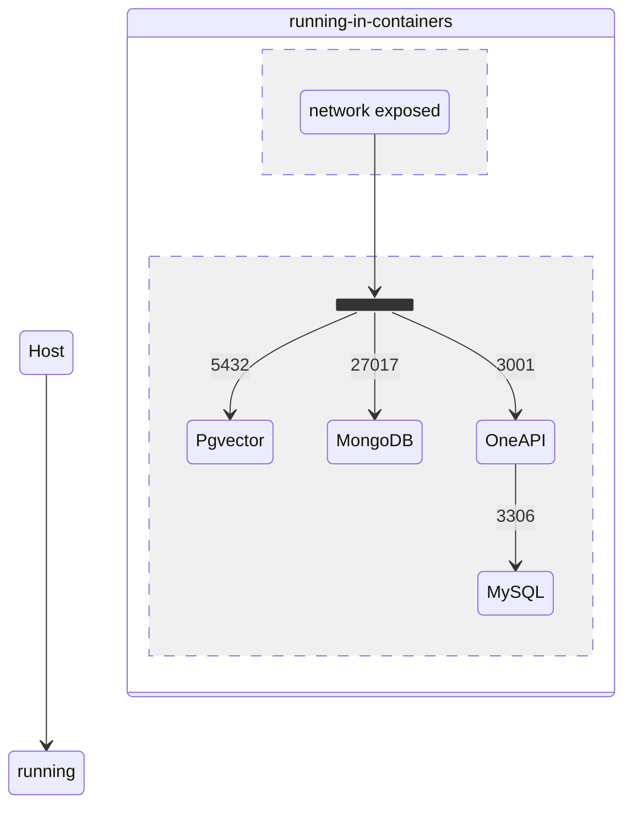

# ForkedFastGPT

Forked from https://github.com/fastgpt-org/fastgpt

## Architecture

1. 数据库层

PostgreSQL (fastgpt-pg)
- 用于向量数据存储
- 端口: 5432
- 持久化存储: ./pg/data

MongoDB (fastgpt-mongo)
- 用于主要业务数据存储
- 端口: 27017
- 配置为副本集模式(replSet rs0)
- 持久化存储: ./mongo/data

MySQL (fastgpt-mysql)
- 用于OneAPI的数据存储
- 端口: 3306
- 持久化存储: ./mysql

2. 应用层

FastGPT (fastgpt-app) | **开发环境处于宿主机**
- 端口: 3000
- 依赖: fastgpt-mongo, fastgpt-pg, fastgpt-sandbox
- 包含完整的业务逻辑

FastGPT Sandbox (fastgpt-sandbox) | **开发环境处于宿主机**
- 端口: 3030
- 提供代码执行环境
- 与主服务隔离运行

OneAPI (fastgpt-oneapi)
- 端口: 3001
- 提供AI模型API管理和代理
- 依赖: fastgpt-mysql

3. 网络配置

- 所有服务都在自定义网络 "fastgpt" 内
- 部分服务暴露端口到宿主机以供访问


## 0. First of all

### Create a `workspace` directory and Clone this repo.

```bash
$ mkdir -p /path/to/workspace && cd /path/to/workspace
$ git clone git@github.com:ericapaeus/ForkedFastGPT.git
```

> `fastgpt` and `sandbox` have been omitted from the `docker-compose.yml` file.

@see ./ForkedFastGPT/files/docker/docker-compose-pg-without-code.yml

### Copy it to the `workspace` directory.

```bash
$ cp ./ForkedFastGPT/files/docker/docker-compose-pg-without-code.yml ./docker-compose.yml
```

### Create data directories for volumes


```bash
# pg data directory
$ mkdir -p pg/data

# mongo data directory
$ mkdir -p mongo/data

# mysql data directory
$ mkdir -p mysql

# oneapi data directory
$ mkdir -p oneapi
```


## 1. Local Installation

### Run pgvector & mongodb & oneapi ...

```bash
$ docker compose up -d
```

Check the docker container status, fix some problems if necessary.

>
> oneapi initial username: `root`, password: `123456`
>

Then:



### Started to develop


**Configuration**

```bash
$ cp project/app/env.template project/app/.env.local
$ cp project/app/data/config.json project/app/data/config.local.json
```

Modify the `.env.local` file based on current environment.

>
> Check `https://doc.tryfastgpt.ai/docs/development/intro/#4-初始配置` for instructions.
>


```bash

……

```

@see ./ForkedFastGPT/dev.md

## 2. Deploy to the server


```bash
docker build -f ./projects/app/Dockerfile -t registry.cn-hangzhou.aliyuncs.com/fastgpt/fastgpt:v4.8.1 . --build-arg name=app
```

