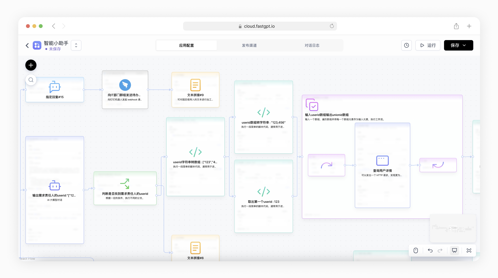

<div align="center">

<a href="https://fastgpt.io/"></a>

# FastGPT

<p align="center">
  <a href="./README_en.md">English</a> |
  <a href="./README.md">简体中文</a> |
  <a href="./README_id.md">Bahasa Indonesia</a> |
  <a href="./README_th.md">ไทย</a> |
  <a href="./README_vi.md">Tiếng Việt</a> |
  <a href="./README_ja.md">日本語</a>
</p>

FastGPT เป็นแพลตฟอร์มสำหรับสร้าง AI Agent ที่มีความสามารถพร้อมใช้งานสำหรับการประมวลผลข้อมูลและการเรียกใช้โมเดล นอกจากนี้ยังสามารถจัดระเบียบ workflow ผ่านการแสดงภาพ Flow เพื่อให้บรรลุสถานการณ์การใช้งานที่ซับซ้อนได้!

</div>

<p align="center">
  <a href="https://fastgpt.io/">
    
  </a>
  <a href="https://doc.fastgpt.io/docs/introduction">
    
  </a>
  <a href="https://doc.fastgpt.io/docs/introduction/development/intro">
    
  </a>
  <a href="/#-相关项目">
    
  </a>
</p>

https://github.com/labring/FastGPT/assets/15308462/7d3a38df-eb0e-4388-9250-2409bd33f6d4

## เริ่มต้นอย่างรวดเร็ว

คุณสามารถเริ่มต้น FastGPT ได้อย่างรวดเร็วโดยใช้ Docker รันคำสั่งต่อไปนี้ในเทอร์มินัลและทำตามคำแนะนำเพื่อดึงการกำหนดค่า:

```bash
# รันคำสั่งเพื่อดึงไฟล์การกำหนดค่า
bash <(curl -fsSL https://doc.fastgpt.cn/deploy/install.sh)
# เริ่มบริการ
docker compose up -d
```

เมื่อเริ่มต้นสมบูรณ์แล้ว คุณสามารถเข้าถึง FastGPT ที่ `http://localhost:3000` บัญชีเริ่มต้นคือ `root` และรหัสผ่านคือ `1234`

หากคุณพบปัญหา คุณสามารถ [ดูบทแนะนำการติดตั้ง Docker ฉบับสมบูรณ์](https://doc.fastgpt.io/docs/introduction/development/docker)

## 🛸 วิธีการใช้งาน

- **เวอร์ชันคลาวด์**  
  หากคุณไม่ต้องการติดตั้งแบบส่วนตัว คุณสามารถใช้บริการคลาวด์ของเราได้ที่: [fastgpt.io](https://fastgpt.io/)

- **เวอร์ชันโฮสต์ตัวเองของชุมชน**  
  คุณสามารถติดตั้งได้อย่างรวดเร็วโดยใช้ [Docker](https://doc.fastgpt.io/docs/introduction/development/docker) หรือใช้ [Sealos Cloud](https://doc.fastgpt.io/docs/introduction/development/sealos) เพื่อติดตั้ง FastGPT ด้วยคลิกเดียว

- **เวอร์ชันพาณิชย์**  
  หากคุณต้องการคุณสมบูรณ์มากขึ้นหรือการสนับสนุนบริการเชิงลึก คุณสามารถเลือก [เวอร์ชันพาณิชย์](https://doc.fastgpt.io/docs/introduction/commercial) นอกจากการให้ซอฟต์แวร์ที่สมบูรณ์ เรายังให้คำแนะนำการนำไปใช้สำหรับสถานการณ์เฉพาะ คุณสามารถส่ง[ปรึกษาธุรกิจ](https://fael3z0zfze.feishu.cn/share/base/form/shrcnjJWtKqjOI9NbQTzhNyzljc)

## 💡 คุณสมบัติหลัก

|                                    |                                    |
| ---------------------------------- | ---------------------------------- |
|  |  |
|  |  |

`1` ความสามารถในการจัดระเบียบแอปพลิเคชัน
   - [x] โหมด Agent วางแผน
   - [x] การทำงานแบบสนทนา การทำงานแบบปลั๊กอิน รวมถึงโหมด RPA พื้นฐาน
   - [x] การโต้ตอบกับผู้ใช้
   - [x] MCP สองทิศทาง
   - [ ] Assisted workflow generation

`2` ความสามารถในการแก้ไขข้อบกพร่องแอปพลิเคชัน
   - [x] การทดสอบการค้นหาฐานความรู้แบบจุดเดียว
   - [x] ข้อมูลอ้างอิงระหว่างการสนทนาพร้อมความสามารถในการแก้ไขและลบ
   - [x] บันทึกห่วงโซ่การเรียกใช้แบบสมบูรณ์
   - [x] การประเมินแอปพลิเคชัน
   - [ ] โหมด debug DeBug การจัดระเบียบขั้นสูง
   - [ ] บันทึกโหมดแอปพลิเคชัน

`3` ความสามารถของฐานความรู้
   - [x] การใช้ฐานข้อมูลหลายฐานซ้ำและผสม
   - [x] การแก้ไขและลบบันทึก chunk
   - [x] รองรับการป้อนข้อมูลด้วยตนเอง การแบ่งส่วนโดยตรง การนำเข้า QA แบบแยก
   - [x] รองรับ txt, md, html, pdf, docx, pptx, csv, xlsx (เพิ่มเติมได้โดย PR), รองรับการอ่าน URL และการนำเข้า CSV จำนวนมาก
   - [x] Hybrid retrieval & reranking
   - [x] ฐานความรู้ API
   - [ ] การสลับโมดูล RAG แบบร้อน

`4` อินเทอร์เฟซ OpenAPI
   - [x] อินเทอร์เฟซ completions (สอดคล้องกับโหมดแชท GPT)
   - [x] CRUD ฐานความรู้
   - [x] CRUD การสนทนา
   - [x] อินเทอร์เฟซ OpenAPI อัตโนมัติ

`5` ความสามารถในการดำเนินงาน
   - [x] หน้าต่างแชร์โดยไม่ต้องเข้าสู่ระบบ
   - [x] การฝัง Iframe คลิกเดียว
   - [x] การตรวจสอบบันทึกการสนทนาแบบรวมพร้อมการใส่อักษรข้อมูล
   - [x] บันทึกการดำเนินงานแอปพลิเคชัน

`6` อื่นๆ
   - [x] การกำหนดค่าโมเดลภาพ
   - [x] รองรับการป้อนเสียงและเอาต์พุต (กำหนดค่าได้)
   - [x] เคล็ดลับการป้อนข้อมูลแบบเลือนลาง
   - [x] ตลาดแม่แบบ

<a href="#readme">
    
</a>

## 💪 โปรเจกต์และลิงก์ของเรา

- [เริ่มต้น - การพัฒนาท้องถิ่น](https://doc.fastgpt.io/docs/introduction/development/intro/)
- [เอกสาร OpenAPI](https://doc.fastgpt.io/docs/openapi/intro)
- [FastGPT-plugin](https://github.com/labring/fastgpt-plugin)
- [AI Proxy: บริการ Load Balancing การรวมโมเดล](https://github.com/labring/aiproxy)
- [Laf: เข้าถึงแอปพลิเคชันของบุคคลที่สามใน 3 นาที](https://github.com/labring/laf)
- [Sealos: การติดตั้งแอปพลิเคชันคลัสเตอร์อย่างรวดเร็ว](https://github.com/labring/sealos)

<a href="#readme">
    
</a>

## 🌿 ระบบนิเวศของบุคคลที่สาม

- [AI Proxy: บริการรวมโมเดลขนาดใหญ่](https://sealos.run/aiproxy/?k=fastgpt-github/)
- [SiliconCloud - แพลตฟอร์มประสบการณ์โมเดล Open Source ออนไลน์](https://cloud.siliconflow.cn/i/TR9Ym0c4)
- [PPIO: เรียกใช้ API โมเดล Open Source และ GPU Container คุ้มค่า](https://ppinfra.com/user/register?invited_by=VITYVU&utm_source=github_fastgpt)

<a href="#readme">
    
</a>

## 🏘️ ชุมชน

เข้าร่วมกลุ่ม Feishu ของเรา:


<a href="#readme">
    
</a>

## 🤝 ผู้มีส่วนร่วม

เรายินดีต้อนรับการมีส่วนร่วมในรูปแบบต่างๆ หากคุณสนใจการมีส่วนร่วมในโค้ด ดู [Issues บน GitHub](https://github.com/labring/FastGPT/issues?q=is%3Aissue+is%3Aopen+sort%3Aupdated-desc) ของเราและแสดงความคิดที่ยอดเยี่ยมของคุณ!

<a href="https://github.com/labring/FastGPT/graphs/contributors" target="_blank">
  <table>
    <tr>
      <th colspan="2">
        <br><br><br>
      </th>
    </tr>
    <tr>
      <td>
        <picture>
          <source media="(prefers-color-scheme: dark)" srcset="https://next.ossinsight.io/widgets/official/compose-org-active-contributors/thumbnail.png?activity=active&period=past_28_days&owner_id=102226726&repo_ids=605673387&image_size=2x3&color_scheme=dark">
            
        </picture>
      </td>
      <td rowspan="2">
        <picture>
          <source media="(prefers-color-scheme: dark)" srcset="https://next.ossinsight.io/widgets/official/compose-org-participants-growth/thumbnail.png?activity=new&period=past_28_days&owner_id=102226726&repo_ids=605673387&image_size=4x7&color_scheme=dark">
            
        </picture>
      </td>
    </tr>
    <tr>
      <td>
        <picture>
          <source media="(prefers-color-scheme: dark)" srcset="https://next.ossinsight.io/widgets/official/compose-org-active-contributors/thumbnail.png?activity=new&period=past_28_days&owner_id=102226726&repo_ids=605673387&image_size=2x3&color_scheme=dark">
            
        </picture>
      </td>
    </tr>
  </table>
</a>

## 🌟 Star History

<a href="https://github.com/labring/FastGPT/stargazers" target="_blank" style="display: block" align="center">
  <picture>
    <source media="(prefers-color-scheme: dark)" srcset="https://api.star-history.com/svg?repos=labring/FastGPT&type=Date&theme=dark" />
    <source media="(prefers-color-scheme: light)" srcset="https://api.star-history.com/svg?repos=labring/FastGPT&type=Date" />
    
  </picture>
</a>

<a href="#readme">
    
</a>

## ใบอนุญาต

ที่เก็บนี้ปฏิบัติตาม [FastGPT Open Source License](./LICENSE) ใบอนุญาต open source

1. อนุญาตให้ใช้เชิงพาณิชย์เป็นบริการแบ็กเอนด์ แต่ไม่อนุญาตให้ให้บริการ SaaS
2. บริการเชิงพาณิชย์ใดๆ ที่ไม่มีการอนุญาตเชิงพาณิชย์ต้องเก็บข้อมูลลิขสิทธิ์ที่เกี่ยวข้องไว้
3. โปรดดู [FastGPT Open Source License](./LICENSE) สำหรับรายละเอียดฉบับเต็ม
4. ติดต่อ: Dennis@sealos.io, [ดูราคาพาณิชย์](https://doc.fastgpt.io/docs/introduction/commercial/)
