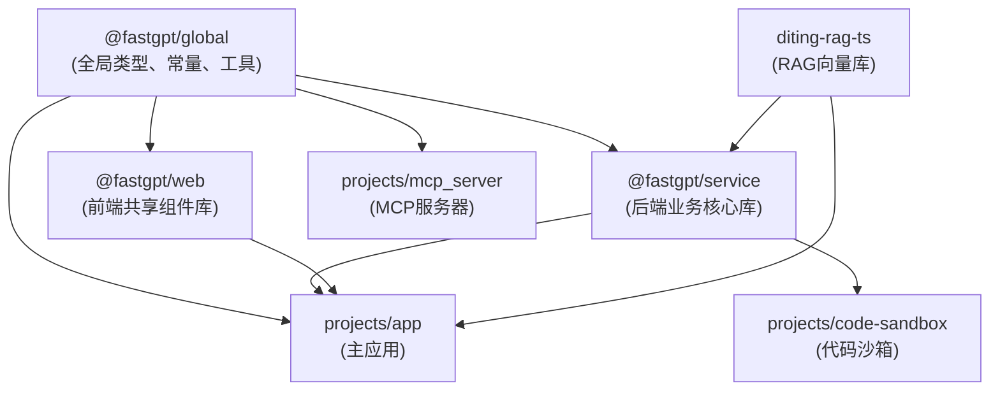

# FastGPT 仓库依赖

## 一、内部包依赖关系



### 依赖关系说明

| 包/项目 | 依赖 | 说明 |
|--------|------|------|
| **@fastgpt/global** | (无) | 核心公共库，定义全局类型、常量、工具函数，被所有包依赖 |
| **@fastgpt/service** | @fastgpt/global, diting-rag-ts | 后端业务核心库，包含数据库模型、业务逻辑、API控制器 |
| **@fastgpt/web** | @fastgpt/global | 前端共享组件库，包含React组件、hooks、样式、国际化 |
| **diting-rag-ts** | (无) | RAG向量库，独立库，主要供service和app使用 |
| **projects/app** | @fastgpt/global, @fastgpt/service, @fastgpt/web, diting-rag-ts | 主Next.js应用，集成前后端 |
| **projects/code-sandbox** | @fastgpt/service | 独立代码沙箱服务，依赖service提供的业务逻辑 |
| **projects/mcp_server** | @fastgpt/global | MCP协议服务器，主要依赖global提供的类型和工具定义 |

---

## 二、核心外部依赖

### 2.1 框架类

| 依赖 | 版本 | 用途 |
|------|------|------|
| **Next.js** | 16.2.1 | 主应用Web框架，支持SSR和API路由 |
| **React** | ^18 | UI库，函数式组件和Hooks |
| **Chakra UI** | ^2 | UI组件库，提供可访问性和主题系统 |
| **Emotion** | ^11 | CSS-in-JS库，Chakra UI的样式引擎 |
| **TypeScript** | ^5.9.3 | 静态类型检查 |

### 2.2 数据库 & 向量存储

| 依赖 | 版本 | 用途 |
|------|------|------|
| **Mongoose** | ^8.10.1 | MongoDB ODM，数据库模型和查询 |
| **TypeORM** | ^0.3.24 | PostgreSQL/MySQL ORM支持 |
| **pg** | ^8.10.0 | PostgreSQL驱动 |
| **@zilliz/milvus2-sdk-node** | 2.6.9 | Milvus向量数据库SDK |
| **ioredis** | ^5.6.0 | Redis客户端，缓存和队列 |

### 2.3 AI/ML & LLM相关

| 依赖 | 版本 | 用途 |
|------|------|------|
| **openai** | 4.104.0 | OpenAI SDK，LLM调用（覆盖OpenAI兼容API） |
| **@mariozechner/pi-ai** | ^0.67.3 | PI-Agent框架核心库 |
| **@mariozechner/pi-agent-core** | ^0.67.3 | PI-Agent核心执行引擎 |
| **@modelcontextprotocol/sdk** | ^1 | Model Context Protocol SDK |
| **tiktoken** | 1.0.17 | Token计数库（OpenAI） |
| **@langchain/langgraph** | ^0.2.0 | LangGraph工作流编排（diting-rag-ts包内使用）|
| **@ai-sdk/openai** | ^3.0.52 | AI SDK - OpenAI提供商（diting-rag-ts包内使用）|
| **@ai-sdk/anthropic** | ^3.0.69 | AI SDK - Anthropic提供商（diting-rag-ts包内使用）|

### 2.4 工具类

| 依赖 | 版本 | 用途 |
|------|------|------|
| **zod** | ^4 | 数据验证和Schema定义 |
| **axios** | 1.13.6 | HTTP客户端 |
| **dayjs** | 1.11.19 | 日期时间处理 |
| **nanoid** | ^5.1.3 | 生成唯一ID |
| **lodash** | 4.17.23 | 工具函数库 |
| **js-yaml** | ^4.1.1 | YAML解析和生成 |
| **json5** | ^2.2.3 | JSON5解析（宽松的JSON） |

### 2.5 文件处理 & 内容解析

| 依赖 | 版本 | 用途 |
|------|------|------|
| **pdfjs-dist** | 4.10.38 | PDF文件解析 |
| **mammoth** | ^1.11.0 | Word文档(.docx)解析 |
| **cheerio** | 1.0.0-rc.12 | HTML/XML解析 |
| **turndown** | ^7.1.2 | HTML转Markdown |
| **exceljs** | ^4.4.0 | Excel文件读写 |
| **jszip** | ^3.10.1 | ZIP文件处理 |
| **mime** | ^4.1.0 | MIME类型检测 |
| **papaparse** | 5.4.1 | CSV解析 |

### 2.6 状态管理 & 数据流

| 依赖 | 版本 | 用途 |
|------|------|------|
| **Zustand** | ^4.3.5 | 前端轻量级状态管理 |
| **@tanstack/react-query** | ^4.24.10 | 服务端数据同步和缓存 |
| **react-hook-form** | 7.43.1 | 表单管理 |
| **immer** | ^9.0.19 | 不可变状态更新 |

### 2.7 渲染 & 可视化

| 依赖 | 版本 | 用途 |
|------|------|------|
| **react-markdown** | ^9.0.1 | Markdown渲染 |
| **remark-gfm** | ^4.0.0 | GitHub Flavored Markdown支持 |
| **remark-math** | ^6.0.0 | 数学公式支持 |
| **rehype-katex** | ^7.0.0 | KaTeX数学公式渲染 |
| **echarts** | 5.4.1 | 数据可视化图表库 |
| **recharts** | ^2.15.0 | React图表库 |
| **mermaid** | ^10.9.4 | 流程图、UML渲染 |
| **reactflow** | ^11.7.4 | 可视化工作流编辑器 |

### 2.8 编辑器 & 代码处理

| 依赖 | 版本 | 用途 |
|------|------|------|
| **@monaco-editor/react** | ^4.7.0 | VS Code编辑器组件 |
| **lexical** | 0.12.6 | 富文本编辑器框架 |
| **react-syntax-highlighter** | ^15.5.0 | 代码高亮 |
| **esbuild** | ^0.25.11 | JavaScript打包和转译 |

### 2.9 存储 & CDN

| 依赖 | 版本 | 用途 |
|------|------|------|
| **minio** | 8.0.7 | MinIO S3兼容对象存储SDK |
| **@fastgpt-sdk/storage** | 0.6.15 | FastGPT统一存储SDK |
| **archiver** | ^7.0.1 | 文件压缩和打包 |

### 2.10 队列 & 异步任务

| 依赖 | 版本 | 用途 |
|------|------|------|
| **bullmq** | ^5.52.2 | Redis任务队列 |
| **node-cron** | ^3.0.3 | 定时任务调度 |

### 2.11 国际化

| 依赖 | 版本 | 用途 |
|------|------|------|
| **i18next** | 23.16.8 | 国际化框架 |
| **next-i18next** | 15.4.2 | Next.js i18n插件 |
| **react-i18next** | 14.1.2 | React i18n绑定 |

### 2.12 服务器 & Web框架

| 依赖 | 版本 | 用途 |
|------|------|------|
| **hono** | ^4.7.6 | 轻量级Web框架（code-sandbox使用） |
| **express** | ^4 | Web服务器框架 |
| **http-proxy** | ^1.18.1 | HTTP代理 |

### 2.13 日志 & 监控

| 依赖 | 版本 | 用途 |
|------|------|------|
| **pino** | ^9.7.0 | 高性能日志库 |
| **winston** | ^3.17.0 | 日志聚合库 |
| **@opentelemetry/** | 各版本 | OpenTelemetry观测SDK |
| **@fastgpt-sdk/otel** | 0.1.2 | FastGPT集成的OTEL SDK |

### 2.14 其他工具

| 依赖 | 版本 | 用途 |
|------|------|------|
| **jsonwebtoken** | ^9.0.2 | JWT认证 |
| **multer** | 2.1.0 | 文件上传中间件 |
| **cookie** | ^0.7.1 | Cookie处理 |
| **request-ip** | ^3.3.0 | 获取客户端IP |
| **dotenv** | ^16.5.0 | 环境变量加载 |
| **@node-rs/jieba** | 2.0.1 | 中文分词库 |

---

## 三、版本约束

### 3.1 Node.js & Package Manager

| 依赖 | 最低版本 | 说明 |
|------|--------|------|
| **Node.js** | >=20 | 支持最新ES特性、async/await、Worker Threads等 |
| **pnpm** | 9.x | Monorepo包管理器，相比npm更高效 |

### 3.2 核心框架版本一览

| 框架 | 版本 | 发布时间 |
|------|------|--------|
| **Next.js** | 16.2.1 | 2025年1月（最新版本） |
| **React** | ^18 | 支持18.x系列（含最新） |
| **TypeScript** | ^5.9.3 | 支持5.9+版本 |
| **Chakra UI** | ^2 | 支持2.x系列 |
| **Mongoose** | ^8.10.1 | 支持8.x版本 |

---

## 四、依赖安装说明

### 4.1 安装所有依赖

```bash
# 使用pnpm安装根目录及所有workspace依赖
pnpm install

# 或仅安装特定workspace的依赖
cd projects/app && pnpm install
```

### 4.2 执行根目录脚本

```bash
# 运行所有项目的代码格式化
pnpm format-code

# 运行ESLint检查并自动修复
pnpm lint

# 运行所有测试
pnpm test

# 生成Chakra UI主题类型定义
pnpm gen:theme-typings
```

### 4.3 开发特定项目

```bash
# 启动主应用开发服务器
cd projects/app && pnpm dev

# 启动代码沙箱（监视模式）
cd projects/code-sandbox && pnpm dev

# 启动MCP服务器
cd projects/mcp_server && bun dev
```

### 4.4 Workspace工作流

```bash
# 在根目录执行命令作用于所有packages
pnpm -r lint

# 仅作用于特定package（例如@fastgpt/service）
pnpm --filter @fastgpt/service test

# 查看workspace包列表
pnpm list -r --depth 0
```

### 4.5 依赖版本管理

- **Catalog定义**：`pnpm-workspace.yaml`中的`catalog`字段定义了公共版本
- **导入方式**：各package.json通过`catalog:`前缀指定版本
- **示例**：
  ```json
  {
    "dependencies": {
      "axios": "catalog:",
      "next": "catalog:",
      "zod": "catalog:"
    }
  }
  ```

---

## 五、特殊依赖说明

### 5.1 PI-Agent框架集成

FastGPT集成了@mariozechner/pi-ai和pi-agent-core，提供高级Agent推理能力：

```json
{
  "@mariozechner/pi-ai": "^0.67.3",
  "@mariozechner/pi-agent-core": "^0.67.3"
}
```

这些依赖在`FastGPT/packages/service/core/workflow/dispatch/ai/agent/`中使用，支持PI-Agent执行和工具调用。

### 5.2 Milvus向量数据库支持

向量存储支持多种方案：
- **Milvus**（推荐）：通过`@zilliz/milvus2-sdk-node`
- **PostgreSQL pgVector**：通过`pg`驱动
- **配置位置**：`FastGPT/packages/service/core/dataset/database/clientManager.ts`

### 5.3 文件处理能力

完整的文件处理工具链：
- PDF、Word、Excel、CSV等文档格式
- HTML转Markdown
- 内容提取和解析
- 详见`FastGPT/packages/service/common/`下的对应模块

### 5.4 API客户端兼容性

支持多个LLM提供商通过统一接口：
- OpenAI兼容API
- 通过`axios`进行HTTP请求
- 模型配置在`FastGPT/packages/global/core/ai/provider.ts`

---

## 六、依赖图关键路径

### 前端依赖链
```
@fastgpt/web
  ├─> @fastgpt/global
  ├─> React + Chakra UI
  ├─> next-i18next
  └─> 编辑器类（lexical、monaco）
```

### 后端依赖链
```
@fastgpt/service
  ├─> @fastgpt/global
  ├─> Mongoose + MongoDB
  ├─> TypeORM + PostgreSQL
  ├─> Milvus + ioredis
  ├─> openai + pi-ai
  └─> 文件处理工具链
```

### 应用依赖链
```
projects/app
  ├─> @fastgpt/global
  ├─> @fastgpt/service
  ├─> @fastgpt/web
  ├─> diting-rag-ts
  └─> 可视化库（echarts、mermaid、reactflow）
```

---

## 七、依赖更新指南

### 7.1 更新Catalog中的依赖

编辑`pnpm-workspace.yaml`的`catalog`字段，然后：

```bash
# 更新pnpm-lock.yaml
pnpm install

# 运行测试确保兼容性
pnpm test
```

### 7.2 添加新的外部依赖

```bash
# 添加到特定package
cd packages/global && pnpm add zod@latest

# 或通过workspace过滤
pnpm --filter @fastgpt/global add zod@latest
```

### 7.3 检查依赖安全漏洞

```bash
# 使用pnpm audit
pnpm audit

# 修复已知漏洞
pnpm audit --fix
```

---

## 八、与Docker部署的关系

详见`FastGPT/deploy/`目录下的配置：

| 配置文件 | 涉及依赖 | 实际位置 |
|---------|---------|---------|
| `docker-compose.pg.yml` | PostgreSQL + pgVector容器（TypeORM + pg依赖） | `FastGPT/deploy/docker/{cn,global}/` |
| `docker-compose.milvus.yml` | Milvus容器配置（@zilliz/milvus2-sdk-node依赖） | `FastGPT/deploy/docker/{cn,global}/` |
| `Dockerfile.app` | 主应用镜像，包含所有生产依赖 | `FastGPT/`（根目录） |

---

## 九、常见问题排查

### Q: 如何解决依赖冲突？
A: 检查`FastGPT/package.json`的`pnpm.peerDependencyRules`字段，FastGPT已配置OpenAI的zod版本兼容规则。

### Q: Catalog版本与直接版本号的区别？
A: Catalog用于统一多个package的相同依赖版本，避免版本分散。

### Q: 如何确保开发和生产依赖一致？
A: 运行`pnpm install`会生成`pnpm-lock.yaml`锁定版本，提交到Git确保一致性。

---

**最后更新**: 2026年5月  
**Node.js版本要求**: >=20  
**pnpm版本要求**: 9.x
