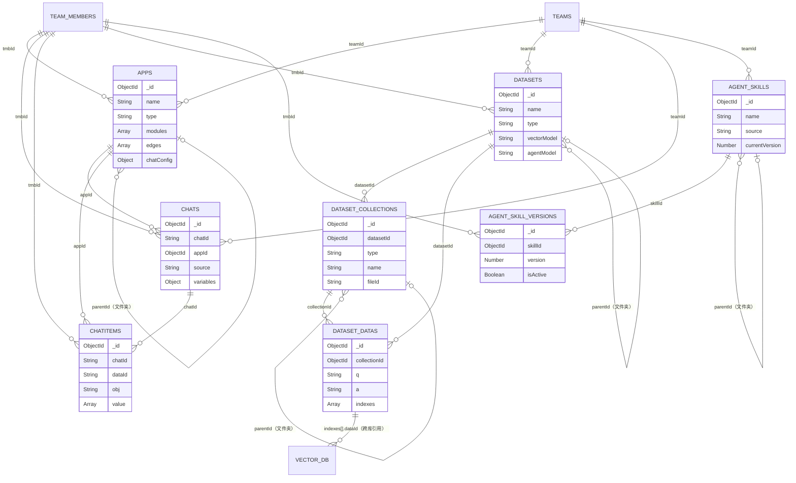

# 数据结构

## 一、数据库概述

FastGPT 采用多种存储技术的组合方案，各司其职：

| 存储技术 | 用途 |
|---------|------|
| **MongoDB** | 主业务数据库，存储 App、Chat、Dataset、User 等全部业务实体 |
| **PostgreSQL + pgvector** | 向量数据存储，支持 HNSW 索引的高性能相似度检索（默认向量库） |
| **Milvus** | 可选向量数据库，支持 2.6+ 版本的混合检索（向量 + BM25 全文） |
| **Redis** | 缓存、消息队列（BullMQ 基于 Redis 实现任务调度） |

**MongoDB 集合命名规范**:
- 集合名使用小写 + 下划线命名（snake_case），如 `dataset_collections`、`agent_skills`
- 每个集合的 CollectionName 常量定义在对应的 `schema.ts` 文件中
- 注册模型使用 `getMongoModel<T>(collectionName, schema)` 工具函数（见 `FastGPT/packages/service/common/mongo/index.ts`）

---

## 二、MongoDB 核心数据模型

### 集合总览

| 集合名 | CollectionName 常量 | Schema 文件 | 说明 |
|--------|---------------------|-------------|------|
| `apps` | `AppCollectionName` | `core/app/schema.ts` | 应用 |
| `chats` | `chatCollectionName` | `core/chat/chatSchema.ts` | 对话会话 |
| `chatitems` | `ChatItemCollectionName` | `core/chat/chatItemSchema.ts` | 对话消息 |
| `chat_corrections` | `ChatCorrectionCollectionName` | `core/chat/correction/schema.ts` | 对话纠错记录 |
| `app_versions` | `AppVersionCollectionName` | `core/app/version/schema.ts` | 应用发布版本 |
| `datasets` | `DatasetCollectionName` | `core/dataset/schema.ts` | 知识库 |
| `dataset_collections` | `DatasetColCollectionName` | `core/dataset/collection/schema.ts` | 知识库集合 |
| `dataset_datas` | `DatasetDataCollectionName` | `core/dataset/data/schema.ts` | 知识库数据项 |
| `dataset_data_texts` | `DatasetDataTextCollectionName` | `core/dataset/data/dataTextSchema.ts` | 全文检索文本 |
| `dataset_trainings` | `DatasetTrainingCollectionName` | `core/dataset/training/schema.ts` | 训练队列 |
| `dataset_collection_tags` | `DatasetCollectionTagsName` | `core/dataset/tag/schema.ts` | 集合标签 |
| `dataset_synonyms` | `DatasetSynonymCollectionName` | `core/dataset/synonym/schema.ts` | 同义词文件 |
| `dataset_synonym_mappings` | `DatasetSynonymMappingCollectionName` | `core/dataset/synonym/mappingSchema.ts` | 同义词映射 |
| `agent_skills` | `agentSkillsCollectionName` | `core/agentSkills/schema.ts` | Agent 技能 |
| `agent_skills_versions` | `agentSkillsVersionCollectionName` | `core/agentSkills/schema.ts` | 技能版本 |
| `system_models` | — | — | AI 模型配置 |
| `llm_request_records` | — | — | LLM 请求记录 |

### App（应用）

```
集合名：apps
用途：存储用户创建的 AI 应用，包含工作流节点、边和聊天配置
索引：
  - { teamId, updateTime }
  - { teamId, type }
  - { scheduledTriggerConfig, scheduledTriggerNextTime }（partial，仅定时触发类）
  - { type }、{ deleteTime }、{ name }

关键字段：
  - _id: ObjectId - 应用唯一 ID
  - parentId: ObjectId | null - 父文件夹 ID（树形层级）
  - teamId: ObjectId - 所属团队 ID（关联 teams 集合）
  - tmbId: ObjectId - 创建者团队成员 ID（关联 team_members 集合）
  - name: String - 应用名称
  - type: String - 应用类型（folder | toolFolder | simple | chatAgent | workflow(advanced) | workflowTool(plugin) | mcpToolSet(toolSet) | httpToolSet | hidden；已废弃: tool | httpPlugin | assistant）
  - version: String - 版本标记（v1 | v2）
  - avatar: String - 应用图标路径
  - intro: String - 应用简介
  - templateId: String - 来源模板 ID（从模板创建时有值）
  - updateTime: Date - 最后更新时间
  - modules: Array<StoreNodeItemType> - 工作流节点列表（存储图节点配置）
  - edges: Array<StoreEdgeItemType> - 工作流边列表（连接关系）
  - chatConfig: Object - 聊天配置（欢迎语、变量、TTS、问题引导等）
  - pluginData: Object - 插件专属配置（pluginUniId、apiSchemaStr、customHeaders）
  - scheduledTriggerConfig: Object - 定时触发配置（cronString、timezone、defaultPrompt）
  - scheduledTriggerNextTime: Date - 下次触发时间
  - inheritPermission: Boolean - 是否继承父级权限
  - favourite: Boolean - 是否收藏
  - quick: Boolean - 是否快速访问
  - deleteTime: Date | null - 软删除时间（null 表示未删除）

关联关系：
  - 自关联（parentId → _id，文件夹树形结构）
  - → teams（teamId）
  - → team_members（tmbId）
  - ← chats（appId）
  - ← chatitems（appId）
  - ← datasets（通过工作流节点内的 datasetId 引用）
```

### ChatSession（对话会话）

```
集合名：chats（由 chatCollectionName 常量定义）
用途：存储用户与 App 的每一个对话会话，是 ChatItem 的容器
索引：
  - { chatId }
  - { appId, chatId }（唯一）
  - { tmbId, appId, deleteTime, top, updateTime }
  - { shareId, outLinkUid, updateTime }（partial）
  - { appId, updateTime }
  - { appId, tmbId, updateTime }（按成员查历史）
  - { appId, source, tmbId, updateTime }（API 清除历史）
  - { appId, outLinkUid, tmbId }（partial，分享链接清除历史）
  - { appId, hasGoodFeedback, updateTime }（partial）
  - { appId, hasBadFeedback, updateTime }（partial）
  - { appId, hasUnreadGoodFeedback, updateTime }（partial）
  - { appId, hasUnreadBadFeedback, updateTime }（partial）
  - { appId, errorCount, updateTime }（partial，errorCount > 0）
  - { chatGenerateStatus, updateTime }（partial，生成中状态）
  - { updateTime, teamId }（定时清理）
  - { teamId, updateTime }

关键字段：
  - _id: ObjectId - 会话 MongoDB ID
  - chatId: String - 业务层会话 ID（前端传入）
  - teamId: ObjectId - 所属团队
  - tmbId: ObjectId - 发起对话的团队成员
  - appId: ObjectId - 关联的 App
  - appVersionId: ObjectId - 关联的 App 版本（可选）
  - createTime: Date - 会话创建时间
  - updateTime: Date - 最后消息时间
  - title: String - 会话标题（默认"历史记录"）
  - customTitle: String - 用户自定义标题
  - top: Boolean - 是否置顶
  - source: String - 来源（test | online | share | api | cronJob | team | feishu | official_account | wecom | wechat | evaluation | mcp）
  - sourceName: String - 来源名称
  - shareId: String - 外部分享 ID
  - outLinkUid: String - 外链访问用户标识
  - variables: Object - 变量值（键值对）
  - variableList: Array - 变量定义列表
  - welcomeText: String - 欢迎语
  - pluginInputs: Array - Plugin 输入参数
  - metadata: Object - 扩展元数据
  - hasGoodFeedback: Boolean - 是否含好评（冗余字段，加速过滤）
  - hasBadFeedback: Boolean - 是否含差评
  - hasUnreadGoodFeedback: Boolean - 是否有未读好评
  - hasUnreadBadFeedback: Boolean - 是否有未读差评
  - errorCount: Number - 错误消息数量（冗余字段）
  - chatGenerateStatus: Number - 生成状态（generating | done | error）
  - hasBeenRead: Boolean - 是否已读
  - searchKey: String - 全文搜索关键词
  - deleteTime: Date | null - 软删除时间

关联关系：
  - → apps（appId）
  - → team_members（tmbId）
  - → teams（teamId）
  - ← chatitems（chatId）
```

### ChatItem（对话消息）

```
集合名：chatitems（由 ChatItemCollectionName 常量定义）
用途：存储每条具体的聊天消息，包括用户消息和 AI 回复
索引：
  - { appId, chatId, dataId }
  - { correctionId }
  - { appId, chatId, deleteTime }
  - { appId, chatId, _id }（降序，分页锚点）
  - { appId, chatId, obj, _id }（按角色过滤）

关键字段：
  - _id: ObjectId - 消息 MongoDB ID
  - teamId: ObjectId - 所属团队
  - tmbId: ObjectId - 所属团队成员
  - userId: ObjectId - 用户 ID（兼容旧版）
  - chatId: String - 所属会话 ID
  - dataId: String - 消息业务 ID（Nanoid 24位，前端引用唯一消息的标识）
  - appId: ObjectId - 所属 App
  - time: Date - 消息时间
  - hideInUI: Boolean - 是否在 UI 隐藏（内部系统消息）
  - obj: String - 消息角色（Human | AI | System）
  - value: Array<ChatItemValueItemType> - 消息内容数组
    - 文本：{ type: "text", text: { content: string } }
    - 文件：{ type: "file", file: { type, name, key, url } }
    - 推理：{ type: "reasoning", reasoning: { content: string } }
    - 工具：{ type: "tool", tools: [...] }
    - 交互：{ type: "interactive", interactive: {...} }
  - memories: Object - 节点记忆字段（Field Memory 功能）
  - errorMsg: String - 错误信息
  - durationSeconds: Number - AI 回复耗时（秒）
  - citeCollectionIds: [String] - 引用的知识库集合 ID 列表
  - userGoodFeedback: String - 用户好评内容
  - userBadFeedback: String - 用户差评内容
  - customFeedbacks: [String] - 自定义反馈列表
  - adminFeedback: Object - 管理员反馈（含 datasetId、collectionId、feedbackDataId、q、a）
  - isFeedbackRead: Boolean - 反馈是否已读
  - correctionId: ObjectId - 关联的纠错记录 ID
  - deleted: Boolean - 逻辑删除标记
  - deletedAt: Date - 删除时间
  - deletedBy: ObjectId - 删除操作者
  - deleteTime: Date | null - 软删除时间

关联关系：
  - → apps（appId）
  - → team_members（tmbId）
  - → chats（chatId，非 ref 外键，String 类型）
  - → chat_corrections（correctionId）
```

### Dataset（知识库）

```
集合名：datasets
用途：存储知识库元信息，包括类型、向量模型配置、分块策略等
索引：
  - { teamId }
  - { type }
  - { deleteTime }

关键字段：
  - _id: ObjectId - 知识库唯一 ID
  - parentId: ObjectId | null - 父文件夹 ID（树形结构）
  - teamId: ObjectId - 所属团队
  - tmbId: ObjectId - 创建者
  - type: String - 知识库类型（folder | dataset | websiteDataset | externalFile | apiDataset | feishu | yuque | database | structureDocument）
  - avatar: String - 图标
  - name: String - 知识库名称
  - intro: String - 简介
  - updateTime: Date - 更新时间
  - vectorModel: String - 向量化模型名称（如 text-embedding-3-small）
  - agentModel: String - 训练使用的 LLM 模型（如 gpt-4o-mini）
  - vlmModel: String - 视觉模型（图片索引用）
  - websiteConfig: Object - 网站类型配置（url、selector）
  - databaseConfig: Object - 数据库类型配置（clientType、host、port、database、user、password 等）
  - chunkSettings: Object - 分块策略配置（见 ChunkSettingsType）
  - inheritPermission: Boolean - 是否继承权限
  - permissionEffectScope: String - 权限效果范围（allChildren | onlyDirectChildren）
  - synonymFiles: [ObjectId] - 绑定的同义词文件 ID（当前最多 1 个）
  - apiDatasetServer: Object - API 数据集服务配置
  - deleteTime: Date | null - 软删除时间

关联关系：
  - 自关联（parentId → _id）
  - → teams（teamId）
  - ← dataset_collections（datasetId）
  - ← dataset_datas（datasetId）
```

### DatasetCollection（知识库集合）

```
集合名：dataset_collections
用途：知识库内的文件/资源集合，每个集合对应一个数据来源（文件、网页、API 等）
索引：
  - { teamId, fileId }
  - { teamId, datasetId, parentId, updateTime }
  - { teamId, datasetId, tags }
  - { tags.tagId }
  - { teamId, datasetId, createTime }
  - { datasetId, externalFileId }（唯一，partial）
  - { teamId, metadata.relatedImgId }
  - { deleteTime }

关键字段：
  - _id: ObjectId - 集合唯一 ID
  - parentId: ObjectId | null - 父集合 ID（文件夹结构）
  - teamId: ObjectId - 所属团队
  - tmbId: ObjectId - 创建者
  - datasetId: ObjectId - 所属知识库
  - type: String - 集合类型（folder | virtual | file | link | externalFile | apiFile | images | table）
  - name: String - 集合名称
  - tags: Array - 标签（支持旧版 ObjectId 数组和新版 { tagId, value } 对象数组）
  - createTime: Date - 创建时间
  - updateTime: Date - 更新时间
  - fileId: String - GridFS 或 S3 文件 key（本地文件类型）
  - rawLink: String - 原始网页链接（网页类型）
  - apiFileId: String - API 文件 ID
  - externalFileId: String - 外部文件 ID
  - rawTextLength: Number - 原始文本长度
  - hashRawText: String - 原始文本哈希（用于变更检测）
  - metadata: Object - 扩展元数据（webPageSelector、relatedImgId 等）
  - forbid: Boolean - 是否禁用（禁用后不参与检索）
  - inheritPermission: Boolean - 继承权限
  - permissionEffectScope: String - 权限效果范围
  - customPdfParse: Boolean - 是否使用自定义 PDF 解析
  - tableSchema: Object - 数据库表结构（数据库类型集合，含 tableName、columns、foreignKeys 等）
  - deleteTime: Date | null - 软删除时间
  - [ChunkSettings]: 继承自 Dataset 的所有分块策略字段（trainingType、chunkSize 等）

关联关系：
  - → datasets（datasetId）
  - → team_members（tmbId）
  - ← dataset_datas（collectionId）
```

### DatasetData（知识库数据项）

```
集合名：dataset_datas
用途：存储知识库中的每条知识片段（chunk），包含原始问答文本和向量索引引用
索引：
  - { teamId, datasetId, collectionId, chunkIndex, updateTime }
  - { teamId, datasetId, collectionId, indexes.dataId }（按向量 ID 反查）
  - { rebuilding, teamId, datasetId }
  - { updateTime }

关键字段：
  - _id: ObjectId - 数据唯一 ID
  - teamId: ObjectId - 所属团队
  - tmbId: ObjectId - 创建者
  - datasetId: ObjectId - 所属知识库
  - collectionId: ObjectId - 所属集合
  - q: String - 问题/主文本（大 chunk 或问题）
  - a: String - 答案/补充内容
  - imageId: String - 关联图片 ID
  - imageDescMap: Object - 图片描述映射（图片 ID → 描述文本）
  - history: Array - 修改历史（含 q、a、updateTime）
  - metadata: Object - 扩展元数据
  - indexes: Array<DatasetDataIndexItemType> - 向量索引列表，每项包含：
      - type: String - 索引类型（default | custom | summary | question | image | column_des_index | column_val_index | hype | small2Big | correction）
      - dataId: String - 向量数据库中的记录 ID（pg 的 bigint ID，milvus 的 int64 ID）
      - text: String - 标准化后的索引文本
      - synonymMetadata: Object - 同义词转换元数据
      - synId: Number - 合成索引对 ID（0-4）
  - chunkIndex: Number - chunk 在集合中的序号
  - updateTime: Date - 更新时间
  - rebuilding: Boolean - 是否正在重建向量
  - synonymProcessing: String - 同义词处理状态（standardize | restore）
  - synonymFileIds: [String] - 需应用的同义词文件 ID

关联关系：
  - → datasets（datasetId）
  - → dataset_collections（collectionId）
  - → 向量数据库（indexes[].dataId，跨库引用）
```

### AgentSkill（Agent 技能）

```
集合名：agent_skills（由 agentSkillsCollectionName 常量定义）
用途：存储 Agent 技能的元信息，支持个人/系统技能的文件夹层级管理
索引：
  - { name, description }（全文索引）
  - { source, teamId, deleteTime, createTime }
  - { category }
  - { parentId, teamId, deleteTime }
  - { parentId, name, teamId, deleteTime }（唯一，partial：deleteTime=null 且 source=personal）

关键字段：
  - _id: ObjectId - 技能唯一 ID
  - parentId: ObjectId | null - 父文件夹 ID
  - type: String - 节点类型（skill | folder）
  - inheritPermission: Boolean - 继承权限
  - source: String - 来源（personal | system）
  - name: String - 技能名称
  - description: String - 技能描述
  - author: String - 作者
  - category: [String] - 分类标签（枚举值: search | tool | coding | data | analysis | communication | other）
  - config: Object - 技能配置数据
  - avatar: String - 图标 URL
  - teamId: ObjectId - 所属团队（个人技能）
  - tmbId: ObjectId - 所属成员
  - createTime: Date - 创建时间
  - updateTime: Date - 更新时间
  - deleteTime: Date | null - 软删除时间
  - currentVersion: Number - 当前版本号
  - versionCount: Number - 总版本数
  - currentStorage: Object - 当前版本存储信息（bucket、key、size）

关联关系：
  - 自关联（parentId → _id）
  - → teams（teamId）
  - ← agent_skill_versions（skillId）
```

### AgentSkillVersion（技能版本）

```
集合名：agent_skill_versions（由 agentSkillsVersionCollectionName 常量定义）
用途：存储技能的每个历史版本，版本内容以文件形式存储在对象存储（S3/MinIO）中
索引：
  - { skillId, isDeleted, version }（降序，列表查询）
  - { skillId, isActive }（快速查活跃版本）
  - { skillId, version }（唯一，防重复版本号）

关键字段：
  - _id: ObjectId - 版本唯一 ID
  - skillId: ObjectId - 所属技能 ID
  - tmbId: ObjectId - 发布版本的团队成员
  - version: Number - 版本号（递增整数）
  - versionName: String - 版本名称/描述
  - storage: Object - 版本文件存储信息
      - bucket: String - 存储桶名称
      - key: String - 文件路径 key
      - size: Number - 文件大小（字节）
      - checksum: String - 文件校验和
  - importSource: Object - 导入来源信息（originalFilename、importedAt）
  - isActive: Boolean - 是否为当前激活版本
  - isDeleted: Boolean - 是否已删除
  - createdAt: Date - 版本创建时间

关联关系：
  - → agent_skills（skillId）
  - → team_members（tmbId）
```

### AIModel（AI 模型配置）

```
集合名：system_models
用途：存储系统级 AI 模型配置，每条记录对应一个可用模型
索引：
  - { model }（唯一）

关键字段：
  - _id: ObjectId - 记录唯一 ID
  - model: String - 模型标识符（如 gpt-4o、text-embedding-3-small），唯一约束
  - metadata: Object - 模型元数据配置（完整的模型配置对象，结构由 AI Provider 定义）

关联关系：
  - 无直接外键；通过 model 字符串被 Dataset.vectorModel、App.chatConfig 等字段引用
```

### AIUsageRecord（LLM 请求记录）

```
集合名：llm_request_records
用途：存储 LLM API 请求和响应的完整记录，用于调试和问题追踪，有 TTL 自动清理
索引：
  - { requestId }（唯一）
  - createdAt 字段配置 TTL（默认保留 6 小时，由环境变量 LLM_REQUEST_TRACKING_RETENTION_HOURS 控制）

关键字段：
  - _id: ObjectId - 记录唯一 ID
  - requestId: String - 请求唯一标识（唯一约束）
  - body: Mixed - 完整的 LLM 请求体（原始 OpenAI 格式）
  - response: Mixed - 完整的 LLM 响应体
  - createdAt: Date - 请求时间（同时作为 TTL 过期字段）

关联关系：
  - 独立记录表，无外键关联
```

### DatasetTraining（训练队列）

```
集合名：dataset_trainings（DatasetTrainingCollectionName 常量）
用途：训练队列核心表，每条记录代表一个待执行的训练任务（chunk、QA、索引生成等）。Worker 通过 mode+retryCount+lockTime 排序拉取任务
索引：
  - { teamId, datasetId }（锁定训练数据、删除训练数据）
  - { mode, retryCount, lockTime, weight }（Worker 拉取任务排序）
  - { expireAt }（TTL，7 天后自动删除）

关键字段：
  - _id: ObjectId - 任务唯一 ID
  - teamId: ObjectId - 所属团队
  - tmbId: ObjectId - 创建者
  - datasetId: ObjectId - 所属知识库
  - collectionId: ObjectId - 所属集合
  - billId: String - 账单 ID
  - mode: TrainingModeEnum - 训练模式（chunk | qa | auto | image | hype | small2Big | ...）
  - dataId: ObjectId - 关联的 DatasetData._id（可选）
  - q: String - 问题/主文本
  - a: String - 答案/补充内容
  - imageId: String - 关联图片 ID
  - imageDescMap: Object - 图片描述映射
  - chunkIndex: Number - chunk 序号
  - indexSize: Number - 索引大小
  - weight: Number - 权重（排序用，越大越优先）
  - indexes: Array - 待生成的索引列表（不含 dataId，执行时分配）
  - dataMetadata: Object - 扩展元数据
  - expireAt: Date - 过期时间（默认 7 天，TTL 索引）
  - lockTime: Date - 锁定时间（Worker 抢占任务时更新）
  - retryCount: Number - 剩余重试次数（默认 5，耗尽的记录视为 error）
  - errorMsg: String - 错误信息

关联关系：
  - → datasets（datasetId）
  - → dataset_collections（collectionId）
  - → dataset_datas（dataId，可选）
```

### DatasetCollectionTags（集合标签）

```
集合名：dataset_collection_tags（DatasetCollectionTagsName 常量）
用途：知识库级别的标签定义，每个标签属于一个知识库，可被集合引用（通过 CollectionTagValueType.tagId）
索引：
  - { teamId, datasetId, tag }

关键字段：
  - _id: ObjectId - 标签唯一 ID
  - teamId: ObjectId - 所属团队
  - datasetId: ObjectId - 所属知识库
  - tag: String - 标签名称
  - tagType: String - 标签类型（string | number | datetime）

关联关系：
  - → datasets（datasetId）
  - ← dataset_collections（tags.tagId 引用）
```

### ChatCorrection（对话纠错）

```
集合名：chat_corrections（ChatCorrectionCollectionName 常量）
用途：存储用户对 AI 回复的纠错记录，包含问题、原始回答、修正后回答和引用的知识库片段
索引：
  - { appId }
  - { appId, chatId, dataId }
  - { chatId, appId, updateTime }
  - { teamId, updateTime }

关键字段：
  - _id: ObjectId - 纠错记录唯一 ID
  - dataId: String - 关联的 ChatItem.dataId
  - teamId: ObjectId - 所属团队
  - tmbId: ObjectId - 纠错者
  - userId: ObjectId - 用户 ID
  - chatId: String - 所属会话 ID
  - appId: ObjectId - 所属 App
  - correctionData: Object - 纠错数据
      - correctionMode: CorrectionModeEnum - 纠错模式
      - question: String - 用户问题
      - rawAnswer: String - 原始 AI 回答
      - correctedAnswer: String - 修正后回答
      - correctedQuoteList: Array - 修正后引用列表
      - indexs: Array - 索引信息
  - updateTime: Date - 更新时间

关联关系：
  - → apps（appId）
  - ← chatitems（correctionId 引用）
```

### AppVersion（应用版本）

```
集合名：app_versions（AppVersionCollectionName 常量）
用途：存储应用的每个发布版本，保存版本发布时的 nodes、edges、chatConfig 快照
索引：
  - { appId, time }（降序）

关键字段：
  - _id: ObjectId - 版本唯一 ID
  - tmbId: String - 发布者
  - appId: ObjectId - 所属 App
  - time: Date - 发布时间
  - nodes: Array - 版本发布时的工作流节点快照
  - edges: Array - 版本发布时的连线快照
  - chatConfig: Object - 版本发布时的聊天配置快照
  - isPublish: Boolean - 是否为正式发布版本
  - isAutoSave: Boolean - 是否为自动保存版本
  - versionName: String - 版本名称

关联关系：
  - → apps（appId）
  - ← chats（appVersionId 引用，会话关联到特定版本）
```

### DatasetSynonym（同义词文件）

```
集合名：dataset_synonyms（DatasetSynonymCollectionName 常量）
用途：存储上传到知识库的同义词 CSV 文件元数据
索引：
  - { datasetId }
  - { teamId }
  - { fileId }
  - { teamId, datasetId }
  - { uploadTime }（降序）

关键字段：
  - _id: ObjectId - 记录唯一 ID
  - teamId: ObjectId - 所属团队
  - datasetId: ObjectId - 所属知识库
  - fileName: String - 文件名
  - fileId: String - S3/MinIO 文件 key
  - size: Number - 文件大小（字节）
  - uploadTime: Date - 上传时间
  - uploaderId: ObjectId - 上传者

关联关系：
  - → datasets（datasetId）
  - ← dataset_synonym_mappings（synonymFileId）
```

### DatasetSynonymMapping（同义词映射）

```
集合名：dataset_synonym_mappings（DatasetSynonymMappingCollectionName 常量）
用途：存储标准化词到同义词数组的映射，支持 MongoDB 全文检索
索引：
  - { allTerms }（text 全文索引，权重 10）
  - { datasetId, standardizedTerm }
  - { synonymFileId }
  - { teamId, datasetId, standardizedTerm }
  - { createdTime }（降序）

关键字段：
  - _id: ObjectId - 记录唯一 ID
  - teamId: ObjectId - 所属团队
  - datasetId: ObjectId - 所属知识库
  - synonymFileId: ObjectId - 关联的同义词文件 ID
  - standardizedTerm: String - 标准化词
  - synonymTerms: String[] - 同义词数组
  - allTerms: String - 组合搜索字段（"{标准词} {同义词1} {同义词2}..."）
  - createdTime: Date - 创建时间
  - updatedTime: Date - 更新时间
```

---

## 三、Redis 数据结构

### Redis 基础设施

Redis 是 FastGPT 的缓存和消息队列基础设施。代码位于 `packages/service/common/redis/`。

**连接架构**:

| 文件 | 说明 |
|------|------|
| `config.ts` | Redis 配置解析，支持 standalone 和 cluster 双模式，从环境变量读取 |
| `connection.ts` | 连接管理，提供三种连接工厂函数 |
| `cluster.ts` | Cluster 模式下的 key 扫描工具 |
| `cache.ts` | 缓存读写工具 |
| `index.ts` | 统一导出入口 |

**三种 Redis 连接**:

| 连接函数 | 用途 | maxRetriesPerRequest |
|----------|------|---------------------|
| `getGlobalRedisConnection()` | 全局缓存连接，带 keyPrefix 自动前缀 | 3 |
| `newQueueRedisConnection()` | BullMQ Queue 连接 | 3 |
| `newWorkerRedisConnection()` | BullMQ Worker 连接 | null（必需） |

**Key 前缀规范**:

```
FASTGPT_REDIS_PREFIX = '{fastgpt}:'
```

所有业务 Key 自动添加此前缀。`{fastgpt}` 是 Redis Cluster 的 hash tag，确保同一业务的所有 key 落在同一 slot。

**Redis 配置环境变量**:

| 环境变量 | 说明 |
|----------|------|
| `REDIS_URL` | standalone 模式连接串（默认 `redis://localhost:6379`） |
| `REDIS_CLUSTER_NODES` | cluster 模式节点列表（格式 `host1:port1,host2:port2`） |
| `REDIS_PASSWORD` | Redis 密码 |
| `REDIS_CLUSTER_OPTIONS` | cluster 模式额外选项（JSON） |

**连接可靠性保障**:
- 指数退避重试策略（无限重试，最大间隔 2s）
- `READONLY`/`ECONNREFUSED`/`ETIMEDOUT`/`ECONNRESET` 错误自动重连
- 连接超时 10s，支持离线命令队列

---

## 四、消息队列（BullMQ）

BullMQ 是基于 Redis 的任务队列系统，代码位于 `packages/service/common/bullmq/`。

### QueueNames 枚举（19 个队列）

```typescript
export enum QueueNames {
  // === 数据集同步/训练 ===
  datasetSync = 'datasetSync',                   // 数据集同步
  rerankTrainDataGenerate = 'rerankTrainDataGenerate', // Rerank 训练数据生成
  rerankTrainTask = 'rerankTrainTask',           // Rerank 训练任务
  embeddingTrainDataGenerate = 'embeddingTrainDataGenerate', // Embedding 训练数据生成
  embeddingTrainTask = 'embeddingTrainTask',     // Embedding 训练任务

  // === 评测 ===
  evalDatasetDataQuality = 'evalDatasetDataQuality', // 数据质量评估
  evalDatasetDataSynthesize = 'evalDatasetDataSynthesize', // 数据合成评估
  evalTask = 'evalTask',                         // 评测任务
  evalTaskItem = 'evalTaskitem',                 // 评测任务项
  evaluationSummary = 'evaluationSummary',       // 评测汇总
  evaluation = 'evaluation',                     // 评测

  // === 文件操作 ===
  s3FileDelete = 's3FileDelete',                 // S3 文件删除
  collectionUpdate = 'collectionUpdate',         // 集合更新

  // === 删除队列 ===
  datasetDelete = 'datasetDelete',               // 知识库删除
  collectionDelete = 'collectionDelete',         // 集合删除
  appDelete = 'appDelete',                       // 应用删除
  teamDelete = 'teamDelete',                     // 团队删除

  // === 发布 ===
  wechatPoll = 'wechatPoll',                     // 微信公众号轮询

  /** @deprecated */
  websiteSync = 'websiteSync'                    // 网站同步（已废弃）
}
```

### 架构设计

- **Queue/Worker 全局单例**: 通过 `global.queues` 和 `global.workers` Map 维护全局单例
- **getQueue(name, opts)**: 创建或复用 Queue 实例
- **getWorker(name, processor, opts)**: 创建或复用 Worker 实例，Worker 关闭时自动重建
- **Cluster 模式**: Cluster 模式下 Queue/Worker 使用 `{bull}` hash tag prefix 确保 key 在同一 slot
- **Worker 配置**: `lockDuration=600s`, `stalledInterval=30s`, `maxStalledCount=3`, 完成后立即删除 job

---

## 五、向量数据结构

### PGVector 表结构

FastGPT 使用 PGVector 扩展在 PostgreSQL 中存储向量数据，共三张表：

**主知识库向量表（`modeldata` 表名由常量 DatasetVectorTableName 定义）**

| 字段 | 类型 | 说明 |
|------|------|------|
| id | BIGSERIAL PK | 自增主键，对应 DatasetData.indexes[].dataId |
| vector | VECTOR(1536) / HALFVEC(1536) | 向量数据（维度 1536，可选半精度节省空间） |
| team_id | VARCHAR(50) | 团队 ID |
| dataset_id | VARCHAR(50) | 知识库 ID |
| collection_id | VARCHAR(50) | 集合 ID |
| createtime | TIMESTAMP | 创建时间 |

索引：
- HNSW 向量索引（`vector_ip_ops` 内积度量，M 和 ef_construction 可配置）
- BTree 联合索引（team_id, dataset_id, collection_id）
- BTree 时间索引（createtime）

**数据库列描述向量表（DBDatasetVectorTableName）**

在主表基础上增加 `column_des_index VARCHAR(1024)` 字段，用于 Text2SQL 场景中存储数据库表列的描述信息向量。

**数据库列值示例向量表（DBDatasetValueVectorTableName）**

在主表基础上增加 `column_val_index VARCHAR(1024)` 字段，用于 Text2SQL 场景中存储数据库列的示例值向量。

### Milvus 集合结构

Milvus 使用与 PGVector 对应的相同三个集合，字段设计如下：

**基础字段（三个集合共用）**

| 字段 | 类型 | 说明 |
|------|------|------|
| id | Int64 PK | 手动指定 ID，与 MongoDB DatasetData.indexes[].dataId 对应 |
| vector | FloatVector(1536) | 稠密向量，维度 1536 |
| teamId | VarChar(64) | 团队 ID |
| datasetId | VarChar(64) | 知识库 ID |
| collectionId | VarChar(64) | 集合 ID |
| createTime | Int64 | 创建时间戳（毫秒） |
| text | VarChar(65535) | 原始文本（Milvus 2.6+ 支持，用于 BM25 全文检索输入） |
| sparse | SparseFloatVector | BM25 稀疏向量（Milvus 2.6+ 自动生成，用于全文检索） |
| metadata | JSON | 扩展元数据（Milvus 2.6+） |

**扩展字段（DBDatasetVectorTableName）**

| 字段 | 类型 | 说明 |
|------|------|------|
| columnDesIndex | VarChar(1024) | 数据库列描述文本 |

**扩展字段（DBDatasetValueVectorTableName）**

| 字段 | 类型 | 说明 |
|------|------|------|
| columnValIndex | VarChar(1024) | 数据库列示例值文本 |

**Milvus 索引配置**

| 字段 | 索引类型 | 度量 | 参数 |
|------|---------|------|------|
| vector | HNSW | IP（内积） | M=配置值, ef_construction=配置值 |
| teamId | Trie | - | 前缀树，字符串过滤 |
| datasetId | Trie | - | 前缀树，字符串过滤 |
| collectionId | Trie | - | 前缀树，字符串过滤 |
| createTime | STL_SORT | - | 时间范围过滤 |
| sparse | SPARSE_INVERTED_INDEX | BM25 | DAAT_MAXSCORE, k1=1.2, b=0.75 |

---

## 六、数据关系图（Mermaid）



---

## 七、重要类型定义

### App 相关类型

**`AppSchema`**（`FastGPT/packages/global/core/app/type.d.ts`）
```typescript
type AppSchema = {
  _id: string;
  parentId?: ParentIdType;        // 父文件夹 ID（树形层级）
  teamId: string;
  tmbId: string;
  type: AppTypeEnum;              // folder|toolFolder|simple|chatAgent|workflow(advanced)|workflowTool(plugin)|mcpToolSet(toolSet)|httpToolSet|hidden
  version?: 'v1' | 'v2';
  name: string;
  avatar: string;
  intro: string;                  // 应用简介
  templateId?: string;            // 来源模板 ID
  updateTime: Date;
  modules: StoreNodeItemType[];   // 工作流节点列表
  edges: StoreEdgeItemType[];     // 工作流连线列表
  pluginData?: { nodeVersion, pluginUniId, apiSchemaStr, customHeaders };
  chatConfig: AppChatConfigType;  // 聊天配置
  scheduledTriggerConfig?: AppScheduledTriggerConfigType;
  scheduledTriggerNextTime?: Date; // 下次定时触发时间
  inheritPermission?: boolean;     // 是否继承父级权限
  favourite?: boolean;             // 是否收藏
  quick?: boolean;                 // 是否快速访问
  deleteTime?: Date | null;        // 软删除

  /** @deprecated */
  defaultPermission?: number;
  /** @deprecated */
  inited?: boolean;
  /** @deprecated */
  teamTags: string[];
};
```

**`AppChatConfigType`**（聊天配置）
```typescript
type AppChatConfigType = {
  welcomeText?: string;                          // 欢迎语
  variables?: VariableItemType[];                // 用户填写的变量
  autoExecute?: AppAutoExecuteConfigType;        // 自动执行配置
  questionGuide?: AppQGConfigType;               // 问题引导
  ttsConfig?: AppTTSConfigType;                  // 文字转语音
  whisperConfig?: AppWhisperConfigType;          // 语音输入
  chatInputGuide?: ChatInputGuideConfigType;     // 输入引导
  fileSelectConfig?: AppFileSelectConfigType;    // 文件选择配置
  entryPoints?: EntryPointItemType[];            // 对话入口点
  instruction?: string;                          // Plugin 说明
};
```

**`StoreNodeItemType`**（工作流存储节点，`FastGPT/packages/global/core/workflow/type/node.ts`）
```typescript
// StoreNodeItemType = FlowNodeCommonTypeSchema + nodeId + position
// FlowNodeCommonTypeSchema 字段（共 23 个基础字段 + 2 个扩展字段）:
type StoreNodeItemType = {
  // === 基础标识 ===
  nodeId: string;                     // 节点唯一 ID
  flowNodeType: FlowNodeTypeEnum;     // 节点类型（aiChat | datasetSearch | httpRequest | ...）
  name: string;                       // 节点名称
  intro?: string;                     // 节点简介（模板列表展示）
  avatar?: string;                    // 节点图标
  avatarLinear?: string;              // 节点线性图标
  colorSchema?: NodeColorSchemaEnum;  // 颜色主题

  // === 版本信息 ===
  version?: string;                   // 版本号
  versionLabel?: string;              // 版本标签（仅 UI 展示）
  isLatestVersion?: boolean;          // 是否最新版本（仅 UI 展示）

  // === 画布位置 ===
  position?: { x: number; y: number };

  // === 端口配置 ===
  inputs: FlowNodeInputItemType[];    // 输入端口配置列表
  outputs: FlowNodeOutputItemType[];  // 输出端口配置列表

  // === 运行时配置 ===
  catchError?: boolean;               // 是否捕获错误继续执行
  showStatus?: boolean;               // 聊天响应中是否展示步骤状态
  abandon?: boolean;                  // 是否废弃节点

  // === 工具/插件配置 ===
  parentNodeId?: string;              // 父节点 ID（工具场景）
  toolDescription?: string;           // 工具描述
  toolConfig?: NodeToolConfigType;    // 工具配置（mcp/http/system tools）
  pluginId?: string;                  // 插件 ID
  isFolder?: boolean;                 // 是否为文件夹节点
  pluginData?: ToolDataSchema;        // 插件元数据（diagram, userGuide, status 等）

  // === 计费（计算字段，不存储） ===
  currentCost?: number;
  systemKeyCost?: number;
  hasTokenFee?: boolean;
  hasSystemSecret?: boolean;
};
```

### 聊天消息类型

**`ChatItemValueItemType`**（消息内容项，支持多种类型）
```typescript
// 用户消息内容
type UserChatItemValueItemType = {
  type: 'text' | 'file';
  text?: { content: string };
  file?: { type: ChatFileTypeEnum; name?: string; key?: string; url: string };
};

// AI 回复内容（多模态）
type AIChatItemValueItemType = {
  type: 'text' | 'reasoning' | 'tool' | 'interactive';
  text?: { content: string };
  reasoning?: { content: string };     // 思考过程（Reasoning 模型）
  tools?: ToolModuleResponseItemType[]; // 工具调用结果
  interactive?: WorkflowInteractiveResponseType; // 交互节点响应
};
```

### 知识库检索参数类型

**`AppDatasetSearchParamsType`**（`FastGPT/packages/global/core/app/type.d.ts`）
```typescript
type AppDatasetSearchParamsType = {
  searchMode: DatasetSearchModeEnum;       // embedding | fullTextRecall | mixedRecall
  limit?: number;                          // 最大返回 token 数
  similarity?: number;                     // 最低相似度阈值
  embeddingWeight?: number;                // 向量检索权重（混合模式）
  embeddingModel?: string;                 // 查询向量化模型
  usingReRank?: boolean;                   // 是否开启 Rerank
  rerankModel?: string;                    // Rerank 模型
  rerankMethod?: RerankMethodEnum;         // Rerank 方法
  rerankWeight?: number;                   // Rerank 结果权重
  datasetSearchUsingExtensionQuery?: boolean; // 是否扩展查询
  datasetSearchExtensionModel?: string;    // 查询扩展 LLM 模型
  collectionFilterMatch?: string;          // 集合标签过滤表达式
  retrievalMode?: DatasetRetrievalModeEnum; // 单轮 | 多轮智能检索
  agenticSearchLLMModel?: string;          // 多轮检索 LLM 模型
  agenticSearchRerankModel?: string;       // 多轮检索 Rerank 模型
  agenticSearchReasoning?: boolean;        // 是否输出思考过程
};
```

**`ChunkSettingsType`**（知识库分块策略配置，`FastGPT/packages/global/core/dataset/type.d.ts`）
```typescript
type ChunkSettingsType = {
  trainingType?: DatasetCollectionDataProcessModeEnum; // chunk | qa | imageParse | ...

  // === 分块触发 ===
  chunkTriggerType?: ChunkTriggerConfigTypeEnum;       // minSize | forceChunk | maxSize
  chunkTriggerMinSize?: number;                        // 最小触发分块 size

  // === 数据增强 ===
  dataEnhanceCollectionName?: boolean;                 // 自动添加集合名称到数据

  // === 索引增强 ===
  imageIndex?: boolean;                                // 图片索引
  autoIndexes?: boolean;                               // 自动生成索引
  indexPrefixTitle?: boolean;                          // 索引前缀标题
  hypeIndexes?: boolean;                               // 假设性问题索引（HyDE）
  small2bigIndexes?: boolean;                          // 小块关联大块索引
  syntheticIndex?: boolean;                            // 合成索引
  hypeIndexPrompt?: string;                            // 假设性问题生成 Prompt
  small2bigConfig?: small2bigConfigType;               // 小块关联大块配置
  autoIndexesPrompt?: string;                          // 自动索引生成 Prompt
  imageIndexPrompt?: string;                           // 图片索引生成 Prompt

  // === 分块参数 ===
  chunkSettingMode?: ChunkSettingModeEnum;             // auto | custom（系统参数 | 自定义）
  chunkSplitMode?: DataChunkSplitModeEnum;             // paragraph | size | char
  // 段落分割
  paragraphChunkAIMode?: ParagraphChunkAIModeEnum;     // auto | force | forbid
  paragraphChunkDeep?: number;                         // 段落深度
  paragraphChunkMinSize?: number;                      // 段落最小大小（过小则合并）
  // 按大小分割
  chunkSize?: number;                                  // 分块大小（Token 数）
  // 按字符分割
  chunkSplitter?: string;                              // 自定义分隔符
  indexSize?: number;                                  // 索引大小

  qaPrompt?: string;                                   // QA 生成 Prompt
};
```

**`SearchDataResponseItemType`**（知识库检索返回项，`FastGPT/packages/global/core/dataset/type.d.ts`）
```typescript
type SearchDataResponseItemType = {
  id: string;              // DatasetData._id
  datasetId: string;
  collectionId: string;
  sourceName: string;
  sourceId?: string;
  q: string;               // 主文本
  a?: string;              // 补充文本
  chunkIndex: number;
  updateTime: Date;
  score: { type: SearchScoreTypeEnum; value: number; index: number }[]; // 多路召回分数
  retrievalRank?: number;  // 进入 Reranker 前的排名
  synonymMappings?: SynonymMappingForPrompt[]; // 同义词映射
};
```

---

## 八、数据库变更记录

### MongoDB 变更管理

FastGPT 使用 Mongoose 管理 MongoDB schema，索引同步通过 `syncMongoIndex` 函数在模型加载时自动执行。

**索引同步** (`FastGPT/packages/service/common/mongo/index.ts`):
- 每个模型注册时自动调用 `model.syncIndexes({ background: true })`
- 通过 `SYNC_INDEX=0` 环境变量可禁用自动同步
- test 环境和 phase-production-build 阶段跳过同步

**软删除策略**:
- 大部分业务表使用 `deleteTime: Date | null` 字段实现软删除
- `null` 表示未删除，非 null 值为删除时间
- 查询时需过滤 `deleteTime: null`（或通过 partial index 自动过滤）

**版本兼容**:
- Schema 中标记 `@deprecated` 的字段保留但不再使用
- 新增字段通过 `{ default: ... }` 或 optional 保证向后兼容

---

## 九、如何添加新表

### 添加 MongoDB 新集合的步骤

以添加一个 `user_profiles` 集合为例：

**1. 定义 TypeScript 类型**（在 `packages/global/` 对应的 type 文件中）:
```typescript
// packages/global/.../type.ts
export type UserProfileSchemaType = {
  _id: string;
  teamId: string;
  userId: string;
  nickname: string;
  avatar: string;
  createTime: Date;
  updateTime: Date;
};
```

**2. 创建 Mongoose Schema 和 Model**（在 `packages/service/` 对应的目录）:
```typescript
// packages/service/core/user/profile/schema.ts
import { connectionMongo, getMongoModel } from '../../../common/mongo';
const { Schema } = connectionMongo;
import type { UserProfileSchemaType } from '@fastgpt/global/.../type';

export const UserProfileCollectionName = 'user_profiles';

const UserProfileSchema = new Schema({
  teamId: {
    type: Schema.Types.ObjectId,
    ref: 'teams',
    required: true
  },
  userId: {
    type: Schema.Types.ObjectId,
    ref: 'users',
    required: true
  },
  nickname: { type: String, default: '' },
  avatar: { type: String, default: '' },
  createTime: { type: Date, default: () => new Date() },
  updateTime: { type: Date, default: () => new Date() }
});

// 索引定义
try {
  UserProfileSchema.index({ userId: 1 }, { unique: true });
  UserProfileSchema.index({ teamId: 1, createTime: -1 });
} catch (error) {
  console.log('UserProfile index error:', error);
}

export const MongoUserProfile = getMongoModel<UserProfileSchemaType>(
  UserProfileCollectionName,
  UserProfileSchema
);
```

**3. 关键要点**:

| 要点 | 说明 |
|------|------|
| **CollectionName 常量** | 每个 schema 文件导出 `XxxCollectionName` 常量，集中管理集合名 |
| **getMongoModel** | 统一的模型注册函数，自动处理 model 复用、中间件注入、索引同步 |
| **ref 引用** | 外键字段使用 `ref: 'collection_name'`，关联已有的 CollectionName 常量 |
| **索引定义** | 用 `try/catch` 包裹，避免重复定义报错（开发热更新场景） |
| **soft delete** | 推荐使用 `deleteTime: Date | null` 模式实现软删除 |
| **addCommonMiddleware** | `getMongoModel` 自动注入慢查询日志（>500ms 警告，>2s 严重警告）、ObjectId 自动转 string |
