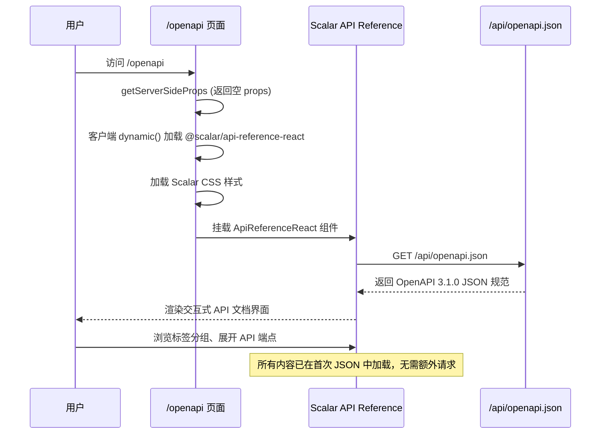

# OpenAPI 文档 — 业务流程详解

## 页面总览

OpenAPI 文档页面是 FastGPT 的 API 参考文档查看器。页面使用 Scalar API Reference 组件渲染 FastGPT 的 OpenAPI 3.1.0 规范，将后端定义的所有 API 路径、标签分组、请求参数 Schema 和响应格式以交互式 UI 展示。用户无需登录即可查看全部 API 文档。

### API 文档查阅

> 用户在浏览器中查看 FastGPT 平台 API 的完整参考文档，浏览各分组下的 API 端点详情。

#### 步骤 1：页面加载与组件初始化

| 用户操作 | 触发 API | 分支条件 | 页面变化 |
|---------|---------|---------|---------|
| 浏览器访问 `/openapi` 路径 | Next.js 服务端执行 `getServerSideProps`，返回空 props（禁用静态生成） | 无分支 | 服务端渲染阶段不加载 Scalar 组件 |
| 页面在客户端加载 | Next.js `dynamic()` 异步加载 `@scalar/api-reference-react` 及其 CSS | SSR 禁用（`ssr: false`），仅在客户端加载 | 加载期间页面空白；组件模块和样式加载完成后进入下一步 |
| Scalar 组件挂载 | `ApiReferenceReact` 组件内部请求 `GET /api/openapi.json`，获取 OpenAPI 规范 JSON | 无分支 | Scalar 组件解析 JSON 规范并渲染交互式 API 文档界面 |

#### 步骤 2：浏览 API 文档

| 用户操作 | 触发 API | 分支条件 | 页面变化 |
|---------|---------|---------|---------|
| 浏览左侧标签分组列表（应用管理、Agent 应用、AI 相关、知识库等） | 无需额外 API（所有数据已在首次加载的 OpenAPI JSON 中） | 无分支 | 左侧导航切换选中分组，右侧展示对应分组下的 API 端点列表 |
| 展开某个 API 端点详情 | 无需额外 API | 无分支 | 展示该端点的 HTTP 方法、路径、请求参数、响应 Schema 及示例 |
| 在 Scalar 界面中发送测试请求 | Scalar 组件直接向对应 API 端点发起请求（需提供认证信息） | 需要有效的 API Key（Bearer token）；未提供时 API 返回 401 | 展示请求结果（成功响应或错误信息） |

#### 步骤 3：页面交互特性

| 用户操作 | 触发 API | 分支条件 | 页面变化 |
|---------|---------|---------|---------|
| 页面深色/浅色模式 | 无需 API（深色模式切换按钮已通过 `hideDarkModeToggle: true` 配置隐藏） | 始终隐藏 | 无变化 |
| 客户端按钮 | 无需 API（客户端代码生成按钮已通过 `hideClientButton: true` 配置隐藏） | 始终隐藏 | 无变化 |
| 窗口大小调整 | 无需 API | 无分支 | Scalar 组件自适应窗口大小（页面容器 `w="100vw" h="100vh"`） |

## Mermaid 附录

