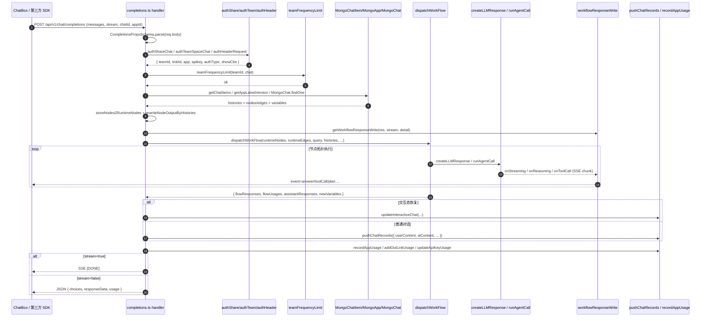
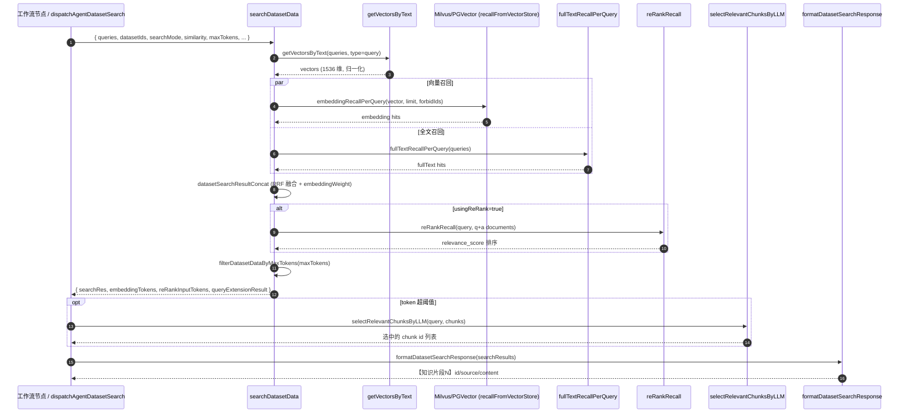
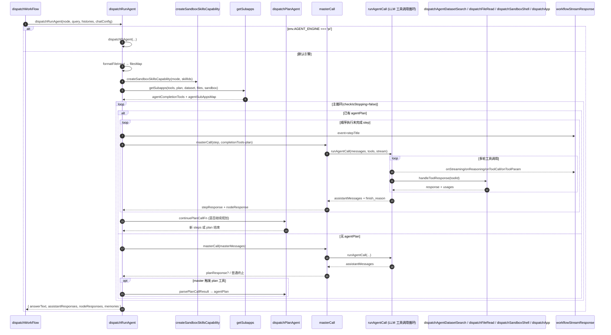
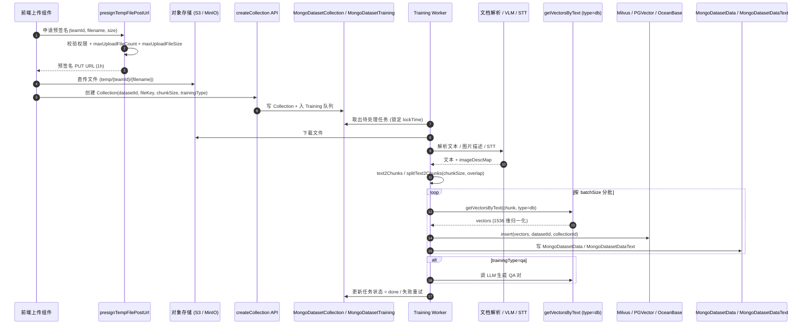
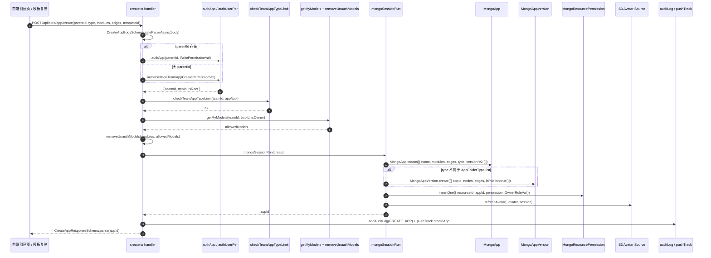

# FastGPT 业务流程详解

本文档对 FastGPT 的 5 个核心业务流程进行深度剖析，每个流程包含流程概述、关键代码分析、时序图和关键步骤说明。

---

## 一、对话流程（含流式响应）

### 1.1 流程概述

对话流程是 FastGPT 最核心的链路，将一条用户提问从前端 ChatBox 输入开始，经历认证、历史拼接、工作流调度、LLM 流式调用、SSE 推流、记录持久化等多个阶段，最终以流式或非流式形式返回给客户端。该流程同时承载 Web UI 对话、共享链接对话、团队空间对话以及外部系统通过 OpenAI 兼容 API 的接入。

主链路：

> 前端 ChatBox → `POST /api/v1/chat/completions` → 三种认证分支 → 频率限制 → 历史/版本/会话并行查询 → 构造 RuntimeNodes/Edges → `dispatchWorkFlow` → AI 节点 / Agent 节点调用 `createLLMResponse` → SSE 边推边写 → `pushChatRecords` 持久化 → `recordAppUsage` / `updateApiKeyUsage` → 响应结束。

### 1.2 深度分析

#### 1.2.1 API 入口（鉴权与请求体解析）

- 文件：`FastGPT/projects/app/src/pages/api/v1/chat/completions.ts`
- 通过 `CompletionsPropsSchema.parse(req.body)` 完成请求体解析与字段类型校验，关键字段包括 `chatId`、`appId`、`stream`、`detail`、`messages`、`variables`、`responseChatItemId`、`shareId`/`outLinkUid`/`teamId`/`teamToken`。
- 三种认证分支以 IIFE（立即执行 async 函数）形式选择：
  - `authShareChat`：分享链接（`shareId + outLinkUid`），调用 `authOutLinkChatStart` 校验外部链接、IP、问题，并尝试用 `authCert` 解析登录态以拿到 `userTmbId`，便于团队内分享场景维持权限上下文。
  - `authTeamSpaceChat`：团队空间（`teamId + teamToken`），通过 `authTeamSpaceToken` 校验 token 并按 `teamTags` 过滤可见 App。
  - `authHeaderRequest`：API Key 或浏览器 Token，通过 `authCert({ authToken: true, authApiKey: true })` 同时支持登录态与 OpenAI 兼容 Key。
- 三个认证分支统一返回 `AuthResponseType`，包含 `teamId`、`tmbId`、`app`、`authType`、`apikey`、`showCite`、`showRunningStatus`、`showSkillReferences`、`outLinkUserId`，对外屏蔽差异。
- 频率限制：`teamFrequencyLimit({ teamId, type: LimitTypeEnum.chat, res })` 在团队级别做 QPM 限制，命中后直接返回。
- 埋点：`pushTrack.teamChatQPM({ teamId })`。

#### 1.2.2 历史与版本并行获取

- 历史：`getChatItems({ appId, chatId, offset: 0, limit, field: 'obj value nodeOutputs' })`，限制由 `getMaxHistoryLimitFromNodes(app.modules)` 推导。
- 版本：`getAppLatestVersion(app._id, app)` 优先取最新发布版（`MongoAppVersion`），未发布回退到 App 本身的 `modules`/`edges` 草稿。
- 会话：`MongoChat.findOne({ appId, chatId }, 'source variableList variables')`，用于回填存量 `variables`。
- 三者使用 `Promise.all` 并行执行。

#### 1.2.3 用户问题构造与运行时节点装配

- `chatMessages = GPTMessages2Chats({ messages })` 将 OpenAI 风格 messages 转换为 FastGPT 内部 `ChatItemType` 列表。
- 工作流工具应用（`AppTypeEnum.workflowTool`）走 `serverGetWorkflowToolRunUserQuery`，将 `variables.files` 与节点声明的输入字段拼装为虚拟 `userQuestion`。
- 普通对话则 `chatMessages.pop()` 获取最新一条 Human 消息。
- `concatHistories(histories, chatMessages)` 拼接历史与当前消息列表。
- `getLastInteractiveValue(newHistories)` 探测是否处于交互态恢复（如上一轮 Plan Agent 等待用户输入）。
- `storeNodes2RuntimeNodes(nodes, getWorkflowEntryNodeIds(nodes, interactive))` 将存储节点转换为运行节点；交互态会重写入口节点。
- `rewriteNodeOutputByHistories(runtimeNodes, interactive)` 把上一轮节点输出回填到运行时节点，使 Plan/Step 模式可以续跑。

#### 1.2.4 工作流调度与流式响应器

- `getWorkflowResponseWrite({ res, detail, streamResponse: stream, id: chatId, showNodeStatus })` 构造统一的 SSE 写入函数 `workflowResponseWrite`。
- `dispatchWorkFlow` 入参覆盖 `runtimeNodes`、`runtimeEdges`、`variables`、`query`、`histories`、`chatConfig`、`stream`、`maxRunTimes: WORKFLOW_MAX_RUN_TIMES`、`workflowStreamResponse`、`runningAppInfo`、`runningUserInfo`、`uid` 等，是真正的工作流执行入口。
- 节点内部按 `FlowNodeTypeEnum` 路由到对应 dispatch 处理器；AI 类节点最终调用 `createLLMResponse`（位于 `FastGPT/packages/service/core/ai/llm/request.ts`）。

#### 1.2.5 LLM 流式调用

- 文件：`FastGPT/packages/service/core/ai/llm/request.ts`
- `createLLMResponse` 是流式/非流式统一入口：
  1. `loadRequestMessages` 处理图片/Vision 字段；
  2. `promptToolCallMessageRewrite`（仅 `toolCallMode=prompt` 时）将 ToolChoice 模式改写为提示词模式；
  3. `llmCompletionsBodyFormat` 计算 `temperature`、`max_tokens`（受 `enableThinking` 兜底为 16384）；
  4. `createChatCompletion` 执行真实 HTTP 请求，根据后端是否流式返回，进入 `createStreamResponse` 或 `createCompleteResponse`；
  5. 流式分支下，通过 `parseLLMStreamResponse`/`parseReasoningContent` 解析 SSE chunk，触发 `onStreaming`/`onReasoning`/`onToolCall`/`onToolParam` 四类回调；
  6. 当 `finish_reason === 'length'` 时，按 `maxContinuations` 进行续传累加。
- `runAgentCall`（`FastGPT/packages/service/core/ai/llm/agentCall/index.ts`）封装了"工具调用循环"模式，包括 `compressRequestMessages`、`filterGPTMessageByMaxContext`、交互工具恢复（`childrenInteractiveParams.toolParams.memoryRequestMessages`）以及单步重试逻辑。

#### 1.2.6 SSE 推送事件

- 事件类型由 `SseResponseEventEnum` 定义，常见包括：
  - `answer`：常规文本 / `reasoning_content` 增量；
  - `toolCall` / `toolParams`：工具调用元信息与参数 chunk；
  - `flowNodeStatus` / `flowResponses`：节点执行状态、最终调试信息；
  - `plan` / `stepTitle`：Plan Agent 阶段化执行中的规划与步骤切换；
  - `interactive`：用户交互等待。
- `textAdaptGptResponse({ text, finish_reason })` 将内部增量适配为 OpenAI Chat Completion chunk 结构，便于第三方 SDK 直接消费。
- 流式结束后，主入口会再写入 `finish_reason: 'stop'` 与 `[DONE]` 终止符；`detail=true` 时还会推送 `flowResponses` 全量调试数据。

#### 1.2.7 聊天记录持久化与计费

- `pushChatRecords({ chatId, appId, versionId, teamId, tmbId, nodes, appChatConfig, variables, newTitle, source, userContent, aiContent, metadata, durationSeconds })` 将一对 H/AI 消息写入 `MongoChatItem`，节点级响应写入 `MongoChatItemResponse`；交互态恢复走 `updateInteractiveChat`。
- `recordAppUsage`：仅对应用 Owner 在线模式记录用量。
- `pushResult2Remote` / `addOutLinkUsage`：分享链接外部回推与积分累加。
- `updateApiKeyUsage`：API Key 调用扣减。
- 异常路径：流式下走 `sseErrRes(res, err)` 推送错误事件后 `res.end()`；非流式下走 `jsonRes` 返回 500。

### 1.3 时序图（对话流程）

---

## 二、知识库 RAG 检索流程

### 2.1 流程概述

知识库 RAG 检索流程负责把一个用户提问转化为可注入到 AI 上下文的"引用片段"，覆盖向量化、向量检索、全文检索（含 RRF 混合）、Rerank、按 token 截断、Agentic 多轮检索、引用元数据格式化等环节。该流程既被工作流"知识库检索节点"使用，也被 Agent 节点的 `datasetSearch` 工具复用。

### 2.2 深度分析

#### 2.2.1 查询向量化

- 文件：`FastGPT/packages/service/core/ai/embedding/index.ts`
- `getVectorsByText({ model, input, type, headers })`：
  - 按 `model.batchSize` 自动分批；
  - 当 `type === 'query'` 且模型声明 `instruction` 时，用 `formatEmbeddingQuery` 拼接 `Instruct: ...\nQuery: ...` 前缀（适配 BGE/Qwen 等 instruct 风格 Embedding 模型）；
  - `retryFn` 包裹底层 `ai.embeddings.create`，失败重试；
  - `formatVectors` 强制把维度规整为 1536（不足补零，过长截断+L2 归一化）以兼容向量库 schema。

#### 2.2.2 向量库连接与检索（Milvus / PGVector / OceanBase）

- 文件：`FastGPT/packages/service/core/dataset/database/clientManager.ts`（外部数据库 Adapter，如 Mysql/Postgres/Mssql/Oracle）
- 真正的向量检索入口位于 `FastGPT/packages/service/common/vectorDB/controller.ts` 中的 `recallFromVectorStore`，由 `searchDatasetData` 调度（文件 `FastGPT/packages/service/core/dataset/search/controller.ts`）。
- `searchDatasetData` 关键逻辑：
  - `countRecallLimit()` 根据 `searchMode`（embedding / fullTextRecall / mixedRecall）分配 `embeddingLimit`、`fullTextLimit`；
  - `getForbidData` 读取被禁用的 Collection ID 列表，传入向量库做过滤；
  - `embeddingRecallPerQuery` 与 `fullTextRecallPerQuery` 分别执行向量召回与全文召回；
  - 混合模式调用 `milvusHybridRecall`（Milvus 端原生混合）或 `datasetSearchResultConcat`（外部 RRF 倒数排名融合），并按 `embeddingWeight` 对两路分数加权；
  - `dedupeByContent` 按内容去重；
  - 命中 Collection 标签过滤通过 `collectionFilterMatch`（JSON5 描述 `tags / createTime` 表达式），`computeFilterIntersection` 计算 Collection 集合交集。

#### 2.2.3 Rerank（重排序）

- 文件：`FastGPT/packages/service/core/ai/rerank/index.ts`
- `reRankRecall({ model, query, documents })`：
  - 通过 `formatRerankQuery` 为带 `instruction` 的 Reranker 模型构造 Qwen 风格 `<|im_start|>...` 前后缀；
  - 计算 `docBudget = model.maxToken - queryTokens`，若文档超 budget，则用 `text2Chunks` 二次切片，并通过 `chunkIdToDocIdMap` 反向映射回原始文档 ID（同一文档保留最高分）；
  - POST `/rerank`（或自定义 `model.requestUrl`）拿到 `relevance_score`；
  - `searchDatasetData` 中调用 `datasetDataReRank`（位于 `controller.ts`），按 `RerankMethodEnum`（`question` 或 `content=q+a`）选择 Rerank 文本。

#### 2.2.4 Agentic 多轮检索

- 文件：`FastGPT/packages/service/core/dataset/search/agenticSearch.ts`、`agenticSearchLabels.ts`、`assistantReranker.ts`、`controller.ts`（`searchDatasetDataForAssistant`）。
- Agent 模式由 `searchDatasetDataResponse.agenticSearchResult` 透出 `reasoningText`、`searchCount`、`toolCallCount`、`llmInputTokens` 等指标；该模式允许 AI 自行调整 Query、追加检索或终止。

#### 2.2.5 工作流/Agent 中的接入

- 工作流"知识库检索节点"通过节点 dispatcher 调用 `defaultSearchDatasetData` 包装版本。
- Agent 调用入口：`FastGPT/packages/service/core/workflow/dispatch/ai/agent/sub/dataset/index.ts` 中的 `dispatchAgentDatasetSearch`：
  1. 取首个 dataset 的 `vectorModel` 与全局 `rerankModel`；
  2. 构造 `DefaultSearchDatasetDataProps` 并调用 `defaultSearchDatasetData`；
  3. `selectRelevantChunksByLLM` 在 token 估算超过 `calculateCompressionThresholds(maxContext).datasetSearchSelection` 时，再次让 LLM 仅选出 ID 列表做"硬裁切"，避免长上下文崩溃；
  4. `formatDatasetSearchResponse` 输出 `【知识片段N】id/source/content` 三段结构，便于 AI 引用；
  5. 汇总 `usages`：query extension、向量化、Rerank、AI 分块选择各自计费。

#### 2.2.6 引用与文件链接还原

- `formatDatasetDataValue`（`FastGPT/packages/service/core/dataset/data/controller.ts`）将存储中的 `imageDescMap` 替换为可访问 URL，`replaceS3KeyToPreviewUrl` 把 S3 Object Key 转回带签名的预览 URL。

### 2.3 时序图（RAG 检索流程）

---

## 三、工作流 Agent 执行流程

### 3.1 流程概述

Agent 节点是 FastGPT 工作流中最复杂的执行单元，采用 ReAct 风格的"思考-行动"循环，并叠加 Plan+Step 双层编排。整体流程包括：能力初始化（Skill 沙箱、子 App、内置工具）→ 进入 master 调用循环或先生成 Plan → 在 Plan 模式下逐 step 调用 master → 结束/交互。

### 3.2 深度分析

#### 3.2.1 Agent 节点入口

- 文件：`FastGPT/packages/service/core/workflow/dispatch/ai/agent/index.ts`
- `dispatchRunAgent`：
  - `env.AGENT_ENGINE === 'pi'` 时整体走 `dispatchPiAgent`（PI-Agent 引擎）；
  - 默认引擎采用 `MAX_PLAN_ITERATIONS = 10` 限制规划迭代；
  - 关键 memories key：`masterMessages-${nodeId}`、`planMessages-${nodeId}`、`agentPlan-${nodeId}`、`planBuffer-${nodeId}`，用于跨轮次/跨交互恢复；
  - `formatFileInput` 将 `fileLinks` 转换成 `filesMap` 与提示词文件清单；
  - `createSandboxSkillsCapability` 按 `mode === 'chat'` 创建 `sessionRuntime` 沙箱或 `editDebug-${appId}-${nodeId}` 调试沙箱；当 `env.SHOW_SKILL` 为 false 时整体跳过 Skill 加载（避免 MongoDB 查询和沙箱启动）；
  - `getSubapps` 整合用户 Tool、Plan Tool、Dataset Search Tool、File Read Tool、Sandbox Tool 等，得到 `agentCompletionTools` 与 `agentSubAppsMap`；
  - `parseUserSystemPrompt` 把用户 systemPrompt、Capability 提供的 systemPrompt 和已选 dataset 信息合并为最终 prompt。

#### 3.2.2 Plan 模式（阶段化）

- `dispatchPlanAgent`（`sub/plan/index.ts`）负责生成或继续生成 `agentPlan`。返回 `{ askInteractive, plan, planBuffer, completeMessages, usages, nodeResponse }`。
- `parsePlanCallResult` 把 plan 推送为 SSE `event: plan`，并把每个 step 通过 `assistantResponses.push({ stepTitle })` 写入；恢复交互时，从 `lastInteractive` + `planBuffer` 复原。
- 主循环规则：
  1. 若已有 `planHistoryMessages`，先调用 `planCallFn` 处理交互（场景 2/4）；
  2. 进入 `while(true)`：
     - 有 `agentPlan` → 逐 step 调用 `masterCall`；执行完后调用 `continuePlanCallFn` 让 Plan Agent 决定是否再加 step；超过 `MAX_PLAN_ITERATIONS` 时强制结束规划；
     - 无 `agentPlan` → 直接 `masterCall`，若 master 触发了 plan 工具，则进入 stepCall 模式或返回交互。
  3. `checkIsStopping()` 在用户主动暂停时跳出循环。

#### 3.2.3 Master 调用循环

- 文件：`FastGPT/packages/service/core/workflow/dispatch/ai/agent/master/call.ts`
- `masterCall` 真正构造请求消息：
  - StepCall 时：去除 `plan` 工具，使用 `getStepDependon`（让 LLM 判断 step 依赖关系）和 `getStepCallQuery`（合成 step 输入），把 step prompt 当作单条 Human 消息送入；
  - 普通 master 时：以 `getMasterSystemPrompt` 拼接系统提示，附加历史 `masterMessages`；
- 通过 `runAgentCall`（`FastGPT/packages/service/core/ai/llm/agentCall/index.ts`）执行多轮工具调用，关键能力：
  - `filterGPTMessageByMaxContext` 预留 8000 token 响应空间；
  - `compressRequestMessages` / `compressToolResponse` 在超阈值时主动压缩；
  - 4 个 SSE 回调（`onReasoning`/`onStreaming`/`onToolCall`/`onToolParam`）通过 `stepStreamResponse` 注入 `stepId`；
  - `handleToolResponse` 根据 `toolId` 路由到 `dispatchFileRead` / `dispatchAgentDatasetSearch` / `dispatchSandboxShell` / `dispatchSandboxGetFileUrl` / 用户子应用 `dispatchApp`/`dispatchPlugin`；
  - `handleInteractiveTool` 处理工具内部的 Ask 交互（`memoryRequestMessages` 复原上一轮 requestMessages）；
  - `onCompressContext` / `onToolCompress` 把压缩本身也作为一个 nodeResponse 节点产出。

#### 3.2.4 输出聚合

- 每次 step / master 完成后，`GPTMessages2Chats` 将 assistantMessages 转换回 ChatItem，附加 `planId/stepId`；
- 退出条件：master 未触发 plan 即 break；agentPlan 被清空（继续规划无新 step）即 break；`checkIsStopping()` 即 break。
- `assistantResponses` 中 `text.content` 拼接为最终 `answerText`，节点输出 `NodeOutputKeyEnum.answerText`；`memories` 字段在结束时清空，避免下轮污染。

### 3.3 时序图（Agent 执行流程）

---

## 四、知识库数据处理流程

### 4.1 流程概述

知识库数据处理流程把一份原始文件（PDF / Word / Markdown / 图片 / 音视频）转化为可检索的向量+文本组合。链路涉及：S3 预签名直传、Collection 创建、文档解析、Chunk 切分、Embedding 计算与归一化、向量库写入、Training 队列异步处理、可选 QA 生成。

### 4.2 深度分析

#### 4.2.1 文件直传

- 文件：`FastGPT/projects/app/src/pages/api/common/file/presignTempFilePostUrl.ts`
- 关键步骤：
  1. 鉴权获取 `teamId/tmbId`；
  2. 校验团队 `maxUploadFileCount` 30 秒滑动窗口频率；
  3. 校验单文件 `maxUploadFileSize`；
  4. 通过 S3 SDK 生成 PUT 预签名 URL（key 形如 `temp/{teamId}/{filename}`，有效期 1 小时）；
  5. 浏览器直传 S3 私有桶，绕开应用服务器的带宽与超时限制。

#### 4.2.2 Collection 创建

- 入口：`FastGPT/projects/app/src/pages/api/core/dataset/collection/create/*.ts`（apiCollection / fileCollection / linkCollection 等）。
- 控制器：`FastGPT/packages/service/core/dataset/collection/controller.ts`，写入 `MongoDatasetCollection`，关联 `datasetId`、文件 S3 Key、`trainingType`、`chunkSize`、`chunkSplitter`、`tags`。
- 同时在 `MongoDatasetTraining` 中创建多条训练任务（按 mode：`chunk` / `qa` / `auto`），等待 Worker 消费。

#### 4.2.3 解析与分块

- 文档解析（PDF/Word/HTML/Markdown）由后台 Worker 调用 `text2Chunks`、`splitText2Chunks` 等工具按段落与 `chunkSize` 切分；超长段落支持 overlap。
- 图片：调用 VLM（视觉语言模型）生成描述，结果写入 `imageDescMap`，由 `formatDatasetDataValue` 在检索时回填。
- 音视频：先通过 STT 模型转文本，再走与文档相同的分块逻辑。

#### 4.2.4 向量化与写入

- `getVectorsByText({ model, input, type: 'db' })`（`FastGPT/packages/service/core/ai/embedding/index.ts`），`type === 'db'` 时使用模型的 `dbConfig`（部分模型对 doc/query 使用不同参数）。
- `formatVectors` 强制对齐 1536 维并 L2 归一化。
- 写入向量库：通过 `FastGPT/packages/service/common/vectorDB/controller.ts` 的 insert 接口，根据环境变量 `MILVUS_ADDRESS` / `PG_ADDRESS` / `OCEANBASE_ADDRESS` 自动路由。
- 同步写入 `MongoDatasetData`（结构化文本 + chunkIndex）与 `MongoDatasetDataText`（全文索引专用文本）。

#### 4.2.5 Training 队列与失败重试

- `MongoDatasetTraining` 是一个 MongoDB 队列；Worker 周期性扫描 `mode + lockTime + retryCount`，限制并发并自动重试；任务完成后清理。
- 支持的 mode（共 11 种）：`parse`（解析）、`chunk`（普通切片）、`qa`（LLM 自动生成 QA 对）、`auto`（自动选择）、`image`（图片描述）、`imageParse`（图片解析）、`databaseSchema`（数据库 Schema 提取）、`hype`（虚拟数据增强）、`small2Big`（小粒度到大粒度分层索引）、`synonymStandardize`（同义词标准化）、`synonymRestore`（同义词恢复）。

### 4.3 时序图（数据处理流程）

### 4.4 关键步骤说明

| 阶段 | 关键文件 | 关键函数 | 备注 |
|------|---------|---------|------|
| 预签名 | `FastGPT/projects/app/src/pages/api/common/file/presignTempFilePostUrl.ts` | 校验 + 生成 PUT URL | 30s 滑动窗口、单文件大小限制 |
| Collection | `FastGPT/packages/service/core/dataset/collection/controller.ts` | createCollection | 写 MongoDatasetCollection + Training 入队 |
| 解析 | `FastGPT/packages/service/worker/function.ts` | text2Chunks / splitText2Chunks | overlap 与最大长度 |
| 向量化 | `FastGPT/packages/service/core/ai/embedding/index.ts` | getVectorsByText / formatVectors | 1536 维强制对齐、L2 归一化 |
| 写入 | `FastGPT/packages/service/common/vectorDB/controller.ts` | recallFromVectorStore / insert | Milvus/PGVector/OceanBase 路由 |
| 数据存储 | `FastGPT/packages/service/core/dataset/data/schema.ts` | MongoDatasetData | chunkIndex、imageDescMap、source |
| 队列 | `FastGPT/packages/service/core/dataset/training/*` | MongoDatasetTraining | retryCount + lockTime |

---

## 五、应用创建和配置流程

### 5.1 流程概述

应用创建覆盖 SimpleApp / Workflow / Plugin / Tool / Folder 等多种 `AppTypeEnum`，要求权限校验、类型限制校验、节点安全格式化、资源权限初始化等多个步骤在一次 MongoDB 事务中完成；后续编辑通过版本机制（`MongoAppVersion`）持久化。

### 5.2 深度分析

#### 5.2.1 创建入口

- 文件：`FastGPT/projects/app/src/pages/api/core/app/create.ts`
- `CreateAppBodySchema.safeParseAsync(req.body)`：兼容旧客户端缺字段时回退到原 body。
- 权限分支：
  - `parentId` 存在 → `authApp({ appId: parentId, per: WritePermissionVal })`，要求父文件夹写权限；
  - 否则 → `authUserPer({ per: TeamAppCreatePermissionVal })`，要求团队级 App 创建权限。
- `checkTeamAppTypeLimit({ teamId, appCheckType })`：`AppTypeEnum.workflowTool` 走 `tool` 套餐计数，其余按 `app` 计数。
- `getMyModels`：根据团队 owner 状态收集可访问模型集合，再用 `removeUnauthModels` 过滤 `modules` 中引用但无权限的模型，避免越权使用。

#### 5.2.2 onCreateApp 事务

- 父类型校验：
  - `ToolTypeList` 必须建在 `AppTypeEnum.toolFolder` 下；
  - `AppTypeList` 必须建在 `AppTypeEnum.folder` 下。
- 头像处理：若有 `templateId`，从 `MongoAppTemplate` 读取 avatar，若为 S3 Object Key，使用 `copyAvatarImage` 复制到团队目录（temporary=true）；其余直接透传。
- 在 `mongoSessionRun` 内串行执行（同一 session 保证原子性）：
  1. `MongoApp.create([...], { session, ordered: true })` 写主表；
  2. 当 `type` 不在 `AppFolderTypeList` 中时，`MongoAppVersion.create(...)` 创建初始版本（`isPublish: true`），后续编辑都会再 push 新版本；
  3. `MongoResourcePermission.insertOne({ permission: OwnerRoleVal, resourceType: PerResourceTypeEnum.app })` 给创建者赋 Owner 权限；
  4. `getS3AvatarSource().refreshAvatar(...)` 转持久头像；
  5. 异步 `updateParentFoldersUpdateTime` 更新父文件夹 mtime；
  6. 异步 `addAuditLog` 记录 `AuditEventEnum.CREATE_APP`。
- 返回 `appId`，再由外层 `pushTrack.createApp` 埋点。

#### 5.2.3 节点安全格式化

- 文件：`FastGPT/packages/service/core/app/controller.ts`
- `beforeUpdateAppFormat` 在每次"更新 App"或"发布版本"时调用：
  - `headerSecret`（HTTP 节点头密钥）→ `storeSecretValue`；
  - 渲染类型为 `password` 的输入 → `encryptSecretValue`；
  - `systemInputConfig` 中类型为 `secret` 且 `manual` 模式的字段同样加密；
  - `datasetSearchNode` 节点对 `datasetSelectList` 做 schema 规整，过滤无 `datasetId` 的脏数据。

#### 5.2.4 版本管理与最新版获取

- `getAppLatestVersion(appId, app)`（`FastGPT/packages/service/core/app/version/controller.ts`）：
  - 优先查 `MongoAppVersion` 中最新 `isPublish: true` 记录；
  - 不存在时回退到 App 主表的 `modules`/`edges`（草稿态）；
  - 老版本仍保留以支持回滚。

#### 5.2.5 关联资源清理

- `controller.ts` 中包含 `findAppAndAllChildren`、`deleteSandboxesByAppId`、`removeImageByPath` 等，删除 App 时连带删除 ChatItem / ChatItemResponse / OutLink / OpenApi / Version / ChatInputGuide / FavouriteApp / ChatSetting / ResourcePermission / AppLogKeys / AppChatLog / AppRegistration / McpKey / AppRecord / Sandbox。

### 5.3 时序图（应用创建流程）

### 5.4 关键步骤说明

| 步骤 | 关键文件 | 关键函数 | 备注 |
|------|---------|---------|------|
| 入参解析 | `FastGPT/projects/app/src/pages/api/core/app/create.ts` | `CreateAppBodySchema.safeParseAsync` | 解析失败回退原 body 兼容老客户端 |
| 权限分支 | 同上 | `authApp` / `authUserPer` | 父文件夹写权限或团队 App 创建权限 |
| 套餐限制 | 同上 | `checkTeamAppTypeLimit` | tool/app 分别计数 |
| 模型权限 | 同上 | `getMyModels` + `removeUnauthModels` | 过滤无权限模型引用 |
| 节点安全 | `FastGPT/packages/service/core/app/controller.ts` | `beforeUpdateAppFormat` | 加密 secret、规整 datasetSelectList |
| 事务写入 | 同上 | `mongoSessionRun` | App / Version / Permission 原子化 |
| 头像处理 | `FastGPT/packages/service/common/s3/sources/avatar.ts` | `copyAvatarImage` + `refreshAvatar` | 模板头像复制到团队空间 |
| 版本最新 | `FastGPT/packages/service/core/app/version/controller.ts` | `getAppLatestVersion` | 已发布优先，草稿回退 |
| 审计与埋点 | `FastGPT/packages/service/support/user/audit/util.ts` + `FastGPT/packages/service/common/middle/tracks/utils.ts` | `addAuditLog` + `pushTrack.createApp` | 异步、不阻塞主流程 |

---

## 六、文档结构与对应关系

| 流程 | 关键入口 | 关键控制器 / 引擎 | 关键模型/工具 |
|------|---------|---------------|--------------|
| 对话流程 | `FastGPT/projects/app/src/pages/api/v1/chat/completions.ts` | `dispatchWorkFlow` + `createLLMResponse` | `MongoChatItem` / `MongoChatItemResponse` / SSE `workflowResponseWrite` |
| RAG 检索 | `FastGPT/packages/service/core/dataset/search/controller.ts` | `searchDatasetData` + `dispatchAgentDatasetSearch` | `getVectorsByText` / `reRankRecall` / `recallFromVectorStore` |
| Agent 执行 | `FastGPT/packages/service/core/workflow/dispatch/ai/agent/index.ts` | `dispatchRunAgent` + `masterCall` + `dispatchPlanAgent` | `runAgentCall` / `createSandboxSkillsCapability` / `getSubapps` |
| 数据处理 | `FastGPT/projects/app/src/pages/api/common/file/presignTempFilePostUrl.ts` | `MongoDatasetTraining` Worker | `getVectorsByText(type=db)` / Milvus/PGVector |
| 应用创建 | `FastGPT/projects/app/src/pages/api/core/app/create.ts` | `onCreateApp` | `mongoSessionRun` / `MongoApp` + `MongoAppVersion` + `MongoResourcePermission` |

> 各流程均按"前端入口 → API 鉴权 → 业务编排 → 持久化/外部调用 → 响应/计费"的统一形态组织，便于快速定位代码与排障。

---

## 七、近期重要分支变更（基于 develop-1.3.0 git 历史）

> 本节归纳近期对核心业务流程产生影响的变更，便于读者把上文与最新代码对齐。

### 7.1 对话流程 —— Helper Bot 与流式恢复

- **新增 Helper Bot 子链路**：`/api/core/chat/helperBot/completions` 与 普通对话隔离运行，使用独立的 `MongoChatItem` 数据集。Helper Bot 流程与第一节几乎一致，但绕过 `recordAppUsage`（不计费），用于内置问答与文件附件解析。
- **流式中断续传**：新增 `POST /api/core/chat/resume`，针对网络中断后客户端可携带 `chatId + responseChatItemId` 重新建立 SSE 通道，服务端从 `MongoChatItemResponse` 重放未送达的 chunk。前端 ChatBox 默认在 SSE 断流时调度该接口。
- **历史状态查询**：新增 `GET /api/core/chat/history/getHistoryStatus` 与 `markRead`，支撑前端"未读 / 生成中"状态展示。

### 7.2 RAG 检索 —— 多语言 Agentic Search 与 Collection 权限

- **多语言自适应**：`searchDatasetDataForAssistant` 在 Agentic 模式下加入语言检测（`f4d188a09`），根据问题语言切换 prompt 与扩展查询模板，支持中英日三语自动切换。
- **同义词索引行为变更**：`a6ec33026 删除同义词不触发索引恢复` —— 同义词删除后不再批量重建索引，仅标记软删除；如需重建调用 `training/rebuildEmbedding`。

### 7.3 Agent 执行 —— piAgent 引擎与 Context Compaction

- **piAgent 引擎**：当 `env.AGENT_ENGINE === 'pi'` 时，整个 Agent 执行进入 `dispatchPiAgent`（`FastGPT/packages/service/core/workflow/dispatch/ai/agent/piAgent/index.ts`），与默认 master/plan 双层引擎并存。
  - piAgent 内部使用独立的 `toolAdapter.ts` 转换工具描述；工具集来源仍是 `getSubapps` 的输出。
  - **piAgent 不再使用沙箱通用工具**（`b2fb185d0`），改用专用 `systemPrompt` 解析；新增 `useAgentSandbox + SANDBOX_TOOLS` 后又重新支持沙箱（`12501eb98`）。
- **Context Compaction**：`ec51c573a` 新增由环境变量控制的上下文压缩开关，piAgent 在历史超阈值时主动触发压缩并把过程作为独立 nodeResponse 输出，便于审计。
- **Skill 同步**：`createSandboxSkillsCapability` 在 sandbox warm start 阶段按 `skillId` 增量同步并清理过期目录（`dd688f98e`）；高并发场景下避免重复加载技能 zip 包。

### 7.4 数据处理 —— Embedding/Rerank 训练与 stream pipeline

- **新增训练流水线**：在原"文件 → Chunk → 向量"的基础上，新增 Embedding/Rerank 模型自训练子流程（`/api/core/train/embedding/**`、`/api/core/train/rerank/**`）。
  - Trainset 生成走 stream-based pipeline（`2d15c67a4`），按需采样、内存恒定。
  - 评测：`task/eval-dataset` + `task/eval-report` 输出训练前后召回率/MRR 等指标。
- **PDF 密码处理**：`aa286dec1 fix pdf password` 修复加密 PDF 解析失败问题，新代码读取 PDF 时会优先尝试用户提供的密码，失败再走默认空密码分支。
- **TextSplitter 优化**：`43025e56e opt textSplitter.ts` 调整长段落切分策略，避免 overlap 导致上下文重复。
- **图片上传扩展名**：`a09053d5d` 头像上传白名单新增 `.svg`、`.ico`（仅头像，知识库图片仍是常规位图扩展名）。

### 7.5 应用创建 —— 关联检查与节点 UI 内联化

- **工作流节点配置内联化**：`bc67e051a feat(workflow): 将知识库检索配置内联展示`、`bb06dd715 feat(tool): 优化工具配置模态框标签过滤逻辑` 等若干 UI 重构，把节点配置从模态框移到节点内联面板，减少二次跳转。
- **创建应用时模型权限过滤**：流程未变，但 `getMyModels` 现在依赖团队 owner 状态 + 模型 `supportTrain`/`instruction` 标记，进一步收紧无授权模型的访问。
- **微信 OutLink**：新增 `outLink/wechat/qrcode/{generate,status}`、`outLink/wechat/logout`，应用支持微信扫码授权进入分享会话；分支与第一节中的 `authShareChat` 共用一套权限上下文。
