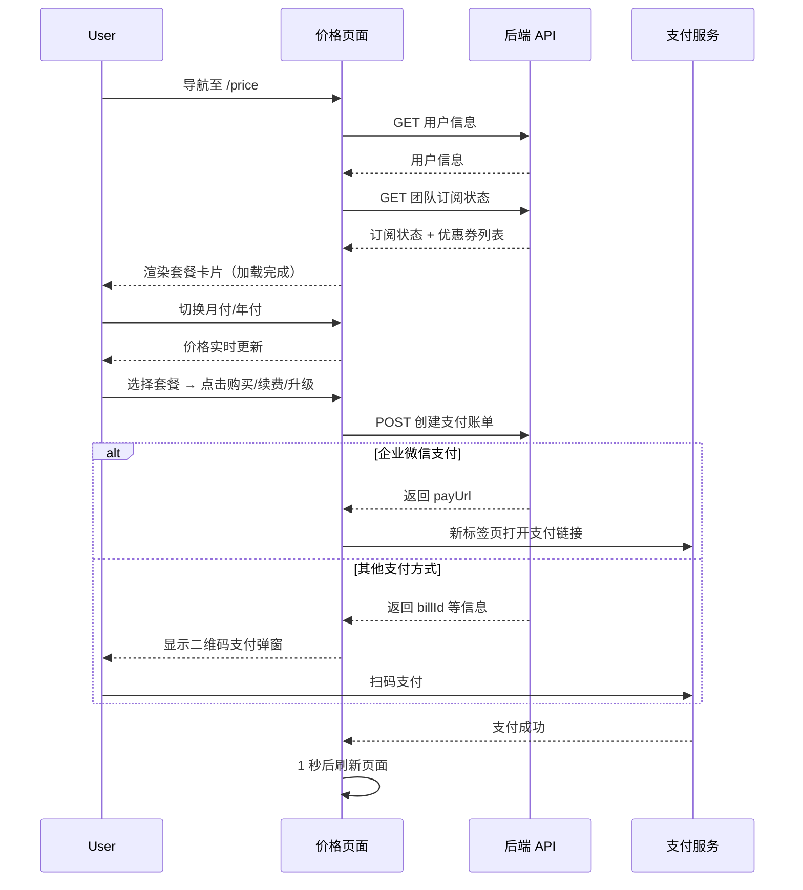
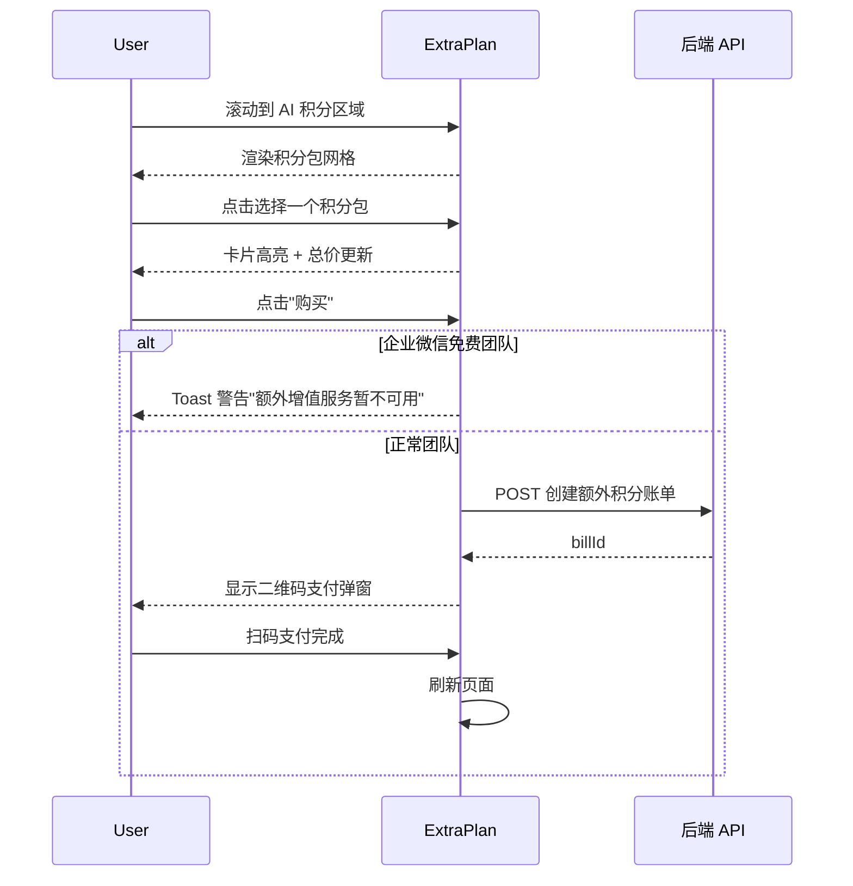
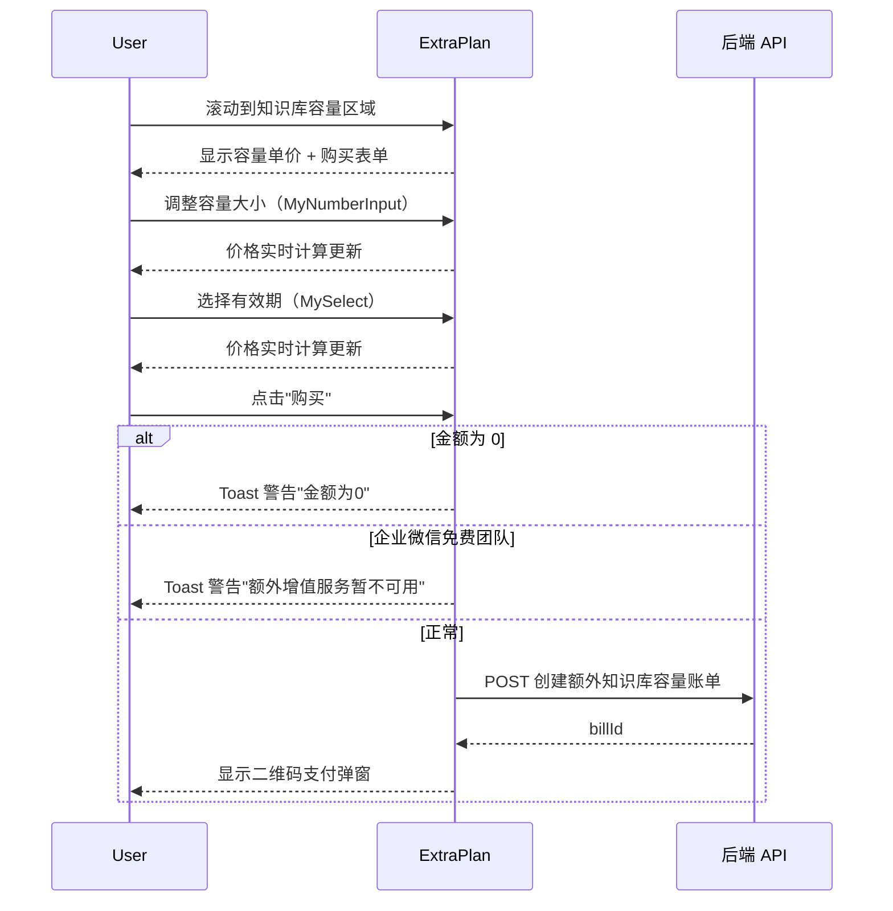
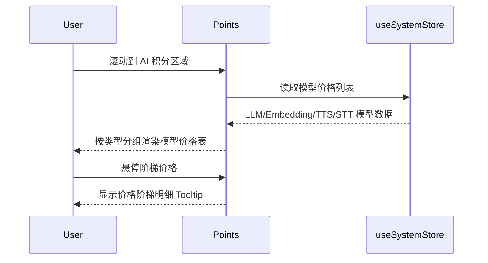
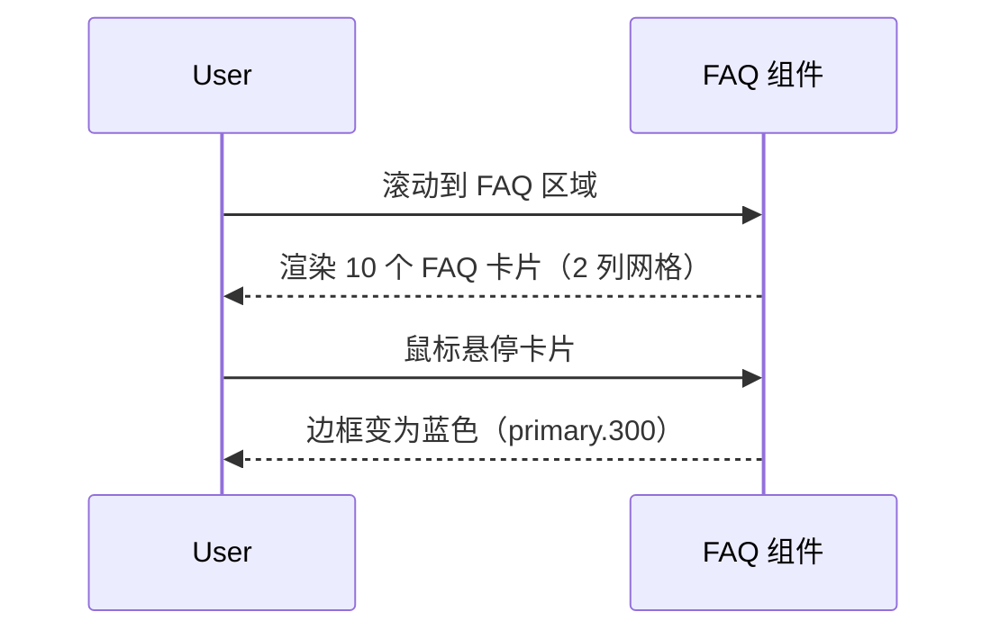

# 价格 — 业务流程详解

## 页面总览

价格中心采用单页滚动布局，顶部为返回按钮（团队已有订阅时显示），依次展示标准订阅套餐、额外增值服务（AI 积分 + 知识库容量）、AI 模型计费表和常见问题解答。页面加载时先获取用户信息和团队订阅状态，加载期间显示全屏加载动画（MyLoading），加载完成后一次性渲染全部内容区域。

### S01：查看价格与购买套餐

> 用户进入价格中心浏览标准订阅方案，选择合适的套餐等级和付费周期进行购买、续费或升级。

#### 步骤 1：页面初始化

| 用户操作 | 触发 API | 分支条件 | 页面变化 |
|---------|---------|---------|---------|
| 导航至 `/price` 页面 | GET `/support/user/team/plan/getTeamPlanStatus`（获取团队订阅状态）；由 `useUserStore.initUserInfo` 触发用户信息请求 | — | 显示全屏 MyLoading 加载动画；两个请求串行：先获取用户信息，再依据用户信息获取团队计划状态 |

- **数据加载详情**：页面初始化使用 `useRequest` hook，用户信息请求和团队计划请求串行执行（`refreshDeps: [userInfo]`）。两者均完成前，页面显示加载状态；加载失败则页面保持加载状态。

#### 步骤 2：选择付费周期

| 用户操作 | 触发 API | 分支条件 | 页面变化 |
|---------|---------|---------|---------|
| 查看月付/年付切换开关 | — | 非企业微信团队时显示月付/年付切换；企业微信团队时隐藏切换开关，默认年付 | 月付/年付 RowTabs 显示，默认选中年付（活动期间）或月付（无活动）；切换时套餐卡片价格实时更新 |

- **价格计算规则**：月付价格为方案原价；年付价格为方案原价 × 10（含 12 个月 AI 积分 + 10 个月订阅费）。

- **优惠券匹配**：页面加载时获取团队的优惠券列表（`getDiscountCouponList`），按当前选择的付费模式匹配对应的折扣券（月付匹配 7 折券，年付匹配 9 折券）。匹配到有效优惠券时，套餐卡片显示折后价格和折扣标签。

#### 步骤 3：选择套餐等级

| 用户操作 | 触发 API | 分支条件 | 页面变化 |
|---------|---------|---------|---------|
| 浏览套餐卡片（免费/基础/高级/定制） | — | 当前套餐卡片高亮（蓝色边框 + "使用中"标签）；活动期间基础/高级卡片显示活动装饰（飘带、雪花、优惠截止时间） | 免费卡片无边框高亮、显示 "Free" 禁用按钮；基础/高级卡片显示价格和功能列表；定制卡片显示"联系商务"按钮跳转自定义表单链接 |

- **套餐卡片差异**：
  - 免费套餐：按钮始终禁用，显示 "Free"
  - 当前套餐：显示"续费"按钮，活动期间为红色实心按钮（带雪花装饰）
  - 更高级套餐：显示"升级套餐"按钮
  - 未购买的低级套餐：显示"购买"按钮
  - 定制套餐：显示"联系商务"按钮，点击打开 `customFormUrl` 外部链接
  - 企业微信高级团队基础套餐：按钮禁用，不可降级

#### 步骤 4：提交购买

| 用户操作 | 触发 API | 分支条件 | 页面变化 |
|---------|---------|---------|---------|
| 点击"购买"/"续费"/"升级套餐"按钮 | POST `/proApi/support/wallet/bill/create`（参数：type, level, subMode, discountCouponId） | 企业微信团队且为免费套餐时，某些套餐按钮可能禁用 | 按钮显示 loading 状态（`isLoading`）；请求成功后根据返回结果分支处理 |

- **支付响应分支**：
  - 返回 `payUrl`（企业微信支付）：在新标签页打开支付链接（`window.open(res.payUrl, '_blank')`）
  - 返回其他支付方式：显示 QRCodePayModal 二维码支付弹窗，弹窗标题根据操作类型显示"购买"/"续费"/"升级"

#### 步骤 5：支付完成

| 用户操作 | 触发 API | 分支条件 | 页面变化 |
|---------|---------|---------|---------|
| 完成支付（扫码或在新标签页完成企业微信支付） | — | QRCodePayModal 的 `onSuccess` 回调触发 | 1 秒延迟后 `router.reload()` 刷新页面，更新套餐状态 |

### Mermaid 附录

### S02：购买额外 AI 积分

> 用户在额外增值服务区域选择 AI 积分包并购买。支持活动期间赠送额外积分。

#### 步骤 1：查看积分包

| 用户操作 | 触发 API | 分支条件 | 页面变化 |
|---------|---------|---------|---------|
| 滚动到"额外 AI 积分"卡片区域 | — | 系统配置 `subPlans?.extraPoints?.packages` 为空时无积分包可选 | 积分包以 2-3 列网格展示，每包显示积分数、有效期、活动赠送积分角标（如有）；活动期间显示雪花装饰和促销截止时间 |

#### 步骤 2：选择积分包并购买

| 用户操作 | 触发 API | 分支条件 | 页面变化 |
|---------|---------|---------|---------|
| 点击积分包卡片 | — | — | 选中卡片高亮（蓝色边框 + 蓝色背景）
| 查看总积分和价格 | — | 活动期间总积分 = 基础积分 + 赠送积分（`activityBonusPoints`）；无活动时总积分 = 基础积分 | 总积分区域实时更新；价格区域显示 `￥{price}`
| 点击"购买"按钮 | POST `/proApi/support/wallet/bill/create`（参数：type=extraPoints, extraPoints, month） | 企业微信免费团队 → toast 警告 "额外增值服务暂不可用"；积分包未选择 → 按钮禁用 | 按钮显示 loading 状态；成功后显示 QRCodePayModal

#### 步骤 3：支付完成

| 用户操作 | 触发 API | 分支条件 | 页面变化 |
|---------|---------|---------|---------|
| 完成支付 | — | `onPaySuccess` 回调 | 1 秒延迟后刷新页面 |

### Mermaid 附录

### S03：购买额外知识库容量

> 用户自定义购买额外的知识库索引容量，可指定容量大小和有效期。

#### 步骤 1：配置购买参数

| 用户操作 | 触发 API | 分支条件 | 页面变化 |
|---------|---------|---------|---------|
| 滚动到"额外知识库容量"卡片 | — | 显示知识库容量单价 `￥{extraDatasetPrice}/1000 组` | 显示购买表单：数量输入 + 有效期下拉 |
| 调整知识库容量 | — | 最小值 0（等价于不购买），最大值 10000 | MyNumberInput 步进器调整数量（以 1000 组为单位） |
| 选择有效期 | — | 选项：1 个月、3 个月、6 个月、12 个月 | MySelect 下拉切换 |

#### 步骤 2：价格实时计算

| 用户操作 | 触发 API | 分支条件 | 页面变化 |
|---------|---------|---------|---------|
| 调整数量或有效期 | — | 使用 `calculatePrice()` 函数实时计算：`extraDatasetPrice × datasetSize × month`；计算结果为 NaN 时显示 0 | 价格区域实时更新，显示 `￥{总价}` |

#### 步骤 3：提交购买

| 用户操作 | 触发 API | 分支条件 | 页面变化 |
|---------|---------|---------|---------|
| 点击"购买"按钮 | POST `/proApi/support/wallet/bill/create`（参数：type=extraDatasetSub, month, extraDatasetSize） | 企业微信免费团队 → toast 警告；`datasetSizePayAmount === 0` → toast 警告 "金额为 0" | 按钮显示 loading；成功后显示 QRCodePayModal |

### Mermaid 附录

### S04：查看 AI 模型计费

> 用户查看各类型 AI 模型的积分计费标准，了解不同模型的消耗单价。

| 用户操作 | 触发 API | 分支条件 | 页面变化 |
|---------|---------|---------|---------|
| 滚动到 "AI 积分" 区域 | — | 从 `useSystemStore` 读取模型列表（`llmModelList`/`embeddingModelList`/`ttsModelList`/`sttModelList`），数据由全局初始化时加载 | 显示 ModelTable 组件，菜单式表格按模型类型分组展示：对话模型 → 向量模型 → 语音合成 → 语音识别 |

- **数据加载详情**：模型价格数据来自 `useSystemStore` 中的 `llmModelList`、`embeddingModelList`、`ttsModelList`、`sttModelList`，由页面初始化全局加载。价格展示支持阶梯定价（通过 `PriceTiersLabel` 组件），鼠标悬停阶梯价格时显示价格明细表格。
- **计费单位**：对话模型和向量模型按 `/1000 Tokens` 计费；语音合成按 `/1000 字符` 计费；语音识别按 `/60 秒` 计费。

### Mermaid 附录

### S05：查看常见问题

> 用户浏览订阅相关的常见问题解答。

| 用户操作 | 触发 API | 分支条件 | 页面变化 |
|---------|---------|---------|---------|
| 滚动到 FAQ 区域 | — | FAQ 数据硬编码在组件中（10 个问答），不依赖 API 请求 | 以 2 列网格展示 FAQ 卡片，每张卡片包含标题（加粗）和描述文本。鼠标悬停时卡片边框变为蓝色。FAQ 内容涵盖：套餐切换、订阅查询、AI 积分使用、积分过期、知识库计算、索引删除、套餐叠加、QPM 限制、年/日计算、免费用户数据清理 |

### Mermaid 附录

