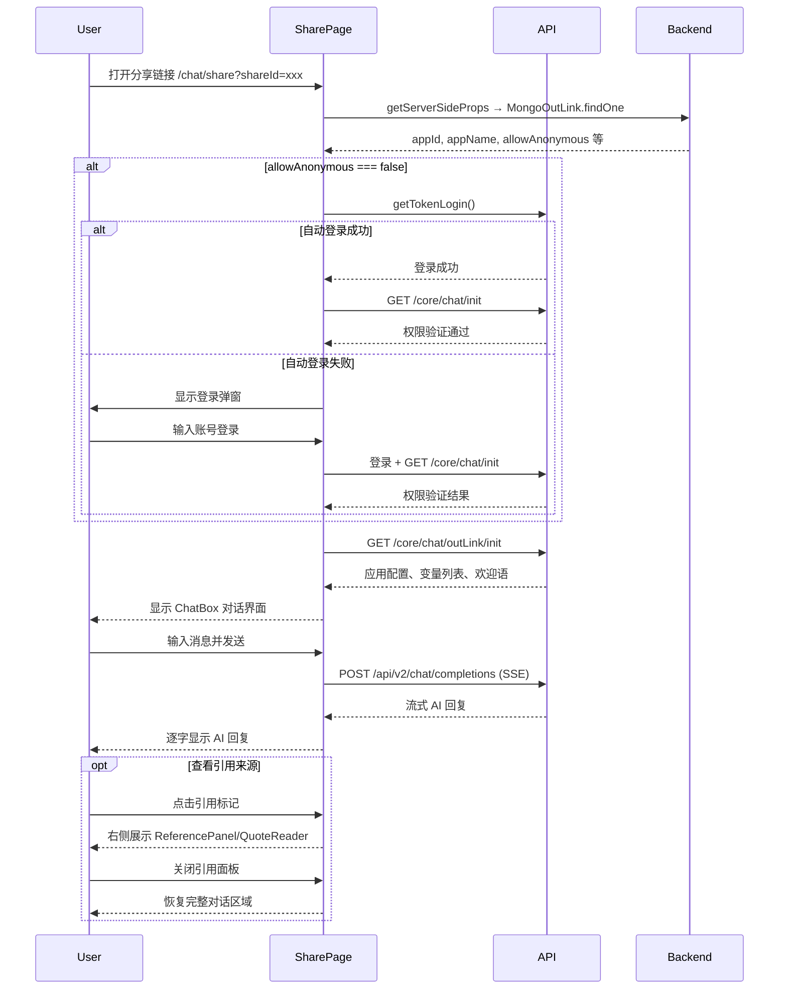

# 分享对话 — 业务流程详解

## 页面总览

分享对话页面是 FastGPT 对外提供 AI 对话服务的独立页面。用户通过分享链接 `/chat/share?shareId=xxx` 进入，与应用进行流式 AI 对话。页面根据 URL 参数 `allowAnonymous` 决定是否需要登录验证，默认支持匿名访问。页面布局为左侧可选历史侧边栏 + 中间对话区域 + 右侧可选引用面板的三栏结构。本页面无 Tab，所有功能在单页面内完成。

---

### 场景 S01：通过分享链接进行 AI 对话

> 外部用户通过分享链接进入页面，完成身份初始化后开始与 AI 应用对话，体验流式回复。

#### 步骤 1：页面初始化与身份识别

| 用户操作 | 触发 API | 分支条件 | 页面变化 |
|---------|---------|---------|---------|
| 打开分享链接（含 shareId 等 URL 参数） | 服务端 `getServerSideProps` 查询 `MongoOutLink` | — | Next.js SSR 渲染，获取 appId/appName/appAvatar/shareId 等初始数据作为 Props 传入 |
| 页面加载完成 | 无（客户端初始化） | `allowAnonymous !== false`：跳过登录检查 | 页面直接渲染，`source` 设为 `'share'`，初始化本地语言 |
| 页面加载完成 | `getTokenLogin()` → `getInitChatInfo({appId, chatId})` | `allowAnonymous === false` 且未确认 | 先尝试自动登录 → 成功则验证应用权限；失败则显示登录弹窗 |
| 在登录弹窗中登录成功 | `getInitChatInfo({appId, chatId})` | 用户在弹窗中完成登录 | 验证通过则关闭弹窗进入对话；无权限则提示错误 |

**前置条件**: 分享链接中的 shareId 有效；MongoOutLink 中有对应记录。

**后置影响**: 页面完成初始化，设置 `outLinkAuthData`（shareId + outLinkUid），准备开始对话。

**失败场景**: 
- 分享链接无效（无 shareId 或 MongoOutLink 查询为空）→ `appId` 为空，页面显示"无效分享链接"警告
- 自动登录失败且 `allowAnonymous=false` → 显示登录弹窗
- 登录后无应用权限（错误码 ≥ 502000）→ 提示"无权限访问该应用"

#### 步骤 2：获取聊天初始化数据

| 用户操作 | 触发 API | 分支条件 | 页面变化 |
|---------|---------|---------|---------|
| 页面身份初始化完成 | GET `/core/chat/outLink/init`（参数：chatId, shareId, outLinkUid） | `forbidLoadChatMap` 中当前 chatId 未标记为禁止加载 | 显示加载状态；获取应用配置（变量列表、欢迎语等） |
| 同上 | 同上 | `forbidLoadChatMap` 中当前 chatId 被标记为禁止加载 | 跳过加载，等待当前 chatId 的加载标记被清除 |
| API 返回成功 | — | — | 设置 chatBoxData（含 app 配置、变量），重置变量列表，调用 `setChatBoxData` 更新 ChatBox 状态 |
| 页面数据就绪 + 聊天记录加载完成 | 无（客户端 postMessage） | 首次初始化（`initSign` 为 false）且 `window !== top` | 向父窗口发送 `shareChatReady` 消息（iframe 嵌入场景） |

**数据加载详情**:

| 加载阶段 | API | 关键参数 | 数据处理 | 渲染结果 |
|---------|-----|---------|---------|---------|
| 首次加载 | GET /core/chat/outLink/init | chatId, shareId, outLinkUid | 合并 URL 自定义变量 + API 返回变量 | ChatBox 就绪，显示欢迎语 |
| 重新加载 | GET /core/chat/outLink/init | 新 chatId + shareId + outLinkUid | 重新合并变量 | 切换到新会话 |

**前置条件**: `outLinkAuthData.shareId` 和 `outLinkAuthData.outLinkUid` 已设置。

#### 步骤 3：发送消息与流式对话

| 用户操作 | 触发 API | 分支条件 | 页面变化 |
|---------|---------|---------|---------|
| 在 ChatBox 输入框输入消息并发送 | POST `/api/v2/chat/completions`（streaming） | — | 消息出现在对话列表中，显示 AI 头像和加载状态 |
| 同上（新对话） | 同上 | 当前 chatId 为新对话（不在 histories 中） | 标记 `forbidLoadChatMap`，禁止重复加载；向父窗口发送 `shareChatStart` 消息（iframe 模式） |
| 等待 AI 流式回复 | SSE 事件流 | — | AI 回复逐字显示；中间可能穿插工具调用状态、思考内容等 |
| AI 回复完成 | — | — | 对话轮次结束；如果是新对话则切换 chatId；自动生成对话标题（取首条消息内容截断）；向父窗口发送 `shareChatFinish` 消息（iframe 模式） |

**API 调用链详情**:

| 参数 | 值 | 说明 |
|------|-----|------|
| messages | `histories_messages`（取最后 1 条） | 仅发送当前轮次消息 |
| variables | 合并 URL 自定义变量 + 表单变量 | 包含 `cTime` 格式化时间戳 |
| chatId | `completionChatId` | 新对话自动生成 nanoid |
| detail | `true` | 返回详细响应 |
| stream | `true` | 使用 SSE 流式传输 |
| retainDatasetCite | `isShowCite` 值 | 是否保留数据集引用数据 |

**后置影响**: 
- 新对话：URL chatId 更新，历史列表新增一条记录，标题自动更新
- 对话记录自动保存到后端（MongoChat + MongoChatItem）

**失败场景**:
- 网络异常 → 对话显示错误状态，提示"网络异常"
- AI 服务超时 → 显示超时错误
- chatId 切换冲突 → `forbidLoadChatMap` 防止并发重复创建对话

#### 步骤 4：对话自动恢复

| 用户操作 | 触发 API | 分支条件 | 页面变化 |
|---------|---------|---------|---------|
| 页面加载时检测未完成的对话 | 无（ChatBox `enableAutoResume` 自动处理） | 存在未完成的对话（`chatGenerateStatus === 'generating'`） | ChatBox 自动发起 `streamResumeFetch` 恢复流式连接，继续接收未完成的回复 |

---

### 场景 S02：查看/清除分享对话历史

> 在分享对话页面的左侧历史侧边栏中管理对话记录。

#### 步骤 1：查看对话历史

| 用户操作 | 触发 API | 分支条件 | 页面变化 |
|---------|---------|---------|---------|
| PC 端：页面加载时自动展示侧边栏 | 由 `ChatContextProvider` 内部的 `useScrollPagination` 自动加载 | `showHistory === '1'`（URL 参数） | PC 端左侧显示可拖拽宽度的侧边栏（默认 250px，范围 180-350px） |
| 移动端：点击汉堡菜单 | 同上 | `showHistory !== '1'` | 侧边栏不显示（PC 和移动端均不展示） |
| 滚动历史列表到底部 | GET 历史记录（分页） | 还有更多记录 | 加载下一页对话历史 |

**前置条件**: URL 参数 `showHistory=1`。

**分页参数**: 由 `ChatContextProvider` 内部的 `useScrollPagination` 控制，默认每页 20 条。

#### 步骤 2：清除分享对话历史

| 用户操作 | 触发 API | 分支条件 | 页面变化 |
|---------|---------|---------|---------|
| 点击清除历史按钮 | 弹窗确认 | — | 显示确认弹窗"确认清空分享对话历史" |
| 确认清除 | DELETE `/core/chat/history`（批量删除） | — | 历史列表清空，当前对话保留 |

---

### 场景 S03：查看 AI 回复引用来源

> 当 AI 回复中包含知识库引用时，用户可以查看引用来源的详细内容。

#### 步骤 1：触发引用查看

| 用户操作 | 触发 API | 分支条件 | 页面变化 |
|---------|---------|---------|---------|
| 点击 AI 回复中的引用标记/数字 | — | `datasetCiteData` 有值 | PC 端：对话区域右侧出现引用面板（ReferencePanel 或 QuoteReader），可拖拽调整宽度（默认 580px，范围 400-900px） 移动端：全屏展示引用面板 |

**分支条件**:
- 引用数据中 `metadata` 含 `collectionId` → 显示 `ReferencePanel`（知识库集合引用模式）
- 引用数据中 `metadata` 不含 `collectionId` → 显示 `QuoteReader`（原文引用模式）

#### 步骤 2：关闭引用查看

| 用户操作 | 触发 API | 分支条件 | 页面变化 |
|---------|---------|---------|---------|
| 点击引用面板关闭按钮 | — | — | `setCiteModalData(undefined)`，引用面板消失，对话区域恢复完整宽度 |

**前置条件**: 应用配置中 `isShowCite=true`（由 `MongoOutLink.showCite` 控制）。

---

## Mermaid 附录

