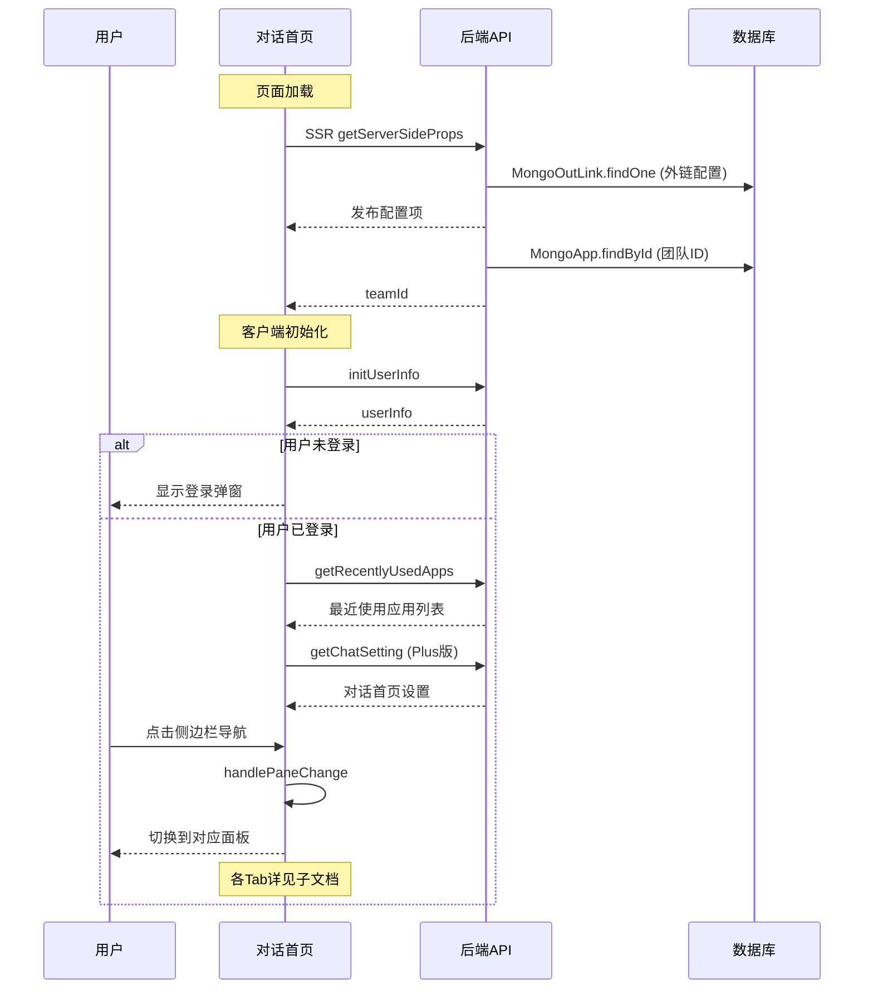

# 对话首页 — 业务流程详解

## 页面总览

对话首页是 FastGPT AI 对话的统一入口，提供侧边栏导航和面板切换功能。本模块已拆分为 5 个 Tab 子能力，各 Tab 的深度交互流程见对应子文档。本文档仅覆盖入口公共流程。

## Tab 结构索引

| Tab | 业务描述 | 来源 | 详细文档 |
|-----|---------|------|---------|
| 首页 | 预设快捷应用入口（Plus版） | 本模块 | [业务流程详解-首页](../对话首页/首页/业务流程详解.md) |
| 精选应用 | 用户收藏应用的快捷入口（Plus版） | 本模块 | [业务流程详解-精选应用](../对话首页/精选应用/业务流程详解.md) |
| 团队应用 | 团队内全部应用列表 | 本模块 | [业务流程详解-团队应用](../对话首页/团队应用/业务流程详解.md) |
| 最近使用 | 最近使用过的应用列表 | 本模块 | [业务流程详解-最近使用](../对话首页/最近使用/业务流程详解.md) |
| 设置 | 管理员对话首页配置（Plus版） | 本模块 | [业务流程详解-设置](../对话首页/设置/业务流程详解.md) |

## 公共业务流程

### 页面初始化与用户鉴权

> 页面加载时的初始化流程，包括用户信息获取、应用 ID 同步和对话设置加载。

#### 步骤 1：页面加载与路由参数解析

| 用户操作 | 触发 API | 分支条件 | 页面变化 |
|---------|---------|---------|---------|
| 访问 `/chat` 路由 | 无（Next.js SSR） | — | 服务端执行 `getServerSideProps`，从 query 解析 `appId` 和 `fromPublish` 参数 |

#### 步骤 2：服务端数据预取

| 用户操作 | 触发 API | 分支条件 | 页面变化 |
|---------|---------|---------|---------|
| 页面 SSR 渲染 | `MongoOutLink.findOne` | `appId` 存在且 `fromPublish` 非空时执行 | 查询发布渠道外链配置（`showRunningStatus` / `showSkillReferences` / `showCite` / `showFullText` / `canDownloadSource` / `showWholeResponse`）|
| 页面 SSR 渲染 | `MongoApp.findById` | `appId` 存在时执行 | 获取应用所属团队 ID |

**权限控制逻辑**：
- 发布渠道：各配置项由外链配置决定，默认关闭。非发布渠道：始终开启（`showSkillReferences` 除外，始终关闭）。
- `serviceSideProps` 加载所有命名空间的 i18n 词条。

#### 步骤 3：客户端初始化

| 用户操作 | 触发 API | 分支条件 | 页面变化 |
|---------|---------|---------|---------|
| 页面加载（客户端） | `initUserInfo`（useUserStore） | — | 调用用户信息初始化；设置 `source='online'`；标记 `isInitedUser=true` |
| 页面加载（客户端） | `getRecentlyUsedApps` | 登录用户自动触发 | 获取最近使用的应用列表，30 秒轮询刷新 |
| 页面加载（客户端） | `getChatSetting` | `feConfigs.isPlus` 为 true 时触发 | 获取对话首页设置，含首页推荐应用配置 |

**用户状态判断分支**：

- 用户信息未初始化完成（`!isInitedUser`）：显示加载态（`PageContainer isLoading`）
- 用户未登录（`!userInfo`）：显示登录弹窗（`LoginModal`）
- 用户已登录：进入正常对话界面，根据角色和版本显示不同面板

#### 步骤 4：chatSetting 加载后的自动跳转

| 用户操作 | 触发 API | 分支条件 | 页面变化 |
|---------|---------|---------|---------|
| （自动） | — | `chatSettings` 中 `enableHome` 为 false 且当前 pane 为 HOME | 自动切换到团队应用面板 |
| （自动） | — | 当前在首页面板，路由 `appId` 与配置的首页 `appId` 不同，且该 appId 不在快捷应用列表中 | 自动切换 appId 到配置的首页应用 |

### 侧边栏导航与面板切换

> 用户通过左侧侧边栏切换不同的对话面板。

#### 步骤 1：面板切换

| 用户操作 | 触发 API | 分支条件 | 页面变化 |
|---------|---------|---------|---------|
| 点击侧边栏导航按钮（首页/精选应用/团队应用/最近使用/设置） | `router.replace`（更新 URL query） | 目标面板与当前面板相同时忽略点击 | URL query 更新 `pane` 和 `appId` 参数；侧边栏按钮高亮切换；主内容区切换到对应面板组件 |
| 点击最近使用列表中的应用 | `router.replace`（更新 URL query） | 该应用已在当前面板激活时不重复切换 | URL query 更新 `pane=ra` 和对应 `appId`；主内容区切换到 AppChatWindow |

**面板组件映射**：

- `HOME` → `<HomeChatWindow />` — 首页对话
- `FAVORITE_APPS` → `<ChatFavouriteApp />` — 精选应用（Plus版）
- `TEAM_APPS` → `<ChatTeamApp />` — 团队应用
- `RECENTLY_USED_APPS` → `<AppChatWindow />` — 最近使用
- `SETTING` → `<ChatSetting />` — 设置（管理员+Plus版）

#### 步骤 2：侧边栏折叠

| 用户操作 | 触发 API | 分支条件 | 页面变化 |
|---------|---------|---------|---------|
| 点击折叠/展开按钮 | 无 | — | 侧边栏宽度从设置的宽度（默认 226px）切换为 72px；侧边栏图标缩小，文字隐藏；动画过渡 0.1s |

#### 步骤 3：侧边栏宽度拖拽调整

| 用户操作 | 触发 API | 分支条件 | 页面变化 |
|---------|---------|---------|---------|
| 拖拽侧边栏右侧分隔条 | 无 | 最小宽度 180px，最大宽度 350px | 侧边栏宽度实时调整；分隔条可见仅在侧边栏展开时 |

### 发布渠道访问流程

> 通过外链分享访问对话页面，无需登录即可查看对话内容。

#### 步骤 1：外链访问

| 用户操作 | 触发 API | 分支条件 | 页面变化 |
|---------|---------|---------|---------|
| 访问外链（含 `appId` 和 `fromPublish=1`） | SSR 阶段 `MongoOutLink.findOne` | `appId` 和 `fromPublish` 均存在 | 从外链配置读取各项开关（默认值偏保守：`showRunningStatus=true`, 其余默认关） |

**外链配置项说明**（由发布渠道配置控制）：

| 配置项 | 发布渠道默认 | 非发布渠道 |
|--------|------------|-----------|
| `showRunningStatus` | 由配置决定，默认 true | true（始终显示） |
| `showSkillReferences` | 由配置决定，默认 false | false（始终不显示） |
| `showCite` | 由配置决定，默认 false | true（始终显示） |
| `showFullText` | 由配置决定，默认 false | true（始终显示） |
| `canDownloadSource` | 由配置决定，默认 true | true（始终可下载） |
| `showWholeResponse` | 由配置决定，默认 true | true（始终显示完整回复） |

### 引用预览（数据集引用）

> 对话中包含数据集引用时的预览面板。

#### 步骤 1：打开引用预览

| 用户操作 | 触发 API | 分支条件 | 页面变化 |
|---------|---------|---------|---------|
| （自动） | 无 | `datasetCiteData` 存在 且 `chatType === ChatTypeEnum.share` 且 PC 端 | 主内容区右侧显示引用预览面板（`ReferencePanel` 或 `QuoteReader`），可通过分隔条调整宽度 |
| （自动） | 无 | `datasetCiteData` 存在 且 `chatType === ChatTypeEnum.share` 且 移动端 | 全屏覆盖显示引用预览面板（最大宽度 560px） |
| （自动） | 无 | `datasetCiteData` 存在 且 非分享模式 | 全屏覆盖显示 `ChatQuoteList`（最大宽度 560px） |

**引用预览面板类型**：
- `collectionId` 存在于 metadata 中 → 显示 `ReferencePanel`（集合引用视图）
- 否则 → 显示 `QuoteReader`（引用阅读器）

**面板尺寸**：
- PC 端右侧面板默认宽度 580px，可拖拽调整（400-900px）
- 移动端/非分享模式最大宽度 560px

| 用户操作 | 触发 API | 分支条件 | 页面变化 |
|---------|---------|---------|---------|
| 点击关闭引用预览 | 无 | — | `setCiteModalData(undefined)`，引用预览面板关闭，主内容区恢复正常宽度 |

### Mermaid 附录

> 各 Tab 面板的详细交互流程见对应子文档。
