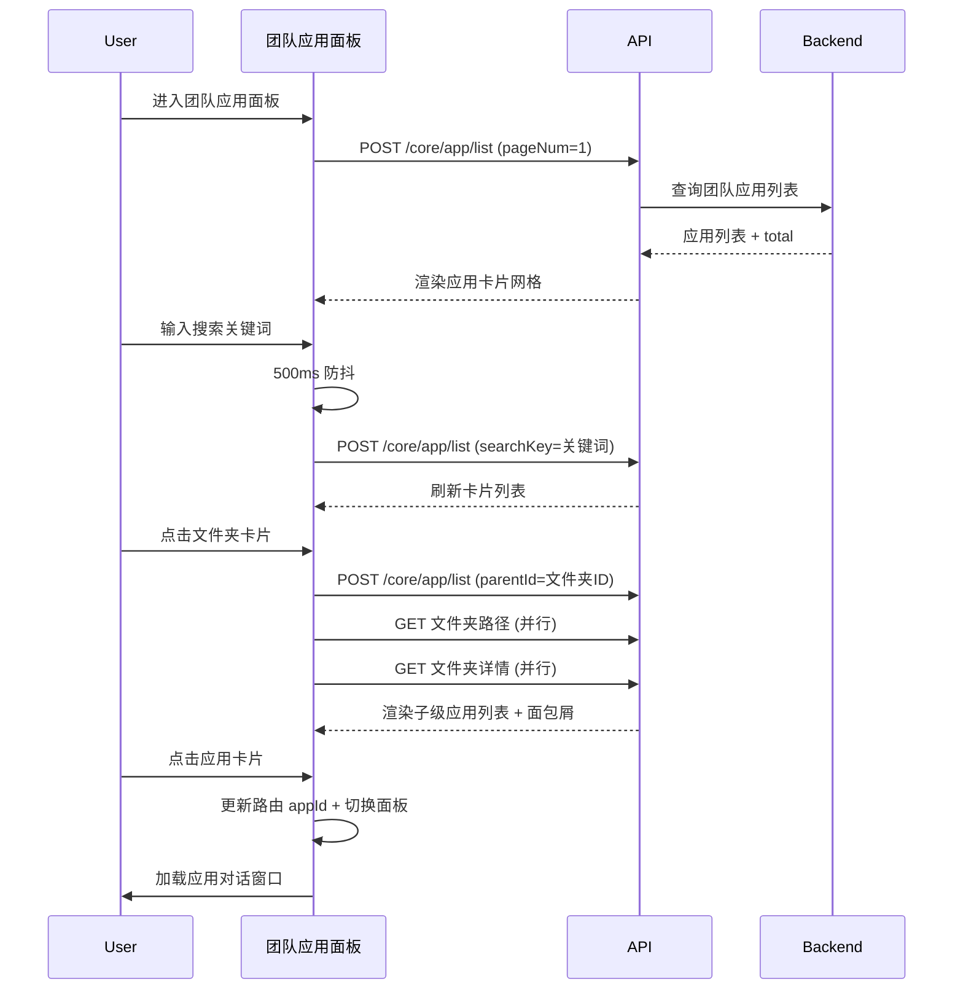

# 团队应用 — 业务流程详解

## 页面总览

团队应用面板是对话系统中的核心应用发现入口。PC 端采用顶部 Tab 筛选 + 右侧搜索框 + 应用卡片网格的布局；移动端采用全宽搜索 + 紧凑卡片列表的单列布局。所有数据通过 `AppListContext` 统一管理，支持无限滚动分页加载。

无嵌套 Tab，本模块无 Tab 子能力拆分。

---

### 浏览团队应用

> **业务描述**: 用户进入对话页面的团队应用面板，首次加载时以分页方式获取团队下的应用列表，以网格卡片形式展示每个应用的头像、名称、简介、创建者和更新时间。列表支持无限滚动加载更多。

#### 步骤 1：进入团队应用面板

| 用户操作 | 触发 API | 分支条件 | 页面变化 |
|---------|---------|---------|---------|
| 在对话页面侧边栏点击"团队应用"入口，或进入 `pane=ta` 路由 | 无（路由切换触发） | 无 | 面板切换为团队应用视图；显示搜索框和空状态（初始） |

#### 步骤 2：面板初始化与数据加载

| 用户操作 | 触发 API | 分支条件 | 页面变化 |
|---------|---------|---------|---------|
| 面板渲染完成 | `POST /core/app/list`（pageNum=1, pageSize=默认，含 parentId, type, searchKey） | 无 | 加载中状态（MyBox 显示 Spinner）；请求成功后渲染应用卡片网格 |

#### 步骤 3：无限滚动加载更多

| 用户操作 | 触发 API | 分支条件 | 页面变化 |
|---------|---------|---------|---------|
| 向下滚动页面至底部哨兵元素可见 | `POST /core/app/list`（pageNum=N+1, pageSize=默认） | `hasMore === true` 时哨兵元素挂载 | 页面底部显示加载 Spinner；新数据追加至列表末尾 |

**数据加载详情**：

| 加载阶段 | API | 关键参数 | 数据处理 | 渲染结果 |
|---------|-----|---------|---------|---------|
| 首次加载 | `POST /core/app/list` | `pageNum=1`, `parentId=当前文件夹ID` | 按后端默认排序 | 网格卡片首屏数据 |
| 滚动加载 | `POST /core/app/list` | `pageNum=N+1`, `parentId=当前文件夹ID` | 追加到现有列表 | 网格卡片增加 |
| 搜索触发 | `POST /core/app/list` | `searchKey=输入关键词`（500ms防抖） | 替换全部列表 | 网格卡片刷新 |

- **分页参数**: 默认每页条数由 `useInfiniteScroll` hook 管理
- **空状态**: 列表为空且不在加载时，显示"暂无应用"空状态提示文字（居中）
- **初始无数据**: 有创建权限且 PC 端显示创建引导卡片；无权限显示空状态

---

### 按类型筛选应用（仅 PC 端）

> **业务描述**: PC 端用户在顶部 Tab 栏切换应用类型，列表仅展示匹配类型的应用。此功能为纯前端筛选，不触发新的 API 请求。

#### 步骤 1：切换类型 Tab

| 用户操作 | 触发 API | 分支条件 | 页面变化 |
|---------|---------|---------|---------|
| 点击顶部类型 Tab（全部/智能客服/工作流机器人/工作流工具） | 无（纯前端过滤） | 无 | Tab 切换为选中态（高亮 + 底部指示器）；应用卡片列表即时过滤为匹配类型 |

- **筛选逻辑**: `List` 组件从 `AppListContext` 获取全量应用列表，在前端按 `appType` 过滤：
  - `all`：不过滤，展示所有应用
  - 具体类型：仅展示 `type` 匹配的应用（工具类型额外匹配 `toolFolder`，其他类型额外匹配 `folder`）

---

### 搜索应用

> **业务描述**: 用户在搜索框输入关键词，系统进行 500ms 防抖后调用 API 重新获取匹配的应用列表。

#### 步骤 1：输入搜索关键词

| 用户操作 | 触发 API | 分支条件 | 页面变化 |
|---------|---------|---------|---------|
| 在搜索框中输入关键词（最长 30 字符） | 无（仅在本地更新状态） | 无 | 输入框显示输入内容 |

#### 步骤 2：搜索触发

| 用户操作 | 触发 API | 分支条件 | 页面变化 |
|---------|---------|---------|---------|
| 停止输入 500ms 后 | `POST /core/app/list`（searchKey=关键词, pageNum=1） | 搜索词非空 | 加载中状态；匹配结果替换当前列表 |

- **搜索类型**: 按应用名称搜索（后端处理）
- **防抖**: 500ms（由 `useDebounce` hook 实现）
- **无结果**: 显示"暂无应用"空状态提示

---

### 进入文件夹浏览

> **业务描述**: 用户点击文件夹类型应用卡片进入子目录，或通过面包屑导航返回上级目录。此时更新 URL 中的 `parentId` 参数，触发数据重新加载。

#### 步骤 1：进入文件夹

| 用户操作 | 触发 API | 分支条件 | 页面变化 |
|---------|---------|---------|---------|
| 点击文件夹类型应用卡片 | 无（路由参数更新触发） | 应用类型为 `folder` | URL 查询参数添加 `parentId=文件夹ID` |

#### 步骤 2：文件夹数据加载

| 用户操作 | 触发 API | 分支条件 | 页面变化 |
|---------|---------|---------|---------|
| 路由参数变化触发 | `POST /core/app/list`（parentId=文件夹ID, pageNum=1） | `parentId` 变化 | 加载中状态；面包屑路径更新；卡片列表刷新为文件夹内应用 |

**并行 API**：
- `getAppFolderPath` — 获取当前文件夹的面包屑路径，更新顶部导航
- `getAppDetailById` — 获取文件夹详情（权限、名称等）

#### 步骤 3：返回上级

| 用户操作 | 触发 API | 分支条件 | 页面变化 |
|---------|---------|---------|---------|
| 点击面包屑路径中的上级文件夹 | 同步骤 2 | 面包屑路径存在 | 面包屑同步更新；列表刷新 |

---

### 开始对话

> **业务描述**: 用户点击非文件夹应用卡片，系统切换到对话面板并加载该应用的对话窗口。

#### 步骤 1：点击应用卡片

| 用户操作 | 触发 API | 分支条件 | 页面变化 |
|---------|---------|---------|---------|
| 点击非文件夹应用卡片 | 无（路由切换） | 应用类型非 `folder` | 鼠标悬停时卡片边框高亮为蓝色，显示"去对话"提示 |

#### 步骤 2：导航至对话

| 用户操作 | 触发 API | 分支条件 | 页面变化 |
|---------|---------|---------|---------|
| 点击完成 | 无（前端路由更新） | 无 | URL 更新 `appId=应用ID`；面板切换至 `RECENTLY_USED_APPS`（最近使用）；对话窗口加载该应用 |

---

### Mermaid 附录

