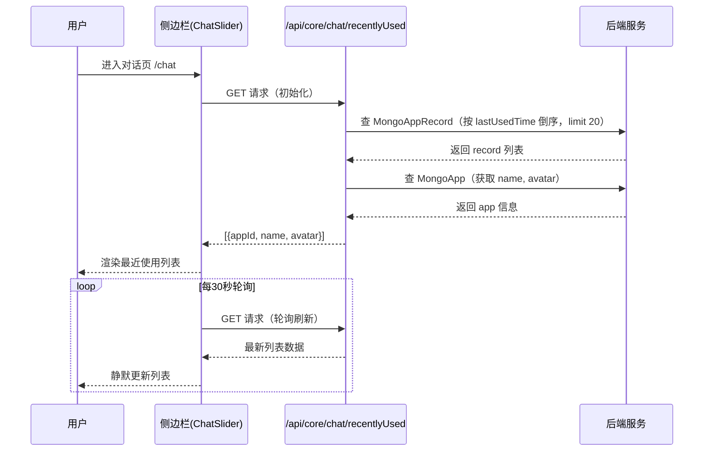
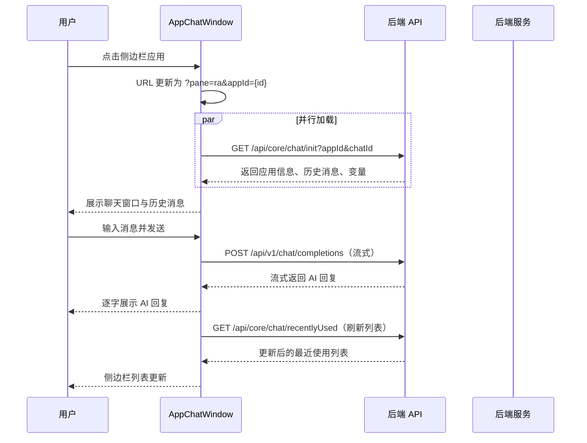
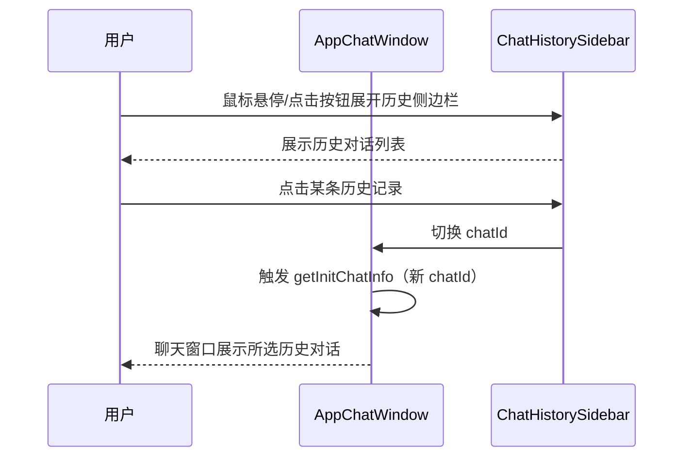
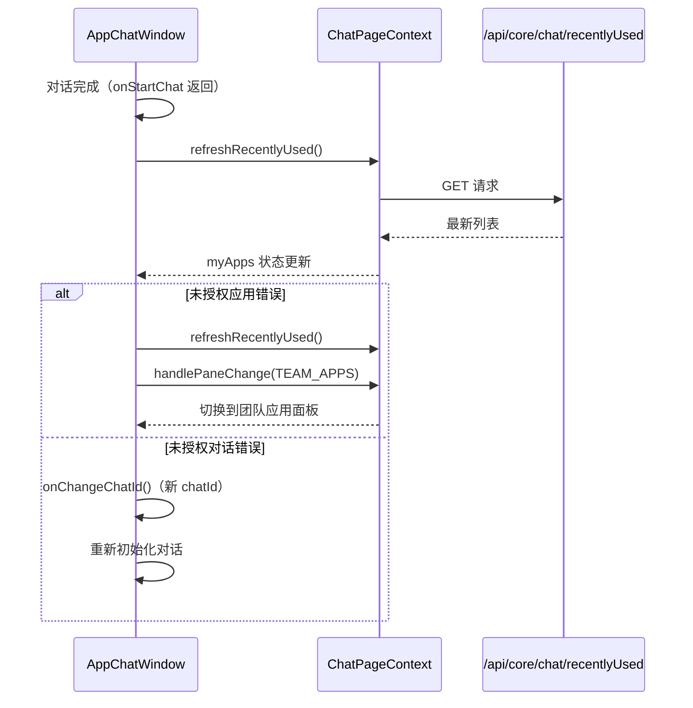

# 最近使用 — 业务流程详解

## 页面总览

"最近使用"模块提供用户快速回到最近对话过的 AI 应用的入口。核心交互流程为：侧边栏展示最近应用列表 → 用户点击应用 → 聊天窗口加载并初始化对话 → 用户发送消息 → AI 回复 → 自动刷新最近使用列表。该模块为纯展示型聊天窗口，无新增/编辑/删除等表单操作场景。

## 侧边栏查看最近使用应用列表

> **业务描述**: 用户在对话页侧边栏浏览最近对话过的 AI 应用列表，列表每 30 秒自动刷新。

### 步骤 1：页面初始化加载最近使用列表

| 用户操作 | 触发 API | 分支条件 | 页面变化 |
|---------|---------|---------|---------|
| 进入对话页 /chat | GET /api/core/chat/recentlyUsed | 用户已登录（有有效 token）→ 正常请求；用户未登录 → 不发起请求，展示登录弹窗 | 侧边栏展开时显示"最近使用"区域标题和加载状态 |

### 步骤 2：列表渲染

| 用户操作 | 触发 API | 分支条件 | 页面变化 |
|---------|---------|---------|---------|
| 无需操作（自动） | —（使用步骤1返回的数据） | 列表有数据 → 渲染应用条目（头像+名称）；列表为空 → 不显示任何条目 | 侧边栏中每个应用显示头像和名称，当前激活的应用条目高亮（蓝色背景） |

### 步骤 3：定时自动刷新

| 用户操作 | 触发 API | 分支条件 | 页面变化 |
|---------|---------|---------|---------|
| 无需操作（自动，30秒间隔） | GET /api/core/chat/recentlyUsed | 500ms 节流保护，避免频繁请求 | 列表静默更新（无加载遮罩），新增或排序变化的应用条目自动出现在列表中 |

### 数据加载详情

| 加载阶段 | API | 关键参数 | 数据处理 | 渲染结果 |
|---------|-----|---------|---------|---------|
| 首次加载 | GET /api/core/chat/recentlyUsed | 无请求参数（后端根据 token 获取 tmbId） | 后端查询 MongoAppRecord 按 lastUsedTime 倒序取前20条，关联 MongoApp 获取 name/avatar | 侧边栏最近使用列表（最多20个应用） |
| 轮询刷新（30秒） | GET /api/core/chat/recentlyUsed | 同首次加载 | 500ms 节流 | 静默更新列表 |
| 手动刷新（对话完成后） | GET /api/core/chat/recentlyUsed | 同首次加载 | 同首次加载 | 列表更新，刚对话的应用排到顶部 |

### Mermaid 附录

## 打开最近使用的应用进行对话

> **业务描述**: 用户在侧边栏点击某个应用，聊天主区域切换到该应用的聊天窗口，加载历史消息并准备对话。

### 步骤 1：切换应用

| 用户操作 | 触发 API | 分支条件 | 页面变化 |
|---------|---------|---------|---------|
| 在侧边栏"最近使用"列表中点击目标应用名称 | —（前端路由切换） | 点击的应用已是当前激活应用 → 不重复切换（handlePaneChange 内判断 `newPane === lastestPane.current && !id && !tab` 则返回）；点击不同应用 → 执行路由切换 | URL 更新为 `/chat?pane=ra&appId={目标应用ID}`，侧边栏高亮切换到被点击的应用 |

### 步骤 2：初始化聊天数据

| 用户操作 | 触发 API | 分支条件 | 页面变化 |
|---------|---------|---------|---------|
| 无需操作（路由切换自动触发） | GET /api/core/chat/init?appId={appId}&chatId={chatId} | appId 和 chatId 均存在 → 发起请求；任一缺失 → 跳过请求；forbidLoadChat 为 true → 跳过请求（防止重复加载） | 聊天窗口显示加载状态 |

### 步骤 3：聊天数据填充

| 用户操作 | 触发 API | 分支条件 | 页面变化 |
|---------|---------|---------|---------|
| 无需操作（数据返回后自动填充） | — | 请求成功 → 解析响应设置聊天数据；请求失败且错误码 ≥ 502000 → 进入错误处理分支 | 成功：聊天窗口显示应用名称（标题栏）、头像、历史消息列表；失败（未授权对话）：自动切换 chatId 重新加载；失败（未授权应用）：刷新最近使用列表并切换到团队应用面板 |

### 步骤 4：发送消息

| 用户操作 | 触发 API | 分支条件 | 页面变化 |
|---------|---------|---------|---------|
| 在输入框中键入消息并点击发送 | POST /api/v1/chat/completions（流式请求，通过 streamFetch） | appId 为空 → 不发送，返回错误；isPlugin 为 true → 使用 CustomPluginRunBox 处理消息（插件模式）；isPlugin 为 false → 使用标准 ChatBox 处理消息 | 输入框清空，消息出现在聊天区域（用户消息气泡），AI 回复区域显示"正在生成..."加载指示器 |

### 步骤 5：接收 AI 回复

| 用户操作 | 触发 API | 分支条件 | 页面变化 |
|---------|---------|---------|---------|
| 等待 AI 回复（无需操作） | —（流式响应由 streamFetch 的 onMessage 回调逐字处理） | 流式传输进行中 → 逐字展示 AI 回复内容；传输完成 → 显示完整回复 | AI 回复逐字出现在对话区域，生成完成后显示完整消息；如果启用了引用显示（isShowCite），回复中包含引用标记 |

### 步骤 6：对话完成后续处理

| 用户操作 | 触发 API | 分支条件 | 页面变化 |
|---------|---------|---------|---------|
| 无需操作（AI 回复完成后自动触发） | GET /api/core/chat/recentlyUsed | 对话成功完成 → 调用 refreshRecentlyUsed() 刷新列表 | 聊天标题更新为最新消息摘要，侧边栏最近使用列表更新（当前应用排到顶部或出现在列表中） |

### Mermaid 附录

## 查看对话历史记录

> **业务描述**: 用户在聊天窗口顶部查看和切换当前应用的历史对话记录。

### 步骤 1：展开历史记录侧边栏

| 用户操作 | 触发 API | 分支条件 | 页面变化 |
|---------|---------|---------|---------|
| PC端：鼠标移入左侧边缘触发 SideBar 展开（externalTrigger 取决于是否有引用数据）；移动端：点击抽屉按钮打开 ChatSliderMobileDrawer | — | PC端有引用数据（datasetCiteData 非空）→ 额外触发 SideBar 展开；无引用数据 → 仅鼠标悬停触发 | PC端：对话历史侧边栏从左侧滑出；移动端：底部抽屉弹出历史记录列表 |

### 步骤 2：浏览和切换历史对话

| 用户操作 | 触发 API | 分支条件 | 页面变化 |
|---------|---------|---------|---------|
| 在历史记录列表中点击某条记录 | —（前端通过 ChatRecordContext 切换 chatId） | 点击不同对话 → 触发 chatId 变化，AppChatWindow 重新调用 getInitChatInfo 加载该对话数据；点击当前对话 → 无变化 | 聊天窗口切换到所选历史对话，展示该对话的完整消息记录 |

### Mermaid 附录

## 对话完成后刷新最近使用列表

> **业务描述**: 用户与 AI 应用完成一轮对话后，系统自动将当前应用更新到最近使用列表顶部。

### 步骤 1：对话完成触发刷新

| 用户操作 | 触发 API | 分支条件 | 页面变化 |
|---------|---------|---------|---------|
| 无需操作（AI 回复完成后自动触发） | GET /api/core/chat/recentlyUsed | 对话正常完成 → 调用 refreshRecentlyUsed()；对话出错且为未授权应用错误 → 同样调用 refreshRecentlyUsed() | 侧边栏最近使用列表更新 |

### 步骤 2：未授权应用错误处理

| 用户操作 | 触发 API | 分支条件 | 页面变化 |
|---------|---------|---------|---------|
| 无需操作（API 返回错误时自动处理） | — | getInitChatInfo 返回 AppErrEnum.unAuthApp 错误 → 调用 refreshRecentlyUsed() 从列表中移除未授权应用 → 自动切换到团队应用面板 (TEAM_APPS) | 页面从最近使用面板跳转到团队应用面板，展示所有可用应用列表 |

### 步骤 3：未授权对话错误处理

| 用户操作 | 触发 API | 分支条件 | 页面变化 |
|---------|---------|---------|---------|
| 无需操作（API 返回错误时自动处理） | — | getInitChatInfo 返回 ChatErrEnum.unAuthChat 错误 → 调用 onChangeChatId() 切换到新的 chatId | 聊天窗口重新初始化一个新的对话 |

### Mermaid 附录

