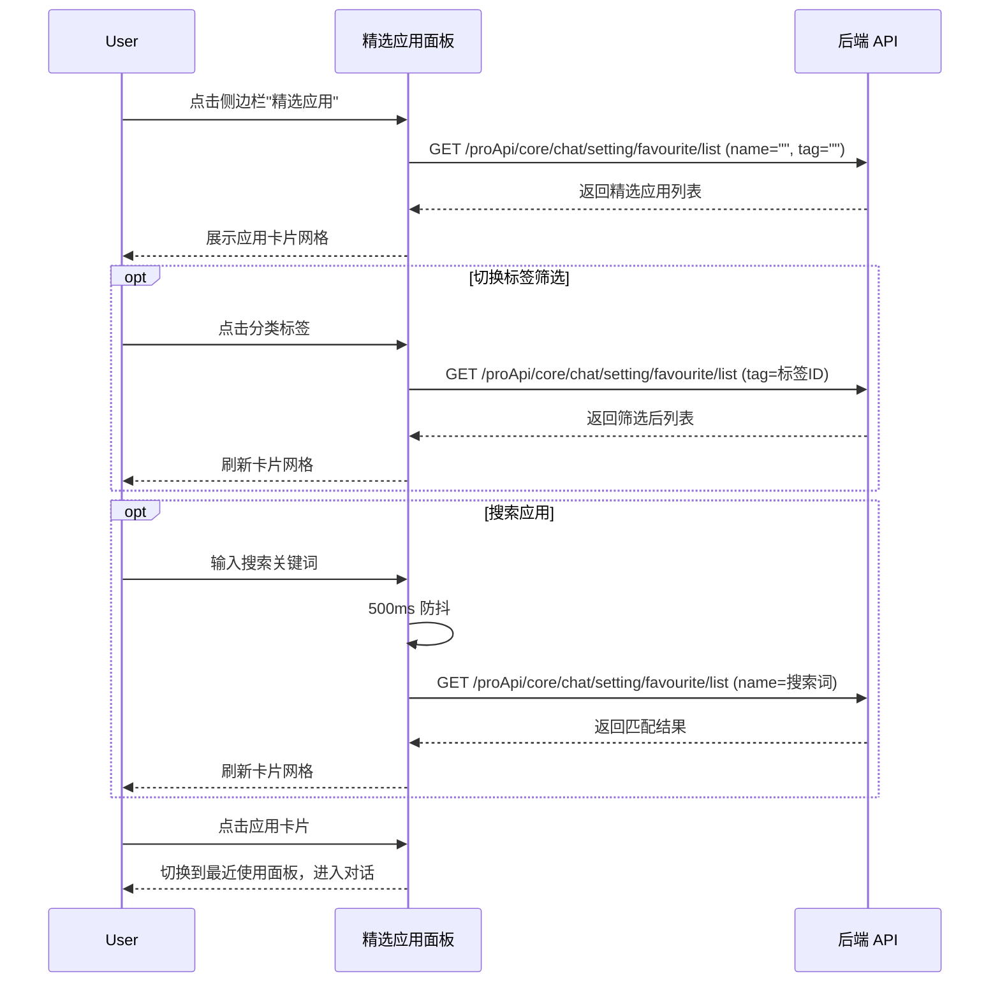
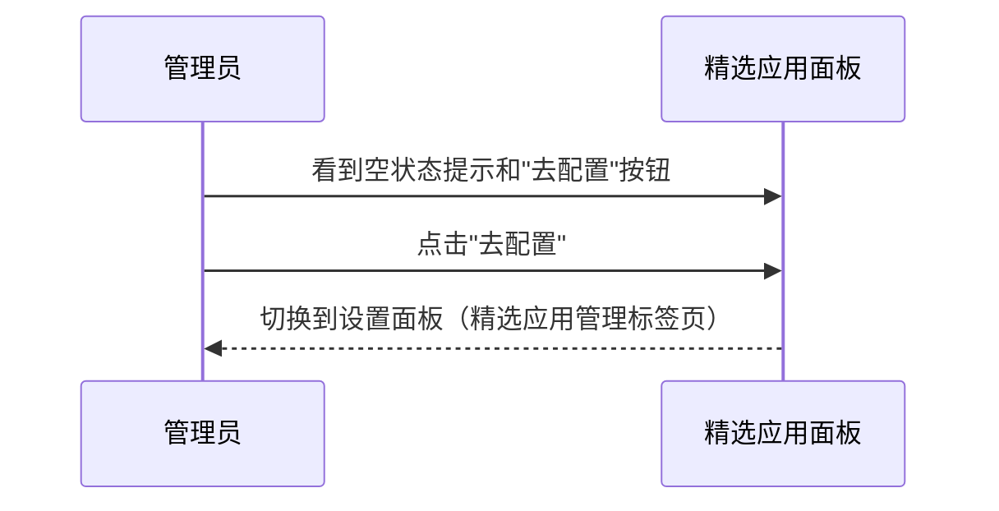

# 精选应用 — 业务流程详解

## 页面总览

精选应用面板是对话首页侧边栏中的一个功能面板，展示由管理员配置的精选应用集合，以卡片网格形式呈现。用户可通过标签分类筛选和名称搜索来快速定位目标应用。

> 本模块无嵌套 Tab 页面。标签切换为纯前端过滤控件，不产生页面跳转或内容区域切换。

---

### 浏览精选应用列表

> 用户在对话首页打开精选应用面板，浏览由管理员配置的精选应用集合。支持按标签分类筛选和按名称搜索。

#### 步骤 1：进入精选应用面板

| 用户操作 | 触发 API | 分支条件 | 页面变化 |
|---------|---------|---------|---------|
| 在对话首页侧边栏点击"精选应用"导航项；或移动端点击菜单图标打开侧边栏后点击"精选应用" | 无（面板切换为前端路由操作） | Plus 版本启用时正常展示；非 Plus 版本该面板可能不可见 | 侧边栏切换到精选应用面板，面板区域显示加载状态（`MyBox` 的 `isLoading` 为 true），页面标题设置为系统标题 |

#### 步骤 2：加载精选应用列表

| 用户操作 | 触发 API | 分支条件 | 页面变化 |
|---------|---------|---------|---------|
| 进入面板后自动触发加载，无需手动操作 | `GET /proApi/core/chat/setting/favourite/list`（参数：`name` 搜索关键词，`tag` 标签 ID） | 首次加载 `name` 和 `tag` 均为空字符串，拉取全部精选应用 | 加载遮罩显示；请求完成后遮罩消失 |

#### 步骤 3：查看应用卡片列表

| 用户操作 | 触发 API | 分支条件 | 页面变化 |
|---------|---------|---------|---------|
| 等待数据加载完成，浏览应用卡片 | 无 | **有数据时**：以响应式网格展示应用卡片（PC 端 3 列，移动端 1 列）；**无数据时**：显示空状态提示"暂无可用精选应用" | 每张卡片展示应用头像、名称、简介（无简介时显示"暂无介绍"）、前 3 个标签；超过 3 个标签时显示"+N"浮层 |

#### 步骤 4：按标签筛选

| 用户操作 | 触发 API | 分支条件 | 页面变化 |
|---------|---------|---------|---------|
| 点击顶部标签栏中的分类标签（如"效率"、"工具"等） | `GET /proApi/core/chat/setting/favourite/list`（参数：`tag` 为所选标签 ID） | 点击"全部"时 `tag` 为空；点击具体标签时 `tag` 为标签 ID；切换标签后 500ms 防抖节流 | 选中标签高亮为蓝色，列表区域显示加载遮罩，数据刷新后展示对应分类的应用 |

#### 步骤 5：按名称搜索

| 用户操作 | 触发 API | 分支条件 | 页面变化 |
|---------|---------|---------|---------|
| 在搜索框中输入应用名称关键词 | `GET /proApi/core/chat/setting/favourite/list`（参数：`name` 为输入的关键词） | 输入变化后 500ms 防抖节流；PC 端搜索框在标签栏右侧（最大宽度 300px）；移动端搜索框在顶部工具栏 | 列表区域显示加载遮罩，数据刷新后展示匹配名称的应用 |

#### 步骤 6：点击应用进入对话

| 用户操作 | 触发 API | 分支条件 | 页面变化 |
|---------|---------|---------|---------|
| 点击任意应用卡片 | 无（前端路由切换） | 始终可点击 | 面板切换到最近使用应用面板（`RECENTLY_USED_APPS`），传递该应用的 `appId`，进入该应用的对话界面 |

##### 数据加载详情

| 加载阶段 | API | 关键参数 | 数据处理 | 渲染结果 |
|---------|-----|---------|---------|---------|
| 首次加载 | GET /proApi/core/chat/setting/favourite/list | name=""、tag="" | 无额外处理，直接使用返回值 | 应用卡片网格 |
| 标签筛选 | GET /proApi/core/chat/setting/favourite/list | tag={标签ID}、name={当前搜索词} | 无额外处理 | 筛选后卡片网格 |
| 名称搜索 | GET /proApi/core/chat/setting/favourite/list | name={搜索词}、tag={当前标签} | 500ms 防抖 | 搜索匹配卡片网格 |

- **分页参数**：无分页，一次性加载全部精选应用
- **排序规则**：按管理员配置的 `order` 字段排序
- **筛选条件**：标签（`tag` 参数）和名称（`name` 参数），两个条件可组合使用

---

### 跳转配置精选应用

> 管理员在精选应用列表为空时，点击"去配置"按钮跳转到精选应用管理页面。

#### 步骤 1：触发跳转

| 用户操作 | 触发 API | 分支条件 | 页面变化 |
|---------|---------|---------|---------|
| 在精选应用面板空状态页面点击"去配置"按钮 | 无（前端路由切换） | 仅当 `userInfo.permission.hasManagePer` 为 true 且精选应用列表为空时显示此按钮 | 面板切换到设置面板（`SETTING`），并自动定位到精选应用管理标签页（`FAVOURITE_APPS`） |

---

### Mermaid 附录

#### 浏览精选应用列表

#### 跳转配置精选应用

