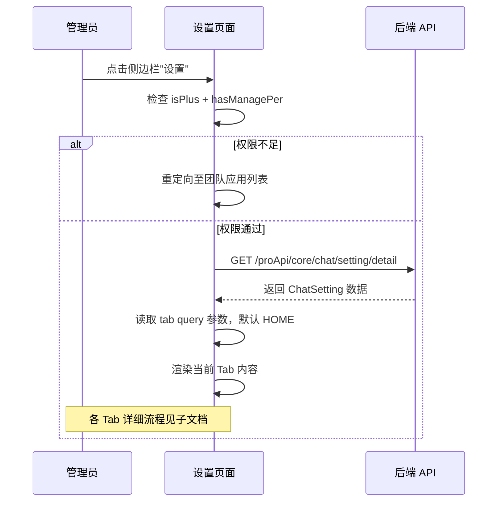

# 设置 — 业务流程详解

> 本模块已按 Tab 拆分为 4 个子能力，各 Tab 的深度业务流程详见子目录文档。本文档仅覆盖公共流程。

## 公共业务流程

### 权限校验与页面初始化

> 管理员访问设置页面时的初始化流程，包含商业版许可检查和权限校验。

#### 步骤 1：页面加载与权限校验

| 用户操作 | 触发 API | 分支条件 | 页面变化 |
|---------|---------|---------|---------|
| 通过侧边栏点击设置进入，路由参数 `pane=s` | 无（客户端检查） | — | 页面加载，显示 ChatSetting 组件 |
| 系统检查 `feConfigs.isPlus` | 无 | `isPlus` 为 `false`（非商业版）→ 重定向至团队应用列表 | 页面跳转至 `TEAM_APPS`，用户看不到设置页面 |
| 系统检查 `userInfo.team.permission.hasManagePer` | 无 | `hasManagePer` 为 `false`（无管理权限）→ 重定向至团队应用列表 | 页面跳转至 `TEAM_APPS`，普通成员无法进入 |

权限校验在 `useMount` 钩子中执行，发生在组件首次挂载时。

#### 步骤 2：读取路由参数确定 Tab

| 用户操作 | 触发 API | 分支条件 | 页面变化 |
|---------|---------|---------|---------|
| 无（自动执行） | 无 | URL 中 `tab` 参数为有效枚举值（`h/d/l/f`）→ 使用该值 | 对应 Tab 内容和顶部 Tab 栏高亮 |
| 无（自动执行） | 无 | URL 中无 `tab` 参数或值无效 → 默认 `HOME` (h) | 默认展示「首页配置」Tab |

#### 步骤 3：等待配置数据加载

| 用户操作 | 触发 API | 分支条件 | 页面变化 |
|---------|---------|---------|---------|
| 无（自动执行） | `GET /proApi/core/chat/setting/detail`（由 `ChatPageContextProvider` 自动调用）| 数据加载中 | 页面空白，不渲染 Tab 内容（`chatSettings` 为 `undefined`） |
| 无（自动执行） | 同上 | 数据加载完成 | 渲染当前激活 Tab 的内容区域 |

#### 步骤 4：Tab 切换

| 用户操作 | 触发 API | 分支条件 | 页面变化 |
|---------|---------|---------|---------|
| 点击顶部 Tab 栏的「首页配置」 | 无（路由更新） | 当前不在 HOME Tab | URL query 更新 `tab=h`，渲染首页配置表单 |
| 点击顶部 Tab 栏的「首页数据」 | 无（路由更新） | 当前不在 DATA_DASHBOARD Tab | URL query 更新 `tab=d`，渲染数据看板图表 |
| 点击顶部 Tab 栏的「首页日志」 | 无（路由更新） | 当前不在 LOG_DETAILS Tab | URL query 更新 `tab=l`，渲染日志列表 |
| 点击顶部 Tab 栏的「精选应用」 | 无（路由更新） | 当前不在 FAVOURITE_APPS Tab | URL query 更新 `tab=f`，渲染精选应用列表 |

Tab 切换通过 `FillRowTabs` 组件（位于 `packages/web/components/common/Tabs/FillRowTabs.tsx`）实现，tab 值通过 URL query 参数持久化，支持浏览器前进/后退。

## Tab 子能力索引

| Tab | 业务描述 | 详细文档 |
|-----|---------|---------|
| 首页配置 | 配置首页启用状态、快捷应用、可用工具集和标语文字 | [业务流程详解](../首页配置/业务流程详解.md) |
| 首页数据 | 以时间维度图表展示首页对话的调用次数、用户数等统计数据 | [业务流程详解](../数据看板/业务流程详解.md) |
| 首页日志 | 展示首页对话的详细日志，支持按时间、状态等条件筛选 | [业务流程详解](../日志详情/业务流程详解.md) |
| 精选应用 | 管理首页精选应用列表，含搜索、排序、标签分类和增删操作 | [业务流程详解](../收藏应用/业务流程详解.md) |

## Mermaid 附录

