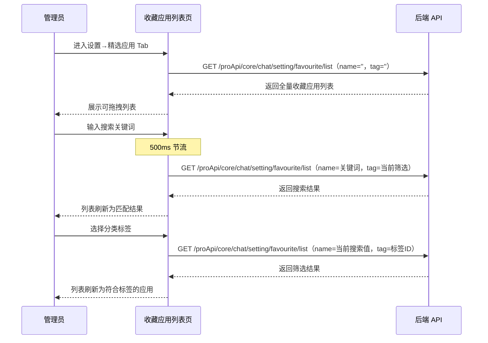
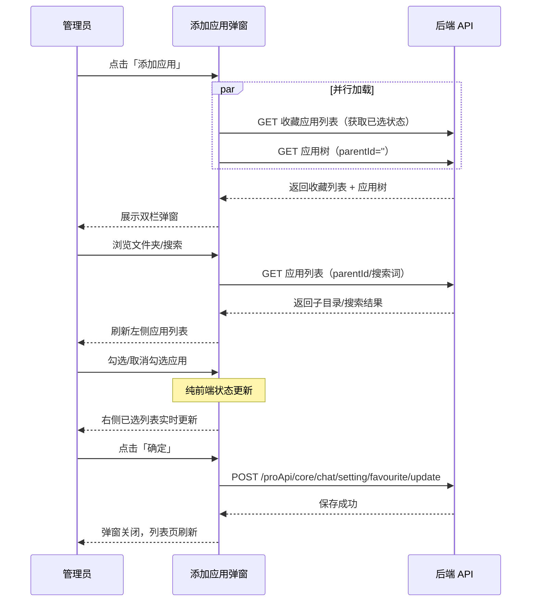
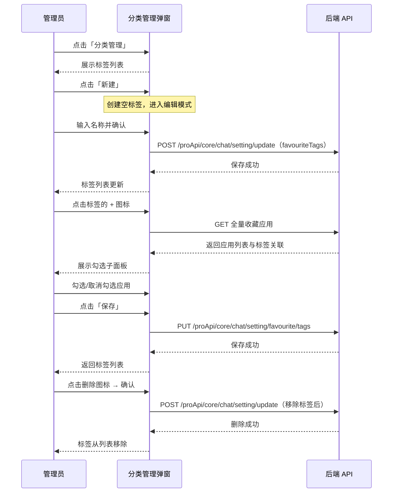
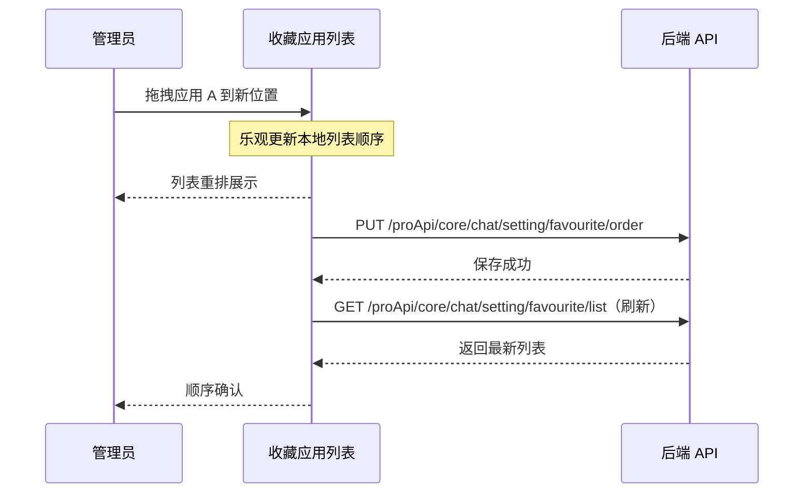
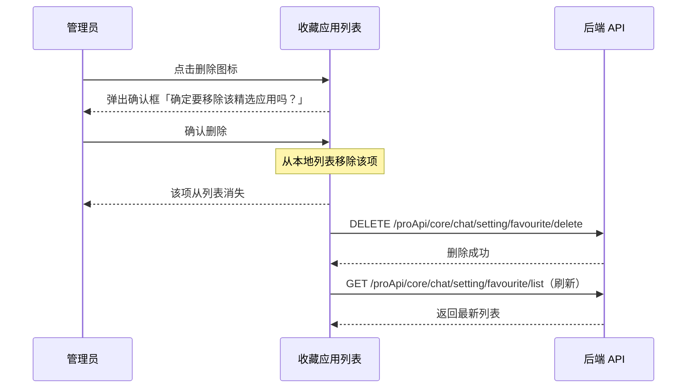

# 收藏应用 — 业务流程详解

## 页面总览

收藏应用管理页是对话设置中一个表单 + 列表管理视图，管理员在此集中管理团队的精选应用。页面顶部为工具栏区域（通过父组件 ChatSetting 的 SettingHeader 注入），包含搜索框、分类下拉筛选、分类管理按钮和添加应用按钮；下方为固定表头的可拖拽列表，每条记录展示应用名称、介绍、标签分类和删除操作。

页面加载时不显示全屏遮罩，仅在列表区域展示加载状态。列表为空时展示空状态提示。无嵌套 Tab 结构。

---

## S01：查看收藏应用列表

> 管理员进入收藏应用管理页，查看当前团队已配置的精选应用列表，支持按名称关键词搜索和按分类标签筛选。

#### 步骤 1：页面初始化

| 用户操作 | 触发 API | 分支条件 | 页面变化 |
|---------|---------|---------|---------|
| 从对话首页点击设置，再切换至精选应用 Tab | GET `/proApi/core/chat/setting/favourite/list` | 无分支，自动触发（manual: false） | 列表区域显示加载中状态；搜索框和筛选下拉为默认空值 |

列表初始加载时请求参数 `name` 和 `tag` 均为空字符串，获取全部收藏应用数据。加载完成后数据填充到本地状态 `localFavourites`，渲染为可拖拽列表。

#### 步骤 2：按名称搜索

| 用户操作 | 触发 API | 分支条件 | 页面变化 |
|---------|---------|---------|---------|
| 在搜索框中输入关键词 | GET `/proApi/core/chat/setting/favourite/list`（参数 name=关键词） | 输入内容变化即触发，500ms 节流 | 列表区域显示加载中状态；列表刷新为匹配结果 |

搜索为模糊匹配，由后端按应用名称筛选。搜索框使用 `react-hook-form` 的 `register` 绑定，输入值通过 `watchSearchValue` 监听并作为 `refreshDeps` 触发 API 重新请求。

#### 步骤 3：按分类标签筛选

| 用户操作 | 触发 API | 分支条件 | 页面变化 |
|---------|---------|---------|---------|
| 点击分类下拉框，选择某个标签 | GET `/proApi/core/chat/setting/favourite/list`（参数 tag=标签ID） | 选择变化即触发 | 列表刷新为仅包含该标签的应用；筛选值同步更新到 form 状态 |

下拉选项来自上下文 `chatSettings.favouriteTags`，第一项为固定选项「全部分类」（value 为空字符串）。下拉框使用 MySelect 组件，选择变化时通过 `setSearchValue('tag', tag)` 更新表单值。

#### 数据加载详情

| 加载阶段 | API | 关键参数 | 数据处理 | 渲染结果 |
|---------|-----|---------|---------|---------|
| 首次加载 | GET `/proApi/core/chat/setting/favourite/list` | name=''，tag='' | 直接写入 localFavourites 状态 | 表格展示全部收藏应用 |
| 搜索触发 | GET `/proApi/core/chat/setting/favourite/list` | name=关键词，tag=当前筛选值 | 直接替换 localFavourites | 表格展示搜索结果 |
| 筛选举发 | GET `/proApi/core/chat/setting/favourite/list` | name=当前搜索值，tag=标签ID | 直接替换 localFavourites | 表格展示符合标签的应用 |

- **分页参数**: 无分页，列表接口返回全量数据
- **排序规则**: 按 order 字段排序，默认新添加的应用 order 为 10000000
- **筛选条件**: name（应用名称模糊搜索）、tag（分类标签 ID 精确匹配），两个条件可组合
- **特殊列渲染**: 名称列显示应用头像 + 名称；介绍列超过宽度时截断省略，hover 时弹出完整文本；标签列最多显示 2 个标签，超出部分显示 "+N" 并在 hover 时弹出全部标签

### Mermaid 附录

---

## S02：添加收藏应用

> 管理员点击「添加应用」按钮打开弹窗，从应用树中浏览和勾选应用，提交后批量加入精选列表。

#### 步骤 1：打开添加弹窗

| 用户操作 | 触发 API | 分支条件 | 页面变化 |
|---------|---------|---------|---------|
| 点击顶部「添加应用」按钮 | GET `/proApi/core/chat/setting/favourite/list` + GET 应用列表接口 | 无分支 | 弹出添加应用模态弹窗；弹窗左侧加载应用树，右侧显示已选应用 |

弹窗打开时自动并行请求两个接口：获取当前已有的收藏应用列表（用于初始化已选状态）和根目录应用树列表。

#### 步骤 2：浏览应用树

| 用户操作 | 触发 API | 分支条件 | 页面变化 |
|---------|---------|---------|---------|
| 点击某个文件夹 | GET 应用列表接口（参数 parentId=文件夹ID） | 点击项为文件夹类型（AppTypeEnum.folder）时进入子目录 | 左侧列表刷新为该文件夹下的应用和子文件夹；顶部面包屑更新路径 |
| 点击面包屑路径中的某级目录 | GET 应用列表接口（参数 parentId=对应目录ID） | 无分支 | 左侧列表跳转到对应层级；面包屑路径缩短 |
| 点击面包屑「根目录」 | GET 应用列表接口（参数 parentId=''） | 无分支 | 返回根目录 |
| 在搜索框中输入关键词 | GET 应用列表接口（参数 searchKey=关键词） | 搜索模式下隐藏面包屑路径 | 左侧列表展示搜索结果（跨越目录层级） |

应用浏览器支持目录树导航和关键词搜索两种模式。搜索模式下显示「搜索结果」标签，面包屑隐藏。搜索输入 500ms 节流。

#### 步骤 3：勾选应用

| 用户操作 | 触发 API | 分支条件 | 页面变化 |
|---------|---------|---------|---------|
| 点击某个非文件夹应用行 / 其复选框 | 无 | 应用已在已选列表中 → 取消勾选；应用未在列表中 → 加入已选列表 | 该行复选框状态切换；右侧已选列表新增或移除该项 |

勾选操作纯前端状态管理，不调用 API。已选列表同步更新，右侧面板显示已选应用的头像、名称和移除按钮。添加时新应用插入到已选列表最前面。

#### 步骤 4：搜索已选应用

| 用户操作 | 触发 API | 分支条件 | 页面变化 |
|---------|---------|---------|---------|
| 在搜索框中输入后勾选/取消勾选 | GET `/proApi/core/chat/setting/favourite/list`（参数 name=搜索词） | 每 500ms 节流触发 | 用于判断搜索到的应用是否已加入收藏 |

在 AddFavouriteAppModal 中，搜索结果与已选状态通过本地状态关联，实现了勾选的即时反馈。

#### 步骤 5：提交保存

| 用户操作 | 触发 API | 分支条件 | 页面变化 |
|---------|---------|---------|---------|
| 点击「确定」按钮 | POST `/proApi/core/chat/setting/favourite/update`（参数：应用 ID 列表及 order） | 无分支 | 按钮显示加载状态；保存成功后弹窗关闭，列表页自动刷新 |

提交时将已选应用按顺序编号（order: 从 1 递增），以数组形式发送。保存成功后调用父组件传入的 `onRefresh` 回调刷新列表，弹窗关闭。

#### 步骤 6：取消操作

| 用户操作 | 触发 API | 分支条件 | 页面变化 |
|---------|---------|---------|---------|
| 点击「取消」按钮 | 无 | 无分支 | 弹窗关闭，列表不受影响 |

#### 表单与交互详情

**已选应用区域**：
- 每个已选项展示应用头像、名称、移除按钮
- 已选项之间无拖拽排序功能
- 已选项为空时展示空状态提示

**前后置条件**：
- **前置条件**: 团队下已有可添加的应用，用户有管理权限
- **后置影响**: 操作成功后应用加入精选列表，在对话首页和 FavouriteApp 侧栏中可见
- **失败场景**: 网络异常导致保存失败，弹窗保持打开，用户可重试

### Mermaid 附录

---

## S03：管理分类标签

> 管理员打开分类管理弹窗，对团队的精选应用分类标签进行创建、重命名、排序和删除，并可进入子面板为每个标签勾选归属应用。

#### 步骤 1：打开分类管理弹窗

| 用户操作 | 触发 API | 分支条件 | 页面变化 |
|---------|---------|---------|---------|
| 点击顶部「分类管理」按钮 | 无（标签数据从上下文 chatSettings.favouriteTags 读取） | 无分支 | 弹出分类管理模态弹窗；展示已有标签列表，每项显示标签名和应用数 |

弹窗标题为「共 N 个分类」，标签列表从上下文中读取并复制到本地状态 `localTags` 以便编辑。

#### 步骤 2：创建新标签

| 用户操作 | 触发 API | 分支条件 | 页面变化 |
|---------|---------|---------|---------|
| 点击「新建」按钮 | 无（本地状态变更） | 无分支 | 列表顶部插入一个空名称的新标签行，自动进入编辑模式，输入框自动聚焦 |

新标签 ID 由前端 `getNanoid(8)` 生成，名称为空。标签处于编辑中状态，用户可输入名称。标签数据仅在用户确认（回车或失焦）后才会保存到后端。

#### 步骤 3：编辑标签名称

| 用户操作 | 触发 API | 分支条件 | 页面变化 |
|---------|---------|---------|---------|
| 点击标签行的编辑图标 | 无 | 无分支 | 标签名称变为可编辑输入框，自动聚焦 |
| 修改名称后按回车或失焦 | POST `/proApi/core/chat/setting/update`（参数 favouriteTags=完整标签列表） | 名称为空时撤销编辑或删除新建标签 | 输入框退出编辑模式，标签名称更新；列表自动保存 |
| 在输入框中按 Escape 或清空后失焦（已有标签） | 无 | 还原为原始名称 | 退出编辑模式，名称还原 |

编辑态通过本地状态 `isEditing` 数组管理，每次编辑提交时将完整标签列表发送到更新接口。

#### 步骤 4：删除标签

| 用户操作 | 触发 API | 分支条件 | 页面变化 |
|---------|---------|---------|---------|
| 点击标签行的删除图标 | 无 | 弹出确认对话框（文案：「确认删除 {{name}} ？该分类下的应用将被移动至默认」） | 显示删除确认弹窗 |
| 确认删除 | POST `/proApi/core/chat/setting/update`（参数 favouriteTags=移除目标后的标签列表） | 无分支 | 标签从列表中移除；关联的应用标签自动清除 |

#### 步骤 5：为标签分配应用（子面板）

| 用户操作 | 触发 API | 分支条件 | 页面变化 |
|---------|---------|---------|---------|
| 点击标签行的添加应用图标（+号） | 无 | 无分支 | 弹窗内容切换为「标签分配应用」子面板 |
| 在子面板中勾选/取消勾选应用 | 无（纯前端状态变更） | 无分支 | 复选框状态切换；标签名旁的应用计数实时更新 |
| 搜索应用 | GET `/proApi/core/chat/setting/favourite/list`（name=搜索词） | 无分支 | 应用列表按名称筛选 |
| 点击「保存」 | PUT `/proApi/core/chat/setting/favourite/tags`（参数：全部收藏应用的标签数据） | 无分支 | 保存成功后退出子面板，标签列表页刷新 |

子面板进入时并行加载全量收藏应用（用于计算已勾选状态）和可见应用列表（用于渲染）。已勾选状态通过本地状态管理，提交时一次性写入全部应用的标签关联。

#### 步骤 6：拖拽排序标签

| 用户操作 | 触发 API | 分支条件 | 页面变化 |
|---------|---------|---------|---------|
| 拖拽标签行到新位置 | POST `/proApi/core/chat/setting/update`（参数：重排后的标签列表） | 无分支 | 拖拽释放后即时保存新顺序 |

### Mermaid 附录

---

## S04：拖拽排序

> 管理员通过拖拽手柄调整收藏应用的显示顺序，释放后自动保存新顺序。

#### 步骤 1：拖拽开始

| 用户操作 | 触发 API | 分支条件 | 页面变化 |
|---------|---------|---------|---------|
| 按住列表行的拖拽手柄（六点图标）并开始拖动 | 无 | 无分支 | 当前行被"拎起"，显示半透明拖拽预览；其他行保持原位 |

使用 `DndDrag` 和 `Draggable` 组件实现拖拽（基于 react-beautiful-dnd）。拖拽手柄仅在 hover 时显示视觉反馈。

#### 步骤 2：拖拽释放

| 用户操作 | 触发 API | 分支条件 | 页面变化 |
|---------|---------|---------|---------|
| 释放拖拽的行到目标位置 | PUT `/proApi/core/chat/setting/favourite/order`（参数：重排后全部应用 ID + 新 order） | 无分支 | 列表立即更新为新顺序；API 保存成功后静默刷新列表数据 |

拖拽结束回调执行两步操作：
1. 更新本地状态 `localFavourites` 中的 `order` 字段
2. 调用排序保存 API，成功后再次调用 `getApps()` 刷新列表以获取服务端确认数据

#### 前后置条件

- **前置条件**: 列表中有至少 2 个应用
- **后置影响**: 排序更新后，对话首页精选应用的展示顺序随之改变
- **失败场景**: API 保存失败时，由于本地状态已乐观更新，列表可能短暂显示新顺序后恢复（`getApps()` 失败则停留在本地状态）

### Mermaid 附录

---

## S05：删除收藏应用

> 管理员从精选列表移除某个应用，需二次确认。

#### 步骤 1：点击删除

| 用户操作 | 触发 API | 分支条件 | 页面变化 |
|---------|---------|---------|---------|
| 点击目标行的删除图标（垃圾桶） | 无 | 弹出确认弹窗（文案：「确定要移除该精选应用吗？」） | 删除图标所在位置显示确认弹窗 |

删除确认使用 PopoverConfirm 组件，类型为 `delete`，触发方式是点击删除图标按钮。

#### 步骤 2：确认删除

| 用户操作 | 触发 API | 分支条件 | 页面变化 |
|---------|---------|---------|---------|
| 在确认弹窗中点击确认 | DELETE `/proApi/core/chat/setting/favourite/delete`（参数 id=应用 _id） | 无分支 | 应用从列表中立即移除；后续行顺位补上，order 自动重新编号 |

删除采用乐观更新策略：先在本地状态中过滤掉目标项，重新计算后续项的 order，然后调用删除 API。无论 API 成功与否，都再次调用 `getApps()` 刷新列表以保证数据一致性。

#### 步骤 3：取消删除

| 用户操作 | 触发 API | 分支条件 | 页面变化 |
|---------|---------|---------|---------|
| 在确认弹窗中点击取消或点击弹窗外区域 | 无 | 无分支 | 确认弹窗关闭，列表不变 |

#### 删除链路详情

- **引用检查**: 无引用检查逻辑，可直接删除
- **确认弹窗**: 使用 PopoverConfirm（内联弹出确认框，非模态弹窗），类型为 delete；确认文案「确定要移除该精选应用吗？」
- **批量与单条差异**: 仅支持单条删除，不支持批量操作
- **级联影响**: 删除后对话首页该应用不再展示为精选；该应用在标签管理中的应用关联自动失效

### Mermaid 附录

